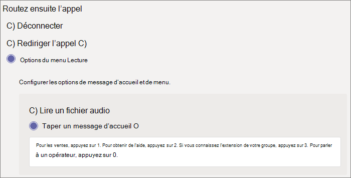

## Démonstration vidéo

Cette vidéo montre un exemple de base de la création d’un standard automatique dans Microsoft Teams.

> [!VIDEO https://www.microsoft.com/videoplayer/embed/RWEnCG?autoplay=false]

### Suivez ces étapes pour configurer votre standard automatique

# [Étape 1 - Informations générales](#tab/general-info)

## Informations générales

1. Tapez un nom pour le standard automatique dans la zone située en haut.

2. Pour désigner un opérateur, spécifiez la destination des appels à l’opérateur. Cette désignation est facultative (mais recommandée). Définissez l’option **Opérateur** pour permettre aux appelants de sortir des menus et de parler à une personne désignée.

3. Spécifiez le fuseau horaire de ce standard automatique. Le fuseau horaire est utilisé pour calculer les heures d’ouverture si vous [créez un flux d’appels distinct pour les heures supplémentaires](?tabs=after-hours).

4. Spécifiez une [langue prise en charge](../create-a-phone-system-auto-attendant-languages.md) pour ce standard automatique. Il s’agit du langage qui sera utilisé pour les invites vocales générées par le système.

5. Choisissez si vous souhaitez activer les entrées vocales. Lorsque cette option est activée, le nom de chaque option de menu devient un mot clé de reconnaissance vocale. Par exemple, les appelants peuvent dire « Un » pour sélectionner l’option de menu mappée à la clé 1, ou ils peuvent dire « Ventes » pour sélectionner l’option de menu nommée « Ventes ».

   > [!NOTE]
   > Si vous choisissez une langue à l’étape 4 qui ne prend pas en charge les entrées vocales, cette option est désactivée.

6. Sélectionnez **Suivant**.

# [Étape 2 - Flux d’appel](#tab/call-flow)

## Flux d’appels

Choisissez si vous souhaitez lire un message d’accueil lorsque le standard automatique répond à un appel.

Si vous **sélectionnez Lire un fichier audio**, vous pouvez utiliser le bouton **de fichier Télécharger** pour charger un message d’accueil enregistré enregistré sous forme audio. WAV, .MP3 ou . Format WMA. L’enregistrement ne peut pas dépasser 5 Mo.

Si vous sélectionnez **Tapez un message d’accueil** , le système lit le texte que vous tapez (jusqu’à 1 000 caractères) lorsque le standard automatique répond à un appel.

Choisissez la façon dont vous souhaitez acheminer l’appel.

Si vous sélectionnez **Déconnecter**, le standard automatique raccroche l’appel.

Si vous sélectionnez **l’appel de redirection**, vous pouvez choisir l’une des destinations de routage des appels.

Si vous **sélectionnez les options de menu Lecture**, vous pouvez choisir **de lire un fichier audio** ou **de taper un message d’accueil** , puis de choisir entre les options de menu et la recherche dans le répertoire.

### Options de menu

Pour les options de numérotation, affectez les clés 0-9 sur le clavier téléphonique à l’une des destinations de routage des appels. (Les clés \* (astérisque) et \# (livre) sont réservés par le système et ne peuvent pas être réattribués. Si vous appuyez sur l’une de ces touches, le menu actuel est répété.)

> [!NOTE]
> La touche # sauvegarde uniquement le standard automatique le plus récent. Une fois que la limite est franchie vers un nouveau standard automatique, la touche # ne peut pas vous amener à la précédente.

Les mappages de clés ne doivent pas nécessairement être continus. Il est possible de créer un menu avec les clés 0, 1 et 3 mappées aux options, tandis que la clé numéro 2 n’est pas utilisée.

Nous vous recommandons de mapper la clé zéro à l’opérateur si vous en avez configuré une. Si l’opérateur n’est défini sur aucune clé, la commande vocale « Opérateur » est également désactivée.

Pour chaque option de menu, spécifiez les paramètres suivants :

- **Clé de numérotation** : clé sur le clavier téléphonique pour accéder à cette option. Si des entrées vocales sont disponibles, les appelants peuvent également indiquer ce numéro pour accéder à l’option.

- **Commande vocale** : définit la commande vocale qu’un appelant peut donner pour accéder à cette option, si les entrées vocales sont activées. Il peut contenir plusieurs mots tels que « Service clientèle » ou « Opérations et motifs ». Par exemple, l’appelant peut appuyer sur 2, dire « deux » ou « Ventes » pour sélectionner l’option mappée aux deux clés. Ce texte est également affiché par synthèse vocale pour l’invite de confirmation de service, qui peut être quelque chose comme « Transfert de votre appel aux ventes ».

- **Rediriger vers** la destination de routage des appels utilisée lorsque les appelants choisissent cette option. Si vous effectuez une redirection vers un standard automatique ou une file d’attente d’appels, choisissez le compte de ressource qui lui est associé.

### Recherche dans l’annuaire

Si vous attribuez des clés de numérotation à des destinations, nous vous recommandons de choisir **Aucun** pour **la recherche dans l’annuaire**. Si un appelant tente de composer un nom ou une extension à l’aide de clés affectées à des destinations spécifiques, il peut être routée de manière inattendue vers une destination avant de terminer d’entrer le nom ou l’extension. Nous vous recommandons de créer un standard automatique distinct pour la recherche dans l’annuaire et d’y associer votre standard automatique principal avec une clé de numérotation.

Si vous n’avez pas affecté de clés de numérotation, choisissez une option pour **la recherche dans l’annuaire**.

**Numérotation par nom** : si vous activez cette option, les appelants peuvent indiquer le nom de l’utilisateur ou le taper sur le clavier téléphonique. Tout utilisateur en ligne ou tout utilisateur hébergé localement à l’aide de Skype Entreprise Server est un utilisateur éligible et peut être trouvé avec Dial par nom. (Vous pouvez définir qui est et n’est pas inclus dans le répertoire de la page [d’étendue De numérotation](?tabs=#dial-scope) .)

**Numérotation par extension** : si vous activez cette option, les appelants peuvent se connecter aux utilisateurs de votre organisation en composant leur extension téléphonique. Tout utilisateur en ligne ou tout utilisateur hébergé localement à l’aide de Skype Entreprise Server est un utilisateur éligible et peut être trouvé avec **Dial par extension**. (Vous pouvez définir qui est et n’est pas inclus dans le répertoire de la page [d’étendue De numérotation](?tabs=dial-scope) .)

Les utilisateurs que vous souhaitez rendre disponibles pour la numérotation par extension doivent avoir une extension spécifiée dans le cadre de l’un des attributs de téléphone suivants définis dans Active Directory (et synchronisés via Azure AD Connecter) ou Azure Active Directory. Pour plus d’informations, consultez [Ajouter des utilisateurs individuellement ou en bloc](/microsoft-365/admin/add-users/add-users).

- OfficePhone/TelephoneNumber (AD et Azure AD)
- HomePhone (AD)
- Mobile/MobilePhone (AD et Azure AD)
- OtherTelephone (AD)

Le format requis pour entrer l’extension dans le champ numéro de téléphone de l’utilisateur peut être l’un des formats suivants :

- *+\<phone number>;ext=\<extension>*
- *+\<phone number>X\<extension>*
- *X\<extension>*

- Exemple 1 : Set-MsolUser -UserPrincipalName usern@domain.com -Phonenumber « +15555555678;ext=5678 »
- Exemple 2 : Set-MsolUser -UserPrincipalName usern@domain.com -Phonenumber « +1555555678x5678 »
- Exemple 3 : Set-MsolUser -UserPrincipalName usern@domain.com -Phonenumber « x5678 »

Vous pouvez définir l’extension dans le [Centre d'administration Microsoft 365](https://admin.microsoft.com/) ou le [centre d’administration Azure Active Directory](https://aad.portal.azure.com). Jusqu’à 12 heures peuvent être nécessaires avant que les modifications ne soient disponibles pour les standards automatiques et les files d’attente d’appels.

> [!NOTE]
> Si vous souhaitez utiliser les fonctionnalités **Numérotation par nom** et **Numérotation par extension** , vous pouvez affecter une clé de numérotation sur votre standard automatique principal pour atteindre un standard automatique activé pour **Dial par nom**. Dans ce standard automatique, vous pouvez affecter la touche 1 (qui n’a aucune lettre associée) pour atteindre le standard automatique **Dial by extension** .

Pour plus d’informations, consultez [La numérotation et les références vocales](../dial-voice-reference.md).

Une fois que vous avez sélectionné une option **de recherche d’annuaire** , sélectionnez **Suivant**.

# [Étape 3 - Après les heures d’ouverture](#tab/after-hours)

## Flux d’appels après heures

Les heures d’ouverture peuvent être définies pour chaque standard automatique. Si ce n'est pas le cas, tous les jours et toutes les heures de la semaine seront considérés comme heures d'ouverture, car une planification 24/24 est définie par défaut. Les heures d’ouverture peuvent être définies avec des pauses dans le temps pendant la journée, et toutes les heures qui ne sont pas définies en tant qu’heures d’ouverture sont considérées comme après les heures d’ouverture. Vous pouvez définir différentes options de gestion des appels entrants et des messages d’accueil pour les heures d’après-midi.

Selon la façon dont vous avez configuré vos standards automatiques et vos files d’attente d’appels, vous devrez peut-être uniquement spécifier le routage des appels après les heures d’ouverture pour les standards automatiques avec des numéros de téléphone directs.

Si vous souhaitez séparer le routage des appels pour les appelants après les heures d’ouverture, spécifiez vos heures d’ouverture pour chaque jour. Sélectionnez **Ajouter une nouvelle heure** pour spécifier plusieurs ensembles d’heures pour un jour donné, par exemple, pour spécifier une pause déjeuner.

Une fois que vous avez spécifié vos heures d’ouverture, choisissez les options de routage des appels pour les heures supplémentaires. Les mêmes options sont disponibles que pour le routage des appels d’heures ouvrées que vous avez spécifié ci-dessus.

Sélectionnez **Suivant** lorsque vous avez terminé.

# [Étape 4 - Jours fériés](#tab/holidays)

## Flux d’appels pendant les jours fériés

Votre standard automatique peut avoir un flux [d’appels pour chaque congé que vous avez configuré](../set-up-holidays-in-teams.md). Vous pouvez ajouter jusqu'à 20 congés planifiés pour chaque standard automatique.

1. Dans la page Paramètres de l’appel de congés, sélectionnez **Ajouter**.

2. Tapez un nom pour ce paramètre de congé.

3. Dans la liste **déroulante Vacances** , choisissez les vacances que vous souhaitez utiliser.

4. Choisissez le type de message d’accueil que vous souhaitez utiliser.

    

5. Choisissez si vous souhaitez **déconnecter** ou **rediriger** l’appel.

6. Si vous avez choisi de rediriger, choisissez la destination de routage des appels pour l’appel.

7. Sélectionnez **Enregistrer**.

Répétez la procédure en fonction des besoins pour chaque congé supplémentaire.

Une fois que vous avez ajouté toutes vos vacances, sélectionnez **Suivant**.

# [Étape 5 - Portée de numérotation](#tab/dial-scope)

## Portée de numérotation

*L’étendue de numérotation* définit les utilisateurs disponibles dans le répertoire lorsqu’un appelant utilise le numérotation par nom ou numérotation par extension. La valeur par défaut de **Tous les utilisateurs en ligne** inclut tous les utilisateurs de votre organisation qui sont des utilisateurs en ligne ou hébergés localement à l’aide de Skype Entreprise Server.

Vous pouvez inclure ou exclure des utilisateurs spécifiques en sélectionnant Groupe **d’utilisateurs personnalisé** sous **Inclure** ou **Exclure** et en choisissant un ou plusieurs groupes Microsoft 365, listes de distribution ou groupes de sécurité. Par exemple, vous souhaiterez peut-être exclure les cadres de votre organisation du répertoire de numérotation. (Si un utilisateur se trouve dans les deux listes, il est exclu du répertoire.)

> [!NOTE]
> Le nom d’un nouvel utilisateur peut prendre jusqu’à 36 heures dans le répertoire.

Lorsque vous avez terminé de définir l’étendue de numérotation, sélectionnez **Suivant**.

# [Étape 6 - Comptes de ressources](#tab/resource-accounts)

## Comptes de ressources

Tous les standards automatiques doivent avoir un compte de ressources associé.  Les standards automatiques de premier niveau auront besoin d’au moins un compte de ressource associé à un numéro de service. Si vous le souhaitez, vous pouvez affecter plusieurs comptes de ressources à un standard automatique, chacun avec un numéro de service distinct.

Pour ajouter un compte de ressource, sélectionnez **Ajouter un compte** et recherchez le compte que vous souhaitez ajouter. Sélectionnez **Ajouter**, puis **sélectionnez Ajouter**.

Une fois que vous avez terminé d’ajouter des comptes de ressources, **sélectionnez Envoyer** pour terminer la configuration du standard automatique.

Pour plus d’informations, consultez [Gérer Teams comptes de ressources](../manage-resource-accounts.md).

---
