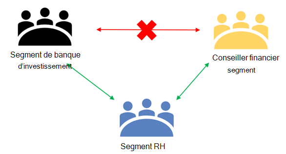
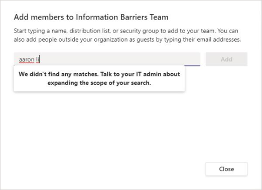
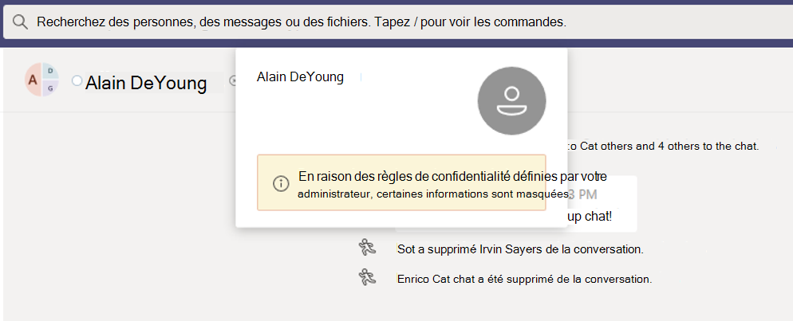

# <a name="information-barriers-in-microsoft-teams"></a>Barrières de l’information au Microsoft Teams

Les barrières à l’information sont les stratégies qu’un administrateur peut configurer pour empêcher des individus ou des groupes de communiquer entre eux. LesB sont utiles si, par exemple, un service gère des informations qui ne doivent pas être partagées avec d’autres services. Les IB sont également utiles lorsqu’un groupe doit être isolé ou empêché de communiquer avec des personnes extérieures à ce groupe.

Par Microsoft Teams, des barrières de l’information peuvent déterminer et empêcher les types suivants de collaboration non autorisée :

- Ajout d’un utilisateur à une équipe ou un canal
- Accès utilisateur au contenu d’une équipe ou d’un canal
- Accès utilisateur aux conversations 1:1 et de groupe
- Accès utilisateur aux réunions
- Elle empêche les recherches et la découverte. Les utilisateurs ne seront pas visibles dans le s sélectionneur de personnes.

>[!NOTE]
>- Les groupes de barrière de l’information ne peuvent pas être créés entre des locataires.
>- L’utilisation de bots, Azure Active Directory (Azure AD), d’API pour envoyer des notifications de flux d’activité et de certains API pour ajouter des utilisateurs n’est pas prise en charge dans la version 1.
>- Les canaux privés respectent les stratégies de protection des informations que vous configurez.
>- Pour plus d’informations sur la prise en charge des barrières SharePoint sites connectés à Teams, voir [Segments associés à Microsoft Teams sites web.](/sharepoint/information-barriers#segments-associated-with-microsoft-teams-sites)

## <a name="background"></a>Arrière-plan

Le principal moteur des IB provient du secteur des services financiers. L’Autorité de réglementation du secteur financier[(FINRA)]( https://www.finra.org)examine les B/S et les conflits d’intérêts au sein des entreprises membres et fournit des conseils sur la gestion de ces conflits (FINRA 2241, réglementation en matière de recherche de crédit [15-31).](https://www.finra.org/sites/default/files/Regulatory-Notice-15-31_0.pdf)

Toutefois, depuis l’introduction des IB, de nombreux autres domaines les ont trouvés utiles. Les autres scénarios courants sont les suivants :

- **Éducation**: Les étudiants d’une école ne peuvent pas rechercher les coordonnées des étudiants d’autres écoles.
- **Juridique**: préserver la confidentialité des données obtenues par l’entreprise d’un client et empêcher l’accès à celles-ci par une entreprise qui représente un autre client.
- **Gouvernement :** L’accès et le contrôle des informations sont limités entre les départements et groupes.
- **Professional services aux** invités : un groupe de personnes dans une entreprise peut uniquement discuter avec un client ou un client spécifique via l’accès invité pendant un engagement de client.

Par exemple, Enric appartient au segment Banque et Ppep au segment Conseiller financier. Enric et Ppep ne peuvent pas communiquer entre eux, car la stratégie de l’organisation L’organisation bloque la communication et la collaboration entre ces deux segments. Cependant, Enrico et P matièreep peuvent communiquer avec Lee dans les ressources humaines.



## <a name="when-to-use-information-barriers"></a>Quand utiliser les barrières de l’information

Vous souhaitez peut-être utiliser des IB dans les situations comme celles-ci :

- Une équipe doit être empêchée de communiquer ou de partager des données avec une autre équipe spécifique.
- Une équipe ne doit pas communiquer ou partager des données avec des personnes extérieures à l’équipe.

Le service d’évaluation des stratégies de barrière des informations détermine si une communication est conforme aux stratégies de l’organisation.

## <a name="managing-information-barrier-policies"></a>Gestion des stratégies de barrière de l’information

Les stratégies DE L’organisation sont gérées dans le Centre Microsoft 365 conformité de l’entreprise à l’aide d’lets PowerShell. Pour plus d’informations, voir [Définir les stratégies pour les barrières à l’information.](/office365/securitycompliance/information-barriers-policies)

>[!IMPORTANT]
>Avant de configurer ou de définir des stratégies, vous devez activer la recherche dans l’annuaire étendue dans Microsoft Teams. Patientez au moins quelques heures après avoir mis en place la recherche étendue dans l’annuaire avant de configurer ou de définir des stratégies pour les barrières de l’information. Pour plus d’informations, voir [Définir les stratégies de barrière de l’information.](/office365/securitycompliance/information-barriers-policies#prerequisites)

## <a name="information-barriers-administrator-role"></a>Rôle d’administrateur de barrière de l’information

Le rôle de gestion de la conformité de l’organisation est responsable de la gestion des stratégies de l’organisation. Pour plus d’informations sur ce rôle, voir [Autorisations dans le Centre Microsoft 365 conformité.](/office365/securitycompliance/permissions-in-the-security-and-compliance-center)

## <a name="information-barrier-triggers"></a>Déclencheurs de barrière de l’information

Les stratégies IB sont activées lorsque les événements Teams événements suivants sont activés :

- **Les membres sont ajoutés** à une équipe : chaque fois que vous ajoutez un utilisateur à une équipe, sa stratégie doit être évaluée par rapport aux stratégies DE l’organisation des autres membres de l’équipe. Une fois l’utilisateur ajouté, il peut effectuer toutes les fonctions de l’équipe sans autres vérifications. Si la stratégie de l’utilisateur empêche son ajout à l’équipe, l’utilisateur n’est pas dans la recherche.

    

- **Une** nouvelle conversation est demandée : chaque fois qu’un utilisateur demande une nouvelle conversation avec un ou plusieurs autres utilisateurs, la conversation est évaluée pour s’assurer qu’elle n’enfreinait aucune stratégie de l’organisation. Si la conversation ne respecte pas la stratégie de l’organisation, la conversation n’est pas démarrée.

    Voici un exemple de conversation en deux:

    

    Voici un exemple de conversation de groupe.

    

- Un utilisateur est invité à participer à une réunion : lorsqu’un utilisateur est invité à participer à une réunion, la stratégie DNS qui s’applique à l’utilisateur est évaluée par rapport aux stratégies DEXT qui s’appliquent aux autres membres de l’équipe. En cas de violation, l’utilisateur n’est pas autorisé à participer à la réunion.

    

- Un écran est partagé entre deux utilisateurs ou plus : lorsqu’un utilisateur partage un écran avec d’autres utilisateurs, le partage doit être évalué afin de s’assurer qu’il ne constitue pas une violation des stratégies DE l’organisation. En cas de violation d’une stratégie de l’organisation, le partage d’écran n’est pas autorisé.

    Voici un exemple de partage d’écran avant l’application de la stratégie.

    

    Voici un exemple de partage d’écran après l’application de la stratégie. Les icônes de partage d’écran et d’appel ne sont pas visibles.

    

- Un utilisateur passe un appel téléphonique dans **Teams**: chaque fois qu’un utilisateur passe un appel vocal (via VOIP) à un autre utilisateur ou groupe d’utilisateurs, l’appel est évalué pour s’assurer qu’il ne enfreint pas les stratégies de l’organisation. En cas de violation, l’appel vocal est bloqué.

- **Invités dans Teams**: les stratégies DE l’organisation d’entreprise s’appliquent également aux Teams invités. Si les invités doivent être utilisables dans la liste d’adresses globale de votre organisation, voir Gérer l’accès invité [dans Microsoft 365 groupes.](/microsoft-365/admin/create-groups/manage-guest-access-in-groups) Une fois que les invités sont découvrons, vous pouvez [définir les stratégies de l’organisation.](/office365/securitycompliance/information-barriers-policies)

## <a name="how-policy-changes-impact-existing-chats"></a>Impact des modifications de stratégie sur les conversations existantes

Lorsque l’administrateur de stratégie de l’organisation modifie une stratégie ou lorsqu’une modification de stratégie est activée en raison d’une modification du profil d’un utilisateur (par exemple, pour un changement de poste), le service d’évaluation de la stratégie de barrière des informations recherche automatiquement les membres pour s’assurer que leur appartenance à l’équipe ne constitue pas une violation des stratégies.

S’il existe une conversation ou une autre communication entre utilisateurs, et qu’une nouvelle stratégie est définie ou qu’une stratégie existante est modifiée, le service évalue les communications existantes pour s’assurer que les communications sont toujours autorisées à se produire. 

- **Conversation 1:1**: si la communication entre deux utilisateurs n’est plus autorisée (en raison de l’application à l’un ou aux deux utilisateurs d’une stratégie qui bloque la communication), toute communication supplémentaire est bloquée. Leurs conversations existantes deviennent en lecture seule.

    Voici un exemple qui montre que la conversation est visible.

    

    Voici un exemple qui montre que la conversation est désactivée.

    

- Conversation de groupe : si la communication d’un utilisateur à un groupe n’est plus autorisée (par exemple, en raison de la changement de tâches d’un utilisateur), l’utilisateur, ainsi que les autres utilisateurs dont la participation ne respecte pas la stratégie, peut être supprimé de la conversation de groupe et toute autre communication avec le groupe n’est pas autorisée. L’utilisateur peut toujours voir les anciennes conversations, mais ne peut pas voir et participer à de nouvelles conversations avec le groupe. Si la stratégie nouvelle ou modifiée qui empêche la communication est appliquée à plusieurs utilisateurs, les utilisateurs concernés par la stratégie peuvent être supprimés de la conversation de groupe. Ils peuvent toujours voir les anciennes conversations.

  Dans cet exemple, Enric a été déplacé vers un autre service au sein de l’organisation et retiré de la conversation de groupe.

  

  Enrico ne peut plus envoyer de messages à la conversation de groupe.

  

- **Équipe**: tous les utilisateurs supprimés du groupe sont supprimés de l’équipe et ne peuvent pas voir et participer à des conversations existantes ou nouvelles.

## <a name="scenario-a-user-in-an-existing-chat-becomes-blocked"></a>Scénario : Un utilisateur dans une conversation existante devient bloqué

Actuellement, les utilisateurs sont les scénarios suivants si une stratégie DE L’organisation bloque un autre utilisateur :

- **Onglet Personnes :** Un utilisateur ne peut pas voir les utilisateurs bloqués sous l’onglet Personnes. 

- **S sélectionneur de personnes**: les utilisateurs bloqués ne seront pas visibles dans le s sélectionneur de personnes.

    

- **Onglet Activité**: Si un utilisateur visite l’onglet **Activité** d’un utilisateur bloqué, aucune billet n’apparaît. **(L’onglet** Activité affiche uniquement les publications de canal et il n’existe aucun canal commun entre les deux utilisateurs.)

    Voici un exemple de l’affichage de l’onglet Activité bloqué.

    

- **Organigrammes**: si un utilisateur accède à un organigramme sur lequel un utilisateur bloqué apparaît, l’utilisateur bloqué n’apparaîtra pas dans l’organigramme. Un message d’erreur s’affiche à la place.

- **Carte personnes**: si un utilisateur participe à une conversation et qu’il est bloqué par la suite, les autres utilisateurs voient un message d’erreur au lieu de la carte de la personne lorsqu’ils pointent sur le nom de l’utilisateur bloqué. Les actions répertoriées sur la carte (telles que les appels et les discussions) ne seront pas disponibles.

- **Contacts suggérés**: Les utilisateurs bloqués n’apparaissent pas dans la liste des contacts suggérés (liste de contacts initiale qui s’affiche pour les nouveaux utilisateurs).

- **Contacts de conversation**: un utilisateur peut voir les utilisateurs bloqués dans la liste de contacts des conversations, mais les utilisateurs bloqués seront identifiés. La seule action que l’utilisateur peut effectuer sur les utilisateurs bloqués consiste à les supprimer. L’utilisateur peut également le sélectionner pour afficher son passé.

- **Appels :** un utilisateur peut voir les utilisateurs bloqués dans la liste de contacts d’appels, mais les utilisateurs bloqués seront identifiés. La seule action que l’utilisateur peut effectuer sur le bloc d’utilisateurs consiste à les supprimer.

    Voici un exemple d’utilisateur bloqué dans la liste de contacts d’appels.

    > [!div class="mx-imgBorder"]
    > 

    Voici un exemple de conversation désactivée pour un utilisateur dans la liste de contenu des appels.

    > [!div class="mx-imgBorder"]
    > 

- **Skype** migration vers Teams : lors d’une migration de Skype Entreprise vers Teams, tous les utilisateurs, même les utilisateurs bloqués par les stratégies de l’organisation, seront migrés vers Teams. Ces utilisateurs sont ensuite gérés comme décrit ci-dessus.

## <a name="teams-policies-and-sharepoint-sites"></a>Teams stratégies et sites SharePoint web

Lorsqu’une équipe est créée, un site SharePoint est mis en service et associé Microsoft Teams aux fichiers. Les stratégies de barrière de l’information ne sont pas respecter sur SharePoint site et fichiers par défaut. Pour faire tomber les barrières de l’information SharePoint et OneDrive, suivez les instructions et les [étapes](/sharepoint/information-barriers#enable-sharepoint-and-onedrive-information-barriers-in-your-organization) qui permettent d’utiliser les barrières de l’information grâce SharePoint’article.

## <a name="information--barrier-modes-and-teams"></a>Modes et modes de barrière de l’Teams

Le mode Barrières de l’information permet d’renforcer les personnes qui peuvent être ajoutées ou supprimées d’une équipe. Lors de l’utilisation des barrières de l Teams, les modes de l’organisation sont pris en charge :

- **Ouvrir**: Cette configuration est le mode PAR défaut DE LN pour tous les groupes existants qui ont été provisionés avant l’ouverture d’une barrière de l’information. Dans ce mode, aucune stratégie DE l’organisation n’est applicable.
- **Implicite**: cette configuration est le mode IB par défaut lorsqu’une équipe est mise en service après l’activation des barrières de l’information. Le mode implicite vous permet d’ajouter tous les utilisateurs compatibles du groupe.

Microsoft 365 Les groupes créés avant l’activation d’une stratégie de barrière de l’information sont automatiquement réglés sur *le* mode Ouvrir par défaut. Après avoir activé les stratégies DE l’ORGANISATION sur votre client, vous devez mettre à jour le mode de mise à jour pour évaluer à nouveau les groupes et les sites et entraîner la suppression automatique des utilisateurs non conformes de ces groupes et sites. Si vous devez modifier la configuration du *mode* Ouvrir sur les groupes connectés à Teams existants afin de respecter les exigences de conformité de votre organisation, vous devez mettre à jour les modes IB pour les [sites](/sharepoint/information-barriers.md#view-and-manage-IB-mode-as-an-administrator-with-SharePoint-PowerShell) SharePoint connectés à l’équipe Teams.

Utilisez [l’cmdlet Set-UnifiedGroup](/powershell/module/exchange/set-unifiedgroup) avec le paramètre *InformationBarrierMode* correspondant au mode que vous voulez utiliser pour vos segments. Les listes de valeurs autorisées pour le *paramètre InformationBarrierMode* sont *Ouvertes* et *implicites.*

Par exemple, pour configurer le *mode* implicite pour un groupe Microsoft 365, vous devez utiliser la commande PowerShell suivante :

```powershell
Set-UnifiedGroup -InformationBarrierMode Implicit
```

Pour plus d’informations sur la manière dont les utilisateurs peuvent être automatiquement supprimés des groupes, voir l’article [(prévisualisation)](/sharepoint/information-barriers-compliance-assistant) de l’Assistant Protection des informations.

## <a name="required-licenses-and-permissions"></a>Licences et autorisations requises

Pour plus d’informations sur les licences et autorisations, les plans et les prix Microsoft 365, voir les conseils en matière de licences pour & [conformité.](/office365/servicedescriptions/microsoft-365-service-descriptions/microsoft-365-tenantlevel-services-licensing-guidance/microsoft-365-security-compliance-licensing-guidance)

## <a name="known-issues"></a>Problèmes connus

- Les utilisateurs ne peuvent pas participer à des réunions ad hoc : si les stratégies de **l’ORGANISATION sont activées,** les utilisateurs ne sont pas autorisés à participer à des réunions si la taille de la liste de réunions est supérieure aux limites de participation aux [réunions.](limits-specifications-teams.md) La raison principale est que les vérifications de l’organisation de l’organisation dépendent du fait que les utilisateurs peuvent être ajoutés à une liste de conversation de réunion et que seul le moment où ils peuvent y être ajoutés est autorisé à participer à la réunion. Un utilisateur rejoignant une réunion l’ajoute à la liste ; par conséquent, pour les réunions périodiques, la liste peut se remplir rapidement. Une fois que la liste de conversation a atteint le nombre limite de participation à la réunion, d’autres [utilisateurs](limits-specifications-teams.md)ne peuvent plus être ajoutés à la réunion. Si l’organisation est activée et que la liste de discussion est pleine pour une réunion, les nouveaux utilisateurs (utilisateurs qui ne sont pas déjà dans la liste) ne sont pas autorisés à participer à la réunion. Toutefois, si l’offre IB n’est pas activée pour l’organisation et que la liste de discussion de la réunion est pleine, les nouveaux utilisateurs (ceux qui ne sont pas déjà dans la liste) sont autorisés à participer à la réunion, même s’ils ne voient pas l’option de conversation dans la réunion. Une solution à court terme consiste à supprimer les membres inactifs de la liste de conversation de réunion afin de faire de l’espace pour les nouveaux utilisateurs. Nous augmenterons toutefois la taille des listes de conversation de réunion à une date ultérieure.
- **Les utilisateurs ne peuvent** pas participer aux réunions de canal : si les stratégies de l’organisation sont activées, les utilisateurs ne sont pas autorisés à participer aux réunions de canal si ils ne sont pas membres de l’équipe. La raison principale est que les vérifications de l’organisation de l’organisation dépendent du fait que les utilisateurs peuvent être ajoutés à une liste de conversation de réunion et que seul le moment où ils peuvent y être ajoutés est autorisé à participer à la réunion. Le thread de conversation dans une réunion de canal est disponible uniquement pour les membres de l’équipe/canal, et les non-membres ne peuvent pas voir ou accéder au fil de conversation. Si l’organisation est activée et qu’un membre non-équipe tente de rejoindre une réunion de canal, cet utilisateur n’est pas autorisé à participer à la réunion. Toutefois, si  l’organisation n’est pas activée et qu’un membre autre qu’un membre de l’équipe tente de participer à une réunion de canal, l’utilisateur est autorisé à participer à la réunion, mais l’option de conversation ne s’y trouve pas.
- **Nombre maximal de segments autorisés dans** une organisation : chaque organisation peut configurer jusqu’à 100 segments lors de la configuration des stratégies de l’organisation. Il n’y a pas de limite au nombre de stratégies qui peuvent être configurées.
- Les **stratégies DE l’ORGANISATION** ne fonctionnent pas pour les utilisateurs fédérés : si vous autorisez la fédération avec des organisations externes, les utilisateurs de ces organisations ne seront pas limités par les stratégies de l’organisation. Si les utilisateurs de votre organisation participent à une conversation ou à une réunion organisée par des utilisateurs fédérés externes, les stratégies DE l’organisation ne limitent pas non plus la communication entre les utilisateurs de votre organisation.

## <a name="more-information"></a>Plus d’informations

- Pour en savoir plus sur les IB, consultez la [barrière des informations.](/office365/securitycompliance/information-barriers)
- Pour configurer les stratégies de l’organisation, voir [Mise en place des obstacles à la mise](/office365/securitycompliance/information-barriers-policies)en œuvre des informations.
- Pour modifier ou supprimer des stratégies d’ING, voir [Gérer les stratégies de protection contre la barrière des informations.](/microsoft-365/compliance/information-barriers-edit-segments-policies)

## <a name="availability"></a>Disponibilité

- La fonctionnalité est disponible dans notre cloud public. En janvier 2021, nous avons déployé des barrières à l’information dans Cloud de la communauté du secteur public cloud.
- La fonctionnalité n’est pas encore disponible dans les Cloud de la communauté du secteur public nuages haut et DOD.
