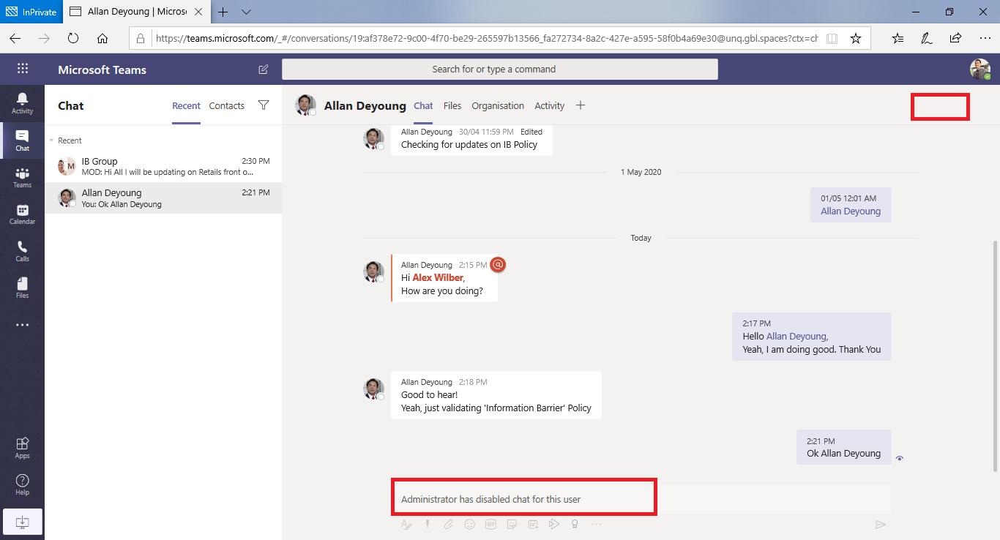

# Obstacles liés à l’information dans Microsoft teamsInformation barriers in Microsoft Teams

Les barrières d’information (IB) sont des stratégies qu’un administrateur peut configurer pour empêcher des personnes ou des groupes de communiquer entre eux.Information barriers (IB) are policies that an admin can configure to prevent individuals or groups from communicating with each other. Cela peut s’avérer utile si, par exemple, un service gère des informations qui ne doivent pas être partagées avec d’autres services ou si un groupe doit être empêché ou être isolé de communiquer avec des personnes extérieures à ce groupe.This is useful if, for example, one department is handling information that shouldn't be shared with other departments or a group needs to be prevented, or isolated, from communicating with anyone outside of that group.

> [!NOTE]
> - Les groupes de barrière d’information ne peuvent pas être créés entre des clients.Information barrier groups cannot be created across tenants.
> - L’utilisation de robots pour ajouter des utilisateurs n’est pas prise en charge dans la version 1.Using bots to add users is not supported in version 1.
> - Les canaux privés sont conformes aux stratégies de barrière des informations que vous configurez.Private channels are compliant to information barrier policies that you configure.
> - Nouveauté : la prise en charge de la protection des informations pour un site SharePoint connecté à teams est désormais en préversion privée.New: Information barrier support for SharePoint site connected to Teams is now in Private Preview. Cliquez [ici](https://forms.office.com/Pages/ResponsePage.aspx?id=v4j5cvGGr0GRqy180BHbR3-O9WDTKhhDtgWfphwS9YhUM0hJNklNRkZKMlhLNDRZNzlEQlVDSjdZVi4u) pour participer à la préversion privée.Click [here](https://forms.office.com/Pages/ResponsePage.aspx?id=v4j5cvGGr0GRqy180BHbR3-O9WDTKhhDtgWfphwS9YhUM0hJNklNRkZKMlhLNDRZNzlEQlVDSjdZVi4u) to participate in the private preview.

Les stratégies de barrage d’information empêchent également les recherches et la découverte.Information barrier policies also prevent lookups and discovery. En d’autres termes, si vous essayez de communiquer avec une personne sans communiquer, vous ne trouverez pas cet utilisateur dans le sélecteur de personnes.This means that if you attempt to communicate with someone you should not be communicating with, you will not find that user in the people picker.

## Arrière-planBackground

Le principal pilote pour les barrières d’information provient du secteur des services financiers.The primary driver for information barriers comes from the financial services industry. Les autorités compétentes de l’industrie bancaire ([FINRA]( http://www.finra.org)) vérifient les obstacles et conflits d’intérêt dans les entreprises membres et fournissent des instructions sur la gestion de ces conflits (FINRA 2241, [avis de réglementation 15-31](http://www.finra.org/sites/default/files/Regulatory-Notice-15-31_0.pdf).The Financial Industry Regulatory Authority ([FINRA]( http://www.finra.org)) reviews information barriers and conflicts of interest within member firms and provides guidance as to how to manage such conflicts (FINRA 2241, [Debt Research Regulatory Notice 15-31](http://www.finra.org/sites/default/files/Regulatory-Notice-15-31_0.pdf).  

Toutefois, dans la mesure où il existe des obstacles d’information, de nombreux autres domaines ont été utiles.However, since introducing information barriers, many other areas have found them to be useful. Les autres scénarios courants sont les suivants :Other common scenarios include:

- Formation : les étudiants au sein d’une école ne peuvent pas chercher les coordonnées des étudiants de votre établissement scolaire.Education: Students in one school aren't able to look up contact details for students of other schools.
- Légal : conservation de la confidentialité des données obtenues par le juriste d’un client par le biais d’un juriste pour la même entreprise représentant un client différent.Legal: Maintaining confidentiality of data obtained by the lawyer of one client from being accessed by a lawyer for the same firm representing a different client.
- Secteur public : le contrôle et l’accès aux informations sont limités entre les services et les groupes.Government: Information access and control is limited across departments and groups.
- Services professionnels : un groupe de personnes dans une société est uniquement en mesure de dialoguer avec un client ou un client spécifique via une Fédération ou un accès invité lors d’un engagement client.Professional services: A group of people in a company is only able to chat with a client or specific customer via federation or guest access during a customer engagement.

Par exemple, Enrico appartient au segment bancaire et Pradeep appartient au segment du conseiller financier.For example, Enrico belongs to the Banking segment and Pradeep belongs to the Financial advisor segment. Enrico et Pradeep ne peuvent pas communiquer entre eux, car la stratégie IB de l’organisation bloque la communication et la collaboration entre ces deux segments.Enrico and Pradeep can't communicate with each other because the organization's IB policy blocks communication and collaboration between these two segments. Toutefois, Enrico et Pradeep peuvent communiquer avec Lee dans HR.However, Enrico and Pradeep can communicate with Lee in HR.

## Quand utiliser les barrières d’informationWhen to use information barriers

Vous souhaiterez peut-être utiliser les barrières d’information dans les situations suivantes :You might want to use information barriers in situations like these:

- Une équipe doit être empêché de communiquer et de partager des données avec une autre équipe spécifique.A team must be prevented from communicating or sharing data with a specific other team.
- Une équipe ne doit pas communiquer et partager des données avec une personne en dehors de l’équipe.A team must not communicate or share data with anyone outside of the team.

Le service d’évaluation de la stratégie d’obstacle des informations détermine si une communication est conforme aux stratégies de cloisonnement des informations.The Information Barrier Policy Evaluation Service determines whether a communication complies with information barrier policies.

## Gestion des stratégies de cloisonnement des informationsManaging information barrier policies

Les stratégies de barrière des informations sont gérées dans le centre de conformité Microsoft 365 (SCC) à l’aide des cmdlets PowerShell.Information barrier policies are managed in the Microsoft 365 Compliance Center (SCC) using PowerShell cmdlets. Pour plus d’informations, consultez [définir des stratégies pour les barrières d’information](https://docs.microsoft.com/office365/securitycompliance/information-barriers-policies).For more information, see [Define policies for information barriers](https://docs.microsoft.com/office365/securitycompliance/information-barriers-policies).

> [!IMPORTANT]
> Avant de configurer ou de définir des stratégies, **vous devez activer la recherche dans l’annuaire d’étendues dans Microsoft teams**.Before you set up or define policies, **you must enable scoped directory search in Microsoft Teams**. Patientez au moins quelques heures après l’activation de la recherche dans l’annuaire étendue avant de configurer ou de définir des stratégies pour les barrières d’information.Wait at least a few hours after enabling scoped directory search before you set up or define policies for information barriers. [En savoir plus sur les conditions préalables pour les barrières d’information](https://docs.microsoft.com/office365/securitycompliance/information-barriers-policies#prerequisites).[Learn more about prerequisites for information barriers](https://docs.microsoft.com/office365/securitycompliance/information-barriers-policies#prerequisites).

## Rôles d’administrateur de barrières d’informationInformation barriers administrator role

Le rôle de gestion de la conformité IB est responsable de la gestion des stratégies de barrière des informations.The IB Compliance Management role is responsible for managing information barrier policies. Pour plus d’informations sur ce rôle, voir [autorisations dans le centre de conformité Microsoft 365](https://docs.microsoft.com/office365/securitycompliance/permissions-in-the-security-and-compliance-center).For more information about this role, see [Permissions in the Microsoft 365 Compliance Center](https://docs.microsoft.com/office365/securitycompliance/permissions-in-the-security-and-compliance-center).

## Gâchettes de barrière d’informationInformation barrier triggers

Les stratégies de barrage d’information sont activées lorsque les événements d’équipe suivants se produisent :Information barrier policies are activated when the following Teams events take place:

- Les **membres sont ajoutés à une équipe** , chaque fois que vous ajoutez un utilisateur à une équipe, la stratégie de l’utilisateur doit être évaluée par rapport aux stratégies de barrage des informations des autres membres de l’équipe.**Members are added to a team** - Whenever you add a user to a team, the user's policy must be evaluated against the information barrier policies of other team members. Une fois que l’utilisateur a été ajouté, l’utilisateur peut exécuter toutes les fonctions de l’équipe sans vérification supplémentaire.After the user is successfully added, the user can perform all functions in the team without further checks. Si la stratégie de l’utilisateur les empêche de l’ajouter à l’équipe, l’utilisateur n’affichera pas la recherche.If the user's policy blocks them from being added to the team, the user will not show up in search.

    

- **Une nouvelle conversation est demandée** -chaque fois qu’une nouvelle discussion est demandée entre deux utilisateurs ou plus, la discussion est évaluée pour s’assurer qu’elle ne viole aucune stratégie de barrière des informations.**A new chat is requested** - Each time a new chat is requested between two or more users, the chat is evaluated to make sure that it isn't violating any information barrier policies. Si la conversation ne respecte aucune stratégie d’obstacle d’information, la conversation n’est pas lancée.If the conversation violates an information barrier policy, then the conversation isn't initiated.

    Voici un exemple de discussion 1:1.Here's an example of a 1:1 chat.

     

    Voici un exemple de discussion de groupe.Here's an example of a group chat.

    

- **Un utilisateur est invité à rejoindre une réunion** : lorsque l’utilisateur est invité à rejoindre une réunion, la stratégie de l’utilisateur est évaluée par rapport aux politiques des autres membres de l’équipe, et en cas de violation, l’utilisateur n’est pas autorisé à rejoindre la réunion.**A user is invited to join a meeting** - When a user is invited to join a meeting, the user's policy is evaluated against the policies of other team members, and if there's a violation, the user will not be allowed to join the meeting.

    

- **Un écran est partagé entre** plusieurs utilisateurs, chaque fois qu’un écran est partagé entre deux utilisateurs ou plus, le partage d’écran doit être évalué pour s’assurer qu’il ne respecte pas les stratégies de barrage des informations d’autres utilisateurs.**A screen is shared between two or more users** - Any time a screen is shared between two or more users, the screen share must be evaluated to make sure that it doesn't violate the information barrier policies of other users. Dans le cas contraire, le partage d’écran ne sera pas autorisé.If an information barrier policy is violated, the screen share won't be allowed. 
 
    Voici un exemple de partage d’écran avant l’application de la stratégie.Here's an example of screen share before the policy is applied. 

    

    Voici un exemple de partage d’écran après l’application de la stratégie.Here's an example of screen share after the policy is applied. Les icônes de partage d’écran et d’appel ne sont pas visibles.The screen share and call icons aren't visible.

    

- **Un utilisateur place un appel téléphonique (VoIP) dans teams** : chaque fois qu’un utilisateur est lancé par un utilisateur ou à un groupe d’utilisateurs, l’appel est évalué pour s’assurer qu’il ne respecte pas les stratégies de barrage des informations des autres membres de l’équipe.**A user places a phone call (VOIP) in Teams** - Any time a voice call is initiated by a user to another user or group of users, the call is evaluated to make sure that it doesn't violate the information barrier policies of other team members. En cas de violation, l’appel audio est bloqué.If there is any violation, the voice call is blocked.
- **Utilisateurs invités dans teams** : les stratégies de barrière des informations s’appliquent également aux utilisateurs invités dans Teams.**Guest users in Teams** - Information barrier policies apply to guest users in Teams too. Si les utilisateurs invités doivent être détectables dans la liste d’adresses globale de votre organisation, voir [gérer l’accès invité dans les groupes Microsoft 365](https://docs.microsoft.com/microsoft-365/admin/create-groups/manage-guest-access-in-groups).If guest users need to be discoverable in your organization's global address list, see [Manage guest access in Microsoft 365 Groups](https://docs.microsoft.com/microsoft-365/admin/create-groups/manage-guest-access-in-groups). Lorsque les utilisateurs invités peuvent être détectables, vous pouvez [définir des politiques de cloisonnement des informations](https://docs.microsoft.com/office365/securitycompliance/information-barriers-policies).Once guest users are discoverable, you can [define information barrier policies](https://docs.microsoft.com/office365/securitycompliance/information-barriers-policies).

## Impact des modifications de la stratégie sur les discussions existantesHow policy changes impact existing chats

Lorsque l’administrateur de la stratégie de protection des informations apporte des modifications à une stratégie ou qu’une modification de la stratégie est en vigueur en raison d’une modification du profil d’un utilisateur (par exemple, pour un changement de poste ou pour une raison similaire), le service d’évaluation de la stratégie d’obstacle des informations recherche automatiquement les membres de l’équipe sans violer une stratégie.When the information barrier policy administrator makes changes to a policy, or a policy change kicks into effect because of a change to a user's profile (such as for a job change or a similar reason), the Information Barrier Policy Evaluation Service automatically searches the members to ensure that members of the Team are not violating any policies.

S’il existe une discussion existante ou une autre communication entre les utilisateurs et qu’une nouvelle stratégie est définie ou qu’une stratégie existante est modifiée, le service évalue les communications existantes pour s’assurer que les communications sont toujours autorisées.If there is an existing chat or other communication between users, and a new policy is set or an existing policy is changed, the service evaluates existing communications to make sure that the communications are still allowed to occur. 

- **chat 1:1** : si la communication entre les deux utilisateurs n’est plus autorisée (si une communication bloquante est appliquée à l’un ou les deux utilisateurs), une communication supplémentaire est bloquée et la conversation par messagerie instantanée devient en lecture seule.**1:1 chat** - If communication between the two users is no longer allowed (if a policy blocking communication is applied to one or both users), further communication is blocked and the chat conversation will become read-only. 

    Vous trouverez ci-dessous un exemple illustrant la discussion.Here's an example that shows the chat is visible.

    

    Vous trouverez ci-dessous un exemple illustrant la conversation est désactivée.Here's an example that shows the chat is disabled.

    

- **Discussions de groupe** : si la communication entre un utilisateur et le groupe n’est plus autorisée (par exemple, si un utilisateur change de travail), l’utilisateur ainsi que les autres utilisateurs qui enfreignent la politique peuvent être supprimés des discussions de groupe et les communications avec le groupe ne sont pas autorisées.**Group chat** - If communication from one user to the group is no longer allowed (for example, if a user changes jobs), the user along with the other users who violate the policy may be removed from group chat and further communication with the group will not be allowed. L’utilisateur peut toujours voir d’anciennes conversations (qui sont en lecture seule), mais ne peut pas voir ou participer à d’autres conversations avec le groupe.The user can still see old conversations (which will be read-only), but will not be able to see or participate in any new conversations with the group. Si la stratégie nouvelle ou modifiée qui empêche la communication est appliquée à plusieurs utilisateurs, les utilisateurs concernés par la stratégie peuvent être supprimés de la discussion de groupe.If the new or changed policy preventing communication is applied to more than one user, the users who are affected by the policy may be removed from group chat. Ils peuvent toujours voir d’anciennes conversations.They can still see old conversations.

Dans cet exemple, Enrico a été déplacé vers un service différent au sein de l’organisation et est supprimé de la discussion de groupe.In this example, Enrico moved to a different department within the organization and is removed from the group chat.

  

Enrico ne peut plus envoyer de messages à la discussion de groupe.Enrico can no longer send messages to the group chat.

  

- **Équipe** : les utilisateurs qui ont été supprimés du groupe sont supprimés de l’équipe et ne seront pas en mesure d’afficher ou de participer à des conversations existantes ou nouvelles.**Team** - Any users who have been removed from the group are removed from the team and will not be able to see or participate in existing or new conversations.

## Scénario : un utilisateur dans une discussion existante est bloquéScenario: A user in an existing chat becomes blocked

Pour le moment, les utilisateurs ont connaissance des éléments suivants si une stratégie de protection des informations bloque un autre utilisateur :Currently, users experience the following if an information barrier policy blocks another user:

- **Onglet contacts** : un utilisateur ne peut pas voir les utilisateurs bloqués sous l’onglet **personnes** .**People tab** - A user cannot see blocked users on the **People** tab.
- **Sélecteur de personnes** -les utilisateurs bloqués ne seront pas visibles dans le sélecteur de personnes.**People Picker** - Blocked users will not be visible in the people picker.

    
    
- **Onglet activité** : si un utilisateur accède à l’onglet **activité** d’un utilisateur bloqué, aucun billet ne s’affiche.**Activity tab** - If a user visits the **Activity** tab of a blocked user, no posts will appear. (L’onglet **activité** affiche uniquement les billets de canal et il n’y a pas de canaux courants entre les deux utilisateurs.)(The **Activity** tab displays channel posts only, and there would be no common channels between the two users.)

    Voici un exemple d’affichage de l’onglet activité qui est bloqué.Here's an example of the activity tab view that is blocked.

    

- **Organigrammes : si** un utilisateur accède à un organigramme sur lequel un utilisateur bloqué s’affiche, l’utilisateur bloqué n’apparaît pas dans l’organigramme et un message d’erreur s’affiche à la place.**Org charts** - If a user accesses an org chart on which a blocked user appears, the blocked user will not appear on the org chart and an error message will appear instead.
- **Carte contacts** : si un utilisateur participe à une conversation et que l’utilisateur est bloqué par la suite, les autres utilisateurs verront s’afficher un message d’erreur au lieu de la carte contacts lorsqu’ils placent le pointeur sur le nom de l’utilisateur bloqué.**People card** - If a user participates in a conversation and the user is subsequently blocked, other users will see an error message instead of the people card when they hover over the blocked user's name. Les actions figurant sur la carte (par exemple, appels et discussions) ne sont pas disponibles.Actions listed on the card (such as calling and chat) will be unavailable.
- **Suggestions de contacts** : les utilisateurs bloqués n’apparaissent pas dans la liste des contacts suggérés (liste de contacts initiale qui s’affiche pour les nouveaux utilisateurs).**Suggested contacts** - Blocked users do not appear on the suggested contacts list (the initial contact list that appears for new users).
- **Contacts de chat** : un utilisateur peut voir les utilisateurs bloqués dans la liste de contacts, mais les utilisateurs bloqués sont identifiés et la seule action que l’utilisateur peut effectuer est de les supprimer.**Chat contacts** - A user can see blocked users on the chats contact list, but the blocked users will be identified and the only action the user can perform is to delete them. L’utilisateur peut également cliquer dessus pour afficher sa ancienne conversation.The user can also click on them to view their past conversation.
- **Appels** de contact : un utilisateur peut voir les utilisateurs bloqués dans la liste des contacts appels, mais les utilisateurs bloqués seront identifiés et la seule action qu’il peut effectuer est de les supprimer.**Calls contacts** - A user can see blocked users on the calls contact list, but the blocked users will be identified and the only action the user can perform is to delete them.

    Voici un exemple d’un utilisateur bloqué dans la liste des contacts appels.Here's an example of a blocked user in the calls contact list.

    

    Voici un exemple du message désactivé pour un utilisateur dans la liste de contenu appels.Here's an example of the chat being disabled for a user on the calls content list.

    

- **Migration de Skype vers les équipes** : au cours d’une migration Skype entreprise vers Teams, tous les utilisateurs, même ceux qui ont été bloqués par des politiques de barrage d’information, sont migrés vers Teams, puis seront gérés comme décrit ci-dessus.**Skype to Teams migration** - During a Skype for Business to Teams migration, all users, even those blocked by information barrier policies, will be migrated to Teams and then will be handled as described above.

## Stratégies d’équipe et sites SharePointTeams policies and SharePoint sites

Lors de la création d’une équipe, un site SharePoint est approvisionné et associé à l’équipe pour l’interface des fichiers.When a team is created, a SharePoint site is provisioned and associated with the Team for the files experience. L’accès à ce site SharePoint et aux fichiers respecte la préversion de l’organisation, c’est-à-dire que seuls les utilisateurs pour lesquels le segment IB correspond à une stratégie IB sont autorisés à y accéder.Access to this SharePoint site and files honors the organization's IB, i.e., only the users whose IB segment matches per IB policy are allowed access. Même au moment du partage de fichiers, la stratégie IB est honorée.Even at the time of file sharing, the IB policy is honored.

Par exemple : dans contoso Bank Corporation, l’utilisateur’Sesha@contosobank.onmicrosoft.com’appartient au segment bancaire d’investissement et l’utilisateur’Nikita@contosobank.onmicrosoft.com’appartient à un avis de segment.For example: In Contoso Bank corporation, user 'Sesha@contosobank.onmicrosoft.com' belongs to Investment Banking segment and user 'Nikita@contosobank.onmicrosoft.com' belongs to segment Advisory. La stratégie IB de l’organisation bloque la communication et la collaboration entre ces deux segments.The organization's IB policy blocks communication and collaboration between these two segments.
Lorsque l’utilisateur Sesha crée une équipe pour un segment de services d’investissement, l’équipe et le site SharePoint qui la replaceront ne seront accessibles qu’aux utilisateurs de segments bancaires d’investissement.When user Sesha creates a team for Investment Banking segment, the team and the SharePoint site that backs it will be accessible only to Investment Banking segment users. L’utilisateur Nikita ne peut pas accéder à ce site, même s’il possède le lien de site.User Nikita can't access that site even if she has the site link.

## Licences et autorisations requisesRequired licenses and permissions

Pour plus d’informations, y compris les offres et les tarifs, voir recommandations en matière de [licences](https://docs.microsoft.com/office365/servicedescriptions/microsoft-365-service-descriptions/microsoft-365-tenantlevel-services-licensing-guidance/microsoft-365-security-compliance-licensing-guidance).For more details, including plans and pricing, see [Licensing Guidance](https://docs.microsoft.com/office365/servicedescriptions/microsoft-365-service-descriptions/microsoft-365-tenantlevel-services-licensing-guidance/microsoft-365-security-compliance-licensing-guidance).

## Plus d’informationsMore information

- Pour en savoir plus sur les barrières d’information, voir [barrières d’information](https://docs.microsoft.com/office365/securitycompliance/information-barriers).To learn more about information barriers, see [Information barriers](https://docs.microsoft.com/office365/securitycompliance/information-barriers).

- Pour configurer des stratégies de barrière des informations, consultez [définir des stratégies pour les barrières d’information](https://docs.microsoft.com/office365/securitycompliance/information-barriers-policies).To set up information barrier policies, see [Define policies for information barriers](https://docs.microsoft.com/office365/securitycompliance/information-barriers-policies).

- Pour modifier ou supprimer des stratégies de protection des informations, voir [modifier ou supprimer des stratégies de barrage des informations](https://docs.microsoft.com/microsoft-365/compliance/information-barriers-edit-segments-policies).To edit or remove information barrier policies, see [Edit (or remove) information barrier policies](https://docs.microsoft.com/microsoft-365/compliance/information-barriers-edit-segments-policies).
