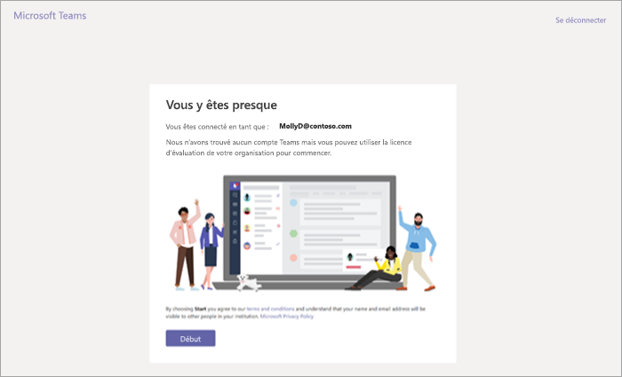
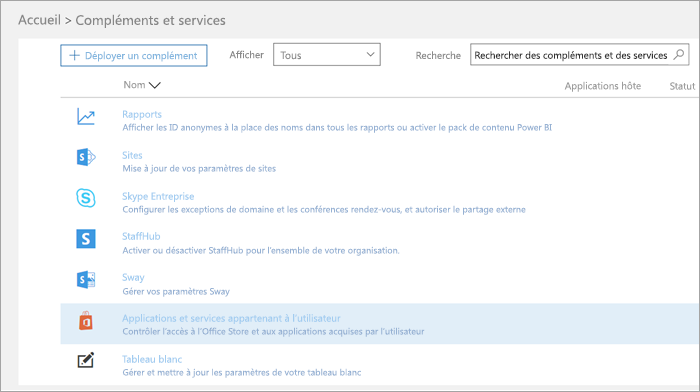
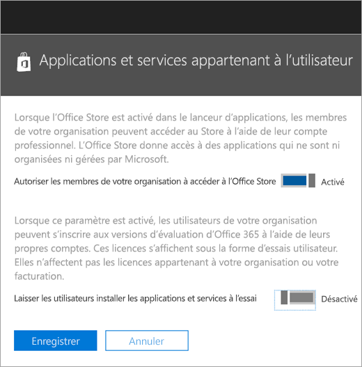

Gérer l’offre d’évaluation de Cloud Microsoft équipes commercialesManage the Microsoft Teams Commercial Cloud Trial offer
=======================================================

Microsoft Teams est un excellent outil de collaboration pour votre organisation.Microsoft Teams is a great collaborative tool for your organization. Il permet aux personnes et aux équipes de discuter, innover et partager des idées à l’aide de la puissance d’Office 365.It empowers people and teams to discuss, innovate, and share ideas using the power of Office 365. Les équipes commerciales Cloud version d’évaluation Microsoft offre Office 365 les utilisateurs existants dans votre organisation qui ne sont pas une licence de Microsoft Teams initier une version d’évaluation de 1 an du produit.The Microsoft Teams Commercial Cloud Trial offers existing Office 365 users in your organization who are not licensed for Microsoft Teams to initiate a 1-year trial of the product. Administrateurs ont la possibilité d’activer ou désactiver cette fonctionnalité pour les utilisateurs au sein de leur client.Admins have the ability to switch on or off this feature for users within their tenant.

## Nouveautés de l’offreWhat's in the offer

Les plans de service inclus dans cette offre sont les suivants :The service plans included in this offer are:

- Foundation ExchangeExchange Foundation
- Flux pour Office 365 Plan 1Flow for Office 365 Plan 1
- Planificateur de MicrosoftMicrosoft Planner
- Équipes Microsoft (Teams1, équipes travailleur de l’information)Microsoft Teams (Teams1, Teams IW)
- Office OnlineOffice Online
- PowerApps pour Office 365 Plan 1PowerApps for Office 365 Plan 1
- SharePoint Online KioskSharePoint Online Kiosk
- BalancementSway
- Yammer EnterpriseYammer Enterprise

## Qui est éligibleWho is eligible

Les utilisateurs qui ne possèdent pas d’une licence Office 365 qui inclut les équipes peuvent lancer l’offre d’évaluation de Cloud Microsoft équipes commerciale.Users who do not have an Office 365 license that includes Teams can initiate the Microsoft Teams Commercial Cloud Trial offer. Par exemple, si un utilisateur a Office 365 entreprise Premium (qui inclut les équipes) et le plan de service équipes est désactivé, ils ne sont pas éligibles pour la version d’évaluation.For example, if a user has Office 365 Business Premium (which includes Teams), and the Teams service plan is disabled, they are not eligible for the trial.

En outre, votre client n’est pas éligibles pour la version d’évaluation if :Also, your tenant is NOT eligible for the trial if: 
- Vous êtes un client de partenaire de SyndicationYou are a Syndication Partner Customer
- Vous êtes un client de partenaire revendeurYou are a Reseller Partner Customer
- Vous êtes un client EDU, GOV ou GCCYou are a GCC, GOV, or EDU customer

En outre, si votre client n’est pour la Microsoft équipes commerciales Cloud d’évaluation, vous verrez pas le commutateur **aux utilisateurs d’installer les services et applications d’évaluation** .In addition, if your tenant is ineligible for the Microsoft Teams Commercial Cloud Trial offer, you will not see the **Let users install trial apps and services** switch.

Au niveau du client, équipes en tant que service doit être activé (dans le centre d’administration équipes).At the tenant level, Teams as a service needs to be enabled (in the Teams admin center). Pour plus d’informations, voir [fonctionnalités de gestion des équipes Microsoft dans votre organisation Office 365](enable-features-office-365.md).For more information, see [Manage Microsoft Teams features in your Office 365 organization](enable-features-office-365.md). En outre, les utilisateurs doivent être activés pour s’inscrire pour les applications et versions d’évaluation (dans le centre d’administration Office 365).Also, users must be enabled to sign up for apps and trials (in the Office 365 admin center). Pour plus d’informations, voir [Gérer la version d’évaluation](#manage-the-trial) plus loin dans cet article.For more information, see [Manage the trial](#manage-the-trial) later in this article.

## Comment les utilisateurs s’inscrire à la version d’évaluationHow users sign up for the trial

Utilisateurs peuvent s’inscrire pour la version d’évaluation en vous connectant à équipes ([teams.microsoft.com](https://teams.microsoft.com)).Eligible users can sign up for the trial offer by logging into Teams ([teams.microsoft.com](https://teams.microsoft.com)). Si éligibles, ils verront l’écran suivant pour démarrer la version d’évaluation.If eligible, they will see the following screen to start the trial. 

La version d’évaluation accorde une version d’évaluation d’un an dans toute l’organisation.The trial grants a one-year trial to your entire organization. Cette version d’évaluation rende 500 000 licences disponibles pour l’affectation.This trial will make 500,000 licenses available for assignment. Pour chaque licence est attribuée, la version d’évaluation alloue 2 Go de stockage SharePoint Online.For each license assigned, the trial will allocate 2 GB of SharePoint Online storage. Utilisateurs supplémentaires au sein de votre organisation peuvent s’inscrire pour la version d’évaluation en passant par le même processus.Additional eligible users within your organization can sign up for the trial by going through the same process.

Toutes les versions d’évaluation de votre organisation partagent les mêmes début et les dates de fin qui correspond à la date premier utilisateur connecté pour la version d’évaluation.All trials within your organization share the same start and end dates, which is the date that first user signed for the trial. Par exemple, si l’utilisateur A commence à la première version d’évaluation sur 25 avril 2018, et l’utilisateur B une version d’évaluation sur 3 juin 2018, version d’évaluation de deux utilisateurs expire le 25 avril 2019.For example, if user A starts the first trial on April 25, 2018 and user B starts a trial on June 3, 2018, both users' trial will expire on April 25, 2019.

La première personne qui a souscrit à la version d’évaluation est « propriétaire » de l’abonnement.The first person who signed up for the trial is the “owner” of the subscription. Seulement cette personne peut gérer l’abonnement.Only that person can manage the subscription. 

## Gérer la version d’évaluationManage the trial

Administrateurs peuvent désactiver la possibilité pour les utilisateurs finaux demander des applications d’évaluation et services au sein de leur client.Admins can disable the ability for end users to claim trial apps and services within their tenant. Actuellement, la version d’évaluation des équipes est uniquement trial dans cette catégorie, mais elle s’applique à d’autres programmes similaires à l’avenir.Currently, the Teams trial is the only trial in this category, but this might apply to other similar programs in the future. 

1\.1\. À partir du [Centre d’administration Office 365](https://portal.office.com/adminportal/home), accédez à **Services et compléments** > **utilisateur propriétaire des applications et Services**.From the [Office 365 admin center](https://portal.office.com/adminportal/home), go to **Services & add-ins** > **User owned Apps and Services**.

2\.2\. Désactivez l’option **laisser les utilisateurs installer les services et applications d’évaluation**.Turn off **Let users install trial apps and services**.

3\.3\. Vous pouvez désactiver les équipes pour le client en accédant au portail d’administration équipes.You can turn off Teams for the tenant by going to the Teams admin portal. Lorsque cette option est désactivée, les utilisateurs ne peuvent pas prétendre qu'offrent les équipes d’évaluation.When this is disabled, users cannot claim the Teams trial offer.

4\.4\. Si vous avez désactivé le plan de service équipes pour un utilisateur qui dispose d’une licence éligible, que l’utilisateur n’est pas autorisé à demander une licence d’évaluation.If you have disabled the Teams service plan for an individual user who has an eligible license, that user is not eligible to claim a trial license.

5\.5\. Si un utilisateur a demandé une licence d’évaluation d’équipes, vous pouvez la supprimer en supprimant le plan de licence ou le service.If a user has claimed a Teams trial license, you can remove it by removing the license or service plan. 

### Mise à niveau à partir de la licence d’évaluationUpgrade users from the trial license

Pour mettre à niveau des utilisateurs à partir de la licence d’évaluation, procédez comme suit :To upgrade users from the trial license, do the following:

1. Acheter une référence SKU qui inclut des équipes.Purchase a SKU that includes Teams.
2. Supprimer la version d’évaluation équipes de l’utilisateur.Remove the Teams trial SKU from the user.
3. Affectez ensuite la licence récemment acquis.Then assign the newly purchased license.

Pour plus d'informations, reportez-vous à la rubrique [Licence Office 365 pour Microsoft Teams](Office-365-licensing.md).For more information, see [Office 365 licensing for Microsoft Teams](Office-365-licensing.md).