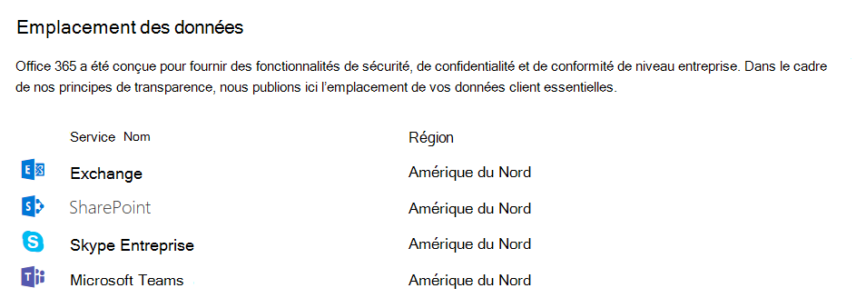

# Emplacement des données dans Microsoft Teams

Les données dans Teams se situent dans la région géographique associée à votre organisation Microsoft 365 ou Office 365. Actuellement, Teams prend en charge les régions Australie, Brésil, Canada, France, Allemagne, Inde, Japon, Norvège, Afrique du Sud, Corée du Sud, Suisse (y compris le Liechtenstein), Émirats arabes unis, Royaume-Uni, Amériques, APAC et EMEA.

> [!IMPORTANT]
> Teams propose actuellement la résidence de données en Australie, au Brésil, au Canada, en France, en Allemagne, en Inde, au Japon, en Norvège, aux Émirats arabes unis, au Royaume-Uni, en Corée du Sud, en Afrique du Sud et en Suisse (y compris au Liechtenstein) pour les nouveaux clients uniquement.
> Un nouveau client est défini comme un client dont aucun utilisateur ne s’est encore connecté à Teams ou dont l’utilisateur administrateur ne s’est jamais connecté au centre d'administration Teams. S’agissant des clients existants d’Australie, d’Inde, du Japon et de Corée du Sud, leurs données Teams continueront à être stockées dans la région Asie-Pacifique (APAC). S’agissant des clients existants au Brésil et au Canada, leurs données continueront à être stockées sur le continent américain. S’agissant des clients existants en France, en Allemagne, au Liechtenstein, en Norvège, aux Émirats arabes unis, au Royaume-Uni, en Afrique du Sud et en Suisse, leurs données continueront à être stockées dans la région Europe, Moyen-Orient et Afrique (EMEA).

## Emplacement de stockage de vos données Teams

Pour savoir quelle région héberge les données de votre client, accédez au [Centre d’administration Microsoft 365](https://portal.office.com/adminportal/home) > **Paramètres** > **Profil de l’organisation**. Faites défiler vers le bas jusqu’à **Emplacement des données**.

> [!div class="mx-imgBorder"]
> 

Pour obtenir la liste détaillée des pays et données stockés, voir [Emplacement de stockage de vos données client Microsoft 365](/microsoft-365/enterprise/o365-data-locations?view=o365-worldwide).

## Données stockées auprès d’un fournisseur de stockage tiers

Les organisations qui autorisent les utilisateurs à stocker des fichiers auprès d’un fournisseur de stockage tiers dépendent de l’emplacement de stockage de ces services. Par conséquent, il est conseillé de passer en revue l’emplacement des données au repos pour ces services séparément.