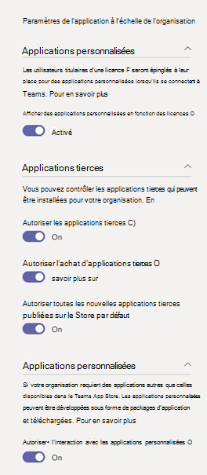

Gérer vos applications dans le centre d’administration Microsoft teamsManage your apps in the Microsoft Teams admin center
======================================================

En tant qu’administrateur, la page **gérer les applications** dans le centre d’administration Microsoft teams vous permet d’afficher et de gérer toutes les applications d’équipes dans le catalogue d’applications de votre organisation.As an admin, the **Manage apps** page in the Microsoft Teams admin center is where you view and manage all Teams apps in your organization's app catalog. Dans cet exemple, vous pouvez voir l’état de niveau de l’organisation et les propriétés des applications, télécharger de nouvelles applications personnalisées dans votre catalogue d’applications client, bloquer ou autoriser des applications au niveau de l’organisation, et gérer les paramètres de l’application à l’échelle de l’organisation.Here, you can see the org-level status and properties of apps, upload new custom apps to your tenant app catalog, block or allow apps at the org level, and manage org-wide app settings.

La page **gérer les applications** vous donne une vue d’ensemble des applications disponibles dans votre catalogue de clients, en fournissant les informations dont vous avez besoin pour déterminer les applications à autoriser ou à bloquer au sein de votre organisation.The **Manage apps** page gives you a view into all available apps in your tenant catalog, providing you with the information you need to decide which apps to allow or block across your organization. Vous pouvez ensuite utiliser des [stratégies d’autorisation d’application](teams-app-permission-policies.md), des stratégies de [configuration d’application](teams-app-setup-policies.md)et des [stratégies et paramètres d’application personnalisés](teams-custom-app-policies-and-settings.md) pour configurer l’utilisation de l’application pour des utilisateurs spécifiques de votre organisation.You can then use [app permission policies](teams-app-permission-policies.md), [app setup policies](teams-app-setup-policies.md), and [custom app policies and settings](teams-custom-app-policies-and-settings.md) to configure the app experience for specific users in your organization.

Dans le volet de navigation de gauche du centre d’administration de Microsoft Teams, accédez à **teams** > **Manage**apps.In the left navigation of the Microsoft Teams admin center, go to **Teams apps** > **Manage apps**. Pour accéder à la page, vous devez être administrateur général ou administrateur de service Teams.You must be a global admin or Teams service admin to access the page.

## Afficher les applications dans le catalogue d’applications de votre clientView apps in your tenant app catalog

Vous pouvez afficher chaque application dans votre catalogue d’applications client, y compris les informations suivantes sur chaque application.You can view every app in your tenant app catalog including the following information about each app.

- **Nom**: nom de l’application.**Name**: The app name. Cliquez sur le nom de l’application pour afficher davantage d’informations sur celle-ci.Click the app name to see more information about the app. Cela inclut une description de l’application, qu’elle soit autorisée ou bloquée, version, catégories qui s’appliquent à l’application, à l’état de la certification, aux fonctionnalités prises en charge et à l’ID de l’application.This includes a description of the app, whether it's allowed or blocked, version, categories that apply to the app, certification status, supported capabilities, and app ID. Voici un exemple :Here's an example:  
 

- **Certification**: si l’application n’a pas été **certifiée** , vous verrez soit la certification Microsoft 365, soit l' **attestation Publisher**.**Certification**: If the app has gone through certification, you'll see either **Microsoft 365 certified** or **Publisher attestation**. Cliquez sur le lien pour afficher les détails de certification de l’application.Click the link to view certification details for the app. Si vous voyez «**--**», nous ne disposons pas des informations de certification de l’application.If you see "**--**", we don't have certification information for the app. Pour en savoir plus sur les applications certifiées dans Teams, voir [programme de certification d’application Microsoft 365](https://docs.microsoft.com/teams-app-certification/all-apps).To learn more about certified apps in Teams, read [Microsoft 365 App Certification program](https://docs.microsoft.com/teams-app-certification/all-apps).  
- **Catégories**: catégories qui s’appliquent à l’application.**Categories**: Categories that apply to the app.
- **État**de l’application : état de l’application au niveau de l’organisation, qui peut être l’un des éléments suivants :**App status**: Status of the app at the org level, which can be one of the following:
    - **Autorisé**: l’application est disponible pour tous les utilisateurs de votre organisation.**Allowed**: The app is available for all users in your organization.
    - **Bloqué**: l’application est bloquée et n’est pas disponible pour les utilisateurs de votre organisation.**Blocked**: The app is blocked and not available for any users in your organization. 
Il est important de savoir que cette colonne représente l’état autorisé et bloqué des applications qui se trouvaient auparavant dans le volet Paramètres à l’échelle de l' **organisation** .It's important to know that this column represents the allowed and blocked status of apps that were formerly on the **Org-wide settings** pane. À présent, vous pouvez afficher, bloquer et autoriser des applications au niveau de l’organisation dans la page **gérer les applications** .You now view, block, and allow apps at the org-wide on the **Manage apps** page. 
- **Version**: version de l’application.**Version**: App version.

Pour afficher les informations que vous souhaitez inclure dans le tableau, cliquez sur **modifier la colonne** dans le coin supérieur droit pour ajouter ou supprimer des colonnes dans la table.To see the information that you want in the table, click **Edit Column** in the upper-right corner to add or remove columns to the table.

## Télécharger une nouvelle applicationUpload a new app

Pour télécharger une nouvelle application personnalisée dans le catalogue d’applications de votre client, cliquez sur **Télécharger une nouvelle application** pour télécharger votre package d’application au format. zip.To upload a new custom app to your tenant app catalog, click **Upload new app** to upload your app package in .zip format. Lorsque l’application n’est pas mise en surbrillance, vous devez effectuer une recherche dans le catalogue de vos clients pour la trouver.The app isn't highlighted after it's uploaded so you'll need to search your tenant catalog to find it.

Vous pouvez également charger des applications à [l’aide du client de bureau teams](tenant-apps-catalog-teams.md#go-to-the-tenant-app-catalog).You can also upload apps by [using the Teams desktop client](tenant-apps-catalog-teams.md#go-to-the-tenant-app-catalog). Pour en savoir plus, voir [gérer vos applications métier dans teams](manage-your-lob-apps.md).To learn more, see [Manage your line-of-business apps in Teams](manage-your-lob-apps.md).

## Autoriser et bloquer des applicationsAllow and block apps

Dans la page **gérer les applications** , vous pouvez autoriser ou bloquer des applications individuelles au niveau de l’organisation.The **Manage apps** page is where you allow or block individual apps at the org level. Il affiche chaque application disponible et son état actuel d’application au niveau de l’organisation.It shows every available app and its current org-level app status. (Le blocage et l’autorisation des applications au niveau de l’organisation sont déplacés du volet Paramètres de l’application à l’échelle de l' **organisation** .)(Blocking and allowing apps at the org level has moved from the **Org-wide app settings** pane to here.)

Pour autoriser ou bloquer une application, sélectionnez-la, puis cliquez sur **autoriser** ou **bloquer**.To allow or block an app, select it, and then click **Allow** or **Block**. Lorsque vous bloquez une application, toutes les interactions avec cette application sont désactivées et l’application n’apparaît pas dans teams pour les utilisateurs de votre organisation.When you block an app, all interactions with that app are disabled and the app doesn't appear in Teams for any users in your organization.

Lorsque vous bloquez ou autorisez une application dans la page **gérer les applications** , cette application est bloquée ou autorisée pour tous les utilisateurs de votre organisation.When you block or allow an app on the **Manage apps** page, that app is blocked or allowed for all users in your organization.  Lorsque vous bloquez ou autorisez une application dans une stratégie d’autorisation d’application Teams, elle est bloquée ou autorisée pour les utilisateurs qui ont attribué cette stratégie.When you block or allow an app in a Teams app permission policy, it's blocked or allowed for users who are assigned that policy. Pour qu’un utilisateur puisse installer une application et interagir avec celle-ci, vous devez autoriser l’application au niveau de l’organisation sur la page **gérer les applications** et dans la stratégie d’autorisation d’application qui est affectée à l’utilisateur.For a user to be able to install and interact with any app, you must allow the app at the org level on the **Manage apps** page and in the app permission policy that's assigned to the user.

## Gérer les paramètres d’application à l’échelle de l’OrganisationManage org-wide app settings

Utilisez les paramètres d’application à l’échelle de l’Organisation pour contrôler si les utilisateurs peuvent installer des applications tierces et si les utilisateurs peuvent télécharger ou interutiliser des applications personnalisées au sein de votre organisation.Use org-wide app settings to control whether users can install third-party apps and whether users can upload or interact with custom  apps in your organization. Les paramètres de l’application à l’échelle de l’organisation régissent le comportement de tous les utilisateurs et remplacent toutes les autres stratégies d’autorisation d’application attribuées aux utilisateurs.Org-wide app settings govern the behavior for all users and override any other app permission policies assigned to users. Vous pouvez les utiliser pour contrôler les applications malveillantes ou problématiques.You can use them to control malicious or problematic apps.

1. Dans la page **gérer les applications** , sélectionnez Paramètres de l' **application à l’échelle de l’organisation**.On the **Manage apps** page, select **Org-wide app settings**. Vous pouvez alors configurer les paramètres de votre choix dans le panneau.You can then configure the settings you want in the panel.

    
    
2. Sous **applications tierces**, désactivez ou activez ces paramètres pour contrôler l’accès aux applications tierces :Under **Third-party apps**, turn off or turn on these settings to control access to third-party apps:

    - **Autoriser les applications tierces dans teams**: ce contrôle si les utilisateurs peuvent utiliser des applications tierces.**Allow third-party apps in Teams**: This controls whether users can use third-party apps. Si vous désactivez ce paramètre, les utilisateurs ne pourront pas installer ou utiliser d’applications tierces.If you turn off this setting, your users won't be able to install or use any third-party apps. Pour les applications que vous avez autorisées, l’état indique As **allowed mais Disabled**de l’organisation.For apps that you allowed, the status shows as **Allowed but disabled org-wide**.
    
    - **Autorisez toutes les nouvelles applications tierces publiées dans le Windows Store par défaut**: ce contrôle si les nouvelles applications tierces publiées dans le Windows Store sont automatiquement disponibles dans Teams.**Allow any new third-party apps published to the store by default**: This controls whether new third-party apps that are published to the Teams app store become automatically available in Teams. Vous ne pouvez définir cette option que si vous autorisez des applications tierces.You can only set this option if you allow third-party apps.

3. Sous **applications personnalisées**, désactivez ou activez l’option **autoriser les interactions avec les applications personnalisées**.Under **Custom apps**, turn off or turn on **Allow interaction with custom apps**. Ce paramètre détermine si les utilisateurs peuvent interagir avec les applications personnalisées.This setting controls whether users can interact with custom apps. Pour plus d’informations, consultez [gérer les stratégies et les paramètres d’application personnalisés dans teams](teams-custom-app-policies-and-settings.md).To learn more, see [Manage custom app policies and settings in Teams](teams-custom-app-policies-and-settings.md).
4. Cliquez sur **Enregistrer** pour appliquer les paramètres de l’application à l’échelle de l’organisation.Click **Save** for org-wide app settings to take effect.

## Rubriques connexesRelated topics

- [Paramètres d’administration pour les applications dans Microsoft TeamsAdmin settings for apps in Teams](admin-settings.md)
