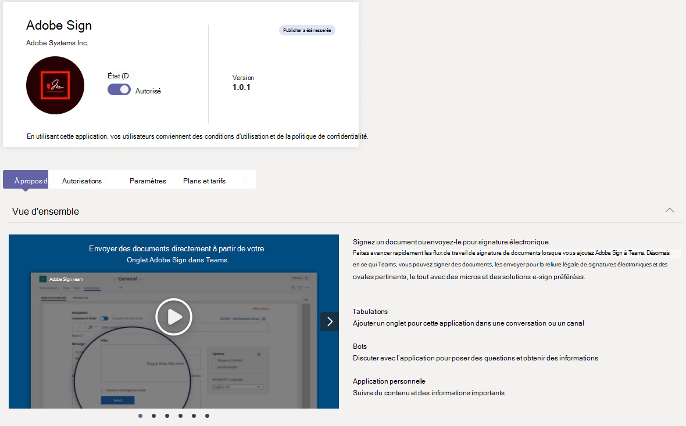
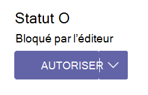

# Gérer vos applications dans le Centre Microsoft Teams’administration

En tant qu’administrateur, vous pouvez afficher et gérer Teams applications pour votre organisation. Dans la page Gérer les applications du Teams d’administration, vous pouvez :

- [Autoriser ou bloquer des applications au niveau de l’organisation](#allow-and-block-apps)
- [Applications bloquées par les éditeurs](#apps-blocked-by-publishers)
- [Ajouter des applications aux équipes](#add-an-app-to-a-team)
- [Approuver ou télécharger de nouvelles applications personnalisées sur le magasin d’applications de votre organisation](#publish-a-custom-app-to-your-organizations-app-store)
- [Afficher les autorisations demandées par les applications](#view-resource-specific-consent-permissions)
- [Accorder l’accord aux applications](#grant-admin-consent-to-apps)
- [Service d’achat pour les applications tierces](#purchase-services-for-third-party-apps)
- [Voir l’état au niveau de l’organisation et les propriétés des applications](#view-apps)
- [Gérer les paramètres des applications à l’échelle de l’organisation](#manage-org-wide-app-settings)
- [Afficher les informations de sécurité et de conformité Microsoft 365 applications certifiées](#view-security-and-compliance-information-for-microsoft-365-certified-apps)

La page Gérer les applications vous permet d’afficher toutes les applications disponibles, et vous fournit les informations dont vous avez besoin pour décider des applications à autoriser ou bloquer dans votre organisation. Vous pouvez ensuite [utiliser des](teams-app-permission-policies.md) stratégies d’autorisation [d’application](teams-app-setup-policies.md), des stratégies de configuration d’application et des [stratégies et paramètres](teams-custom-app-policies-and-settings.md) d’application personnalisés pour configurer l’expérience d’application pour des utilisateurs spécifiques de votre organisation.

Dans le volet de navigation gauche du Centre d’administration Microsoft Teams, accédez aux **applications Teams** > **Gérer les applications**. Vous devez être un administrateur global ou un Teams de service pour accéder à la page.

> [!NOTE]
> La page Gérer les applications n’est pas encore disponible dans les déploiements Microsoft 365 Cloud de la communauté du secteur public du département de la défense (GCCH) ou du département de la défense (DoD) Teams.

## Afficher les applications

Vous pouvez afficher chaque application, y compris les informations suivantes sur chaque application.

- **Nom :** nom de l’application. Sélectionnez le nom de l’application pour aller à la page des détails de l’application pour voir plus d’informations sur l’application. Il s’agit d’une description de l’application (autorisée ou bloquée), de sa version, de sa politique de confidentialité, de ses conditions d’utilisation, des catégories qui s’appliquent à l’application, de son état de certification, de ses fonctionnalités et de son ID d’application.
- **Certification** : Si l’application a été certifiée, vous verrez Microsoft 365 **certifié** ou Publisher **souhaitez.** Sélectionnez le lien pour afficher les détails de certification de l’application. Si vous le voyez `--`, nous n’avons pas d’informations de certification pour l’application. Pour en savoir plus sur les applications certifiées dans Teams, lisez Microsoft 365 [programme de certification des applications](/microsoft-365-app-certification/overview).
- **Publisher** : Nom de l’éditeur.
- **État de publication** : État de publication des applications personnalisées.
- **État** : État de l’application au niveau de l’organisation, qui peut être l’une des suivantes :
  - **Autorisé** : l’application est disponible pour tous les utilisateurs de votre organisation.
  - **Bloqué :** l’application est bloquée et n’est pas disponible pour les utilisateurs de votre organisation.
  - **Bloqué par l’éditeur** : l’application est bloquée par l’éditeur et est masquée par défaut pour les utilisateurs finaux. Après avoir installé l’application à l’aide des instructions de l’éditeur, vous pouvez autoriser ou bloquer l’application pour la rendre disponible aux utilisateurs finaux.
  - **Blocage à l’échelle de** l’organisation : l’application est bloquée dans les paramètres de l’application à l’échelle de l’organisation.
      Il est important de savoir que cette colonne représente l’état autorisé et bloqué des applications qui se bloquaient auparavant dans le volet **Paramètres** de l’organisation. Vous affichez, bloquez et autorisez les applications à l’échelle de l’organisation sur la page **Gérer les applications** .
- **Licences :** indique si une application propose un abonnement SaaS (Software as a Service) à l’achat. Cette colonne s’applique uniquement aux applications tierces. Chaque application tierce a l’une des valeurs suivantes :
  - **Achat** : L’application propose un abonnement SaaS et peut être achetée.  
  - **Achat :** L’application propose un abonnement SaaS et vous avez acheté des licences pour celui-ci.
  - **- -** : l’application ne propose pas d’abonnement SaaS.
- **Application personnalisée :** l’application personnalisée ou non.
- **Autorisations** : indique si une application tierce ou personnalisée inscrite dans Azure Active Directory (Azure AD) dispose d’autorisations qui ont besoin d’un consentement. Vous verrez l’une des valeurs suivantes :
  - **Afficher les détails** : L’application dispose d’autorisations qui nécessitent une autorisation pour que l’application puisse accéder aux données.
  - **- -** : l’application n’a pas d’autorisations qui ont besoin d’un consentement.
- **Catégories** : catégories qui s’appliquent à l’application.
- **Version :** version de l’application.
- **L’administrateur peut l’installer pendant les réunions** : indique si une application peut être installée par les administrateurs dans les réunions d’équipe. [Pour en savoir plus](teams-app-setup-policies.md#install-apps)

Pour voir les informations que vous souhaitez dans le tableau,  sélectionnez Modifier la colonne dans le coin supérieur droit pour ajouter ou supprimer des colonnes au tableau.

## Publier une application personnalisée sur le magasin d’applications de votre organisation

Utilisez la page Gérer les applications pour publier des applications spécialement conçues pour votre organisation. Après avoir publié une application personnalisée, elle est disponible pour les utilisateurs dans le magasin d’applications de votre organisation. Il existe deux façons de publier une application personnalisée sur le magasin d’applications de votre organisation. La façon dont vous utilisez l’application dépend de la façon dont vous obtenez l’application.

- [Approuver une application personnalisée](#approve-a-custom-app) : utilisez cette méthode si le développeur envoie l’application directement à la page Gérer les applications à l’aide de Teams API Soumission d’application. Vous pouvez ensuite consulter et publier (ou refuser) l’application directement à partir de la page des détails de l’application.
- [Télécharger package d’application](#upload-an-app-package) : utilisez cette méthode si le développeur vous envoie le package d’application au format .zip format. Vous publiez l’application en chargeant le package d’application.

### Approuver une application personnalisée

Le widget **Approbations en** attente dans la page Gérer les applications vous avertit lorsqu’un développeur envoie une application à l’aide de Teams API Soumission d’application. Une application nouvellement envoyée est répertoriée avec l’état **de publication** **Soumis** et **le statut** **Bloqué**. Allez sur la page des détails de l’application pour voir plus d’informations sur l’application, puis pour la publier, définissez l’état **de publication** sur **Publier**.

Vous êtes également averti lorsqu’un développeur envoie une mise à jour à une application personnalisée. Vous pouvez ensuite consulter et publier (ou refuser) la mise à jour sur la page des détails de l’application. Toutes les stratégies d’autorisation d’application et stratégies de configuration d’application demeurent appliquées pour l’application mise à jour.

Pour plus d’informations, [voir Publier une application personnalisée envoyée via l’API Teams soumission d’application](submit-approve-custom-apps.md).

### Télécharger un package d’application

Le développeur crée un package Teams’application à l’aide [Teams App Studio](/microsoftteams/platform/get-started/get-started-app-studio), puis vous l’envoie au format .zip format. Lorsque vous avez le package d’application, vous pouvez le charger sur le magasin d’applications de votre organisation.

Pour télécharger une nouvelle application personnalisée, **sélectionnez Télécharger** le package d’application. L’application n’est pas mise en évidence une fois téléchargée. Vous devez donc effectuer une recherche dans la liste des applications sur la page Gérer les applications pour la trouver.

Pour mettre à jour une application une fois qu’elle a été téléchargée, dans la liste des applications de la page Gérer les applications, sélectionnez le nom de l’application, puis mettez à **jour**. Cette procédure remplace l’application existante, et toutes les stratégies d’autorisation d’application et stratégies de configuration de l’application demeurent appliquées pour l’application mise à jour.

Pour plus d’informations, [voir Publier une application personnalisée en téléchargeant un package d’application](upload-custom-apps.md).

## Autoriser et bloquer des applications

La page Gérer les applications est l’endroit où vous autorisez ou bloquez des applications individuelles au niveau de l’organisation. Il affiche chaque application disponible et son état actuel au niveau de l’organisation. (Le blocage et l’accès aux applications au niveau de l’organisation ont été déplacés du volet des **paramètres** d’application à l’échelle de l’organisation vers cet espace.)

Pour autoriser ou bloquer une application, sélectionnez-la, puis **sélectionnez Autoriser** ou **Bloquer**. Lorsque vous bloquez une application, toutes les interactions avec cette application sont désactivées et l’application n’apparaît pas dans Teams pour les utilisateurs de votre organisation.

Lorsque vous bloquez ou autorisez une application sur la page Gérer les applications, cette application est bloquée ou autorisée pour tous les utilisateurs de votre organisation.  Lorsque vous bloquez ou autorisez une application dans une stratégie Teams d’autorisation d’application, elle est bloquée ou autorisée pour les utilisateurs affectés à cette stratégie. Pour qu’un utilisateur puisse installer et interagir avec une application, vous devez autoriser l’application au niveau de l’organisation sur la page Gérer les applications et dans la stratégie d’autorisation d’application affectée à l’utilisateur.

 > [!NOTE]
 > Pour désinstaller une application, cliquez dessus avec le bouton droit, puis cliquez sur **Désinstaller** ou utilisez **le menu Autres** applications sur le côté gauche.

## Applications bloquées par les éditeurs

Lorsqu’un éditeur de réseaux de développement (ISV) publie une application sur le magasin d’applications global, les administrateurs peuvent avoir besoin de configurer ou de personnaliser l’expérience de l’application. L’administrateur peut la rendre disponible aux utilisateurs finaux une fois l’application entièrement définie.

Par exemple, Contoso Electronics est un service informatique qui a créé une application de service d’Microsoft Teams. Contoso It souhaite que ses clients définissent certaines propriétés de l’application de telle sorte que, lorsque les utilisateurs interagissent avec l’application, elle fonctionne comme prévu. Avant qu’un administrateur puisse autoriser ou bloquer l’application, elle  s’affichera comme bloquée par l’éditeur dans le Centre d’administration Teams et sera masquée par défaut pour les utilisateurs finaux. Après avoir suivi les instructions de l’éditeur pour configurer l’application, vous pouvez la rendre accessible aux utilisateurs en la rendant **autorisée, ou** en bloquant l’utilisation de l’application en modifiant le statut en **Bloqué**.

## Ajouter une application à une équipe

Vous utilisez le **bouton Ajouter à une équipe** pour installer une application à une équipe. N’oubliez pas que cette application s’agit uniquement des applications qui peuvent être installées dans une étendue d’équipe. Le **bouton Ajouter à une** équipe n’est pas disponible pour les applications qui ne peuvent être installées que dans l’étendue personnelle.

1. Recherchez l’application de votre choix, puis sélectionnez-la en cliquant à gauche du nom de l’application.
2. **Sélectionnez Ajouter à l’équipe**.
3. Dans le **volet Ajouter à l’équipe** , recherchez l’équipe à qui vous voulez ajouter l’application, sélectionnez l’équipe, puis sélectionnez **Appliquer**.

## Personnaliser une application

Vous pouvez désormais personnaliser une application afin d’inclure une apparence spécifique en fonction des besoins de votre organisation. Voir [Personnaliser les applications dans Teams](customize-apps.md).

## Acheter des services pour les applications tierces

Vous pouvez rechercher et acheter des licences pour les services offerts par des applications tierces pour les utilisateurs de votre organisation directement à partir de la page Gérer les applications. La **colonne Licences** du tableau indique si une application propose un abonnement SaaS payant. **Sélectionnez Acheter maintenant** pour afficher les plans et les informations tarifaires, et acheter des licences pour vos utilisateurs. Pour en savoir plus, voir [Acheter des services pour Teams applications tierces dans le Microsoft Teams d’administration.](purchase-third-party-apps.md)

## Accorder l’autorisation d’accès des administrateurs aux applications

Vous pouvez consulter et accorder votre consentement aux applications qui demandent des autorisations au nom de tous les utilisateurs de votre organisation. Ainsi, les utilisateurs n’ont pas à passer en revue et à accepter les autorisations demandées par l’application lorsqu’ils démarrent l’application. La **colonne Autorisations** indique si une application dispose d’autorisations qui ont besoin d’un consentement. Vous verrez un lien Afficher les **détails** de chaque application enregistrée dans Azure AD qui dispose d’autorisations qui ont besoin d’un consentement. Pour plus d’informations, voir [Afficher les autorisations des applications et accorder le consentement de l’administrateur dans Microsoft Teams d’administration.](app-permissions-admin-center.md)

## Afficher les autorisations de consentement spécifiques aux ressources

Les autorisations de consentement spécifique aux ressources autorisent les propriétaires d’équipe à accorder leur consentement pour qu’une application accède aux données d’une équipe et les modifie. Les autorisations RSC sont précises Teams autorisations spécifiques qui définissent ce qu’une application peut faire dans une équipe spécifique. Vous pouvez afficher les autorisations RSC sous l’onglet **Autorisations** de la page des détails de l’application pour une application. Pour plus d’informations, voir [Afficher les autorisations des applications et accorder le consentement de l’administrateur dans Microsoft Teams d’administration.](app-permissions-admin-center.md)

## Gérer les paramètres des applications à l’échelle de l’organisation

Utilisez les paramètres des applications à l’échelle de l’organisation pour contrôler si les utilisateurs profitent d’une expérience d’application personnalisée en fonction des licences (bientôt disponibles), de la mise à jour des applications tierces et du fait que les utilisateurs peuvent télécharger ou interagir avec des applications personnalisées au niveau de votre organisation. Les paramètres de l’application à l’échelle de l’organisation contrôlent le comportement de tous les utilisateurs et remplacent les autres stratégies d’autorisation d’application attribuées à des utilisateurs. Vous pouvez les utiliser pour contrôler des applications malveillantes ou problématiques.

> [!NOTE]
> Pour découvrir comment utiliser les paramètres d’application à l’échelle de l’organisation dans Microsoft 365 Government - Cloud de la communauté du secteur public High GCCH et Department of Defense (DoD) de Teams, voir Gérer les stratégies d’autorisation d’application [dans Teams](teams-app-permission-policies.md).

1. Dans la page Gérer les applications, sélectionnez **les paramètres de l’application à l’échelle de l’organisation**. Vous pouvez ensuite configurer les paramètres voulus dans le panneau.

1. (Bientôt disponible) Sous **Applications personnalisées**, désactiver ou activer **l’application Afficher les applications personnalisées en fonction des licences**. Lorsque ce paramètre est installé, les utilisateurs obtiennent une expérience dans laquelle des applications sont épinglées en fonction de leur licence. Pour plus d’informations, [voir Personnaliser vos Teams en fonction de la licence](pin-teams-apps-based-on-license.md).

    Cette fonctionnalité est disponible pour les licences F. D’autres types de licence seront pris en charge à l’avenir.
1. Sous **Applications tierces**, désactiver ou activer ces paramètres pour contrôler l’accès à des applications tierces :

    - **Autoriser les applications tierces** : cette commande contrôle si les utilisateurs peuvent utiliser des applications tierces. Si vous désactiver ce paramètre, vos utilisateurs ne pourront pas installer ou utiliser des applications tierces et l’état de ces applications s’affiche comme bloqué à l’échelle de l’organisation dans le tableau.

        > [!NOTE]
        > Lorsque  l’autorisation des applications tierces est activée, les sites [web sortants sont toujours activés](/microsoftteams/platform/webhooks-and-connectors/what-are-webhooks-and-connectors) pour tous les utilisateurs, mais vous pouvez les contrôler au niveau de l’utilisateur en bloquant ou en bloquant l’application Web sans fil sortante via des stratégies d’autorisation d’application[.](teams-app-permission-policies.md) Notez que si vous avez des  stratégies d’autorisation d’application existantes pour les applications **Microsoft** qui utilisent le paramètre Autoriser des applications spécifiques et bloquez tous les autres paramètres, et que vous voulez activer les sites web sortants pour les utilisateurs, ajoutez l’application Web de groupe sortant à la liste.

        > [!NOTE]
        > Les utilisateurs de Teams peuvent ajouter des applications lorsqu’ils hébergent des réunions ou des conversations avec des personnes d’autres organisations. Ils peuvent également utiliser des applications partagées par des personnes d’autres organisations lorsqu’ils rejoignent des réunions ou des conversations hébergées par ces organisations. Les stratégies de données de l’organisation de l’utilisateur hôte, ainsi que les pratiques de partage de données de toutes les applications tierces partagées par l’organisation de cet utilisateur, sont appliquées.

    - **Autoriser toute nouvelle application tierce publiée sur le magasin par défaut** : cette option contrôle la publication automatique des nouvelles applications tierces publiées dans le magasin d’applications Teams dans Teams. Vous ne pouvez définir cette option que si vous autorisez des applications tierces.

1. Sous **Applications personnalisées**, désactiver ou activer **l’application Autoriser l’interaction avec les applications personnalisées**. Ce paramètre contrôle si les utilisateurs peuvent interagir avec les applications personnalisées. Pour plus d’informations, consultez [Gérer les stratégies et paramètres d’application personnalisés dans Teams](teams-custom-app-policies-and-settings.md).
1. **Sélectionnez Enregistrer** pour que les paramètres d’application à l’échelle de l’organisation prennent effet.

## Afficher les informations de sécurité et de conformité Microsoft 365 applications certifiées

Lors de l’évaluation d’une application pour leur organisation, les administrateurs peuvent utiliser des courtiers en sécurité d’accès au cloud indépendants (CASB), tels que Microsoft Cloud App Security (MCAS), pour trouver des informations sur la sécurité et les comportements d’une application. Le Centre d’administration Teams inclut les informations de sécurité et de conformité de MCAS pour les applications Microsoft 365 Certified. Vous aurez ainsi plus d’informations pour déterminer si l’application répond à vos besoins.

> [!NOTE]
> Cette fonctionnalité est disponible pour tous les administrateurs, que votre organisation dispose ou non d’une licence qui prend en charge MCAS.

Pour accéder aux informations MCAS, suivez ces étapes :

1. Dans le Teams d’administration, sélectionnez **Gérer les applications sous** **Teams applications**.
1. **Sélectionnez Certification** pour trier les applications et Microsoft 365 toutes les applications certifiées en haut du tableau.
1. Sélectionnez une Microsoft 365'application certifiée.
1. Sélectionnez **l’onglet Sécurité et** conformité.

Sous cet onglet, vous trouverez des informations sur la sécurité, la conformité et la protection des données. Vous pouvez également développer chaque liste afin d’obtenir plus de détails sur les fonctionnalités qui sont pris en charge pour l’application sélectionnée.

## Voir aussi

- [Paramètres d’administration pour les applications dans Microsoft Teams](admin-settings.md)
