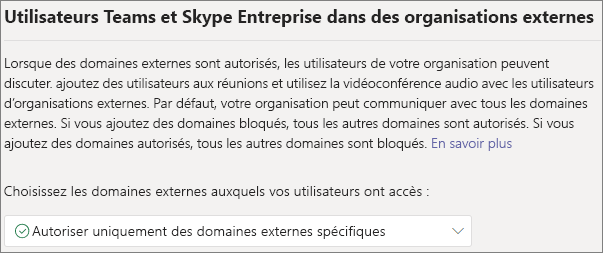
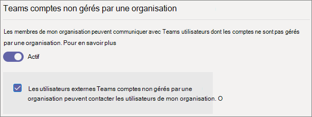
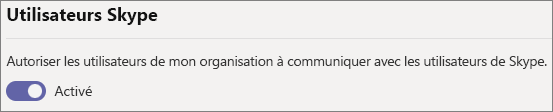

# <a name="manage-external-access-in-microsoft-teams"></a>Gérer l’accès externe dans Microsoft Teams

L'accès externe est un moyen pour les utilisateurs de Teams en dehors de votre organisation de rechercher, d'appeler, de discuter et d'organiser des réunions avec vous dans Teams. Vous pouvez également utiliser l'accès externe pour communiquer avec des personnes d'autres organisations qui utilisent toujours Skype Entreprise (en ligne et sur site) et Skype.

Si vous souhaitez que les personnes d'autres organisations aient accès à vos équipes et canaux, utilisez plutôt l'accès invité. Pour plus d’informations sur les différences entre l’accès externe et l’accès invité, voir [Comparer les accès externe et invité](communicate-with-users-from-other-organizations.md#compare-external-and-guest-access). 

Utilisez l’accès externe dans les situations suivantes :
  
- Vous avez des utilisateurs dans des domaines externes qui ont besoin de faire une conversation instantanée. Par exemple, Rob@contoso.com et Ann@northwindtraders.com travaillent ensemble sur un projet avec d'autres personnes des domaines contoso.com et northwindtraders.com.

- Vous souhaitez que les membres de votre organisation utilisent Teams pour contacter des personnes appartenant à des entreprises spécifiques extérieures à votre organisation.

- Ou vous souhaitez que tous les utilisateurs de Teams à travers le monde puissent vous contacter, à l'aide de votre adresse électronique. 

## <a name="plan-for-external-access"></a>Plan pour l’accès externe

Les stratégies d'accès externe comprennent des contrôles pour chaque type de fédération, tant au niveau de l'organisation que de l'utilisateur. La désactivation d'une politique au niveau de l'organisation la désactive pour tous les utilisateurs, quel que soit le paramètre de leur niveau d'utilisateur. Tous les paramètres d’accès externe sont activés par défaut.

Le centre Teams d’administration contrôle l’accès externe au niveau de l’organisation. La plupart des options (sauf les restrictions de domaine) sont disponibles au niveau de l'utilisateur en utilisant PowerShell. Pour plus d’informations, afficher [Utiliser PowerShell](#using-powershell) ci-dessous.

> [!NOTE]
> Si vous désactivez l'accès externe dans votre organisation, les personnes extérieures à votre organisation peuvent toujours se joindre aux réunions par le biais de la fonction de participation anonyme. Pour en savoir plus, voir [Gérer les paramètres de réunion dans Teams](meeting-settings-in-teams.md).

> [!NOTE]
> Les utilisateurs de Teams peuvent ajouter des applications lorsqu’ils hébergent des réunions ou des conversations avec des personnes d’autres organisations. Ils peuvent également utiliser des applications partagées par des personnes d’autres organisations lorsqu’ils rejoignent des réunions ou des conversations hébergées par ces organisations. Les stratégies de données de l’organisation de l’utilisateur hôte, ainsi que les pratiques de partage de données de toutes les applications tierces partagées par l’organisation de cet utilisateur, sont appliquées.

## <a name="allow-or-block-domains"></a>Autoriser ou bloquer des domaines

Si vous ajoutez des domaines bloqués, tous les autres domaines sont autorisés. Si vous ajoutez des domaines autorisés, tous les autres domaines sont bloqués. Une exception s’applique si les participants anonymes sont autorisés dans les réunions. Il existe trois scénarios pour configurer l'accès externe dans le centre d'administration Teams (**Utilisateurs** > **Accès externe**) :

- **Autoriser tous les domaines externes** : il s'agit du paramètre par défaut dans Teams, et il permet aux personnes de votre organisation de rechercher, appeler, discuter et organiser des réunions avec des personnes externes à votre organisation dans n'importe quel domaine.

    Dans ce scénario, vos utilisateurs peuvent communiquer avec tous les domaines externes qui utilisent Teams ou Skype Entreprise, à condition que l'autre locataire prenne également en charge les communications externes.
    
- **Autoriser uniquement les domaines externes spécifiques** : En ajoutant des domaines à une liste **Verte**, vous limitez l'accès externe aux seuls domaines autorisés. Une fois que vous avez configuré la liste des domaines autorisés, tous les autres domaines sont bloqués. 

- **Bloquez des domaines spécifiques**-en ajoutant des domaines à une liste **Bloquer**, vous pouvez communiquer avec tous les domaines externes *à l’exception de* ceux que vous avez bloqués.  Une fois que vous avez configuré la liste des domaines bloqués, tous les autres domaines sont autorisés.

- **Bloquer tous les domaines externes** – Empêche les personnes de votre organisation de rechercher, d'appeler, de discuter et d'organiser des réunions avec des personnes externes à votre organisation dans n'importe quel domaine.

> [!NOTE]
> Les domaines autorisés ou bloqués s’appliquent uniquement aux réunions si l’accès anonyme aux réunions est désactivé.



**Utiliser le centre d’administration Microsoft Teams**

Pour autoriser des domaines spécifiques

1. Dans le centre d'administration Teams, accédez à **Utilisateurs** > **Accès externe**.

2. Sous **Choisir les domaines auxquels vos utilisateurs ont accès**, choisissez **Autoriser uniquement les domaines externes spécifiques**.

3. Sélectionnez **Autoriser les domaines**.

4. Dans la zone **Domaine**, tapez le domaine que vous souhaitez autoriser, puis cliquez sur **Terminé**.

5. Si vous souhaitez autoriser un autre domaine, cliquez sur **Ajouter un domaine**.

6. Cliquez sur **Enregistrer**.

Pour bloquer des domaines spécifiques

1. Dans le centre d'administration Teams, accédez à **Utilisateurs** > **Accès externe**.

2. Sous **Choisir les domaines auxquels vos utilisateurs ont accès**, choisissez **Bloquer uniquement les domaines externes spécifiques**.

3. Sélectionnez **Bloquer les domaines**.

4. Dans la zone **Domaine**, tapez le domaine que vous souhaitez autoriser, puis cliquez sur **Terminé**.

5. Si vous souhaitez bloquer un autre domaine, cliquez sur **Ajouter un domaine**.

6. Cliquez sur **Enregistrer**.

Pour communiquer avec un autre client, il doit **autoriser tous les domaines externes** ou ajouter votre client à sa liste de domaines autorisés en suivant les mêmes étapes ci-dessus.  

## <a name="manage-contact-with-external-teams-users-not-managed-by-an-organization"></a>Gérer le contact avec les utilisateurs externes de Teams non gérés par une organisation

Les administrateurs peuvent choisir d'activer ou de désactiver les communications avec les utilisateurs externes de Teams qui ne sont pas gérés par une organisation (« non gérés »). S'ils sont activés, ils peuvent également contrôler davantage si les personnes ayant des comptes Teams non gérés peuvent initier un contact (voir l'image suivante). Si les **utilisateurs externes dont les comptes Teams ne sont pas gérés par une organisation peuvent contacter les utilisateurs de mon organisation**, les utilisateurs de Teams non gérés ne peuvent pas effectuer de recherche dans le courrier électronique complète pour trouver des contacts de l’organisation et toutes les communications avec des utilisateurs Teams non gérées doivent être initiées par les utilisateurs de l’organisation.

Dans le centre d'administration Teams, accédez à **Utilisateurs** > **Accès externe**.



Pour empêcher les utilisateurs de Teams de votre organisation de communiquer avec des utilisateurs Teams externes dont les comptes ne sont pas gérés par une organisation :
1. Désactiver les **personnes de mon organisation peuvent communiquer avec Teams utilisateurs dont les comptes ne sont pas gérés par un paramètre de l’organisation**.
2. Effacer les **utilisateurs externes Teams comptes non gérés par une organisation peuvent contacter les utilisateurs dans la case à cocher de mon** organisation.

Pour permettre aux utilisateurs de Teams de votre organisation de communiquer avec des utilisateurs de Teams externes dont les comptes ne sont pas gérés par une organisation si vos utilisateurs de Teams ont initié le contact :
1. Activer la fonction Personnes de mon organisation permet de communiquer avec Teams utilisateurs dont les comptes ne sont pas **gérés par un paramètre de l’organisation**.
2. Effacer les **utilisateurs externes Teams comptes non gérés par une organisation peuvent contacter les utilisateurs dans la case à cocher de mon** organisation.

Pour permettre aux utilisateurs de Teams de votre organisation de communiquer avec des utilisateurs Teams externes dont les comptes ne sont pas gérés par une organisation et recevoir des demandes de communication avec ces utilisateurs Teams externes :
1. Activer la fonction Personnes de mon organisation permet de communiquer avec Teams utilisateurs dont les comptes ne sont pas **gérés par un paramètre de l’organisation**.
2. Sélectionnez **les utilisateurs externes Teams comptes non gérés par une organisation peuvent contacter les utilisateurs dans la case à cocher de mon** organisation.

## <a name="communicate-with-skype-users"></a>Communiquer avec les utilisateurs de Skype (préversion)

Pour permettre aux membres Teams de votre organisation de discuter avec et d’appeler des utilisateurs de Skype, procédez comme suit. Les membres de Teams peuvent ensuite rechercher et démarrer une conversation texte privée ou un appel audio/vidéo avec des utilisateurs de Skype, et vice-versa.



**Utiliser le centre d’administration Microsoft Teams**

1. Dans la navigation de gauche, accédez à **Utilisateurs** > **Accès externe**.

2. Activez le paramètre **Autoriser les utilisateurs de mon organisation à communiquer avec les utilisateurs Skype**.

Pour en savoir plus sur la manière dont les utilisateurs de Teams et les utilisateurs de Skype peuvent communiquer, y compris les limitations qui s’appliquent, voir [Interopérabilité Skype et Teams](teams-skype-interop.md).

## <a name="using-powershell"></a>Utiliser PowerShell

Vous pouvez configurer les paramètres au niveau de l’organisation à l’aide de [Set-CSTenantFederationConfiguration](/powershell/module/skype/set-cstenantfederationconfiguration) et les paramètres au niveau utilisateur à l’aide de [Set-CsExternalAccessPolicy](/powershell/module/skype/set-csexternalaccesspolicy).

Le tableau suivant indique les paramètres de cmdlet utilisés pour configurer la fédération.

|Configuration|Niveau organisation (Set-CSTenantFederationConfiguration)|Niveau utilisateur (Set-CsExternalAccessPolicy)|
|:-------|:--------|:------------------|
|Activer/désactiver la fédération avec d’autres Teams et d’autres Skype Entreprise|`-AllowFederatedUsers`|`-EnableFederationAccess`|
|Activer la fédération avec des domaines spécifiques|`-AllowedDomains`|Non disponibles|
|Désactiver la fédération avec des domaines spécifiques|`-Blocked Domains`|Non disponibles|
|Activer/désactiver la fédération avec Teams utilisateurs non gérés par une organisation|`-AllowTeamsConsumer`|`-EnableTeamsConsumerAccess`|
|Activer/désactiver les Teams non gérés par une organisation dans le but de lancer des conversations|`-AllowTeamsConsumerInbound`|`-EnableTeamsConsumerInbound`|
|Activer/désactiver la fédération à Skype|`-AllowPublicUsers`|`-EnablePublicCloudAccess`|

Il est important de noter que la désactivation d’une stratégie « se déroule » du client aux utilisateurs. Par exemple :

```PowerShell
Set-CsTenantFederationConfiguration -AllowFederatedUsers $false
Set-CsExternalAccessPolicy -EnableFederationAccess $true
```

Dans cet exemple, bien que la stratégie au niveau de l'utilisateur soit activée, les utilisateurs ne pourraient pas communiquer avec les utilisateurs de Teams ou de Skype Entreprise gérés, car ce type de fédération a été désactivé au niveau de l'organisation. Par conséquent, si vous souhaitez activer ces contrôles pour un sous-ensemble d'utilisateurs, vous devez activer le contrôle au niveau de l'organisation et créer deux stratégies de groupe - une qui s'applique aux utilisateurs pour lesquels le contrôle doit être désactivé et une autre qui s'applique aux utilisateurs pour lesquels le contrôle doit être activé.

## <a name="limit-external-access-to-specific-people"></a>Limiter l’accès externe à des personnes spécifiques

Si vous avez activé l'un des contrôles d'accès externe au niveau de l'organisation, vous pouvez limiter l'accès externe à des utilisateurs spécifiques à l'aide de PowerShell.

Vous pouvez utiliser l’exemple de script suivant, en remplaçant le contrôle par le *contrôle* que vous voulez modifier, *PolicyName* pour le nom que vous souhaitez donner à la stratégie et *UserName* pour chaque utilisateur pour lequel vous souhaitez activer/désactiver l’accès externe.

Assurez-vous d’avoir installé le module PowerShell [Microsoft Teams](/microsoftteams/teams-powershell-install) avant d’exécuter le script.

```PowerShell
Connect-MicrosoftTeams

# Disable external access globally
Set-CsExternalAccessPolicy -<Control> $false

# Create a new external access policy
New-CsExternalAccessPolicy -Identity <PolicyName> -<Control> $true

# Assign users to the policy
$users_ids = @("<UserName1>", "<UserName2>")
New-CsBatchPolicyAssignmentOperation -PolicyType ExternalAccessPolicy -PolicyName "<PolicyName>" -Identity $users_ids

```

Par exemple, activez les communications avec des utilisateurs Teams externes qui ne sont pas gérés par une organisation :

```PowerShell
Connect-MicrosoftTeams

Set-CsExternalAccessPolicy -EnableTeamsConsumerAccess $false

New-CsExternalAccessPolicy -Identity ContosoExternalAccess -EnableTeamsConsumerAccess $true

$users_ids = @("MeganB@contoso.com", "AlexW@contoso.com")
New-CsBatchPolicyAssignmentOperation -PolicyType ExternalAccessPolicy -PolicyName "ContosoExternalAccess" -Identity $users_ids

```

Consultez [ New-CsBatchPolicyAssignmentOperation](/powershell/module/teams/new-csbatchpolicyassignmentoperation) pour obtenir des exemples supplémentaires de compilation d’une liste d’utilisateurs.

Vous pouvez voir la nouvelle stratégie en exécutant `Get-CsExternalAccessPolicy`.

Voir également [New-CsExternalAccessPolicy](/powershell/module/skype/new-csexternalaccesspolicy) et [Set-CsExternalAccessPolicy.](/powershell/module/skype/set-csexternalaccesspolicy)

## <a name="common-external-access-scenarios"></a>Scénarios d’accès externe courants

Les sections suivantes décrivent comment activer la fédération pour les scénarios d’accès externe courants, et comment TeamsUpgradePolicy détermine la remise des conversations et appels entrants.

### <a name="enable-federation-between-users-in-your-organization-and-other-organizations"></a>Permettre la fédération entre les utilisateurs de votre organisation et d'autres organisations.

Pour permettre aux utilisateurs de votre organisation de communiquer avec des utilisateurs d’une autre organisation, les deux organisations doivent activer la fédération. Les étapes à suivre pour activer la fédération pour une organisation donnée varient selon que l’organisation est uniquement en ligne, hybride ou uniquement en local.

| Si votre organisation | Activer la fédération comme suit |
|:---------|:-----------------------|
|En ligne sans Skype Entreprise en local. Cela inclut les organisations qui ont des utilisateurs de TeamsOnly et/ou Skype Entreprise Online.| Si vous utilisez le Centre d’administration Teams : <br>- Assurez-vous que les domaines avec lesquels vous voulez communiquer sont autorisés à l'accès externe.<br><br>Si vous utilisez PowerShell :<br>- Vérifiez que le client est activé pour la fédération : `Get-CsTenantFederationConfiguration` doit afficher `AllowFederatedUsers=true`. <br>- Assurez-vous que la valeur effective de l’utilisateur `CsExternalAccessPolicy` est de `EnableFederationAccess=true`.<br>- Si vous n’utilisez pas la fédération ouverte, assurez-vous que le domaine cible est répertorié dans `AllowedDomains` de `CsTenantFederationConfiguration`. |
|En local uniquement| Dans les outils locaux : <br>- Vérifiez que la fédération est activée dans `CsAccessEdgeConfiguration`.<br>- Vérifiez que la fédération de l’utilisateur est activée via `ExternalAccessPolicy` (soit la stratégie globale, la stratégie de site ou la stratégie attribuée par l’utilisateur). <br> - Si vous n’utilisez pas la fédération ouverte, assurez-vous que le domaine cible est répertorié dans `AllowedDomains`.|
|Hybride avec certains utilisateurs en ligne (dans Skype Entreprise ou Teams) et certains utilisateurs en local. | Suivez les étapes ci-dessus pour les organisations en ligne et locales. |

### <a name="delivery-of-incoming-chats-and-calls"></a>Remise de conversations et d’appels entrants 

Les conversations instantanées et les appels entrants provenant d'une organisation de fédération atterriront dans le client Teams ou Skype for Business de l'utilisateur, selon le mode de l'utilisateur destinataire dans TeamsUpgradePolicy.

| Si vous voulez | Procédez comme suit : |
|:---------|:-----------------------|
|Vérifiez que les conversations et appels fédérés entrants arrivent dans le client Teams de l’utilisateur :|Configurez vos utilisateurs de façon à ce qu’ils utilisent TeamsOnly.
|Vérifiez que les conversations et appels fédérés entrants arrivent dans le client Skype Entreprise de l’utilisateur.|Configurez vos utilisateurs pour qu’ils utilisent un mode autre que TeamsOnly.|

### <a name="enable-federation-between-users-in-your-organization-and-unmanaged-teams-users"></a>Activez la fédération entre les utilisateurs de votre organisation et les utilisateurs non gérés de Teams.

Pour activer la fédération entre les utilisateurs de votre organisation et les utilisateurs grand public de Skype :

| Si votre organisation | Activer la fédération comme suit |
|:---------|:-----------------------|
|En ligne sans Skype Entreprise en local. Cela inclut les organisations qui ont des utilisateurs de Teams Only et/ou des utilisateurs de Skype Entreprise Online.| Si vous utilisez le Centre d’administration Teams :<br>- Assurez-vous **que les membres de mon** organisation peuvent communiquer avec Teams utilisateurs dont les comptes ne sont pas gérés par une organisation sont activés dans **l’Accès externe**.<br>-Si vous souhaitez que les comptes Teams non gérés lancent des conversations, cochez la case pour les **utilisateurs externes** dont les comptes Teams ne sont pas gérés par une organisation peuvent contacter les utilisateurs de mon organisation.<br><br>Si vous utilisez PowerShell :<br>- Vérifiez que le client est activé pour la fédération : `Get-CsTenantFederationConfiguration` doit afficher `AllowTeamsConsumer=true`.<br>- Assurez-vous que l’utilisateur a une valeur efficace`CsExternalAccessPolicy`.`EnableTeamsConsumerAccess=true`<br>- Assurez-vous que le client est activé pour que les utilisateurs non managés lancent des conversations : `Get-CsTenantFederationConfiguration` doit afficher `AllowTeamsConsumerInbound=true`.<br>- Assurez-vous que l’utilisateur a une valeur efficace`CsExternalAccessPolicy`.`EnableTeamsConsumerInbound=true`|
|En local uniquement| Avoir un conversation instantanée avec des utilisateurs non Teams n’est pas pris en charge pour les organisations locales uniquement|
|Hybride avec certains utilisateurs en ligne (dans Skype Entreprise ou Teams) et certains utilisateurs en local. | Suivez les étapes décrites précédemment pour les organisations en ligne. Notez que la conversation avec les utilisateurs non Teams n’est pas prise en charge pour les utilisateurs locaux.|

> [!IMPORTANT]
> Vous n'avez pas besoin d'ajouter de **domaines Teams** comme domaines autorisés pour permettre aux utilisateurs de Teams de communiquer avec des utilisateurs Teams non gérés en dehors de votre organisation. Tous les **domaines Teams non managés** sont autorisés.

### <a name="enable-federation-between-users-in-your-organization-and-consumer-users-of-skype"></a>Activez la fédération entre les utilisateurs de votre organisation et les utilisateurs grand public de Skype

Pour activer la fédération entre les utilisateurs de votre organisation et les utilisateurs grand public de Skype :

| Si votre organisation | Activez la fédération des consommateurs comme suit : |
|:---------|:-----------------------|
|En ligne sans Skype Entreprise en local Cela inclut les organisations qui ont des utilisateurs de TeamsOnly et/ou Skype Entreprise Online. | Si vous utilisez le Centre d’administration Teams : <br>-Assurez-vous que **Autoriser les utilisateurs de mon organisation à communiquer avec les utilisateurs Skype** est activé dans l'accès externe.<br><br>Si vous utilisez PowerShell : <br>- Vérifiez que le client est activé pour la fédération : `Get-CsTenantFederationConfiguration` doit afficher `AllowPublicUsers=true`. <br> - Assurez-vous que la valeur effective de l’utilisateur `CsExternalAccessPolicy` est de `EnablePublicCloudAccess=true`. |
|En local uniquement| Dans les outils locaux : <br> - Assurez-vous que Skype est activé en tant que partenaire fédéré. <br> - Vérifiez que `EnablePublicCloudAccess=true` pour l’utilisateur via `ExternalAccessPolicy` (via une stratégie globale, une stratégie de site ou une stratégie attribuée par l’utilisateur).|
| Hybride avec certains utilisateurs en ligne (dans Skype Entreprise ou Teams) et certains utilisateurs en local.| Suivez les étapes ci-dessus pour les organisations en ligne et locales.

> [!IMPORTANT]
> Vous n'avez pas besoin d'ajouter de **domaines Skype** en tant que domaines autorisés pour permettre aux utilisateurs Teams ou Skype Entreprise Online de communiquer avec les utilisateurs Skype à l'intérieur ou à l'extérieur de votre organisation. Tous les **domaines Skype** sont autorisés.

## <a name="federation-diagnostic-tool"></a>Outil de diagnostic de fédération

Si vous êtes administrateur, vous pouvez utiliser l'outil de diagnostic suivant pour valider qu'un utilisateur Teams peut communiquer avec un utilisateur Teams fédéré :

1. Sélectionnez **Exécuter les tests** ci-dessous, qui remplira le diagnostic dans le Centre d'Administration Microsoft 365. 

   > [!div class="nextstepaction"]
   > [Exécuter des tests : fédération d'équipes](https://aka.ms/TeamsFederationDiag)

2. Dans le volet Exécuter le diagnostic, saisissez **l'adresse SIP (Session Initiation Protocol)** et le **nom de domaine du locataire fédéré**, puis sélectionnez **Exécuter les tests**.

3. Les tests renverront les meilleures prochaines étapes pour traiter les configurations de locataire ou de stratégie qui empêchent la communication avec l'utilisateur fédéré.


## <a name="related-topics"></a>Sujets associés

[Expérience de conversation native pour les utilisateurs externes (fédérés)](native-chat-for-external-users.md)
