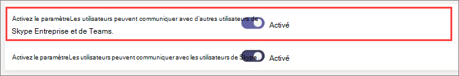
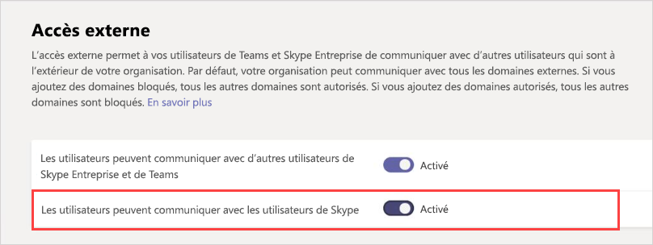

# Gérer l’accès externe dans Microsoft Teams

L’accès externe est un moyen pour les utilisateurs Teams qui proviennent d'un domaine totalement externe de rechercher, d’appeler, de discuter et d’organiser des réunions avec vous dans Teams. Vous pouvez également utiliser l’accès externe lorsque vous voulez communiquer avec les membres d’autres organisations qui utilisent encore Skype Entreprise (en ligne ou en local) ou Skype (en version d’évaluation).

Si vous voulez que les membres d’autres organisations aient accès aux équipes et aux canaux, l’accès invité sera sans doute préférable. Pour plus d’informations sur les différences entre l’accès externe et l’accès invité, voir [Comparer les accès externe et invité](communicate-with-users-from-other-organizations.md#compare-external-and-guest-access). 

Utilisez l’accès externe dans les situations suivantes :
  
- Vous avez des utilisateurs dans différents domaines qui doivent collaborer. Par exemple, Rob@contoso.com et Ann@northwindtraders.com travaillent ensemble sur un projet en même temps que d’autres personnes dans les domaines contoso.com et northwindtraders.com.

- Vous souhaitez que les membres de votre organisation utilisent Teams pour contacter des personnes appartenant à des entreprises spécifiques extérieures à votre organisation.

- Ou vous souhaitez que tous les utilisateurs de Teams à travers le monde puissent vous contacter, à l'aide de votre adresse électronique. 

> [!IMPORTANT]
> Pour utiliser le client Teams afin de communiquer avec un utilisateur externe (que cet utilisateur utilise Teams ou Skype Entreprise), l’utilisateur de Teams doit être hébergé dans Skype Entreprise Online.

## Plan pour l’accès externe

Par défaut, l’accès externe est activé dans Teams, ce qui signifie que votre organisation peut communiquer avec tous les domaines externes. Si vous ajoutez des domaines bloqués, tous les autres domaines sont autorisés. Si vous ajoutez des domaines autorisés, tous les autres domaines sont bloqués. Une exception s’applique si les participants anonymes sont autorisés dans les réunions. Trois scénarios permettent de configurer l’accès externe dans le centre d’administration de Teams (**Paramètres à l’échelle de l’organisation** > **Accès externe**) :

> [!NOTE]
> Les utilisateurs de Teams peuvent ajouter des applications lorsqu’ils hébergent des réunions ou des conversations avec des personnes d’autres organisations. Ils peuvent également utiliser des applications partagées par des personnes d’autres organisations lorsqu’ils rejoignent des réunions ou des conversations hébergées par ces organisations. Les stratégies de données de l’organisation de l’utilisateur hôte, ainsi que les pratiques de partage de données de toutes les applications tierces partagées par l’organisation de cet utilisateur, sont appliquées.

> [!NOTE]
> Si vous avez désactiver l’accès externe dans votre organisation, les utilisateurs externes peuvent toujours participer aux réunions via la participation anonyme. Si vous souhaitez en savoir plus, consultez l’article [Gérer les paramètres de réunion dans Teams](./meeting-settings-in-teams.md).

- **Fédération ouverte**: il s’agit du paramètre par défaut dans Teams, qui permet aux membres de votre organisation de rechercher, d’appeler, d’envoyer des messages instantanés/conversations et de configurer des réunions avec des personnes extérieures à votre organisation.

    Lorsque vous optez pour cette configuration, vos utilisateurs peuvent communiquer avec tous les domaines externes exécutant Teams ou Skype Entreprise et utilisant la Fédération ouverte OU ayant ajouté votre domaine à leur liste Autoriser.

- **Autoriser des domaines spécifiques**: en ajoutant des domaines à une liste **Autoriser**, vous limitez l’accès externe uniquement aux domaines autorisés. Une fois que vous avez configuré la liste des domaines autorisés, tous les autres domaines sont bloqués. Pour autoriser certains domaines, cliquez sur **Ajouter un domaine**, ajoutez le nom de domaine, cliquez sur **Action à effectuer sur ce domaine**, puis sélectionnez **Autorisé**.

- **Bloquez des domaines spécifiques**-en ajoutant des domaines à une liste **Bloquer**, vous pouvez communiquer avec tous les domaines externes *à l’exception de* ceux que vous avez bloqués. Pour bloquer certains domaines, cliquez sur **Ajouter un domaine**, ajoutez le nom de domaine, cliquez sur **Action à effectuer sur ce domaine**, puis sélectionnez **Bloqué**. Une fois que vous avez configuré la liste des domaines bloqués, tous les autres domaines sont autorisés.

> [!NOTE]
> Les domaines autorisés ou bloqués s’appliquent uniquement aux réunions si l’accès anonyme aux réunions est désactivé.

## Autoriser ou bloquer des domaines

### Étape 1 : permettre aux membres de votre organisation de communiquer avec d’autres organisations Teams ou Skype Entreprise

 **Utilisation du centre d’administration Microsoft Teams**

1. Dans le volet de navigation gauche, accédez à **Paramètres à l’échelle de l’organisation** > **Accès externe**.

2. Activez le paramètre **Les utilisateurs peuvent communiquer avec d’autres utilisateurs de Skype Entreprise et de Teams**.

     .

3. Si vous voulez autoriser toutes les organisations Teams à communiquer avec des utilisateurs au sein de votre organisation, passez à l’étape 5.

4. Si vous voulez limiter les organisations pouvant communiquer avec les utilisateurs de votre organisation, vous pouvez autoriser tous les domaines sauf certains, ou autoriser uniquement certains domaines. 

    - Pour autoriser tous les domaines sauf certains, ajoutez les domaines que vous voulez bloquer en cliquant sur **Ajouter un domaine**. Dans le volet **Ajouter un domaine**, tapez le nom de domaine, cliquez sur **Bloqué**, puis sur **Terminé**. 
    - Pour limiter les communications à des organisations spécifiques, ajoutez ces domaines à la liste en définissant l’état **Autorisé**. Une fois que vous avez ajouté un domaine à la liste Autoriser, les communications avec d’autres organisations sont limitées aux seules organisations dont les domaines figurent dans la liste Autoriser. 

5. Cliquez sur **Enregistrer**.

6. Assurez-vous que l’administrateur de l’autre organisation Teams effectue les mêmes étapes. Par exemple, dans leur **liste de domaines autorisée**, leur administrateur doit entrer dans le domaine de votre entreprise s’ils limitent les organisations pouvant communiquer avec leurs utilisateurs.

### Étape 2 : tester

Pour tester votre configuration, vous devez disposer d’un contact Teams qui ne soit pas derrière votre pare-feu.
  
1. Une fois que vous et l’administrateur de l’organisation avez modifié les paramètres d’**Accès externe**, vous devriez être prêt.

2. Dans l’application Teams, recherchez la personne par adresse de messagerie et envoyez une demande de conversation.

3. Demandez à votre contact Teams de vous envoyer une demande de discussion. Si vous ne la recevez pas, le problème se situe au niveau de vos paramètres de pare-feu (en supposant que votre contact a confirmé que ses paramètres sont corrects).

4. Une autre méthode pour tester si le problème est lié à votre pare-feu consiste à utiliser un emplacement WiFi non protégé par votre pare-feu. par exemple, un cybercafé, et vous pouvez utiliser Teams pour envoyer une demande de conversation à votre contact. Si le message a pu être envoyé depuis l’emplacement WiFi et non depuis votre bureau, vous savez alors que le problème est lié à votre pare-feu.

> [!NOTE]
> Si vous et un autre utilisateur activez l’accès externe et autorisez les domaines d’un autre utilisateur, cela fonctionnera. Si cela ne fonctionne pas, l’autre utilisateur doit s’assurer que sa configuration ne bloque pas votre domaine.

## Communiquer avec les utilisateurs de Skype (en version d’évaluation)

Pour permettre aux membres Teams de votre organisation de discuter avec et d’appeler des utilisateurs de Skype, procédez comme suit. Les membres de Teams peuvent ensuite rechercher et démarrer une conversation texte privée ou un appel audio/vidéo avec des utilisateurs de Skype, et vice-versa.

 **Utilisation du centre d’administration Microsoft Teams**

1. Dans le volet de navigation gauche, accédez à **Paramètres à l’échelle de l’organisation** > **Accès externe**.

2. Activez le paramètre **Les utilisateurs peuvent communiquer avec les utilisateurs de Skype**.

    .

Pour en savoir plus sur la manière dont les utilisateurs de Teams et les utilisateurs de Skype peuvent communiquer, y compris les limitations qui s’appliquent, voir [Interopérabilité Skype et Teams](teams-skype-interop.md).

## Scénarios d’accès externe courants

Les sections suivantes décrivent comment activer la fédération pour les scénarios d’accès externe courants, et comment TeamsUpgradePolicy détermine la remise des conversations et appels entrants.

### Activer la fédération

Pour permettre aux utilisateurs de votre organisation de communiquer avec des utilisateurs d’une autre organisation, les deux organisations doivent activer la fédération. Les étapes à suivre pour activer la fédération pour une organisation donnée varient selon que l’organisation est uniquement en ligne, hybride ou uniquement en local.

| Si votre organisation | Activer la fédération comme suit |
|:---------|:-----------------------|
|En ligne sans Skype Entreprise en local. Cela inclut les organisations qui ont des utilisateurs de TeamsOnly et/ou Skype Entreprise Online.| Si vous utilisez le Centre d’administration Teams :  -   Vérifiez que le paramètre **Les utilisateurs peuvent communiquer avec d’autres utilisateurs de Skype Entreprise et de Teams** est activé dans Accès externe. - Si vous n’utilisez pas de fédération ouverte (ce qui autorise la fédération avec un autre domaine), ajoutez le domaine externe à la liste des domaines autorisés.  Si vous utilisez PowerShell : - Vérifiez que le client est activé pour la fédération : `Get-CsTenantFederationConfiguration` doit afficher `AllowFederatedUsers=true`.  - Assurez-vous que la valeur effective de l’utilisateur `CsExternalAccessPolicy` est de `EnableFederationAccess=true`. - Si vous n’utilisez pas la fédération ouverte, assurez-vous que le domaine cible est répertorié dans `AllowedDomains` de `CsTenantFederationConfiguration`. |
|Local pur | Dans les outils locaux :  - Vérifiez que la fédération est activée dans `CsAccessEdgeConfiguration`. - Vérifiez que la fédération de l’utilisateur est activée via `ExternalAccessPolicy` (soit la stratégie globale, la stratégie de site ou la stratégie attribuée par l’utilisateur).   - Si vous n’utilisez pas la fédération ouverte, assurez-vous que le domaine cible est répertorié dans `AllowedDomains`. |
|Hybride avec certains utilisateurs en ligne (dans Skype Entreprise ou Teams) et certains utilisateurs en local. | Suivez les étapes ci-dessus pour les organisations en ligne et locales. |

### Remise de conversations et d’appels entrants 

Les conversations et appels entrants d’une organisation de fédération arrivent dans le client Teams ou Skype Entreprise de l’utilisateur, en fonction du mode utilisé par l’utilisateur destinataire dans TeamsUpgradePolicy.

| Si vous voulez | Procédez comme suit : |
|:---------|:-----------------------|
| Vérifiez que les conversations et appels fédérés entrants arrivent dans le client Teams de l’utilisateur : | Configurez vos utilisateurs de façon à ce qu’ils utilisent TeamsOnly.
| Vérifiez que les conversations et appels fédérés entrants arrivent dans le client Skype Entreprise de l’utilisateur | Configurez vos utilisateurs pour qu’ils utilisent un mode autre que TeamsOnly. |

### Activez la fédération entre les utilisateurs de votre organisation et les utilisateurs grand public de Skype

Pour activer la fédération entre les utilisateurs de votre organisation et les utilisateurs grand public de Skype :

| Si votre organisation | Activez la fédération des consommateurs comme suit : |
|:---------|:-----------------------|
| En ligne pur, sans Skype Entreprise en local.  Cela inclut les organisations qui ont des utilisateurs de TeamsOnly et/ou Skype Entreprise Online. | Si vous utilisez le Centre d’administration Teams :  - Vérifiez que le paramètre **Les utilisateurs peuvent communiquer avec les utilisateurs de Skype** est activé dans Accès externe.  Si vous utilisez PowerShell :  - Vérifiez que le client est activé pour la fédération : `Get-CsTenantFederationConfiguration` doit afficher `AllowPublicUsers=true`.   - Assurez-vous que la valeur effective de l’utilisateur `CsExternalAccessPolicy` est de `EnablePublicCloudAccess=true`. |
| Local pur | Dans les outils locaux :   - Assurez-vous que Skype est activé en tant que partenaire fédéré.   - Vérifiez que `EnablePublicCloudAccess=true` pour l’utilisateur via `ExternalAccessPolicy` (via une stratégie globale, une stratégie de site ou une stratégie attribuée par l’utilisateur).|
| Hybride avec certains utilisateurs en ligne (dans Skype Entreprise ou Teams) et certains utilisateurs en local.| Suivez les étapes ci-dessus pour les organisations en ligne et locales.

> [!IMPORTANT]
> Vous n’êtes pas obligé d’ajouter des **domaines Skype** comme domaines autorisés pour permettre aux utilisateurs Teams ou Skype Entreprise Online de communiquer avec des utilisateurs de Skype à l’intérieur ou à l’extérieur de votre organisation. Tous les **domaines Skype** sont autorisés.

## Qu’est-ce que l’accès externe par rapport à l’accès invité ?

Pour en savoir plus sur la différence entre l’accès externe et l’accès invité, consultez [Communiquer avec des utilisateurs d’autres organisations](communicate-with-users-from-other-organizations.md).

## Sujets associés

- [Expérience de conversation native pour les utilisateurs externes (fédérés)](native-chat-for-external-users.md)
