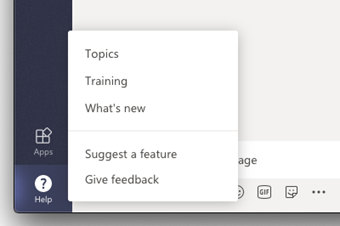
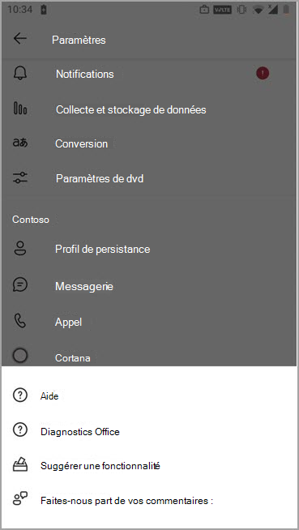
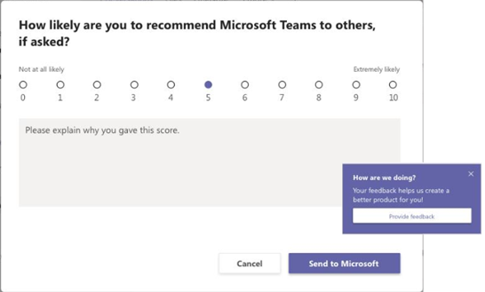

# <a name="manage-feedback-policies-in-microsoft-teams"></a>Gérer les stratégies de commentaires dans Microsoft Teams

[!INCLUDE [preview-feature](includes/preview-feature.md)]

Les utilisateurs de votre organisation peuvent envoyer des commentaires sur Microsoft Teams pour nous faire savoir comment nous travaillons directement à partir du bureau, des clients web et des appareils mobiles Teams. Nous améliorons continuellement l Teams expérience utilisateur et nous utilisons ces commentaires pour nous Teams améliorés.

> [!NOTE]
> Les stratégies de commentaires ne sont pas disponibles Cloud de la communauté du secteur public, Cloud de la communauté du secteur public haute ou dod.

**La **fonctionnalité Donner des** commentaires**

Les utilisateurs peuvent nous envoyer des commentaires et des suggestions Teams’aide pour envoyer des commentaires dans Teams  >   bureau et web.




Accédez aux commentaires sur les appareils mobiles à **l’Paramètres**  >  **de l& pour envoyer** des  >  **commentaires.**



 Les données  envoyées  via Envoyer des commentaires et Envoyer des commentaires sont considérées comme des « données de support » dans le cadre de votre accord Microsoft 365 ou Office 365, y compris les informations qui seraient autrement considérées comme « Données client » ou « Données personnelles ».


**Enquêtes**

Les utilisateurs peuvent également évaluer leur expérience avec Teams et nous envoyer des détails sur l’évaluation qu’ils donnent. Cette enquête pop-up est affichée aux utilisateurs de temps à autre dans Teams. Lorsqu’un utilisateur sélectionne Fournir **des commentaires** dans la notification, l’enquête est affichée pour lui.



## <a name="set-whether-users-can-send-feedback-about-teams-to-microsoft"></a>Définir si les utilisateurs peuvent envoyer des commentaires sur Teams à Microsoft

En tant qu’administrateur, vous pouvez contrôler si les utilisateurs de votre organisation peuvent envoyer des commentaires sur Teams à Microsoft et s’ils reçoivent l’enquête. Par défaut, la stratégie globale (à l’échelle de l’organisation) est automatiquement attribuée à tous les utilisateurs de votre organisation, et la fonctionnalité de commentaires et l’enquête sont activées dans la stratégie. La seule exception est Teams pour l'éducation, où les fonctionnalités sont activées pour les enseignants et désactivées pour les étudiants.

Vous pouvez modifier la stratégie globale ou créer et affecter une stratégie personnalisée. Une fois que vous avez modifié la stratégie globale ou attribué une stratégie personnalisée, l’application des modifications peut prendre quelques heures.

Par exemple, vous voulez autoriser tous les utilisateurs de votre organisation à envoyer des commentaires et à recevoir des enquêtes, à l’exception des nouvelles recrues en formation. Dans ce scénario, vous créez une stratégie personnalisée pour désactiver à la fois les fonctionnalités et l’affecter à de nouvelles recrues. Tous les autres utilisateurs de votre organisation obtiennent la stratégie globale avec les fonctionnalités désactivées.  

Vous gérez les stratégies de commentaires à l’aide de PowerShell. Utilisez [ **l’cmdlet New-CsTeamsFeedbackPolicy**](/office365/enterprise/powershell/manage-skype-for-business-online-with-office-365-powershell) pour créer une stratégie personnalisée. Utilisez **l’cmdlet Grant-CsTeamsFeedbackPolicy** pour l’affecter à un ou plusieurs utilisateurs ou groupes d’utilisateurs, tels qu’un groupe de sécurité ou un groupe de distribution. Utilisez **Set-CsTeamsFeedbackPolicy pour** définir des indicateurs spécifiques.

Pour désactiver et activer les fonctionnalités, définissez les paramètres suivants :

 - **Donnez des** commentaires : Définissez le  **paramètre userInitiatedMode** pour permettre aux utilisateurs affectés à la stratégie de faire part de leurs commentaires. La désactivation du paramètre **désactive** la fonctionnalité et les utilisateurs à qui la stratégie est attribuée n’ont pas la possibilité d’apporter des commentaires.

 - **Enquêtes**: définissez le **paramètre ReceiveSurveysMode** pour permettre aux utilisateurs affectés à la stratégie de recevoir l’enquête.  Pour que les utilisateurs reçoivent l’enquête et les autorisent à se désavertr, définissez le paramètre sur **enabledUserOverride.** Dans Teams, les utilisateurs peuvent ensuite se rendre sur Paramètres confidentialité et choisir s’ils  >   souhaitent participer à des enquêtes. La désactivation du paramètre **désactive** la fonctionnalité et les utilisateurs à qui la stratégie est attribuée ne recevront pas l’enquête.

 - **E-mail**: utilisez **l’indicateur AllowEmailCollection** pour ajouter un champ de courrier.
 - **Collection de** journaux : Utilisez **l’indicateur AllowLogCollection** pour ajouter l’option d’option de collection de journaux pour les utilisateurs. La collecte de journaux est actuellement activée uniquement sur mobile. Pour plus d’informations sur les données partagées via les [journaux, en savoir plus.](https://go.microsoft.com/fwlink/?linkid=2168178)

## <a name="create-a-custom-feedback-policy"></a>Créer une stratégie de commentaires personnalisée

Dans cet exemple, nous créons une stratégie de commentaires appelée Stratégie de commentaires sur les nouvelles recrues et nous cessons de donner des commentaires via l’envoi de **commentaires** et l’enquête.

```PowerShell
New-CsTeamsFeedbackPolicy -identity "New Hire Feedback Policy" -userInitiatedMode disabled -receiveSurveysMode disabled
```

## <a name="assign-a-custom-feedback-policy-to-users"></a>Attribuer une stratégie de commentaires personnalisée aux utilisateurs

[!INCLUDE [assign-policy](includes/assign-policy.md)]

Dans cet exemple, nous affectons une stratégie personnalisée nommée Stratégie de commentaires sur les nouvelles recrues à un utilisateur nommé utilisateur1.

```PowerShell
Grant-CsTeamsFeedbackPolicy -Identity user1@contoso.com -PolicyName "New Hire Feedback Policy"
```

## <a name="related-topics"></a>Sujets associés

- [Aperçu de Teams PowerShell](teams-powershell-overview.md)
- [Attribuer des stratégies à vos utilisateurs](policy-assignment-overview.md)
