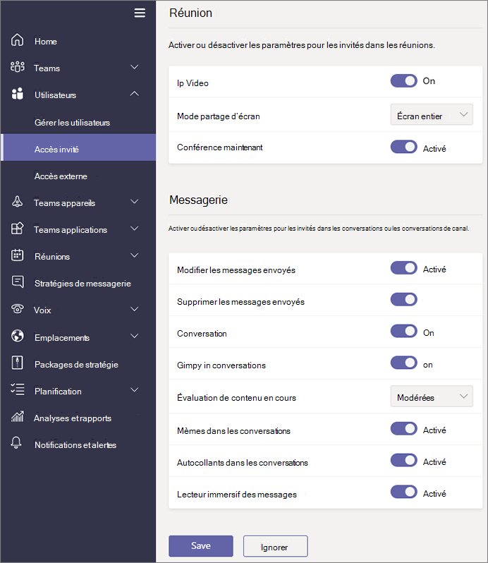

Gérer l'accès invité dans Microsoft Teams
======================================

**Invité** est un type de licence d’utilisateur dans Microsoft Teams qui est inclus avec tous les abonnements Office 365 entreprise Premium, Office 365 pour entreprises et Office 365 éducation. Aucune licence Office 365 supplémentaire n'est requise. L'accès invité de Teams est un paramètre de niveau client et est désactivé par défaut. Pour plus d’informations sur la façon d’activer l’accès invité, voir [Activer ou désactiver l’accès invité aux équipes de Microsoft](set-up-guests.md).

Une fois que le type de licence d’utilisateur **invité** est activé, vous pouvez configurer les paramètres pour les invités via les contrôles décrites dans [les fonctionnalités de gérer les équipes Microsoft dans votre organisation Office 365](enable-features-office-365.md) et [gérer des équipes pendant la transition vers le nouveau Microsoft Centre d’administration équipes](manage-teams-skypeforbusiness-admin-center.md).     
    
Les administrateurs informatiques peuvent ajouter des invités au niveau du client, définir et gérer les autorisations et les stratégies d’utilisateur invité et extrait les rapports sur les activités de l’utilisateur invité. Ces contrôles sont disponibles dans le centre d’administration Microsoft Teams. Le contenu et les activités des utilisateurs invités font l'objet de la même protection en matière de conformité et de vérification que le reste d'Office 365.

Propriétaires de l’équipe peuvent inviter de nouveaux invités et ajoutez utilisateurs invité existant à leurs équipes. Les propriétaires de l’équipe permettant d’identifier les utilisateurs invités par le biais des **équipes** > **Gérer les équipes**et fonctionnalités canal ensemble pour les visiteurs par le biais des **paramètres de l’organisation** > **accès invité**, y compris ce qui permet de créer, mettre à jour, les invités et supprimer des chaînes, comme illustré dans la capture d’écran suivante.

  
Vous pouvez utiliser le portail d’Azure Active Directory pour gérer les invités et leur accès à Office 365 et ressources d’équipes. L'accès invité Teams utilise les fonctionnalités de collaboration entre entreprises (B2B) d'Azure Active Directory comme infrastructure sous-jacente pour stocker les informations relatives aux principes de sécurité telles que les propriétés d'identité, l'appartenance à un groupe et les paramètres d'authentification multifacteur. Pour en savoir plus sur Azure Active Directory B2B, reportez-vous aux rubriques [Qu'est-ce que Azure AD B2B Collaboration ?](https://go.microsoft.com/fwlink/p/?linkid=853011) et [Forums aux questions sur Azure Active Directory B2B Collaboration](https://go.microsoft.com/fwlink/p/?linkid=853020).

> [!NOTE]
> Microsoft Teams respecte toujours les paramètres externes Azure Active Directory pour autoriser ou empêcher les ajouts d’utilisateur invité au client. Pour plus d’informations, voir [Autoriser l’accès invité dans les équipes Microsoft](Teams-dependencies.md).
  
## Accès invité et l’accès externe (fédération)

[!INCLUDE [guest-vs-external-access](includes/guest-vs-external-access.md)]

## Passez en revue les accès invité régulièrement

Dans les équipes, vous pouvez ajouter des 5 invités pour chaque utilisateur sous licence. En raison de cette limitation, ou parce que vous souhaitez conserver votre client à jour, vous devez consulter accès invité régulièrement pour identifier les utilisateurs qui ont accès qu’ils n’avez plus besoin. Vous pouvez utiliser Azure Active Directory (AD Azure) pour créer un contrôle d’accès pour les membres du groupe ou les utilisateurs affectés à une application. Création périodique accès révisions peut faire gagner du temps. Si vous devez consulter régulièrement les utilisateurs qui ont accès à une application ou qui sont membres d’un groupe, vous pouvez définir la fréquence de ces examens. 

Vous pouvez effectuer un examen de l’accès invité vous-même, demandez aux invités à consulter leur propre appartenance ou demandez à un propriétaire de l’application ou décisionnaire révision de l’accès. Le portail Azure vous permet d’effectuer des révisions de l’accès invité. Pour plus d’informations, voir [Gérer les accès invité avec accès Azure AD passe en revue](https://docs.microsoft.com/en-us/azure/active-directory/governance/manage-guest-access-with-access-reviews).

###  Conditions requises

Accès révisions sont disponibles avec l’édition Premium P2 d’Azure AD, qui est inclus dans Microsoft Enterprise mobilité + sécurité, E5. Pour plus d’informations, voir « Choisissez une édition » dans les [éditions d’Azure Active Directory](https://docs.microsoft.com/en-us/azure/active-directory/fundamentals/active-directory-whatis). Chaque utilisateur qui interagit avec cette fonctionnalité en créant un examen, remplissez un examen ou leur accès, confirmant le bon fonctionnement doit avoir une licence. 

Les équipes ne limiter le nombre de visiteurs, vous pouvez ajouter. Toutefois, le nombre total d’invités qui peuvent être ajoutés à votre client repose sur quels vos licences de DAS permet. Pour plus d’informations, voir [Gestion des licences de collaboration Azure AD B2B](https://docs.microsoft.com/en-us/azure/active-directory/b2b/licensing-guidance).

## Latences d’accès invité

Les paramètres d'invité sont définis dans Azure Active Directory. Il faut environ 2 à 24 heures pour que les modifications prennent effet dans votre organisation Office 365. Si un utilisateur voit le message « Contactez votre administrateur » lorsqu’ils essaient d’ajouter un invité à leur équipe, il est probable que la fonctionnalité invité n’a pas été activée ou que les paramètres ne sont pas encore efficaces.

## Plus d’informations

Pour plus d’informations sur l’utilisation de PowerShell pour gérer l’accès invité, voir [Utilisation de PowerShell pour contrôler l’accès invité à une équipe](guest-access-powershell.md).

