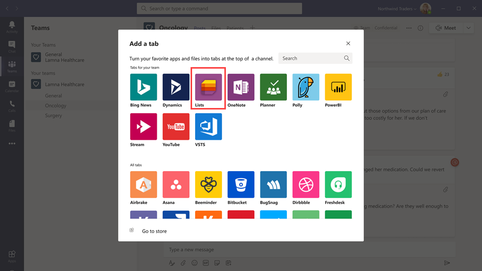

# Gérer l’application Listes pour votre organisation dans Microsoft Teams

## Vue d’ensemble des listes

L’application Listes de Microsoft Teams aide les utilisateurs de votre organisation à suivre les informations, à organiser le travail et à gérer les flux de travail. Avec les listes, les utilisateurs peuvent suivre des données telles que des problèmes, des ressources, des routines, des contacts, un inventaire, des incidents, des prêts, des patients, etc. à l’aide d’affichages personnalisables, de règles et d’alertes pour assurer la synchronisation de tous les membres de l’équipe.

Dans Teams, les utilisateurs accèdent aux listes en tant qu’onglet dans un canal. Cliquez pour ouvrir la galerie d’onglets et ajouter une **+** nouvelle instance d’onglet d’application Listes à un canal pour commencer.

Les utilisateurs peuvent créer des listes ou épingler des listes existantes au sein de la même équipe ou à partir d’un autre site SharePoint à partir de celui-ci. Les nouvelles listes peuvent être créées de toutes pièces à partir de modèles intégrés, basés sur la structure d’une liste existante, ou en important des données à partir d’un feuille de calcul Excel. L’application Listes est disponible dans les clients de bureau, web et mobiles Teams.

## Modèles

Les modèles dans les listes sont adaptés aux scénarios courants de suivi des informations pour les utilisateurs. Chaque modèle est livré avec une structure de liste prédéfinée, des dispositions de formulaire et des options de mise en forme au niveau d’un affichage de liste et d’un niveau d’affichage détaillé pour aider les utilisateurs à démarrer rapidement. Après avoir sélectionné un modèle, les utilisateurs obtiennent un aperçu de l’apparence de la liste, ainsi que des exemples de données. Voici quelques exemples de la façon dont les équipes de votre organisation peuvent utiliser les modèles prédéfinés dans les listes :

- Suivez les problèmes et clôturez-les à l’aide du modèle de suivi des problèmes.
- Organisez tous les détails de l’événement avec le modèle d’itinéraire de l’événement.
- Utilisez le modèle Patients pour enregistrer les besoins et le statut des patients pour les équipes médicales de votre organisation de soins de santé afin de surveiller et coordonner les soins.
- Suivez l’état des demandes de prêt avec le modèle Prêt.

## Exemple de scénario

Un bureau de publication local est responsable du tri et de la livraison des courriers dans son district. Chaque matin, une équipe se blottait le bureau de la publication pour passer en revue les objectifs quotidiens, partager des annonces et discuter des incidents connus.

Après le blottage, les opérateurs de courrier décrochent leur courrier et commencent leur itinéraire de remise. Des incidents peuvent se produire le long d’un itinéraire (accident de véhicule, problème lié à un chien, réseau social, etc.). Lorsque les opérateurs de messagerie rencontrent un incident, ils utilisent Teams sur leurs appareils mobiles pour enregistrer les détails de l’incident, qui sont suivis dans une liste dans le canal d’équipe. Tous les membres de l’équipe, y compris les opérateurs de messagerie sur le terrain, peuvent consulter ces informations et rester informés.

Avant de passer à Teams, les opérateurs de messagerie deviez revenir au bureau de publication pour remplir un formulaire de copie papier pour signaler un incident entré dans une feuille de calcul Excel. Teams offre aux opérateurs de messagerie une expérience d’utilisation en premier lieu des opérateurs mobiles, où ils peuvent utiliser des listes pour signaler des incidents sur le terrain dès qu’ils se produisent, partager des détails d’incident avec les membres de l’équipe, avoir des conversations à leur sujet sur le canal et conduire les incidents à la résolution.

## Ce que vous devez savoir sur les listes

### Des listes sont disponibles dans tous les canaux et équipes

Les listes sont préinstallées pour tous les utilisateurs de Teams et sont disponibles directement dans la galerie d’onglets de chaque équipe et canal. Cela signifie que les utilisateurs n’ont pas à se rendre dans le magasin d’applications Teams pour l’installer.

### Listes et SharePoint

Les données de listes sont stockées dans le site d’équipe SharePoint Online. Pour en savoir plus sur l’interaction de SharePoint Online avec Teams, voir Comment SharePoint Online et [OneDrive Entreprise interagissent avec Teams](SharePoint-OneDrive-interact.md).

Les autorisations définies dans SharePoint s’appliquent aux listes créées dans l’application Listes. Par défaut, les listes héritent des autorisations du site auquel elles appartiennent. Ces autorisations régissent les types d’actions que les utilisateurs peuvent réaliser, par exemple, s’ils peuvent créer ou modifier des listes. Pour plus d’informations, voir [Niveaux d’autorisation](https://docs.microsoft.com/sharepoint/understanding-permission-levels) dans SharePoint et Niveaux d’autorisation [utilisateur dans SharePoint Server.](https://docs.microsoft.com/sharepoint/sites/user-permissions-and-permission-levels)

Dans certains scénarios, vous pouvez restreindre les actions que les utilisateurs peuvent faire dans les listes. Par exemple, une personne d’une équipe modifie un affichage de liste, ce qui modifie l’affichage pour tous les membres de l’équipe et vous voulez autoriser uniquement le propriétaire de l’équipe ou certains membres à modifier les affichages de liste. Pour en savoir plus, voir Personnaliser les autorisations pour une liste ou une bibliothèque [SharePoint.](https://support.microsoft.com/office/customize-permissions-for-a-sharepoint-list-or-library-02d770f3-59eb-4910-a608-5f84cc297782#ID0EAACAAA=Online,_2019,_2016,_2013)

> [!NOTE]
> À ce stade, les autorisations de propriétaire et de membre dans une équipe ne sont liées d’aucune manière à des autorisations dans le site d’équipe qui régissent le comportement des listes ou de l’application Listes. Toutefois, en fonction des commentaires des clients et de l’utilisation, ce processus sera envisagé pour une itération ultérieure du produit.  

### Limitations

Grâce aux listes, les utilisateurs peuvent obtenir une expérience de bureau, web et mobile. Il est important de savoir que les utilisateurs ne peuvent pas créer de nouvelles listes ou épingler des listes existantes à l’aide de listes dans le client mobile Teams. Pour afficher ou modifier une liste sur le client mobile Teams, une liste doit d’abord être créée ou ajoutée à l’aide de listes sur le client de bureau ou web de Teams.

Les invités ne peuvent pas créer ou supprimer une liste. Ils peuvent ajouter des éléments de liste à des listes existantes, démarrer de nouvelles conversations sur des éléments de liste et répondre à des conversations existantes concernant des éléments de liste.

### Listes et application SharePoint

Si des utilisateurs de votre organisation ont créé des listes à l’aide de l’application SharePoint, ces listes sont automatiquement déplacées vers des listes sans aucune action requise de la part de l’utilisateur. Pour obtenir une expérience d’intégration de listes la plus complète et la plus riche dans Teams, utilisez l’application Listes et épinglez vos listes existantes.

## Configurer des listes

### Activer ou désactiver des listes dans votre organisation

Les listes sont activées par défaut pour tous les utilisateurs de Teams dans votre organisation. Vous pouvez désactiver ou activer l’application au niveau de l’organisation sur la page [Gérer les](manage-apps.md) applications du Centre d’administration Microsoft Teams.

1. Dans le panneau de navigation gauche du Centre d’administration Microsoft Teams, allez à **l’application Teams** Gérer  >  **les applications.**
2. Effectuez l’une des opérations suivantes :

    - Pour désactiver les listes pour votre organisation, recherchez l’application Listes, sélectionnez-la, puis cliquez sur **Bloquer.**
    - Pour activer les listes pour votre organisation, recherchez l’application Listes, sélectionnez-la, puis cliquez sur **Autoriser.**

### Activer ou désactiver des listes pour des utilisateurs spécifiques de votre organisation

Pour autoriser ou empêcher des utilisateurs spécifiques de votre organisation d’utiliser les listes, assurez-vous que l’application Listes est désactivée pour votre organisation sur la [page](manage-apps.md) Gérer les applications, puis créez une stratégie d’autorisation d’application personnalisée et attribuez-la à ces utilisateurs. Pour en savoir plus, consultez [Gérer les stratégies d’autorisation d’application dans Teams.](teams-app-permission-policies.md)

## Rechercher des événements de liste dans le journal d’audit

Les listes sont activées avec l’audit au niveau de l’entreprise pour vous permettre de rechercher des listes et des événements d’éléments de liste dans le journal d’audit dans le Centre & conformité. Pour en savoir plus, [consultez le journal d’audit dans](https://docs.microsoft.com/microsoft-365/compliance/search-the-audit-log-in-security-and-compliance)le Centre & conformité.

Pour obtenir la liste des événements d’audit pertinents pour l’application Listes dans Teams, consultez les activités de la [liste SharePoint.](https://docs.microsoft.com/microsoft-365/compliance/search-the-audit-log-in-security-and-compliance#sharepoint-list-activities)

Avant d’effectuer des recherches dans le journal d’audit, vous devez activer l’audit dans le Centre [& conformité.](https://protection.office.com) N’oubliez pas que les données d’audit sont uniquement disponibles à partir du moment où vous avez désactivé l’audit.

## API Power Automate, Power Apps et Graph

Les listes prend [en charge Power Automate pour](https://docs.microsoft.com/power-automate/flow-types) les flux de travail et Power Apps [pour](https://docs.microsoft.com/powerapps/maker/canvas-apps/customize-list-form) les formulaires de liste. Les développeurs peuvent utiliser [l’API Listes](https://docs.microsoft.com/sharepoint/dev/sp-add-ins/working-with-lists-and-list-items-with-rest) pour connecter des données de liste en tant que source via Microsoft Graph.

## Donner un commentaire ou signaler un problème
  
Pour nous envoyer des commentaires  ou signaler un problème, cliquez sur Aide en bas du navigation gauche dans Teams, puis sélectionnez **Signaler un problème.** **Sélectionnez** Listes, puis entrez vos commentaires ou détails sur le problème que vous rencontrez.

## Voir aussi

- [Documentation d’aide sur les listes](https://support.microsoft.com/office/apps-and-services-cc1fba57-9900-4634-8306-2360a40c665b#PickTab=Lists)
