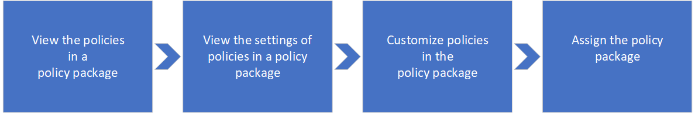

# Gérer les packages de stratégie pour Microsoft Teams

Un package de stratégie dans Microsoft Teams est un ensemble de stratégies et de paramètres de stratégie prédéfinis que vous pouvez affecter aux utilisateurs ayant des rôles similaires dans votre organisation. Nous avons créé des packages de stratégie pour simplifier, simplifier et fournir une cohérence lors de la gestion des stratégies pour les groupes d’utilisateurs au sein de votre organisation.  

Vous pouvez utiliser les [packages de stratégie inclus dans Teams](#policy-packages-included-in-teams) ou [créer vos propres packages de stratégie personnalisés](#custom-policy-packages).

:::image type="content" source="media/policy-packages-admin-center.png" alt-text="Capture d’écran de la page Packages de stratégie dans le Centre d’administration." lightbox="media/policy-packages-admin-center.png":::

Vous pouvez personnaliser les paramètres des stratégies dans un package de stratégie en fonction des besoins de vos utilisateurs. Lorsque vous modifiez les paramètres des stratégies dans un package, tous les utilisateurs affectés à ce package obtiennent les paramètres mis à jour. Vous gérez les packages de stratégie à l’aide du Centre d’administration Microsoft Teams ou de PowerShell.

## Qu’est-ce qu’un package de stratégie ?

Les packages de stratégie vous permettent de contrôler les fonctionnalités Teams que vous souhaitez autoriser ou restreindre pour des groupes spécifiques de personnes au sein de votre organisation. Chaque package de stratégie dans Teams est conçu autour d’un rôle d’utilisateur et inclut des stratégies et des paramètres de stratégie prédéfinis qui prennent en charge les activités de collaboration et de communication classiques pour ce rôle.

Les packages de stratégie prennent en charge les types de stratégies Teams suivants :

- Stratégie de messagerie
- Stratégie de réunion
- Stratégie de configuration des applications
- Stratégie d’Appel
- Stratégie d’événements en direct

## Packages de stratégie inclus dans Teams

Teams inclut actuellement les packages de stratégie suivants.

| Nom du package | Description |
|---------|---------|
|Education (étudiant de l’enseignement supérieur)    |Crée un ensemble de stratégies et de paramètres de stratégie qui s’appliquent aux étudiants de l’enseignement supérieur.|
|Éducation (élève de l’école primaire)   |Crée un ensemble de stratégies et de paramètres de stratégie qui s’appliquent aux étudiants du primaire.|
|Éducation (élève de l’école secondaire)    |Crée un ensemble de stratégies et de paramètres de stratégie qui s’appliquent aux étudiants du secondaire.         |
|Éducation (Enseignant)    |Crée un ensemble de stratégies et de paramètres de stratégie qui s’appliquent aux enseignants.      |
|Éducation (enseignant de l’école primaire utilisant l’apprentissage à distance)    |Création d’un groupe de stratégies qui s’appliquent aux enseignants du primaire pour optimiser la sécurité et la collaboration des étudiants lors de l’utilisation de l’apprentissage à distance.      |
|Éducation (élève de l’école primaire utilisant l’apprentissage à distance)    |Création d’un groupe de stratégies qui s’appliquent aux étudiants du primaire pour optimiser la sécurité et la collaboration des étudiants lors de l’utilisation de l’apprentissage à distance.      |
|Gestionnaire de première ligne |Crée un ensemble de stratégies et applique ces paramètres aux responsables de première ligne de votre organisation. |
|Travailleur de première ligne |Crée un ensemble de stratégies et applique ces paramètres aux employés de première ligne de votre organisation. |
|Professionnel de la santé  |Crée un ensemble de stratégies et de paramètres de stratégies qui offrent aux travailleurs cliniques tels que les infirmières autorisées, les infirmières responsables, les médecins et les travailleurs sociaux un accès complet à la conversation, aux appels, à la gestion des équipes et aux réunions. |
|Travailleurs de l’information sur le secteur de la santé  |Crée un ensemble de stratégies et de paramètres de stratégie qui donnent aux travailleurs de l’information, par exemple, le personnel de l’information, l’informatique, le personnel financier et les responsables de la mise en conformité, un accès total aux discussions, aux appels et aux réunions.|
|Salle de soins de santé  |Crée un ensemble de stratégies et de paramètres de stratégie qui s’appliquent aux salles des patients dans votre organisation de santé. |
|Agent de sécurité publique   |Crée un ensemble de stratégies et de paramètres de stratégie qui s’appliquent aux agents de sécurité publique de votre organisation.|
|Utilisateur petite et moyenne entreprise (Business Voice) |Crée une stratégie de configuration d’application qui inclut les applications pour une expérience de voix professionnelle pour les utilisateurs.|
|Utilisateur petite et moyenne entreprise (sans Business Voice) |Crée une stratégie de configuration d’application adaptée aux utilisateurs teams des petites et moyennes entreprises sans aucune fonctionnalité business voice.

> [!NOTE]
> Nous allons ajouter d’autres packages de stratégie dans les prochaines versions de Teams. Par conséquent, vérifiez les informations les plus récentes.  

Chaque stratégie individuelle reçoit le nom du package de stratégie afin de vous permettre d’identifier facilement les stratégies liées à un package de stratégie.
Par exemple, lorsque vous attribuez le package de stratégie Éducation (Enseignant) aux enseignants de votre établissement scolaire, une stratégie nommée Education_Teacher est créée pour chaque stratégie du package.

:::image type="content" source="media/teams-policy-packages-education.png" alt-text="Capture d’écran du package de stratégie Éducation (Enseignant)." lightbox="media/teams-policy-packages-education.png":::

## Packages de stratégie personnalisés

> [!NOTE]
> La fonctionnalité packages de stratégie personnalisée est disponible en préversion. Pour utiliser cette fonctionnalité après la préversion, chaque utilisateur a besoin de la licence Teams Premium.

Les packages de stratégie personnalisés vous permettent de regrouper votre propre ensemble de stratégies pour les utilisateurs ayant des rôles similaires dans votre organisation. Créez vos propres packages de stratégies en ajoutant les types de stratégies et les stratégies dont vous avez besoin.

Pour créer un package de stratégie personnalisé :

1. Dans le volet gauche du Centre d’administration Microsoft Teams, sélectionnez **Packages de** stratégie, puis cliquez sur **Ajouter**.

    :::image type="content" source="media/policy-packages-add.png" alt-text="Capture d’écran du bouton Ajouter dans la page Packages de stratégie dans le Centre d’administration." lightbox="media/policy-packages-add.png":::

2. Entrez un nom et une description pour votre package.

    :::image type="content" source="media/policy-packages-add-custom.png" alt-text="Capture d’écran de l’ajout d’un nouveau package de stratégie personnalisée." lightbox="media/policy-packages-add-custom.png":::

3. Sélectionnez les types de stratégies et les noms de stratégie à inclure dans le package.

4. Sélectionnez **Enregistrer**.

## Comment utiliser des packages de stratégie

L’exemple suivant explique comment utiliser les packages de stratégie dans votre organisation.

- **[Affichage](#view-the-settings-of-a-policy-in-a-policy-package)** : affichez les stratégies dans un package de stratégie. Ensuite, affichez les paramètres de chaque stratégie dans un package avant d’attribuer le package. Veillez à bien comprendre chaque paramètre. Déterminez si les valeurs prédéfinies sont appropriées pour votre organisation ou si vous devez les modifier pour qu’elles soient plus restrictives ou indulgentes en fonction des besoins de votre organisation.

    Si une stratégie est supprimée, vous pouvez toujours afficher les paramètres, mais vous ne pourrez pas modifier les paramètres. Une stratégie supprimée est recréée avec les paramètres prédéfinis lorsque vous attribuez le package de stratégie.

- **[Personnaliser](#customize-policies-in-a-policy-package)** : personnalisez les paramètres des stratégies dans le package de stratégie en fonction des besoins de votre organisation.

- **[Attribuer](#assign-a-policy-package)** : affectez le package de stratégie aux utilisateurs.  

> [!NOTE]
> Vous pouvez également modifier les paramètres des stratégies dans un package de stratégie après avoir affecté un package. Les modifications que vous apportez aux paramètres de stratégie sont automatiquement appliquées aux utilisateurs auxquels le package est attribué.

Voici les étapes à suivre pour afficher, attribuer et personnaliser des packages de stratégie dans le Centre d’administration Microsoft Teams.

### Afficher les paramètres d’une stratégie dans un package de stratégie

1. Dans le volet gauche du Centre d’administration Microsoft Teams, sélectionnez **Packages de** stratégie, puis sélectionnez un package de stratégie en cliquant à gauche du nom du package.

2. Sélectionnez la stratégie que vous souhaitez afficher.

### Personnaliser des stratégies dans un package de stratégies

Vous pouvez modifier les paramètres d’une stratégie via la page **Packages** de stratégie ou en accédant directement à la page de stratégie dans le Centre d’administration Microsoft Teams.

1. Dans le volet gauche du Centre d’administration Microsoft Teams, effectuez l’une des opérations suivantes :
    - Sélectionnez **Packages de** stratégie, puis sélectionnez le package de stratégie en cliquant à gauche du nom du package.
    - Sélectionnez le type de stratégie.  Par exemple, cliquez sur **Stratégies de messagerie**.

2. Sélectionnez la stratégie que vous souhaitez modifier. Les stratégies liées à un package de stratégie portent le même nom que le package de stratégie.

3. Apportez les modifications souhaitées, puis cliquez sur **Enregistrer**.

### Affecter un package de stratégie

Vous pouvez affecter un package de stratégie à un utilisateur individuel, à un groupe ou à un lot d’utilisateurs. Pour plus d’informations sur l’attribution de packages de stratégie, consultez [Attribuer des packages de stratégie à des utilisateurs et des groupes](assign-policy-packages.md).

## Rubriques connexes

- [Affecter des packages de stratégie](assign-policy-packages.md)
- [Packages de stratégie Teams pour les administrateurs EDU](policy-packages-edu.md)
- [Packages de stratégie Teams pour la santé publique](policy-packages-healthcare.md)
- [Packages de stratégie Teams pour le secteur public](policy-packages-gov.md)
