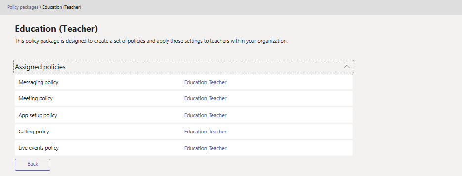

# Gérer les packages de stratégie dans Microsoft teams

Un package de stratégie dans Microsoft teams est un ensemble de stratégies et de paramètres de stratégie prédéfinis que vous pouvez affecter aux utilisateurs ayant des rôles similaires au sein de votre organisation. Nous avons conçu des packages de stratégie pour simplifier, rationaliser et garantir la cohérence lors de la gestion des stratégies pour les groupes d’utilisateurs au sein de votre organisation.  

Lorsque vous attribuez un package de stratégie aux utilisateurs, les stratégies du package sont créées et vous pouvez personnaliser les paramètres des stratégies du package en fonction des besoins de votre organisation.

Les packages de stratégie ne sont pas disponibles pour les organisations américaines de la communauté Cloud.

## Qu’est-ce qu’un package de stratégie ?

Les packages de stratégie vous permettent de contrôler les fonctionnalités d’équipes que vous souhaitez autoriser ou restreindre pour des ensembles de personnes spécifiques au sein de votre organisation. Chaque package de stratégie dans teams est conçu en fonction d’un rôle d’utilisateur et comprend des stratégies et des paramètres de stratégie prédéfinis qui prennent en charge les activités de collaboration et de communication qui sont les plus typiques pour ce rôle.

Teams inclut actuellement les packages de stratégie suivants.

|**Nom du package**  |**Description** |
|---------|---------|
|Éducation (étudiant de grande éducation)    |Crée un ensemble de stratégies et de paramètres de stratégie qui s’appliquent aux étudiants de plus grande éducation.|
|Éducation (étudiant primaire)   |Crée un ensemble de stratégies et de paramètres de stratégie qui s’appliquent aux étudiants principaux.|
|Éducation (étudiant d’école secondaire)    |Crée un ensemble de stratégies et de paramètres de stratégie qui s’appliquent aux étudiants secondaires.         |
|Éducation (enseignant)    |Crée un ensemble de stratégies et de paramètres de stratégie qui s’appliquent aux enseignants.      |
|Utilisateurs petites et moyennes entreprises (voix entreprise) |Crée une stratégie de configuration d’application qui inclut les applications pour une interface vocale professionnelle.|
|Utilisateurs petites et moyennes entreprises (sans voix entreprise) |Ce package de stratégie est conçu pour créer un ensemble de stratégies et appliquer ces paramètres aux utilisateurs professionnels de petites et moyennes tailles sans fonctions vocales.|
|Officier de sûreté public   |Crée un ensemble de stratégies et de paramètres de stratégie qui s’appliquent aux responsables de la sécurité publique au sein de votre organisation.|
|Healthcare (travailleur clinique)  |Crée un ensemble de stratégies et de paramètres de stratégie qui permettent aux travailleurs cliniques tels que les infirmières, les infirmières, les médecins et les travailleurs sociaux d’avoir un accès complet aux discussions, aux appels, à la gestion des équipes et aux réunions. |
|Santé (travailleurs de l’information)  |Crée un ensemble de stratégies et de paramètres de stratégie qui permettent aux travailleurs de l’information, tels que le personnel informatique, le personnel informatique, le personnel financier et les responsables de la mise en conformité, un accès complet aux discussions, aux appels et aux réunions.|

> [!NOTE]
> Comme nous allons ajouter d’autres packages de stratégie dans les futures versions de teams, vous pouvez consulter les informations les plus récentes.  

Chaque stratégie individuelle dispose du nom du package de stratégie, ce qui vous permet d’identifier facilement les stratégies liées à un package de stratégie.
Par exemple, lorsque vous attribuez le package de stratégie éducation (enseignant) aux enseignants de votre établissement scolaire, une stratégie nommée Education_Teacher est créée pour chaque stratégie dans le package.

## Utiliser des packages de stratégie

Les plans suivants vous expliquent comment utiliser des packages de stratégie dans votre organisation.

- **[Affichage](#view-the-settings-of-a-policy-in-a-policy-package)**: Affichez les paramètres de chaque stratégie d’un package de stratégie avant d’assigner un package. Vérifiez que vous comprenez chaque paramètre et déterminez si les valeurs prédéfinies conviennent à votre organisation, ou si vous devez les modifier de manière à ce qu’elles soient plus restrictives ou strictes en fonction des besoins de votre organisation.

    Si une stratégie est supprimée, vous pouvez toujours afficher les paramètres, mais vous ne pourrez pas modifier les paramètres. Une stratégie supprimée est à nouveau créée à l’aide des paramètres prédéfinis lorsque vous attribuez le package de stratégie.

- **[Attribuer](#assign-a-policy-package)**: attribuez le package de stratégie aux utilisateurs. N’oubliez pas que les stratégies d’un package de stratégie ne sont pas créées tant que vous n’avez pas affecté le package, vous pouvez modifier les paramètres des stratégies individuelles du package.  

- **[Personnaliser](#customize-policies-in-a-policy-package)**: Personnalisez les paramètres des stratégies dans le package de stratégie pour répondre aux besoins de votre organisation. Les modifications que vous apportez aux paramètres de stratégie s’appliquent automatiquement aux utilisateurs qui ont reçu le package.

Voici les étapes à suivre pour afficher, attribuer et personnaliser des packages de stratégie dans le centre d’administration Microsoft Teams.

### Afficher les paramètres d’une stratégie dans un package de stratégie

1. Dans le volet de navigation de gauche du centre d’administration de Microsoft Teams, cliquez sur **packages de stratégie**, puis sélectionnez un package de stratégie en cliquant à gauche du nom du package.
2. Cliquez sur la stratégie que vous voulez afficher.

### Assigner un package de stratégie

#### Assigner un package de stratégie à un utilisateur

1. Dans le volet de navigation de gauche du centre d’administration de Microsoft Teams, accédez à **utilisateurs**, puis cliquez sur l’utilisateur.
2. Sur la page de l’utilisateur, cliquez sur **stratégies**, puis en regard de **package de stratégie**, cliquez sur **modifier**.
3. Dans le volet **affecter un package de stratégie** , sélectionnez le package que vous voulez attribuer, puis cliquez sur **Enregistrer**.

#### Assigner un package de stratégie à plusieurs utilisateurs

1. Dans le volet de navigation de gauche du centre d’administration de Microsoft Teams, accédez à **packages de stratégie**, puis sélectionnez le package de stratégie que vous voulez affecter en cliquant à gauche du nom du package.
2. Cliquez sur **gérer les utilisateurs**.
3. Dans le volet **gérer les utilisateurs** , recherchez l’utilisateur par nom complet ou par nom d’utilisateur, sélectionnez le nom, puis cliquez sur **Ajouter**. Répétez cette étape pour chaque utilisateur que vous souhaitez ajouter.
4. Lorsque vous avez terminé d’ajouter des utilisateurs, cliquez sur **Enregistrer**.

### Personnaliser les stratégies dans un package de stratégie

Vous pouvez modifier les paramètres d’une stratégie par le biais de la page **packages de stratégie** ou en accédant directement à la page de stratégie dans le centre d’administration Microsoft Teams.

1. Dans le volet de navigation de gauche du centre d’administration de Microsoft Teams, effectuez l’une des opérations suivantes :
    - Cliquez sur **packages de stratégie**, puis sélectionnez le package de stratégie en cliquant à gauche du nom du package.
    - Cliquez sur le type de stratégie.  Par exemple, cliquez sur **stratégies de messagerie**.
2. Cliquez sur la stratégie que vous voulez modifier. Les stratégies liées à un package de stratégie portent le même nom que le package de stratégie.
3. Apportez les modifications souhaitées, puis cliquez sur **Enregistrer**.

## Résolution des problèmes

**Vous recevez un message d’erreur lorsque vous attribuez un package de stratégie**

Cela risque de se produire si une ou plusieurs stratégies du package n’ont pas été créées ou appliquées. Réattribuez-le à vos utilisateurs. Le renouvellement de l’opération résout généralement ce problème.

## Sujets associés

[Packages de stratégie Microsoft Teams pour les administrateurs dans l’éducation](policy-packages-edu.md)
