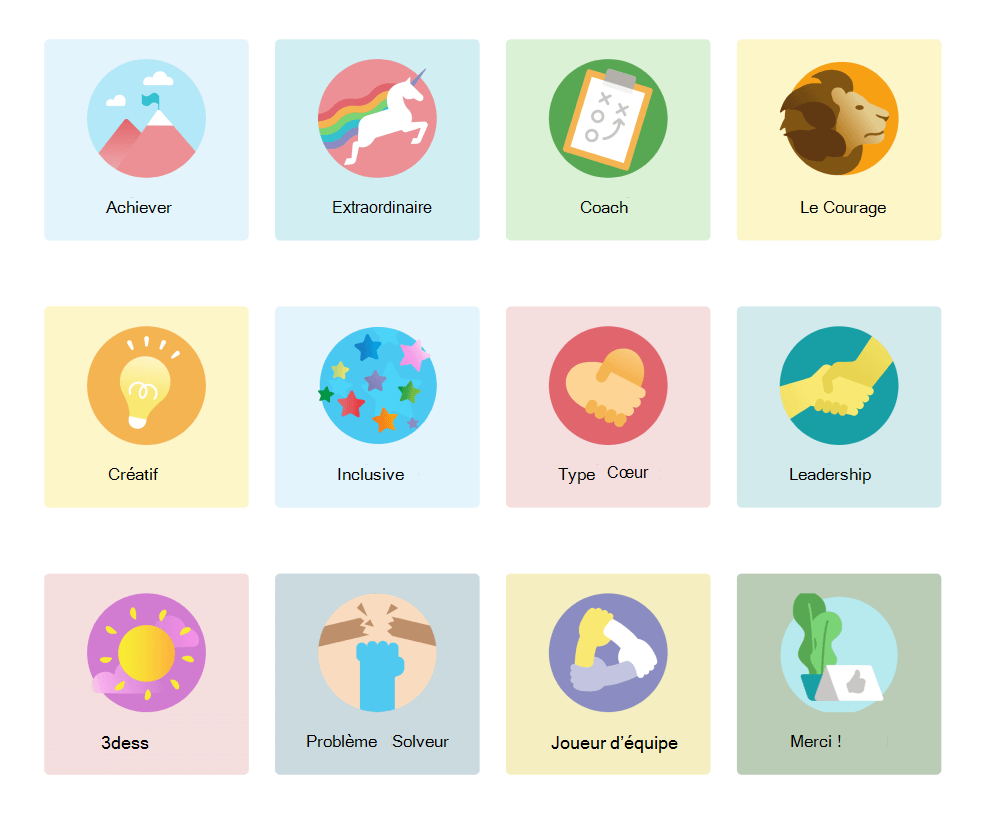
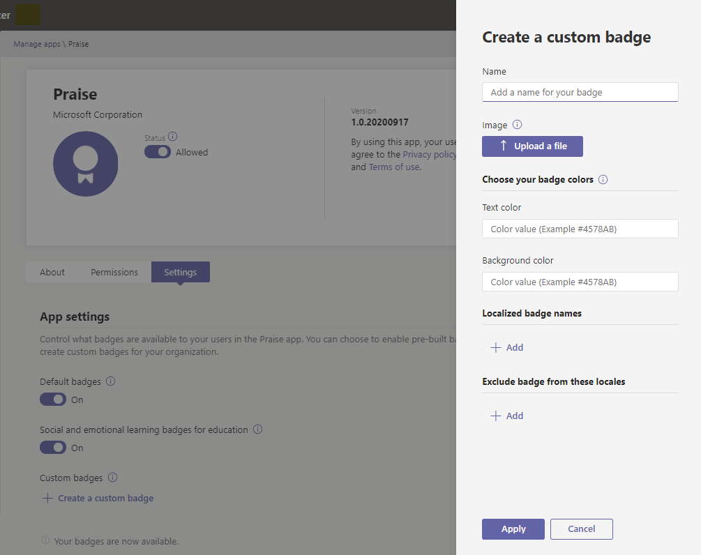
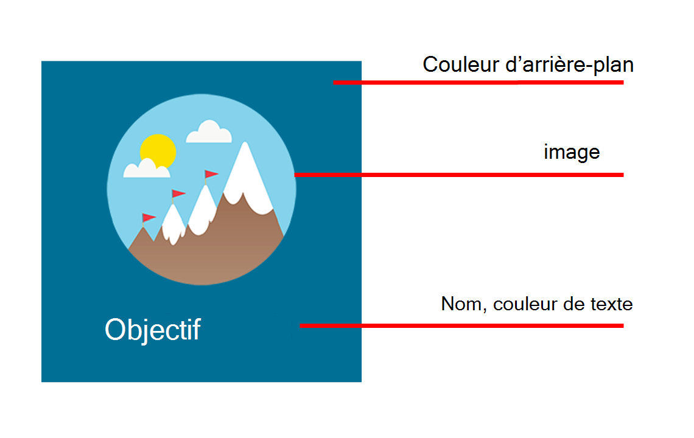

# Gérer l’Compliment dans le Centre d’administration Microsoft Teams’administration

> [!NOTE]
> Les administrateurs doivent avoir Teams licence pour accéder à cette fonctionnalité. Si vous essayez d’accéder à cette fonctionnalité sans licence Teams, vous recevrez un message d’erreur.

L’Compliment dans Microsoft Teams permet aux utilisateurs de montrer aux membres de leur organisation ou de leur classe que vous les appréciez. Avec une sélection de badges parmi plusieurs et la possibilité de créer vos propres badges, Compliment est conçu pour vous aider à reconnaître les efforts déployés dans le vaste éventail de travaux des utilisateurs de Teams, des enseignants aux employés en ligne en avant-plan. Pour en savoir plus, consultez [Envoyer des Compliment aux personnes.](https://support.microsoft.com/office/send-praise-to-people-50f26b47-565f-40fe-8642-5ca2a5ed261e)

Les administrateurs peuvent contrôler les badges disponibles pour leur organisation à partir du Microsoft Teams d’administration. Dans le groupe de navigation de gauche, **Teams les applications > Gérer les applications.** Dans la liste des applications, cliquez **Compliment,** puis sélectionnez **Paramètres.**  À partir de là, vous pouvez choisir d’activer les badges par défaut et intégrés, et de créer des badges personnalisés.

> [!NOTE]
> L’Compliment est disponible pour l Cloud de la communauté du secteur public dans le cloud, mais pas pour les Cloud de la communauté du secteur public haute ou dod.

## Utiliser des badges intégrés

Les ensembles intégrés sont des collections de badges conçus par Microsoft pour l’Compliment appe. Ces ensembles ne peuvent pas être modifiés par les administrateurs. Le jeu de badges par défaut est déjà activé et disponible dans l’Compliment appe. Pour modifier la disponibilité du jeu par défaut ou des badges, activez ou dés éteindre le bouton bascule correspondant. 

<a name="default-badges"> </a>

### Badges par défaut

Le jeu de badges par défaut est conçu pour aider les Teams utilisateurs à reconnaître leurs pairs pour être au-dessus et au-delà de leur travail.

<a name="sel-edu-badges"> </a>

### Badges d’apprentissage social et émotionnel pour l’éducation

Les enseignants peuvent reconnaître les réussites et comportements d’étudiants individuels pour les réussites et comportements d’apprentissage social et émotionnel (SEL) à l’aide de badges qui illustrent ces concepts.

<a name="create-your-own-badges"> </a>

## Créer vos propres badges

Sélectionnez **Créer un badge personnalisé.** À partir de là, vous pouvez créer un badge personnalisé dans le panneau latéral. Vous pouvez créer jusqu’à 25 badges personnalisés. 

1. Entrez un nom de badge. Il s’agit du nom qui s’affiche sur le badge lorsque les utilisateurs envoient des compliments.

2. Définissez vos couleurs de badge. Pour définir le texte et les couleurs d’arrière-plan de votre badge, vous devez entrer les couleurs en tant que valeurs hexadécimales (hexadécimales).

   > [!TIP]
   > Si vous débutez avec les valeurs hex, cet article inclut une [brève introduction](#hex-colors-intro) pour vous montrer comment les utiliser.

3. Télécharger une badge. Le type de fichier accepté est .PNG. Le fichier image doit avoir une taille inférieure à 40 Ko avec des dimensions maximales de 216 x 216 pixels.

4. Localisez votre badge : sous **Noms de badges localisées,** sélectionnez **Ajouter.** Sélectionnez les paramètres régionaux souhaités dans la liste drop-down. Entrez ensuite le nom du badge dans la langue désignée.

5. Excluez votre badge de paramètres régionaux spécifiques : Sous **Exclure le badge de** ces paramètres régionaux, **sélectionnez Ajouter.** Sélectionnez les paramètres régionaux que vous voulez exclure de la liste de liste finale.

6. Sélectionnez **Appliquer.** Votre nouveau badge s’affiche désormais dans la table des badges personnalisés.

> [!NOTE]
> Si les étapes 4 et 5 sont ignorées, le badge est dans la langue par défaut pour tous les paramètres régionaux.
>
> Lorsque vous avez terminé d’apporter des modifications à votre sélection de badge, veillez à sélectionner **Envoyer.** Quelques heures peuvent être nécessaires avant que ces modifications ne soient disponibles pour votre organisation.

<a name="hex-colors-intro"> </a>

## Spécifier des couleurs avec des valeurs hexadées

Les valeurs de couleur Hex sont des chaînes de six chiffres hexadécimal qui représentent l’intensité du rouge (TX), du vert (GG) et du bleu (BB) dans une couleur spécifique sur une échelle de 00 à FF. Lorsque vous rassemblez les valeurs des trois couleurs, vous obtenez une valeur hexadées : #RRGGBB

Par exemple, la valeur hexadée pour la couleur rouge est #FF0000 car le rouge est réglé sur la valeur la plus élevée possible, FF et vert et bleu sont tous ensemble à la valeur la plus faible possible, 00.

Pour explorer les différentes couleurs et leurs valeurs hexadées, consultez Bing [s’sélectionnant.](https://www.bing.com/search?q=color+picker)

Vous trouverez ci-dessous une liste d’exemples de couleurs pour bien commencer :

|Couleur  |Valeur Hex|
|-------|---------|
||  #FF6666   |
||  #7FFFD4   |
||  #FF75F0   |
||  #00BFFF   |
||  #800080   |
||  #000000   |

<a name="best-practices"> </a>

## Meilleures pratiques pour la création de badges personnalisés

**Envoyez tous vos badges en une fois.** Étant donné que le traitement des nouveaux badges prend du temps, il est préférable d’ajouter tous vos badges personnalisés au tableau avant de les envoyer.

**Lors du choix des couleurs, gardez l’accessibilité à l’esprit.** Certaines couleurs vont mieux que d’autres.  Créez un contraste entre votre texte et les couleurs d’arrière-plan pour faciliter la lecture du nom du badge. Par exemple, si vous avez choisi une couleur d’arrière-plan foncée, choisissez une couleur de texte claire.

**Lors de la sélection d’une image, gardez les dimensions de la badge à l’esprit.** Pour une qualité maximale, nous vous recommandons de charger un fichier image de 216 x 216 pixels (dimensions maximales). Évitez d’étirer ou de déformer l’image pour l’ajuster à ces dimensions.

**Si votre badge n’est pas rectangulaire, rendez-la transparente.** Vous devez le faire avant de télécharger le fichier image dans Compliment.

## Ressources de l’ensemble de badges

Les badges intégrés ne peuvent pas être modifiés, aussi, lorsqu’un ensemble intégré est activé, tous les badges de l’ensemble sont ajoutés à l’application Compliment données. Si vous souhaitez ajouter des badges spécifiques à partir d’un ensemble pré-intégré et en faire en sorte que d’autres personnes restent en dehors, re-créez les badges que vous voulez utiliser comme badges personnalisés. Vous pouvez télécharger l’image de badge et trouver le texte et les couleurs d’arrière-plan des badges dans les tableaux ci-dessous.

### Badges par défaut

 

|Nom du badge     |Fichier image  |Couleur du texte | Couleur d’arrière-plan |
|---------------|------------|---------- |--------|
|Achiever       |[Achiever PNG](https://github.com/MicrosoftDocs/OfficeDocs-SkypeForBusiness/raw/live/Teams/downloads/praise-app/default-set/achiever-badge.png)|#D36E70    |#E3F4FC|
|Extraordinaire        |[PNG extraordinaire](https://github.com/MicrosoftDocs/OfficeDocs-SkypeForBusiness/raw/live/Teams/downloads/praise-app/default-set/awesome-badge.png)</a>|#8283B2    |#D1EFF2|
|Coach          |[Coach PNG](https://github.com/MicrosoftDocs/OfficeDocs-SkypeForBusiness/raw/live/Teams/downloads/praise-app/default-set/coach-badge.png)</a>|#6AA55A    |#DBF1D6|
|Courage        |[Courage PNG](https://github.com/MicrosoftDocs/OfficeDocs-SkypeForBusiness/raw/live/Teams/downloads/praise-app/default-set/courage-badge.png)</a>|#DC5041    |#FCF6C8|
|Créatif       |[Creative PNG](https://github.com/MicrosoftDocs/OfficeDocs-SkypeForBusiness/raw/live/Teams/downloads/praise-app/default-set/creative-badge.png) |#CF9D50    |#FCF6C8|
|Inclusive      |[Inclusive PNG](https://github.com/MicrosoftDocs/OfficeDocs-SkypeForBusiness/raw/live/Teams/downloads/praise-app/default-set/inclusive-badge.png)</a>|#3C77BB    |#E2F4FC|
|Kind Heart     |[Kind Heart PNG](https://github.com/MicrosoftDocs/OfficeDocs-SkypeForBusiness/raw/live/Teams/downloads/praise-app/default-set/kind-heart-badge.png)</a>|#D36D6E    |#F4DEDE|
|Leadership     |[Leadership PNG](https://github.com/MicrosoftDocs/OfficeDocs-SkypeForBusiness/raw/live/Teams/downloads/praise-app/default-set/leadership-badge.png)|#419098    |#D2EAEC|
|Se 6e       |[Ancien PNG](https://github.com/MicrosoftDocs/OfficeDocs-SkypeForBusiness/raw/live/Teams/downloads/praise-app/default-set/optimism-badge.png)</a>|#D8338C    |#F4DDDE|
|Solveur de problèmes |[PNG du solveur de problèmes](https://github.com/MicrosoftDocs/OfficeDocs-SkypeForBusiness/raw/live/Teams/downloads/praise-app/default-set/problem-solver-badge.png)|#B8916E    |#CBDADF|
|Joueur d’équipe    |[Team player PNG](https://github.com/MicrosoftDocs/OfficeDocs-SkypeForBusiness/raw/live/Teams/downloads/praise-app/default-set/team-player-badge.png)|#8B8DC0    |#F4EEC0|
|Merci      |[Merci PNG](https://github.com/MicrosoftDocs/OfficeDocs-SkypeForBusiness/raw/live/Teams/downloads/praise-app/default-set/thank-you-badge.png)|#469CA4    |#BACCB6|

 

### Badges d’apprentissage social et émotionnel pour les ressources éducatives

 

|Nom du badge        |Fichier image  |Couleur du texte | Couleur d’arrière-plan |
|------------------|------------|---------- |--------|
|Communication     |[Communication PNG](https://github.com/MicrosoftDocs/OfficeDocs-SkypeForBusiness/raw/live/Teams/downloads/praise-app/sel-edu-set/communication-badge.png)|#FFFFFF    |#173B65|
|Réflexion critique |[Pensée critique PNG](https://github.com/MicrosoftDocs/OfficeDocs-SkypeForBusiness/raw/live/Teams/downloads/praise-app/sel-edu-set/critical-thinking-badge.png)|#FFFFFF    |#084D26|
|Desso         |[Ng PNG](https://github.com/MicrosoftDocs/OfficeDocs-SkypeForBusiness/raw/live/Teams/downloads/praise-app/sel-edu-set/curiosity-badge.png)|#FFFFFF    |#008078|
|Manque d’intértér           |[SNG d’quelques-unes des personnes](https://github.com/MicrosoftDocs/OfficeDocs-SkypeForBusiness/raw/live/Teams/downloads/praise-app/sel-edu-set/empathy-badge.png)|#FFFFFF    |#650B35|
|Objectif      |[Objectif PNG](https://github.com/MicrosoftDocs/OfficeDocs-SkypeForBusiness/raw/live/Teams/downloads/praise-app/sel-edu-set/goal-pursuit-badge.png)|#FFFFFF    |#006F95|
|Motivation        |[Motivation PNG](https://github.com/MicrosoftDocs/OfficeDocs-SkypeForBusiness/raw/live/Teams/downloads/praise-app/sel-edu-set/motivation-badge.png)|#FFFFFF    |#C52127|
|Persistance       |[Persistance PNG](https://github.com/MicrosoftDocs/OfficeDocs-SkypeForBusiness/raw/live/Teams/downloads/praise-app/sel-edu-set/persistence-badge.png)|#FFFFFF    |#167D3E|
|Respectez           |[Respect PNG](https://github.com/MicrosoftDocs/OfficeDocs-SkypeForBusiness/raw/live/Teams/downloads/praise-app/sel-edu-set/respect-badge.png)|#FFFFFF    |#8251A0|
|Responsabilité    |[Responsabilité PNG](https://github.com/MicrosoftDocs/OfficeDocs-SkypeForBusiness/raw/live/Teams/downloads/praise-app/sel-edu-set/responsibility-badge.png)|#FFFFFF    |#B05DA3|
|Conscience de soi    |[PNG de conscience de soi](https://github.com/MicrosoftDocs/OfficeDocs-SkypeForBusiness/raw/live/Teams/downloads/praise-app/sel-edu-set/self-awareness-badge.png)|#FFFFFF    |#1680E5|
|Auto-gestion   |[Gestion autonome PNG](https://github.com/MicrosoftDocs/OfficeDocs-SkypeForBusiness/raw/live/Teams/downloads/praise-app/sel-edu-set/self-management-badge.png)|#FFFFFF    |#4C144D|
|Réfléchissement    |[Réflexion PNG](https://github.com/MicrosoftDocs/OfficeDocs-SkypeForBusiness/raw/live/Teams/downloads/praise-app/sel-edu-set/thoughtfulness-badge.png)|#FFFFFF    |#EE4086|

## Modifications à venir

À compter de janvier 2022, les badges actuellement disponibles changeront. Les badges d’apprentissage social et émotionnel pour l’éducation, y compris la conscience de soi et la gestion autonome, ne seront plus disponibles.

**L’option Créer un badge** personnalisé ne sera pas non plus disponible à partir du mois de janvier   2022.

En outre,  le bascule Statut dans le Centre d’administration Teams qui autorise ou bloque des Compliment affecte à la fois l’application Compliment et la fonctionnalité Compliment dans l’application Contrôle Informations dans Teams.