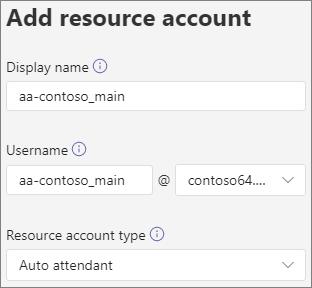

# <a name="manage-resource-accounts-in-microsoft-teams"></a>Gérer les comptes de ressources dans Microsoft Teams

Un compte de ressource est un objet utilisateur désactivé dans Azure AD et peut être utilisé pour représenter des ressources en général. Par exemple, un compte de ressource peut être utilisé dans Exchange pour représenter les salles de conférence et leur permettre d’avoir un numéro de téléphone et un calendrier. Un compte de ressource peut être homed in Microsoft 365 ou sur site à l’aide Skype Entreprise Server 2019.

Dans Microsoft Teams, un compte de ressource est requis pour chaque employé de la file d’attente d’appels ou de service automatique. Des numéros de téléphone de service peuvent également être attribués aux comptes de ressources. Il s’agit de la façon dont vous affectez des numéros de téléphone aux serveurs de service automatiques et aux files d’attente d’appels, ce qui permet aux appelants de l’extérieur Teams d’accéder au attendant automatique ou à la file d’attente d’appels.

Cet article explique comment créer des comptes de ressources et les préparer pour une utilisation avec des files d’attente et des files d’attente automatiques.

Avant de commencer les procédures de cet article, assurez-vous d’avoir effectué les opérations suivantes :

- [Obtenir des licences utilisateur virtuel](#obtain-virtual-user-licenses)
- [Obtenir des numéros de service](#obtain-service-numbers)

### <a name="obtain-virtual-user-licenses"></a>Obtenir des licences utilisateur virtuel

Chaque compte de ressource nécessite une licence pour l’utilisation des files d’attente et des files d’attente automatiques. Vous pouvez utiliser une licence *utilisateur Microsoft 365 Système téléphonique virtuel.* Pour obtenir ces licences, consultez [la licence Utilisateur virtuel.](teams-add-on-licensing/virtual-user.md)

Nous vous expliquerons comment attribuer la licence à un compte de ressource plus loin dans cet article.

Pour obtenir la licence Utilisateur virtuel, dans l’Centre d'administration Microsoft 365, allez dans les   >    >  **abonnements** au module  ajout de services d’achat de facturation et faites défiler jusqu’à la fin - vous verrez Système téléphonique - Licence utilisateur virtuel. Sélectionnez **Acheter maintenant.** Il n’y a pas de coût nul, mais vous devez tout de même suivre ces étapes pour acquérir la licence.

### <a name="obtain-service-numbers"></a>Obtenir des numéros de service

Les numéros de service sont facultatifs pour les serveurs automatiques et les files d’attente. Toutefois, vous aurez besoin d’au moins un numéro de service pour que les appelants atteignent votre fournisseur automatique et la configuration de la file d’attente d’appels. Pour un service automatique ou une file d’attente d’appels que vous souhaitez joindre directement à un numéro de service, vous devez avoir un compte de ressource avec un numéro de service associé.

Les comptes de ressources peuvent utiliser des numéros de service gratuits ou gratuits. Vous pouvez demander de nouveaux numéros ou des numéros existants à un autre opérateur.

Pour obtenir de nouveaux numéros de service, [consultez Obtenir des numéros de téléphone de service.](getting-service-phone-numbers.md)

Pour transférer un numéro d’un autre opérateur, [consultez transférer les numéros de téléphone vers Teams.](phone-number-calling-plans/transfer-phone-numbers-to-teams.md)

## <a name="create-a-resource-account"></a>Créer un compte de ressource

Vous pouvez créer un compte de ressource dans le Teams d’administration.



1. Dans le Teams d’administration, développez **Voix,** puis cliquez sur **Comptes de ressources.**

2. Cliquez sur **Ajouter**.

3. Dans le **volet Ajouter un compte de** ressource, tapez Nom **d’affichage,** Nom d’utilisateur et Type de compte de  **ressource.** Le type de compte de ressource peut être le **attendant automatique ou** la file d’attente d’appels, selon l’utilisation que vous comptez en faire. 

4. Cliquez sur **Enregistrer**.


## <a name="assign-a-license"></a>Attribuer une licence

Pour chaque compte de ressource, vous devez attribuer une *Microsoft 365 Système téléphonique utilisateur* virtuel ou une *Système téléphonique* utilisateur virtuel.


1. Dans la Centre d'administration Microsoft 365, cliquez sur le compte de ressource auquel vous voulez attribuer une licence.

2. Sous **l’onglet Licences et** applications, sous **Licences,** sélectionnez **Microsoft 365 Système téléphonique - Utilisateur virtuel.**

3. Cliquez sur **Enregistrer les modifications**.

## <a name="assign-a-service-number"></a>Affecter un numéro de service

Si vous envisagez d’utiliser le compte de ressource avec un fournisseur de services automatique ou une file d’attente d’appels nécessitant un numéro de service, attribuez un numéro au compte de ressource.


1. Dans le Teams d’administration, dans la **page** Comptes de ressources, sélectionnez le compte de ressource auquel vous voulez affecter un numéro de service, puis cliquez sur **Affecter/Désaffecter.**

2. Dans la **Téléphone du type de** nombre, choisissez le type de nombre à utiliser.

3. Dans la **zone Numéro de téléphone** affecté, recherchez le numéro à utiliser, puis cliquez sur **Ajouter.**

4. Cliquez sur **Enregistrer**.


Pour affecter un routage direct ou un numéro hybride à un compte de ressource, vous devez utiliser PowerShell :

`Set-CsOnlineApplicationInstance -Identity aa-contoso_main@contoso64.net -OnpremPhoneNumber +19295550150`

## <a name="next-steps"></a>Étapes suivantes

Une fois que vous avez terminé la configuration du compte de ressource et que vous avez attribué un numéro de service, si nécessaire, vous êtes prêt à utiliser le compte de ressource avec un responsable automatique ou une file d’attente d’appels.

Consultez les références suivantes :

 - [Attendant automatique cloud](create-a-phone-system-auto-attendant.md)

 - [File d’attente d’appels cloud](create-a-phone-system-call-queue.md)

Vous pouvez modifier le nom d’affichage **du** compte de ressource et le type **de compte** de ressource à l’aide de **l’option** Modifier. Cliquez **sur Enregistrer** lorsque vous avez terminé.

## <a name="change-an-existing-resource-account-to-use-a-virtual-user-license"></a>Modifier un compte de ressource existant pour utiliser une licence Utilisateur virtuel

Si vous décidez de basculer les licences de votre compte de ressource existant d’une licence **Système téléphonique** à une licence utilisateur virtuel, vous devez acquérir la licence utilisateur virtuel gratuite, puis suivre les étapes du Centre d'administration Microsoft 365 pour déplacer les utilisateurs vers un autre [abonnement.](/microsoft-365/admin/manage/assign-licenses-to-users#move-users-to-a-different-subscription)

> [!WARNING]
> Supprimez toujours une licence Système téléphonique licence utilisateur virtuel et attribuez-la dans la même activité de licence. Si vous supprimez l’ancienne licence, enregistrez les modifications apportées au compte, ajoutez la nouvelle licence, puis enregistrez de nouveau les paramètres du compte, le compte de ressource peut ne plus fonctionner comme prévu. Dans ce cas, nous vous recommandons de créer un compte de ressource pour la licence Utilisateur virtuel et de supprimer le compte de ressource rompu.

## <a name="skype-for-business-server-2019"></a>Skype For Business Server 2019

Pour les comptes de ressources homed on Skype For Business Server 2019 qui peuvent être utilisés avec des files d’attente d’appels cloud et des serveurs automatiques cloud, voir [Plan Cloud call queues](/SkypeforBusiness/hybrid/plan-call-queue) or [Plan Cloud auto attendants.](/SkypeForBusiness/hybrid/plan-cloud-auto-attendant) Les implémentations hybrides (numéros homed on Direct Routing) sont configurées à l’aide de l’cmdlet [New-CsHybridApplicationEndpoint](/powershell/module/skype/new-cshybridapplicationendpoint) sur un serveur Skype Entreprise Server 2019 local.

Les ID d’application que vous devez utiliser lors de la création des instances d’application sont les autres :

- **Standard automatique :** ce933385-9390-45d1-9512-c8d228074e07
- **File d’attente** d’appels : 11cd3e2e-fccb-42ad-ad00-878b93575e07

> [!NOTE]
> Si vous souhaitez que les utilisateurs d’Skype Entreprise Server 2019 recherchent la file d’attente ou le serveur automatique d’appels, vous devez créer vos comptes de ressources sur Skype Entreprise Server 2019, car les comptes de ressources en ligne ne sont pas synchronisés avec Active Directory. Lorsque les enregistrements SRV DNS pour sipfederationtls sont résolus jusqu’à Skype Entreprise Server 2019, les comptes de ressources doivent être **créés** sur Skype For Business Server 2019 à l’aide de l’shell de gestion SfB et synchronisés avec Azure AD.

Pour les implémentations hybrides avec Skype Entreprise Server :

   [Planifier les standards automatiques cloud](/SkypeForBusiness/hybrid/plan-cloud-auto-attendant)
  
   [Planifier les files d’attente d’appels cloud](/SkypeforBusiness/hybrid/plan-call-queue)
   
   [Configurer des comptes de ressources on-prem](/SkypeForBusiness/hybrid/configure-onprem-ra)


## <a name="delete-a-resource-account"></a>Supprimer un compte de ressource

Assurez-vous de dissocier le numéro de téléphone du compte de ressource avant de le supprimer afin d’éviter que votre numéro de service reste bloqué en mode En attente.

Vous pouvez ensuite supprimer le compte de ressource dans le Centre d'administration Microsoft 365, sous l’onglet Utilisateurs.

Pour dissocier un numéro de téléphone de routage direct du compte de ressource, utilisez l’cmdlet suivante :

```powershell
Set-CsOnlineApplicationInstance -Identity  <Resource Account oid> -OnpremPhoneNumber ""
```
