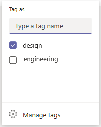

# Gérer les balises dans Microsoft Teams

## Vue d’ensemble

Les balises Microsoft Teams aux utilisateurs de se connecter rapidement et facilement avec un sous-ensemble de membres d’une équipe. Vous pouvez créer et attribuer des balises personnalisées pour catégoriser des personnes en fonction d’attributs, tels que le rôle, le projet, les compétences ou l’emplacement. Vous pouvez également attribuer automatiquement des balises aux personnes en fonction de leurs informations de planning et de shift dans [l’application Shifts.](https://support.microsoft.com/office/apps-and-services-cc1fba57-9900-4634-8306-2360a40c665b?#PickTab=Shifts) Une fois qu’un mot-balise est ajouté à un ou plusieurs membres de l’équipe, il peut être utilisé dans @mentions par n’importe qui de l’équipe dans une publication de canal ou pour démarrer une conversation avec uniquement les personnes à qui cette balise est attribuée.

Comme indiqué précédemment, il existe deux types d’balises dans Teams.

- **Balises personnalisées**: les propriétaires d’équipe et les membres de l’équipe (si la fonctionnalité est activée pour eux) peuvent créer et attribuer manuellement des balises à des personnes. Par exemple, une balise « Concepteur » ou « Tous les membres d’une équipe sans avoir à taper leur nom » s’identifient.
- **Marquage par shift**: cette fonctionnalité permet aux personnes de se voir automatiquement attribuer des balises qui correspondent à leur planning et au nom du groupe shift dans l’application [Shifts](https://support.microsoft.com/office/get-started-in-shifts-5f3e30d8-1821-4904-be26-c3cd25a497d6#bkmk_openshiftsappdesktop) de Teams. Par exemple, la balise « EngineerOnCall » atteint tous les ingénieurs qui sont programmés dans Shifts pour travailler au moment où la balise est utilisée dans une conversation ou un billet de canal. Grâce au balisage par shift, Teams ne plus connaître le nom du personnel sur les équipes lorsque les utilisateurs ont besoin de relayer rapidement des informations. La balise par shift peut également être prise en charge par les principaux systèmes de gestion du personnel comme JDA, Kronos et AMiON en les intégrant à Shifts in Teams. Pour plus d’informations sur la façon de configurer cette fonctionnalité, voir [Configurer le marquage par shift.](#set-up-tagging-by-shift)

> [!NOTE]
> Les balises ne sont pas encore pris en charge dans les canaux privés. Les balises ne sont pas disponibles dans les organisations du Département de la défense (DoD). 

## Fonctionnement des balises

Un mot-balise peut être ajouté manuellement ou automatiquement attribué à une personne d’une équipe spécifique. Elle peut ensuite être utilisée dans  @mentions ligne À dans une conversation ou dans une publication sur n’importe quel canal standard de l’équipe. Voici quelques exemples d’utilisation des balises dans Teams :

- Un responsable de magasin publie une annonce sur un canal pour informer tous les encaissements.
- Un administrateur de l’hôpital envoie un message à tous les directeurs dans un canal.
- Un responsable marketing démarre une conversation de groupe avec tous les concepteurs.
- Une infirmière envoie un message à tous les appelants. (prochainement)
- Un ingénieur système publie une annonce sur un canal pour informer tous les ingénieurs sur les champs sur shift. (prochainement)

Lorsqu’une balise est @mentioned dans une conversation de canal, les membres de l’équipe associés à la balise sont avertis, comme toute autre @mention.

## Gérer les balises personnalisées pour votre organisation

En tant qu’administrateur, vous pouvez contrôler la manière dont les balises sont utilisées dans votre organisation dans le Microsoft Teams d’administration. Actuellement, vous ne pouvez pas utiliser PowerShell pour gérer les balises.

Une équipe peut avoir jusqu’à 100 balises, jusqu’à 100 membres peuvent être affectés à un balise et jusqu’à 25 balises peuvent être affectées à un seul utilisateur. 

### Définir qui peut ajouter des balises personnalisées

Par défaut, les propriétaires d’équipe peuvent ajouter des balises personnalisées. Vous pouvez modifier ce paramètre pour autoriser les propriétaires d’équipe et les membres de l’équipe à créer, modifier, supprimer et gérer des balises, ou désactiver les balises pour votre organisation.

1. Dans la barre de navigation gauche du Microsoft Teams d’administration, cliquez sur **Paramètres** à l’échelle de  >  **l’organisation Teams paramètres.**
2. Sous **Balise,** en dessous de **Balises,** sélectionnez l’une des options suivantes :

    - **Propriétaires et membres d’équipe**: autoriser les propriétaires et membres d’équipe à gérer les balises.
    - **Propriétaires d’équipe**: autoriser les propriétaires d’équipe à gérer les balises.
    - **Désactivé :** désactiver les balises.

### Configurer les paramètres de balises personnalisées

Vous pouvez configurer les paramètres d’balise suivants pour contrôler la manière dont les balises personnalisées sont utilisées dans votre organisation.

1. Dans la barre de navigation gauche du Microsoft Teams d’administration, cliquez sur **Paramètres** à l’échelle de  >  **l’organisation Teams paramètres.**
2. Sous **Marquage,** définissez ce qui suit, selon les besoins de votre organisation.

    - Laisser les propriétaires d’équipe remplacer les personnes responsables de la gestion des balises : lorsque vous définissez ce paramètre, les propriétaires d’équipe peuvent définir si les membres de l’équipe peuvent créer et gérer des balises au sein d’une équipe, et que la valeur des balises est gérée par le paramètre est la valeur par défaut de chaque équipe.  Si vous la désactiver, le paramètre **Balises** ne peut pas être modifié par équipe.
    - **Balises par défaut suggérées**: utilisez cette option pour ajouter un ensemble d’balises par défaut. Vous pouvez ajouter jusqu’à 25 balises, et chaque balise peut contenir un maximum de 25 caractères. Les propriétaires d’équipe et les membres (si la fonctionnalité est activée pour eux) peuvent utiliser ces suggestions, y ajouter ou créer un ensemble d’balises.
    - **Laisser les balises** personnalisées être créées : activer ce paramètre pour que les personnes ajoutent des balises autres que les balises par défaut suggérées que vous définissez. Si cette option est désactivée, les personnes peuvent uniquement utiliser les balises par défaut suggérées. Si vous la désactiver, veillez à ajouter un ou plusieurs balises par défaut.

## Gérer les paramètres de balises personnalisées pour une équipe

Si vous avez  désactivé le paramètre Laisser les propriétaires d’équipe remplacer les personnes qui peuvent gérer les balises dans le Centre d’administration Microsoft Teams, les propriétaires d’équipe peuvent définir si les membres peuvent ajouter des balises au niveau de l’équipe. Pour ce faire, sous **l’Paramètres** d’une équipe, sélectionnez **Balises,** puis choisissez qui peut ajouter des balises.

## Utiliser des balises

Voici comment ajouter des balises personnalisées et configurer le marquage par shift (si vous utilisez l’application Shifts dans Teams). Pour en savoir plus, consultez [l’aide des balises dans Teams.](https://support.office.com/article/using-tags-in-teams-667bd56f-32b8-4118-9a0b-56807c96d91e)

### Créer et attribuer des balises personnalisées

Pour créer et attribuer des balises personnalisées, sélectionnez **Teams** sur le côté gauche de l’application, puis recherchez votre équipe dans la liste. Sélectionnez **s s s autres options,** puis **sélectionnez Gérer les balises.** Ici, vous pouvez créer des balises et les affecter à des membres de votre équipe.

Pour supprimer un mot-balise, **sélectionnez y s s Autres options** en côté de l’balise, puis Supprimer **la balise.**

### Configurer le marquage par shift

Le marquage par shift permet à vos utilisateurs de joindre les personnes sur shift en temps réel. Teams affecte automatiquement les utilisateurs avec des balises correspondant à leur planning et au nom du groupe de shifts à partir de l’application Shifts, ce qui permet d’activer la messagerie dynamique basée sur les rôles. Les notifications sont envoyées uniquement aux personnes qui sont en shift au moment où une balise est utilisée pour démarrer une conversation ou une publication de canal. 

1. Dans Teams, allez dans [l’application Shifts.](https://support.microsoft.com/office/get-started-in-shifts-5f3e30d8-1821-4904-be26-c3cd25a497d6#bkmk_openshiftsappdesktop)
2. Créez [des groupes de shifts](https://support.microsoft.com/office/fill-out-a-schedule-in-shifts-2d58df9b-1c6c-4c84-b0c3-835de7ad13ea#bkmk_organizeshiftsbygroup) et nommez-les d’après un attribut tel qu’un rôle. Par exemple, EngineerOnCall. Le nom du groupe de shifts sera le nom de l’balise.
3. [Remplissez un planning en](https://support.microsoft.com/office/fill-out-a-schedule-in-shifts-2d58df9b-1c6c-4c84-b0c3-835de7ad13ea) attribuant des shifts aux membres de vos équipes. Lorsque vous avez terminé, dans le coin supérieur droit de l’application Shifts, sélectionnez **Partager avec l’équipe.**
4. Patientez 15 minutes pour que les shifts programmés remplissent le service de marquage.
5. Utilisez les balises où que vous soyez dans Teams.

## Voir aussi

[Utilisation de balises dans Teams](https://support.office.com/article/using-tags-in-teams-667bd56f-32b8-4118-9a0b-56807c96d91e)

[Gérer l’application Shifts pour votre organisation dans Teams](expand-teams-across-your-org/shifts/manage-the-shifts-app-for-your-organization-in-teams.md)

[Documentation d’aide sur Shifts](https://support.microsoft.com/office/apps-and-services-cc1fba57-9900-4634-8306-2360a40c665b)
