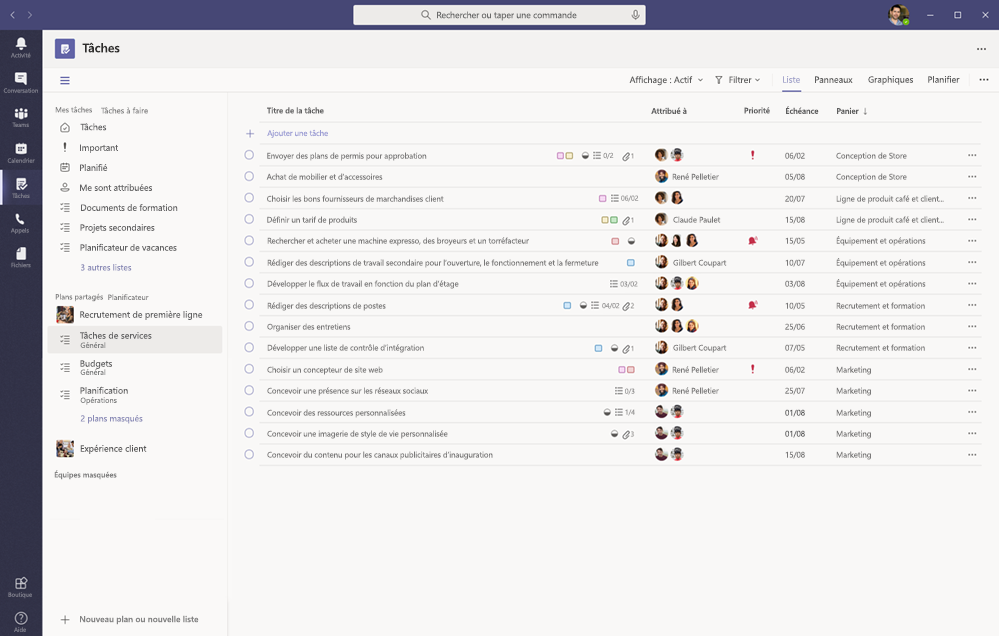
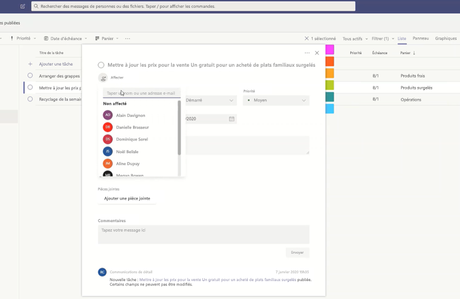
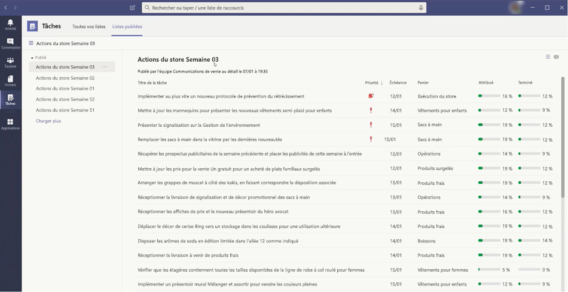

# Gérer l’application Tasks pour votre organisation dans Microsoft Teams

## Présentation de Tasks

L’application Tasks apporte une expérience de gestion des tâches pertinente à Microsoft Teams, en intégrant les tâches individuelles optimisées par [Microsoft To Do](https://todo.microsoft.com/tasks/) et les tâches d’une équipe optimisées par le Planificateur dans un emplacement unique. Les utilisateurs peuvent accéder à l’application Tasks sur le côté gauche de Teams et à un onglet Tasks dans un canal au sein des équipes individuelles. Avec **Mes tâches** et **plans partagés**, les utilisateurs peuvent afficher et gérer toutes leurs tâches individuelles et d’équipe et hiérarchiser leur travail. Tasks est disponible dans les clients pour ordinateur de bureau, les clients web et les clients mobiles Teams.

> [!NOTE]
> Pendant le déploiement de l’expérience Tasks sur les clients Teams pour ordinateur de bureau, l’application sera initialement nommée **Planificateur**. Le nom sera ensuite temporairement remplacé par **Tasks par le Planificateur et To Do**, et plus tard, il sera renommé en **Tasks**. Sur les clients mobiles Teams, l’application sera toujours nommée **Tasks**. Une fois l’expérience pour ordinateur de bureau disponible, un court délai peut exister avant que l’expérience mobile soit disponible.

   

Pour les organisations qui souhaitent simplifier la gestion des tâches pour les travailleurs de première ligne, Tasks comprend également des fonctionnalités qui vous permettent de cibler, publier et suivre les tâches de vos employés de première ligne. Par exemple, les dirigeants d’entreprise et les responsables régionaux peuvent créer et publier des listes de tâches ciblées sur des emplacements pertinents, tels que des magasins de détail spécifiques, et suivre les progrès grâce à des rapports en temps réel. Les N+1 peuvent attribuer des tâches à leur personnel et diriger les activités depuis leur bureau. Les travailleurs de première ligne, eux, disposent d’une liste hiérarchisée des tâches qui leur sont attribuées sur leur mobile ou leur ordinateur de bureau. Pour activer la [publication des tâches](#task-publishing), vous devez d’abord configurer une hiérarchie de ciblage d’équipe pour votre organisation, qui définit la manière dont toutes les équipes dans la hiérarchie sont liées entre elles.

## Ce que vous devez savoir sur Tasks

Tasks est disponible sous forme d’application et sous forme d’onglet dans un canal. L’application affiche les tâches individuelles To Do et les tâches d’équipe du Planificateur. L’onglet affiche uniquement les tâches de l’équipe.

Avec Tasks, les utilisateurs bénéficient d’une expérience web, mobile et pour ordinateur de bureau. Si Tasks est installé sur le client Teams pour ordinateur de bureau, les utilisateurs le verront également sur leurs clients Teams web et mobiles. L’exception est les invités. Il est important de savoir que les invités ne peuvent accéder aux tâches qu’avec l’application, à partir du client mobile Teams. Les invités verront les onglets Tasks sur les clients Teams web et pour ordinateur de bureau.

L’espace **Mes tâches** affiche les tâches individuelles d’un utilisateur. L’espace **Plans partagés** affiche les tâches sur lesquelles toute l’équipe travaille et inclut toute liste de tâches ajoutée en tant qu’onglet Tasks à un canal. Notez les relations suivantes entre les tâches dans Tasks, To Do et Planner :

- Les listes de tâches créées par un utilisateur dans l’application Tasks apparaîtront également dans les clients To Do pour cet utilisateur. De même, les listes de tâches créées par un utilisateur dans To Do apparaîtront dans **Mes tâches** dans Tasks pour cet utilisateur. Il en va de même pour les tâches individuelles.

- Les onglets Tasks ajoutés à un canal apparaissent également dans les clients du Planificateur. Lorsqu’un utilisateur crée un plan dans le Planificateur, le plan n’apparaîtra pas dans l’application Tasks ou Planificateur, sauf s’il est ajouté en tant qu’onglet à un canal. Lorsqu’un utilisateur ajoute un nouvel onglet Tasks, il peut créer une nouvelle liste ou un nouveau plan ou en choisir un existant.

## Configurer Tasks

> [!IMPORTANT]
> Les paramètres et les stratégies que vous avez configurés pour le Planificateur s’appliqueront également à Tasks.

### Activer ou désactiver Tasks dans votre organisation

Tasks est activé par défaut pour tous les utilisateurs Teams de votre organisation. Vous pouvez désactiver ou activer l’application au niveau de l’organisation sur la page [Gérer les applications](manage-apps.md) dans le centre d’administration Microsoft Teams.

1. Dans le volet de navigation gauche du Centre d’administration Microsoft Teams, accédez aux **applications Teams** > **Gérer les applications**.
2. Dans la liste des applications, effectuez l’une des actions suivantes :

    - Pour désactiver Tasks pour votre organisation, recherchez l’application Tasks, sélectionnez-la, puis cliquez sur **Bloquer**.
    - Pour activer les Tasks pour votre organisation, recherchez l’application Tasks, sélectionnez-la, puis cliquez sur **Autoriser**.

> [!NOTE]
> Si vous ne trouvez pas l’application Tasks, recherchez les noms présentés dans la première remarque de cet article. La modification du nom de l’application n’a peut-être pas encore été effectuée.

### Activer ou désactiver les Tasks pour des utilisateurs spécifiques de votre organisation

Pour autoriser ou empêcher des utilisateurs spécifiques de votre organisation d’utiliser tâches, assurez-vous que Tâches est activée pour votre organisation sur la page [Gérer les applications](manage-apps.md), puis créez une stratégie d’autorisation d’application personnalisée et attribuez-la à ces utilisateurs. Pour en savoir plus, consultez [Gérer les stratégies d’autorisation d’application dans Teams](teams-app-permission-policies.md).

### Utiliser une stratégie de configuration d’application pour épingler Tasks dans Teams

Les stratégies de configuration des applications vous permettent de personnaliser Teams pour mettre en évidence les applications les plus importantes pour les utilisateurs de votre organisation. Les applications que vous définissez dans une stratégie sont épinglées à la barre— de l’application sur le côté du client de bureau Teams et en bas des clients— mobiles Teams, où les utilisateurs peuvent y accéder rapidement et facilement.

Pour épingler l’application Tâches pour vos utilisateurs, vous pouvez modifier la stratégie globale (par défaut à l’échelle de l’organisation) ou créer et affecter une stratégie de configuration d’application personnalisée. Pour en savoir plus, consultez [Gérer les stratégies de configuration d’application dans Teams](teams-app-setup-policies.md).

### L’espace Mes tâches d’un utilisateur est visible si l’utilisateur dispose d’une licence pour Exchange Online

Si vous ne souhaitez pas qu’un utilisateur voie l’espace **Mes tâches**, vous pouvez le masquer. Pour masquer **Mes tâches**, [supprimer la licence Exchange Online de l’utilisateur](/microsoft-365/admin/manage/remove-licenses-from-users). Il est important de savoir qu’après la suppression de la licence Exchange Online, l’utilisateur n’a plus accès à sa boîte aux lettres.  Les données de la boîte aux lettres sont conservées pendant 30 jours, après quoi les données seront supprimées et ne pourront pas être récupérées à moins que la boîte aux lettres ne soit placée en [Conservation inaltérable ou en Conservation pour litige](/exchange/security-and-compliance/in-place-and-litigation-holds).

Nous vous déconseillons de supprimer une licence Exchange Online pour les travailleurs de l’information, mais dans certains scénarios, vous pouvez masquer **Mes tâches** de cette façon, par exemple pour les employés de première ligne qui ne dépendent pas de la messagerie.

## Publication de tâches

Avec la publication de tâches, votre organisation peut publier des listes de tâches ciblées sur des emplacements spécifiques (des équipes) au sein de votre organisation pour définir et partager un programme de travail à réaliser à ces emplacements.

- Les membres de l’équipe de publication, telles que la direction d’entreprise ou régionale, peuvent créer des listes de tâches et les publier dans des équipes spécifiques. 
- Les responsables des équipes de destinataires peuvent passer en revue les listes de tâches publiées et affecter des tâches individuelles aux membres de l’équipe. 
- Les travailleurs de première ligne ont une expérience mobile simple pour voir les tâches qui leur sont assignées. Ils peuvent joindre des photos pour montrer leur travail le cas échéant et marquer leurs tâches comme terminées.
- Les éditeurs et les responsables peuvent afficher les rapports pour voir l’état d’affectation et d’achèvement des tâches à chaque niveau, y compris par emplacement (équipe), liste des tâches et tâche individuelle. 

Les utilisateurs créent, gèrent et publient des listes de tâches dans l’onglet **Listes publiées** de l’application Tasks. Cet onglet ne s’affiche pour un utilisateur que si votre organisation [a configuré une hiérarchie de ciblage d’équipe](#set-up-your-team-targeting-hierarchy) et que l’utilisateur fait partie d’une équipe incluse dans la hiérarchie. La hiérarchie détermine si l’utilisateur peut publier ou recevoir des listes de tâches et afficher des rapports pour les listes reçues.

### Exemple de scénario

Voici un exemple du fonctionnement de la publication de tâches.

Contoso lance une nouvelle promotion de plats à emporter et de livraison. Pour maintenir une expérience de marque cohérente, ils doivent coordonner l’exécution cohérente du déploiement dans plus de 300 magasins.

L’équipe marketing partage les détails de la promotion et la liste des tâches correspondante avec le directeur des communications commerciales. Le Gestionnaire de communications au détail, qui garde le contrôle des magasins, passe en revue les informations. Ensuite, ils créent une liste de tâches pour la promotion et une tâche pour chaque unité de travail que les magasins concernés doivent effectuer. Une fois la liste des tâches terminée, ils doivent sélectionner les magasins qui doivent terminer le travail. Dans ce cas, la promotion ne s’applique qu’aux magasins aux États-Unis qui ont un restaurant à l’intérieur du magasin. Dans Tâches, ils filtrent la liste des magasins en fonction de l’attribut de restaurant dans le magasin, sélectionnent les emplacements États-Unis correspondants dans la hiérarchie, puis publient la liste des tâches dans ces magasins.

Les responsables de magasin de chaque site reçoivent une copie des tâches publiées et attribuent ces tâches aux membres de leur équipe. Les responsables peuvent utiliser l’expérience Tasks pour appréhender tout le travail requis dans leur magasin. Ils peuvent également utiliser les filtres disponibles pour se concentrer sur un ensemble de travaux spécifique, comme le travail devant être effectué aujourd’hui ou le travail dans un domaine particulier.

Les employés de première ligne de chaque magasin disposent désormais d’une liste hiérarchisée de leur travail dans Tasks sur leur appareil mobile. Lorsqu’ils terminent une tâche, ils la marquent comme terminée. Ils peuvent même choisir de charger et d’attacher une photo à la tâche pour montrer leur travail.

Le siège social de Contoso et les responsables intermédiaires peuvent afficher des rapports pour consulter le statut d’affectation et d’achèvement des tâches dans chaque magasin et entre les magasins. Ils peuvent également explorer une tâche spécifique pour consulter son état dans différents magasins. À mesure que la date de lancement approche, ils peuvent repérer les anomalies et se renseigner auprès de leurs équipes au besoin. Cette visibilité permet à Contoso d’améliorer l’efficacité du déploiement et de fournir une expérience plus cohérente dans ses magasins.

### Configurer la hiérarchie de ciblage de votre équipe

Pour activer la publication de tâches dans votre organisation, vous devez d’abord configurer votre schéma de ciblage d’équipe dans un fichier au format .CSV. Le schéma définit la façon dont toutes les équipes de votre hiérarchie sont liées les unes aux autres et définit également les attributs qui peuvent être utilisés pour filtrer et sélectionner des équipes. Après avoir créé le schéma, téléchargez-le dans Teams pour l’appliquer à votre organisation. Les membres de l’équipe de publication, tels que le directeur des communications commerciales dans l’exemple de scénario, peuvent ensuite filtrer les équipes par hiérarchie, attributs ou une combinaison des deux pour sélectionner les équipes appropriées devant recevoir les listes de tâches, puis publier les listes de tâches dans ces équipes.

Pour savoir comment configurer la hiérarchie de ciblage de votre équipe, consultez l’article [Configurer la hiérarchie de ciblage de votre équipe](set-up-your-team-hierarchy.md).

## API Power Automate et Graph

Tasks prend en charge Power Automate pour To Do et Graph pour le Planificateur. Pour en savoir plus, consultez :

- [Présentation de l’API des tâches et des plans du Planificateur](/graph/planner-concept-overview)
- [Utiliser Microsoft To Do avec Power Automate](https://support.office.com/article/using-microsoft-to-do-with-power-automate-526e8f75-217b-46e0-9e06-44780b72c295)
