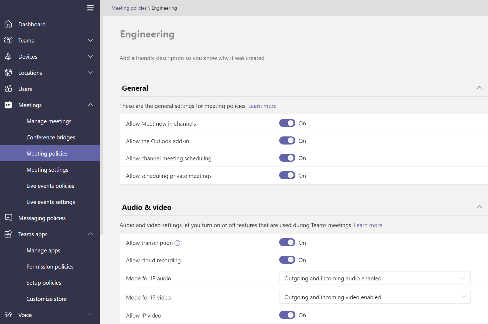

# Gérer les Teams des stratégies

Les stratégies sont un élément important de la gestion des Teams. Utilisez cet article pour naviguer dans l’utilisation des stratégies au profit de votre organisation.

## Utilisation des stratégies pour

Les stratégies sont utilisées pour effectuer de nombreuses tâches au sein de votre organisation dans différents domaines tels que la messagerie, les réunions et les applications. Vous pouvez notamment autoriser les utilisateurs à planifier des réunions dans un canal d’équipe, permettre aux utilisateurs de modifier les messages envoyés et contrôler si les utilisateurs peuvent épingler des applications à la barre d’application Teams.

## Comment affecter des stratégies

Les stratégies peuvent être affectées de différentes manières en fonction de ce que votre organisation tente d’accomplir. Vous pouvez rendre et afficher les devoirs dans le Teams d’administration.

En savoir plus sur l’attribution des [stratégies ici.](policy-assignment-overview.md)

## Comment gérer les stratégies

Les stratégies sont gérées avec le centre Microsoft Teams’administration de l’entreprise [ou à l’aide de PowerShell.](./teams-powershell-managing-teams.md#manage-policies-via-powershell)

Par exemple, une stratégie de configuration d’application peut vous permettre de permettre aux utilisateurs de télécharger des applications personnalisées, d’installer des applications pour le compte de vos utilisateurs et d’épingler des applications à la barre d’application Teams. Ces stratégies sont configurées dans le Teams d’administration.

En outre, une stratégie de réunion peut être utilisée pour contrôler les paramètres audio et vidéo dans les réunions Teams telles que les transcriptions, les enregistrements cloud et les enregistrements IP audio/vidéo.

### Teams pour l’éducation

Vous pouvez également utiliser [l’Assistant Stratégie Teams pour l'éducation](easy-policy-setup-edu.md) pour configurer et gérer facilement des stratégies pour votre environnement d’apprentissage.

## Types de stratégies

Les stratégies suivantes peuvent être gérées avec Microsoft Teams.

Type de stratégie | Description
------------|------------
[Packages de stratégie](manage-policy-packages.md) | Un package de stratégie dans Microsoft Teams est un ensemble de stratégies et de paramètres prédéfinés que vous pouvez affecter aux utilisateurs ayant des rôles similaires dans votre organisation.
[Stratégies de réunion](meeting-policies-overview.md) | Une stratégie de réunion permet de contrôler les fonctionnalités disponibles pour les participants à la réunion prévues par les utilisateurs de votre organisation. Les stratégies de réunion incluent les rubriques suivantes.  - Stratégies audio et vidéo  - Stratégies de partage de contenu et d’écran  - Stratégies d’accès, invités et participants  - Politiques générales
[Stratégies de voix et d’appel](voice-and-calling-policies.md)| Les stratégies de voix et d’appel gèrent ces paramètres via les équipes, telles que les appels d’urgence, le routage des appels et l’ID d’appelant.
[Stratégies d’application](app-policies.md)| Les stratégies d’application sont utilisées pour contrôler les applications dans Microsoft Teams. Les administrateurs peuvent autoriser ou bloquer les applications que les utilisateurs peuvent installer, épingler des applications à la barre d’application Teams d’un utilisateur et installer une application pour le compte de vos utilisateurs.
[Stratégies de messagerie](messaging-policies-in-teams.md)| Les stratégies de messagerie contrôlent la disponibilité des fonctionnalités de conversation et de canal.

## Sujets associés

* [Attribuer des stratégies dans Teams - mise en place](policy-assignment-overview.md)
* [Gérer les stratégies de commentaires dans Microsoft Teams](manage-feedback-policies-in-teams.md)
* [Gérer les stratégies d’équipes dans Microsoft Teams](teams-policies.md)
* [Configurer des événements en direct dans Microsoft Teams](teams-live-events/set-up-for-teams-live-events.md)
* [Teams pour l'éducation stratégies et packages de stratégies](policy-packages-edu.md)