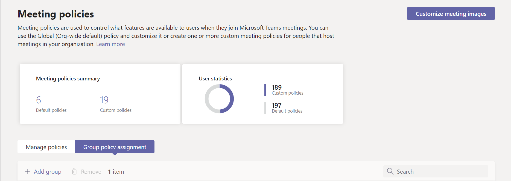

# Gérer les équipes avec des stratégiesManage teams with policies

Les stratégies sont un élément important de la gestion de Teams.Policies are an important part of managing Teams. Utilisez cet article pour naviguer dans l’utilisation des stratégies au profit de votre organisation.Use this article to navigate how to use policies to benefit your organization.

## Utilisation des stratégies pourWhat you use policies for

Les stratégies sont utilisées pour effectuer de nombreuses tâches au sein de votre organisation dans différents domaines tels que la messagerie, les réunions et les applications.Policies are used to accomplish many tasks in your organization across different areas such as messaging, meetings, and applications. Vous pouvez notamment autoriser les utilisateurs à planifier des réunions dans un canal Teams, permettre aux utilisateurs de modifier les messages envoyés et contrôler si les utilisateurs peuvent épingler des applications à la barre de l’application Teams.Some of the things you can do include allowing users to schedule meetings in a teams channel, enabling users to edit sent messages, and controlling whether users can pin apps to the Teams app bar.

## Comment affecter des stratégiesHow to assign policies

Les stratégies peuvent être affectées de différentes manières en fonction de ce que votre organisation tente d’accomplir.Policies can be assigned in several different ways depending on what your organization is trying to accomplish. Vous pouvez effectuer et afficher des devoirs dans le Centre d’administration Teams.You can make and view assignments in the Teams admin center.

Pour en savoir plus sur l’attribution de [stratégies, cliquez ici.](assign-policies.md)Read more about assigning policies [here](assign-policies.md).

## Comment gérer les stratégiesHow to manage policies

Les stratégies sont gérées avec le Centre d’administration Microsoft Teams ou [à l’aide de PowerShell.](https://docs.microsoft.com/microsoftteams/teams-powershell-managing-teams#manage-policies-via-powershell)Policies are managed with the Microsoft Teams admin center or [using PowerShell](https://docs.microsoft.com/microsoftteams/teams-powershell-managing-teams#manage-policies-via-powershell).

Par exemple, une stratégie de configuration d’application peut vous permettre de permettre aux utilisateurs de télécharger des applications personnalisées, d’installer des applications pour le compte de vos utilisateurs et d’épingler des applications à la barre de l’application Teams.For example, an app setup policy can allow you to enable users to upload custom apps, install apps on behalf of your users, and pin apps to the Teams app bar. Ces stratégies sont configurées dans le Centre d’administration Teams.These policies are configured in the Teams admin center.

En outre, une stratégie de réunion peut être utilisée pour contrôler les paramètres audio et vidéo dans les réunions Teams, tels que les transcriptions, les enregistrements cloud et les enregistrements IP audio/vidéo.Additionally, a meeting policy can be used to control audio and video settings in Teams meetings such as transcriptions, cloud recordings, and IP audio/video.

### Teams pour l’éducationTeams for Education

Vous pouvez également utiliser [l’Assistant Stratégie](easy-policy-setup-edu.md) de Teams pour l’Éducation pour configurer et gérer facilement des stratégies pour votre environnement d’apprentissage.You can also use the [Teams for Education policy wizard](easy-policy-setup-edu.md) to easily set up and manage policies for your learning environment.

## Types de stratégiesTypes of policies

Les stratégies suivantes peuvent être gérées avec Microsoft Teams.The following policies can be managed with Microsoft Teams.

Type de stratégiePolicy type | DescriptionDescription
------------|------------
[Packages de stratégiePolicy packages](manage-policy-packages.md) | Un package de stratégie dans Microsoft Teams est un ensemble de stratégies et de paramètres prédéfinés que vous pouvez affecter aux utilisateurs ayant des rôles similaires dans votre organisation.A policy package in Microsoft Teams is a collection of predefined policies and settings you can assign to users who have similar roles in your organization.
[Stratégies de réunionMeeting policies](meeting-policies-in-teams.md) | Une stratégie de réunion permet de contrôler les fonctionnalités disponibles pour les participants à la réunion prévues par les utilisateurs de votre organisation.A meeting policy is used to control the features that are available to meeting participants for meetings scheduled by users in your organization. Les stratégies de réunion incluent les sujets suivants.Meeting policies include the following topics.  - Stratégies audio et vidéo- Audio and video policies  - Stratégies de partage de contenu et d’écran- Content and screen sharing policies  - Stratégies d’accès, participants et invités- Participants, guests, and access policies  - Politiques générales- General policies
[Stratégies de voix et d’appelVoice and calling policies](voice-and-calling-policies.md)| Les stratégies de voix et d’appel gèrent ces paramètres via les équipes, telles que les appels d’urgence, le routage des appels et l’ID d’appelant.Voice and calling policies manage these settings through teams such as emergency calling, call routing, and caller ID.
[Stratégies d’applicationApp policies](app-policies.md)| Les stratégies d’application servent à contrôler les applications dans Microsoft Teams.App policies are used to control applications in Microsoft Teams. Les administrateurs peuvent autoriser ou bloquer les applications que les utilisateurs peuvent installer, épingler des applications à la barre d’application Teams d’un utilisateur et installer une application pour le compte de vos utilisateurs.Admins can allow or block which apps users can install, pin applications to a user's Teams app bar, and install application on behalf of your users.
[Stratégies de messagerieMessaging policies](messaging-policies-in-teams.md)| Les stratégies de messagerie contrôlent la disponibilité des fonctionnalités de conversation et de canal.Messaging policies control chat and channel feature availability.

## Sujets associésRelated topics

* [Gérer les stratégies de commentaires dans Microsoft TeamsManage feedback policies in Microsoft Teams](manage-feedback-policies-in-teams.md)
* [Gérer les stratégies teams dans Microsoft TeamsManage teams policies in Microsoft Teams](teams-policies.md)
* [Configurer des événements en direct dans Microsoft TeamsSet up for live events in Microsoft Teams](teams-live-events/set-up-for-teams-live-events.md)
* [Stratégies et packages de stratégies Teams pour l’ÉducationTeams for Education policies and policy packages](policy-packages-edu.md)
