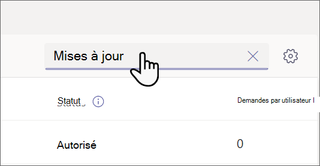

# Gérer l’application Mises à jour pour votre organisation dans Microsoft Teams

## Qu’est-ce que l’application Mises à jour ?

L’Mises à jour dans l’application Microsoft Teams fournit aux membres de votre organisation un emplacement centralisé pour créer, examiner et envoyer des mises à jour. En créant des modèles, vous pouvez utiliser l’application Mises à jour pour effectuer le suivi de tout ce dont votre organisation a besoin. Mises à jour est disponible pour les ordinateurs de bureau et les appareils mobiles.

Dans Teams, les utilisateurs peuvent obtenir Mises à jour à partir de l’App Store Teams. Ils verront toutes les mises à jour qu’ils doivent envoyer sur la page **Envoyer** . Vous pouvez partager [l’article Prise en main de Mises à jour](https://support.microsoft.com/office/get-started-in-updates-c03a079e-e660-42dc-817b-ca4cfd602e5a) avec vos utilisateurs pour les aider à se familiariser avec Mises à jour.

Les utilisateurs peuvent afficher les mises à jour qu’ils ont attribuées dans la page **Révision** .

Lorsqu’une mise à jour est affectée à un utilisateur, celle-ci s’affiche dans son flux d’activité Teams. Les utilisateurs peuvent également afficher toutes leurs demandes de mise à jour actuelles et les soumissions précédentes dans l’application Mises à jour. En outre, tout le monde peut créer des modèles et envoyer des demandes de mise à jour.

Mises à jour est fourni avec des modèles prêtes à l’emploi pour les scénarios métier courants et la possibilité de créer votre propre modèle. Tout le monde peut créer un modèle pour de nouveaux types de mises à jour.

## Exemple de scénario

Les employés d’un magasin de vêtements sont responsables de l’ouverture et de la fermeture du magasin chaque jour. Tous les matins, le responsable de l’équipe remplit la mise à jour d’ouverture du Store, qui est un modèle prête à l’emploi dans l’application Mises à jour. Dans cette mise à jour, ils décrivent les problèmes liés à la fermeture de la nuit précédente, répondent aux questions sur la propreté du magasin et signalent les fournitures qui ont besoin d’être réapprovisionnées. L’envoi d’une mise à jour leur permet de communiquer rapidement et efficacement leurs besoins pour le magasin et les éventuels problèmes. Les mises à jour quotidiennes permettent également aux associés du magasin de mettre en évidence ce qui se passe bien.

Dans les installations de fabrication du magasin, les employés effectuent des contrôles de sécurité avec Mises à jour à l’aide d’appareils mobiles.

Pendant ce temps, une équipe de travailleurs à distance met à jour le site web du magasin. Elles sont réparties sur plusieurs fuseaux horaires, de sorte que les réunions debout quotidiennes ne sont pas pratiques. Au lieu de cela, chacun des membres de l’équipe envoie des rapports Mises à jour quotidiens sur leur progression au responsable de l’équipe.

[Téléchargez le lookbook Mises à jour](https://go.microsoft.com/fwlink/?linkid=2197649) pour voir plus d’exemples de ce que vous pouvez faire avec Mises à jour.

## Autorisations et licences requises

Vous avez besoin d’une autorisation pour les éléments suivants pour déployer Mises à jour :

- Autorisations pour créer une base de données Microsoft Dataverse.

- Un compte sur [powerautomate.microsoft.com](https://powerautomate.microsoft.com/).

- Rôle d’administrateur dans votre environnement cible.

- Licence pour Power Automate, Office 365 ou Dynamics 365.

- Une licence pour Microsoft Forms est requise pour permettre aux utilisateurs de configurer de nouveaux modèles.

## Stockage avec Microsoft Dataverse

Le Modèle de données commun (CDM) est le langage de données partagé utilisé par les applications métier et analytiques dans Microsoft Dataverse. Il se compose d’un ensemble de schémas de données standardisés et extensibles publiés par Microsoft et nos partenaires qui permettent la cohérence des données et leur signification entre les applications et les processus métier. En savoir plus sur common [data model](/common-data-model/).

Mises à jour créées à partir d’un modèle stockent toujours des données dans Microsoft Dataverse, telles que leur titre, leurs détails, leur ID de modèle, etc. En savoir plus sur  [le stockage de données pour Microsoft Forms](https://support.microsoft.com/office/data-storage-for-microsoft-forms-97a34e2e-98e1-4dc2-b6b4-7a8444cb1dc3#:~:text=Where%20data%20is%20stored%20for%20Microsoft%20Forms.%20Microsoft,European-based%20tenants%20is%20stored%20on%20servers%20in%20Europe).

>[!Note]
>Si vous supprimez le modèle de formulaire sur le site Microsoft Forms, votre modèle de Mises à jour est rompu et les utilisateurs ne peuvent pas envoyer la mise à jour. Les utilisateurs obtiennent une erreur « CDB TableNotFound » lorsqu’ils tentent d’ouvrir un modèle qui a été supprimé sur Microsoft Forms.

## autorisations d’application Mises à jour Teams

L’application Mises à jour Teams vous permet d’accéder aux fonctionnalités suivantes :

- Recevoir les messages et les données que vous lui fournissez.

- Vous envoyer des messages et des notifications.

- Rendre les applications et les boîtes de dialogue personnelles sans en-tête fourni par Teams.

- Accéder à vos informations de profil telles que votre nom, adresse e-mail, nom de votre entreprise et la langue par défaut.

- Recevoir les messages et les données que les membres d’une équipe lui fournissent dans un canal.

- Envoyer des messages et des notifications dans un canal.

- Accédez aux informations de votre équipe :
  - nom de l'équipe
  - liste des canaux
  - liste (noms et adresses e-mail des membres de l’équipe)

- Utilisez les informations de l'équipe pour les contacter.

## Désactiver l’application Mises à jour

L’application Mises à jour est disponible par défaut. Vous pouvez désactiver l’application dans le Centre d’administration Teams.

  1. Se connecter au Centre d’administration de Microsoft Teams.

  2. Allez à **Teams applications** > **AppsManage**.

  3. Recherchez l’application Mises à jour.

     

  4. Sélectionnez **Mises à jour**.

  5. Sélectionnez le bouton bascule pour désactiver l’application pour votre organisation.
    

## Épingler Mises à jour à Teams

Les stratégies de configuration des applications vous permettent de personnaliser Teams pour épingler les applications les plus importantes pour vos utilisateurs. Les applications sont épinglées à la barre de l’application(barre située sur le côté du client de bureau Teams et en bas des clients mobiles Teams), où les utilisateurs peuvent y accéder rapidement et facilement.

Pour épingler l’application Mises à jour à vos utilisateurs, vous pouvez modifier la stratégie globale (par défaut à l’échelle de l’organisation) ou créer et attribuer une stratégie personnalisée dans la stratégie de configuration de l’application. Pour plus d’informations, consultez l’article [Gérer les stratégies et paramètres d’application personnalisés dans Teams](teams-app-setup-policies.md).

## Stratégie de rétention

Mises à jour créées à partir de l’application Mises à jour sont stockées dans l’environnement Microsoft Dataverse par défaut, qui ne prend pas en charge les sauvegardes pour l’instant. En savoir plus sur la [Sauvegarde et restauration des environnements : Plateforme Power \| Microsoft Docs](/power-platform/admin/backup-restore-environments).

Les données stockées dans Forms ne seront pas supprimées tant que les créateurs de modèles ne les nettoieront pas de l’onglet **Formulaires supprimés** dans l’application web Microsoft Forms.

## Stratégies d’accès conditionnel et d’autorisation

L’application Mises à jour dans Teams ne prend actuellement pas en charge les stratégies d’accès conditionnel définies pour Microsoft Teams.

Vous pouvez utiliser des [stratégies d’autorisation d’application Teams](teams-app-permission-policies.md) pour gérer Mises à jour.

## Limitations des données

Chaque utilisateur peut créer au maximum 400 modèles Mises à jour, et chaque modèle peut collecter un maximum de 50 000 requêtes en fonction de la fonctionnalité actuelle dans Microsoft Forms.

## Sécurité

À partir de l’application Teams Mises à jour, les utilisateurs ont accès à la création de mises à jour et à l’affichage des mises à jour qu’ils ont envoyées et reçues. Les utilisateurs n’auront pas accès aux Mises à jour créées par d’autres utilisateurs, sauf s’ils sont une visionneuse de la demande.

>[!Note]
> Un utilisateur reçoit un rôle de visionneuse d’une demande s’il fait partie de la conversation ou du canal où le rapport de mise à jour a été créé ou si le créateur du modèle l’ajoute manuellement en tant que visionneuse. Ils n’auront pas la possibilité d’agir sur la demande s’ils n’ont pas reçu ce rôle lors de la création du rapport.
