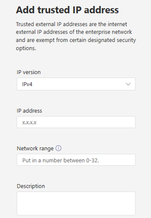

# <a name="manage-your-network-topology-for-cloud-voice-features-in-microsoft-teams"></a><span data-ttu-id="bc2e2-103">Gérer la topologie de votre réseau pour les fonctionnalités vocales de Microsoft teams</span><span class="sxs-lookup"><span data-stu-id="bc2e2-103">Manage your network topology for cloud voice features in Microsoft Teams</span></span>

<span data-ttu-id="bc2e2-104">Si votre organisation déploie le [routage de géolocalisation pour le routage direct](location-based-routing-plan.md) ou les [appels d’urgence dynamiques](configure-dynamic-emergency-calling.md), vous devez configurer des paramètres réseau pour ces fonctionnalités de voix Cloud dans Microsoft Teams.</span><span class="sxs-lookup"><span data-stu-id="bc2e2-104">If your organization is deploying [Location-Based Routing for Direct Routing](location-based-routing-plan.md) or [dynamic emergency calling](configure-dynamic-emergency-calling.md), you must configure network settings for use with these cloud voice features in Microsoft Teams.</span></span> <span data-ttu-id="bc2e2-105">Les paramètres réseau permettent de déterminer l’emplacement d’un client teams et d’inclure des régions réseau, des sites réseau, des sous-réseaux et des adresses IP approuvées.</span><span class="sxs-lookup"><span data-stu-id="bc2e2-105">Network settings are used to determine the location of a Teams client and include network regions, network sites, subnets, and trusted IP addresses.</span></span> <span data-ttu-id="bc2e2-106">En fonction de la fonctionnalité voix sur le Cloud et des fonctionnalités que vous déployez, vous configurez l’ensemble ou une partie de ces paramètres.</span><span class="sxs-lookup"><span data-stu-id="bc2e2-106">Depending on the cloud voice feature and capability that you're deploying, you configure some or all these settings.</span></span> <span data-ttu-id="bc2e2-107">Pour en savoir plus sur ces conditions, voir [paramètres réseau pour les fonctionnalités vocales](cloud-voice-network-settings.md)dans le Cloud.</span><span class="sxs-lookup"><span data-stu-id="bc2e2-107">To learn more about these terms, see [Network settings for cloud voice features](cloud-voice-network-settings.md).</span></span>

<span data-ttu-id="bc2e2-108">Vous pouvez configurer les paramètres réseau dans la page **topologie du réseau** du centre d’administration Microsoft teams ou à l’aide de Windows PowerShell.</span><span class="sxs-lookup"><span data-stu-id="bc2e2-108">You configure network settings on the **Network topology** page of the Microsoft Teams admin center or by using Windows PowerShell.</span></span>

## <a name="configure-network-settings-in-the-microsoft-teams-admin-center"></a><span data-ttu-id="bc2e2-109">Configurer les paramètres réseau dans le centre d’administration Microsoft teams</span><span class="sxs-lookup"><span data-stu-id="bc2e2-109">Configure network settings in the Microsoft Teams admin center</span></span>

[!INCLUDE [preview-feature](includes/preview-feature.md)]

<span data-ttu-id="bc2e2-110">Vous définissez les zones du réseau, les sites réseau et les sous-réseaux sous l’onglet **sites du réseau** de la page **topologie du réseau** .</span><span class="sxs-lookup"><span data-stu-id="bc2e2-110">You define network regions, network sites, and subnets on the **Network sites** tab of the **Network topology** page.</span></span> <span data-ttu-id="bc2e2-111">Dans cette section, vous pouvez créer ou modifier un site réseau, associer un site à une région réseau, associer un sous-réseau au site, activer le routage basé sur l’emplacement et affecter des stratégies d’urgence au site.</span><span class="sxs-lookup"><span data-stu-id="bc2e2-111">Here, you can create or modify a network site, associate a site with a network region, associate a subnet to the site, turn on Location-based Routing, and assign emergency policies to the site.</span></span> <span data-ttu-id="bc2e2-112">Vous pouvez également ajouter des régions réseau qui peuvent être utilisées globalement pour tous les sites.</span><span class="sxs-lookup"><span data-stu-id="bc2e2-112">You can also add network regions that can be used globally for all sites.</span></span>

#### <a name="add-and-configure-a-network-site"></a><span data-ttu-id="bc2e2-113">Ajouter et configurer un site réseau</span><span class="sxs-lookup"><span data-stu-id="bc2e2-113">Add and configure a network site</span></span>

1. <span data-ttu-id="bc2e2-114">Dans le volet de navigation de gauche du centre d’administration de Microsoft Teams, accédez à **emplacements** > **réseau**, puis cliquez sur l’onglet **sites du réseau** .</span><span class="sxs-lookup"><span data-stu-id="bc2e2-114">In the left navigation of the Microsoft Teams admin center, go to **Locations** > **Network topology**, and then click the **Network sites** tab.</span></span>
2. <span data-ttu-id="bc2e2-115">Cliquez sur **nouveau**, puis tapez un nom et une description pour le site.</span><span class="sxs-lookup"><span data-stu-id="bc2e2-115">Click **New**, and then enter a name and description for the site.</span></span>

    

3. <span data-ttu-id="bc2e2-117">Pour associer le site à une région du réseau, cliquez sur **lier la région du réseau**, sélectionnez une région existante ou cliquez sur **Ajouter** pour ajouter une région, puis cliquez sur **lien**.</span><span class="sxs-lookup"><span data-stu-id="bc2e2-117">To associate the site with a network region, click **Link network region**, select an existing region or click **Add** to add a region, and then click **Link**.</span></span>  
4. <span data-ttu-id="bc2e2-118">Pour activer le routage en fonction de l’emplacement du site, activez le **routage selon l’emplacement**.</span><span class="sxs-lookup"><span data-stu-id="bc2e2-118">To enable Location-Based Routing for the site, turn on **Location based routing**.</span></span>
5. <span data-ttu-id="bc2e2-119">Pour attribuer des stratégies de services d’urgence au site, effectuez l’une des opérations suivantes ou les deux :</span><span class="sxs-lookup"><span data-stu-id="bc2e2-119">To assign emergency services policies to the site, do one or both of the following:</span></span>

    - <span data-ttu-id="bc2e2-120">Si votre organisation utilise des plans d’appel ou du routage direct du système téléphonique, sous **stratégie d’appel d’urgence**, sélectionnez la stratégie de votre choix.</span><span class="sxs-lookup"><span data-stu-id="bc2e2-120">If your organization uses Calling Plans or deployed Phone System Direct Routing, under **Emergency calling policy**, select the policy that you want.</span></span>
    - <span data-ttu-id="bc2e2-121">Si votre organisation a déployé le routage direct du système téléphonique, sous **stratégie d’acheminement des appels d’urgence**, sélectionnez la stratégie de votre choix.</span><span class="sxs-lookup"><span data-stu-id="bc2e2-121">If your organization deployed Phone System Direct Routing, under **Emergency call routing policy**, select the  policy that you want.</span></span>

6. <span data-ttu-id="bc2e2-122">Pour associer un sous-réseau au site, sous **sous-réseaux**, cliquez sur Ajouter des sous- **réseaux**.</span><span class="sxs-lookup"><span data-stu-id="bc2e2-122">To associate a subnet to the site, under **Subnets**, click **Add subnets**.</span></span> <span data-ttu-id="bc2e2-123">Spécifiez la version IP, l’adresse IP, la plage réseau, ajoutez une description, puis cliquez sur **appliquer**.</span><span class="sxs-lookup"><span data-stu-id="bc2e2-123">Specify the IP version, IP address, network range, add a description, and then click **Apply**.</span></span> <span data-ttu-id="bc2e2-124">Chaque sous-réseau doit être associé à un site spécifique.</span><span class="sxs-lookup"><span data-stu-id="bc2e2-124">Each subnet must be associated with a specific site.</span></span>
7. <span data-ttu-id="bc2e2-125">Cliquez sur **Enregistrer**.</span><span class="sxs-lookup"><span data-stu-id="bc2e2-125">Click **Save**.</span></span>

#### <a name="modify-a-network-site"></a><span data-ttu-id="bc2e2-126">Modifier un site réseau</span><span class="sxs-lookup"><span data-stu-id="bc2e2-126">Modify a network site</span></span>

1. <span data-ttu-id="bc2e2-127">Dans le volet de navigation de gauche du centre d’administration de Microsoft Teams, accédez à **emplacements** > **réseau**, puis cliquez sur l’onglet **sites du réseau** .</span><span class="sxs-lookup"><span data-stu-id="bc2e2-127">In the left navigation of the Microsoft Teams admin center, go to **Locations** > **Network topology**, and then click the **Network sites** tab.</span></span>
2. <span data-ttu-id="bc2e2-128">Sélectionnez le site en cliquant à gauche du nom du site, puis cliquez sur **modifier**.</span><span class="sxs-lookup"><span data-stu-id="bc2e2-128">Select the site by clicking to the left of the site name, and then click **Edit**.</span></span>
3. <span data-ttu-id="bc2e2-129">Apportez les modifications souhaitées, puis cliquez sur **Enregistrer.**</span><span class="sxs-lookup"><span data-stu-id="bc2e2-129">Make the changes that you want, and then click **Save.**</span></span>

### <a name="manage-external-trusted-ip-addresses"></a><span data-ttu-id="bc2e2-130">Gérer les adresses IP de confiance externes</span><span class="sxs-lookup"><span data-stu-id="bc2e2-130">Manage external trusted IP addresses</span></span>

<span data-ttu-id="bc2e2-131">Pour gérer les adresses IP de confiance externes, accédez à l’onglet **IPS approuvés** de la page **Topology Network** du centre d’administration Microsoft Teams.</span><span class="sxs-lookup"><span data-stu-id="bc2e2-131">You manage external trusted IP addresses on the **Trusted IPs** tab on the **Network topology** page of the Microsoft Teams admin center.</span></span> <span data-ttu-id="bc2e2-132">Vous pouvez ajouter un nombre illimité d’adresses IP de confiance externes.</span><span class="sxs-lookup"><span data-stu-id="bc2e2-132">You can add an unlimited number of external trusted IP addresses.</span></span>

#### <a name="add-a-trusted-ip-address"></a><span data-ttu-id="bc2e2-133">Ajouter une adresse IP de confiance</span><span class="sxs-lookup"><span data-stu-id="bc2e2-133">Add a trusted IP address</span></span>

1. <span data-ttu-id="bc2e2-134">Dans le volet de navigation de gauche du centre d’administration de Microsoft Teams, accédez à **emplacements** > **réseau**, puis cliquez sur l’onglet **IPS approuvés** .</span><span class="sxs-lookup"><span data-stu-id="bc2e2-134">In the left navigation of the Microsoft Teams admin center, go to **Locations** > **Network topology**, and then click the **Trusted IPs** tab.</span></span>
2. <span data-ttu-id="bc2e2-135">Cliquez sur **Nouveau**.</span><span class="sxs-lookup"><span data-stu-id="bc2e2-135">Click **New**.</span></span>
3. <span data-ttu-id="bc2e2-136">Dans le volet **Ajouter une adresse IP approuvée** , spécifiez la version IP, l’adresse IP, la plage réseau, ajoutez une description, puis cliquez sur **appliquer**.</span><span class="sxs-lookup"><span data-stu-id="bc2e2-136">In the **Add trusted IP address** pane, specify the IP version, IP address, network range, add a description, and then click **Apply**.</span></span>

    

#### <a name="edit-a-trusted-ip-address"></a><span data-ttu-id="bc2e2-138">Modifier une adresse IP de confiance</span><span class="sxs-lookup"><span data-stu-id="bc2e2-138">Edit a trusted IP address</span></span>

1. <span data-ttu-id="bc2e2-139">Dans le volet de navigation de gauche du centre d’administration de Microsoft Teams, accédez à **emplacements** > **réseau**, puis cliquez sur l’onglet **IPS approuvés** .</span><span class="sxs-lookup"><span data-stu-id="bc2e2-139">In the left navigation of the Microsoft Teams admin center, go to **Locations** > **Network topology**, and then click the **Trusted IPs** tab.</span></span>
2. <span data-ttu-id="bc2e2-140">Sélectionnez l’adresse IP en cliquant à gauche de celle-ci, puis cliquez sur **modifier**.</span><span class="sxs-lookup"><span data-stu-id="bc2e2-140">Select the IP address by clicking to the left of it, and then click **Edit**.</span></span>
3. <span data-ttu-id="bc2e2-141">Dans le volet **modifier l’adresse IP de confiance** , apportez les modifications souhaitées, puis cliquez sur **appliquer**.</span><span class="sxs-lookup"><span data-stu-id="bc2e2-141">In the **Edit trusted IP address** pane, make the changes that you want, and then click **Apply**.</span></span>

## <a name="configure-network-settings-using-powershell"></a><span data-ttu-id="bc2e2-142">Configurer les paramètres réseau à l’aide de PowerShell</span><span class="sxs-lookup"><span data-stu-id="bc2e2-142">Configure network settings using PowerShell</span></span>

<span data-ttu-id="bc2e2-143">Pour suivre les étapes décrites dans cette section, vous devez vous familiariser avec les applets de cmdlet PowerShell.</span><span class="sxs-lookup"><span data-stu-id="bc2e2-143">To complete the steps in this section, you'll need some familiarity with PowerShell cmdlets.</span></span> <span data-ttu-id="bc2e2-144">Pour en savoir plus, voir [vue d’ensemble de PowerShell teams](teams-powershell-overview.md).</span><span class="sxs-lookup"><span data-stu-id="bc2e2-144">To learn more, see [Teams PowerShell Overview](teams-powershell-overview.md).</span></span>

### <a name="define-network-regions"></a><span data-ttu-id="bc2e2-145">Définir des régions réseau</span><span class="sxs-lookup"><span data-stu-id="bc2e2-145">Define network regions</span></span>

 <span data-ttu-id="bc2e2-146">Utilisez l’applet de nouvelle applet de [nouveau-CsTenantNetworkRegion](https://docs.microsoft.com/powershell/module/skype/New-CsTenantNetworkRegion) pour définir des régions du réseau.</span><span class="sxs-lookup"><span data-stu-id="bc2e2-146">Use the [New-CsTenantNetworkRegion](https://docs.microsoft.com/powershell/module/skype/New-CsTenantNetworkRegion) cmdlet to define network regions.</span></span> <span data-ttu-id="bc2e2-147">Notez que le paramètre RegionID est un nom logique qui représente la géographie de la région et qu’il n’y a pas de dépendances ni&gt; de restrictions et que le paramètre d’ID de site CentralSite &lt;est facultatif.</span><span class="sxs-lookup"><span data-stu-id="bc2e2-147">Note that the RegionID parameter is a logical name that represents the geography of the region and has no dependencies or restrictions and the CentralSite &lt;site ID&gt; parameter is optional.</span></span>

```
New-CsTenantNetworkRegion -NetworkRegionID <region ID>  
```

<span data-ttu-id="bc2e2-148">Dans cet exemple, nous créons une région réseau nommée Inde.</span><span class="sxs-lookup"><span data-stu-id="bc2e2-148">In this example, we create a network region named India.</span></span>
```
New-CsTenantNetworkRegion -NetworkRegionID "India"  
```

<span data-ttu-id="bc2e2-149">Voir également [Set-CsTenantNetworkRegion](https://docs.microsoft.com/powershell/module/skype/set-cstenantnetworkregion).</span><span class="sxs-lookup"><span data-stu-id="bc2e2-149">See also [Set-CsTenantNetworkRegion](https://docs.microsoft.com/powershell/module/skype/set-cstenantnetworkregion).</span></span>

### <a name="define-network-sites"></a><span data-ttu-id="bc2e2-150">Définir des sites réseau</span><span class="sxs-lookup"><span data-stu-id="bc2e2-150">Define network sites</span></span>

<span data-ttu-id="bc2e2-151">Utilisez l’applet de nouvelle applet de [CsTenantNetworkSite](https://docs.microsoft.com/powershell/module/skype/new-cstenantnetworksite?view=skype-ps) pour définir des sites réseau.</span><span class="sxs-lookup"><span data-stu-id="bc2e2-151">Use the [New-CsTenantNetworkSite](https://docs.microsoft.com/powershell/module/skype/new-cstenantnetworksite?view=skype-ps) cmdlet to define network sites.</span></span> <span data-ttu-id="bc2e2-152">Chaque site réseau doit être associé à une région réseau.</span><span class="sxs-lookup"><span data-stu-id="bc2e2-152">Each network site must be associated with a network region.</span></span>

```
New-CsTenantNetworkSite -NetworkSiteID <site ID> -NetworkRegionID <region ID>
```
<span data-ttu-id="bc2e2-153">Dans cet exemple, nous créons deux nouveaux sites réseau, Delhi et Hyderabad, dans la région Inde.</span><span class="sxs-lookup"><span data-stu-id="bc2e2-153">In this example, we create two new network sites, Delhi and Hyderabad, in the India region.</span></span>
```
New-CsTenantNetworkSite -NetworkSiteID "Delhi" -NetworkRegionID "India"
New-CsTenantNetworkSite -NetworkSiteID "Hyderabad" -NetworkRegionID "India"
```
<span data-ttu-id="bc2e2-154">Le tableau suivant indique les sites réseau définis dans cet exemple.</span><span class="sxs-lookup"><span data-stu-id="bc2e2-154">The following table shows the network sites defined in this example.</span></span>

||<span data-ttu-id="bc2e2-155">Site 1</span><span class="sxs-lookup"><span data-stu-id="bc2e2-155">Site 1</span></span> |<span data-ttu-id="bc2e2-156">Site 2</span><span class="sxs-lookup"><span data-stu-id="bc2e2-156">Site 2</span></span> |
|---------|---------|---------|
|<span data-ttu-id="bc2e2-157">ID de site</span><span class="sxs-lookup"><span data-stu-id="bc2e2-157">Site ID</span></span>    |    <span data-ttu-id="bc2e2-158">Site 1 (Delhi)</span><span class="sxs-lookup"><span data-stu-id="bc2e2-158">Site 1 (Delhi)</span></span>     |  <span data-ttu-id="bc2e2-159">Site 2 (Hyderabad)</span><span class="sxs-lookup"><span data-stu-id="bc2e2-159">Site 2 (Hyderabad)</span></span>       |
|<span data-ttu-id="bc2e2-160">ID de région</span><span class="sxs-lookup"><span data-stu-id="bc2e2-160">Region ID</span></span>  |     <span data-ttu-id="bc2e2-161">Région 1 (Inde)</span><span class="sxs-lookup"><span data-stu-id="bc2e2-161">Region 1 (India)</span></span>    |   <span data-ttu-id="bc2e2-162">Région 1 (Inde)</span><span class="sxs-lookup"><span data-stu-id="bc2e2-162">Region 1 (India)</span></span>      |

<span data-ttu-id="bc2e2-163">Voir également [Set-CsTenantNetworkRegion](https://docs.microsoft.com/powershell/module/skype/set-cstenantnetworksite).</span><span class="sxs-lookup"><span data-stu-id="bc2e2-163">See also [Set-CsTenantNetworkRegion](https://docs.microsoft.com/powershell/module/skype/set-cstenantnetworksite).</span></span>

### <a name="define-network-subnets"></a><span data-ttu-id="bc2e2-164">Définir des sous-réseaux réseau</span><span class="sxs-lookup"><span data-stu-id="bc2e2-164">Define network subnets</span></span>

<span data-ttu-id="bc2e2-165">Utilisez l’applet de nouvelle applet de [nouveau-CsTenantNetworkSubnet](https://docs.microsoft.com/powershell/module/skype/new-cstenantnetworksubnet?view=skype-ps) pour définir des sous-réseaux réseau et les associer aux sites du réseau.</span><span class="sxs-lookup"><span data-stu-id="bc2e2-165">Use the [New-CsTenantNetworkSubnet](https://docs.microsoft.com/powershell/module/skype/new-cstenantnetworksubnet?view=skype-ps) cmdlet to define network subnets and associate them to network sites.</span></span> <span data-ttu-id="bc2e2-166">Chaque sous-réseau ne peut être associé qu’à un seul site.</span><span class="sxs-lookup"><span data-stu-id="bc2e2-166">Each network subnet can only be associated with one site.</span></span>

```
New-CsTenantNetworkSubnet -SubnetID <Subnet IP address> -MaskBits <Subnet bitmask> -NetworkSiteID <site ID>
```

<span data-ttu-id="bc2e2-167">Dans cet exemple, nous créons une association entre le sous-réseau 192.168.0.0 et le site réseau de Delhi et entre le sous-réseau 2001:4898 : E8:25:844e : 926f : 85AD : DD8E et le site du réseau Hyderabad.</span><span class="sxs-lookup"><span data-stu-id="bc2e2-167">In this example, we create an association between subnet 192.168.0.0 and the Delhi network site and between subnet 2001:4898:e8:25:844e:926f:85ad:dd8e and the Hyderabad network site.</span></span>
```

New-CsTenantNetworkSubnet -SubnetID "192.168.0.0" -MaskBits "24" -NetworkSiteID "Delhi"
New-CsTenantNetworkSubnet -SubnetID "2001:4898:e8:25:844e:926f:85ad:dd8e" -MaskBits "120" -NetworkSiteID "Hyderabad"

```
<span data-ttu-id="bc2e2-168">Le tableau suivant montre les sous-réseaux définis dans cet exemple.</span><span class="sxs-lookup"><span data-stu-id="bc2e2-168">The following table shows the subnets defined in this example.</span></span>

||<span data-ttu-id="bc2e2-169">Site 1</span><span class="sxs-lookup"><span data-stu-id="bc2e2-169">Site 1</span></span> |<span data-ttu-id="bc2e2-170">Site 2</span><span class="sxs-lookup"><span data-stu-id="bc2e2-170">Site 2</span></span> |
|---------|---------|---------|
|<span data-ttu-id="bc2e2-171">ID de sous-réseau</span><span class="sxs-lookup"><span data-stu-id="bc2e2-171">Subnet ID</span></span>   |    <span data-ttu-id="bc2e2-172">192.168.0.0</span><span class="sxs-lookup"><span data-stu-id="bc2e2-172">192.168.0.0</span></span>     |  <span data-ttu-id="bc2e2-173">2001:4898 : E8:25:844e : 926f : 85AD : DD8E</span><span class="sxs-lookup"><span data-stu-id="bc2e2-173">2001:4898:e8:25:844e:926f:85ad:dd8e</span></span>     |
|<span data-ttu-id="bc2e2-174">Réseau</span><span class="sxs-lookup"><span data-stu-id="bc2e2-174">Mask</span></span>  |     <span data-ttu-id="bc2e2-175">24</span><span class="sxs-lookup"><span data-stu-id="bc2e2-175">24</span></span>    |   <span data-ttu-id="bc2e2-176">120</span><span class="sxs-lookup"><span data-stu-id="bc2e2-176">120</span></span>      |
|<span data-ttu-id="bc2e2-177">ID de site</span><span class="sxs-lookup"><span data-stu-id="bc2e2-177">Site ID</span></span>  | <span data-ttu-id="bc2e2-178">Site (Delhi)</span><span class="sxs-lookup"><span data-stu-id="bc2e2-178">Site (Delhi)</span></span> | <span data-ttu-id="bc2e2-179">Site 2 (Hyderabad)</span><span class="sxs-lookup"><span data-stu-id="bc2e2-179">Site 2 (Hyderabad)</span></span> |

<span data-ttu-id="bc2e2-180">Pour plusieurs sous-réseaux, vous pouvez importer un fichier CSV à l’aide d’un script comme celui-ci.</span><span class="sxs-lookup"><span data-stu-id="bc2e2-180">For multiple subnets, you can import a CSV file by using a script such as the following.</span></span>
```
Import-CSV C:\subnet.csv | foreach {New-CsTenantNetworkSubnet –SubnetID $_.SubnetID-MaskBits $_.Mask -NetworkSiteID $_.SiteID}  
```
<span data-ttu-id="bc2e2-181">Dans cet exemple, le fichier CSV ressemble à ceci :</span><span class="sxs-lookup"><span data-stu-id="bc2e2-181">In this example, the CSV file looks something like this:</span></span>
```
Identity, Mask, SiteID
172.11.12.0, 24, Redmond
172.11.13.0, 24, Chicago
172.11.14.0, 25, Vancouver
172.11.15.0, 28, Paris
```

<span data-ttu-id="bc2e2-182">Voir également [Set-CsTenantNetworkSubnet](hhttps://docs.microsoft.com/powershell/module/skype/set-cstenantnetworksubnet).</span><span class="sxs-lookup"><span data-stu-id="bc2e2-182">See also [Set-CsTenantNetworkSubnet](hhttps://docs.microsoft.com/powershell/module/skype/set-cstenantnetworksubnet).</span></span>

### <a name="define-external-subnets-external-trusted-ip-addresses"></a><span data-ttu-id="bc2e2-183">Définir des sous-réseaux externes (adresses IP de confiance externes)</span><span class="sxs-lookup"><span data-stu-id="bc2e2-183">Define external subnets (external trusted IP addresses)</span></span>

<span data-ttu-id="bc2e2-184">Utilisez l’applet de nouvelle applet de [nouveau-CsTenantTrustedIPAddress](https://docs.microsoft.com/powershell/module/skype/new-cstenanttrustedipaddress?view=skype-ps) pour définir des sous-réseaux externes et les affecter au client.</span><span class="sxs-lookup"><span data-stu-id="bc2e2-184">Use the [New-CsTenantTrustedIPAddress](https://docs.microsoft.com/powershell/module/skype/new-cstenanttrustedipaddress?view=skype-ps) cmdlet to define external subnets and assign them to the tenant.</span></span> <span data-ttu-id="bc2e2-185">Vous pouvez définir un nombre illimité de sous-réseaux externes pour un client.</span><span class="sxs-lookup"><span data-stu-id="bc2e2-185">You can define an unlimited number of external subnets for a tenant.</span></span>
```
New-CsTenantTrustedIPAddress -IPAddress <External IP address> -MaskBits <Subnet bitmask> -Description <description> 
```
<span data-ttu-id="bc2e2-186">Par exemple :</span><span class="sxs-lookup"><span data-stu-id="bc2e2-186">For example:</span></span>
```
New-CsTenantTrustedIPAddress -IPAddress 198.51.100.0 -MaskBits 30 -Description "Contoso address"  
```

<span data-ttu-id="bc2e2-187">Voir également [Set-CsTenantTrustedIPAddress](https://docs.microsoft.com/powershell/module/skype/set-cstenanttrustedipaddress).</span><span class="sxs-lookup"><span data-stu-id="bc2e2-187">See also [Set-CsTenantTrustedIPAddress](https://docs.microsoft.com/powershell/module/skype/set-cstenanttrustedipaddress).</span></span>

## <a name="related-topics"></a><span data-ttu-id="bc2e2-188">Voir aussi</span><span class="sxs-lookup"><span data-stu-id="bc2e2-188">Related topics</span></span>

- [<span data-ttu-id="bc2e2-189">Paramètres réseau pour les fonctionnalités vocales de Cloud dans teams</span><span class="sxs-lookup"><span data-stu-id="bc2e2-189">Network settings for cloud voice features in Teams</span></span>](cloud-voice-network-settings.md)
