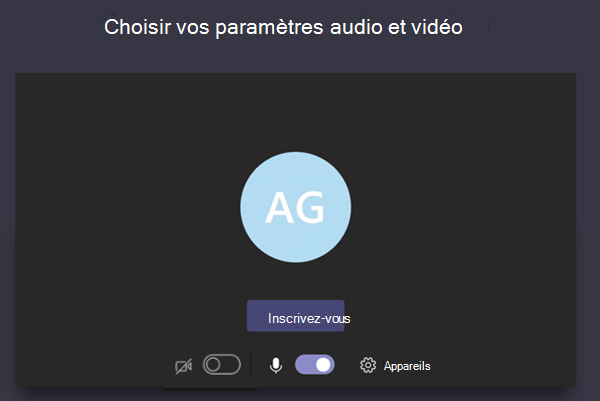
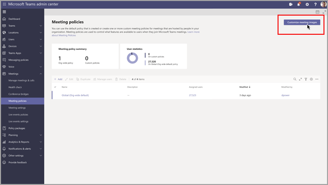

# Paramètres de stratégie de réunion pour l’audio & vidéo

Cet article décrit les paramètres de stratégie de réunion spécifiques à l’audio et à la vidéo. Il s’agit notamment des éléments suivants :

- [Mode pour l’audio sur IP](#mode-for-ip-audio)
- [Mode pour la vidéo sur IP](#mode-for-ip-video)
- [Vidéo IP](#ip-video)
- [Débit binaire multimédia (Kbits/s)](#media-bit-rate-kbps)
- [Mode filtres vidéo](#video-filters-mode)
- [Autoriser les paramètres d’arrière-plan personnalisés](#allow-custom-background-settings)
- [Contrôle de l’appareil photo de bout en bout (FECC) pour les caméras avec zoom panoramique (PTZ)](#far-end-camera-control-fecc-for-pan-tilt-zoom-ptz-cameras)

## Mode pour l’audio sur IP

Il s’agit d’une stratégie par utilisateur. Ce paramètre détermine si l’audio peut être activé pendant les réunions et les appels de groupe. Voici les valeurs de ce paramètre.

|Valeur du paramètre|Comportement|
|---|---|
|**Audio sortant et entrant activé**|Les éléments audio entrants et sortants sont autorisés pendant la réunion. Il s’agit du paramètre par défaut.|
|**Non activé**|Les éléments audio entrants et sortants sont désactivés pendant la réunion.|

S’il est défini sur **Non activé** pour un utilisateur, cet utilisateur peut toujours planifier et organiser des réunions, mais il ne peut pas utiliser l’audio. Pour participer à une réunion, ils doivent se connecter via le réseau téléphonique commuté public (PSTN) ou passer un appel à la réunion et les rejoindre par téléphone. Les participants à la réunion qui n’ont pas de stratégie attribuée (par exemple, les participants anonymes) ont ce paramètre sur **Audio sortant et entrant activé** par défaut. Sur les clients mobiles Teams, si ce paramètre n’est pas activé, l’utilisateur doit se connecter à la réunion via le RTC.

Ce paramètre ne s’applique pas aux appels en tête en tête. Pour restreindre les appels en tête à tête, configurez une [stratégie d'appel](teams-calling-policy.md) Teams et désactivez le paramètre **Passer des appels privés** . Ce paramètre ne s’applique pas non plus aux appareils de salle de conférence tels que les appareils Surface Hub et salle Microsoft Teams.

Ce paramètre n’est pas encore disponible pour les environnements Microsoft 365 Cloud de la communauté du secteur public(GCC), GCC High ou Department of Defense (DoD).

Pour plus d’informations, consultez [Gérer l’audio/vidéo pour les participants à la réunion](#manage-audiovideo-for-meeting-participants).

## Mode pour la vidéo sur IP

Il s’agit d’une stratégie par utilisateur. Ce paramètre détermine si la vidéo peut être activée pendant les réunions et les appels de groupe. Voici les valeurs de ce paramètre.

|Valeur du paramètre|Comportement|
|---|---|
|**Vidéo sortante et entrante activée**|Les éléments vidéo entrants et sortants sont autorisés pendant la réunion. Il s’agit du paramètre par défaut.|
|**Non activé**|Les éléments vidéio entrants et sortants sont désactivés pendant la réunion. Sur les clients mobiles Teams, les utilisateurs ne peuvent pas partager de vidéos ou de photos pendant la réunion.   Notez que si **le mode pour l’audio IP** n’est pas activé, le **mode pour la vidéo IP** n’est pas non plus activé.|

S’il est défini sur **Non activé** pour un utilisateur, cet utilisateur ne peut pas activer la vidéo ou afficher les vidéos partagées par d’autres participants à la réunion. Les participants à la réunion qui n’ont pas de stratégie attribuée (par exemple, les participants anonymes) ont ce paramètre sur **Vidéo sortante et entrante activée** par défaut.

Ce paramètre ne s’applique pas non plus aux appareils de salle de conférence tels que les appareils Surface Hub et salle Microsoft Teams.

Ce paramètre n’est pas encore disponible pour les environnements Microsoft 365 Cloud de la communauté du secteur public(GCC), GCC High ou Department of Defense (DoD).

> [!NOTE]
> Gardez à l’esprit que ce paramètre contrôle à la fois la vidéo sortante et entrante, tandis que le paramètre **vidéo IP** contrôle la vidéo sortante. Pour plus d’informations, consultez [Quelle stratégie de vidéo sur IP est prioritaire ?](#which-ip-video-policy-setting-takes-precedence) et [Gérer l'audio/vidéo pour les participants à la réunion](#manage-audiovideo-for-meeting-participants).

Pour plus d’informations, consultez [Gérer l’audio/vidéo pour les participants à la réunion](#manage-audiovideo-for-meeting-participants).

## Vidéo IP

Il s’agit d’une combinaison d’une stratégie par organisateur et par utilisateur. La vidéo est un composant essentiel pour les réunions. Dans certaines organisations, il est possible que les administrateurs souhaitent plus de contrôle sur les réunions des utilisateurs qui ont une vidéo. Ce paramètre contrôle si la vidéo peut être activée dans les réunions organisées par un utilisateur et dans les appels en tête en tête et de groupe lancés par un utilisateur. Sur les clients mobiles Teams, ce paramètre contrôle si les utilisateurs peuvent partager des photos et des vidéos dans le cadre d’une réunion.

Les réunions organisées par un utilisateur pour lequel ce paramètre de stratégie est activé permettent le partage de vidéos dans la réunion par les participants, si ces derniers ont également activé le paramètre de stratégie. Les participants à la réunion qui n'ont pas de stratégie attribuée (par exemple, les participants anonymes et fédérés) héritent de la stratégie de l'organisateur de la réunion.

> [!NOTE]
> Gardez à l’esprit que ce paramètre contrôle la vidéo sortante, tandis que le **Mode pour la vidéo sur IP** contrôle la vidéo sortante et entrante. Pour plus d’informations, consultez [Quelle stratégie de vidéo sur IP est prioritaire ?](#which-ip-video-policy-setting-takes-precedence) et [Gérer l'audio/vidéo pour les participants à la réunion](#manage-audiovideo-for-meeting-participants).

|Ordinateur de bureau et client web Teams|Client mobile Teams|
|:---:|:---:|
|||

Examinons l’exemple suivant.

|Utilisateur|Stratégie de réunion|Vidéo IP|
|---|---|---|
|Daniela|Global|Activé|
|Geneviève|Location1MeetingPolicy|Désactivé|

Les réunions organisées par Daniela permettent d'activer la vidéo. Daniela pouvez rejoindre la réunion et activer la vidéo. Amanda ne peut pas activer la vidéo pendant la réunion de Daniela parce que la stratégie Amanda est définie sur ne pas autoriser la vidéo. Amanda peut voir les vidéos partagées par les autres participants à la réunion.

Dans les réunions organisées par Amanda, personne ne peut activer la vidéo, quelle que soit la stratégie vidéo qui leur est attribuée. Cela signifie que Daniela ne peut pas activer la vidéo dans les réunions d’Amanda.  

Si Daniela appelle Amanda avec la vidéo activée, Amanda ne peut répondre à l'appel qu'avec l'audio.  Lorsque l'appel est connecté, Amanda peut afficher la vidéo de Daniela, mais ne peut pas activer la vidéo. Si Amanda appelle Daniela, Daniela peut répondre à l'appel par vidéo et audio. Une fois l’appel connecté, Daniela peut activer ou désactiver sa vidéo, le cas échéant.

Pour plus d’informations, consultez [Gérer l’audio/vidéo pour les participants à la réunion](#manage-audiovideo-for-meeting-participants).

### Quel paramètre de stratégie vidéo IP est prioritaire ?

Pour un utilisateur, le paramètre de stratégie le plus restrictif pour la vidéo est prioritaire. Voici quelques exemples.

|Vidéo IP|Mode pour la vidéo sur IP|Expérience de réunion|
|---|---|---|
|Organisateur : **Activé**  Participant : **Activé**|Participant : **Désactivé**|Le paramètre **Mode pour vidéo sur IP** est prioritaire. Le participant auquel cette stratégie est attribuée ne peut pas activer ou afficher les vidéos partagées par d’autres personnes.|
|Organisateur : **Activé**  Participant : **Activé**|Participant : **Vidéo sortante et entrante activée**|Le participant auquel cette stratégie est attribuée peut activer ou afficher les vidéos partagées par d’autres personnes.|
|Organisateur : **Activé**  Participant : **Désactivé**|Participant : **Vidéo sortante et entrante activée**|Le paramètre **vidéo IP** est prioritaire. Les participants peuvent uniquement afficher la vidéo entrante et ne peuvent pas envoyer de vidéo sortante.|
|Organisateur : **Activé**  Participant : **Désactivé**|Participant : **Désactivé**|Le paramètre **Mode pour vidéo sur IP** est prioritaire. Le participant ne peut pas afficher la vidéo entrante ou sortante.|
|Organisateur : **Désactivé**||Le paramètre **vidéo IP** est prioritaire, car il est désactivé pour l’organisateur. Personne ne peut activer la vidéo pendant les réunions organisées par l’utilisateur auquel cette stratégie est attribuée.|

### Gérer l’audio/vidéo pour les participants à la réunion

|Si vous souhaitez...|Configurer les paramètres de stratégie suivants|
|---|---|
|Désactiver l’audio et la vidéo pour les participants aux réunions|Mode pour l’audio sur IP : **Désactivé**  Mode pour la vidéo sur IP : **Désactivé** Vidéo IP : N/A|
|Activer uniquement les éléments audio et vidéo entrants pour les participants aux réunions|Mode pour l’audio sur IP : **Audio sortant et entrant activé**  Mode pour la vidéo sur IP : **Vidéo sortante et entrante activée** Vidéo IP : **Désactivé**|
|Désactiver la vidéo pour les participants aux réunions (les participants ont un son uniquement)|Mode pour l’audio sur IP : **Activer l’audio sortant et entrant**  Mode pour la vidéo sur IP : **Désactivé** Vidéo IP : N/A
|Activer l’audio et la vidéo pour les participants aux réunions|Mode pour l’audio sur IP : **Audio sortant et entrant activé** (par défaut)  Mode pour la vidéo sur IP : **Vidéo sortante et entrante activée** (par défaut) Vidéo IP : **Activé** (par défaut)|

La stratégie la plus restrictive entre la stratégie de l’organisateur de la réunion et la stratégie de l’utilisateur s’applique. Par exemple, si un organisateur a une stratégie qui restreint la vidéo et que la stratégie d’un utilisateur ne limite pas la vidéo, les participants à la réunion héritent de la stratégie de l’organisateur de la réunion et n’ont pas accès à la vidéo dans les réunions. Cela signifie qu’ils peuvent participer à la réunion avec le son uniquement.

> [!NOTE]
> Lorsqu’un utilisateur commence un appel de groupe pour participer à une jointure par téléphone, l’écran **Utiliser le téléphone pour l’audio** ne s’affiche pas. Nous travaillons à la résolution de ce problème connu. Pour contourner ce problème, sélectionnez **Audio du téléphone** sous **Autres options de jointure**.

### Clients mobiles Teams

Pour les utilisateurs des clients mobiles Teams, la possibilité de partager des photos et des vidéos pendant une réunion est également déterminée par le paramètre **de mode vidéo IP** ou **VIDÉO IP** . Selon le paramètre de stratégie prioritaire, la possibilité de partager des vidéos et des photos ne sera pas disponible. Cela n’affecte pas le partage d’écran, que vous configurez à l’aide d’un paramètre [Mode de partage d’écran](meeting-policies-content-sharing.md#screen-sharing-mode) séparé. De plus, vous pouvez définir une [Stratégie de mobilité Teams](/powershell/module/skype/new-csteamsmobilitypolicy) pour empêcher les utilisateurs mobiles d’utiliser une vidéo sur IP via une connexion cellulaire, ce qui signifie qu’ils doivent utiliser une connexion WiFi.

## Débit binaire multimédia (Kbits/s)

Il s’agit d’une stratégie par utilisateur. Ce paramètre détermine la vitesse de transmission du média pour les transmissions de partage d’applications audio, vidéo et vidéo dans les appels et les réunions pour l’utilisateur. Il s'applique à la fois à la traversée des médias en liaison montante et descendante pour les utilisateurs lors de l'appel ou de la réunion. Ce paramètre vous permet de contrôler de façon granulaire la gestion de la bande passante au sein de votre organisation. En fonction des scénarios de réunion requis par les utilisateurs, nous recommandons de disposer d'une bande passante suffisante pour une expérience de bonne qualité. La valeur minimale est de 30 kbps et la valeur maximale dépend du scénario de réunion. Pour en savoir plus sur la bande passante minimale recommandée pour les réunions, les appels et les événements en direct de qualité dans Teams, consultez [Configuration requise en bande passante](prepare-network.md#bandwidth-requirements).

S’il n’y a pas assez de bande passante pour une réunion, les participants voient un message indiquant une qualité de réseau médiocre.

Pour les réunions qui nécessitent une expérience vidéo de la plus haute qualité, telles que les réunions du conseil d'administration du PDG et les événements en direct Teams, nous vous recommandons de régler la bande passante à 10 Mbps. Même lorsque l'expérience maximale est fixée, la pile média Teams s'adapte aux conditions de faible largeur de bande lorsque certaines conditions de réseau sont détectées, selon le scénario.

## Mode filtres vidéo

Il s’agit d’une stratégie par utilisateur. Ce paramètre contrôle si les utilisateurs peuvent personnaliser leur arrière-plan vidéo lors d'une réunion.

Vous pouvez utiliser le Centre d’administration Teams et PowerShell pour définir cette stratégie. Vous pouvez modifier une stratégie de réunion Teams existante à l’aide de l’applet de commande [CsTeamsMeetingPolicy](/powershell/module/skype/set-csteamsmeetingpolicy) . Vous pouvez également créer une stratégie de réunion Teams à l’aide de l’applet de commande [New-CsTeamsMeetingPolicy](/powershell/module/skype/new-csteamsmeetingpolicy), puis attribuer la stratégie aux utilisateurs.

Pour spécifier si les utilisateurs peuvent personnaliser leur arrière-plan vidéo dans une réunion, définissez le paramètre **VideoFiltersMode** (**paramètre Sélectionner des filtres vidéo** dans le Centre d’administration Teams) comme suit :

|Définition de la valeur dans PowerShell|Définition de la valeur dans le Centre d’administration Teams|Comportement|
|---|---|---|
|**NoFilters**|**Aucun filtre**|L'utilisateur ne peut pas personnaliser l'arrière-plan vidéo.|
|**BlurOnly**|**Flou d’arrière-plan uniquement**|L'utilisateur a la possibilité de flouter l'arrière-plan de la vidéo.|
|**BlurandDefaultBackgrounds**|**Flou d’arrière-plan et images par défaut**|L'utilisateur a la possibilité de flouter l'arrière-plan de la vidéo ou de choisir parmi l'ensemble d'images par défaut à utiliser comme arrière-plan.|
|**AllFilters**|**Tous les filtres**|L’utilisateur a la possibilité de flouter l’arrière-plan de la vidéo, de choisir parmi l’ensemble des images par défaut ou de télécharger des images personnalisées pour les utiliser comme arrière-plan.|

> [!NOTE]
> Les images chargées par les utilisateurs ne sont pas filtrées par Teams. Lorsque vous utilisez le paramètre de **AllFilters**, vous devez disposer de stratégies d’organisation interne pour empêcher les utilisateurs de télécharger des images choquantes ou inappropriées, ou des images que votre organisation n’a pas le droit d’utiliser pour Teams.

## Autoriser les paramètres d’arrière-plan personnalisés

Vous pouvez ajouter des images d’arrière-plan personnalisées à utiliser par locataire. Cette fonctionnalité permet aux entreprises d’appliquer la personnalisation de l’entreprise aux réunions Teams.

> [!NOTE]
> Pour charger des images d’arrière-plan, le compte administrateur que vous utilisez pour effectuer cette procédure doit disposer d’une licence Teams.

1. Se connecter au Centre d’administration de Microsoft Teams.

2. Sélectionnez **Stratégies de** **réunion Réunions** \> \> **Personnaliser les images de réunion**.

   

3. Sélectionnez **Activé** **dans Images d’arrière-plan à l’échelle de l’organisation**.

4. Sélectionnez **+ Ajouter des images**.

5. Dans le panneau Gestion des arrière-plans, sélectionnez **Ajouter une image**.

6. Vérifiez que les images répondent aux exigences suivantes :
  
   - Taille minimale 360 px
   - Taille maximale 2048 px
   - Type de fichier PNG, JPG ou BMP
   - 50 images maximum peuvent être chargées

7. Affichez un aperçu des images que vous avez sélectionnées, puis sélectionnez **Fermer**.

8. Passez en revue les images et ajoutez-en d’autres en fonction des besoins.

9. Sélectionnez **Enregistrer**.

Les participants à la réunion voient une sélection d’images d’arrière-plan qu’ils peuvent utiliser lorsqu’ils assistent à une réunion.

> [!NOTE]
> L’application des modifications peut prendre jusqu’à 24 heures.
>
> Cette fonctionnalité est temporairement disponible en préversion publique pour tous les clients Microsoft Teams. Pour obtenir cette fonctionnalité après la préversion, chaque utilisateur a besoin de la licence du module complémentaire Communications avancées. Pour plus d’informations, consultez [Module complémentaire Communications avancées pour Microsoft Teams](/microsoftteams/teams-add-on-licensing/advanced-communications).

## Contrôle de l’appareil photo de bout en bout (FECC) pour les caméras avec zoom panoramique (PTZ)

Le contrôle de caméra de bout en bout est une stratégie qui peut être affectée à salles Teams sur les comptes de ressources Windows. Il permet aux caméras PTZ connectées à une salle Teams d’être contrôlées par les participants à la réunion dans l’application cliente Teams pendant les réunions.

Pour utiliser le contrôle de caméra de bout en bout, les participants à la réunion doivent obtenir l’application **PtZ Camera Controls** .  Consultez [Autoriser et bloquer les applications](manage-apps.md#allow-and-block-apps) pour savoir comment rendre l’application disponible dans l’App Store de votre organisation.

Pour spécifier qui peut utiliser le contrôle de caméra de bout en bout dans une réunion, créez et affectez une nouvelle stratégie à un compte de ressource salles Teams à l’aide de l’applet de commande [New-CsTeamsMeetingPolicy](/powershell/module/skype/new-csteamsmeetingpolicy?view=skype-ps), ou utilisez [Set-CsTeamsMeetingPolicy](/powershell/module/skype/set-csteamsmeetingpolicy) pour modifier une stratégie existante. Définissez le `TeamsCameraFarEndPTZMode` paramètre sur l’une des valeurs suivantes :

|Valeur du paramètre|Comportement|
|---|---|
|Désactivé|Il s’agit du paramètre par défaut. Lorsqu’il est défini sur « désactivé », personne ne peut utiliser les contrôles de caméra PTZ.|
|AutoAcceptAll|Les contrôles de caméra PTZ sont automatiquement disponibles pour tous les participants à la réunion.|
|AutoAcceptInTenant|Les contrôles de caméra PTZ sont automatiquement disponibles uniquement pour les participants de la même organisation que la salle Teams.|

Lorsque `TeamsCameraFarEndPTZMode` est défini sur `AutoAcceptAll` ou `AutoAcceptInTenant`, le contrôle caméra peut toujours être désactivé manuellement à partir de la salle Teams à tout moment pendant une réunion. Le contrôle de l’appareil photo est également indisponible lorsque la caméra est éteinte.

Toute caméra avec contrôles PTZ mécaniques et UVC est prise en charge. Pour obtenir la liste des caméras certifiées pour Teams, y compris les caméras PTZ et non-PTZ, consultez [Versions de microprogramme certifiées pour les périphériques audio et vidéo USB](rooms/requirements.md#certified-firmware-versions-for-usb-audio-and-video-peripherals). Cette fonctionnalité n’est pas encore prise en charge sur les caméras avec des contrôles PTZ numériques ou sur salles Teams sur Android.  

> [!NOTE]
> Mettez à jour le microprogramme de votre caméra avant de tester les contrôles PTZ. Consultez la documentation oem pour mettre à jour le microprogramme.

## Sujets associés

- [Présentation de Teams PowerShell](teams-powershell-overview.md)
- [Attribuer des stratégies à vos utilisateurs](policy-assignment-overview.md)
