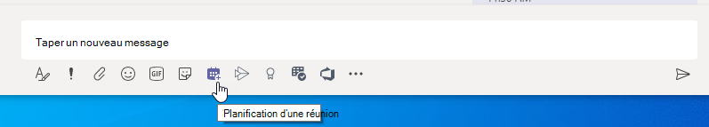

# Paramètres de stratégie de réunion : général

Cet article décrit les paramètres de stratégie généraux suivants pour les réunions Teams :

- [Se rencontrer maintenant dans les canaux](#meet-now-in-channels)
- [Complément Outlook](#outlook-add-in)
- [Planification des réunions de canal](#channel-meeting-scheduling)
- [Planification de réunions privées](#private-meeting-scheduling)
- [Se réunir maintenant dans des réunions privées](#meet-now-in-private-meetings)
- [Mode de rôle présentateur désigné](#designated-presenter-role-mode)
- [Rapport d’engagement](#engagement-report)
- [Inscription à la réunion](#meeting-registration)
- [Qui peut s’inscrire](#who-can-register)
- [Fournisseur de réunions pour le mode Îles](#meeting-provider-for-islands-mode)
- [Coach de l’orateur](#speaker-coach)

## Se rencontrer maintenant dans les canaux

Il s’agit d’une stratégie par utilisateur qui s’applique avant le début d’une réunion. Ce paramètre détermine si un utilisateur peut démarrer une réunion ad hoc dans un canal Teams. Si vous **activez** cette option, les utilisateurs peuvent cliquer sur le bouton Réunion pour démarrer une réunion ad hoc ou planifier une réunion dans le canal. La valeur par défaut est True.

## Complément Outlook

Il s’agit d’une stratégie par utilisateur qui s’applique avant le début d’une réunion. Ce paramètre détermine si les réunions Teams peuvent être planifiées à partir d’Outlook (Windows, Mac, web et mobile).

Si vous désactivez cette option, les utilisateurs ne peuvent pas planifier de réunions Teams lorsqu’ils créent une réunion dans Outlook. Par exemple, dans Outlook sur Windows, l’option **Nouvelle réunion Teams** ne s’affiche pas dans le ruban.

## Planification des réunions de canal

Utilisez la stratégie AllowChannelMeetingScheduling existante pour contrôler les types d’événements qu’il est possible de créer dans les calendriers d’équipe. Il s’agit d’une stratégie par utilisateur qui s’applique avant le début d’une réunion. Ce paramètre détermine si les utilisateurs peuvent planifier une réunion dans un canal Teams. Par défaut, ce paramètre est activé.

Si cette stratégie est désactivée, les utilisateurs ne pourront pas créer de réunions de canal. Toutefois, les réunions existantes des canaux existants peuvent être modifiées par l’organisateur de l’événement.

L’option Planifier une réunion sera désactivée.

La sélection de canal est désactivée.

Dans la page des billets de canal, les éléments suivants sont désactivés :

- Bouton **Planifier une réunion** dans la zone composer une réponse du canal.
  
  
- Bouton **planifier une réunion** sur l’en-tête de canal.
  

Dans le calendrier de canal :

- Le bouton **Ajouter un événement** dans l’en-tête du calendrier est désactivé.
  

- Les utilisateurs ne pourront pas faire glisser et sélectionner un bloc de temps dans le calendrier du canal pour créer une réunion de canal.

- Les utilisateurs ne peuvent pas utiliser les raccourcis clavier pour créer une réunion dans le calendrier du canal.

Dans le centre d’administration :

L’application Calendrier du canal s’affiche dans la section **Applications Microsoft** sur la page stratégies d’autorisation d’application.

## Planification de réunions privées

Il s’agit d’une stratégie par utilisateur qui s’applique avant le début d’une réunion. Ce paramètre détermine si les utilisateurs peuvent planifier des réunions privées en Teams. Une réunion est privée lorsque celle-ci n’est pas publiée dans un canal d’une équipe.

Notez que si vous désactivez **Autoriser la planification des réunions privées** et **Autoriser la planification des réunions de canal**, les options **Ajouter des participants obligatoires** et **Ajouter un canal** sont désactivées pour les utilisateurs dans Teams. Par défaut, ce paramètre est activé.

## Se réunir maintenant dans des réunions privées

Il s’agit d’une stratégie par utilisateur qui s’applique avant le début d’une réunion. Ce paramètre contrôle si un utilisateur peut démarrer une réunion privée ad hoc.  Par défaut, ce paramètre est activé.

## Mode de rôle présentateur désigné

Il s’agit d’une stratégie par utilisateur. Ce paramètre vous permet de modifier la valeur par défaut du paramètre **Qui peut présenter ?** dans **Options de réunion** dans le client Teams. Ce paramètre de stratégie affecte toutes les réunions, y compris les réunions Conférence maintenant.

Le paramètre **Qui peut présenter ?** permet aux organisateurs de réunions de choisir qui peuvent être présentateurs pendant une réunion. Pour plus d’informations, consulte [Modifier les paramètres des participants pour une réunion Teams](https://support.microsoft.com/article/change-participant-settings-for-a-teams-meeting-53261366-dbd5-45f9-aae9-a70e6354f88e) et [Rôles dans une réunion Teams](https://support.microsoft.com/article/roles-in-a-teams-meeting-c16fa7d0-1666-4dde-8686-0a0bfe16e019).

Pour l’instant, vous pouvez uniquement utiliser PowerShell pour configurer ce paramètre de stratégie. Vous pouvez modifier une stratégie de réunion Teams existante à l’aide de l’applet de commande [CsTeamsMeetingPolicy](/powershell/module/skype/set-csteamsmeetingpolicy) . Vous pouvez également créer une stratégie de réunion Teams à l’aide de l’applet de commande [New-CsTeamsMeetingPolicy](/powershell/module/skype/new-csteamsmeetingpolicy) et l’affecter à des utilisateurs.

Pour spécifier la valeur par défaut du paramètres **Qui peut présenter ?** dans Teams, définissez le paramètre **DesignatedPresenterRoleMode** sur l’un des éléments suivants :

- **EveryoneUserOverride**: tous les participants à la réunion peuvent être présentateurs. Ceci est la valeur par défaut. Ce paramètre correspond au paramètre **Tout le monde** dans Teams.
- **EveryoneInCompanyUserOverride** : les utilisateurs authentifiés au sein de l’organisation, y compris les utilisateurs invités, peuvent être présentateurs. Ce paramètre correspond au paramètre **Contacts dans mon organisation** dans Teams.
- **OrganizerOnlyUserOverride** : seul l’organisateur de la réunion peut être présentateur et tous les participants à la réunion sont désignés comme participants. Ce paramètre correspond au paramètre **Uniquement moi** dans Teams.

Gardez à l’esprit qu’une fois que vous avez défini la valeur par défaut, les organisateurs de réunion peuvent toujours modifier ce paramètre dans Teams et choisir les personnes pouvant présenter les réunions qu’ils planifient.

## Rapport d’engagement

Il s’agit d’une stratégie par utilisateur. Ce paramètre permet de contrôler si les organisateurs de réunion peuvent télécharger le [Rapport de participation aux réunions](teams-analytics-and-reports/meeting-attendance-report.md).

Cette stratégie est activée par défaut et permet à vos organisateurs de voir qui a inscrit et participé aux réunions et aux webinaires qu’ils ont configurés. Pour la désactiver dans le Centre d’administration Teams, accédez aux **stratégies** **réunions** >  et définissez le paramètre du **rapport Engagement** sur **Désactivé**.

Vous pouvez également modifier une stratégie de réunion Teams existante à l’aide de l’applet de commande [Set-CsTeamsMeetingPolicy](/powershell/module/skype/set-csteamsmeetingpolicy) . Vous pouvez également créer une stratégie de réunion Teams à l’aide de l’applet de commande [New-CsTeamsMeetingPolicy](/powershell/module/skype/new-csteamsmeetingpolicy) et l’affecter à des utilisateurs.

Par défaut, le paramètre **AllowEngagementReport** est défini sur **Activé** dans PowerShell. Pour empêcher un organisateur de réunion de télécharger le rapport de participation à la réunion, définissez le paramètre **AllowEngagementReport** sur **Désactivé**.

Lorsque cette stratégie est activée, l’option permettant de télécharger le rapport de participation aux réunions s’affiche dans le volet **Participants** .

> [!NOTE]
> En tant qu’administrateur, vous ne pouvez pas afficher le rapport de présence pour les réunions que vous n’organisez pas. Toutefois, vous pouvez afficher les détails des participants pour une réunion donnée dans les 24 heures suivant cette réunion. Dans le Centre d’administration Teams, accédez à **Users** > **Manage users**. Choisissez le nom complet de l’organisateur de la réunion. Sélectionnez l’onglet **Réunions & appels** , puis choisissez l’ID de réunion ou l’ID d’appel approprié. Ensuite, sélectionnez **Détails du participant**.

Pour plus d’informations, notamment les limites du rapport d’engagement, consultez [et téléchargez les rapports de participation aux réunions dans Teams](https://support.microsoft.com/office/view-and-download-meeting-attendance-reports-in-teams-ae7cf170-530c-47d3-84c1-3aedac74d310).

## Inscription à la réunion

Il s’agit d’une stratégie par utilisateur. Si vous activez cette option, les utilisateurs de votre organisation peuvent configurer des webinaires. Cette stratégie est activée par défaut.

Pour modifier cette stratégie dans le Centre d’administration Teams, accédez aux **stratégies** **réunions** > . Pour désactiver l’inscription à la réunion, **définissez** la stratégie sur Désactivé.

Vous pouvez modifier une stratégie de réunion Teams existante à l’aide de l’applet de commande [CsTeamsMeetingPolicy](/powershell/module/skype/set-csteamsmeetingpolicy) . Vous pouvez également créer une stratégie de réunion Teams à l’aide de l’applet de commande [New-CsTeamsMeetingPolicy](/powershell/module/skype/new-csteamsmeetingpolicy) et l’affecter à des utilisateurs.

Pour activer l’inscription de réunion, définissez le paramètre  **MeetingRegistration** sur **True**. Cette valeur est définie sur **True** par défaut.

Pour désactiver l’inscription de réunion et empêcher les utilisateurs de planifier des webinaires, définissez le paramètre sur **False**.

## Qui peut s’inscrire

Cette stratégie contrôle les utilisateurs qui peuvent s’inscrire et participer à des webinaires. Cette stratégie comporte deux options, qui sont disponibles uniquement si **l’inscription à la réunion** est activée.

- Définissez **Qui peut s’inscrire auprès** de **Tout le monde** si vous souhaitez autoriser tout le monde, y compris les utilisateurs anonymes, à inscrire et à participer aux webinaires que les utilisateurs de votre organisation configurent.
- Définissez **Qui peut s’inscrire auprès** de **Tout le monde dans l’organisation** si vous souhaitez autoriser uniquement les utilisateurs de votre organisation à s’inscrire et à participer aux webinaires.

Par défaut, **Qui peut s’inscrire** est défini sur **Tout le monde**. Pour modifier cette stratégie dans le Centre d’administration Teams, accédez aux **stratégies** **réunions** > .

Vous pouvez modifier une stratégie de réunion Teams existante à l’aide de l’applet de commande [CsTeamsMeetingPolicy](/powershell/module/skype/set-csteamsmeetingpolicy) . Vous pouvez également créer une stratégie de réunion Teams à l’aide de l’applet de commande [New-CsTeamsMeetingPolicy](/powershell/module/skype/new-csteamsmeetingpolicy) et l’affecter à des utilisateurs.

Pour permettre à tout le monde, y compris aux utilisateurs anonymes, d’inscrire et d’assister à des webinaires, définissez le paramètre **WhoCanRegister** sur **Tout le monde**. Cette valeur est définie sur **Tout le monde** par défaut.

Pour autoriser uniquement les utilisateurs de votre organisation à s’inscrire et à participer à des webinaires, définissez le paramètre sur **EveryoneInCompany**.

## Fournisseur de réunions pour le mode Îles

Il s’agit d’une stratégie par utilisateur. Ce paramètre détermine quel complément de réunion Outlook est utilisé pour *les utilisateurs en mode îles*. Vous pouvez spécifier si les utilisateurs peuvent utiliser uniquement le complément réunion Teams ou les deux compléments réunion et Skype® Entreprise pour planifier des réunions dans Outlook.

Vous ne pouvez appliquer cette stratégie uniquement aux utilisateurs qui sont en mode Îles et dont le paramètre **AllowOutlookAddIn** est défini sur **True** dans leur stratégie de réunion Teams.

Pour l’instant, vous pouvez uniquement utiliser PowerShell pour définir cette stratégie. Vous pouvez modifier une stratégie de réunion Teams existante à l’aide de l’applet de commande [CsTeamsMeetingPolicy](/powershell/module/skype/set-csteamsmeetingpolicy) . Vous pouvez également créer une stratégie de réunion Teams à l’aide de l’applet de commande [New-CsTeamsMeetingPolicy](/powershell/module/skype/new-csteamsmeetingpolicy) et l’affecter à des utilisateurs.

Pour spécifier le complément de la réunion que vous voulez mettre à la disposition des utilisateurs, définissez le paramètre **PreferredMeetingProviderForIslandsMode** comme suit :

- Définir le paramètre sur **TeamsAndSfB** pour activer le complément réunion Teams et Skype® Entreprise dans Outlook. Ceci est la valeur par défaut.
- Définir le paramètre sur **Teams** pour activer uniquement le complément réunion équipes dans Outlook. Ce paramètre de stratégie permet de s’assurer que toutes les réunions ultérieures ont un lien participer à une réunion Teams. Il ne migre pas les liens de jointure de réunion Skype Entreprise existants vers Teams. Ce paramètre de stratégie n’affecte pas les fonctionnalités de présence, de conversation, d’appel RTC ou d’autres fonctionnalités de Skype Entreprise, ce qui signifie que les utilisateurs continueront à utiliser Skype Entreprise pour ces fonctionnalités.

  Si vous avez défini le paramètre sur **Teams**, puis revenez à **TeamsAndSfB**, les deux compléments de réunion sont activés. Cependant, notez que les liens de réunion Teams existants ne seront pas migrés vers Skype Entreprise. Seules les réunions Skype Entreprise planifiées après la modification auront un lien de jointure de réunion Skype Entreprise.

## Réactions aux réunions
La disponibilité des réactions de réunion peut être configurée via l’interface du Centre d’administration Teams ou à l’aide de PowerShell. Les réactions aux réunions peuvent être activées ou désactivées dans la section **Participants & invités** d’une stratégie de réunion.

Pour configurer le paramètre, utilisez l’applet de commande Set-CsTeamsMeetingPolicy. Ce paramètre est activé par défaut. Pour la désactiver, définissez **AllowMeetingReactions** sur **False**.

Les réactions pendant les réunions sont désactivées par défaut. La désactivation des réactions pour un utilisateur ne signifie pas qu’il ne peut pas utiliser les réactions dans les réunions qu’il planifie. L’organisateur de la réunion peut toujours activer les réactions à partir de la page des options de réunion, quel que soit le paramètre par défaut.

## Coach de l’orateur

Ce paramètre permet aux utilisateurs d’activer Speaker Coach pendant une réunion Teams. Speaker Coach écoute l’audio de l’utilisateur pendant qu’il présente et fournit des commentaires en temps réel privés et des suggestions d’amélioration. L’utilisateur obtient également un rapport récapitulatif de ses commentaires après la réunion.

> [!NOTE]
> L’utilisateur qui a activé l’entraîneur de l’orateur pendant la réunion est le seul à pouvoir voir le rapport récapitulatif des commentaires. Les administrateurs n’ont accès à aucune de ces données.

Actuellement, vous ne pouvez définir et modifier cette stratégie que dans PowerShell. à l’aide de l’applet de commande [Set-CsTeamsMeetingPolicy](/powershell/module/skype/set-csteamsmeetingpolicy) . Vous pouvez également créer une stratégie de réunion Teams à l’aide de l’applet de commande [New-CsTeamsMeetingPolicy](/powershell/module/skype/new-csteamsmeetingpolicy) et l’affecter à des utilisateurs.

Ce paramètre est activé par défaut. Pour la désactiver, définissez **AllowMeetingCoach** sur **False**.

## Sujets associés

- [Présentation de Teams PowerShell](teams-powershell-overview.md)
- [Affecter des stratégies dans Teams](policy-assignment-overview.md)
- [Supprimer la stratégie de réunion Teams RestrictedAnonymousAccess des utilisateurs](meeting-policies-restricted-anonymous-access.md)
