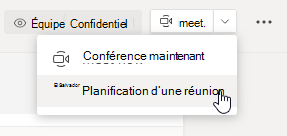

# Paramètres de stratégie de réunion : généralMeeting policy settings - General

Cet article décrit les paramètres de stratégie générale suivants pour les réunions Teams :This article describes the following general policy settings for Teams meetings:

- [Autoriser la conférence maintenant dans les canauxAllow Meet now in channels](#allow-meet-now-in-channels)
- [Autoriser le complément OutlookAllow the Outlook add-in](#allow-the-outlook-add-in)
- [Autoriser la planification des réunions pour les canauxAllow channel meeting scheduling](#allow-channel-meeting-scheduling)
- [Autoriser la planification des réunions privéesAllow scheduling private meetings](#allow-scheduling-private-meetings)
- [Autoriser la conférence maintenant dans les réunions privéesAllow Meet now in private meetings](#allow-meet-now-in-private-meetings)
- [Mode de rôle de présentateur désignéDesignated presenter role mode](#designated-presenter-role-mode)
- [Rapport de présence aux réunionsMeeting attendance report](#meeting-attendance-report)
- [Fournisseur de réunion pour le mode IslandsMeeting provider for Islands mode](#meeting-provider-for-islands-mode)

## Autoriser la conférence maintenant dans les canauxAllow Meet now in channels

Il s’agit d’une stratégie par utilisateur qui s’applique avant le début d’une réunion.This is a per-user policy and applies before a meeting starts. Ce paramètre contrôle si un utilisateur peut démarrer une réunion ad hoc dans un canal Teams.This setting controls whether a user can start an ad hoc meeting in a Teams channel. Si vous l’activer, les  utilisateurs peuvent cliquer sur le bouton Réunion pour démarrer une réunion ad hoc ou planifier une réunion dans le canal.If you turn this on, users can click the **Meet** button to start an ad hoc meeting or schedule a meeting in the channel. La valeur par défaut est True.The default value is True.

## Autoriser le complément OutlookAllow the Outlook add-in

Il s’agit d’une stratégie par utilisateur qui s’applique avant le début d’une réunion.This is a per-user policy and applies before a meeting starts. Ce paramètre détermine si les réunions Teams peuvent être planifiées à partir d’Outlook (Windows, Mac, web et mobile).This setting controls whether Teams meetings can be scheduled from within Outlook (Windows, Mac, web, and mobile).

Si vous la désactiver, les utilisateurs ne peuvent pas planifier de réunions Teams lorsqu’ils créent une réunion dans Outlook.If you turn this off, users are unable to schedule Teams meetings when they create a new meeting in Outlook. Par exemple, dans Outlook sur Windows, l’option **Nouvelle réunion Teams** ne s’affiche pas dans le ruban.For example, in Outlook on Windows, the **New Teams Meeting** option won't show up in the ribbon.

## Autoriser la planification des réunions pour les canauxAllow channel meeting scheduling

Utilisez la stratégie AllowChannelMeetingScheduling existante pour contrôler les types d’événements qu’il est possible de créer dans les calendriers d’équipe.Use the existing AllowChannelMeetingScheduling policy to control the types of events that can be created on the team channel calendars. Il s’agit d’une stratégie par utilisateur qui s’applique avant le début d’une réunion.This is a per-user policy and applies before a meeting starts. Ce paramètre détermine si les utilisateurs peuvent planifier une réunion dans un canal Teams.This setting controls whether users can schedule a meeting in a Teams channel. Par défaut, ce paramètre est activé.By default, this setting is turned on. 

Si cette stratégie est désactivée, les utilisateurs ne pourront pas créer de réunions de canal.If this policy is turned off, users will not be able to create new channel meetings. Toutefois, les réunions existantes des canaux existants peuvent être modifiées par l’organisateur de l’événement.However, existing channel meetings can be edited by the organizer of the event.

L’option Planifier une réunion sera désactivée.Schedule a meeting will be disabled.

La sélection de canal est désactivée.Channel selection is disabled.

Dans la page de billets du canal, les messages suivants sont désactivés :In the channel posts page, the following will be disabled:

- Bouton **Planifier une réunion** dans la zone composer une réponse du canal.**Schedule a meeting** button on the channel reply compose box.
  
  
- Bouton **planifier une réunion** dans l’en-tête de canal.**Schedule a meeting** button on the channel header.
  

Dans le calendrier de canal :In the channel calendar:

- Le bouton **Ajouter un événement** dans l’en-tête du calendrier est désactivé.**Add new event** button on channel calendar header will be disabled.
  

- Les utilisateurs ne peuvent pas faire glisser et sélectionner un bloc de temps dans le calendrier du canal pour créer une réunion de canal.Users will not be able to drag and select a time block on the channel calendar to create a channel meeting.

- Les utilisateurs ne peuvent pas utiliser les raccourcis clavier pour créer une réunion dans le calendrier du canal.Users cannot use Keyboard shortcuts to create a meeting on the channel calendar.

Dans le centre d’administration :In the admin center:

L’application Calendrier du canal s’affiche dans la section **Applications Microsoft** sur la page stratégies d’autorisation d’application.The channel calendar app will show up in the **Microsoft apps** section on the app permission policies page.

## Autoriser la planification des réunions privéesAllow scheduling private meetings

Il s’agit d’une stratégie par utilisateur qui s’applique avant le début d’une réunion.This is a per-user policy and applies before a meeting starts. Ce paramètre détermine si les utilisateurs peuvent planifier des réunions privées en Teams.This setting controls whether users can schedule private meetings in Teams. Une réunion est privée lorsque celle-ci n’est pas publiée dans un canal d’une équipe.A meeting is private when it's not published to a channel in a team.

Notez que si vous désactivez **Autoriser la planification des réunions privées** et **Autoriser la planification des réunions de canal**, les options **Ajouter des participants obligatoires** et **Ajouter un canal** sont désactivées pour les utilisateurs dans Teams.Note that if you turn off **Allow scheduling private meetings** and **Allow channel meeting scheduling**,  the **Add required attendees** and **Add channel** options are disabled for users in Teams. Par défaut, ce paramètre est activé.By default, this setting is turned on.

## Autoriser la Conférence maintenant dans les réunions privéesAllow Meet now in private meetings

Il s’agit d’une stratégie par utilisateur qui s’applique avant le début d’une réunion.This is a per-user policy and applies before a meeting starts. Ce paramètre contrôle si un utilisateur peut commencer une réunion privée ad hoc.This setting controls whether a user can start an ad hoc private meeting.  Par défaut, ce paramètre est activé.By default, this setting is turned on.

## Mode de rôle de présentateur désignéDesignated presenter role mode

Il s’agit d’une stratégie par utilisateur.This is a per-user policy. Ce paramètre vous permet de modifier la valeur par défaut du paramètre **Qui peut présenter ?** dans **Options de réunion** dans le client Teams.This setting lets you change the default value of the **Who can present?** setting in **Meeting options** in the Teams client. Ce paramètre de stratégie affecte toutes les réunions, y compris les réunions Conférence maintenant.This policy setting affects all meetings, including Meet Now meetings.

Le paramètre **Qui peut présenter ?** permet aux organisateurs de réunions de choisir qui peuvent être présentateurs pendant une réunion.The **Who can present?** setting lets meeting organizers choose who can be presenters in a meeting. Pour plus d’informations, consulte [Modifier les paramètres des participants pour une réunion Teams](https://support.microsoft.com/article/change-participant-settings-for-a-teams-meeting-53261366-dbd5-45f9-aae9-a70e6354f88e) et [Rôles dans une réunion Teams](https://support.microsoft.com/article/roles-in-a-teams-meeting-c16fa7d0-1666-4dde-8686-0a0bfe16e019).To learn more, see [Change participant settings for a Teams meeting](https://support.microsoft.com/article/change-participant-settings-for-a-teams-meeting-53261366-dbd5-45f9-aae9-a70e6354f88e) and [Roles in a Teams meeting](https://support.microsoft.com/article/roles-in-a-teams-meeting-c16fa7d0-1666-4dde-8686-0a0bfe16e019).

Pour l’instant, vous pouvez uniquement utiliser PowerShell pour configurer ce paramètre de stratégie.Currently, you can only use PowerShell to configure this policy setting. Vous pouvez modifier une stratégie de réunion Teams existante à l’aide de l’applet de commande [CsTeamsMeetingPolicy](https://docs.microsoft.com/powershell/module/skype/set-csteamsmeetingpolicy) .You can edit an existing Teams meeting policy by using the [Set-CsTeamsMeetingPolicy](https://docs.microsoft.com/powershell/module/skype/set-csteamsmeetingpolicy) cmdlet. Vous pouvez également créer une stratégie de réunion Teams à l’aide de l’applet de commande [New-CsTeamsMeetingPolicy](https://docs.microsoft.com/powershell/module/skype/new-csteamsmeetingpolicy) et l’affecter à des utilisateurs.Or, create a new Teams meeting policy by using the [New-CsTeamsMeetingPolicy](https://docs.microsoft.com/powershell/module/skype/new-csteamsmeetingpolicy) cmdlet and assign it to users.

Pour spécifier la valeur par défaut du paramètres **Qui peut présenter ?** dans Teams, définissez le paramètre **DesignatedPresenterRoleMode** sur l’un des éléments suivants :To specify the default value of the **Who can present?** setting in Teams, set the **DesignatedPresenterRoleMode** parameter to one of the following:

- **EveryoneUserOverride**: tous les participants à la réunion peuvent être présentateurs.**EveryoneUserOverride**:  All meeting participants can be presenters. Ceci est la valeur par défaut.This is the default value. Ce paramètre correspond au paramètre **Tout le monde** dans Teams.This parameter corresponds to the **Everyone** setting in Teams.
- **EveryoneInCompanyUserOverride** : les utilisateurs authentifiés au sein de l’organisation, y compris les utilisateurs invités, peuvent être présentateurs.**EveryoneInCompanyUserOverride**: Authenticated users in the organization, including guest users, can be presenters. Ce paramètre correspond au paramètre **Contacts dans mon organisation** dans Teams.This parameter corresponds to the **People in my organization** setting in Teams.
- **OrganizerOnlyUserOverride** : seul l’organisateur de la réunion peut être présentateur et tous les participants à la réunion sont désignés comme participants.**OrganizerOnlyUserOverride**: Only the meeting organizer can be a presenter and all meeting participants are designated as attendees. Ce paramètre correspond au paramètre **Uniquement moi** dans Teams.This parameter corresponds to the **Only me** setting in Teams.

Gardez à l’esprit qu’une fois que vous avez défini la valeur par défaut, les organisateurs de réunion peuvent toujours modifier ce paramètre dans Teams et choisir les personnes pouvant présenter les réunions qu’ils planifient.Keep in mind that after you set the default value, meeting organizers can still change this setting in Teams and choose who can present in the meetings that they schedule.

## Rapport de présence aux réunionsMeeting attendance report

Il s’agit d’une stratégie par utilisateur.This is a per-user policy. Ce paramètre permet de contrôler si les organisateurs de réunion peuvent télécharger le [Rapport de participation aux réunions](teams-analytics-and-reports/meeting-attendance-report.md).This setting controls whether meeting organizers can download the [meeting attendance report](teams-analytics-and-reports/meeting-attendance-report.md).

Pour l’instant, vous pouvez uniquement utiliser PowerShell pour configurer ce paramètre de stratégie.Currently, you can only use PowerShell to configure this policy setting. Vous pouvez modifier une stratégie de réunion Teams existante à l’aide de l’applet de commande [CsTeamsMeetingPolicy](https://docs.microsoft.com/powershell/module/skype/set-csteamsmeetingpolicy) .You can edit an existing Teams meeting policy by using the [Set-CsTeamsMeetingPolicy](https://docs.microsoft.com/powershell/module/skype/set-csteamsmeetingpolicy) cmdlet. Vous pouvez également créer une stratégie de réunion Teams à l’aide de l’applet de commande [New-CsTeamsMeetingPolicy](https://docs.microsoft.com/powershell/module/skype/new-csteamsmeetingpolicy) et l’affecter à des utilisateurs.Or, create a new Teams meeting policy by using the [New-CsTeamsMeetingPolicy](https://docs.microsoft.com/powershell/module/skype/new-csteamsmeetingpolicy) cmdlet and assign it to users.

Pour permettre à un organisateur de la réunion de télécharger le rapport participation à une réunion, définissez le paramètre **AllowEngagementReport** sur **Activé**.To enable a meeting organizer to download the meeting attendance report, set the **AllowEngagementReport** parameter  to **Enabled**. Lorsque cette option est activée, l’option permettant de télécharger le rapport est affichée dans le volet **Participants**.When enabled, the option to download the report is displayed in the **Participants** pane.

Pour empêcher un organisateur de la réunion de télécharger le rapport, définissez le paramètre sur **Désactivé**.To prevent a meeting organizer from downloading the report, set the parameter to **Disabled**. Par défaut, ce paramètre est désactivé, et l’option de téléchargement du rapport n’est pas disponible.By default, this setting is disabled and the option to download the report isn't available.

## Fournisseur de réunion pour le mode IslandsMeeting provider for Islands mode

Il s’agit d’une stratégie par utilisateur.This is a per-user policy. Ce paramètre détermine quel complément de réunion Outlook est utilisé pour *les utilisateurs en mode îles*.This setting controls which Outlook meeting add-in is used for *users who are in Islands mode*. Vous pouvez spécifier si les utilisateurs peuvent utiliser uniquement le complément réunion Teams ou les deux compléments réunion et Skype® Entreprise pour planifier des réunions dans Outlook.You can specify whether users can only use the Teams Meeting add-in or both the Teams Meeting and Skype for Business Meeting add-ins to schedule meetings in Outlook.

Vous ne pouvez appliquer cette stratégie uniquement aux utilisateurs qui sont en mode Îles et dont le paramètre **AllowOutlookAddIn** est défini sur **True** dans leur stratégie de réunion Teams.You can only apply this policy to users who are in Islands mode and have the **AllowOutlookAddIn** parameter set to **True** in their Teams meeting policy.

Pour l’instant, vous pouvez uniquement utiliser PowerShell pour définir cette stratégie.Currently, you can only use PowerShell to set this policy. Vous pouvez modifier une stratégie de réunion Teams existante à l’aide de l’applet de commande [CsTeamsMeetingPolicy](https://docs.microsoft.com/powershell/module/skype/set-csteamsmeetingpolicy) .You can edit an existing Teams meeting policy by using the [Set-CsTeamsMeetingPolicy](https://docs.microsoft.com/powershell/module/skype/set-csteamsmeetingpolicy) cmdlet. Vous pouvez également créer une stratégie de réunion Teams à l’aide de l’applet de commande [New-CsTeamsMeetingPolicy](https://docs.microsoft.com/powershell/module/skype/new-csteamsmeetingpolicy) et l’affecter à des utilisateurs.Or, create a new Teams meeting policy by using the [New-CsTeamsMeetingPolicy](https://docs.microsoft.com/powershell/module/skype/new-csteamsmeetingpolicy) cmdlet and assign it to users.

Pour spécifier le complément de la réunion que vous voulez mettre à la disposition des utilisateurs, définissez le paramètre **PreferredMeetingProviderForIslandsMode** comme suit :To specify which meeting add-in you want to be available to users, set the **PreferredMeetingProviderForIslandsMode** parameter as follows:

- Définir le paramètre sur **TeamsAndSfB** pour activer le complément réunion Teams et Skype® Entreprise dans Outlook.Set the parameter to **TeamsAndSfB** to enable both the Teams Meeting add-in and Skype for Business add-in in Outlook. Ceci est la valeur par défaut.This is the default value.
- Définir le paramètre sur **Teams** pour activer uniquement le complément réunion équipes dans Outlook.Set the parameter to **Teams** to enable only the Teams Meeting add-in in Outlook. Ce paramètre de stratégie permet de s’assurer que toutes les réunions ultérieures ont un lien participer à une réunion Teams.This policy setting ensures that all future meetings have a Teams meeting join link. Il ne migre pas les liens de jointure de réunion Skype Entreprise existants vers Teams.It doesn't migrate existing Skype for Business meeting join links to Teams. Ce paramètre de stratégie n’affecte pas les fonctionnalités de présence, de conversation, d’appel RTC ou d’autres fonctionnalités de Skype Entreprise, ce qui signifie que les utilisateurs continueront à utiliser Skype Entreprise pour ces fonctionnalités.This policy setting doesn't affect presence, chat, PSTN calling, or any other capabilities in Skype for Business, which means that users will continue to use Skype for Business for these capabilities.

  Si vous avez défini le paramètre sur **Teams**, puis revenez à **TeamsAndSfB**, les deux compléments de réunion sont activés.If you set the parameter to **Teams**, and then switch back to **TeamsAndSfB**, both meeting add-ins are enabled. Cependant, notez que les liens de réunion Teams existants ne seront pas migrés vers Skype Entreprise.However, note that existing Teams meeting join links won't be migrated to Skype for Business. Seules les réunions Skype Entreprise planifiées après la modification auront un lien de jointure de réunion Skype Entreprise.Only Skype for Business meetings scheduled after the change will have a Skype for Business meeting join link.

## Réactions aux réunionsMeeting reactions

Le paramètre AllowMeetingReactions ne peut être appliqué qu’à l’aide de PowerShell.The AllowMeetingReactions setting can only be applied using PowerShell. Il n’existe aucune option permettant d’option Permettant d’autoriserMeetingReactions d’être ou non disponible à partir du Centre d’administration Teams.There is no option to toggle AllowMeetingReactions on or off from the Teams admin center.

Par défaut, les réactions aux réunions sont off.Meeting reactions are Off by default. La non-utilisation des réactions d’un utilisateur ne signifie pas qu’il ne peut pas utiliser les réactions dans les réunions qu’il programme.Turning off reactions for a user doesn't mean that a user can't use reactions in meetings they schedule. L’organisateur de la réunion peut toujours activer les réactions à partir de la page d’option de la réunion, quel que soit le paramètre par défaut.The meeting organizer can still turn on reactions from the meeting option page, regardless of the default setting.

## Sujets associésRelated topics

- [Présentation de Teams PowerShellTeams PowerShell overview](teams-powershell-overview.md)
- [Attribuer des stratégies à vos utilisateursAssign policies to your users in Teams](assign-policies.md)
- [Supprimer la stratégie de réunion Teams RestrictedAnonymousAccess des utilisateursRemove the RestrictedAnonymousAccess Teams meeting policy from users](meeting-policies-restricted-anonymous-access.md)
