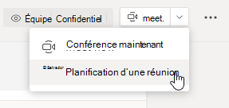
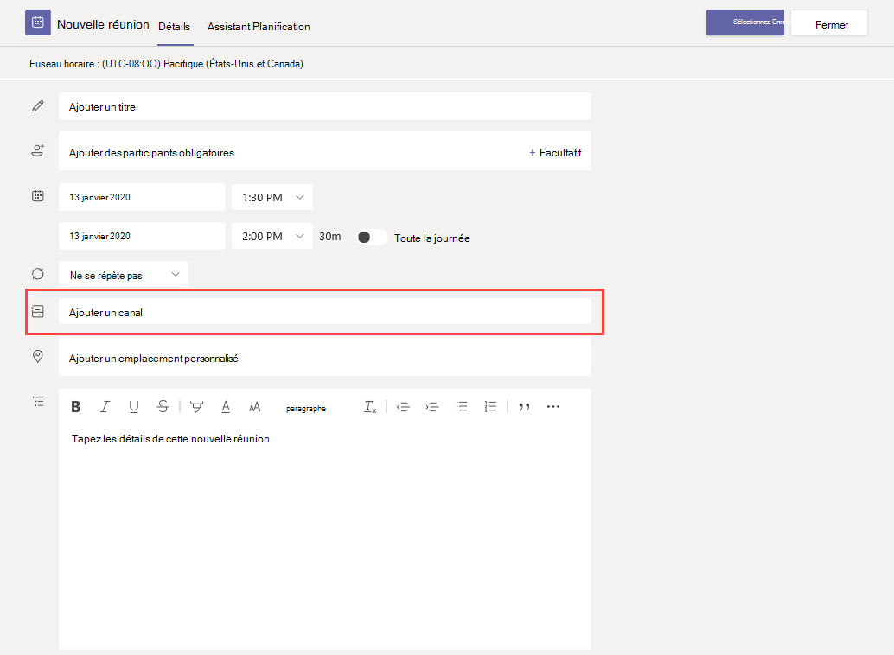
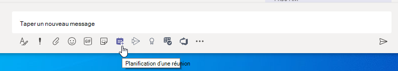
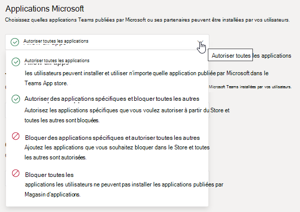
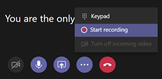
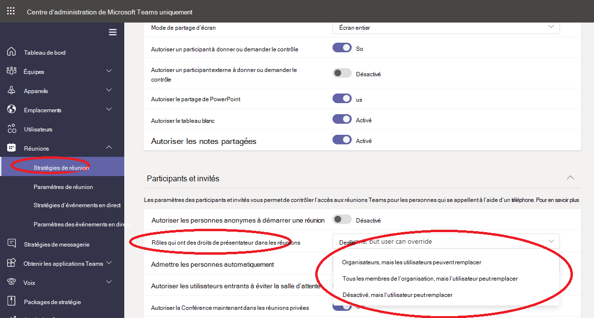

# Gérer les stratégies de réunion dans Teams

::: zone target="docs"
Utilisez les stratégies de réunion pour contrôler les fonctionnalités disponibles pour les participants à la réunion pour les réunions planifiées par les utilisateurs de votre organisation. Vous pouvez utiliser la stratégie globale (par défaut à l’échelle de l’organisation) qui est créée automatiquement ou créer et affecter de stratégies personnalisées. Vous pouvez gérer les stratégies de réunion dans le Centre d’administration Microsoft Teams ou à l’aide de [PowerShell](teams-powershell-overview.md).

> [!NOTE]
> Pour plus d’informations sur l’utilisation de rôles pour gérer les autorisations des présentateurs et des participants à une réunion, consultez [Rôles dans une réunion Teams](https://support.microsoft.com/office/roles-in-a-teams-meeting-c16fa7d0-1666-4dde-8686-0a0bfe16e019?ui=en-us&rs=en-us&ad=us).

Vous pouvez implémenter des stratégies de plusieurs manières, ce qui affecte l’expérience de réunion pour les utilisateurs avant le début d’une réunion, pendant une réunion ou après une réunion.

|Type d’implémentation  |Description  |
|---------|---------|
|Par organisateur    |Lorsque vous appliquez une stratégie par organisateur, tous les participants à la réunion héritent de la stratégie de l’organisateur. Par exemple, **Admettre les participants automatiquement** est une stratégie par organisateur. Elle permet de déterminer si les utilisateurs rejoignent directement la réunion ou attendent dans la salle d’attente pour les réunions planifiées par l’utilisateur auquel la stratégie est attribuée.          |
|Par utilisateur    |Lorsque vous appliquez une stratégie par utilisateur, seule la stratégie par utilisateur s’applique pour restreindre certaines fonctionnalités pour l’organisateur et/ou les participants à la réunion. Par exemple, le paramètre **Autoriser la conférence maintenant dans les canaux** est une stratégie par utilisateur.     |
|Par organisateur et par utilisateur     |Lorsque vous appliquez une combinaison d’une stratégie par organisateur et par utilisateur, certaines fonctionnalités sont limitées aux participants à la réunion en fonction de leur stratégie et celle de l’organisateur. Par exemple, le paramètre **Autoriser l’enregistrement dans le Cloud** est une stratégie par organisateur et par utilisateur. Activez ce paramètre pour autoriser les utilisateurs à démarrer et arrêter un enregistrement.

Vous pouvez modifier les paramètres dans la stratégie globale ou créer et affecter une ou plusieurs stratégies personnalisées. Les utilisateurs recevront automatiquement la stratégie par défaut, sauf si vous créez et leur attribuez une stratégie personnalisée.

> [!NOTE]
> Le bouton Détails de la réunion est disponible si un utilisateur dispose des licences d’audioconférence activées, ou si l’utilisateur autorise l’audioconférence, si ce n’est pas le cas, les détails de la réunion ne sont pas disponibles.

## Créer une stratégie de réunion personnalisée

1. Dans le volet de navigation gauche du centre d’administration Microsoft Teams, accédez aux **Réunions** > **Stratégies de réunion**.
2. Sélectionnez **Ajouter**.
3. Entrez un nom pour votre stratégie, ainsi qu’une description. Le nom ne peut pas contenir de caractères spéciaux et ne doit pas dépasser 64 caractères.
4. Sélectionnez les paramètres de votre choix.
5. Sélectionnez **Enregistrer**.

Par exemple, imaginons que vous avez un grand nombre d’utilisateurs et que vous voulez limiter la quantité de bande passante requise par la réunion. Vous devez créer une stratégie personnalisée nommée « bande passante limitée » et désactiver les paramètres suivants :

Sous **Audio & vidéo** :

- Désactivez l’option Autoriser l’enregistrement Cloud.
- Désactivez Autoriser la vidéo IP.

Sous **Partage de contenu** :

- Désactiver le mode de partage d’écran.
- Désactivez  Autoriser le tableau blanc.
- Désactivez Autoriser les notes partagées.

Vous pouvez ensuite attribuer la stratégie aux utilisateurs.

## Modifier une stratégie de réunion

Vous pouvez modifier la stratégie globale et les stratégies personnalisées que vous créez.

1. Dans le volet de navigation gauche du centre d’administration Microsoft Teams, accédez aux **Réunions** > **Stratégies de réunion**.
2. Sélectionnez la stratégie en cliquant à gauche du nom de celle-ci, puis sélectionnez **Modifier**.
3. À partir de là, apportez les modifications souhaitées.
4. Sélectionnez **Enregistrer**.

> [!NOTE]
> Un utilisateur ne peut être affecté qu’à une stratégie de réunion à la fois.

## Affecter une stratégie de réunion aux utilisateurs

[!INCLUDE [assign-policy](includes/assign-policy.md)]

> [!NOTE]
> Vous ne pouvez pas supprimer une stratégie qui est attribuée à des utilisateurs. Vous devez d'abord attribuer une autre stratégie à tous les utilisateurs concernés, puis supprimer la stratégie d’origine.

## Paramètres de stratégie de réunion

Sélectionnez une stratégie existante dans la page **Stratégies de réunion** ou sélectionnez **Ajouter** pour ajouter une nouvelle stratégie. Configurez les paramètres pour les éléments suivants.

- [Général](#meeting-policy-settings---general)
- [Vidéo et audio](#meeting-policy-settings---audio--video)
- [Partage de contenu](#meeting-policy-settings---content-sharing)
- [Participants et invités](#meeting-policy-settings---participants--guests)

::: zone-end

## Paramètres de stratégie de réunion : général

- [Autoriser la conférence maintenant dans les canaux](#allow-meet-now-in-channels)
- [Autoriser le complément Outlook](#allow-the-outlook-add-in)
- [Autoriser la planification des réunions pour les canaux](#allow-channel-meeting-scheduling)
- [Autoriser la planification des réunions privées](#allow-scheduling-private-meetings)
- [Autoriser la conférence maintenant dans les réunions privées](#allow-meet-now-in-private-meetings)

### Autoriser la conférence maintenant dans les canaux

Autoriser **Conférence maintenant** est une stratégie par utilisateur et s’applique avant le début d’une réunion. Ce paramètre détermine si un utilisateur peut démarrer une réunion non planifiée dans un canal Teams. Si vous activez ce paramètre, les utilisateurs peuvent sélectionner le bouton **Réunions** pour démarrer une réunion non planifiée ou pour planifier une réunion dans le canal. La valeur par défaut est True.

### Autoriser le complément Outlook

Autoriser le complément Outlook est une stratégie par utilisateur qui s’applique avant le début d’une réunion. Ce paramètre détermine si les réunions Teams peuvent être planifiées à partir d’Outlook (Windows, Mac, web et mobile).

Si vous désactivez cette fonctionnalité, les utilisateurs ne peuvent pas planifier de réunions. Réunions Teams lorsqu’ils créent une réunion dans Outlook. Par exemple, dans Outlook sur Windows, l’option **Nouvelle réunion Teams** ne s’affiche pas dans le ruban.

### Autoriser la planification des réunions pour les canaux

Utilisez la stratégie AllowChannelMeetingScheduling existante pour contrôler les types d’événements qu’il est possible de créer dans les calendriers d’équipe. Il s’agit d’une stratégie par utilisateur qui s’applique avant le début d’une réunion. Ce paramètre détermine si les utilisateurs peuvent planifier une réunion dans un canal Teams. Par défaut, ce paramètre est activé.

Si cette stratégie est désactivée, les utilisateurs ne peuvent pas créer de réunions de canal. Toutefois, les réunions existantes des canaux existants peuvent être modifiées par l’organisateur de l’événement.

L’option Planifier une réunion sera désactivée.

 

La sélection de canal est désactivée.

Dans la page billets de canal, les fonctionnalités suivantes seront désactivées :

- Bouton **Planifier une réunion** dans la zone composer une réponse du canal.
  
  
- Bouton **planifier une réunion** sur l’en-tête de canal.
  

Dans le calendrier de canal :

- Le bouton **Ajouter un événement** dans l’en-tête du calendrier est désactivé.
  

- Les utilisateurs ne peuvent pas faire glisser et sélectionner un bloc horaire sur le calendrier du canal pour créer une réunion de canal.

- Les utilisateurs ne peuvent pas utiliser les raccourcis clavier pour créer une réunion dans le calendrier par canal.

Dans le centre d’administration :

L’application Calendrier du canal s’affiche dans la section **Applications Microsoft** sur la page stratégies d’autorisation d’application.

 

### Autoriser la planification des réunions privées

La planification de réunions privées est une stratégie par utilisateur qui s’applique avant le début d’une réunion. Ce paramètre détermine si les utilisateurs peuvent planifier des réunions privées en Teams. Une réunion est privée lorsque celle-ci n’est pas publiée dans un canal d’une équipe.

Si vous désactivez les paramètres **Autoriser la planification de réunions privées** et **Autoriser la planification de réunions de canal**, les options **Ajouter les participants obligatoires** et **Ajouter un canal** sont désactivées pour les utilisateurs dans Teams. Par défaut, ce paramètre est activé.

### Autoriser la Conférence maintenant dans les réunions privées

Il s’agit d’une stratégie par utilisateur qui s’applique avant le début d’une réunion. Ce paramètre détermine si un utilisateur peut démarrer une réunion privée non planifiée. Par défaut, ce paramètre est activé.

## Paramètres de stratégie de réunion : Audio et vidéo

- [Autoriser la transcription](#allow-transcription)
- [Autoriser l’enregistrement dans le cloud](#allow-cloud-recording)
- [Mode pour l’audio sur IP](#mode-for-ip-audio)
- [Mode pour la vidéo sur IP](#mode-for-ip-video)
- [Autoriser la vidéo sur IP](#allow-ip-video)
- [Vitesse de transmission du média (Ko)](#media-bit-rate-kbs)

### Autoriser la transcription

Cette stratégie active la transcription en direct. Autoriser la transcription est une stratégie par utilisateur. Ce paramètre détermine si cette réunion d’équipe spécifique peut être transcrite.

La transcription en direct affiche la conversion de parole en texte du contenu parlé lors d’une réunion Teams presque en temps réel. Le texte apparaît à côté de la vidéo de la réunion, et inclut le nom de l’orateur et un horodatage. Pour en savoir plus, consultez l’article [Afficher la transcription en direct dans une réunion Teams](https://support.microsoft.com/office/view-live-transcription-in-a-teams-meeting-dc1a8f23-2e20-4684-885e-2152e06a4a8b).

Pour le moment, la transcription en direct est prise en charge sur le client de bureau Teams. La transcription est prise en charge pour l’anglais américain parlé. La transcription est disponible après la réunion sur la version de bureau ou web de Teams.

Voici comment les paramètres de stratégie **Autoriser la transcription** et **Autoriser l’enregistrement dans le cloud** fonctionnent ensemble. Le tableau suivant décrit les valeurs de ces paramètres et le comportement de la réunion.

|Autoriser la transcription|Autoriser l’enregistrement dans le cloud|Comportement|
|---------|---------|---------|
|**Activé**|**Activé**|L’option **Démarrer la transcription** est disponible dans les réunions Teams. L’organisateur ou les participants à la réunion peuvent démarrer et arrêter la transcription. L’option **Démarrer l’enregistrement** est disponible dans les réunions Teams. L’organisateur ou les participants à la réunion peuvent démarrer et arrêter l’enregistrement. |
|**Activé**|**Désactivé**|L’option **Démarrer la transcription** est disponible dans les réunions Teams. L’option **Démarrer l’enregistrement** n’est pas disponible dans les réunions Teams. |
|**Désactivé**|**Activé**|L’option **Démarrer l’enregistrement** est disponible dans les réunions Teams. L’option **Démarrer la transcription** n’est pas disponible dans les réunions Teams.|
|**Désactivé**|**Désactivé**|L’enregistrement et la transcription ne sont pas disponibles dans les réunions Teams.  |

### Autoriser l’enregistrement dans le cloud

Autoriser l’enregistrement dans le cloud est contrôlé par une stratégie par utilisateur. Ce paramètre détermine si un utilisateur peut effectuer un enregistrement. L’enregistrement peut être démarré par l’organisateur ou par un autre participant à la réunion si le paramètre de stratégie spécifique est activé pour le participant et s’il s’agit d’un utilisateur authentifié appartenant à la même organisation que l’organisateur.

Les personnes extérieures à votre organisation, telles que les utilisateurs fédérés et anonymes, ne peuvent pas démarrer l’enregistrement. Les utilisateurs invités ne peuvent ni démarrer ni arrêter l’enregistrement.

Pour en savoir plus sur l’enregistrement de réunions cloud, consultez [Enregistrement de réunion cloud Teams](cloud-recording.md).

### Mode pour l’audio sur IP

Le mode pour l’audio sur IP est une stratégie par utilisateur. Ce paramètre détermine si l’audio peut être activé pendant les réunions et les appels de groupe. Voici les valeurs de ce paramètre.

|Valeur du paramètre |Comportement  |
|---------|---------|
|**Audio sortant et entrant activé**    |Les éléments audio entrants et sortants sont autorisés pendant la réunion. Il s’agit du paramètre par défaut. |
|**Désactivé**     |Les éléments audio entrants et sortants sont désactivés pendant la réunion.     |

Si le paramètre est défini sur **Désactivé** pour un utilisateur, celui-ci peut toujours planifier et organiser des réunions, mais il ne peut pas utiliser l’audio. Pour participer à une réunion, l’utilisateur doit se connecter via le réseau téléphonique commuté public (PSTN) ou être invité à la réunion pour joindre l’utilisateur par téléphone. Les participants à la réunion qui n’ont pas de stratégie attribuée (par exemple, les participants anonymes) ont ce paramètre sur **Audio sortant et entrant activé** par défaut. Sur les clients mobiles de Teams, si ce paramètre est désactivé, l'utilisateur doit se connecter à la réunion via le RTPC.

Ce paramètre ne s’applique pas aux appels en tête en tête. Pour restreindre les appels en tête à tête, configurez une [stratégie d'appel](teams-calling-policy.md) Teams et désactivez le paramètre **Passer des appels privés** . Ce paramètre ne s’applique pas non plus aux appareils de salle de conférence tels que les appareils Surface Hub et salle Microsoft Teams.

Ce paramètre n’est pas encore disponible pour les environnements Microsoft 365 Cloud de la communauté du secteur public(GCC), GCC High ou Department of Defense (DoD).

Pour plus d’informations, consultez [Gérer l’audio/vidéo pour les participants à la réunion](#manage-audiovideo-for-meeting-participants).

### Mode pour la vidéo sur IP

Le mode pour la vidéo sur IP est une stratégie par utilisateur. Ce paramètre détermine si la vidéo peut être activée pendant les réunions et les appels de groupe. Voici les valeurs de ce paramètre.

|Valeur du paramètre |Comportement  |
|---------|---------|
|**Vidéo sortante et entrante activée**    | Le paramètre Les éléments vidéo entrants et sortants sont autorisés pendant la réunion est le paramètre par défaut. |
|**Désactivé**     | Les éléments vidéio entrants et sortants sont désactivés pendant la réunion. Sur les clients mobiles Teams, les utilisateurs ne peuvent pas partager de vidéos ou de photos pendant la réunion.   Si le **Mode pour l’audio sur IP** est désactivé, alors le **Mode pour la vidéo sur IP** reste également désactivé.  |

Si défini sur **désactivé** pour un utilisateur, cet utilisateur ne peut pas activer la vidéo ni afficher les vidéos partagées par les autres participants à la réunion. Les participants à la réunion qui n’ont pas de stratégie attribuée (par exemple, les participants anonymes) ont ce paramètre sur **Vidéo sortante et entrante activée** par défaut.

Ce paramètre ne s’applique pas non plus aux appareils de salle de conférence tels que les appareils Surface Hub et salle Microsoft Teams.

Ce paramètre n’est pas encore disponible pour les environnements Microsoft 365 Cloud de la communauté du secteur public(GCC), GCC High ou Department of Defense (DoD).

> [!NOTE]
> Gardez à l’esprit que ce paramètre contrôle à la fois la vidéo sortante et la vidéo entrante, tandis que la **Autoriser la vidéo sur IP** contrôle la vidéo sortante. Pour plus d’informations, consultez [Quelle stratégie de vidéo sur IP est prioritaire ?](#which-ip-video-policy-setting-takes-precedence) et [Gérer l'audio/vidéo pour les participants à la réunion](#manage-audiovideo-for-meeting-participants).

Pour plus d’informations, consultez [Gérer l’audio/vidéo pour les participants à la réunion](#manage-audiovideo-for-meeting-participants).

### Autoriser la vidéo sur IP

Autoriser la vidéo sur IP est la combinaison d’une stratégie par organisateur et par utilisateur. La vidéo est un composant essentiel pour les réunions. Dans certaines organisations, il est possible que les administrateurs souhaitent plus de contrôle sur les réunions des utilisateurs qui ont une vidéo. Ce paramètre contrôle si la vidéo peut être activée dans les réunions organisées par un utilisateur et dans les appels en tête en tête et de groupe lancés par un utilisateur. Sur les clients mobiles Teams, ce paramètre contrôle si les utilisateurs peuvent partager des photos et des vidéos lors d'une réunion.

Les réunions organisées par un utilisateur pour lequel ce paramètre de stratégie est activé permettent le partage de vidéos dans la réunion par les participants, si ces derniers ont également activé le paramètre de stratégie. Les participants à la réunion qui n'ont pas de stratégie attribuée (par exemple, les participants anonymes et fédérés) héritent de la stratégie de l'organisateur de la réunion.

> [!NOTE]
> Gardez à l’esprit que ce paramètre contrôle la vidéo sortante, tandis que le **Mode pour la vidéo sur IP** contrôle la vidéo sortante et entrante. Pour plus d’informations, consultez [Quelle stratégie de vidéo sur IP est prioritaire ?](#which-ip-video-policy-setting-takes-precedence) et [Gérer l'audio/vidéo pour les participants à la réunion](#manage-audiovideo-for-meeting-participants).

| Ordinateur de bureau et client web Teams |Client mobile Teams  |
|:-------:|:-------:|
|    |          |

Examinons l’exemple suivant.

|Utilisateur |Stratégie de réunion  |Autoriser la vidéo sur IP |
|---------|---------|---------|
|Daniela   | Global   | Activé       |
|Geneviève    | Location1MeetingPolicy        | Désactivé      |

Les réunions organisées par Daniela permettent d'activer la vidéo. Daniela pouvez rejoindre la réunion et activer la vidéo. Amanda ne peut pas activer la vidéo pendant la réunion de Daniela. En effet, la stratégie d’Amanda est définie sur Ne pas autoriser la vidéo. Amanda peut voir les vidéos partagées par les autres participants à la réunion.

Dans les réunions organisées par Amanda, personne ne peut activer la vidéo, quelle que soit la stratégie vidéo qui leur est attribuée. Cela signifie que Daniela ne peut pas activer la vidéo dans les réunions d’Amanda.  

Si Daniela appelle Amanda avec la vidéo activée, Amanda ne peut répondre à l'appel qu'avec l'audio. Lorsque l'appel est connecté, Amanda peut afficher la vidéo de Daniela, mais ne peut pas activer la vidéo. Si Amanda appelle Daniela, Daniela peut répondre à l'appel par vidéo et audio. Une fois l’appel connecté, Daniela peut activer ou désactiver sa vidéo, le cas échéant.

Pour plus d’informations, consultez [Gérer l’audio/vidéo pour les participants à la réunion](#manage-audiovideo-for-meeting-participants).

#### Le paramètre de stratégie vidéo sur IP prioritaire

Pour un utilisateur, le paramètre de stratégie le plus restrictif pour la vidéo est prioritaire. Voici quelques exemples.

|Autoriser la vidéo sur IP|Mode pour la vidéo sur IP|Expérience de réunion|
|---------|---------|---------|
|Organisateur : **Activé**  Participant : **Activé** |Participant : **Désactivé**        |Le paramètre **Mode pour vidéo sur IP** est prioritaire. Le participant auquel cette stratégie est attribuée ne peut pas activer ou afficher les vidéos partagées par d’autres personnes.|
|Organisateur : **Activé**  Participant : **Activé** |Participant : **Vidéo sortante et entrante activée**          |Le participant auquel cette stratégie est attribuée peut activer ou afficher les vidéos partagées par d’autres personnes.         |
|Organisateur : **Activé**  Participant : **Désactivé** |Participant : **Vidéo sortante et entrante activée**         |Le paramètre **Autoriser la vidéo sur IP** est prioritaire. Les participants peuvent uniquement afficher la vidéo entrante et ne peuvent pas envoyer de vidéo sortante.         |
|Organisateur : **Activé**  Participant : **Désactivé** |Participant : **Désactivé**         |Le paramètre **Mode pour vidéo sur IP** est prioritaire. Le participant ne peut pas afficher la vidéo entrante ou sortante.|
|Organisateur : **Désactivé**    |       |Le paramètre **Autoriser la vidéo sur IP** est prioritaire, car il est désactivé pour l’organisateur. Personne ne peut activer la vidéo pendant les réunions organisées par l’utilisateur auquel cette stratégie est attribuée.         |

### Gérer l’audio/vidéo pour les participants à la réunion

|Si vous souhaitez...  |Configurer les paramètres de stratégie suivants  |
|---------|---------|
|Désactiver l’audio et la vidéo pour les participants aux réunions  |Mode pour l’audio sur IP : **Désactivé**  Mode pour la vidéo sur IP : **Désactivé** Autoriser la vidéo sur IP : N/A       |
|Activer uniquement les éléments audio et vidéo entrants pour les participants aux réunions  |Mode pour l’audio sur IP : **Audio sortant et entrant activé**  Mode pour la vidéo sur IP : **Vidéo sortante et entrante activée** Autoriser la vidéo sur IP : **Désactivé**       |
|Désactiver la vidéo pour les participants aux réunions (les participants ont un son uniquement)|  Mode pour l’audio sur IP : **Activer l’audio sortant et entrant**  Mode pour la vidéo sur IP : **Désactivé** Autoriser la vidéo sur IP : N/A
|Activer l’audio et la vidéo pour les participants aux réunions    |Mode pour l’audio sur IP : **Audio sortant et entrant activé** (par défaut)  Mode pour la vidéo sur IP : **Vidéo sortante et entrante activée** (par défaut) Autoriser la vidéo sur IP : **Activé** (par défaut)    |

La stratégie la plus restrictive entre la stratégie de l’organisateur de la réunion et la stratégie de l’utilisateur s’applique. Par exemple, si un organisateur a une stratégie qui restreint la vidéo et que la stratégie d’un utilisateur ne limite pas la vidéo, les participants à la réunion héritent de la stratégie de l’organisateur de la réunion et n’ont pas accès à la vidéo dans les réunions. Cela signifie qu’ils peuvent participer à la réunion avec le son uniquement.

> [!NOTE]
> Lorsqu’un utilisateur commence un appel de groupe pour participer à une jointure par téléphone, l’écran **Utiliser le téléphone pour l’audio** ne s’affiche pas. Nous travaillons à la résolution de ce problème connu. Pour contourner ce problème, sélectionnez **Audio du téléphone** sous **Autres options de jointure**.  

#### Clients mobiles Teams

Pour les utilisateurs des clients mobiles Teams, la possibilité de partager des photos et des vidéos pendant une réunion est déterminée par le paramètre **Autoriser la vidéo sur IP** ou **Mode vidéo sur IP**. Selon le paramètre de stratégie prioritaire, la possibilité de partager des vidéos et des photos ne sera pas disponible. Cela n’affecte pas le partage d’écran, que vous configurez à l’aide d’un paramètre [Mode de partage d’écran](#screen-sharing-mode) séparé. De plus, vous pouvez définir une [Stratégie de mobilité Teams](/powershell/module/skype/new-csteamsmobilitypolicy) pour empêcher les utilisateurs mobiles d’utiliser une vidéo sur IP via une connexion cellulaire, ce qui signifie qu’ils doivent utiliser une connexion WiFi.

### Vitesse de transmission du média (Ko)

Il s’agit d’une stratégie par utilisateur. Ce paramètre détermine la vitesse de transmission moyenne totale du média pour les transmissions de partage d’applications audio et vidéo dans les appels et les réunions pour l’utilisateur. Il s'applique à la fois à la traversée des médias en liaison montante et descendante pour les utilisateurs lors de l'appel ou de la réunion. Ce paramètre vous permet de contrôler de façon granulaire la gestion de la bande passante au sein de votre organisation. En fonction des scénarios de réunion requis par les utilisateurs, nous recommandons de disposer d'une bande passante suffisante pour une expérience de bonne qualité. La valeur minimale est de 30 kbps et la valeur maximale dépend du scénario de réunion. Pour en savoir plus sur la bande passante minimale recommandée pour les réunions, les appels et les événements en direct de qualité dans Teams, consultez [Configuration requise en bande passante](prepare-network.md#bandwidth-requirements).

S’il n’y a pas assez de bande passante pour une réunion, les participants voient un message indiquant une qualité de réseau médiocre.

Pour les réunions qui nécessitent une expérience vidéo de la plus haute qualité, telles que les réunions du conseil d'administration du PDG et les événements en direct Teams, nous vous recommandons de régler la bande passante à 10 Mbps. Même lorsque l'expérience maximale est fixée, la pile média Teams s'adapte aux conditions de faible largeur de bande lorsque certaines conditions de réseau sont détectées, selon le scénario.

## Paramètres de stratégie de réunion : partage de contenu

- [Mode de partage d’écran](#screen-sharing-mode)
- [Autoriser un participant à donner ou demander le contrôle](#allow-a-participant-to-give-or-request-control).
- [Les participants externes peuvent donner ou demander le contrôle](#external-participants-can-give-or-request-control)
- [Autoriser le partage de PowerPoint](#allow-powerpoint-sharing)
- [Autoriser le tableau blanc](#allow-whiteboard)
- [Autoriser les notes partagées](#allow-shared-notes)

### Mode de partage d’écran

> [!NOTE]
> This feature is still in development. Screen sharing is a per-participant policy, however, it can be affected by the organizer's screen sharing settings, as described in this section.

Ce paramètre détermine si le partage de bureau et/ou de fenêtre est autorisé dans la réunion de l’utilisateur. Les participants à la réunion qui n’ont aucune stratégie affectée (par exemple, les participants externes) héritent de la stratégie de l’organisateur de la réunion.

|Valeur du paramètre |Comportement  |
|---------|---------|
|**Écran entier**    | Le partage de bureau et le partage d’applications complets sont autorisés pendant la réunion. |
|**Application unique**   | Le partage d’applications est autorisé pendant la réunion        |
|**Désactivé**     |Partage d’écran et partage d’applications désactivé pendant la réunion.       |

Examinons l’exemple suivant.

|Utilisateur |Stratégie de réunion |Mode de partage d’écran |
|---------|---------|---------|
|Daniela  | Global   | Écran entier |
|Geneviève   | Location1MeetingPolicy  | Désactivé |

Réunions hébergées par Daniela permettre aux participants d’une réunion de partager l’ensemble de l’écran ou d’une application spécifique. Si Amanda rejoint la réunion de Daniela, elle ne pourra pas partager son écran ou une application spécifique car son paramètre de stratégie est désactivé. Les réunions hébergées par Amanda ne sont pas autorisées à partager leur écran ou une seule application, quelle que soit la stratégie de mode de partage d’écran qui leur est attribuée. Cela signifie que Daniela ne peut pas partager son écran ou une application unique dans les réunions d’Amanda.  

Pour l’instant, les utilisateurs ne peuvent pas lire de vidéo ou partager leur écran dans une réunion Teams s’ils utilisent Google Chrome.

### Autoriser un participant à donner ou demander le contrôle

Il s’agit d’une stratégie par utilisateur. Ce paramètre détermine si l’utilisateur peut donner le contrôle de la fenêtre ou du Bureau partagé aux autres participants à la réunion. Pour donner le contrôle, pointez sur la partie supérieure de l’écran.

Si ce paramètre est activé pour l’utilisateur, l’option **Attribuer un contrôle** s’affiche dans la barre supérieure d’une session de partage.

Si le paramètre est désactivé pour l’utilisateur, l’option **Donner le contrôle** n’est pas disponible.

Examinons l’exemple suivant.

|Utilisateur |Stratégie de réunion  |Autoriser un participant à donner ou demander le contrôle |
|---------|---------|---------|
|Daniela   | Global   | Activé       |
|Babek    | Location1MeetingPolicy        | Désactivé   |

Daniela pout donner le contrôle de la fenêtre ou du Bureau partagé aux autres participants à une réunion organisée par Babek, tandis que Babek ne peut pas donner le contrôle à d’autres participants.

Pour utiliser PowerShell afin de contrôler qui peut donner le contrôle ou accepter les demandes de contrôle, utilisez l’applet de commande AllowParticipantGiveRequestControl.

> [!NOTE]
> Pour donner et prendre le contrôle du contenu partagé pendant le partage, les deux personnes doivent utiliser le client de bureau Teams. Le contrôle n’est pas pris en charge lorsqu'une des parties exécute Teams dans un navigateur. Il s'agit d'une limitation technique que nous nous efforçons de résoudre.

### Les participants externes peuvent donner ou demander le contrôle

Il s’agit d’une stratégie par utilisateur. Le fait qu’une organisation ait cette définition pour un utilisateur ne contrôle pas ce que les participants externes peuvent effectuer, quel que soit l’organisateur de la réunion. Ce paramètre détermine si les participants externes peuvent bénéficier d’un contrôle ou demander le contrôle de l’écran du destinataire, en fonction de ce que le partage a défini dans les stratégies de réunion de leur organisation. Les participants externes aux réunions Teams peuvent être classés comme suit :  

- Participant anonyme
- Invités
- Utilisateur d’accès externe  

Si les utilisateurs d’accès externe peuvent donner le contrôle à d’autres participants externes tandis que le partage est contrôlé par le paramètre **De contrôle externe, les participants externes peuvent donner ou demander le contrôle** dans leur organisation.

Pour utiliser PowerShell afin de contrôler si les participants externes peuvent transmettre des demandes de contrôle ou d’acceptation, utilisez l’applet de commande AllowExternalParticipantGiveRequestControl.

### Autoriser le partage de PowerPoint

Il s’agit d’une stratégie par utilisateur. Ce paramètre détermine si l’utilisateur peut partager des diapositives PowerPoint dans une réunion. Les participants externes, y compris les utilisateurs anonymes, invités et d’accès externe, héritent de la stratégie de l’organisateur de la réunion.

Examinons l’exemple suivant.

|Utilisateur |Stratégie de réunion  |Autoriser le partage de PowerPoint |
|---------|---------|---------|
|Daniela   | Global   | Activé       |
|Geneviève   | Location1MeetingPolicy        | Désactivé   |

Amanda ne peut pas partager les diapositives PowerPoint dans les réunions, même si elle est l’organisatrice de la réunion. Daniela peut partager des diapositives PowerPoint, même si la réunion est organisée par Amanda. Amanda peut afficher les diapositives PowerPoint partagées par d’autres personnes pendant la réunion, même si elles ne peuvent pas partager les diapositives PowerPoint.

### Autoriser le tableau blanc

Il s’agit d’une stratégie par utilisateur. Ce paramètre détermine si un utilisateur peut partager le tableau blanc pendant une réunion. Les participants externes, y compris les utilisateurs anonymes, invités et d’accès externe, héritent de la stratégie de l’organisateur de la réunion.

Examinons l’exemple suivant.

|Utilisateur |Stratégie de réunion  |Autoriser le tableau blanc|
|---------|---------|---------|
|Daniela   | Global   | Activé       |
|Geneviève   | Location1MeetingPolicy        | Désactivé   |

Amanda ne peut pas partager le tableau blanc pendant une réunion, même si elle est l’organisatrice de la réunion. Daniela peut partager le tableau blanc même si une réunion est organisée par Amanda.  

### Autoriser les notes partagées

Il s’agit d’une stratégie par utilisateur. Ce paramètre détermine si un utilisateur peut créer et partager des notes pendant une réunion. Les participants externes, y compris les utilisateurs anonymes, invités et d’accès externe, héritent de la stratégie de l’organisateur de la réunion. L’onglet **Notes de réunion** est pris en charge pour les réunions comptant jusqu’à 100 participants.

Examinons l’exemple suivant.

|Utilisateur |Stratégie de réunion  |Autoriser les notes partagées |
|---------|---------|---------|
|Daniela   | Global   | Activé       |
|Geneviève   | Location1MeetingPolicy | Désactivé |

Daniela peut prendre des notes dans les réunions d’Amanda et Amanda ne peut pas prendre de notes pendant une réunion.

<!-- Bookmark used by Context Sensitive Help (CSH). Do not delete. -->

<!-- Do not remove the bookmark link above. -->

## Paramètres de stratégie de réunion : participants et invités

Ces paramètres contrôlent les participants à la réunion qui attendent dans la salle d’attente avant d’être admis à la réunion et le niveau de participation à une réunion.

- [Autoriser les personnes anonymes à démarrer une réunion](#let-anonymous-people-start-a-meeting)
- [Admettre les personnes automatiquement](#automatically-admit-people)
- [Autoriser les utilisateurs entrants à éviter la salle d’attente](#allow-dial-in-users-to-bypass-the-lobby)
- [Autoriser les membres d’une équipe à ignorer la salle d'attente](#allow-team-members-to-bypass-the-lobby)
- [Activer les légendes dynamiques](#enable-live-captions)
- [Autoriser la conversation en réunion](#allow-chat-in-meetings)

> [!NOTE]
>Les options permettant de participer à une réunion varient en fonction des paramètres de chaque groupe Teams et de la méthode de connexion. Si votre groupe dispose d’une audioconférence et l’utilise pour se connecter, consultez[Audioconférence](./audio-conferencing-in-office-365.md). Si votre équipe n’a pas d’audioconférence, consultez [Participer à une réunion dans Teams](https://support.office.com/article/join-a-meeting-in-teams-1613bb53-f3fa-431e-85a9-d6a91e3468c9).

### Autoriser les personnes anonymes à démarrer une réunion

Il s’agit d’une stratégie par organisateur qui autorise les réunions de conférence sans responsable. Ce paramètre détermine si les utilisateurs anonymes peuvent rejoindre la réunion sans la présence d’un utilisateur authentifié de l’organisation. Par défaut, ce paramètre est désactivé. Cela signifie que les utilisateurs anonymes attendent dans la salle d’attente jusqu’à ce qu’un utilisateur authentifié de l’organisation rejoigne la réunion.

> [!NOTE]
> If this setting is turned off and an anonymous user joins the meeting first and is placed in the lobby, an organization user must join the meeting with a Teams client to admit the user from the lobby. There are no lobby controls available for dialed in users.

### Admettre les personnes automatiquement

Il s’agit d’une stratégie par organisateur. Ce paramètre contrôle la jointure directe des personnes à une réunion ou l’attente dans la salle d’attente jusqu’à ce qu’elles soient intégrées par un utilisateur authentifié. Ce paramètre ne s’applique pas aux utilisateurs distants.

 Les organisateurs de réunion peuvent sélectionner les **Options de réunion** dans l’invitation à la réunion afin de modifier ce paramètre pour chaque réunion planifiée.

> [!NOTE]
> In the meeting options the setting is labeled "Who can bypass the lobby". If you change the default setting for any user, it will apply to all new meetings organized by that user and any prior meetings where the user didn't modify Meeting options.
  
|Valeur du paramètre  |Comportement de jointure |
|---------|---------|
|**Tout le monde**   |Tous les participants à la réunion joignent directement la réunion sans attendre dans la salle d’attente. Cela inclut les utilisateurs authentifiés, les utilisateurs d’accès externe, les invités et les utilisateurs anonymes.     |
|**Membres de mon organisation, organisations de confiance et invités**     |Authenticated users within the organization, including guest users and the users from trusted organizations, join the meeting directly without waiting in the lobby. Anonymous users wait in the lobby.   |
|**Membres de mon organisation et invités**    |Authenticated users from within the organization, including guest users, join the meeting directly without waiting in the lobby. Users from trusted organizations and anonymous users wait in the lobby. This is the default setting.           |
|**Organisateur uniquement**    |Seuls les organisateurs de réunion peuvent rejoindre directement la réunion sans attendre dans la salle d’attente. Toutes les autres personnes, y compris les utilisateurs authentifiés au sein de l’organisation, les utilisateurs invités, les utilisateurs des organisations approuvées et les utilisateurs anonymes, doivent attendre dans la salle d’attente.           |
|**Membres de mon organisation**  |Authenticated users from within the organization, excluding guest users, join the meeting directly without waiting in the lobby. Guests and users from trusted organizations and anonymous users wait in the lobby.|

### Autoriser les utilisateurs entrants à éviter la salle d’attente

Il s’agit d’une stratégie par organisateur. Ce paramètre contrôle si les personnes qui utilisent le téléphone rejoignent directement la réunion ou attendent dans la salle d’attente, quel que soit le paramètre **Autoriser les personnes automatiquement**. Par défaut, ce paramètre est désactivé. Lorsque ce paramètre est désactivé, les utilisateurs appelants patientent dans la salle d’attente jusqu’à ce qu’un utilisateur de l’organisation rejoigne la réunion avec un client Teams et les accepte. Lorsque ce paramètre est activé, les utilisateurs des appels entrants joignent automatiquement la réunion.

> [!NOTE]
> Si vous modifiez le paramètre par défaut pour un utilisateur, celui-ci s’applique à toutes les réunions organisées par cet utilisateur et aux réunions antérieures où l’utilisateur n’a pas modifié les options de la réunion.

### Autoriser les membres d’une équipe à ignorer la salle d'attente

Les stratégies de réunion ont un paramètre permettant aux membres d’une équipe d’ignorer la salle d'attente de la réunion. Nous avons ajouté l’option EveryoneInCompanyExclingGuests pour que les membres de l’organisation ignorent la salle d'attente, mais excluent les utilisateurs invités de contourner la salle d'attente.

### Activer les légendes dynamiques

Il s’agit d’une stratégie par utilisateur qui s’applique pendant une réunion. Ce paramètre détermine si l’option **Activer les légendes dynamiques** est disponible pour l’utilisateur, afin d’activer et de désactiver les légendes dynamiques dans les réunions qu’elle attend.  

|Valeur du paramètre |Comportement  |
|---------|---------|
|**Désactivé, mais l’utilisateur peut remplacer**     | Les sous-titres en direct ne sont pas activés automatiquement pour l’utilisateur pendant une réunion. L’utilisateur voit l’option **Activer les sous-titres en direct** dans le menu débordement (**...**) pour les activer. Il s’agit du paramètre par défaut. |
|**Désactivé**     | Les légendes dynamiques sont désactivées pour l’utilisateur pendant une réunion. L’utilisateur n’a pas la possibilité de les activer.          |

### Autoriser la conversation en réunion

Il s’agit d’un paramètre par participant. Ce paramètre détermine si la conversation de réunion est autorisée pendant la réunion de l’utilisateur.

## Paramètres de stratégie de réunion : mode de rôle de présentateur désigné

Il s’agit d’une stratégie par utilisateur. Ce paramètre vous permet de modifier la valeur par défaut du paramètre **Qui peut présenter ?** dans **Options de réunion** dans le client Teams. Ce paramètre de stratégie affecte toutes les réunions, y compris les réunions Conférence maintenant.

Le paramètre **Qui peut présenter ?** permet aux organisateurs de réunions de choisir qui peuvent être présentateurs pendant une réunion. Pour plus d’informations, consulte [Modifier les paramètres des participants pour une réunion Teams](https://support.microsoft.com/article/change-participant-settings-for-a-teams-meeting-53261366-dbd5-45f9-aae9-a70e6354f88e) et [Rôles dans une réunion Teams](https://support.microsoft.com/article/roles-in-a-teams-meeting-c16fa7d0-1666-4dde-8686-0a0bfe16e019).

Vous pouvez modifier une stratégie de réunion Teams existante à l’aide de l’applet de commande [CsTeamsMeetingPolicy](/powershell/module/skype/set-csteamsmeetingpolicy) . Vous pouvez également créer une stratégie de réunion Teams à l’aide de l’applet de commande [New-CsTeamsMeetingPolicy](/powershell/module/skype/new-csteamsmeetingpolicy) et l’affecter à des utilisateurs.

Pour spécifier la valeur par défaut du paramètres **Qui peut présenter ?** dans Teams, définissez le paramètre **DesignatedPresenterRoleMode** sur l’un des paramètres suivants :

- **EveryoneUserOverride**: tous les participants à la réunion peuvent être présentateurs. Ceci est la valeur par défaut. Ce paramètre correspond au paramètre **Tout le monde** dans Teams.
- **EveryoneInCompanyUserOverride** : les utilisateurs authentifiés au sein de l’organisation, y compris les utilisateurs invités, peuvent être présentateurs. Ce paramètre correspond au paramètre **Contacts dans mon organisation** dans Teams.
- **OrganizerOnlyUserOverride** : seul l’organisateur de la réunion peut être présentateur et tous les participants à la réunion sont désignés comme participants. Ce paramètre correspond au paramètre **Uniquement moi** dans Teams.

De plus, vous pouvez modifier cette stratégie dans le centre d’administration Teams.

Gardez à l’esprit qu’une fois que vous avez défini la valeur par défaut, les organisateurs de réunion peuvent toujours modifier ce paramètre dans Teams et choisir les personnes pouvant présenter les réunions qu’ils planifient.

## Paramètres de stratégie de réunion : rapport participation à une réunion

Il s’agit d’une stratégie par utilisateur. Ce paramètre permet de contrôler si les organisateurs de réunion peuvent télécharger le [Rapport de participation aux réunions](teams-analytics-and-reports/meeting-attendance-report.md).

Pour l’instant, vous pouvez uniquement utiliser PowerShell pour configurer ce paramètre de stratégie. Vous pouvez modifier une stratégie de réunion Teams existante à l’aide de l’applet de commande [CsTeamsMeetingPolicy](/powershell/module/skype/set-csteamsmeetingpolicy) . Vous pouvez également créer une stratégie de réunion Teams à l’aide de l’applet de commande [New-CsTeamsMeetingPolicy](/powershell/module/skype/new-csteamsmeetingpolicy) et l’affecter à des utilisateurs.

Pour permettre à un organisateur de la réunion de télécharger le rapport participation à une réunion, définissez le paramètre **AllowEngagementReport** sur **Activé**. Lorsque cette option est activée, l’option permettant de télécharger le rapport est affichée dans le volet **Participants**.

Pour empêcher un organisateur de la réunion de télécharger le rapport, définissez le paramètre sur **Désactivé**. Par défaut, ce paramètre est désactivé, et l’option de téléchargement du rapport n’est pas disponible.

## Paramètres de stratégie de réunion : fournisseur de réunions pour le mode îles

Il s’agit d’une stratégie par utilisateur. Ce paramètre détermine quel complément de réunion Outlook est utilisé pour *les utilisateurs en mode îles*. Vous pouvez spécifier si les utilisateurs peuvent utiliser uniquement le complément réunion Teams ou les deux compléments réunion et Skype® Entreprise pour planifier des réunions dans Outlook.

Vous ne pouvez appliquer cette stratégie uniquement aux utilisateurs qui sont en mode Îles et dont le paramètre **AllowOutlookAddIn** est défini sur **True** dans leur stratégie de réunion Teams.

Pour l’instant, vous pouvez uniquement utiliser PowerShell pour définir cette stratégie. Vous pouvez modifier une stratégie de réunion Teams existante à l’aide de l’applet de commande [CsTeamsMeetingPolicy](/powershell/module/skype/set-csteamsmeetingpolicy) . Vous pouvez également créer une stratégie de réunion Teams à l’aide de l’applet de commande [New-CsTeamsMeetingPolicy](/powershell/module/skype/new-csteamsmeetingpolicy) et l’affecter à des utilisateurs.

Pour spécifier le complément de la réunion que vous voulez mettre à la disposition des utilisateurs, définissez le paramètre **PreferredMeetingProviderForIslandsMode** comme suit :

- Définir le paramètre sur **TeamsAndSfB** pour activer le complément réunion Teams et Skype® Entreprise dans Outlook. Ceci est la valeur par défaut.
- Définir le paramètre sur **Teams** pour activer uniquement le complément réunion équipes dans Outlook. Ce paramètre de stratégie permet de s’assurer que toutes les réunions ultérieures ont un lien participer à une réunion Teams. Il ne migre pas les liens de jointure de réunion Skype Entreprise existants vers Teams. Ce paramètre de stratégie n’affecte pas les fonctionnalités de présence, de conversation, d’appel RTC ou d’autres fonctionnalités de Skype Entreprise, ce qui signifie que les utilisateurs continueront à utiliser Skype Entreprise pour ces fonctionnalités.

Si vous avez défini le paramètre sur **Teams**, puis revenez à **TeamsAndSfB**, les deux compléments de réunion sont activés. Les liens de réunion Teams existants **ne seront pas** migrés vers Skype Entreprise. Seules les réunions Skype Entreprise planifiées après la modification auront un lien de jointure de réunion Skype Entreprise.

## Paramètres de stratégie de réunion : mode de filtres vidéo

Il s’agit d’une stratégie par utilisateur. Ce paramètre contrôle si les utilisateurs peuvent personnaliser leur arrière-plan vidéo lors d'une réunion.

Pour l’instant, vous pouvez uniquement utiliser PowerShell pour définir cette stratégie. Vous pouvez modifier une stratégie de réunion Teams existante à l’aide de l’applet de commande [CsTeamsMeetingPolicy](/powershell/module/skype/set-csteamsmeetingpolicy) . Vous pouvez également créer une stratégie de réunion Teams à l’aide de l’applet de commande [New-CsTeamsMeetingPolicy](/powershell/module/skype/new-csteamsmeetingpolicy), puis attribuer la stratégie aux utilisateurs.

Pour spécifier si les utilisateurs peuvent personnaliser l’arrière-plan de la vidéo dans une réunion, définissez le paramètre **VideoFiltersMode** comme suit :

|Définition de la valeur dans PowerShell |Comportement  |
|---------|---------|
|**NoFilters**     |L'utilisateur ne peut pas personnaliser l'arrière-plan vidéo.|
|**BlurOnly**     |Les utilisateurs peuvent flouter l’arrière-plan de la vidéo. |
|**BlurandDefaultBackgrounds**     |L'utilisateur a la possibilité de flouter l'arrière-plan de la vidéo ou de choisir parmi l'ensemble d'images par défaut à utiliser comme arrière-plan. |
|**AllFilters**     |L’utilisateur a la possibilité de flouter l’arrière-plan de la vidéo, de choisir parmi l’ensemble des images par défaut ou de télécharger des images personnalisées pour les utiliser comme arrière-plan. |

> [!IMPORTANT]
> Les images chargées par les utilisateurs ne sont pas filtrées par Teams. Lorsque vous utilisez le paramètre de **AllFilters**, vous devez disposer de stratégies d’organisation interne pour empêcher les utilisateurs de télécharger des images choquantes ou inappropriées, ou des images que votre organisation n’a pas le droit d’utiliser pour Teams.

> [!NOTE]
> Ces fonctionnalités ne sont pas disponibles pour tous les clients Teams. Si vous souhaitez en savoir plus, consultez le titre _Vidéo et arrière-plans_ dans l’article [Réunions et événements en direct](https://support.microsoft.com/office/meetings-and-live-events-5c3e0646-dc37-45ad-84a4-1666fac62d4e).

## Paramètres de stratégie de réunion : réactions pendant les réunions

Le paramètre AllowMeetingReactions ne peut être appliqué qu’avec PowerShell. Il n’y a pas d’option pour activer ou désactiver AllowMeetingReactions dans le centre d’administration Teams.

Les réactions pendant les réunions sont désactivées par défaut. La désactivation des réactions pour un utilisateur ne signifie pas qu’il ne peut pas utiliser les réactions dans les réunions qu’il planifie. L’organisateur de la réunion peut toujours activer les réactions à partir de la page des options de réunion, quel que soit le paramètre par défaut.

## Sujets associés

- [Présentation de Teams PowerShell](teams-powershell-overview.md)
- [Attribuer des stratégies à vos utilisateurs](policy-assignment-overview.md)
- [Supprimer la stratégie de réunion Teams RestrictedAnonymousAccess des utilisateurs](meeting-policies-restricted-anonymous-access.md)
- [Configurer des webinaires dans Microsoft Teams](set-up-webinars.md)
