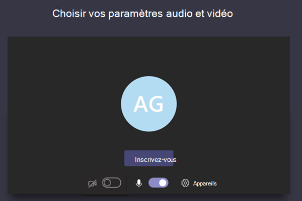

# Gérer les stratégies de réunion dans teamsManage meeting policies in Teams

::: zone target="docs"
Stratégies de réunion: elles sont utilisées pour contrôler les fonctionnalités disponibles aux participants à la réunion pour les réunions planifiées par des utilisateurs au sein de votre organisation.Meeting policies are used to control the features that are available to meeting participants for meetings that are scheduled by users in your organization. Après avoir créé une stratégie et effectué vos modifications, vous pouvez affecter des utilisateurs à la stratégie.After you create a policy and make your changes, you can then assign users to the policy. Vous gérez les stratégies de réunion dans le centre d’administration Microsoft teams ou en utilisant [PowerShell](teams-powershell-overview.md).You manage meeting policies in the Microsoft Teams admin center or by using [PowerShell](teams-powershell-overview.md).

Vous pouvez mettre en œuvre des stratégies comme suit, ce qui a un impact sur l’interface de réunion pour les utilisateurs avant le début d’une réunion, pendant une réunion ou après une réunion.You can implement policies in the following ways, which affect the meeting experience for users before a meeting starts, during a meeting, or after a meeting.

|Type d’implémentationImplementation type  |DescriptionDescription  |
|---------|---------|
|Par organisateurPer-organizer    |Lorsque vous implémentez une stratégie par organisateur, tous les participants à la réunion héritent de la stratégie de l’organisateur.When you implement a per-organizer policy, all meeting participants inherit the policy of the organizer. Par exemple, l' **admission automatique de personnes** est une stratégie par organisateur et détermine si les utilisateurs rejoignent directement la réunion ou s’il attend dans la salle d’attente pour les réunions planifiées par l’utilisateur qui dispose de la stratégie.For example, **Automatically admit people** is a per-organizer policy and controls whether users join the meeting directly or wait in the lobby for meetings scheduled by the user who is assigned the policy.          |
|Par utilisateurPer-user    |Lorsque vous implémentez une stratégie par utilisateur, seule la stratégie par utilisateur s’applique pour limiter certaines fonctionnalités pour les participants de la réunion ou de l’organisateur.When you implement a per-user policy, only the per-user policy applies to restrict certain features for the organizer and/or meeting participants. Par exemple, **l’autorisation de la fonction « Conférence maintenant » dans les canaux** est une stratégie par utilisateur.For example, **Allow Meet now in channels** is a per-user policy.     |
|Par organisateur et par utilisateurPer-organizer and per-user     |Lorsque vous implémentez une combinaison d’une stratégie par utilisateur et par utilisateur, certaines fonctionnalités sont limitées pour les participants à la réunion en fonction de leur politique et de la stratégie de l’organisateur.When you implement a combination of a per-organizer and per-user policy, certain features are restricted for meeting participants based on their policy and the organizer's policy. Par exemple, **l’autorisation de l’enregistrement Cloud** est une stratégie par utilisateur et par utilisateur.For example, **Allow cloud recording** is a per-organizer and per-user policy. Activez ce paramètre pour autoriser l’organisateur de la réunion et les participants à démarrer et arrêter un enregistrement.Turn on this setting to allow the meeting organizer and participants to start and stop a recording.

Par défaut, la création d’une stratégie nommée global (au niveau de l’organisation par défaut) est créée.By default, a policy named Global (Org-wide default) is created. Par défaut, tous les utilisateurs de votre organisation reçoivent la stratégie de réunion globale.All users in your organization are assigned the Global meeting policy by default. Vous pouvez y apporter des modifications ou créer une ou plusieurs stratégies personnalisées et leur affecter des utilisateurs.You can either make changes to it or create one or more custom policies and assign users to them. Les utilisateurs bénéficieront de la stratégie globale, sauf si vous créez et attribuez une stratégie personnalisée.Users will get the Global policy unless you create and assign a custom policy. Lorsque vous créez une stratégie personnalisée, vous pouvez autoriser ou empêcher l’accès à certaines fonctionnalités à vos utilisateurs, puis les affecter à un ou plusieurs utilisateurs qui disposeront de ces paramètres.When you create a custom policy, you can allow or prevent certain features from being available to your users, and then assign it to one or more users who will have the settings applied to them.

> [!NOTE]
> Le bouton Détails de la réunion sera disponible si un utilisateur a activé les licences de conférence audio ou si l’utilisateur est autorisé à utiliser la fonction de conférence audio si ce n’est pas le cas, les détails de la réunion ne seront pas disponibles.Meeting details button will be available if a user has the audio conference licenses enabled or the user is allow for audio conferencing, if not, the meeting details will not be available.

## Modifier ou créer une stratégie de réunionChange or create a meeting policy

Pour modifier ou créer une stratégie de réunion, accédez au Centre d’administration Microsoft Teams > **Réunions** > **Stratégies de réunion**.To change or create a meeting policy, go to the Microsoft Teams admin center > **Meetings** > **Meeting policies**. Sélectionnez une stratégie dans la liste ou cliquez sur **Ajouter**.Select a policy from the list or select **Add**. Si vous créez une stratégie, ajoutez un nom et une description.If you're creating a new policy, add a name and description. Le nom ne peut pas contenir de caractères spéciaux et ne doit pas dépasser 64 caractères.The name can't contain special characters or be longer than 64 characters. Choisissez vos paramètres, puis sélectionnez **Enregistrer**.Choose your settings, and then select **Save**.

Par exemple, imaginons que vous avez un grand nombre d’utilisateurs et que vous voulez limiter la quantité de bande passante requise par la réunion.For example, say you have a bunch of users and you want to limit the amount of bandwidth that their meeting would require. Vous devez créer une stratégie personnalisée nommée « bande passante limitée » et désactiver les paramètres suivants :You would create a new custom policy named "Limited bandwidth" and disable the following settings:

Sous \*\* Audio & vidéo\*\* :Under **Audio & video**:
- Désactivez l’option Autoriser l’enregistrement Cloud.Turn off Allow cloud recording.
- Désactivez Autoriser la vidéo IP.Turn off Allow IP video.

Sous **Partage de contenu** :Under **Content sharing**:
- Désactiver le mode de partage d’écran.Disable screen sharing mode.
- Désactivez  Autoriser le tableau blanc.Turn off Allow whiteboard.
- Désactivez Autoriser les notes partagées.Turn off Allow shared notes.

Vous pouvez ensuite attribuer la stratégie aux utilisateurs.Then assign the policy to the users.

> [!NOTE]
> Un utilisateur ne peut être associé qu’à une seule stratégie de réunion à la fois.A user can be assigned only one meeting policy at a time.

## Affecter une stratégie de réunion aux utilisateursAssign a meeting policy to users

Pour affecter une stratégie de réunion à un seul utilisateur :To assign a meeting policy to one user:

1. Dans le volet de navigation gauche du centre d’administration Microsoft Teams, et accédez aux **Utilisateurs**, puis cliquez sur l’utilisateur.In the left navigation of the Microsoft Teams admin center, go to **Users**, and then click the user.
2. Sélectionnez l’utilisateur en cliquant à gauche du nom de celui-ci, puis cliquez sur **Modifier les paramètres**.Select the user by clicking to the left of the user name, and then click **Edit settings**.
3. Sous **Stratégie de réunion**, sélectionnez la stratégie que vous souhaitez attribuer, et puis cliquez sur **Appliquer**.Under **Meeting policy**, select the policy you want to assign, and then click **Apply**.

Pour affecter une stratégie à plusieurs utilisateurs à la fois :To assign a policy to multiple users at a time:

1. Dans le volet de navigation gauche du Centre d’administration Microsoft Teams, accédez à **Utilisateurs**, puis recherchez les utilisateurs ou filtrez l’affichage pour afficher les utilisateurs souhaités.In the left navigation of the Microsoft Teams admin center, go to **Users**, and then search for the users or filter the view to show the users you want.
2. Dans la colonne **&#x2713;** (coche), sélectionnez les utilisateurs.In the **&#x2713;** (check mark) column, select the users. Pour sélectionner tous les utilisateurs, cliquez sur &#x2713; (coche) en haut du tableau.To select all users, click the &#x2713; (check mark) at the top of the table.
3. Cliquez sur **Modifier les paramètres**, apportez les modifications souhaitées, puis cliquez sur **Appliquer**.Click **Edit settings**, make the changes that you want, and then click **Apply**.  

Vous pouvez également effectuer les opérations suivantes :Or, you can also do the following:

1. Dans le volet de navigation de gauche du centre d’administration de Microsoft Teams, **accédez à**  >  **stratégies de réunion**.In the left navigation of the Microsoft Teams admin center, go to **Meetings** > **Meeting policies**.
2. Sélectionnez la stratégie en cliquant à gauche du nom de celle-ci.Select the policy by clicking to the left of the policy name.
3. Sélectionnez **Gérer les utilisateurs**.Select **Manage users**.
4. Dans le volet **Gérer les utilisateurs**, recherchez l’utilisateur par son nom complet ou son nom d’utilisateur, sélectionnez le nom, puis sélectionnez **Ajouter**.In the **Manage users** pane, search for the user by display name or by user name, select the name, and then select **Add**. Répétez cette étape pour chaque utilisateur que vous souhaitez ajouter.Repeat this step for each user that you want to add.
5. Lorsque vous avez terminé d’ajouter des utilisateurs, cliquez sur **Enregistrer**.After you finish adding users, select **Save**.

> [!NOTE]
> Vous ne pouvez pas supprimer une stratégie s’il est affecté à des utilisateurs.You can't delete a policy if users are assigned to it. Vous devez d’abord affecter une stratégie différente à tous les utilisateurs concernés, puis supprimer la stratégie d’origine.You must first assign a different policy to all affected users, and then you can delete the original policy.

## Paramètres de la stratégie de réunionMeeting policy settings

Lorsque vous sélectionnez une stratégie existante dans la page stratégies de la **réunion** ou cliquez sur **Ajouter** pour ajouter une nouvelle stratégie, vous pouvez configurer les paramètres pour les éléments suivants.When you select an existing policy on the **Meeting policies** page or select **Add** to add a new policy, you can configure settings for the following.

- [GénéralGeneral](#meeting-policy-settings---general)
- [Audio & vidéoAudio & video](#meeting-policy-settings---audio--video)
- [Partage de contenuContent sharing](#meeting-policy-settings---content-sharing)
- [Participants & invitésParticipants & guests](#meeting-policy-settings---participants--guests)

::: zone-end 

## Paramètres de la stratégie de réunion-généralMeeting policy settings - General

- [Autoriser la Conférence maintenant dans les canauxAllow Meet now in channels](#allow-meet-now-in-channels)
- [Autoriser le complément OutlookAllow the Outlook add-in](#allow-the-outlook-add-in)
- [Autoriser la planification des réunions de canalAllow channel meeting scheduling](#allow-channel-meeting-scheduling)
- [Autoriser la planification de réunions privéesAllow scheduling private meetings](#allow-scheduling-private-meetings)
- [Autoriser la Conférence maintenant dans les réunions privéesAllow Meet now in private meetings](#allow-meet-now-in-private-meetings)

### Autoriser la Conférence maintenant dans les canauxAllow Meet now in channels

Il s’agit d’une stratégie par utilisateur qui s’applique avant le début d’une réunion.This is a per-user policy and applies before a meeting starts. Ce paramètre détermine si un utilisateur peut démarrer une réunion ad hoc dans un canal d’équipe.This setting controls whether a user can start an ad hoc meeting in a Teams channel. Si vous activez cette case à costar, lorsque l’utilisateur publie un message dans un canal d’équipe, il peut cliquer sur **Conférence maintenant** sous la zone de rédaction pour commencer une réunion ad hoc du canal.If you turn this on, when a user posts a message in a Teams channel, the user can click **Meet now** under the compose box to start an ad hoc meeting in the channel. La valeur par défaut est « True ».The default value is True.

### Autoriser le complément OutlookAllow the Outlook add-in

Il s’agit d’une stratégie par utilisateur qui s’applique avant le début d’une réunion.This is a per-user policy and applies before a meeting starts. Ce paramètre détermine si les réunions d’équipes peuvent être planifiées dans Outlook (Windows, Mac, Web et mobile).This setting controls whether Teams meetings can be scheduled from within Outlook (Windows, Mac, web, and mobile).

Si vous désactivez cette fonctionnalité, les utilisateurs ne sont pas en mesure de planifier des réunions d’équipes lors de la création d’une réunion dans Outlook.If you turn this off, users are unable to schedule Teams meetings when they create a new meeting in Outlook. Par exemple, dans Outlook sur Windows, l’option **nouvelle réunion teams** ne s’affiche pas dans le ruban.For example, in Outlook on Windows, the **New Teams Meeting** option won't show up in the ribbon.

### Autoriser la planification des réunions de canalAllow channel meeting scheduling

Il s’agit d’une stratégie par utilisateur qui s’applique avant le début d’une réunion.This is a per-user policy and applies before a meeting starts. Ce paramètre détermine si les utilisateurs peuvent planifier une réunion dans un canal d’équipe.This setting controls whether users can schedule a meeting in a Teams channel.  Si vous désactivez cette case à costar, l’option **planifier une réunion** ne sera pas disponible pour l’utilisateur lorsqu’il démarrera une réunion dans un canal d’équipe et l’option **Ajouter un canal** est désactivée pour les utilisateurs dans Teams.If you turn this off, the **Schedule a meeting** option won't be available to the user when they start a meeting in a Teams channel and the **Add channel** option is disabled for users in Teams. La valeur par défaut est « True ».The default value is True.

### Autoriser la planification de réunions privéesAllow scheduling private meetings

Il s’agit d’une stratégie par utilisateur qui s’applique avant le début d’une réunion.This is a per-user policy and applies before a meeting starts. Ce paramètre détermine si les utilisateurs peuvent planifier des réunions privées dans Teams.This setting controls whether users can schedule private meetings in Teams. Une réunion est privée lorsque celle-ci n’est pas publiée sur un canal d’une équipe.A meeting is private when it's not published to a channel in a team.

Remarque : Si vous désactivez l’option **autoriser la planification de réunions privées** et **autoriser la planification**des réunions de canal, les options **Ajouter les participants nécessaires** et **Ajouter un canal** sont désactivées pour les utilisateurs de Microsoft Teams.Note that if you turn off **Allow scheduling private meetings** and **Allow channel meeting scheduling**,  the **Add required attendees** and **Add channel** options are disabled for users in Teams. La valeur par défaut est « True ».The default value is True.

### Autoriser la Conférence maintenant dans les réunions privéesAllow Meet now in private meetings

Il s’agit d’une stratégie par utilisateur qui s’applique avant le début d’une réunion.This is a per-user policy and applies before a meeting starts. Ce paramètre détermine si un utilisateur peut démarrer une réunion privée ad hoc.This setting controls whether a user can start an ad hoc private meeting.  La valeur par défaut est « True ».The default value is True.

## Paramètres de la stratégie de réunion-audio & VideoMeeting policy settings - Audio & video

- [Autoriser la transcriptionAllow transcription](#allow-transcription)
- [Autoriser l’enregistrement CloudAllow cloud recording](#allow-cloud-recording)
- [Autoriser la vidéo sur IPAllow IP video](#allow-ip-video)
- [Taux d’échantillonnage du support (Ko)Media bit rate (Kbs)](#media-bit-rate-kbs)

### Autoriser la transcriptionAllow transcription

Il s’agit d’une combinaison d’une stratégie par l’organisateur et par utilisateur.This is a combination of a per-organizer and per-user policy. Ce paramètre détermine si les légendes et les fonctionnalités de transcription sont disponibles lors de la lecture des enregistrements de réunion.This setting controls whether captions and transcription features are available during playback of meeting recordings. Si vous désactivez cette fonctionnalité, les options **Rechercher** et **CC** ne seront pas disponibles lors de la lecture de l’enregistrement d’une réunion.If you turn this off, the **Search** and **CC** options won't be available during playback of a meeting recording. Ce paramètre doit être activé pour la personne qui a créé l’enregistrement.The person who started the recording needs this setting turned on so that the recording also includes transcription. 

Notez que la transcription pour les réunions enregistrées est uniquement prise en charge pour les utilisateurs qui disposent de la langue dans teams pour lesquelles l’anglais est lu lors de la réunion.Note that transcription for recorded meetings is currently only supported for users who have the language in Teams set to English and when English is spoken in the meeting.

### Autoriser l’enregistrement CloudAllow cloud recording

Il s’agit d’une combinaison d’une stratégie par l’organisateur et par utilisateur.This is a combination of a per-organizer and per-user policy. Ce paramètre détermine si les réunions de cet utilisateur peuvent être enregistrées.This setting controls whether this user's meetings can be recorded. L’enregistrement peut être démarré par l’organisateur de la réunion ou par un autre participant à la réunion si le paramètre de stratégie est activé pour le participant et s’il s’agit d’un utilisateur authentifié de la même organisation.The recording can be started by the meeting organizer or by another meeting participant if the policy setting is turned on for the participant and if they're an authenticated user from the same organization.

Les personnes externes à votre organisation, telles que les utilisateurs fédérés et anonymes, ne peuvent pas démarrer l’enregistrement.People outside your organization, such as federated and anonymous users, can't start the recording. Les utilisateurs invités ne peuvent pas démarrer ou arrêter l’enregistrement.Guest users can't start or stop the recording. 

Examinons l’exemple suivant.Let's look at the following example.

|UtilisateurUser |Stratégie de réunionMeeting policy  |Autoriser l’enregistrement CloudAllow cloud recording |
|---------|---------|---------|
|DanielaDaniela | GlobaleGlobal   | FalseFalse |
|AmandaAmanda | Location1MeetingPolicyLocation1MeetingPolicy | VraiTrue|
|Jean (utilisateur externe)John (external user) | Non applicableNot applicable | Non applicableNot applicable|

Les réunions organisées par Daniela ne peuvent pas être enregistrées et Amanda, qui dispose du paramètre de stratégie activé, ne peut pas enregistrer des réunions organisées par Daniela.Meetings organized by Daniela can't be recorded and Amanda, who has the policy setting enabled, can't record meetings organized by Daniela. Les réunions organisées par Amanda peuvent être enregistrées, mais, Daniela, qui a désactivé le paramètre de stratégie et John qui est un utilisateur externe, ne peuvent pas enregistrer des réunions organisées par Amanda.Meetings organized by Amanda can be recorded, however,  Daniela, who has the policy setting disabled and John who is an external user, can't record meetings organized by Amanda.

Pour en savoir plus sur l’enregistrement d’une réunion dans le Cloud, voir [enregistrement de réunion Cloud teams](cloud-recording.md).To learn more about cloud meeting recording, see [Teams cloud meeting recording](cloud-recording.md).

### Autoriser la vidéo sur IPAllow IP video

Il s’agit d’une combinaison d’une stratégie par l’organisateur et par utilisateur.This is a combination of a per-organizer and per-user policy. La vidéo est un composant clé pour les réunions.Video is a key component to meetings. Dans certaines organisations, les administrateurs peuvent souhaiter davantage de contrôle sur les réunions des utilisateurs en vidéo.In some organizations, admins might want more control over which users' meetings have video. Ce paramètre détermine si la vidéo peut être activée dans les réunions hébergées par un utilisateur et dans les appels 1:1 et les appels de groupe démarrés par un utilisateur.This setting controls whether video can be turned on in meetings hosted by a user and in 1:1 calls and group calls started by a user. Réunions organisées par un utilisateur pour lequel cette stratégie est activée, autorisez le partage vidéo pendant la réunion par les participants de la réunion, si la stratégie est également activée pour les participants à la réunion.Meetings organized by a user who has this policy enabled, allow video sharing in the meeting by the meeting participants, if the meeting participants also have the policy enabled. Les participants à la réunion pour lesquels aucune stratégie n’est affectée (par exemple, des participants anonymes ou fédérés) héritent de la stratégie de l’organisateur de la réunion.Meeting participants who don't have any policies assigned (for example, anonymous and federated participants) inherit the policy of the meeting organizer.

Examinons l’exemple suivant.Let's look at the following example.

|UtilisateurUser |Stratégie de réunionMeeting policy  |Autoriser la vidéo IPAllow IP Video |
|---------|---------|---------|
|DanielaDaniela   | GlobaleGlobal   | VraiTrue        |
|AmandaAmanda    | Location1MeetingPolicyLocation1MeetingPolicy        | FalseFalse      |

Les réunions hébergées par Daniela permettre l’activation de la vidéo.Meetings hosted by Daniela allow video to be turned on. Daniela pouvez rejoindre la réunion et activer la vidéo.Daniela can join the meeting and turn on video. Amanda ne peut pas activer la vidéo pendant la réunion Daniela, car la politique d’Amanda est définie sur ne pas autoriser la vidéo.Amanda can't turn on video in Daniela's meeting because Amanda's policy is set to not allow video. Amanda peut voir les vidéos partagées par d’autres participants à la réunion.Amanda can see videos shared by other participants in the meeting.

Dans les réunions hébergées par Amanda, personne ne peut activer la vidéo, quelle que soit la politique de vidéo qui lui est affectée.In meetings hosted by Amanda, no one can turn on video, regardless of the video policy assigned to them. Cela signifie que Daniela ne peut pas activer la vidéo dans les réunions Amanda.This means Daniela can't turn on video in Amanda's meetings.  

Si Daniela appelle Amanda avec la vidéo, Amanda peut répondre à l’appel avec l’audio uniquement.If Daniela calls Amanda with video on, Amanda can answer the call with audio only.  Lorsque l’appel est connecté, Amanda peut voir la vidéo de Daniela, mais ne peut pas activer la vidéo.When the call is connected, Amanda can see Daniela's video, but can't turn on video. Si Amanda appelle Daniela, Daniela peut répondre à l’appel avec de la vidéo et de l’audio.If Amanda calls Daniela, Daniela can answer the call with video and audio. Lorsque l’appel est connecté, Daniela peut activer ou désactiver sa vidéo, selon les besoins.When the call is connected, Daniela can turn on or turn off her video, as needed.

### Taux d’échantillonnage du support (Ko)Media bit rate (Kbs)

Il s’agit d’une stratégie par utilisateur.This is a per-user policy. Ce paramètre détermine le taux de bits média pour les transmissions du partage d’application audio, vidéo et vidéo dans les appels et les réunions de l’utilisateur.This setting determines the media bit rate for audio, video, and video-based app sharing transmissions in calls and meetings for the user. Il est appliqué à la traversée de l’appel ou de la réunion, en liaison descendante et en liaison descendante multimédia.It's applied to both the uplink and downlink media traversal for users in the call or meeting. Ce paramètre vous permet de contrôler plus précisément la bande passante de votre organisation.This setting gives you granular control over managing bandwidth in your organization. En fonction des scénarios de réunions requis par les utilisateurs, nous recommandons une bande passante suffisante pour une qualité optimale.Depending on the meetings scenarios required by users, we recommend having enough bandwidth in place for a good quality experience. La valeur minimale est 30 kbps et la valeur maximale dépend du scénario de la réunion.The minimum value is 30 Kbps and the maximum value depends on the meeting scenario. Pour en savoir plus sur la bande passante minimum recommandée pour des réunions, des appels et des événements en direct de bonne qualité dans Teams, voir [besoins en bande passante](prepare-network.md#bandwidth-requirements).To learn more about the minimum recommended bandwidth for good quality meetings, calls, and live events in Teams, see [Bandwidth requirements](prepare-network.md#bandwidth-requirements).

S’il n’y a pas assez de bande passante pour une réunion, un message s’affiche indiquant une mauvaise qualité du réseau.If there isn't enough bandwidth for a meeting, participants see a message that indicates poor network quality.

Pour les réunions qui ont besoin d’une vidéo de qualité optimale, telle que les réunions du tableau PDG et les événements en direct, nous vous conseillons de définir une bande passante de 10 Mbps.For meetings that need the highest quality video experience, such as CEO board meetings and Teams live events, we recommend you set the bandwidth to 10 Mbps. Même si l’expérience maximale est définie, la pile multimédia de teams s’adapte à des conditions de bande passante insuffisantes lorsque certaines conditions réseau sont détectées, en fonction du scénario.Even when the maximum experience is set, the Teams media stack adapts to low bandwidth conditions when certain network conditions are detected, depending on the scenario. 

## Paramètres de la stratégie de réunion-partage de contenuMeeting policy settings - Content sharing

- [Mode de partage d’écranScreen sharing mode](#screen-sharing-mode)
- [Autoriser un participant à céder ou demander le contrôleAllow a participant to give or request control](#allow-a-participant-to-give-or-request-control)
- [Autoriser un participant externe à céder ou demander le contrôleAllow an external participant to give or request control](#allow-an-external-participant-to-give-or-request-control)
- [Autoriser le partage PowerPointAllow PowerPoint sharing](#allow-powerpoint-sharing)
- [Autoriser le tableau blancAllow whiteboard](#allow-whiteboard)
- [Autoriser les notes partagéesAllow shared notes](#allow-shared-notes)

### Mode de partage d’écranScreen sharing mode

Il s’agit d’une combinaison d’une stratégie par l’organisateur et par utilisateur.This is a combination of a per-organizer and per-user policy. Ce paramètre détermine si le partage de bureau et/ou de fenêtre est autorisé lors de la réunion de l’utilisateur.This setting controls whether desktop and/or window sharing is allowed in the user's meeting. Les participants à la réunion pour lesquels aucune stratégie n’est affectée (par exemple, les participants anonymes, invités, B2B et fédéré) héritent de la stratégie de l’organisateur de la réunion.Meeting participants who don't have any policies assigned (for example, anonymous, guest, B2B, and federated participants) inherit the policy of the meeting organizer.

|Définition de la valeurSetting value |ComportementBehavior  |
|---------|---------|
|**Tout l’écran****Entire screen**    | Le partage de bureau complet et le partage d’application sont autorisés dans la réunionFull desktop sharing and application sharing is allowed in the meeting |
|**Application unique****Single application**   | Le partage d’application est autorisé dans la réunionApplication sharing is allowed in the meeting        |
|**Désactivé****Disabled**     |Le partage d’écran et le partage d’application ont été désactivés dans la réunion.Screen sharing and application sharing turned off in the meeting.       |

Examinons l’exemple suivant.Let's look at the following example.

|UtilisateurUser |Stratégie de réunionMeeting policy |Mode de partage d’écranScreen sharing mode |
|---------|---------|---------|
|DanielaDaniela  | GlobaleGlobal   | Tout l’écranEntire screen |
|AmandaAmanda   | Location1MeetingPolicyLocation1MeetingPolicy  | DésactivéDisabled |

Réunions hébergées par Daniela permettre aux participants d’une réunion de partager leur écran entier ou une application spécifique.Meetings hosted by Daniela allow meeting participants to share their entire screen or a specific application. Si Amanda rejoint la réunion Daniela, Amanda ne peut pas partager son écran ou une application spécifique, car son paramètre de stratégie est désactivé.If Amanda joins Daniela's meeting, Amanda can't share her screen or a specific application as her policy setting is disabled. Dans les réunions hébergées par Amanda, personne ne peut partager son écran ou une application unique, quelle que soit la stratégie du mode de partage d’écran qui leur est affectée.In meetings hosted by Amanda, no one is allowed to share their screen or a single application, regardless of the screen sharing mode policy assigned to them. Cela signifie qu’Daniela ne peut pas partager son écran ou une application unique dans les réunions Amanda.This means that Daniela can't share her screen or a single application in Amanda's meetings.  

Pour le moment, les utilisateurs ne peuvent pas lire de vidéo ou partager leur écran dans une réunion teams s’ils utilisent Google Chrome.Currently, users can't play video or share their screen in a Teams meeting if they're using Google Chrome.

### Autoriser un participant à céder ou demander le contrôleAllow a participant to give or request control

Il s’agit d’une stratégie par utilisateur.This is a per-user policy. Ce paramètre indique si l’utilisateur peut donner le contrôle du bureau ou de la fenêtre partagés aux autres participants à la réunion.This setting controls whether the user can give control of the shared desktop or window to other meeting participants. Pour donner le contrôle, pointez sur la partie supérieure de l’écran.To give control, hover over the top of the screen. 

Si ce paramètre est activé pour l’utilisateur, l’option **donner le contrôle** s’affiche dans la barre supérieure d’une session de partage.If this setting is turned on for the user, the **Give Control** option is displayed in the top bar in a sharing session. 

Si les paramètres sont désactivés pour l’utilisateur, l’option **donner le contrôle** n’est pas disponible.If the settings is turned off for the user, the **Give Control** option isn't available.

Examinons l’exemple suivant.Let's look at the following example.

|UtilisateurUser |Stratégie de réunionMeeting policy  |Autoriser les participants à céder ou demander le contrôleAllow participant to give or request control |
|---------|---------|---------|
|DanielaDaniela   | GlobaleGlobal   | VraiTrue       |
|BabekBabek    | Location1MeetingPolicyLocation1MeetingPolicy        | FalseFalse   |

Daniela pouvez donner le contrôle de l’ordinateur ou de la fenêtre partagée à d’autres participants à une réunion organisée par Babek que Babek ne peut pas céder le contrôle à d’autres participants.Daniela can give control of the shared desktop or window to other participants in a meeting organized by Babek whereas Babek can't give control to other participants.

Pour utiliser PowerShell afin de contrôler les personnes qui peuvent donner le contrôle ou accepter des demandes de contrôle, utilisez l’applet de commande AllowParticipantGiveRequestControl.To use PowerShell to control who can give control or accept requests for control, use the AllowParticipantGiveRequestControl cmdlet.

> [!NOTE]
> Pour donner et prendre le contrôle du contenu partagé lors du partage, les deux parties doivent utiliser le client de bureau Teams.To give and take control of shared content during sharing, both parties must be using the Teams desktop client. Le contrôle n’est pas pris en charge lorsqu'une des parties exécute Teams dans un navigateur.Control isn't supported when either party is running Teams in a browser. Il s'agit d'une limitation technique que nous nous efforçons de résoudre.This is due to a technical limitation that we're planning to fix. 

### Autoriser un participant externe à céder ou demander le contrôleAllow an external participant to give or request control

Il s’agit d’une stratégie par utilisateur.This is a per-user policy. Ce paramètre détermine si les participants externes d’une réunion peuvent donner le contrôle de leur bureau ou fenêtre partagée aux autres participants à la réunion.This setting controls whether external participants in a meeting can give control of their shared desktop or window to other participants in the meeting. Les participants externes aux réunions teams peuvent être classés comme suit :External participants in Teams meetings can be categorized as follows:  

- Utilisateur anonymeAnonymous user
- Utilisateurs invitésGuest users  
- Utilisateur B2BB2B user
- Utilisateur fédéréFederated user  

Si les utilisateurs fédérés peuvent donner le contrôle à des utilisateurs externes lorsque le partage est contrôlé, le paramètre **autoriser un participant externe à attribuer ou demander un contrôle** au sein de leur organisation.Whether federated users can give control to external users while sharing is controlled by the **Allow an external participant to give or request control** setting in their organization.

Pour utiliser PowerShell pour contrôler si les participants externes peuvent donner le contrôle ou accepter des demandes de contrôle, utilisez l’applet de commande AllowExternalParticipantGiveRequestControl.To use PowerShell to control whether external participants can give control or accept requests for control, use the AllowExternalParticipantGiveRequestControl cmdlet.

### Autoriser le partage PowerPointAllow PowerPoint sharing

Il s’agit d’une stratégie par utilisateur.This is a per-user policy. Ce paramètre détermine si l’utilisateur peut partager des diapositives PowerPoint dans une réunion.This setting controls whether the user can share PowerPoint slide decks in a meeting. Les utilisateurs externes, y compris les utilisateurs anonymes, invités et fédérés, héritent de la stratégie de l’organisateur de la réunion.External users, including anonymous, guest, and federated users, inherit the policy of the meeting organizer.

Examinons l’exemple suivant.Let's look at the following example.

|UtilisateurUser |Stratégie de réunionMeeting policy  |Autoriser le partage PowerPointAllow PowerPoint sharing |
|---------|---------|---------|
|DanielaDaniela   | GlobaleGlobal   | VraiTrue       |
|AmandaAmanda   | Location1MeetingPolicyLocation1MeetingPolicy        | FalseFalse   |

Amanda ne peut pas partager des diapositives PowerPoint dans les réunions, même si elle est l’organisateur de la réunion.Amanda can't share PowerPoint slide decks in meetings even if she's the meeting organizer. Daniela peut partager des diapositives PowerPoint, même si la réunion est organisée par Amanda.Daniela can share PowerPoint slide decks even if the meeting is organized by Amanda. Amanda peut afficher les diapositives PowerPoint partagées par d’autres participants à la réunion, même si elles ne peuvent pas partager des diapositives PowerPoint.Amanda can view the PowerPoint slide decks shared by others in the meeting, even though she can't share PowerPoint slide decks.

### Autoriser le tableau blancAllow whiteboard

Il s’agit d’une stratégie par utilisateur.This is a per-user policy. Ce paramètre détermine si un utilisateur peut partager le tableau blanc dans une réunion.This setting controls whether a user can share the whiteboard in a meeting. Les utilisateurs externes, y compris les utilisateurs anonymes, B2B et fédérés, héritent de la stratégie de l’organisateur de la réunion.External users, including anonymous, B2B, and federated users, inherit the policy of the meeting organizer. 

Examinons l’exemple suivant.Let's look at the following example.

|UtilisateurUser |Stratégie de réunionMeeting policy  |Autoriser le tableau blancAllow whiteboard|
|---------|---------|---------|
|DanielaDaniela   | GlobaleGlobal   | VraiTrue       |
|AmandaAmanda   | Location1MeetingPolicyLocation1MeetingPolicy        | FalseFalse   |

Amanda ne peut pas partager le tableau blanc dans une réunion, même s’il s’agit de l’organisateur de la réunion.Amanda can't share the whiteboard in a meeting even if she's the meeting organizer. Daniela peut partager le tableau blanc même si une réunion est organisée par Amanda.Daniela can share the whiteboard even if a meeting is organized by Amanda.  

### Autoriser les notes partagéesAllow shared notes

Il s’agit d’une stratégie par utilisateur.This is a per-user policy. Ce paramètre détermine si un utilisateur peut créer et partager des notes pendant une réunion.This setting controls whether a user can create and share notes in a meeting. Les utilisateurs externes, y compris les utilisateurs anonymes, B2B et fédérés, héritent de la stratégie de l’organisateur de la réunion.External users, including anonymous, B2B, and federated users, inherit the policy of the meeting organizer. Pour l’instant, l’onglet **notes de réunion** est uniquement pris en charge dans les réunions dont la taille est inférieure à 20 participants.The **Meeting Notes** tab is currently only supported in meetings that have less than 20 participants.

Examinons l’exemple suivant.Let's look at the following example.

|UtilisateurUser |Stratégie de réunionMeeting policy  |Autoriser les notes partagéesAllow shared notes |
|---------|---------|---------|
|DanielaDaniela   | GlobaleGlobal   | VraiTrue       |
|AmandaAmanda   | Location1MeetingPolicyLocation1MeetingPolicy | FalseFalse |

Daniela peut prendre des notes dans les réunions d’Amanda et qu’Amanda ne peut prendre des notes pendant une réunion.Daniela can take notes in Amanda's meetings and Amanda can't take notes in any meetings.

## Paramètres de la stratégie de réunion-participants & invitésMeeting policy settings - Participants & guests

Ces paramètres contrôlent les participants à la réunion qui attendent dans la salle d’attente avant d’être admis à la réunion et le niveau de participation qui leur est accordé lors d’une réunion.These settings control which meeting participants wait in the lobby before they are admitted to the meeting and the level of participation they are allowed in a meeting.

- [Permettre aux utilisateurs anonymes de démarrer une réunionLet anonymous people start a meeting](#let-anonymous-people-start-a-meeting)
- [Admettre automatiquement des personnesAutomatically admit people](#automatically-admit-people)
- [Autoriser les utilisateurs rendez-vous à ignorer la salle d’attenteAllow dial-in users to bypass the lobby](#allow-dial-in-users-to-bypass-the-lobby)
- [Activer les légendes dynamiquesEnable live captions ](#enable-live-captions)
- [Autoriser la discussion dans les réunionsAllow chat in meetings ](#allow-chat-in-meetings)

> [!NOTE]
>Les options de participation à une réunion varient en fonction des paramètres de chaque groupe équipes et de la méthode de connexion.Options to join a meeting will vary, depending on the settings for each Teams group, and the connection method. Si votre groupe comporte une audioconférence et qu’elle est utilisée pour se connecter, voir [audioconférence dans Office 365](https://docs.microsoft.com/microsoftteams/audio-conferencing-in-office-365).If your group has audio conferencing, and uses it to connect, see [Audio Conferencing in Office 365](https://docs.microsoft.com/microsoftteams/audio-conferencing-in-office-365). Si ce n’est pas le cas, reportez-vous à la rubrique [participer à une réunion dans teams](https://support.office.com/article/join-a-meeting-in-teams-1613bb53-f3fa-431e-85a9-d6a91e3468c9).If your Teams group does not have audio conferencing, refer to [Join a meeting in Teams](https://support.office.com/article/join-a-meeting-in-teams-1613bb53-f3fa-431e-85a9-d6a91e3468c9).

### Permettre aux utilisateurs anonymes de démarrer une réunionLet anonymous people start a meeting

Il s’agit d’une stratégie par organisateur qui permet la numérotation des conférences de conférences.This is a per-organizer policy that allows for leaderless dial in conferencing meetings. Ce paramètre détermine si les utilisateurs de la Conférence rendez-vous peuvent participer à la réunion sans utilisateur authentifié de l’organisation.This setting controls whether dial in users can join the meeting without an authenticated user from the organization in attendance. La valeur par défaut est false, ce qui signifie que l’utilisateur Dial doit patienter dans la salle d’attente jusqu’à ce qu’un utilisateur authentifié de l’organisation rejoigne la réunion.The default value is False which means dial in users will wait in the lobby until an authenticated user from the organization joins the meeting. 

**Remarques** Si la valeur est faux et qu’un utilisateur compose le numéro d’abord de la réunion et qu’il est placé dans la salle d’attente, l’utilisateur de l’organisation doit participer à la réunion à l’aide d’un client d’équipes pour admettre l’utilisateur dans la salle d’attente.**Note** If False and a dial in user joins the meeting first and is placed in the lobby, an organization user must join the meeting with a Teams client to admit the user from the lobby. Aucun contrôle de salle d’attente n’est disponible pour les utilisateurs distants.There are no lobby controls available for dialed in users. 

### Admettre automatiquement des personnesAutomatically admit people

Il s’agit d’une stratégie par organisateur.This is a per-organizer policy. Ce paramètre détermine si les personnes rejoignent directement une réunion ou patientent dans la salle d’attente jusqu’à ce qu’elles soient admises par un utilisateur authentifié.This setting controls whether people join a meeting directly or wait in the lobby until they are admitted by an authenticated user. Ce paramètre ne s’applique pas aux utilisateurs d’appels entrants.This setting does not apply to dial in users. 

 Les organisateurs de la réunion peuvent cliquer sur options de la **réunion** dans l’invitation à la réunion pour modifier ce paramètre pour chaque réunion qu’ils planifient.Meeting organizers can click **Meeting Options** in the meeting invitation to change this setting for each meeting they schedule.
 
 **Remarques** Dans les options de la réunion, le paramètre est intitulé « qui peut éviter la salle d’attente ».**Note** In the meeting options the setting is labeled "Who can bypass the lobby"
  
|Définition de la valeurSetting value  |Comportement de jointureJoin behavior |
|---------|---------|
|**Tout le monde****Everyone**   |Tous les participants à la réunion rejoignent directement la réunion sans attendre dans la salle d’attente.All meeting participants join the meeting directly without waiting in the lobby. Cela inclut les utilisateurs authentifiés, les utilisateurs externes d’organisations de confiance, les invités et les utilisateurs anonymes.This includes authenticated users, external users from trusted organizations (federated), guests, and anonymous users.     |
|**Tout le monde au sein de votre organisation et organisations fédérées****Everyone in your organization and federated organizations**     |Utilisateurs authentifiés au sein de l’organisation, y compris utilisateurs invités et utilisateurs d’organisations approuvées, joignez directement la réunion sans attendre dans la salle d’attente.Authenticated users within the organization, including guest users and the users from trusted organizations, join the meeting directly without waiting in the lobby.  Les utilisateurs anonymes attendent dans la salle d’attente.Anonymous users wait in the lobby.   |
|**Tout le monde dans votre organisation****Everyone in your organization**    |Utilisateurs authentifiés au sein de l’organisation, y compris les utilisateurs invités, qui rejoignent directement la réunion sans attendre dans la salle d’attente.Authenticated users from within the organization, including guest users, join the meeting directly without waiting in the lobby.  Les utilisateurs d’organisations approuvées et d’utilisateurs anonymes attendent dans la salle d’attente.Users from trusted organizations and anonymous users wait in the lobby. Il s’agit du paramètre par défaut.This is the default setting.           |

### Autoriser les utilisateurs rendez-vous à ignorer la salle d’attenteAllow dial-in users to bypass the lobby

Il s’agit d’une stratégie par organisateur.This is a per-organizer policy. Ce paramètre détermine si les personnes qui se connectent par téléphone rejoignent directement la réunion ou qu’elles patientent dans la salle d’attente, indépendamment du paramètre d' **admission automatique des personnes** .This setting controls whether people who dial in by phone join the meeting directly or wait in the lobby regardless of the **Automatically admit people** setting. La valeur par défaut est False.The default value is False. Lorsque la valeur est false, les utilisateurs se serviront dans la salle d’attente jusqu’à ce qu’ils soient joints à la réunion avec un client Teams.When False, dial in users will wait in the lobby until a organization user joins the meeting with a Teams client and admits them. Lorsque la valeur est true, Dial se connecte automatiquement à la réunion lorsqu’un utilisateur de l’organisation rejoint la réunion.When True, dial in users will automatically join the meeting when an organization user joins the meeting. 

**Remarques** Si un utilisateur compose un numéro joint à une réunion avant qu’un utilisateur de l’organisation ne rejoint la réunion, il est placé dans la salle d’attente jusqu’à ce qu’un utilisateur de l’organisation rejoigne la réunion par le biais d’un client d’équipe et les admet.**Note** If a dial in user joins a meeting before an organization user joins the meeting, they will be placed in the lobby until an organization user joins the meeting using a Teams client and admits them. 

### Activer les légendes dynamiquesEnable live captions

Il s’agit d’une stratégie par utilisateur qui s’applique au cours d’une réunion.This is a per-user policy and applies during a meeting. Ce paramètre détermine si l’option **activer les légendes dynamiques** est disponible pour permettre à l’utilisateur d’activer et de désactiver les légendes dynamiques lors des réunions que l’utilisateur attend.This setting controls whether the **Turn on live captions** option is available for the user to turn on and turn off live captions in meetings that the user attends.  

|Définition de la valeurSetting value |ComportementBehavior  |
|---------|---------|
|**Désactivé, mais l’utilisateur peut remplacer****Disabled but the user can override**     | Les légendes dynamiques ne sont pas activées automatiquement pour l’utilisateur pendant une réunion.Live captions aren't automatically turned on for the user during a meeting. L’utilisateur voit l’option **activer les légendes dynamiques** dans le menu débordement (**...**) pour l’activer.The user sees the **Turn on live captions** option in the overflow (**...**) menu to turn them on. Il s’agit du paramètre par défaut.This is the default setting. |
|**Désactivé****Disabled**     | Les légendes dynamiques sont désactivées pour l’utilisateur pendant une réunion.Live captions are disabled for the user during a meeting. L’utilisateur ne dispose pas de l’option pour l’activer.The user doesn't have the option to turn them on.          |

### Autoriser la discussion dans les réunionsAllow chat in meetings

Il s’agit d’une stratégie par organisateur.This is a per-organizer policy. Ce paramètre indique si la conversation de réunion est autorisée lors de la réunion de l’utilisateur.This setting controls whether meeting chat is allowed in the user's meeting.

## Paramètres de stratégie de réunion-mode de rôle de présentateur désignéMeeting policy settings - Designated presenter role mode

Il s’agit d’une stratégie par utilisateur.This is a per-user policy. Ce paramètre vous permet de changer la valeur par défaut du paramètre **qui peut présenter ?** dans les **options de réunion** du client Teams.This setting lets you change the default value of the **Who can present?** setting in **Meeting options** in the Teams client. Ce paramètre de stratégie affecte toutes les réunions, y compris les réunions Conférence maintenant.This policy setting affects all meetings, including Meet Now meetings.

Le paramètre **qui peut présenter ?** permet aux organisateurs de la réunion de choisir qui peut être présentateur dans une réunion.The **Who can present?** setting lets meeting organizers choose who can be presenters in a meeting. Pour en savoir plus, voir [modifier les paramètres des participants d’une réunion](https://support.microsoft.com/article/change-participant-settings-for-a-teams-meeting-53261366-dbd5-45f9-aae9-a70e6354f88e) et de rôles d’équipes [dans une réunion teams](https://support.microsoft.com/article/roles-in-a-teams-meeting-c16fa7d0-1666-4dde-8686-0a0bfe16e019).To learn more, see [Change participant settings for a Teams meeting](https://support.microsoft.com/article/change-participant-settings-for-a-teams-meeting-53261366-dbd5-45f9-aae9-a70e6354f88e) and [Roles in a Teams meeting](https://support.microsoft.com/article/roles-in-a-teams-meeting-c16fa7d0-1666-4dde-8686-0a0bfe16e019).

Pour l’instant, vous pouvez uniquement utiliser PowerShell pour configurer ce paramètre de stratégie.Currently, you can only use PowerShell to configure this policy setting. Vous pouvez modifier une stratégie de réunion teams existante à l’aide de l’applet de passe [Set-CsTeamsMeetingPolicy](https://docs.microsoft.com/powershell/module/skype/set-csteamsmeetingpolicy) .You can edit an existing Teams meeting policy by using the [Set-CsTeamsMeetingPolicy](https://docs.microsoft.com/powershell/module/skype/set-csteamsmeetingpolicy) cmdlet. Vous pouvez créer une stratégie de réunion teams à l’aide de l’applet [de nouvelle cmdlet New-CsTeamsMeetingPolicy](https://docs.microsoft.com/powershell/module/skype/new-csteamsmeetingpolicy) et l’affecter à des utilisateurs.Or, create a new Teams meeting policy by using the [New-CsTeamsMeetingPolicy](https://docs.microsoft.com/powershell/module/skype/new-csteamsmeetingpolicy) cmdlet and assign it to users.

Pour spécifier la valeur par défaut du paramètre **qui peut présenter ?** dans Teams, définissez le paramètre **DesignatedPresenterRoleMode** sur l’une des options suivantes :To specify the default value of the **Who can present?** setting in Teams, set the **DesignatedPresenterRoleMode** parameter to one of the following:

- **EveryoneUserOverride**: tous les participants à la réunion peuvent être présentateurs.**EveryoneUserOverride**:  All meeting participants can be presenters. Il s’agit de la valeur par défaut.This is the default value. Ce paramètre correspond au paramètre **tout le monde** dans Teams.This parameter corresponds to the **Everyone** setting in Teams.
- **EveryoneInCompanyUserOverride**: les utilisateurs authentifiés au sein de l’organisation, y compris les utilisateurs invités, peuvent être présentateurs.**EveryoneInCompanyUserOverride**: Authenticated users in the organization, including guest users, can be presenters. Ce paramètre correspond au paramètre **personnes du mon organisation** dans Teams.This parameter corresponds to the **People in my organization** setting in Teams.
- **EveryoneInSameAndFederatedCompanyUserOverride**: les utilisateurs authentifiés au sein de l’organisation, y compris les utilisateurs invités et les utilisateurs d’organisations fédérées, peuvent être présentateurs.**EveryoneInSameAndFederatedCompanyUserOverride**:  Authenticated users in the organization, including guest users and users from federated organizations, can be presenters. Ce paramètre correspond au paramètre **personnes du même organisme et organisations approuvées** dans Teams.This parameter corresponds to the **People in my organization and trusted organizations** setting in Teams.
- **OrganizerOnlyUserOverride**: seul l’organisateur de la réunion peut être présentateur, et tous les participants à la réunion sont désignés comme participants.**OrganizerOnlyUserOverride**: Only the meeting organizer can be a presenter and all meeting participants are designated as attendees. Ce paramètre correspond au paramètre **moi uniquement** dans Teams.This parameter corresponds to the **Only me** setting in Teams.

Gardez à l’esprit qu’une fois que vous avez défini la valeur par défaut, les organisateurs de la réunion peuvent toujours modifier ce paramètre dans teams et choisir qui peut effectuer une présentation aux réunions planifiées.Keep in mind that after you set the default value, meeting organizers can still change this setting in Teams and choose who can present in the meetings that they schedule.

## Paramètres de la stratégie de réunion-rapport de participation à une réunionMeeting policy settings - Meeting attendance report

Il s’agit d’une stratégie par utilisateur.This is a per-user policy. Ce paramètre détermine si les organisateurs de la réunion peuvent télécharger le [rapport de présence](teams-analytics-and-reports/meeting-attendance-report.md)de la réunion.This setting controls whether meeting organizers can download the [meeting attendance report](teams-analytics-and-reports/meeting-attendance-report.md).

Pour l’instant, vous pouvez uniquement utiliser PowerShell pour configurer ce paramètre de stratégie.Currently, you can only use PowerShell to configure this policy setting. Vous pouvez modifier une stratégie de réunion teams existante à l’aide de l’applet de passe [Set-CsTeamsMeetingPolicy](https://docs.microsoft.com/powershell/module/skype/set-csteamsmeetingpolicy) .You can edit an existing Teams meeting policy by using the [Set-CsTeamsMeetingPolicy](https://docs.microsoft.com/powershell/module/skype/set-csteamsmeetingpolicy) cmdlet. Vous pouvez créer une stratégie de réunion teams à l’aide de l’applet [de nouvelle cmdlet New-CsTeamsMeetingPolicy](https://docs.microsoft.com/powershell/module/skype/new-csteamsmeetingpolicy) et l’affecter à des utilisateurs.Or, create a new Teams meeting policy by using the [New-CsTeamsMeetingPolicy](https://docs.microsoft.com/powershell/module/skype/new-csteamsmeetingpolicy) cmdlet and assign it to users.

Pour permettre à un organisateur de la réunion de télécharger le rapport de présence de la réunion, définissez le paramètre **AllowEngagementReport** sur **Enabled**.To enable a meeting organizer to download the meeting attendance report, set the **AllowEngagementReport** parameter  to **Enabled**. Lorsque l’option est activée, l’option permettant de télécharger le rapport s’affiche dans le volet **participants** .When enabled, the option to download the report is displayed in the **Participants** pane.

Pour empêcher un organisateur de la réunion de télécharger le rapport, attribuez au paramètre la valeur **Disabled**.To prevent a meeting organizer from downloading the report, set the parameter to **Disabled**. Par défaut, ce paramètre est désactivé et l’option permettant de télécharger le rapport n’est pas disponible.By default, this setting is disabled and the option to download the report isn't available.

## Paramètres de la stratégie de réunion-fournisseur de réunion pour le mode îlesMeeting policy settings - Meeting provider for Islands mode

**(prochainement)****(coming soon)**

Il s’agit d’une stratégie par utilisateur.This is a per-user policy. Ce paramètre détermine quel complément de réunion Outlook est utilisé pour *les utilisateurs en mode îlot*.This setting controls which Outlook meeting add-in is used for *users who are in Islands mode*. Vous pouvez spécifier si les utilisateurs peuvent uniquement utiliser le complément de réunion teams ou les compléments de réunion équipes et de réunions Skype entreprise pour planifier des réunions dans Outlook.You can specify whether users can only use the Teams Meeting add-in or both the Teams Meeting and Skype for Business Meeting add-ins to schedule meetings in Outlook.

Vous pouvez uniquement appliquer cette politique aux utilisateurs qui sont en mode îlot et dont le paramètre **AllowOutlookAddIn** est défini sur **true** dans la stratégie de réunion Teams.You can only apply this policy to users who are in Islands mode and have the **AllowOutlookAddIn** parameter set to **True** in their Teams meeting policy.

Pour l’instant, vous pouvez uniquement utiliser PowerShell pour définir cette stratégie.Currently, you can only use PowerShell to set this policy. Vous pouvez modifier une stratégie de réunion teams existante à l’aide de l’applet de passe [Set-CsTeamsMeetingPolicy](https://docs.microsoft.com/powershell/module/skype/set-csteamsmeetingpolicy) .You can edit an existing Teams meeting policy by using the [Set-CsTeamsMeetingPolicy](https://docs.microsoft.com/powershell/module/skype/set-csteamsmeetingpolicy) cmdlet. Vous pouvez créer une stratégie de réunion teams à l’aide de l’applet [de nouvelle cmdlet New-CsTeamsMeetingPolicy](https://docs.microsoft.com/powershell/module/skype/new-csteamsmeetingpolicy) et l’affecter à des utilisateurs.Or, create a new Teams meeting policy by using the [New-CsTeamsMeetingPolicy](https://docs.microsoft.com/powershell/module/skype/new-csteamsmeetingpolicy) cmdlet and assign it to users.

Pour spécifier le complément de réunion que vous voulez mettre à la disposition des utilisateurs, définissez le paramètre **PreferredMeetingProviderForIslandsMode** comme suit :To specify which meeting add-in you want to be available to users, set the **PreferredMeetingProviderForIslandsMode** parameter as follows:

- Définissez le paramètre sur **TeamsAndSfB** pour activer le complément réunion teams et le complément Skype entreprise dans Outlook.Set the parameter to **TeamsAndSfB** to enable both the Teams Meeting add-in and Skype for Business add-in in Outlook. Il s’agit de la valeur par défaut.This is the default value.
- Définissez le paramètre sur **TeamsOnly** pour activer uniquement le complément de réunion équipes dans Outlook.Set the parameter to **TeamsOnly** to enable only the Teams Meeting add-in in Outlook. Ce paramètre de stratégie permet de s’assurer que toutes les réunions futures disposent d’un lien vers une réunion Teams.This policy setting ensures that all future meetings have a Teams meeting join link. Elle ne permet pas de migrer des liens vers les équipes.It doesn't migrate existing Skype for Business meeting join links to Teams. Ce paramètre de stratégie n’a aucun impact sur la présence, les discussions, les appels RTC ou toute autre fonctionnalité de Skype entreprise, ce qui signifie que les utilisateurs continuent à utiliser Skype entreprise pour ces fonctionnalités.This policy setting doesn't affect presence, chat, PSTN calling, or any other capabilities in Skype for Business, which means that users will continue to use Skype for Business for these capabilities.

  Si vous définissez le paramètre sur **TeamsOnly**, puis que vous revenez à **TeamsAndSfB**, les compléments de réunion sont activés.If you set the parameter to **TeamsOnly**, and then switch back to **TeamsAndSfB**, both meeting add-ins are enabled. Toutefois, Notez que les liens de participation à une réunion teams existants ne seront pas déplacés vers Skype entreprise.However, note that existing Teams meeting join links won't be migrated to Skype for Business. Seules les réunions Skype entreprise programmées après le changement comportent un lien vers une réunion Skype entreprise.Only Skype for Business meetings scheduled after the change will have a Skype for Business meeting join link.

## Paramètres de la stratégie de réunion-mode de filtres vidéoMeeting policy settings - Video filters mode

Il s’agit d’une stratégie par utilisateur.This is a per-user policy. Ce paramètre détermine si les utilisateurs peuvent personnaliser leur arrière-plan vidéo dans une réunion.This setting controls whether users can customize their video background in a meeting.

Pour l’instant, vous pouvez uniquement utiliser PowerShell pour définir cette stratégie.Currently, you can only use PowerShell to set this policy. Vous pouvez modifier une stratégie de réunion teams existante à l’aide de l’applet de passe [Set-CsTeamsMeetingPolicy](https://docs.microsoft.com/powershell/module/skype/set-csteamsmeetingpolicy) .You can edit an existing Teams meeting policy by using the [Set-CsTeamsMeetingPolicy](https://docs.microsoft.com/powershell/module/skype/set-csteamsmeetingpolicy) cmdlet. Vous pouvez créer une stratégie de réunion teams à l’aide de l’applet [de nouvelle applet de nouveau-CsTeamsMeetingPolicy](https://docs.microsoft.com/powershell/module/skype/new-csteamsmeetingpolicy) , puis affecter la stratégie aux utilisateurs.Or, create a new Teams meeting policy by using the [New-CsTeamsMeetingPolicy](https://docs.microsoft.com/powershell/module/skype/new-csteamsmeetingpolicy) cmdlet, and then assign the policy to users.

Pour indiquer si les utilisateurs peuvent personnaliser leur arrière-plan vidéo dans une réunion, définissez le paramètre **VideoFiltersMode** comme suit :To specify whether users can customize their video background in a meeting, set the **VideoFiltersMode** parameter as follows:

|Définition d’une valeur dans PowerShellSetting value in PowerShell |ComportementBehavior  |
|---------|---------|
|**Nofiltre****NoFilters**     |L’utilisateur ne peut pas personnaliser son arrière-plan vidéo.User can't customize their video background.|
|**BlurOnly****BlurOnly**     |L’utilisateur a la possibilité de brouiller son arrière-plan vidéo.User has the option to blur their video background. |
|**BlurandDefaultBackgrounds****BlurandDefaultBackgrounds**     |L’utilisateur a la possibilité de brouiller son arrière-plan vidéo ou de choisir parmi un ensemble d’images à utiliser en arrière-plan.User has the option to blur their video background or choose from a set of images to use as their background. |
|**AllFilters****AllFilters**     |Utiliser a la possibilité de brouiller l’arrière-plan de la vidéo, de choisir parmi un ensemble d’images ou de télécharger des images personnalisées à utiliser en tant qu’arrière-plan.Use has the option to blur their video background, choose from a set of images, or upload custom images to use as their background. |

> [!NOTE]
> Les images téléchargées par les utilisateurs ne sont pas affichées par Teams.Images uploaded by users aren't screened by Teams. Lorsque vous utilisez le paramètre **AllFilters** , vous devez disposer de stratégies d’organisation internes pour empêcher les utilisateurs de télécharger des images inappropriées ou inappropriées ou des images qui ne sont pas autorisées par votre organisation sur les arrière-plans des réunions Teams.When you use the **AllFilters** setting, you should have internal organization policies to prevent users from uploading offensive or inappropriate images, or images your organization don't have rights to use for Teams meeting backgrounds.

## Sujets associésRelated topics

- [Présentation de Teams PowerShellTeams PowerShell overview](teams-powershell-overview.md)
- [Attribuer des stratégies à vos utilisateurs dans teamsAssign policies to your users in Teams](assign-policies.md)
