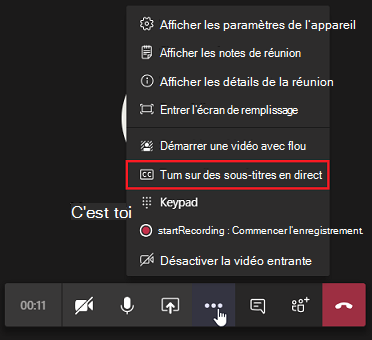

# Paramètres de stratégie de réunion : participants et invités

Ces paramètres contrôlent les participants à la réunion qui attendent dans la salle d’attente avant d’être admis à la réunion et le niveau de participation à une réunion.

- [Autoriser les personnes anonymes à démarrer une réunion](#let-anonymous-people-start-a-meeting)
- [Admettre les personnes automatiquement](#automatically-admit-people)
- [Autoriser les utilisateurs entrants à éviter la salle d’attente](#allow-dial-in-users-to-bypass-the-lobby)
- [Activer les légendes dynamiques](#enable-live-captions)
- [Autoriser la conversation en réunion](#allow-chat-in-meetings)

> [!NOTE]
>Les options permettant de participer à une réunion varient en fonction des paramètres de chaque groupe Teams et de la méthode de connexion. Si votre groupe dispose d’une audioconférence et l’utilise pour se connecter, consultez[Audioconférence](/microsoftteams/audio-conferencing-in-office-365). Si votre équipe n’a pas d’audioconférence, consultez [Participer à une réunion dans Teams](https://support.office.com/article/join-a-meeting-in-teams-1613bb53-f3fa-431e-85a9-d6a91e3468c9).

## Autoriser les personnes anonymes à démarrer une réunion

Ce paramètre est une stratégie par organisateur qui autorise les réunions de conférence rendez-vous sans classement. Ce paramètre détermine si les utilisateurs des appels entrants peuvent rejoindre la réunion sans utilisateur authentifié de l’organisation. Par défaut, ce paramètre est désactivé, ce qui signifie que les utilisateurs rendez-vous patientent dans la salle d’attente jusqu’à ce qu’un utilisateur authentifié de l’organisation rejoigne la réunion.

> [!NOTE]
> Si ce paramètre est désactivé et qu’un utilisateur de participation a rejoint la réunion pour la première fois et est placé dans la salle d’attente, l’utilisateur d’une organisation doit participer à la réunion avec un client Teams pour admettre l’utilisateur de la salle d’attente. Il n’y a pas de contrôle de salle d’attente disponible pour les utilisateurs entrants.

## Admettre les personnes automatiquement

Il s’agit d’une stratégie par organisateur. Ce paramètre contrôle la jointure directe des personnes à une réunion ou l’attente dans la salle d’attente jusqu’à ce qu’elles soient intégrées par un utilisateur authentifié. Ce paramètre ne s’applique pas aux utilisateurs distants.

 Les organisateurs de réunion peuvent cliquer sur **Options de réunion** dans l’invitation à la réunion afin de modifier ce paramètre pour chaque réunion qu’ils planifient.

> [!NOTE]
> Dans les options de la réunion, le paramètre est intitulé « Qui peut ignorer la salle d’attente ». Si vous modifiez le paramètre par défaut pour un utilisateur, celui-ci s’applique à toutes les réunions organisées par cet utilisateur et aux réunions antérieures où l’utilisateur n’a pas modifié les options de la réunion.
  
|Valeur du paramètre  |Comportement de jointure |
|---------|---------|
|**Tout le monde**   |Tous les participants à la réunion joignent directement la réunion sans attendre dans la salle d’attente. Cela inclut les utilisateurs authentifiés, les utilisateurs externes d’organisations approuvées (fédérées), les invités et les utilisateurs anonymes.     |
|**Membres de mon organisation et invités**     |Les utilisateurs authentifiés au sein de l’organisation, y compris les utilisateurs invités, rejoignent la réunion directement sans attendre dans la salle d’attente. Les utilisateurs des organisations de confiance et les utilisateurs anonymes patientent dans la salle d’attente. Il s’agit du paramètre par défaut.    |
|**Membres de mon organisation, organisations de confiance et invités**     |Les utilisateurs authentifiés au sein de l’organisation, y compris les utilisateurs invités et les utilisateurs des organisations approuvées, peuvent participer directement à la réunion sans attendre dans la salle d’attente.  Les utilisateurs anonymes attendent dans la salle d’attente.   |
|**Membres de mon organisation**    |Les utilisateurs authentifiés au sein de l’organisation rejoignent directement la réunion sans attendre dans la salle d’attente.  Des utilisateurs d’organisations de confiance, des utilisateurs invités et des utilisateurs anonymes patientent dans la salle d’attente.          |
|**Organisateur uniquement**    |Seuls les organisateurs de réunion peuvent rejoindre directement la réunion sans attendre dans la salle d’attente. Tous les autres utilisateurs, y compris les utilisateurs authentifiés au sein de l’organisation, les utilisateurs invités, les utilisateurs d’organisations de confiance et les utilisateurs anonymes, doivent patienter dans la salle d’attente. Sur la page Teams d’options de la réunion client, la liste s’affiche en tant que « Moi seul ».          |
|**Utilisateurs invités uniquement**    |Seuls les utilisateurs invités et les organisateurs de la réunion peuvent participer directement à la réunion sans attendre dans la salle d’attente. Tous les autres utilisateurs, y compris les utilisateurs authentifiés au sein de l’organisation, les utilisateurs invités, les utilisateurs d’organisations de confiance et les utilisateurs anonymes, doivent patienter dans la salle d’attente. Dans la page Teams options de réunion client, il s’affiche en tant que « Personnes que j’invite ».          |

## Autoriser les utilisateurs entrants à éviter la salle d’attente

Il s’agit d’une stratégie par organisateur. Ce paramètre contrôle si les personnes qui utilisent le téléphone rejoignent directement la réunion ou attendent dans la salle d’attente, quel que soit le paramètre **Autoriser les personnes automatiquement**. Par défaut, ce paramètre est désactivé. Lorsque ce paramètre est désactivé, les utilisateurs appelants patientent dans la salle d’attente jusqu’à ce qu’un utilisateur de l’organisation rejoigne la réunion avec un client Teams et les accepte. Lorsque ce paramètre est activé, les utilisateurs des appels entrants joignent automatiquement la réunion lorsqu’un utilisateur de l’organisation rejoint la réunion.

> [!NOTE]
> Si un utilisateur connecté rejoint une réunion avant qu'un utilisateur de l'organisation ne la rejoigne, il sera placé dans la salle d'attente jusqu'à ce qu'un utilisateur de l'organisation rejoigne la réunion à l'aide d'un client Teams et l'admette. Si vous modifiez le paramètre par défaut pour un utilisateur, celui-ci s’applique à toutes les réunions organisées par cet utilisateur et aux réunions antérieures où l’utilisateur n’a pas modifié les options de la réunion.

## Activer les légendes dynamiques

Ce paramètre est une stratégie par utilisateur et s’applique pendant une réunion. Ce paramètre détermine si l’option **Activer les légendes dynamiques** est disponible pour l’utilisateur, afin d’activer et de désactiver les légendes dynamiques dans les réunions qu’elle attend.  

|Valeur du paramètre |Comportement  |
|---------|---------|
|**Désactivé, mais l’utilisateur peut remplacer**     | Les sous-titres en direct ne sont pas activés automatiquement pour l’utilisateur pendant une réunion. L’utilisateur voit l’option **Activer les sous-titres en direct** dans le menu débordement (**...**) pour les activer. Il s’agit du paramètre par défaut. |
|**Désactivé**     | Les légendes dynamiques sont désactivées pour l’utilisateur pendant une réunion. L’utilisateur n’a pas la possibilité de les activer.          |

## Autoriser la conversation en réunion

Ce paramètre est un paramètre par participant. Ce paramètre détermine si la conversation de réunion est autorisée pendant la réunion de l’utilisateur.

## Sujets associés

- [Présentation de Teams PowerShell](teams-powershell-overview.md)
- [Attribuer des stratégies à vos utilisateurs](policy-assignment-overview.md)
- [Supprimer la stratégie de réunion Teams RestrictedAnonymousAccess des utilisateurs](meeting-policies-restricted-anonymous-access.md)
