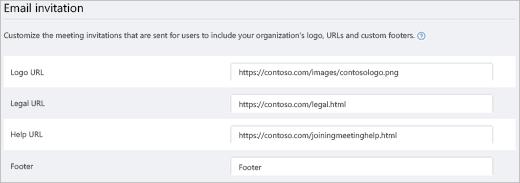

# Gérer les paramètres de réunion dans Microsoft Teams

En tant qu'administrateur, vous utilisez les paramètres de réunions Teams pour contrôler si les utilisateurs anonymes peuvent participer à des réunions Teams, personnaliser des invitations aux réunions et, si vous voulez activer la fonctionnalité Qualité de Service (QoS), configurer les plages de ports pour le trafic en temps réel. Ces paramètres s'appliquent à toutes les réunions Teams que les utilisateurs planifient dans votre organisation. Vous pouvez gérer ces paramètres à partir de **Réunions** > **Paramètres de réunions** dans le Centre d’administration Microsoft Teams.

Grâce à un paramètre de stratégie par organisateur, les administrateurs peuvent désormais contrôler si des utilisateurs spécifiques ou des groupes d’utilisateurs peuvent laisser des utilisateurs anonymes rejoindre les réunions qu’ils organisent. Les paramètres de stratégie par organisateur et à l’échelle de l’organisation contrôlent tous les deux l’adhésion anonyme et l’application la plus restrictive prend effet.

> [!Important]
 > **-DisableAnonymousJoin** is the organization-wide policy setting. It will be deprecated in the future, and then the per-organizer policy will be the only way to control anonymous join.

## Autoriser des utilisateurs anonymes à participer aux réunions

Avec l'association de façon anonyme, tout le monde peut participer à la réunion en tant qu’utilisateur anonyme en cliquant sur le lien dans l’invitation à la réunion. Pour en savoir plus, voir [Rejoindre une réunion sans disposer de compte Teams](https://support.office.com/article/join-a-meeting-without-a-teams-account-c6efc38f-4e03-4e79-b28f-e65a4c039508). Vous pouvez contrôler la capacité des utilisateurs anonymes à participer à des réunions au niveau de votre organisation, ou par organisateur de réunion à l’aide de deux paramètres de stratégie différents.

 ### Utilisation du Centre d’administration Microsoft Teams pour configurer la stratégie à l’échelle de l’organisation

Vous devez être un administrateur Teams pour apporter ces modifications. Voir [Gérer Teams grâce aux rôles d’administrateur Teams](./using-admin-roles.md) afin d’en savoir plus sur l’obtention de rôles et d’autorisations d’administrateur.

1. Accédez au [Centre d’administration Teams](https://admin.teams.microsoft.com).

2. Dans la barre de navigation de gauche, accédez à **Réunions** > **Paramètres de réunions**.

3. Sous **Participants**, activez **Les utilisateurs anonymes peuvent participer à une réunion**.

    

> [!CAUTION]
> Si vous ne voulez pas que les utilisateurs anonymes joignent des réunions planifiées par les utilisateurs de votre organisation, désactivez ce paramètre.

### Utilisation de PowerShell pour configurer la stratégie par organisateur

Les administrateurs peuvent désormais contrôler si des utilisateurs ou des groupes d’utilisateurs spécifiques peuvent autoriser des utilisateurs anonymes à rejoindre les réunions qu’ils organisent. Cette nouvelle stratégie par organisateur est contrôlée à l’aide du paramètre **AllowAnonymousUsersToJoinMeeting** dans [Set-CsTeamsMeetingPolicy](/powershell/module/skype/set-csteamsmeetingpolicy). Cette version est disponible avec Teams PowerShell version 2.6.0 et ultérieure.

Vous pouvez utiliser une stratégie, à l’échelle de l’organisation ou par organisateur, pour gérer la participation anonyme. Nous vous recommandons d’implémenter la stratégie par organisateur. Le paramètre de stratégie à l’échelle de l’organisation sera déconseillé à l’avenir et la stratégie par organisateur sera la seule façon de contrôler la participation anonyme.

Dans la mesure où les stratégies à l’échelle de l’organisation et par organisateur contrôlent la jointure anonyme, le paramètre le plus restrictif sera effectif. Par exemple, si vous n’autorisez pas la participation anonyme au niveau de l’organisation, il s’agira de votre stratégie effective, indépendamment de ce que vous configurez pour la stratégie par organisateur. Par conséquent, pour permettre aux utilisateurs anonymes de participer à des réunions, vous devez configurer les deux stratégies pour autoriser la participation anonyme en définissant les valeurs suivantes :

- **DisableAnonymousJoin** défini sur **$false**
- **AlowAnonymousUsersToJoinMeeting** défini sur **$true**

Toute autre combinaison de valeurs empêche les utilisateurs anonymes de rejoindre des réunions.
> [!NOTE]
> Pour en savoir plus sur la gestion des stratégies de réunion, voir [Gérer les stratégies de réunion dans Microsoft Teams](/microsoftteams/meeting-policies-overview).

### Blocage de la jointure anonyme pour des types de clients spécifiques

Lorsque les utilisateurs anonymes sont autorisés à participer à des réunions, ils peuvent utiliser le client Teams ou un client personnalisé créé à l’aide de [Azure Communication Services](/azure/communication-services/). Les administrateurs peuvent bloquer les types de clients sélectionnés à l’aide du paramètre **-BlockedAnonymousJoinClientTypes** dans [Set-CsTeamsMeetingPolicy](/powershell/module/skype/set-csteamsmeetingpolicy).

Les valeurs possibles sont les suivantes :
- Null (default). All client types are allowed.
- Acs. Blocks custom clients built using [Azure Communication Services](/azure/communication-services/).
- Teams. Blocks the Teams client.

## Autoriser les utilisateurs anonymes à interagir avec les applications dans les réunions

Les utilisateurs anonymes héritent désormais de la stratégie d’autorisation globale par défaut de niveau utilisateur. Ce contrôle permet ensuite aux utilisateurs anonymes d’interagir avec des applications dans les réunions Teams tant que la stratégie d’autorisation au niveau utilisateur permet l’application. Notez que les utilisateurs anonymes peuvent interagir uniquement avec des applications déjà disponibles lors d’une réunion et qu’ils ne peuvent pas les acquérir ni les gérer. 

> [!IMPORTANT]
> Par défaut, le paramètre permettant aux utilisateurs anonymes d’interagir avec les applications dans les réunions est activé.

 **Utiliser le centre d’administration Microsoft Teams**

Vous devez être administrateur du service Teams pour accéder à ce paramètre. Voir [Gérer Teams grâce aux rôles d’administrateur Teams](./using-admin-roles.md) afin d’en savoir plus sur l’obtention de rôles et d’autorisations d’administrateur.

1. Accédez au [Centre d’administration Teams](https://admin.teams.microsoft.com).

2. Dans la barre de navigation de gauche, accédez à **Réunions** > **Paramètres de réunions**.

3. Sous **Participants**, le paramètre **Les utilisateurs anonymes peut interagir avec les applications dans les réunions** peut être modifié.

> [!CAUTION]
> Si vous ne voulez pas que les utilisateurs anonymes interagissent avec les applications dans les réunions programmées par les utilisateurs de votre organisation, désactiver ce paramètre.

## Personnaliser les invitations aux réunions

You can customize Teams meeting invitations to meet your organization's needs. You can add your organization's logo and include helpful information, such as links to your support website and legal disclaimer, and a text-only footer.

### Conseils pour la création d'un logo pour les invitations aux réunions  

1. Créez une image d’une taille inférieure à 188 pixels de large et de 30 pixels de hauteur (très petit).
2. Enregistrez l’image au format JPG ou PNG.
3. Stockez l’image dans un emplacement accessible à tous les destinataires de l’invitation, tels qu’un site web public.

    Now you can add it to your meeting invitations. See the next steps.

### Personnalisez vos invitations à des réunions

 **Utiliser le centre d’administration Microsoft Teams**

1. Accédez au [Centre d’administration Teams](https://admin.teams.microsoft.com).
2. Dans la barre de navigation de gauche, accédez à **Réunions** > **Paramètres de réunions**.
3. Sous **Invitation par e-mail**, procédez comme suit :

    

    - **URL du logo** Entrez l’URL de l'emplacement de votre logo.
    - **URL légale** Si votre organisation a un site web légal auquel vous voulez que les utilisateurs accèdent pour des questions juridiques, entrez l’URL ici.
    - **URL d'aide** Si votre organisation possède un site web d'aide auquel vous voulez que les utilisateurs accèdent lorsqu'ils rencontrent des problèmes, entrez l’URL ici.
    - **Pied de page** Entrer le texte que vous voulez inclure comme pied de page.
4. Cliquez sur **Aperçu l’invitation** pour afficher un aperçu de votre invitation à une réunion.
5. Une fois que vous avez terminé, cliquez sur **Enregistrer**.
6. Patientez une heure pour que les modifications se propagent. Planifiez ensuite une réunion Teams pour visualiser l’invitation à la réunion.  

## Déterminer la façon dont vous voulez gérer le trafic média en temps réel pour les réunions Teams

Si vous utilisez la qualité de service (QoS) pour hiérarchiser le trafic réseau, vous pouvez activer les marqueurs de qualité de service et définir des plages de ports pour chaque type de trafic multimédia. La définition de plages de ports pour différents types de trafic n'est qu'une des étapes dans la gestion des médias en temps réel. Pour plus d’informations, voir [Qualité de service (QoS) dans Teams](qos-in-teams.md).

> [!IMPORTANT]
> Systèmes basés d’Apple : La seule instance que nous connaissons de la façon dont les appareils Apple définissent réellement la valeur DSCP est si toutes les conditions suivantes sont remplies :
> - iOS.
> - Réseau WiFi.
> - Commutateurs Cisco.
> - L’administrateur réseau a ajouté l’application à la liste approuvée.
>
> Systèmes Android : il n’existe aucune limitation connue.
>
> Si vous activez la Qualité de service (QoS) ou si vous modifiez les paramètres dans le centre d’administration Microsoft Teams pour le service Teams, vous devez également [appliquer les paramètres correspondants à tous les appareils d’utilisateurs](QoS-in-Teams-clients.md) et tous les appareils de réseau interne afin d’implémenter totalement les modifications apportées à QoS dans Teams.

  **Utiliser le centre d’administration Microsoft Teams**
1. Accédez au [Centre d’administration Teams](https://admin.teams.microsoft.com).
2. Dans la barre de navigation de gauche, accédez à **Réunions** > **Paramètres de réunions**.
3. Sous **Réseau**, procédez comme suit :

    

    - Pour autoriser l’utilisation des marquages DSCP pour la qualité de service, activer les **marqueurs de qualité de service (QoS)** pour le trafic multimédia en temps réel. Vous avez seulement la possibilité d’utiliser ou de ne pas utiliser des marqueurs. Vous ne pouvez pas créer des marqueurs personnalisés par type de trafic. Pour plus d’informations sur les marqueurs DSCP, voir [Sélectionner une méthode d’implémentation QoS](QoS-in-Teams.md#select-a-qos-implementation-method).

        > [!IMPORTANT]
        > Notez que l’activation de QoS est effectuée uniquement sur les points de terminaison pour le marquage des paquets qui sortant du client. Nous vous recommandons toujours d’appliquer des règles de QoS correspondantes sur tous les périphériques réseau internes pour le trafic entrant.
        
        > [!NOTE]
        > Le balisage DSCP est généralement effectué via les ports source et le trafic UDP acheminera vers le relais de transport avec le port de destination 3478 par défaut. Si votre entreprise exige un marquage sur les ports de destination, contactez le support technique pour activer la communication vers le relais de transport avec les ports UDP 3479 (audio), 3480 (vidéo) et 3481 (partage).
    - To specify port ranges, next to **Select a port range for each type of real-time media traffic**, select  **Specify port ranges**, and then enter the starting and ending ports for audio, video, and screen sharing. Selecting this option is required to implement QoS. 
        > [!Note]
        > If **Quality of Service (QoS) markers for real-time media traffic** is on, then you have to manage your port settings. They aren't managed automatically.
        
        > [!IMPORTANT]
        > Si vous sélectionnez **Utiliser automatiquement les ports disponibles**, les ports disponibles entre 1024 et 65535 sont utilisés. Utilisez cette option uniquement lorsque la Qualité de service n’est pas mise en œuvre.
        >
        > La sélection d’une plage de ports trop réduite entraîne des appels rejetés et une qualité d’appel médiocre. Les recommandations ci-dessous doivent représenter le strict minimum.

Si vous n’êtes pas certain des plages de ports à utiliser dans votre environnement, les paramètres suivants constituent un bon point de départ. Pour en savoir plus, lire [Implémenter la Qualité de service (QoS) dans Microsoft Teams](QoS-in-Teams.md). Ce sont les marquages DSCP nécessaires et les plages suggérées de ports médias correspondantes, utilisées par les Teams et ExpressRoute.

### Plages de ports et marquages DSCP

Type de trafic média| Plage de port source du client \* |Protocole|Valeur DSCP|Classe DSCP|
|:---             |:---                         |:---    |:---      |:---      |
|Audio            | Entre 50 000 et 50 019               |TCP/UDP |46        |Acheminement accéléré (EF)|
|Vidéo            | 50 020–50 039               |TCP/UDP |34        |Acheminement assuré (AF41)|
|Partage d’application/d'écran| 50 040–50 059      |TCP/UDP |18        |Transfert garanti (AF21)|
| | | | |

\* Les plages de ports que vous attribuez ne peuvent pas se chevaucher et doivent être adjacentes.

After QoS has been in use for a while, you'll have usage information on the demand for each of these three workloads, and you can choose what changes to make based on your specific needs. [Call Quality Dashboard](turning-on-and-using-call-quality-dashboard.md) will be helpful with that.
