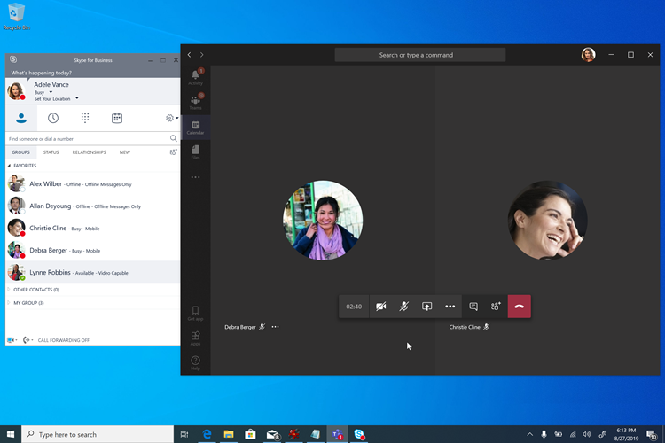
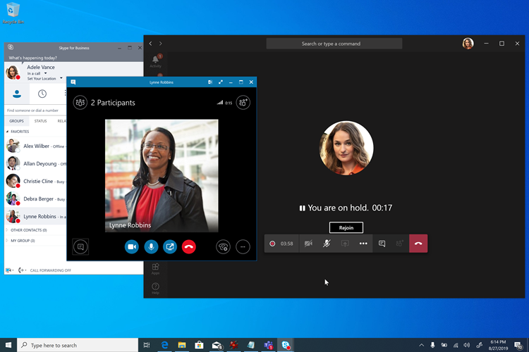
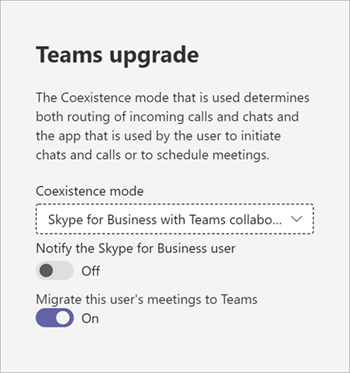

# Commencer par les réunions

La fonction « Réunions en premier » est ciblée et optimisée pour les organisations Skype Entreprise Server ayant des Voix Entreprise locales qui souhaitent commencer à utiliser les réunions Teams aussi rapidement que possible. Pour ces organisations, l’option Réunions en premier est une alternative à l’utilisation du **mode** Îles qui privilégie l’Teams expérience de réunions.

## Qu’est-ce que l’étape Réunions en premier ?

Les réunions sont basées sur le mode de coexistence **SfBWithTeamsCollabAndMeetings.** Les réunions ne sont pas un produit ou une fonctionnalité, mais une configuration qui utilise les fonctionnalités de Teams et Skype Entreprise pour offrir une expérience de coexistence personnalisée.

Dans Réunions tout d’abord, les utilisateurs créent leur réunion dans Teams, tout en continuant à utiliser Skype Entreprise pour la conversation, les appels et la présence. Il n’existe pas de chevauchement des qualités entre Teams et Skype Entreprise. La conversation, les appels et la présence sont en cours Skype Entreprise et en dehors Teams. Cela permet des scénarios uniques de « meilleur ensemble » entre Skype Entreprise et Teams qui améliorent l’expérience de  l’utilisateur lors de la coexistence, ainsi que des scénarios d’interopérabilité avec des utilisateurs Teams seuls.

> [!Important]
> Les réunions sont d’abord un meilleur point de correspondance pour les organisations qui n’ont pas ou Teams utilisateurs de conversation. Les Teams conversation actives ne doivent pas passer en mode Réunions en premier, car ils perdraient la possibilité de discuter dans Teams et d’accéder à leur historique des discussions. Ces utilisateurs doivent être en **mode** Îles et les réunions ne doivent être accordées qu’aux utilisateurs qui ne sont pas encore actifs dans la conversation Teams.

## Qui devez-vous d’abord envisager les réunions ?

Les réunions ont tout d’abord été conçues pour les organisations qui utilisent Skype Entreprise Server avec Voix Entreprise et qui souhaitent accélérer leur déplacement vers les réunions Teams, en particulier celles qui sont particulièrement robustes en ce qui a besoin d’un chemin de mise à niveau géré et Teams.

Pour les organisations complexes ou de grande taille, les migrations voix sont généralement réalisées site par site et peuvent prendre beaucoup de temps( plusieurs années), ce qui entraîne des scénarios de coexistence étendus. Si cette coexistence est en **mode** îles, les utilisateurs auront toujours la choix entre deux solutions de réunion (Skype Entreprise et Teams), ce qui peut se résultatr de confusion ou de sous-estimation. Contrairement aux migrations vocales, les migrations de réunions peuvent généralement être effectuées dans l’ensemble de l’entreprise dans un délai court. Les organisations qui souhaitent basculer complètement vers Teams réunion le plus rapidement possible (sans attendre la fin de leur migration vocale) doivent d’abord envisager de tenir des réunions.

Les réunions peuvent d’abord ne pas être utiles pour les organisations qui n’ont Voix Entreprise utilisateurs. Ces organisations ne doivent pouvoir mettre à niveau vers des réunions **Teams** à mesure qu’elles sont en mesure d’adopter Teams réunion. Il doit d’abord envisager d’ignorer l’étape Réunions.

De plus, l’outil Réunions en premier s’avère utile pour les organisations dont l’étendue est une solution de réunion en lecture seule, par exemple lorsqu’un appel d’offres « réunions uniquement » est émis.

## Fonctionnalités de Réunions en premier

La réunion rassemble tout d’abord les fonctionnalités suivantes :

- [Mettre en service Skype Entreprise Server utilisateur (local)](./tutorial-audio-conferencing.yml?tutorial-step=3) avec l Teams conférence [audio.](tutorial-audio-conferencing.yml)
- Service de [migration](/skypeforbusiness/audio-conferencing-in-office-365/setting-up-the-meeting-migration-service-mms)de réunions : les réunions organisées par l’utilisateur sont migrées vers le cloud et converties en réunions Teams au cours de la promotion de l’utilisateur en Réunions d’abord (nécessite Exchange Online).
- Expérience utilisateur rationalisée dans Teams, centrée sur Teams réunions et équipes et canaux (qui peuvent éventuellement être masqués à l’aide de la stratégie [Autorisations d’application)](teams-app-permission-policies.md); Teams conversation [privée,](teams-client-experience-and-conformance-to-coexistence-modes.md) les appels et l’auto-présence ne sont pas exposés dans Meetings First, ce qui permet aux efforts de déploiement et d’adoption de se concentrer entièrement sur les réunions.
- Supérieur [Teams expérience en réunion.](tutorial-meetings-in-teams.yml)
- « Better Together » entre Teams et Skype Entreprise : 
  - Mise en attente automatique : lors d’une réunion dans Teams, la prise en main d’Skype Entreprise place la réunion Teams en attente, et inversement. Cela empêche les utilisateurs de faire entendre leurs appels privés entendus par les participants à la réunion.
    
  - Rapprochement des informations de présence : l’activité Teams se reflète dans la présence de l’utilisateur, qui est la Skype Entreprise étant donné que les discussions et les appels sont Skype Entreprise. Plus précisément, lorsque les premiers utilisateurs de Réunions sont Teams réunion, leur présence est mise à jour pour refléter cela. Lorsqu’il présente son écran, sa présence est mise à jour pour afficher ne pas déranger (en fonction de ses paramètres Skype Entreprise).
  - Rapprochement des contrôles HID d’appareil USB (également disponible sur Mac) : les contrôles HID sont honorés par Teams lors de réunions Teams et par Skype Entreprise dans toutes les autres circonstances.
  - Sauf mention contraire, les fonctionnalités Better Together nécessitent la Windows clients de bureau récents pour le moment.

## Conditions préalables pour les réunions en premier

Les seules conditions difficiles à requises pour les réunions En premier sont les mêmes que pour les Teams avec Active Directory local et un déploiement Skype Entreprise sur site :

- [Conditions préalables générales pour l’Teams,](upgrade-plan-journey-prerequisites.md)notamment
- [Identité et authentification dans Teams](identify-models-authentication.md) et
- [Configurez Azure Active Directory pour Teams et Skype Entreprise.](/skypeforbusiness/hybrid/configure-azure-ad-connect)

Une [Skype Entreprise topologie hybride](/skypeforbusiness/hybrid/configure-federation-with-skype-for-business-online) n’est pas nécessaire, mais elle est recommandée. Certaines fonctionnalités, telles que le service de migration de réunions et l’interopérabilité, dépendent de cette topologie.

Meetings First est pris en charge avec n’importe quelle version Skype Entreprise Server (et connue pour fonctionner avec Lync Server non pris en charge). Il est pris en charge avec n’importe Skype Entreprise client, mais les fonctionnalités Better Together nécessitent un client récent.

Une fois ces exigences remplies (et non antérieures), les utilisateurs peuvent être titulaires d Microsoft 365 licences ou [Office 365 et Teams.](/office365/enterprise/assign-licenses-to-user-accounts)

Pour une première expérience de réunion la plus grande possible, les utilisateurs doivent être activés pour créer des groupes [Exchange Online,](exchange-teams-interact.md) [SharePoint Online et OneDrive Entreprise](sharepoint-onedrive-interact.md)et Microsoft 365 groupe. L’outil Réunions en premier est pris en charge pour les utilisateurs dont la boîte aux lettres est Exchange en local, ou qui n’ont pas SharePoint Online ou OneDrive Entreprise, ou qui Microsoft 365 de création de groupes. Leur expérience sera toutefois moins complète. En particulier, pour les organisations qui utilisent Exchange Server localement, il peut y avoir (selon la version d’Exchange Server) certaines limitations à la création et à l’affichage des réunions à partir du client Teams, ainsi qu’aux fonctionnalités de conformité.

Au minimum, les utilisateurs doivent avoir [une licence pour Teams.](/microsoft-365/admin/manage/assign-licenses-to-users) En outre, elles peuvent être titulaires d’une licence [d’audioconférence,](set-up-audio-conferencing-in-teams.md)si nécessaire.

Nous vous recommandons [d’accorder le mode **client SfBOnly** ou **SfBWithTeamsCollab**](/powershell/module/skype/grant-csteamsupgradepolicy?view=skype-ps) par défaut au moment où vous accordez une licence aux utilisateurs. Cela garantit que les utilisateurs ne commenceraient pas à utiliser Teams par eux-mêmes en **mode** Îles par défaut avant que vous ne soyez prêt à lancer les réunions tout d’abord.

Meetings First est pris en charge sur les clients de bureau complets (Windows et Mac), sur les clients de navigateur et sur les clients mobiles. Il est également compatible avec [Salles Microsoft Teams.](/microsoftteams/room-systems/) Better Together nécessite le client de bureau complet.

## Se préparer Teams réunions au cours de réunions en premier

Pour que vos utilisateurs offrent la meilleure expérience possible lors Teams réunions, vous devez :

- Suivez les [étapes de réunions et de conférences](deploy-meetings-microsoft-teams-landing-page.md)pour Microsoft Teams, en particulier.
- [Évaluez votre environnement.](3-envision-evaluate-my-environment.md)
- [Préparez le réseau de votre organisation pour l’Microsoft Teams.](prepare-network.md)
- Mettre à niveau vos salles de réunion à l’Teams des [solutions](/skypeforbusiness/certification/devices-meeting-rooms?bc=%2fmicrosoftteams%2fbreadcrumb%2ftoc.json&toc=%2fMicrosoftTeams%2ftoc.json)et appareils de salle de réunion capables, ou utilisez [Cloud Video Interop](cloud-video-interop.md) pour Microsoft Teams pour permettre à vos salles et appareils tiers existants de participer à Teams réunions.
- Équipez vos utilisateurs [de périphériques audio et vidéo USB certifiés.](/skypeforbusiness/certification/devices-usb-devices?bc=%2fmicrosoftteams%2fbreadcrumb%2ftoc.json&toc=%2fMicrosoftTeams%2ftoc.json)
- Préparez-vous [à stimuler la sensibilisation et l’adoption pour Teams réunions.](adopt-microsoft-teams-landing-page.md)
- [Planifiez votre gestion des services.](4-envision-plan-my-service-management.md)
- Familiarisez-vous avec les rapports d’analyse des appels [enrichis pour résoudre les problèmes de qualité des appels.](use-call-analytics-to-troubleshoot-poor-call-quality.md)

À ce stade, vous pouvez envisager d’exécutez un pilote prêt pour la production d’échelle modérée.

## Configurer d’abord les utilisateurs pour les réunions

Une fois que vous avez autorisé vos utilisateurs et préparé votre organisation pour Teams réunions, il est temps d’activer d’abord vos utilisateurs pour les réunions. Nous avons fait en sorte que tout soit facile : un seul paramètre vous permettra d’y voir plus facilement.

Toutes les fonctionnalités et expériences utilisateur dans Les réunions tout d’abord, y compris la configuration du client Teams et la [conformité](teams-client-experience-and-conformance-to-coexistence-modes.md) automatique de l’expérience utilisateur, le service de migration de réunions et les fonctionnalités Better Together, sont configurées en octroyant à l’utilisateur (ou au groupe d’utilisateurs ou au client par défaut) le mode de [coexistence SfBWithTeamsCollabAndMeetings,](setting-your-coexistence-and-upgrade-settings.md) soit dans le Centre d’administration [Microsoft Teams,](manage-teams-in-modern-portal.md) soit à l’aide [de PowerShel l](/powershell/module/skype/grant-csteamsupgradepolicy?view=skype-ps).

Si vous le souhaitez, vous pouvez masquer l’application Teams et Canaux dans le navigation gauche du client Teams de vos utilisateurs pour concentrer davantage leur expérience sur les réunions, ce qui peut être obtenu à l’aide de la stratégie de configuration de l’application.

## Rapports et analyse des appels

Les rapports et les données d’Teams les réunions dans Réunions sont tout d’abord inchangées par rapport à ce qu’elles sont dans les autres modes.

## Liens connexes

Après avoir consulté cet article, vous souhaiterez peut-être consulter les recommandations de mise à [niveau,](upgrade-and-coexistence-of-skypeforbusiness-and-teams.md)de migration et [d’interopérabilité,](migration-interop-guidance-for-teams-with-skype.md)et de [coexistence](coexistence-chat-calls-presence.md) avec Skype Entreprise pour plus d’informations.
