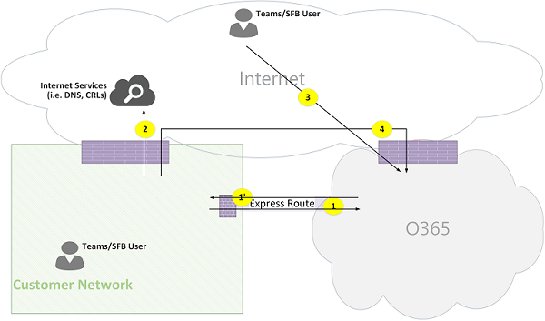

# Flux des appels équipes Microsoft OnlineMicrosoft Teams Online Call Flows

## Vue d’ensembleOverview
Ce document décrit comment la charge de travail équipes utilise Office 365 flux dans diverses topologies.This document describes how Teams workload utilizes Office 365 flows in various topologies. En outre, il spécifie uniques flux équipes qui sont utilisés pour les communications multimédias d’égal à égal.In addition, it specifies unique Teams flows that are used for peer to peer media communication. Le document énumère ces flux et décrit leurs rôles et leurs réseaux d’origine et d’arrêt.The document enumerates these flows and describes their purpose and their origin/termination networks. Par exemple, flux de X est utilisé par le client Office 365 sur site pour communiquer avec le service Office 365 dans le nuage, à l’origine à partir du réseau client et se termine par un point de terminaison dans le nuage Office 365, et flux Y est utilisé par le client Office 365 sur site pour communiquer avec un service sur Internet, Office 365 a un lien de dépendance, à l’origine à partir du réseau client et se termine par un point de terminaison sur Internet.For example, flow X is used by Office 365 client on premises to communicate with Office 365 service in the cloud, originated from the Customer Network and terminated by an endpoint in Office 365 cloud, and flow Y is used by Office 365 client on premises to communicate with a service on the Internet, that Office 365 has dependency on, originated from the Customer Network, and is terminated by an endpoint on the Internet.

Le document a trois sections principales.The document has three main sections. La première fournit un plus d’informations, telles que les réseaux (qui peuvent traverser les flux d’Office 365), le type de trafic, conseils de connectivité réseau du client pour les points de terminaison de service Office 365, l’interopérabilité avec les composants de tiers et principaux qui sont utilisés par les équipes pour sélectionner les flux multimédias.The first provides a background information, such as networks (that Office 365 flows may traverse), type of traffic, connectivity guidance from Customer Network to Office 365 service endpoints, interoperability with third party components and principals that are used by Teams to select media flows. La seconde illustre l’utilisation de ces flux dans diverses topologies.The second illustrates the usage of these flows in various topologies. Pour chaque topologie, elle énumère tous les flux pris en charge et illustre l’utilisation de ces flux via plusieurs cas d’utilisation.For each topology, it enumerates all supported flows and illustrates how these flows are used via several use cases. Pour chaque cas d’utilisation, il décrit la séquence et la sélection de flux par le biais d’un diagramme de flux.For each use case, it describes the sequence and selection of flows via a flow diagram. Le troisième décrit comment ces flux est utilisés lors de l’itinéraire Express est déployée pour l’optimisation, illustrée par le biais d’une topologie simple.The third describes how these flows are utilized when Express Route is deployed for optimization, illustrated via a simple topology.

## Arrière-planBackground
### Segments réseauNetwork Segments
**Réseau client**: il s’agit du segment de réseau qui fait partie de votre réseau global que vous pouvez contrôler et gérer.**Customer Network**: This is the network segment that is part of your overall network that you control and manage. Cela inclut toutes les connexions client au sein de bureaux client, si avec ou sans fil, entre bâtiments, aux centres de données locale et vos connexions à Internet fournisseurs itinéraire Express ou tout autre peering privé.This includes all customer connections within customer offices, whether wired or wireless, between office buildings, to on-premises datacenters, and your connections to Internet providers, Express Route or any other private peering. 

En règle générale, un réseau client a plusieurs périmètres réseau avec pare-feu et/ou serveurs proxy, auquel appliquer les stratégies de sécurité d’une organisation et qui n’accepte que certain le trafic réseau que vous avez installé et configuré.Typically, a customer network has several network perimeters with firewalls and/or proxy servers, which enforce an organization's security policies and that only allow certain network traffic that you have set up and configured. Étant donné que le client gère ce réseau, le client a un contrôle direct sur les performances du réseau et il est fortement recommandé que le client complète réseau conclusion pour valider les performances dans les sites de votre réseau et à partir de votre réseau au réseau d’Office 365.Because the customer manages this network, the customer has direct control over the performance of the network, and it is highly recommended that the customer complete network assessments to validate performance both within sites in your network and from your network to Office 365 network. Skype pour Business sur le déploiement local et PSTN Session Border Controller de se connecter à PSTN via votre réseau (par exemple, de routage Direct) sont facultatives.Skype for Business on premises deployment and PSTN Session Border Controller to connect with PSTN through your network (i.e., Direct Routing) are optional.

**Internet**: il s’agit du segment de réseau qui fait partie de votre réseau global qui sera utilisé par les utilisateurs qui sont connectent au Cloud de 365 Office à partir d’en dehors du réseau client.**Internet**: This is the network segment that is part of your overall network that will be used by users who are connecting to Office 365 Cloud from outside of the Customer Network. Il est également utilisé par certains types de trafic entre le réseau du client vers Office 365 nuage.It is also used by some traffic from the Customer Network to Office 365 Cloud. 

**Réseau privé visité/invité**: il s’agit du segment de réseau à l’extérieur de votre réseau du client, mais pas dans l’Internet public, qui leurs invités et/ou de vos utilisateurs peuvent visiter.**Visited/Guest private Network**: This is the network segment outside your Customer Network, but not in the public Internet, that your users and/or their guests may visit. Par exemple, réseau privé ou un réseau privé d’entreprise, qui ne déploie pas les équipes, où leurs clients qui interagissent avec les services d’équipes, et/ou de vos utilisateurs peuvent résider.For example, home private network or an Enterprise private Network, that does not deploy Teams, where your users and/or their customers that interact with Teams services, may reside.

>**Remarque**: la connectivité à Office 365b est également applicable à ces réseaux.**Note**: Connectivity to Office 365b is also applicable to these networks.

**Office 365 Cloud**: il s’agit du segment de réseau qui prend en charge des services Office 365.**Office 365 Cloud**: This is the network segment that supports Office 365 services. Il est distribué dans le monde entier avec bords à proximité de réseau du client dans la plupart des emplacements.It is distributed worldwide with edges in proximity to Customer Network in most locations. Fonctions mentionnées dans ce document incluent le relais de Transport, serveur de conférence et processeur média.Functions mentioned in this document include Transport Relay, conferencing server and Media Processor. 

**Itinéraire Express (facultatif)**: il s’agit du segment de réseau qui fait partie de votre réseau global qui offre une connexion privée dédiée au réseau Office 365.**Express Route (Optional)**: This is the network segment that is part of your overall network that will give you a dedicated, private connection to the Office 365 network.

### Types de traficTypes of traffic

**Médias en temps réel**: données encapsulées dans RTP (Real-Time Transport Protocol) et prend en charge les paramètres audio, vidéo et partage des charges de travail de l’écran.**Real-time media**: Data encapsulated within RTP (Real-time Transport Protocol) and supports audio, video and screen sharing workloads. En règle générale, le trafic multimédia est hautement latence sensible, vous pouvez ce trafic à prendre le chemin le plus direct possible et à utiliser UDP et TCP comme protocole de couche de transport, qui est le meilleur transport multimédias interactifs en temps réel à partir du point de vue de la qualité.In general, media traffic is highly latency sensitive, so you would want this traffic to take the most direct path possible, and to use UDP versus TCP as the transport layer protocol, which is the best transport for interactive real time media from quality perspective. (Remarque : en dernier ressort, media utilisent le protocole TCP/IP et également être effectuée dans le protocole HTTP, mais il n’est pas recommandé en raison des implications en matière de mauvaise qualité.) Flux RTP est sécurisée par le biais du protocole SRTP, dans lequel seule la charge utile est chiffrée.(Note: As a last resort, media can use TCP/IP and also be tunneled within HTTP protocol, but it is not recommended due to bad quality implications.) RTP flow is secured via SRTP, in which only the payload is encrypted.

**Signalisation**: la liaison de communication entre le client et serveur ou d’autres clients qui sont utilisés pour contrôler les activités (par exemple, lorsqu’un appel est lancé) et remettre des messages instantanés.**Signaling**: The communication link between the client and server, or other clients that are used to control activities (for example, when a call is initiated), and deliver instant messages. Trafic de signalisation plus utilise les interfaces REST basée sur HTTPS, cependant, dans certains scénarios (par exemple, la connexion entre Office 365 Cloud et un contrôleur de Session en périphérie) utilise le protocole SIP.Most signaling traffic uses the HTTPS-based REST interfaces, though in some scenarios (for example, connection between Office 365 Cloud and a Session Border Controller) uses SIP Protocol. Il est important de comprendre que ce trafic est beaucoup moins sensible à la latence, mais peut entraîner des pannes de service ou de délais d’attente des appels si la latence entre les points de terminaison dépasse quelques secondes.It's important to understand that this traffic is much less sensitive to latency but may cause service outages or call timeouts if latency between the endpoints exceed several seconds. 

### Connectivité à Office 365Connectivity to Office 365

Les équipes service nécessite une [connectivité à Internet](https://support.office.com/article/connectivity-to-the-internet-64b420ef-0218-48f6-8a34-74bb27633b10).Teams service requires [connectivity to the Internet](https://support.office.com/article/connectivity-to-the-internet-64b420ef-0218-48f6-8a34-74bb27633b10). Points de terminaison équipes URL et IP de plages d’adresses sont répertoriés dans [Office 365 URL et plages d’adresses IP](https://docs.microsoft.com/office365/enterprise/urls-and-ip-address-ranges).Teams endpoints URLs and IP address ranges are listed in [Office 365 URLs and IP address ranges](https://docs.microsoft.com/office365/enterprise/urls-and-ip-address-ranges). (Remarque : il a besoin pour ouvrir la connectivité à des ports TCP 80 et 443 et 3478 3481 via des ports UDP.) En outre, service équipes a dépendance sur Skype pour le service en ligne d’entreprise, par conséquent, il est nécessaire pour se connecter également ce service à Internet.(Note: It requires to open connectivity to TCP ports 80 and 443 and UDP ports 3478 through 3481.) Furthermore, Teams service has dependency on Skype for business online service, hence it is required to connect also this service to the Internet.

Connectivité des équipes médias flux est implémentée par le biais des procédures standard IETF ICE (Interactive Connectivity Establishment).Teams media flows connectivity is implemented via standard IETF ICE (Interactive Connectivity Establishment) procedures.

### Restrictions d’interopérabilitéInteroperability Restrictions
**Relais multimédia tiers**: flux de médias A équipes (autrement dit, un des points de terminaison multimédia est équipes) peut traverser les équipes ou Skype pour relais multimédia d’origine de Business.**Third party media relays**: A Teams media flow (i.e., one of the media endpoints is Teams) may traverse only Teams or Skype for Business native media relays. Interopérabilité avec relais multimédia tiers n’est pas pris en charge.Interoperability with a third party media relay is not supported. (Remarque : une tierce partie SBC sur la limite de PSTN doit se terminer le flux RTP/RTCP, sécurisé via le protocole SRTP et pas les relais vers le tronçon suivant.)(Note: A third party SBC on the boundary with PSTN MUST terminate RTP/RTCP stream, secured via SRTP, and not relay it to the next hop.)

**Serveurs de Proxy SIP tiers**: équipes A signalisation SIP de boîte de dialogue avec une tierce partie SBC et/ou de la passerelle peut parcourir les équipes ou Skype pour les proxys SIP natifs d’entreprise.**Third party SIP Proxy Servers**: A Teams signaling SIP dialog with a third party SBC and/or Gateway may traverse Teams or Skype for Business native SIP proxies. Interopérabilité avec une tierce partie Proxy SIP n’est pas pris en charge.Interoperability with a third party SIP Proxy is not supported.

**B2BUA tiers (autrement dit, SBC)**: flux de médias A équipes à partir de/à PSTN se termine par une tierce partie SBC.**Third party B2BUA (i.e., SBC)**: A Teams media flow from/to PSTN is terminated by a third party SBC. Toutefois, l’interopérabilité avec des tiers SBC au sein du réseau d’équipes (autrement dit, le tiers SBC gère la deux points de terminaison équipes/Skype pour Business) n’est pas pris en charge.However, interoperability with a third party SBC within Teams network (i.e., third party SBC mediates two Teams/Skype For Business endpoints) is not supported.

### Technologies fortement déconseillés avec Microsoft TeamsTechnologies that are strongly not recommended with Microsoft Teams

**Réseau VPN**: il est fortement déconseillé pour le trafic multimédia (autrement dit, le flux 2 »).**VPN Network**: It is strongly not recommended for media traffic (i.e., flow 2'). Client de réseau privé virtuel doit utiliser fractionné VPN et le routage du trafic multimédia comme n’importe quel utilisateur externe non VPN, tel que spécifié danshttps://blogs.technet.microsoft.com/nexthop/2011/11/14/enabling-lync-media-to-bypass-a-vpn-tunnel/VPN client SHOULD use split VPN and route media traffic like any external non-VPN user, as specified in https://blogs.technet.microsoft.com/nexthop/2011/11/14/enabling-lync-media-to-bypass-a-vpn-tunnel/ 

>**Remarque**: bien que le titre Lync, il est également applicable aux équipes.**Note**: Although the title is Lync, it is applicable to Teams as well.

**Paquet agressives**: n’importe quel type de snippers de paquets, l’inspection des paquets ou périphériques de mise en forme de paquets sont vivement déconseillée et peut dégrader considérablement la qualité.**Packet Shapers**: Any kind of packet snippers, packet inspection, or packet shaper devices are strongly not recommended and may degrade quality significantly. 

### PrincipesPrinciples
Il existe quatre principes généraux qui vous aident à comprennent les flux d’appels pour Microsoft Teams.There are four general principles that help you understand call flows for Microsoft Teams. 
1.  Une conférence Microsoft Teams est hébergée par le nuage Office 365 dans la même zone où le premier participant rejoint.A Microsoft Teams conference is hosted by Office 365 cloud in the same region where the first participant joined. (Remarque : si sera exceptions à cette règle dans des topologies, puis ils sont décrits dans ce document, illustré par un flux d’appels appropriée.)(Note: If there will be exceptions to this rule in some topologies, then they will be described in this document, illustrated by an appropriate call flow.)
2.  Un équipes multimédia du point de terminaison (MP) dans Office 365 dans le nuage est utilisé en fonction des besoins de traitement de support et non basés sur le type d’appel.A Teams media endpoint (MP) in Office 365 cloud is used based on media processing needs and not based on call type. (Par exemple, un appel point à point peut utiliser un point de terminaison multimédia dans le nuage pour processus multimédia pour transcription et/ou d’enregistrement, pendant une conférence avec deux participants ne pouvez pas utiliser un point de terminaison multimédia dans le nuage.) Toutefois, la plupart des conférences utilisera un Pack d’administration pour le mixage et de routage, allouée où se trouve la conférence.(For example, a point to point call may use a media endpoint in the cloud to process media for transcription and/or recording, while a conference with two participants may not use any media endpoint in the cloud.) However, most conferences will use an MP for mixing and routing purposes, allocated where the conference is hosted. Le trafic multimédia envoyé à partir d’un client au panneau de gestion peuvent être acheminés directement ou utiliser un relais de Transport, dans Office 365 nuage, si nécessaire, en raison de restrictions de pare-feu réseau du client.The media traffic sent from a client to the MP may be routed directly or use a Transport Relay, in Office 365 Cloud, if required due to Customer Network firewall restrictions. 
3.  Pour le trafic multimédia pour les appels d’égal à égal prennent l’itinéraire plus direct qui n’est disponible, en supposant que l’appel n’impose un Pack d’administration dans le nuage (voir #2 ci-dessus).Media traffic for peer-to-peer calls take the most direct route that is available, assuming that the call doesn't mandate an MP in the cloud (see #2 above). L’itinéraire par défaut est directe à l’homologue à distance (client), mais si cet itinéraire n’est pas disponible, un ou plusieurs relais Transport sera relayer le trafic.The preferred route is direct to the remote peer (client), but if that route isn't available, then one or more Transport Relays will relay traffic. Il est recommandé que le trafic multimédia ne doit pas Portrait serveurs tels qu’agressives de paquets, les serveurs VPN, etc., car cela aura une incidence sur la qualité des médias.It is recommended that media traffic shall not transverse servers such as packet shapers, VPN servers, etc., since this will impact the media quality.
4.  Toujours le trafic de signalisation atteint le serveur à l’utilisateur le plus proche.Signaling traffic always goes to the closest server to the user. 

Pour en savoir plus sur les détails sur le chemin d’accès de média est choisi, voir https://www.youtube.com/watch?v=aD5mUg2ZzLQ.To learn more about the details on the media path that is chosen, see https://www.youtube.com/watch?v=aD5mUg2ZzLQ.

## Flux d’appels dans diverses TopologiesCall Flows in Various Topologies
### Les équipes de topologie (« pure ») en ligneTeams Online ("pure") Topology
Cette topologie est utilisée par les clients qui exploitent les services des équipes du nuage sans déployer de n’importe quel serveur, telles que Skype pour les entreprises et SBC pour le routage Direct, en local.This topology is used by customers that leverage Teams services from the cloud without deploying any server, such as Skype for business and SBC for Direct Routing, on premises. En outre, l’interface vers Office 365 s’effectue par le biais d’Internet sans itinéraire Azure Express.In addition, the interface to Office 365 is done via the Internet without Azure Express Route. 

*Figure 1 : topologie (« pure ») en ligne équipes**Figure 1 - Teams Online ('pure') Topology*

>**Notes**:**Notes**:
>- La direction des flèches dans le diagramme ci-dessus reflète la direction d’initiation de la communication qui affecte la connectivité au périmètre d’entreprise.The direction of the arrows on the diagram above reflect the initiation direction of the communication that affects connectivity at the enterprise perimeters. Dans le cas de UDP pour le média, le premier paquet peut flux dans le sens inverse, mais ces paquets peuvent être bloquées jusqu'à ce que le flux des paquets dans le sens inverse.In the case of UDP for media, the first packet(s) may flow in the reverse direction, but these packets may be blocked until packets in the other direction will flow.
>- Équipes Online est déployé en côte à côte Skype pour Business Online, par conséquent, les clients sont affichés sous forme de « Utilisateur équipes/SFB ».Teams Online is deployed side by side with Skype for Business Online, hence clients are displayed as "Teams/SFB user".

- Skype facultatif pour les entreprises de déploiement local est décrit dans ce document dans la section **Topologie hybride en ligne d’équipes**Optional Skype for Business on premises deployment is described in this document in the section **Teams Online Hybrid Topology**
- Facultatif routage Direct PSTN est décrit dans ce document dans la section **Équipes en ligne avec la topologie de routage Direct**Optional Direct Routing for PSTN is described in this document in the section **Teams Online with Direct Routing Topology**
- Facultatif Express itinéraire est décrit dans ce document dans la section **équipes avec optimisation d’itinéraire Express**Optional Express Route is described in this document in the section **Teams w/ Express Route optimization**

**Flux de Descriptions**:**Flows Descriptions**:
- **Flux 2** – représente un flux initié par un utilisateur sur le réseau du client à Internet dans le cadre de son expérience des équipes.**Flow 2** – Represents a flow initiated by a user on Customer Network to the Internet as a part of his Teams experience. DNS et le support d’égal à égal sont des exemples de ces flux.Examples of these flows are DNS and peer to peer media.
- **Flux 2'** – représente un flux initié par un utilisateur équipes mobile à distance au client réseau VPN.**Flow 2'** – Represents a flow initiated by a remote mobile Teams user, which VPN to Customer Network. 
- **Flux de 3** – représente un flux initié par un utilisateur mobile équipes de points de terminaison Office 365/Teams.**Flow 3** – Represents a flow initiated by a remote mobile Teams user to Office 365/Teams endpoints. 
- **Flux 4** – représente un flux initié par un utilisateur sur le réseau du client pour les systèmes d’extrémité Office 365/Teams.**Flow 4** – Represents a flow initiated by a user on the Customer Network to Office 365/Teams endpoints.
- **Flux de 5** – représente un flux multimédias d’égal à égal entre utilisateurs équipes et une autre équipes ou Skype pour les utilisateurs professionnels, au sein du réseau du client.**Flow 5** – Represents a peer to peer media flow between Teams user and another Teams or Skype for Business user, within Customer Network.
- **Flux de 6** – représente un support d’égal à égal entre un utilisateur équipes mobile à distance et une autre à distance des équipes mobiles ou Skype pour les utilisateurs professionnels, de flux sur Internet.**Flow 6** – Represents a peer to peer media flow between a remote mobile Teams user and another remote mobile Teams or Skype for Business user, over the Internet.

#### Cas d’utilisation : conversationUse Case: One-to-one
Appels univoque utilisent un modèle commun de que l’appelant obtiendra un ensemble de candidats constitué des adresses IP/port ; local, relais et réfléchis (adresse IP publique du client, comme indiqué par le relais).One-to-one calls use a common model the caller will obtain a set of candidates consisting of IP addresses/ports; local, relay, and reflexive (public IP address of client as seen by the relay). L’appelant envoie ces candidats à la partie appelée dans l’invitation, l’appelé également Obtient un ensemble de candidats similaire et les envoie à l’appelant.The caller sends these candidates to the called party in the invite, the called party also obtains a similar set of candidates and sends them to the caller. Vérification de la connectivité STUN messages sont utilisés pour rechercher l’appelant/appelé multimédia utiliser des chemins d’accès et le chemin d’accès de travail meilleures est sélectionné.STUN connectivity check messages are used to find which caller/called party media paths work, and the best working path is selected. Multimédia (autrement dit, des paquets RTP/RTCP sécurisés via le protocole SRTP) est envoyées à l’aide de la paire de candidat sélectionné.Media (i.e., RTP/RTCP packets secured via SRTP) are then sent using the selected candidate pair. Le relais de Transport est déployé dans le cadre du nuage Office 365.The Transport relay is deployed as part of the Office 365 Cloud.

Si l’adresse IP locale adresse/port candidats ou les candidats réflexives disposent d’une connectivité, puis le chemin d’accès direct entre les clients (ou via un NAT) est sélectionné pour le média.If the local IP address/port candidates or the reflexive candidates have connectivity, then the direct path between the clients (or via a NAT) will be selected for media. Si les clients se trouvent sur le réseau du client, le chemin d’accès direct doit être sélectionné.If the clients are both on the Customer network, then the direct path should be selected. Cela nécessite une connectivité UDP directe dans le réseau du client.This requires direct UDP connectivity within the Customer Network. Si les clients sont les deux utilisateurs nomades dans le nuage, puis selon le NAT/Pare-feu, media peut utiliser une connexion directe.If the clients are both nomadic cloud users, then depending on the NAT/firewall, media may use direct connectivity.

Si un client est interne sur le réseau du client et un client externe (par exemple, l’utilisateur mobile en nuage), puis il est peu probable que la connectivité directe entre les candidats locales ou réflexives fonctionne.If one client is internal on the Customer Network and one client is external (e.g., mobile cloud user), then it is unlikely that direct connectivity between the local or reflexive candidates is working. Dans ce cas, une option consiste à utiliser une des candidats relais de Transport à partir d’un client (par exemple, le client interne obtenu un candidat relais à partir du relais de Transport dans Office 365 nuage, le client externe doit être en mesure d’envoyer des paquets STUN/RTP/RTCP pour le relais de transport).In this case, an option is to use one of the Transport Relay candidates from either client (e.g., the internal client obtained a relay candidate from the Transport relay in Office 365 Cloud, the external client needs to be able to send STUN/RTP/RTCP packets to the transport relay). Une autre option est que le client interne envoie le candidat de relais obtenu par le client mobile dans le nuage.Another option is the internal client sends to the relay candidate obtained by the mobile cloud client. Notez que bien qu’est vivement recommandée de connectivité UDP pour le média, TCP est pris en charge.Note that although UDP connectivity for media is highly recommended, TCP is supported.

**Étapes principales**:**High Level Steps**:
1. L’utilisateur A résout URL nom de domaine (DNS) via Flux2 des équipesTeams User A resolves URL domain name (DNS) via flow2
2. Les équipes utilisateur A alloue un support port relais équipes Transport relais via le flux 4Teams User A allocates a media Relay port on Teams Transport Relay via flow 4
3. Des équipes de l’utilisateur A envoie « inviter » avec les candidats ICE via flux 4 vers Office 365Teams User A sends "invite" with ICE candidates via flow 4 to Office 365
4. OFFICE 365 envoie une notification à l’utilisateur d’équipes B par le biais du flux de 4OFFICE 365 sends notification to Teams User B via flow 4
5. Les équipes utilisateur B alloue un support port relais équipes Transport relais via le flux 4Teams User B allocates a media Relay port on Teams Transport Relay via flow 4
6. Équipes utilisateur B renvoie « réponse » avec les candidats ICE via flux 4, qui est renvoyé à l’utilisateur équipes A via le flux de 4Teams User B sends "answer" with ICE candidates via flow 4, which is forwarded back to Teams User A via Flow 4
7. Équipes utilisateur A et équipes utilisateur B appeler des tests de connectivité ICE et le chemin d’accès de supports disponibles meilleures est sélectionnée (voir les diagrammes ci-dessous pour différents cas d’utilisation)Teams User A and Teams User B invoke ICE connectivity tests and the best available media path is selected (see diagrams below for various use cases)
8. Les utilisateurs des équipes envoient télémétrie vers Office 365 par flux 4Teams Users send telemetry to Office 365 via flow 4

**Au sein du réseau client :****Within Customer Network:**

*Figure 2 : au sein du réseau de client**Figure 2 - Within Customer Network*
 
À l’étape 7, les flux multimédias « d’égal à égal » 5 est sélectionnéeIn step 7, "peer to peer" media flow 5 is selected 
>**Remarque**: multimédia est bidirectionnel.**Note**: Media is bidirectional. La direction du flux 5 indique qu’un côté établit la communication de la connectivité du point de vue, compatible avec tous les flux dans ce document.The direction of flow 5 indicates that one side initiates the communication from connectivity perspective, consistent with all the flows in this document. Dans ce cas, peu importe la direction dans laquelle est utilisée, car les deux points de terminaison sont dans le réseau du client.In this case, it doesn't matter which direction is used because both endpoints are within the Customer Network.

**Réseau du client pour les utilisateurs externes (media relayés par les équipes Transport relais) :****Customer Network to External User (media relayed by Teams Transport Relay):**

*La figure 3 - réseau du client pour les utilisateurs externes (media relayés par les équipes Transport relais)**Figure 3 - Customer Network to External User (media relayed by Teams Transport Relay)*
 
À l’étape 7, les flux de réseau du client vers Office 365, 4 et les flux de 3, les utilisateurs distants équipes mobile vers Office 365, sont sélectionnés.In step 7, flow 4, from Customer Network to Office 365, and flow 3, from remote mobile Teams user to Office 365, are selected. Ces flux est relayés par relais de Transport équipes au sein d’Office 365.These flows are relayed by Teams Transport Relay within Office 365.

>**Remarque**: multimédia est bidirectionnel, où la direction indique côté qui initie la communication du point de vue de connectivité.**Note**: Media is bidirectional, where direction indicates which side initiates the communication from connectivity perspective. Dans ce cas, ces flux est utilisés pour la signalisation et des médias, via différents protocoles de transport et d’adresses.In this case, these flows are used for signaling and media, via different transport protocols and addresses.

**Réseau du client pour les utilisateurs externes (media direct) :****Customer Network to External User (direct media):**

*Figure 4 : réseau du client pour les utilisateurs externes (media direct)**Figure 4 - Customer Network to External User (direct media)*
 
À l’étape 7, les flux de réseau du client vers Internet (homologue du client), 2, est sélectionné.In step 7, flow 2, from Customer Network to Internet (client's peer), is selected.
>**Notes**:**Notes**: 
>- Diriger les médias avec des utilisateurs mobiles distants (autrement dit, pas envoyées via Office 365 nuage) est facultative.Direct media with remote mobile user (i.e., not relayed through Office 365 cloud) is optional. En d’autres termes, le client peut bloquer ce chemin d’accès et en procédant ainsi, appliquer un chemin d’accès multimédia par le biais de relais de Transport dans le nuage Office 365.In other words, customer may block this path and by doing so, enforce a media path through Transport Relay in Office 365 cloud.
>- Multimédia est bidirectionnelle.Media is bidirectional. La direction du flux 2 pour les utilisateurs mobiles distants indique qu’un côté établit la communication à partir d’un point de vue de connectivité.The direction of flow 2 to remote mobile user indicates that one side initiates the communication from a connectivity perspective. 

**Utilisateur VPN à un utilisateur interne (media relayés par les équipes Transport relais)****VPN User to Internal User (media relayed by Teams Transport Relay)**

*La figure 5 - utilisateur VPN à un utilisateur interne (media relayés par les équipes Transport relais)**Figure 5 - VPN User to Internal User (media relayed by Teams Transport Relay)*
 
Signalisation VPN vers le réseau du client par le biais du flux de 2' et flux 4 vers Office 365.Signaling VPN to Customer Network via flow 2' and flow 4 to Office 365. Toutefois, contournement de média « « VPN et acheminés via le flux 3 et 4 via le relais multimédia équipes dans le nuage Office 365.However, media "bypass" VPN and routed via flows 3 and 4 through Teams media relay in Office 365 cloud.

**Utilisateur VPN à un utilisateur interne (media direct)****VPN User to Internal User (direct media)**

*La figure 6 - utilisateur VPN à un utilisateur interne (media direct)**Figure 6 - VPN User to Internal User (direct media)*

Signalisation VPN au réseau client via le débit 2' au réseau de client et de débit 4 vers Office 365.Signaling VPN to Customer Network via flow 2' to Customer Network and flow 4 to Office 365. Toutefois, contournement de média « « VPN et acheminés via le flux 2 à partir du réseau du client à internet.However, media "bypass" VPN and routed via flow 2 from Customer Network to the internet.

>**Remarque**: multimédia est bidirectionnel.**Note**: Media is bidirectional. La direction du flux 2 pour les utilisateurs mobiles distants indique qu’un côté établit la communication à partir d’un point de vue de connectivité.The direction of flow 2 to remote mobile user indicates that one side initiates the communication from a connectivity perspective.

**Utilisateur VPN pour les utilisateurs externes (media direct)****VPN User to External User (direct media)**

*La figure 7 - utilisateur VPN pour les utilisateurs externes (media direct)**Figure 7 - VPN User to External User (direct media)*

Signalisation VPN au réseau client via le débit 2' au réseau de client et de débit 4 vers Office 365.Signaling VPN to Customer Network via flow 2' to Customer Network and flow 4 to Office 365. Toutefois, contournement de média « « VPN et acheminés via le flux de 6.However, media "bypass" VPN and routed via flow 6.

>**Remarque**: multimédia est bidirectionnel.**Note**: Media is bidirectional. La direction du flux 6 pour utilisateur mobile à distance indique qu’un côté établit la communication à partir d’un point de vue de connectivité.The direction of flow 6 to remote mobile user indicates that one side initiates the communication from a connectivity perspective.

#### Exemple d’utilisation : Équipes PSTN via Office 365 jonctionUse Case: Teams to PSTN through Office 365 Trunk
Nuage Office 365 a un système téléphonique qui permet de passer et recevoir des appels à partir du réseau téléphonique commuté.Office 365 Cloud has a Phone System that allows placing and receiving the calls from Public Switched Telephone Network. Si la liaison RTC est connecté via le nuage Office 365, il n’y a aucune configuration spéciale de connectivité pour ce cas d’utilisation.If the PSTN Trunk is connected via Office 365 cloud, then there are no special connectivity requirements for this use case. Dans le cas contraire, (routage Direct est déployé) puis consultez la section **à définir**.Otherwise, (Direct Routing is deployed) then see section **TBD**.

*La figure 8 - équipes PSTN via Office 365 jonction**Figure 8 - Teams to PSTN through Office 365 Trunk*

#### Cas d’utilisation : Réunion des équipesUse Case: Teams Meeting

L’audio/vidéo/partage d’écran (VBSS) le serveur de conférence fait partie du nuage Office 365.The audio/video/screen sharing (VBSS) conferencing server is part of the Office 365 cloud. Il possède une adresse IP publique qui doit être accessible à partir du réseau client et doit être accessible à partir d’un client dans le nuage nomades.It has a public IP address that must be reachable from the Customer network and must be reachable from a Nomadic Cloud client. Chaque client/point de terminaison doit être en mesure de se connecter au serveur de conférence.Each client/endpoint needs to be able to connect to the conferencing server.

Les clients internes obtiendra candidats relais local et réfléchis de la même manière décrite pour les appels un à un.Internal clients will obtain local, reflexive, and relay candidates in the same manner as described for one-to-one calls. Les clients enverra ces candidats pour le serveur de conférence dans une invitation.The clients will send these candidates to the conference server in an invite. Le serveur de conférence n’utilise pas un relais car il dispose d’une adresse IP accessible publiquement, afin qu’il répond simplement son candidate d’adresse IP locale.The conferencing server does not use a relay since it has a publicly reachable IP address, so it responds with just its local IP address candidate. Le serveur de conférence et le client vérifier la connectivité de la manière décrite pour les appels de conversation.The client and conferencing server will check connectivity in the same manner described for one-to-one calls. 

>**Notes**:**Notes**:
>- Clients équipes ne peuvent pas participer à Skype pour les réunions d’entreprise et Skype pour les clients d’entreprise ne peuvent pas participer à des réunions d’équipes.Teams clients cannot join Skype for business meetings, and Skype for Business clients cannot join Teams meetings.
>- Éventuellement « Dials cm » ou « Composé OUT », l’utilisateur PSTN dépend de l’organisateur appel PSTN et/ou la mise en service de conférence de la réunion.PSTN user optionally "Dials IN" or "Dialed OUT", depends on meeting's organizer PSTN Calling and/or conferencing provisioning. 
>- Un utilisateur invité ou un client peut participer depuis un réseau privé invité, qui est protégé par le biais de PARE-FEU/NAT avec des règles strictes.A guest user or a customer user may join from a guest private network, which is protected via FW/NAT with strict rules.

*Figure 9 : des équipes de réunion**Figure 9 - Teams Meeting*

#### Exemple d’utilisation : Fédération avec Skype pour les entreprises en localUse Case: Federation with Skype for Business on premises

**Media relayés par les équipes Transport relais dans Office 365 nuage****Media relayed by Teams Transport Relay in Office 365 Cloud**

*La figure 10 - Media relayés par les équipes Transport relais dans Office 365 nuage**Figure 10 - Media relayed by Teams Transport Relay in Office 365 Cloud*

>**Notes**:**Notes**: 
>- « Fédération » est, par définition, une communication entre deux clients."Federation" is, by definition, a communication between two Tenants. Dans ce cas, le client A, qui utilise des équipes en ligne, se fédère avec le client B, qui utilise Skype pour les entreprises dans les locaux.In this case, tenant A, which uses Teams Online, federates with tenant B, which uses Skype for business on premises. Si le client B utilise également Office 365, puis Skype pour Business client serait ont utilisé le flux 3 de se connecter à Office 365.If tenant B is also using Office 365, then Skype For Business client would have used flow 3 to connect with Office 365.
>- Signalisation et média à partir du client Skype pour Business fédéré à son Skype pour les entreprises sur le serveur local est hors de portée du présent document.Signaling and media from federated Skype For Business client to its Skype for Business on premises server is out of scope of this document. Toutefois, il est illustré ici pour plus de clarté.However, it is illustrated here for clarity.

Signalisation entre équipes et Skype pour les entreprises est « pont » par une passerelle située en nuage Office 365.Signaling between Teams and Skype for Business is "bridged" by a Gateway in Office 365 cloud.

Multimédia dans ce cas est relayé par relais de Transport d’équipes dans le nuage Office 365 Skype à distance et de réseau du client pour le client Business via le flux 4.Media in this case is relayed by Teams Transport Relay in Office 365 cloud to Customer Network and Remote Skype for Business client via flows 4.

**Media relayés par Skype pour le relais multimédia Business dans client fédéré****Media relayed by Skype for Business Media Relay in federated tenant**

*La figure 11 - Media relayés par Skype pour le relais multimédia Business dans client fédéré**Figure 11 - Media relayed by Skype for Business Media Relay in federated tenant*

>**Remarque**: signalisation et des médias à partir du client Skype pour Business fédéré à son Skype pour les entreprises sur le serveur local est hors de portée du présent document.**Note**: Signaling and media from federated Skype For Business client to its Skype for Business on premises server is out of scope of this document. Toutefois, il est illustré ici pour plus de clarté.However, it is illustrated here for clarity.

Signalisation entre équipes et Skype pour les entreprises est « pont » par une passerelle située en nuage Office 365.Signaling between Teams and Skype for Business is "bridged" by a Gateway in Office 365 cloud.

Dans ce cas les multimédia est relayé par Skype pour les entreprises dans les locaux relais multimédia au réseau du client par le biais du flux de 2.Media in this case is relayed by Skype for Business on premises Media Relay to Customer Network via flow 2. (Notez que le trafic utilisateur équipes vers le relais multimédia à distance dans le réseau du client fédéré est initialement bloqué par le serveur relais multimédia jusqu’au flux de trafic dans le sens inverse.(Note that traffic from Teams user to the remote Media Relay in federated customer network will be initially blocked by the Media Relay until traffic in the reverse direction starts to flow. Toutefois, le flux bidirectionnel s’ouvrent connectivité dans les deux sens.)However, the bidirectional flow will open connectivity in both directions.)

**Direct (d’égal à égal)****Direct (peer to peer)**

*Figure 12 : Direct (d’égal à égal)**Figure 12 - Direct (peer to peer)*

### Les équipes la topologie hybride en ligneTeams Online Hybrid Topology
Cette topologie est similaire à défaut équipes en ligne (« pur »), mais « ajoute » Skype pour les entreprises dans les locaux.This topology is similar to Teams Online default ("pure") but "adds on" Skype for business on premises.

*Figure 13 : équipes la topologie hybride en ligne**Figure 13 - Teams Online Hybrid Topology*
 
>**Notes**:**Notes**:
>- La direction des flèches dans le diagramme ci-dessus reflète la direction d’initiation de la communication qui affecte la connectivité au périmètre d’entreprise.The direction of the arrows on the diagram above reflect the initiation direction of the communication that affects connectivity at the enterprise perimeters. Dans le cas de UDP pour le média, le premier paquet peut flux dans le sens inverse, mais ces paquets peuvent être bloquées jusqu'à ce que le flux des paquets dans le sens inverse.In the case of UDP for media, the first packet(s) may flow in the reverse direction, but these packets may be blocked until packets in the other direction will flow.
>- Équipes Online est déployé en côte à côte Skype pour Business Online, par conséquent, les clients sont affichés sous forme de « Utilisateur équipes/SFB ».Teams Online is deployed side by side with Skype for Business Online, hence clients are displayed as "Teams/SFB user".

Flux supplémentaires (par-dessus équipes Online topologie « pure ») :Additional Flows (on top of Teams Online "pure" topology):
- **5 a flux** – représente un flux multimédias d’égal à égal entre utilisateurs équipes au sein du réseau de client avec un Skype pour les entreprises sur le relais multimédia local en périphérie du réseau du client.**Flow 5A** – Represents a peer to peer media flow between Teams user within Customer Network with a Skype for Business on premises media relay at the Customer Network edge.

#### Cas d’utilisation : Équipes Skype pour les entreprises un à unUse Case: Teams to Skype for Business One-to-one
**Hybride au sein du réseau de client****Hybrid within Customer Network**

*Figure 14 : hybride au sein du réseau de client**Figure 14 - Hybrid within Customer Network*
 
Signalisation entre équipes et Skype pour les entreprises est « pont » par une passerelle située en nuage Office 365.Signaling between Teams and Skype for business is "bridged" by a Gateway in Office 365 cloud. Toutefois, multimédia est routé directement « d’égal à égal » au sein du réseau du client par le biais de flux de 5.However, media is routed directly "peer to peer" within Customer Network via flow 5.

**Réseau de client hybride avec Skype externe pour les utilisateurs des entreprises – relayés par Office 365****Hybrid Customer Network with External Skype for Business user – relayed by Office 365**

*La figure 15 - réseau du client hybride avec Skype externe pour l’utilisateur d’entreprise - relayés par Office 365**Figure 15 - Hybrid Customer Network with External Skype for Business user - relayed by Office 365*
 
>**Remarque**: la signalisation et média de Skype pour client Business à Skype pour les entreprises sur le serveur local est hors de portée du présent document.**Note**: Signaling and media from Skype for Business client to Skype for Business on premises server is out of scope of this document. Toutefois, il est illustré ici pour plus de clarté.However, it is illustrated here for clarity.

Signalisation entre équipes et Skype pour les entreprises est « pont » par une passerelle située en nuage Office 365.Signaling between Teams and Skype for Business is "bridged" by a Gateway in Office 365 cloud.

Multimédia est relayé par le biais de relais de Transport d’équipes dans Office 365 pour le réseau du client par le biais de flux 4.Media is relayed through Teams Transport Relay in Office 365 to Customer Network through flows 4.

**Réseau de client hybride avec Skype externe pour les utilisateurs des entreprises – relayés par sur edge local****Hybrid Customer Network with External Skype for Business user – relayed by on premises edge**

*La figure 16 - réseau du client hybride avec Skype externe pour l’utilisateur d’entreprise - relayés par sur edge local**Figure 16 - Hybrid Customer Network with External Skype for Business user - relayed by on premises edge*
 
>**Remarque**: la signalisation et média de Skype pour client Business à Skype pour les entreprises sur le serveur local est hors de portée du présent document.**Note**: Signaling and media from Skype for Business client to Skype for business on premises server is out of scope of this document. Toutefois, il est illustré ici pour plus de clarté.However, it is illustrated here for clarity.

Signalisation est « pont » par une passerelle située en nuage Office 365.Signaling is "bridged" by a Gateway in Office 365 cloud.

Multimédia est relayé par Skype pour le relais multimédia Business dans Skype pour les entreprises dans les locaux Edge à l’utilisateur d’équipes au sein du réseau client via 5 a de flux multimédias.Media is relayed by Skype for Business Media Relay within Skype for Business on premises Edge to Teams user within Customer Network via media flow 5A.

### Équipes en ligne avec topologie « Routage Direct »Teams Online with "Direct Routing" Topology
Cette topologie est similaire aux équipes en ligne (« pur »), mais « ajoute sur » routage Direct.This topology is similar to Teams Online ("pure") but "adds on" Direct Routing. 

Direct routage, anciennement appelé BYOT (mettre votre propre jonction), avec un fournisseur d’un Service téléphonique Public commuté tiers.Direct Routing, previously known as BYOT (Bring Your Own Trunk), with a third party Public Switched Telephone Service provider. Cette méthode est possible en jumelage un site pris en charge appartenant à un client Session Border Controller périphérique matériel vers Office 365 nuage et la connexion de la jonction de téléphonie à ce périphérique.This method is possible by pairing a supported on-premises customer-owned Session Border Controller hardware device to Office 365 Cloud, and connecting the telephony trunk to that device. 

Pour prendre en charge ce scénario, le client doit déployer SBC(s) certifié pour le routage Direct à partir d’un des partenaires certifiés Microsoft.To support this scenario, the customer must deploy certified SBC(s) for Direct Routing from one of Microsoft's certified partners. Le contrôleur SBC doit être configuré correctement, comme indiqué par le fournisseur et être routable Office 365 nuage pour diriger le trafic UDP.The SBC must be configured properly, as recommended by the vendor, and be routable from Office 365 Cloud for direct UDP traffic. Le support peut flow directement à partir des équipes/Skype pour client d’entreprise au SBC (contournement équipes passerelle (autrement dit, MP)) ou parcourir des équipes de passerelle.The media may flow directly from Teams/Skype for Business client to the SBC (bypass Teams Gateway (i.e., MP)) or traverse through Teams Gateway. La connectivité avec le contrôleur SBC, lors de la jonction est configurée pour ignorer les équipes de passerelle, est basée sur ICE, où SBC prend en charge ICE Lite prend en charge les équipes/Skype pour le point de terminaison multimédia Business ICE complet.The connectivity with the SBC, when trunk is configured to bypass Teams Gateway, is based on ICE, where SBC supports ICE-Lite, while Teams/Skype for Business media endpoint supports ICE Full. 

*Figure 17 : section équipes avec topologie « Routage Direct »**Figure 17 - Teams Onine with 'Direct Routing' Topology*

>**Notes**:**Notes**:
>- La direction des flèches dans le diagramme ci-dessus reflète la direction d’initiation de la communication qui affecte la connectivité au périmètre d’entreprise.The direction of the arrows on the diagram above reflect the initiation direction of the communication that affects connectivity at the enterprise perimeters. Dans le cas de UDP pour le média, le premier paquet peut flux dans le sens inverse, mais ces paquets peuvent être bloquées jusqu'à ce que le flux des paquets dans le sens inverse.In the case of UDP for media, the first packet(s) may flow in the reverse direction, but these packets may be blocked until packets in the other direction will flow.
>- Équipes Online est déployé en côte à côte Skype pour Business Online, par conséquent, les clients sont affichés sous forme de « Utilisateur équipes/SFB ».Teams Online is deployed side by side with Skype for Business Online, hence clients are displayed as "Teams/SFB user".

Flux supplémentaires (par-dessus équipes Online topologie « pure ») :Additional Flows (on top of Teams Online "pure" topology):
- **Flux de 4'** - représente un flux de réseau du client, de nuage Office 365 utilisé pour établir une connexion entre le serveur media équipes dans le nuage avec le contrôleur SBC localement.**Flow 4'** - Represents a flow from Office 365 cloud to Customer Network, used to establish a connection between Teams media server in the cloud with the SBC on premises.
- **5 b flux** – représente un flux multimédias entre utilisateurs équipes au sein du réseau de client avec SBC directe de routage en mode « contournement ».**Flow 5B** – Represents a media flow between Teams user within Customer Network with Direct Routing SBC in "bypass" mode.
- **Flux 5C** – représente un flux de médias entre Direct SBC routage vers un autre SBC routage Direct mode PSTN hairpin appel « contournement ».**Flow 5C** – Represents a media flow between Direct Routing SBC to another Direct Routing SBC in PSTN hairpin call "bypass" mode.

**Utilisateur Direct routage interne (media relayés par les équipes Transport relais dans Office 365)****Internal User Direct Routing (media relayed by Teams Transport Relay in Office 365)**

*La figure 18 - utilisateur Direct routage interne (media relayés par les équipes Transport relais dans Office 365)**Figure 18 - Internal User Direct Routing (media relayed by Teams Transport Relay in Office 365)*
 
>**Remarque**: SBC doit avoir une adresse IP publique est routable à partir d’Office 365.**Note**: SBC MUST have a public IP address that is routable from Office 365.

Signalisation et média de SBC à Office 365 et vice versa utiliser flux 4 et/ou flux 4'.Signaling and Media from SBC to Office 365 and vice versa use flow 4 and/or flow 4'.

Signalisation et média à partir du client au sein du réseau du client vers Office 365 nuage utilisent flux 4.Signaling and Media from client within Customer Network to Office 365 cloud use flow 4.

**Distant utilisateur routage Direct (media est routé via un serveur multimédia (MP) dans Office 365)****Remote User Direct Routing (media is routed through a media server (MP) in Office 365)**

*La figure 19 - distant utilisateur routage Direct (media est routé via un serveur multimédia (MP) dans Office 365)**Figure 19 - Remote User Direct Routing (media is routed through a media server (MP) in Office 365)*
 
>**Remarque**: SBC doit avoir une adresse IP publique est routable à partir d’Office 365.**Note**: SBC MUST have a public IP address that is routable from Office 365.

Signalisation et média de SBC à Office 365 et vice versa utiliser flux 4 et/ou flux 4'.Signaling and Media from SBC to Office 365 and vice versa use flow 4 and/or flow 4'.

Signalisation et média à partir du client sur Internet dans Office 365 nuage utilisent flux 3.Signaling and Media from client on the Internet to Office 365 cloud use flow 3.

**Utilisateur interne routage Direct (le contournement de média)****Internal user Direct Routing (media bypass)**

*La figure 20 - utilisateur interne routage Direct (le contournement de média)**Figure 20 - Internal user Direct Routing (media bypass)*
 
>**Remarque**: SBC doit avoir une adresse IP publique est routable à partir d’Office 365.**Note**: SBC MUST have a public IP address that is routable from Office 365.

Signalisation de SBC vers Office 365 et vice versa utiliser flux 4 et/ou flux 4'.Signaling from SBC to Office 365 and vice versa use flow 4 and/or flow 4'.

Signalisation de client au sein du réseau du client à Office 365 nuage utilisez flux 4.Signaling from client within Customer Network to Office 365 cloud use flow 4.

Support client au sein du réseau client SBC au sein du réseau client utilisez 5 b de flux.Media from client within Customer Network to SBC within Customer Network use flow 5B.

**Utilisateur distant routage Direct (le contournement de média relayé par les équipes Transport relais dans Office 365)****Remote user Direct Routing (media bypass relayed by Teams Transport Relay in Office 365)**

*La figure 21 - utilisateur distant routage Direct (le contournement de média relayé par les équipes Transport relais dans Office 365)**Figure 21 - Remote user Direct Routing (media bypass relayed by Teams Transport Relay in Office 365)*
 
>**Remarque**: SBC doit avoir une adresse IP publique est routable, depuis Internet et d’Office 365.**Note**: SBC MUST have a public IP address that is routable from Office 365 and Internet.

Signalisation de SBC vers Office 365 et vice versa utiliser flux 4 et/ou flux 4'.Signaling from SBC to Office 365 and vice versa use flow 4 and/or flow 4'.

Signalisation à partir du client sur Internet à Office 365 nuage utilisez flux 3.Signaling from client on the Internet to Office 365 cloud use flow 3.

Support client sur Internet SBC au sein du réseau client utilisez flux 3 et 4, relayé par relais de Transport d’équipes dans le nuage Office 365.Media from client on the Internet to SBC within Customer Network use flows 3 and 4, relayed by Teams Transport Relay in Office 365 cloud. 

**Utilisateur distant routage Direct (direct du contournement de média)****Remote user Direct Routing (media bypass direct)**

*La figure 22 - utilisateur distant routage Direct (direct du contournement de média)**Figure 22 - Remote user Direct Routing (media bypass direct)*
 
>**Remarque**: SBC doit avoir une adresse IP publique est routable, depuis Internet et d’Office 365.**Note**: SBC MUST have a public IP address that is routable from Office 365 and Internet.

Signalisation de SBC vers Office 365 et vice versa utiliser flux 4 et/ou flux 4'.Signaling from SBC to Office 365 and vice versa use flow 4 and/or flow 4'.

Signalisation à partir du client sur Internet à Office 365 nuage utilisez flux 3.Signaling from client on the Internet to Office 365 cloud use flow 3.

Support client sur Internet SBC au sein du réseau client utilisent flux 2.Media from client on the Internet to SBC within Customer Network use flow 2.

**Routage (le contournement de média) – PSTN hairpin appel direct (en raison de transférer/transfert d’appel)****Direct Routing (media bypass) – PSTN hairpin call (due to call forward/transfer)**

*Appel de « hairpin » figure 23 - routage Direct (le contournement de média) - PSTN (en raison de transférer/transfert d’appel)**Figure 23 - Direct Routing (media bypass) - PSTN hairpin call (due to call forward/transfer)*
 
>**Remarque**: SBC doit avoir une adresse IP publique est routable à partir d’Office 365.**Note**: SBC MUST have a public IP address that is routable from Office 365.

Signalisation de SBC vers Office 365 et vice versa utiliser flux 4 et/ou flux 4'.Signaling from SBC to Office 365 and vice versa use flow 4 and/or flow 4'.

Client est en dehors de la signalisation et média boucle une fois l’appel « hairpin » depuis PSTN à PSTN.Client is out of the signaling and media loop after the call is hairpin from PSTN to PSTN.

Média d’instance SBC A au sein du réseau de client à l’instance SBC B au sein du réseau client (où, A et B peuvent être la même instance) utilisez flux 5 C.Media from SBC instance A within Customer Network to SBC instance B within Customer Network (where, A and B can be the same instance) use flow 5C.

**Routage (media via Office 365) – PSTN hairpin appel direct entre deux clients****Direct Routing (media through Office 365) – PSTN hairpin call across two tenants**

*Appel de « hairpin » figure 24 - routage Direct (media via Office 365) – PSTN dans deux clients**Figure 24 - Direct Routing (media through Office 365) – PSTN hairpin call across two tenants*
 
>**Remarque**: SBC doit avoir une adresse IP publique est routable à partir d’Office 365.**Note**: SBC MUST have a public IP address that is routable from Office 365.

Signalisation de SBC vers Office 365 et vice versa utiliser flux 4 et/ou flux 4'.Signaling from SBC to Office 365 and vice versa use flow 4 and/or flow 4'.

Client est en dehors de la signalisation et média boucle une fois l’appel « hairpin » depuis PSTN à PSTN.Client is out of the signaling and media loop after the call is hairpin from PSTN to PSTN.

Contournement de média à partir de l’instance SBC A au sein du réseau de client X à instance SBC B doit être transmis via le serveur Media O365 et ne pouvez pas utiliser le mode.Media from SBC instance A within Customer Network X to SBC instance B must be relayed through O365 Media Server and can't use bypass mode.

## Équipes avec optimisation d’itinéraire ExpressTeams w/ Express Route optimization

*La figure 25 - équipes et optimisation d’itinéraire Express**Figure 25 - Teams with Express Route optimization*
 
Dans le cas où l’itinéraire Express est justifiée et déployé, puis flux équipes pourraient être réacheminé à partir de flux 4 pour les flux de 1 et de flux de 4' enchaînement 1 ».In the case that Express Route is justified and deployed, then Teams flows could be re-routed from flow 4 to flow 1 and from flow 4' to flow 1'. Toutefois, équipes Application a dépendance dure sur les autres flux OFFICE 365 sur internet via un flux 4 et 4' ; Par conséquent, ces flux ne doit pas être bloquée.However, Teams Application has hard dependency on other OFFICE 365 flows over the internet via flows 4 and 4'; hence these flows must not be blocked. 

Notez que Skype pour le trafic Business hybride Edge est routé vers Internet et non pas au itinéraire Express pour communiquer avec des utilisateurs externes et « fédération » avec les autres clients.Note that Skype for Business Hybrid Edge traffic is routed to the Internet and not to Express Route to communicate with external users and "federation" with other tenants. 

Pour empêcher le flux asymétriques, le réacheminement doit être dans les deux sens.To prevent asymmetrical flows, re-routing must be in both directions. En d’autres termes, une adresse au sein du réseau du client est routable via Internet ou itinéraire Express, basé sur l’optimisation, mais pas à la fois.In other words, an address within Customer Network is routable either through Internet or Express Route, based on optimization, but not through both.

Par exemple :For example:

**Réseau du client pour les utilisateurs externes (media relayés par les équipes Transport relais) :****Customer Network to External User (media relayed by Teams Transport Relay):**

*La figure 26 - réseau du client pour les utilisateurs externes (media relayés par les équipes Transport relais)**Figure 26 - Customer Network to External User (media relayed by Teams Transport Relay)*
 
**Étapes principales :****High Level Steps:**
1. Utilisateur équipes au sein du réseau client résout le nom de domaine (DNS) URL via Flux2Teams User within Customer Network resolves URL domain name (DNS) via flow2
2. Utilisateur d’équipes au sein du réseau client alloue un support port relais équipes Transport relais via le flux 1Teams User within Customer Network allocates a media Relay port on Teams Transport Relay via flow 1
3. Utilisateur d’équipes au sein du réseau client envoie « inviter » avec les candidats ICE via le flux de 1 à Office 365Teams User within Customer Network sends "invite" with ICE candidates via flow 1 to Office 365
4. OFFICE 365 envoie une notification pour utilisateurs équipes externes via le flux 3OFFICE 365 sends notification to external Teams User via flow 3
5. Utilisateur externe équipes alloue un support port relais équipes Transport relais via le flux 3Teams external User allocates a media Relay port on Teams Transport Relay via flow 3
6. Utilisateur externe équipes envoie « réponse » avec les candidats ICE via le flux 3, qui est renvoyé à l’utilisateur d’équipes A via le flux de 1Teams external User sends "answer" with ICE candidates via flow 3, which is forwarded back to Teams User A via Flow 1
7. Équipes utilisateur A et équipes utilisateur B appeler les tests de connectivité ICE et sélectionne flux 1 et 3, qui sont transmis par les équipes Transport relais dans le nuage Office 365.Teams User A and Teams User B invoke ICE connectivity tests and selects flows 1 and 3, which are relayed by Teams Transport Relay in Office 365 cloud.
8. Les utilisateurs des équipes envoient télémétrie vers Office 365 via le flux de 1 et 3Teams Users send telemetry to Office 365 via flows 1 and 3

>**Remarque**: flux 4 doit être activé pour prendre en charge les dépendances d’application équipes sur d’autres services-micro que mandats flux 4.**Note**: Flow 4 must be enabled to support dependencies of Teams application on other micro-services that mandates flow 4.
