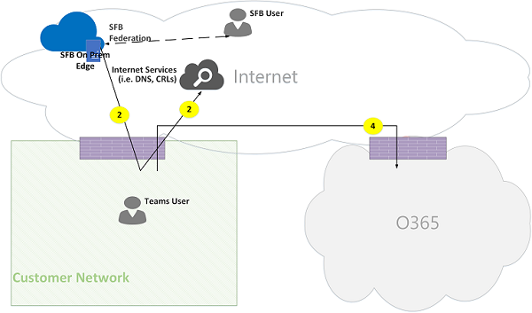

# Carrousel Microsoft Teams

> [!TIP]
> Regardez cette session pour découvrir comment Teams tire parti de votre réseau et comment planifier une connectivité réseau optimale : Teams [planification réseau.](https://aka.ms/teams-networking)

## Présentation

Cet article décrit comment un Teams utilise Microsoft 365 ou Office 365 flux d’appels dans différentes topologies. Il décrit également les flux de Teams qui sont utilisés pour la communication multimédia P2 P2. Le document décrit ces flux, leur objet, leur origine et leur résiliation sur le réseau. Aux fins de cet article, assumez ce qui suit :

- Flow X est utilisé par le client local pour communiquer avec le service Microsoft 365 ou Office 365 dans le cloud. Elle provient du réseau du client et se termine en tant que point de terminaison Microsoft 365 ou Office 365.

- Flow Y est utilisé par le client local pour communiquer avec un service sur Internet sur Microsoft 365 ou Office 365 une dépendance. Elle provient du réseau du client et se termine en tant que point de terminaison sur Internet.

Cet article couvre les informations suivantes :

- **Arrière-plan**. Fournit des informations d’arrière-plan telles que les réseaux que les flux peuvent traverser, les types de trafic, les conseils de connectivité du réseau du client aux points de terminaison du service Microsoft 365 ou Office 365, l’interopérabilité avec des composants tiers et les principes qui sont utilisés par Teams pour sélectionner les flux multimédias.

- **Les flux d’appels en plusieurs topologies.** Illustre l’utilisation de flux d’appels dans plusieurs topologies. Pour chaque topologie, la section ésumant tous les flux pris en charge et illustre la manière dont ces flux sont utilisés dans plusieurs cas d’utilisation. Pour chaque cas d’utilisation, il décrit la séquence et la sélection de flux à l’aide d’un diagramme de flux.

- **Teams’optimisation de l’itinéraire Express.** Décrit comment ces flux sont utilisés lors du déploiement d’Express Route pour l’optimisation, illustré à l’aide d’une topologie simple.

## Arrière-plan

### Segments réseau

**Réseau du client.** Il s’agit du segment réseau que vous contrôlez et gérez. Cela inclut toutes les connexions client au sein des bureaux des clients, qu’elles soient câblés ou sans fil, les connexions entre les immeubles de bureaux, les connexions aux centres de données locaux et vos connexions à des fournisseurs Internet, Express Route ou toute autre propriété d’peering privée.

En règle générale, un réseau de client possède plusieurs périmètres de réseau avec des pare-feu et/ou des serveurs proxy, qui appliquent les stratégies de sécurité de votre organisation et qui autorisent uniquement le trafic réseau que vous avez configuré et configuré. Étant donné que vous gérez ce réseau, vous contrôlez directement les performances du réseau et nous vous recommandons d’effectuer des évaluations du réseau pour valider les performances à la fois au sein des sites de votre réseau et à partir de votre réseau vers le réseau Microsoft 365 ou Office 365.

**Internet.** Il s’agit du segment réseau qui fait partie du réseau global que les utilisateurs qui se connectent à Microsoft 365 ou à Office 365 en dehors du réseau du client. Elle est également utilisée par du trafic provenant du réseau du client vers Microsoft 365 ou Office 365.

**Réseau privé visité ou invité.** Il s’agit du segment réseau en dehors de votre réseau de client, mais pas dans l’Internet public, que vos utilisateurs et leurs invités peuvent visiter (par exemple, un réseau privé à domicile ou un réseau privé d’entreprise, qui ne déploie pas de Teams, où peuvent résider vos utilisateurs et leurs clients qui interagissent avec les services Teams).

> [!NOTE]
> La connectivité à Microsoft 365 ou Office 365 est également applicable à ces réseaux.

**Microsoft 365 ou Office 365**. Il s’agit du segment réseau qui prend en charge Microsoft 365 services Office 365 réseau. Il est distribué dans le monde entier, avec des bords proches du réseau du client dans la plupart des lieux. Parmi les fonctions figurent le relais de transport, le serveur de conférence et le processeur multimédia.

**Express Route (facultatif).** Il s’agit du segment réseau qui fait partie de votre réseau global, ce qui vous donne une connexion dédiée privée au réseau Microsoft 365 ou Office 365 réseau.

### Types de trafic

**Multimédia en temps réel.** Données encapsulées dans le protocole RTP (Real-time Transport Protocol) qui prend en charge les charges de travail audio, vidéo et de partage d’écran. En règle générale, le trafic de médias étant très sensible à la latence, vous souhaiteriez que ce trafic utilise le chemin le plus direct possible et utiliser UDP ou TCP comme protocole de couche transport, qui est le meilleur transport pour un média interactif en temps réel dans une perspective de qualité. (Notez qu’en dernier recours, les médias peuvent utiliser le protocole TCP/IP et ils peuvent également être tunnelés dans le protocole HTTP, mais cette procédure n’est pas recommandée en raison de mauvaises implications en matière de qualité.) Le flux RTP est sécurisé à l’aide du SRTP, dans lequel seule la charge utile est chiffrée.

**Signalisation.** Lien de communication entre le client et le serveur, ou d’autres clients utilisés pour contrôler les activités (par exemple, lorsqu’un appel est lancé) et remettre des messages instantanés. La plupart du trafic de signalisation utilise les interfaces REST basées sur HTTPS, même si dans certains scénarios (par exemple, la connexion entre Microsoft 365 ou Office 365 et un contrôleur de session en bordure), il utilise le protocole SIP. Il est important de comprendre que ce trafic est beaucoup moins sensible à la latence, mais qu’il peut entraîner des pannes de service ou des délais d’attente si la latence entre les points de terminaison dépasse plusieurs secondes.

### Connectivité à des Microsoft 365 ou des Office 365

Teams nécessite [une connectivité à Internet.](/office365/enterprise/assessing-network-connectivity) Teams URL et plages d’adresses IP sont répertoriées dans Office 365 URL et [plages d’adresses IP.](/office365/enterprise/urls-and-ip-address-ranges) (Notez qu’une connectivité ouverte aux ports TCP 80 et 443 et aux ports UDP 3478 à 3481 est requise.) En outre, Teams a une dépendance sur Skype Entreprise Online, qui doit également être connecté à Internet.

Teams connectivité des flux multimédias est implémentée à l’aide de procédures ICE (Interactive Connectivity Connectivity)standard.

### Restrictions relatives à l’interopérabilité

**Relais multimédia tiers.** Un Teams de médias (autrement dit, où l’un des points de terminaison multimédias est Teams) peut traverser uniquement les Teams ou Skype Entreprise relais multimédia natifs. L’interopérabilité avec un relais multimédia tiers n’est pas prise en charge. (Notez qu’unbc tiers à la limite du réseau PSTN doit interrompre le flux RTP/RTCP, sécurisé à l’aide du protocole SRTP et ne pas le relayer au prochain saut.)

**Serveurs proxy SIP tiers.** Une Teams SIP de signalisation avec un SBC tiers et/ou une passerelle peut traverser Teams ou Skype Entreprise proxies SIP natifs. L’interopérabilité avec un proxy SIP tiers n’est pas prise en charge.

**B2BUA (SBC) tiers.** Un Teams flux multimédia vers et depuis le réseau PSTN est terminé par un SBC tiers. Toutefois, l’interopérabilité avec un SBC tiers au sein du réseau Teams (où un média SBC tiers mediate deux points de terminaison Teams ou Skype Entreprise) n’est pas prise en charge.

### Technologies non recommandées avec Microsoft Teams

**réseau VPN.** Il n’est pas recommandé pour le trafic de médias (ou flux 2'). Le client VPN doit utiliser la tunnellité fractionnée et router le trafic Teams multimédia comme tout utilisateur externe non VPN, comme spécifié dans l’activation du média [Lync](https://techcommunity.microsoft.com/t5/Skype-for-Business-Blog/Enabling-Lync-Media-to-Bypass-a-VPN-Tunnel/ba-p/620210)pour contourner un tunnel VPN.

> [!NOTE]
> Bien que le titre indique Lync, il est applicable à Teams également.

**Formes de paquets.** Tout type de trafic de paquets, d’inspection des paquets ou de dispositifs de forme de paquets n’est pas recommandé pour le trafic Teams et peut dégrader considérablement la qualité.

### Principes

Quatre principes généraux vous aident à comprendre les flux d’appels Microsoft Teams :

- Une Microsoft Teams est hébergée par les Microsoft 365 ou Office 365 dans la région dans laquelle le premier participant a rejoint la conférence. (Notez que s’il existe des exceptions à cette règle dans certaines topologies, elles seront décrites dans ce document et illustrées par un flux d’appels approprié.)

- Un point Teams de terminaison multimédia Microsoft 365 ou Office 365 est utilisé en fonction des besoins de traitement des médias et non en fonction du type d’appel. (Par exemple, un appel de point à point peut utiliser un point de terminaison multimédia dans le cloud pour traiter un média pour la transcription ou l’enregistrement, tandis qu’une conférence avec deux participants peut ne pas utiliser de point de terminaison multimédia dans le cloud.) Toutefois, la plupart des conférences utiliseront un point de terminaison multimédia à des fins de mélange et de routage, alloués à l’endroit où la conférence est hébergée. Le trafic de médias envoyé à partir d’un client vers le point de terminaison multimédia peut être acheminé directement ou utiliser un relais de transport dans Microsoft 365 ou Office 365 si nécessaire en raison de restrictions du pare-feu réseau des clients.

- Le trafic de médias pour les appels d’égal à égal prend la route la plus directe disponible, en supposant que l’appel ne constitue pas un point de terminaison multimédia dans le cloud (voir le principe précédent). L’itinéraire préféré est direct vers l’homologue distant (client), mais si cet itinéraire n’est pas disponible, un ou plusieurs relais de transport relaient le trafic. Il est recommandé que le trafic de médias ne transverse pas les serveurs tels que les formes de paquets, les serveurs VPN, etc., car cela a une incidence sur la qualité du média.

- Le trafic de signalisation est toujours envoyé au serveur le plus proche de l’utilisateur.

Pour en savoir plus sur le chemin de médias choisi, voir Comprendre les flux multimédias dans [Microsoft Teams - BRK4016.](https://www.youtube.com/watch?v=1tmHMIlAQdo)

## Flux d’appels dans différentes topologies

### Teams topologie

Cette topologie est utilisée par les clients qui tirent parti de services Teams du cloud sans déploiement local, tel qu’un routage Skype Entreprise Server ou Système téléphonique direct. De plus, l’interface d’Microsoft 365 ou Office 365 se fait sur Internet sans Azure Express Route.

*Figure 1 - Topologie Teams données*

Notez que :

- La direction des flèches sur le diagramme ci-dessus reflète la direction initiation de la communication qui affecte la connectivité au périmètre d’entreprise. Dans le cas d’UDP pour les éléments multimédias, le ou les premiers paquets peuvent circuler dans la direction inverse, mais ces paquets peuvent être bloqués jusqu’à ce que des paquets dans le sens inverse s’écoulent.
- Teams est déployé côte à côte avec Skype Entreprise Online, les clients sont donc affichés comme « utilisateur Teams/SFB ».

Vous trouverez plus d’informations sur les topologies facultatives suivantes plus loin dans cet article :

- Skype Entreprise déploiement local est décrit dans la topologie Teams **hybride.**
- Système téléphonique Le routage direct (pour la connectivité RST) est décrit dans Teams avec **topologie de routage direct.**
- Express Route est décrit dans **Teams’optimisation de l’itinéraire express.**

**Flow descriptions**:

- **Flow 2** – Représente un flux initié par un utilisateur sur le réseau du client vers Internet dans le cadre de l’expérience utilisateur Teams client. Ces flux sont, par exemple, des DNS et des médias d’égal à égal.
- **Flow 2'** – Représente un flux initié par un utilisateur mobile distant Teams, avec un réseau VPN vers le réseau du client.
- **Flow 3** – Représente un flux initié par un utilisateur mobile à distance Teams des points de terminaison Microsoft 365 ou Office 365/Teams’utilisateur.
- **Flow 4** – Représente un flux initié par un utilisateur sur le réseau du client vers Microsoft 365 ou Office 365/Teams points de terminaison.
- **Flow 5** – Représente un flux de médias d’égal à égal entre un utilisateur Teams et un autre utilisateur Teams ou Skype Entreprise du réseau du client.
- **Flow 6** – Représente un flux de médias d’égal à égal entre un utilisateur Teams mobile distant et un autre utilisateur Teams ou Skype Entreprise mobile distant via Internet.

#### Cas d’utilisation : un-à-un

Les appels un-à-un utilisent un modèle courant dans lequel l’appelant obtient un ensemble de candidats composés d’adresses IP/ports, y compris les candidats locaux, relais et réflexes (adresse IP publique du client telle que vue par le relais). L’appelant envoie ces candidats à l’appelé ; L’appelé obtient également un groupe de candidats similaire et les envoie à l’appelant. Les messages de vérification de la connectivité STUN sont utilisés pour rechercher les chemins d’accès multimédias d’appel/appelés, et le chemin d’accès le plus professionnel est sélectionné. Les médias (autrement dit, les paquets RTP/RTCP sécurisés à l’aide du protocole SRTP) sont envoyés à l’aide de la paire de candidats sélectionnée. Le relais de transport est déployé dans le cadre des déploiements Microsoft 365'Office 365.

Si l’adresse IP locale/les candidats au port ou les candidats réflexes ont une connectivité, le chemin d’accès direct entre les clients (ou à l’aide d’un NAT) est sélectionné pour les médias. Si les clients se sont tous les deux sur le réseau du client, le chemin d’accès direct doit être sélectionné. Cela nécessite une connectivité UDP directe au sein du réseau du client. Si les clients sont tous les deux des utilisateurs du cloud, selon le NAT/pare-feu, les médias peuvent utiliser une connectivité directe.

Si un client est interne sur le réseau du client et un client externe (par exemple, un utilisateur du cloud mobile), il est peu probable que la connectivité directe entre les candidats locaux ou réflexes fonctionne. Dans ce cas, une option consiste à utiliser l’un des candidats au relais de transport d’un client (par exemple, le client interne a obtenu un candidat au relais à partir du relais de transport dans Microsoft 365 ou Office 365 ; le client externe doit pouvoir envoyer des paquets STUN/RTP/RTCP au relais de transport). Une autre option consiste à envoyer le client interne au candidat relais obtenu par le client cloud mobile. Notez que bien que la connectivité UDP pour les médias soit fortement recommandée, le protocole TCP est pris en charge.

**Étapes de haut niveau**:

1. Teams L’utilisateur A résout le nom de domaine d’URL (DNS) à l’aide du flux 2.
1. Teams L’utilisateur A alloue un port relais multimédia Teams Relais de transport à l’aide du flux 4.
1. Teams L’utilisateur A envoie une « invitation » avec des candidats ICE utilisant le flux 4 vers Microsoft 365 ou Office 365.
1. Microsoft 365 ou Office 365 notification à l Teams un utilisateur B à l’aide du flux 4.
1. Teams L’utilisateur B alloue un port relais multimédia Teams relais de transport à l’aide du flux 4.
1. Teams L’utilisateur B envoie « réponse » aux candidats ICE à l’aide du flux 4, qui est Teams l’utilisateur A à l’aide Flow 4.
1. Teams L’utilisateur A et Teams B appellent les tests de connectivité ICE et le meilleur chemin multimédia disponible est sélectionné (voir les diagrammes ci-dessous pour divers cas d’utilisation).
1. Teams Les utilisateurs envoient des données de télémétrie Microsoft 365 ou Office 365 à l’aide du flux 4.

**Au sein du réseau du client :**

*Figure 2 - Au sein du réseau du client*

À l’étape 7, le flux multimédia P2L 5 est sélectionné.

Les médias sont bidirectionnels. Le sens du flux 5 indique qu’un côté déclenche la communication à partir d’une perspective de connectivité, cohérente avec tous les flux de ce document. Dans ce cas, peu importe la direction utilisée, car les deux points de terminaison se trouve dans le réseau du client.

**Réseau client vers un utilisateur externe (média relayé par Teams Relais de transport ) :**

*Figure 3 : réseau du client à l’utilisateur externe (média relayé Teams Relais de transport)*

À l’étape 7, le flux 4, du réseau du client vers Microsoft 365 ou Office 365, et le flux 3, à partir de l’utilisateur du Teams mobile à distance vers Microsoft 365 ou Office 365, est sélectionné. Ces flux sont relayés par un Teams de transport au sein Microsoft 365 ou Office 365.

Les médias sont bidirectionnels, où la direction indique le côté qui déclenche la communication à partir d’une perspective de connectivité. Dans ce cas, ces flux sont utilisés pour les signalisations et les médias, en utilisant différents protocoles et adresses de transport.

**Réseau client vers un utilisateur externe (média direct) :**

*Figure 4 : réseau du client à l’utilisateur externe (média direct)*

À l’étape 7, le flux 2, à partir du réseau du client vers Internet (homologue du client), est sélectionné.

- Le médias direct avec un utilisateur mobile distant (non relayé via Microsoft 365 ou Office 365) est facultatif. En d’autres termes, le client peut bloquer ce chemin pour appliquer un chemin de médias via un relais de transport dans Microsoft 365 ou Office 365.

- Les médias sont bidirectionnels. Le sens du flux 2 vers l’utilisateur mobile distant indique qu’un côté déclenche la communication à partir d’une perspective de connectivité.

**Utilisateur VPN à un utilisateur interne (média relayé par Teams Relais de transport)**

*Figure 5 : utilisateur VPN à l’utilisateur interne (média relayé Teams Relais de transport)*

La signalisation entre le vpn et le réseau du client utilise le flux 2'. La signalisation entre le réseau du client et Microsoft 365 ou Office 365 utilise le flux 4. Toutefois, les médias contournent le VPN et sont acheminés à l’aide des flux 3 et 4 à Teams relais multimédia dans Microsoft 365 ou Office 365.

**Utilisateur VPN à l’utilisateur interne (média direct)**

*Figure 6 : utilisateur VPN à l’utilisateur interne (média direct)*

La signalisation entre le vpn et le réseau du client utilise le flux 2'. La signalisation entre le réseau du client et Microsoft 365 ou Office 365 utilise le flux 4. Toutefois, les médias contournent le VPN et sont acheminés à l’aide du flux 2 entre le réseau du client et Internet.

Les médias sont bidirectionnels. Le sens du flux 2 vers l’utilisateur mobile distant indique qu’un côté déclenche la communication à partir d’une perspective de connectivité.

**Utilisateur VPN à l’utilisateur externe (média direct)**

*Figure 7 : utilisateur VPN à l’utilisateur externe (média direct)*

La signalisation entre l’utilisateur VPN et le réseau du client utilise le flux 2' et le flux 4 vers Microsoft 365 ou Office 365. Toutefois, les médias contournent un réseau VPN et sont acheminés à l’aide du flux 6.

Les médias sont bidirectionnels. Le sens du flux 6 vers l’utilisateur mobile distant indique qu’un côté déclenche la communication à partir d’une perspective de connectivité.

#### Cas d’utilisation : Teams PSTN via une ligne Microsoft 365 ou Office 365 ligne

Microsoft 365 et Office 365 avez un Système téléphonique permettant de passer et recevoir des appels à partir du réseau téléphonique commuté (RSTN). Si la ligne PSTN est connectée à l’aide du plan d Système téléphonique d’appels, il n’y a pas de exigences particulières de connectivité pour ce cas d’utilisation. (Si vous voulez connecter votre propre ligne PSTN Microsoft 365 ou Office 365, vous pouvez utiliser Système téléphonique routage direct.)

*Figure 8 : Teams de la ligne PSTN à Office 365 ligne*

#### Cas d’utilisation : Teams réunion

Le serveur de partage audio/vidéo/écran (VBSS) fait partie des Microsoft 365 et Office 365. Il présente une adresse IP publique qui doit être accessible à partir du réseau du client et doit être accessible à partir d’un client Cloud 1002. Chaque client/point de terminaison doit être en mesure de se connecter au serveur de conférence.

Les clients internes obtiennent des candidats locaux, réflexes et relayés de la même manière que pour les appels un-à-un. Les clients envoient ces candidats au serveur de conférence dans une invitation. Le serveur de conférence n’utilise pas de relais, car il possède une adresse IP accessible publiquement. Il répond donc avec son candidat à l’adresse IP locale. Le serveur de client et de conférence vérifie la connectivité de la même manière que pour les appels un-à-un.

Notez que :

- Teams clients ne peuvent pas participer Skype Entreprise réunions, et Skype Entreprise clients ne peuvent pas participer Teams réunions.

- En fonction de l’organisateur de la réunion, la fonction d’appel RST et/ou de conférence peut être un utilisateur PSTN « Dials IN » ou « Dialed OUT ».

- Un utilisateur invité ou un utilisateur client peut rejoindre la équipe à partir d’un réseau privé invité protégé à l’aide de FW/NAT à l’aide de règles strictes.

*Figure 9 : réunion Teams réunion*

#### Cas d’utilisation : fédération avec Skype Entreprise local

**Média relayé par un Teams de transport dans Microsoft 365 ou Office 365**

*Figure 10 : média relayé par Teams relais de transport dans Office 365*

Notez que :

- Par définition, la fédération est une communication entre deux locataires. Dans ce cas, le client A, qui Teams client, se fédéré avec le client B, qui Skype Entreprise local. Si le client B utilise également Microsoft 365 ou Office 365, le client Skype Entreprise aurait utilisé le flux 3 pour se connecter à Microsoft 365 ou Office 365.

- La signalisation et le média à partir du client Skype Entreprise fédéré vers l’Skype Entreprise Server locaux ne sont plus dans l’étendue de ce document. Toutefois, il est illustré ici pour la clarté.

- La signalisation entre Teams et Skype Entreprise est ponte par une passerelle.

- Dans ce cas, les médias sont relayés par le Teams de transport au réseau du client et le client distant Skype Entreprise à l’aide du flux 4.

**Média relayé par Skype Entreprise Relais multimédia dans un client fédéré**

*Figure 11 - Média relayé par Skype Entreprise Relais multimédia dans un client fédéré*

Notez que :

- La signalisation et le média à partir du client Skype Entreprise fédéré vers un client Skype Entreprise Server n’est plus dans l’étendue de ce document. Toutefois, il est illustré ici pour la clarté.

- Le signalisation entre Teams et Skype Entreprise est ponte par une passerelle.

- Dans ce cas, les médias sont relayés Skype Entreprise relais multimédia local sur le réseau du client à l’aide du flux 2. (Notez que le trafic provenant d’un utilisateur Teams vers le relais multimédia distant dans le réseau de clients fédérés sera initialement bloqué par le relais multimédia jusqu’à ce que le trafic dans le sens inverse commence à circuler. Toutefois, le flux bidirectionnel ouvre une connectivité dans les deux directions.)

**Direct (D’égal à égal)**

*Figure 12 - Direct (P2 P2)*

### Teams topologie hybride

Cette topologie inclut Teams avec un Skype Entreprise local.

*Figure 13 : Teams topologie hybride*

- La direction des flèches sur le diagramme ci-dessus reflète la direction initiation de la communication qui affecte la connectivité au périmètre d’entreprise. Dans le cas d’UDP pour les éléments multimédias, le ou les premiers paquets peuvent circuler dans la direction inverse, mais ces paquets peuvent être bloqués jusqu’à ce que des paquets dans le sens inverse s’écoulent.

- Teams est déployé côte à côte avec Skype Entreprise Online, les clients sont donc affichés comme « utilisateur Teams/SFB ».

Flux supplémentaire (par-dessus Teams topologie) :

- **Flow 5A** – Représente un flux multimédia d’égal à égal entre un utilisateur Teams au sein du réseau du client et un relais multimédia Skype Entreprise local au niveau du réseau de périphérie du client.

#### Cas d’utilisation : Teams deux Skype Entreprise un-à-un

**Hybride au sein du réseau du client**

*Figure 14 - Hybride au sein du réseau du client*

La signalisation entre Teams et Skype Entreprise est ponte par une passerelle. Toutefois, les médias sont acheminés directement d’égal à égal au sein du réseau du client à l’aide du flux 5.

**Réseau client hybride avec un utilisateur Skype Entreprise externe, relayé par l’Microsoft 365 ou Office 365**

*Figure 15 : réseau de clients hybride avec un utilisateur Skype Entreprise externe- relayé par Office 365*

Notez que :

- La signalisation et le média à partir du client Skype Entreprise vers un client Skype Entreprise Server locaux ne sont plus dans l’étendue de ce document. Toutefois, il est illustré ici pour la clarté.

- La signalisation entre Teams et Skype Entreprise est ponte par une passerelle.

- Le média est relayé via Teams relais de transport au réseau du client tout au long du flux 4.

**Réseau client hybride avec un utilisateur Skype Entreprise externe, relayé par le edge local**

*Figure 16 - Réseau de clients hybride avec un utilisateur Skype Entreprise externe - relayé par edge sur site*

Notez que :

- La signalisation et le média à partir Skype Entreprise client vers un client Skype Entreprise Server n’est plus dans l’étendue de ce document. Toutefois, il est illustré ici pour la clarté.

- La signalisation est ponte par une passerelle.

- Le média est relayé par Skype Entreprise Relais multimédia au sein d’Skype Entreprise edge local vers un utilisateur Teams au sein du réseau du client à l’aide du flux de médias 5A.

### Teams topologie Système téléphonique routage direct

Cette topologie inclut des Teams avec Système téléphonique routage direct.

Le routage direct vous permet d’utiliser un fournisseur de services RST (Public Switched Telephone Network) tiers en paire un périphérique SBC (Session Border Controller) pris en charge sur site avec un Microsoft 365 ou un Office 365, puis en connectant la ligne téléphonique à cet appareil.

Pour prendre en charge ce scénario, le client doit déployer un SBC certifié pour le routage direct à partir de l’un des partenaires certifiés de Microsoft. Le SBC doit être configuré comme recommandé par le fournisseur et routable à partir d’Microsoft 365 ou Office 365 pour le trafic UDP direct. Le média peut circuler directement entre le Teams et/ou le client Skype Entreprise vers le SBC (sans passer par la passerelle Teams) ou traverser la passerelle Teams réseau. La connectivité avec le SBC, lorsque la ligne est configurée pour contourner la passerelle Teams, est basée sur ICE, où SBC prend en charge ICE-Lite, tandis que le point de terminaison multimédia Teams/Skype Entreprise prend en charge la forme complète ICE.

*Figure 17 : Teams topologie Système téléphonique routage direct

Notez que :

- La direction des flèches sur le diagramme ci-dessus reflète la direction initiation de la communication qui affecte la connectivité au périmètre d’entreprise. Dans le cas d’UDP pour les éléments multimédias, le ou les premiers paquets peuvent circuler dans la direction inverse, mais ces paquets peuvent être bloqués jusqu’à ce que des paquets dans le sens inverse s’écoulent.

- Teams est déployé côte à côte avec Skype Entreprise Online, les clients sont donc affichés comme « utilisateur Teams/SFB ».

Flux supplémentaires (topologie de Teams online) :

- **Flow 4'** - Représente un flux entre Microsoft 365 ou Office 365 et le réseau du client, utilisé pour établir une connexion entre le serveur multimédia Teams dans le cloud et le SBC local.
- **Flow 5B** – Représente un flux de médias entre l’utilisateur Teams au sein du réseau du client avec SBC de routage direct en mode contournement.
- **Flow 5C** – Représente un flux multimédia entre le SBC de routage direct vers un autre SBC de routage direct dans un mode de dérivation d’appel PSTN.

**Utilisateur interne avec routage direct (média relayé Teams relais de transport)**

*Figure 18 : Utilisateur interne avec routage direct (média relayé Teams relais de transport)*

Notez que :

- Le SBC doit avoir une adresse IP publique routable à partir d’Microsoft 365 ou Office 365.

- Le trafic de signalisation et de média entre le SBC et Microsoft 365 ou Office 365 et inversement utilisent le flux 4 et/ou le flux 4'.

- Signalisation et trafic de médias à partir du client au sein du réseau du client vers Microsoft 365 ou Office 365'utiliser le flux 4.

**Utilisateur distant avec routage direct (les médias sont acheminés via un serveur multimédia (MP))**

*Figure 19 : Utilisateur distant avec routage direct (les médias sont roudés via un serveur multimédia (MP))*

Notez que :

- Le SBC doit avoir une adresse IP publique routable à partir d’Microsoft 365 ou Office 365.

- Le trafic de signalisation et de média entre le SBC et Microsoft 365 ou Office 365 et inversement utilisent le flux 4 et/ou le flux 4'.

- La signalisation et le trafic de médias à partir du client sur Internet vers Microsoft 365 ou Office 365 utiliser le flux 3.

**Routage direct (dérivation média) de l’utilisateur interne**

*Figure 20 : routage direct de l’utilisateur interne (dérivation média)*

Notez que :

- Le SBC doit avoir une adresse IP publique routable à partir d’Microsoft 365 ou Office 365.

- La signalisation de SBC vers Microsoft 365 ou Office 365 et inversement utiliser le flux 4 et/ou le flux 4'.

- Signalisation à partir du client au sein du réseau du client Microsoft 365 ou Office 365 utiliser le flux 4.

- Médias provenant d’un client au sein du réseau du client vers SBC au sein du flux d’utilisation réseau du client 5B.

**Utilisateur distant avec routage direct (dérivation média relayée par Teams relais de transport)**

*Figure 21 : Utilisateur distant avec routage direct (dérivation média relayé Teams Relais de transport)*

Notez que :

- Le SBC doit avoir une adresse IP publique routable à partir d’Microsoft 365 ou Office 365 et Internet.

- Le trafic de signalisation à partir du SBC vers Microsoft 365 ou Office 365 et inversement utilise le flux 4 et/ou le flux 4'.

- La signalisation à partir du client sur Internet vers Microsoft 365 ou Office 365 utilise le flux 3.

- Les médias entre le client sur Internet et le SBC au sein du réseau du client utilisent des flux 3 et 4, relayés par Teams relais de transport.

**Routage direct de l’utilisateur distant (dérivation directe sur les médias)**

*Figure 22 : routage direct de l’utilisateur distant (dérivation média direct)*

Notez que :

- Le SBC doit avoir une adresse IP publique routable à partir d’Microsoft 365 Office 365 et d’Internet.

- Le trafic de signalisation à partir du SBC vers Microsoft 365 ou Office 365 et inversement utilise le flux 4 et/ou le flux 4'.

- La signalisation à partir du client sur Internet vers Microsoft 365 ou Office 365 utilise le flux 3.

- Les médias provenant du client sur Internet vers le SBC au sein du réseau du client utilisent le flux 2.

**Routage direct (dérivation média) : appel en épingle à cheveux PSTN (à cause d’un transfert/transfert d’appel)**

*Figure 23 - Routage direct (dérivation média) - Appel en épingle à cheveux PSTN (en raison d’un transfert/transfert d’appel)*

Notez que :

- Le SBC doit avoir une adresse IP publique routable à partir d’Microsoft 365 ou Office 365.

- Le trafic de signalisation à partir du SBC vers Microsoft 365 ou Office 365 et inversement utilise le flux 4 et/ou le flux 4'.

- Le client n’est plus dans la boucle de signalisation et de média une fois l’appel entre un réseau PSTN et un réseau PSTN.

- Média de l’instance SBC A au sein du réseau du client vers l’instance SBC B dans le réseau du client (où A et B peuvent être la même instance) utilise le flux 5C.

**Routage direct (média via Microsoft 365 ou Office 365) : appel en épingle à cheveux PSTN entre deux locataires**

*Figure 24 - Routage direct (média via Microsoft 365 ou Office 365) : appel en épingle à cheveux PSTN entre deux locataires*

Notez que :

- Le SBC doit avoir une adresse IP publique routable à partir d’Microsoft 365 ou Office 365.

- Le trafic de signalisation à partir du SBC vers Microsoft 365 ou Office 365 et inversement utilise le flux 4 et/ou le flux 4'.

- Le client n’est plus dans la boucle de signalisation et de média une fois l’appel entre un réseau PSTN et un réseau PSTN.

- Les médias provenant de l’instance SBC A au sein du réseau client X vers l’instance SBC doivent être relayés via le serveur multimédia Microsoft 365 ou Office 365 et ne peuvent pas utiliser le mode de dérivation.

## Teams’optimisation de l’itinéraire Express

*Figure 25 : Teams l’optimisation de la route Express*

Si l’itinéraire express est justifié et déployé, les flux Teams peuvent alors être ré-acheminés du flux 4 vers le flux 1, et du flux 4' au flux 1'. Toutefois, l’application Teams présente une dépendance vis-à-vis d’autres flux Microsoft 365 ou Office 365 sur Internet utilisant les flux 4 et 4 ' ; par conséquent, ces flux ne doivent pas être bloqués.

Notez que Skype Entreprise le trafic Edge hybride est acheminé vers Internet et non express route pour communiquer avec des utilisateurs externes et se fédérer avec d’autres clients.

Pour éviter des flux asymétriques, le routage doit être dans les deux sens. En d’autres termes, une adresse au sein du réseau du client est routable via Internet ou Express Route, sur la base de l’optimisation, mais pas des deux.

**Réseau client vers un utilisateur externe (média relayé par Teams Relais de transport ) :**

*Figure 26 : réseau du client à l’utilisateur externe (média relayé Teams Relais de transport)*

**Étapes de haut niveau :**

1. Teams Un utilisateur au sein du réseau du client résout le nom de domaine d’URL (DNS) à l’aide de flow2.
1. Teams Un utilisateur au sein du réseau du client alloue un port relais multimédia Teams relais de transport à l’aide du flux 1.
1. Teams Un utilisateur au sein du réseau du client envoie des « invitations » avec les candidats ICE à l’aide du flux 1 Microsoft 365 ou Office 365.
1. Microsoft 365 ou Office 365 envoie une notification à l Teams un utilisateur externe à l’aide du flux 3.
1. Teams utilisateur externe alloue un port relais multimédia Teams relais de transport à l’aide du flux 3.
1. Teams utilisateur externe envoie « réponse » aux candidats ICE à l’aide du flux 3, qui est transmis à l’Teams A à l’aide Flow 1.
1. Teams L’utilisateur A et Teams B appellent les tests de connectivité ICE et sélectionnent les flux 1 et 3, relayés par Teams relais de transport.
1. Teams Les utilisateurs envoient des données de télémétrie Microsoft 365 ou Office 365 à l’aide des flux 1 et 3.

> [!NOTE]
> Flow 4 doit être activé pour prendre en charge les dépendances d’une application Teams sur d’autres micro-services qui hraient le flux 4.
