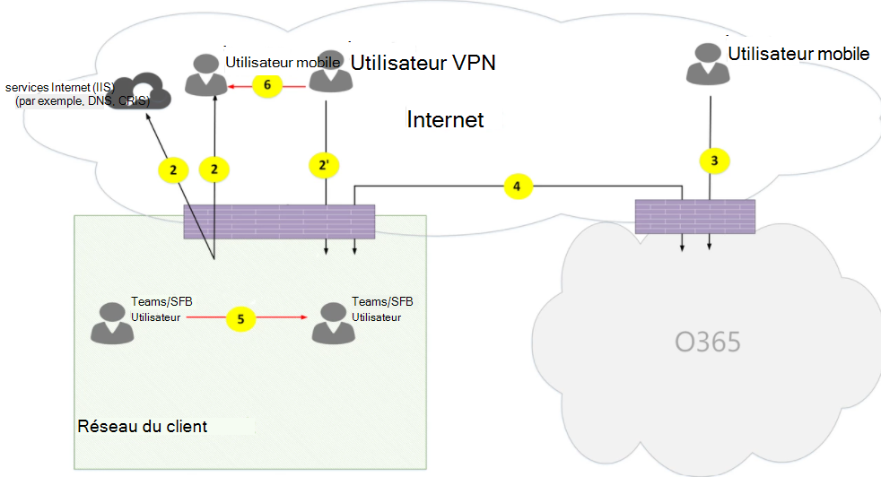

# Carrousel Microsoft TeamsMicrosoft Teams call flows

> [!TIP]
> Regardez cette session pour découvrir comment Teams tire parti de votre réseau et comment planifier une connectivité réseau optimale : [Planification du réseau Teams.](https://aka.ms/teams-networking)Watch this session to learn how Teams leverages your network and how to plan for optimal network connectivity: [Teams Network Planning](https://aka.ms/teams-networking).

## PrésentationOverview

Cet article décrit comment Teams utilise les flux d'appels Microsoft 365 ou Office 365 dans différentes topologies.This article describes how Teams uses Microsoft 365 or Office 365 call flows in various topologies. Il décrit en outre les flux Teams uniques utilisés pour la communication multimédia P2 P2T.In addition, it describes unique Teams flows that are used for peer-to-peer media communication. Le document décrit ces flux, leur objet, leur origine et leur résiliation sur le réseau.The document describes these flows, their purpose, and their origin and termination on the network. Aux fins de cet article, assumez ce qui suit :For purposes of this article, assume the following:

- Flow X est utilisé par le client local pour communiquer avec le service Microsoft 365 ou Office 365 dans le cloud.Flow X is used by the on-premises client to communicate with the Microsoft 365 or Office 365 service in the cloud. Elle provient du réseau du client et se termine en tant que point de terminaison dans Microsoft 365 ou Office 365.It originates from the customer network, and it terminates as an endpoint in Microsoft 365 or Office 365.

- Flow Y est utilisé par le client local pour communiquer avec un service sur Internet sur qui Microsoft 365 ou Office 365 a une dépendance.Flow Y is used by the on-premises client to communicate with a service on the Internet that Microsoft 365 or Office 365 has a dependency on. Elle provient du réseau du client et se termine en tant que point de terminaison sur Internet.It originates from the customer network, and it terminates as an endpoint on the Internet.

Cet article couvre les informations suivantes :This article covers the following information:

- **Arrière-plan**.**Background**. Fournit des informations d'arrière-plan, telles que les réseaux que les flux peuvent traverser, les types de trafic, les conseils de connectivité du réseau du client aux points de terminaison du service Microsoft 365 ou Office 365, l'interopérabilité avec des composants tiers et les principes utilisés par Teams pour sélectionner les flux multimédias.Provides background information such as networks that the flows may traverse, types of traffic, connectivity guidance from the customer network to Microsoft 365 or Office 365 service endpoints, interoperability with third-party components, and principles that are used by Teams to select media flows.

- **Les flux d'appels en plusieurs topologies.****Call flows in various topologies**. Illustre l'utilisation de flux d'appels dans plusieurs topologies.Illustrates the use of call flows in various topologies. Pour chaque topologie, la section ésumant tous les flux pris en charge et illustre la manière dont ces flux sont utilisés dans plusieurs cas d'utilisation.For each topology, the section enumerates all supported flows and illustrates how these flows are used in several use cases. Pour chaque cas d'utilisation, il décrit la séquence et la sélection de flux à l'aide d'un diagramme de flux.For each use case, it describes the sequence and selection of flows using a flow diagram.

- **Teams avec l'optimisation de l'itinéraire Express.****Teams with Express Route optimization**. Décrit comment ces flux sont utilisés lors du déploiement d'Express Route pour l'optimisation, illustré à l'aide d'une topologie simple.Describes how these flows are used when Express Route is deployed for optimization, illustrated using a simple topology.

## Arrière-planBackground

### Segments réseauNetwork segments

**Réseau du client.****Customer network**. Il s'agit du segment réseau que vous contrôlez et gérez.This is the network segment that you control and manage. Cela inclut toutes les connexions client au sein des bureaux des clients, qu'elles soient câblés ou sans fil, les connexions entre les immeubles de bureaux, les connexions aux centres de données locaux et vos connexions à des fournisseurs Internet, Express Route ou toute autre propriété d'peering privée.This includes all customer connections within customer offices, whether wired or wireless, connections between office buildings, connections to on-premises datacenters, and your connections to Internet providers, Express Route, or any other private peering.

En règle générale, un réseau de client possède plusieurs périmètres de réseau avec des pare-feu et/ou des serveurs proxy, qui appliquent les stratégies de sécurité de votre organisation et qui autorisent uniquement le trafic réseau que vous avez configuré et configuré.Typically, a customer network has several network perimeters with firewalls and/or proxy servers, which enforce your organization's security policies, and that only allow certain network traffic that you have set up and configured. Étant donné que vous gérez ce réseau, vous contrôlez directement les performances du réseau et nous vous recommandons d'effectuer des évaluations du réseau afin de valider les performances à la fois sur les sites de votre réseau et à partir de votre réseau vers le réseau Microsoft 365 ou Office 365.Because you manage this network, you have direct control over the performance of the network, and we recommend that you complete network assessments to validate performance both within sites in your network and from your network to the Microsoft 365 or Office 365 network.

**Internet.****Internet**. Il s'agit du segment réseau qui fait partie du réseau global que les utilisateurs qui se connectent à Microsoft 365 ou à Office 365 en dehors du réseau du client.This is the network segment that is part of your overall network that will be used by users who are connecting to Microsoft 365 or Office 365 from outside of the customer network. Elle est également utilisée par du trafic provenant du réseau du client vers Microsoft 365 ou Office 365.It is also used by some traffic from the customer network to Microsoft 365 or Office 365.

**Réseau privé visité ou invité.****Visited or guest private network**. Il s'agit du segment réseau en dehors de votre réseau du client, mais pas dans l'Internet public, que vos utilisateurs et leurs invités peuvent visiter (par exemple, un réseau privé à domicile ou un réseau privé d'entreprise, qui ne déploie pas Teams, où vos utilisateurs et leurs clients interagissent avec les services Teams).This is the network segment outside your customer network, but not in the public Internet, that your users and their guests may visit (for example, a home private network or an enterprise private network, that does not deploy Teams, where your users and their customers that interact with Teams services may reside).

> [!NOTE]
> La connectivité à Microsoft 365 ou Office 365 est également applicable à ces réseaux.Connectivity to Microsoft 365 or Office 365 is also applicable to these networks.

**Microsoft 365 ou Office 365.****Microsoft 365 or Office 365**. Il s'agit du segment réseau qui prend en charge les services Microsoft 365 ou Office 365.This is the network segment that supports Microsoft 365 or Office 365 services. Il est distribué dans le monde entier, avec des bords proches du réseau du client dans la plupart des lieux.It is distributed worldwide with edges in proximity to the customer network in most locations. Parmi les fonctions figurent le relais de transport, le serveur de conférence et le processeur multimédia.Functions include Transport Relay, conferencing server, and Media Processor.

**Express Route (facultatif).****Express Route (optional)**. Il s'agit du segment réseau qui fait partie de votre réseau global, ce qui vous donne une connexion privée dédiée au réseau Microsoft 365 ou Office 365.This is the network segment that is part of your overall network that will give you a dedicated, private connection to the Microsoft 365 or Office 365 network.

### Types de traficTypes of traffic

**Multimédia en temps réel.****Real-time media**. Données encapsulées dans le protocole RTP (Real-time Transport Protocol) qui prend en charge les charges de travail audio, vidéo et de partage d'écran.Data encapsulated within Real-time Transport Protocol (RTP) that supports audio, video, and screen sharing workloads. En règle générale, le trafic de médias étant très sensible à la latence, vous souhaiteriez que ce trafic utilise le chemin le plus direct possible et utiliser UDP ou TCP comme protocole de couche transport, qui est le meilleur transport pour un média interactif en temps réel dans une perspective de qualité.In general, media traffic is highly latency sensitive, so you would want this traffic to take the most direct path possible, and to use UDP versus TCP as the transport layer protocol, which is the best transport for interactive real-time media from a quality perspective. (Notez qu'en dernier recours, les médias peuvent utiliser le protocole TCP/IP et ils peuvent également être tunnelés dans le protocole HTTP, mais cette procédure n'est pas recommandée en raison de mauvaises implications en matière de qualité.) Le flux RTP est sécurisé à l'aide du SRTP, dans lequel seule la charge utile est chiffrée.(Note that as a last resort, media can use TCP/IP and also be tunneled within the HTTP protocol, but it is not recommended due to bad quality implications.) RTP flow is secured using SRTP, in which only the payload is encrypted.

**Signalisation.****Signaling**. Lien de communication entre le client et le serveur, ou d'autres clients utilisés pour contrôler les activités (par exemple, lorsqu'un appel est lancé) et remettre des messages instantanés.The communication link between the client and server, or other clients that are used to control activities (for example, when a call is initiated), and deliver instant messages. La plupart du trafic de signalisation utilise les interfaces REST basées sur HTTPS, même si dans certains scénarios (par exemple, la connexion entre Microsoft 365 ou Office 365 et un contrôleur de session Border), il utilise le protocole SIP.Most signaling traffic uses the HTTPS-based REST interfaces, though in some scenarios (for example, connection between Microsoft 365 or Office 365 and a Session Border Controller) it uses SIP protocol. Il est important de comprendre que ce trafic est beaucoup moins sensible à la latence, mais qu'il peut entraîner des pannes de service ou des délais d'attente si la latence entre les points de terminaison dépasse plusieurs secondes.It's important to understand that this traffic is much less sensitive to latency but may cause service outages or call timeouts if latency between the endpoints exceeds several seconds.

### Connectivité à Microsoft 365 ou Office 365Connectivity to Microsoft 365 or Office 365

Teams requiert [une connexion à Internet.](/office365/enterprise/assessing-network-connectivity)Teams requires [connectivity to the Internet](/office365/enterprise/assessing-network-connectivity). Les URL et plages d'adresses IP des points de terminaison Teams sont répertoriées dans les URL et [plages d'adresses IP Office 365.](/office365/enterprise/urls-and-ip-address-ranges)Teams endpoint URLs and IP address ranges are listed in [Office 365 URLs and IP address ranges](/office365/enterprise/urls-and-ip-address-ranges). (Notez qu'une connectivité ouverte aux ports TCP 80 et 443 et aux ports UDP 3478 à 3481 est requise.) En outre, Teams a une dépendance sur Skype Entreprise Online, qui doit également être connectée à Internet.(Note that open connectivity to TCP ports 80 and 443, and to UDP ports 3478 through 3481, is required.) Furthermore, Teams has a dependency on Skype for Business Online, which must also be connected to the Internet.

La connectivité des flux multimédias Teams est mise en œuvre à l'aide de procédures ICE (Interactive Connectivity Connectivity Connectivité) standard.Teams media flows connectivity is implemented using standard IETF Interactive Connectivity Establishment (ICE) procedures.

### Restrictions relatives à l'interopérabilitéInteroperability restrictions

**Relais multimédia tiers.****Third-party media relays**. Un flux multimédia Teams (c'est-à-dire, où l'un des points de terminaison multimédia est Teams) peut traverser uniquement les relais multimédia natifs Teams ou Skype Entreprise.A Teams media flow (that is, where one of the media endpoints is Teams) may traverse only Teams or Skype for Business native media relays. L'interopérabilité avec un relais multimédia tiers n'est pas prise en charge.Interoperability with a third-party media relay is not supported. (Notez qu'unbc tiers à la limite du réseau PSTN doit interrompre le flux RTP/RTCP, sécurisé à l'aide du protocole SRTP et ne pas le relayer au prochain saut.)(Note that a third-party SBC on the boundary with PSTN must terminate RTP/RTCP stream, secured using SRTP, and not relay it to the next hop.)

**Serveurs proxy SIP tiers.****Third-party SIP proxy servers**. Une boîte de dialogue SIP de signalisation Teams avec un SBC tiers et/ou une passerelle peut traverser lesxies SIP natives de Teams ou de Skype Entreprise.A Teams signaling SIP dialog with a third-party SBC and/or gateway may traverse Teams or Skype for Business native SIP proxies. L'interopérabilité avec un proxy SIP tiers n'est pas prise en charge.Interoperability with a third-party SIP proxy is not supported.

**B2BUA (SBC) tiers.****Third-party B2BUA (or SBC)**. Un flux de médias Teams vers et depuis le réseau PSTN est terminé par un SBC tiers.A Teams media flow to and from the PSTN is terminated by a third-party SBC. Toutefois, l'interopérabilité avec un SBC tiers au sein du réseau Teams (où un média SBC tiers mediate deux points de terminaison Teams ou Skype Entreprise) n'est pas prise en charge.However, interoperability with a third-party SBC within the Teams network (where a third-party SBC mediates two Teams or Skype for Business endpoints) is not supported.

### Technologies non recommandées avec Microsoft TeamsTechnologies that are not recommended with Microsoft Teams

**réseau VPN.****VPN network**. Il n'est pas recommandé pour le trafic de médias (ou flux 2').It is not recommended for media traffic (or flow 2'). Le client VPN doit utiliser la tunnellité fractionnée et router le trafic multimédia de Teams comme n'importe quel utilisateur externe non-VPN, comme spécifié dans l'activation du média [Lync](https://techcommunity.microsoft.com/t5/Skype-for-Business-Blog/Enabling-Lync-Media-to-Bypass-a-VPN-Tunnel/ba-p/620210)pour contourner un tunnel VPN.The VPN client should use split tunneling and route Teams media traffic like any external non-VPN user, as specified in [Enabling Lync media to bypass a VPN tunnel](https://techcommunity.microsoft.com/t5/Skype-for-Business-Blog/Enabling-Lync-Media-to-Bypass-a-VPN-Tunnel/ba-p/620210).

> [!NOTE]
> Bien que le titre indique Lync, il s'applique également à Teams.Although the title indicates Lync, it is applicable to Teams as well.

**Formes de paquets.****Packet shapers**. Tout type de trafic de paquets, d'inspection des paquets ou d'appareils de forme de paquets n'est pas recommandé pour le trafic multimédia de Teams et peut dégrader considérablement la qualité.Any kind of packet snipper, packet inspection, or packet shaper devices are not recommended for Teams media traffic and may degrade quality significantly.

### PrincipesPrinciples

Quatre principes généraux vous aident à comprendre les flux d'appels pour Microsoft Teams :There are four general principles that help you understand call flows for Microsoft Teams:

- Une conférence Microsoft Teams est hébergée par Microsoft 365 ou Office 365 dans la même région que le premier participant.A Microsoft Teams conference is hosted by Microsoft 365 or Office 365 in the same region where the first participant joined. (Notez que s'il existe des exceptions à cette règle dans certaines topologies, elles seront décrites dans ce document et illustrées par un flux d'appels approprié.)(Note that if there are exceptions to this rule in some topologies, they will be described in this document and illustrated by an appropriate call flow.)

- Un point de terminaison multimédia Teams dans Microsoft 365 ou Office 365 est utilisé sur la base des besoins de traitement des médias et non en fonction du type d'appel.A Teams media endpoint in Microsoft 365 or Office 365 is used based on media processing needs and not based on call type. (Par exemple, un appel de point à point peut utiliser un point de terminaison multimédia dans le cloud pour traiter un média pour la transcription ou l'enregistrement, tandis qu'une conférence avec deux participants peut ne pas utiliser de point de terminaison multimédia dans le cloud.) Toutefois, la plupart des conférences utiliseront un point de terminaison multimédia à des fins de mélange et de routage, alloués à l'endroit où la conférence est hébergée.(For example, a point-to-point call may use a media endpoint in the cloud to process media for transcription or recording, while a conference with two participants may not use any media endpoint in the cloud.) However, most conferences will use a media endpoint for mixing and routing purposes, allocated where the conference is hosted. Le trafic de médias envoyé à partir d'un client vers le point de terminaison multimédia peut être acheminé directement ou utiliser un relais de transport dans Microsoft 365 ou Office 365 si nécessaire en raison de restrictions du pare-feu réseau des clients.The media traffic sent from a client to the media endpoint may be routed directly or use a Transport Relay in Microsoft 365 or Office 365 if required due to customer network firewall restrictions.

- Le trafic de médias pour les appels d'égal à égal prend la route la plus directe disponible, en supposant que l'appel ne constitue pas un point de terminaison multimédia dans le cloud (voir le principe précédent).Media traffic for peer-to-peer calls takes the most direct route that is available, assuming that the call doesn't mandate a media endpoint in the cloud (see previous principle). L'itinéraire préféré est direct vers l'homologue distant (client), mais si cet itinéraire n'est pas disponible, un ou plusieurs relais de transport relaient le trafic.The preferred route is direct to the remote peer (client), but if that route isn't available, then one or more Transport Relays will relay traffic. Il est recommandé que le trafic de médias ne transverse pas les serveurs tels que les formes de paquets, les serveurs VPN, etc., car cela a une incidence sur la qualité du média.It is recommended that media traffic shall not transverse servers such as packet shapers, VPN servers, and so on, since this will impact the media quality.

- Le trafic de signalisation est toujours envoyé au serveur le plus proche de l'utilisateur.Signaling traffic always goes to the closest server to the user.

Pour en savoir plus sur le chemin de médias choisi, voir Comprendre les flux multimédias dans [Microsoft Teams - BRK4016.](https://www.youtube.com/watch?v=1tmHMIlAQdo)To learn more about the details on the media path that is chosen, see [Understanding Media Flows in Microsoft Teams - BRK4016](https://www.youtube.com/watch?v=1tmHMIlAQdo).

## Flux d'appels dans différentes topologiesCall flows in various topologies

### Topologie TeamsTeams topology

Cette topologie est utilisée par les clients qui tirent parti des services Teams à partir du cloud sans déploiement local, tel que Skype Entreprise Server ou le routage direct du système téléphonique.This topology is used by customers that leverage Teams services from the cloud without any on-premises deployment, such as Skype for Business Server or Phone System Direct Routing. De plus, l'interface de Microsoft 365 ou d'Office 365 se fait sur Internet sans Azure Express Route.In addition, the interface to Microsoft 365 or Office 365 is done over the Internet without Azure Express Route.

*Figure 1 - Topologie Teams**Figure 1 - Teams topology*

Notez que :Note that:

- La direction des flèches sur le diagramme ci-dessus reflète la direction initiation de la communication qui affecte la connectivité au périmètre d'entreprise.The direction of the arrows on the diagram above reflect the initiation direction of the communication that affects connectivity at the enterprise perimeters. Dans le cas d'UDP pour les éléments multimédias, le ou les premiers paquets peuvent circuler dans la direction inverse, mais ces paquets peuvent être bloqués jusqu'à ce que des paquets dans le sens inverse s'écoulent.In the case of UDP for media, the first packet(s) may flow in the reverse direction, but these packets may be blocked until packets in the other direction will flow.
- Teams est déployé côte à côte avec Skype Entreprise Online, et les clients sont donc affichés en tant qu'« utilisateur Teams/SFB ».Teams is deployed side by side with Skype for Business Online, hence clients are displayed as "Teams/SFB user."

Vous trouverez plus d'informations sur les topologies facultatives suivantes plus loin dans cet article :You can find more information on the following optional topologies later in the article:

- Le déploiement local de Skype Entreprise est décrit dans la **topologie Teams hybride.**Skype for Business on-premises deployment is described in **Teams hybrid topology**.
- Le routage direct du système téléphonique (pour la connectivité RSTN) est décrit dans Teams avec topologie **de routage direct.**Phone System Direct Routing (for PSTN connectivity) is described in **Teams with Direct Routing topology**.
- Express Route est décrit dans **Teams avec l'optimisation de l'itinéraire express.**Express Route is described in **Teams with Express Route optimization**.

**Descriptions du flux**:**Flow descriptions**:

- **Flux 2** – Représente un flux initié par un utilisateur sur le réseau du client vers Internet dans le cadre de l'expérience Teams de l'utilisateur.**Flow 2** – Represents a flow initiated by a user on the customer network to the Internet as a part of the user's Teams experience. Ces flux sont, par exemple, des DNS et des médias d'égal à égal.Examples of these flows are DNS and peer-to-peer media.
- **Flux 2'** – Représente un flux initié par un utilisateur Teams mobile distant, avec un réseau VPN vers le réseau du client.**Flow 2'** – Represents a flow initiated by a remote mobile Teams user, with VPN to the customer network.
- **Flux 3** : représente un flux initié par un utilisateur mobile distant de Teams vers les points de terminaison Microsoft 365 ou Office 365/Teams.**Flow 3** – Represents a flow initiated by a remote mobile Teams user to Microsoft 365 or Office 365/Teams endpoints.
- **Flux 4** – Représente un flux initié par un utilisateur sur le réseau du client vers les points de terminaison Microsoft 365 ou Office 365/Teams.**Flow 4** – Represents a flow initiated by a user on the customer network to Microsoft 365 or Office 365/Teams endpoints.
- **Flux 5** : représente un flux multimédia d'égal à égal entre un utilisateur Teams et un autre utilisateur de Teams ou de Skype Entreprise au sein du réseau du client.**Flow 5** – Represents a peer-to-peer media flow between a Teams user and another Teams or Skype for Business user within the customer network.
- **Flux 6** : représente un flux multimédia d'égal à égal entre un utilisateur Teams mobile distant et un autre utilisateur de Teams mobile distant ou de Skype Entreprise via Internet.**Flow 6** – Represents a peer-to-peer media flow between a remote mobile Teams user and another remote mobile Teams or Skype for Business user over the Internet.

#### Cas d'utilisation : un-à-unUse case: One-to-one

Les appels un-à-un utilisent un modèle courant dans lequel l'appelant obtient un ensemble de candidats composés d'adresses IP/ports, y compris les candidats locaux, relais et réflexes (adresse IP publique du client telle que vue par le relais).One-to-one calls use a common model in which the caller will obtain a set of candidates consisting of IP addresses/ports, including local, relay, and reflexive (public IP address of client as seen by the relay) candidates. L'appelant envoie ces candidats à l'appelé ; L'appelé obtient également un groupe de candidats similaire et les envoie à l'appelant.The caller sends these candidates to the called party; the called party also obtains a similar set of candidates and sends them to the caller. Les messages de vérification de la connectivité STUN sont utilisés pour rechercher les chemins d'accès multimédias d'appel/appelés, et le chemin d'accès le plus professionnel est sélectionné.STUN connectivity check messages are used to find which caller/called party media paths work, and the best working path is selected. Les médias (autrement dit, les paquets RTP/RTCP sécurisés à l'aide du protocole SRTP) sont envoyés à l'aide de la paire de candidats sélectionnée.Media (that is, RTP/RTCP packets secured using SRTP) are then sent using the selected candidate pair. Le relais de transport est déployé avec Microsoft 365 et Office 365.The Transport relay is deployed as part of Microsoft 365 and Office 365.

Si l'adresse IP locale/les candidats au port ou les candidats réflexes ont une connectivité, le chemin d'accès direct entre les clients (ou à l'aide d'un NAT) est sélectionné pour les médias.If the local IP address/port candidates or the reflexive candidates have connectivity, then the direct path between the clients (or using a NAT) will be selected for media. Si les clients se sont tous les deux sur le réseau du client, le chemin d'accès direct doit être sélectionné.If the clients are both on the customer network, then the direct path should be selected. Cela nécessite une connectivité UDP directe au sein du réseau du client.This requires direct UDP connectivity within the customer network. Si les clients sont tous les deux des utilisateurs du cloud, selon le NAT/pare-feu, les médias peuvent utiliser une connectivité directe.If the clients are both nomadic cloud users, then depending on the NAT/firewall, media may use direct connectivity.

Si un client est interne sur le réseau du client et un client externe (par exemple, un utilisateur du cloud mobile), il est peu probable que la connectivité directe entre les candidats locaux ou réflexes fonctionne.If one client is internal on the customer network and one client is external (for example, a mobile cloud user), then it is unlikely that direct connectivity between the local or reflexive candidates is working. Dans ce cas, une option consiste à utiliser l'un des candidats au relais de transport d'un client (par exemple, le client interne a obtenu un candidat au relais à partir du relais de transport dans Microsoft 365 ou Office 365 ; le client externe doit pouvoir envoyer des paquets STUN/RTP/RTCP au relais de transport).In this case, an option is to use one of the Transport Relay candidates from either client (for example, the internal client obtained a relay candidate from the Transport relay in Microsoft 365 or Office 365; the external client needs to be able to send STUN/RTP/RTCP packets to the transport relay). Une autre option consiste à envoyer le client interne au candidat relais obtenu par le client cloud mobile.Another option is the internal client sends to the relay candidate obtained by the mobile cloud client. Notez que bien que la connectivité UDP pour les médias soit fortement recommandée, le protocole TCP est pris en charge.Note that, although UDP connectivity for media is highly recommended, TCP is supported.

**Étapes de haut niveau**:**High-level steps**:

1. L'utilisateur Teams A résout le nom de domaine d'URL (DNS) à l'aide du flux 2.Teams User A resolves URL domain name (DNS) using flow 2.
1. L'utilisateur Teams A alloue un port relais multimédia sur le relais de transport Teams à l'aide du flux 4.Teams User A allocates a media Relay port on Teams Transport Relay using flow 4.
1. L'utilisateur de Teams A envoie une « invitation » avec les candidats ICE à l'aide du flux 4 vers Microsoft 365 ou Office 365.Teams User A sends "invite" with ICE candidates using flow 4 to Microsoft 365 or Office 365.
1. Microsoft 365 ou Office 365 envoie une notification à l'utilisateur teams B à l'aide du flux 4.Microsoft 365 or Office 365 sends notification to Teams User B using flow 4.
1. L'utilisateur Teams B alloue un port relais multimédia sur un relais de transport Teams à l'aide du flux 4.Teams User B allocates a media Relay port on Teams Transport Relay using flow 4.
1. L'utilisateur B de Teams envoie une « réponse » aux candidats ICE à l'aide du flux 4, qui est transmis à l'utilisateur A de Teams à l'aide du flux 4.Teams User B sends "answer" with ICE candidates using flow 4, which is forwarded back to Teams User A using Flow 4.
1. L'utilisateur de Teams A et l'utilisateur Teams B appellent les tests de connectivité ICE et le chemin multimédia le plus accessible est sélectionné (voir les diagrammes ci-dessous pour différents cas d'utilisation).Teams User A and Teams User B invoke ICE connectivity tests and the best available media path is selected (see diagrams below for various use cases).
1. Les utilisateurs de Teams envoient la télémétrie à Microsoft 365 ou Office 365 à l'aide du flux 4.Teams Users send telemetry to Microsoft 365 or Office 365 using flow 4.

**Au sein du réseau du client :****Within customer network:**

*Figure 2 - Au sein du réseau du client**Figure 2 - Within customer network*

À l'étape 7, le flux multimédia P2L 5 est sélectionné.In step 7, peer-to-peer media flow 5 is selected.

Les médias sont bidirectionnels.Media is bidirectional. Le sens du flux 5 indique qu'un côté déclenche la communication à partir d'une perspective de connectivité, cohérente avec tous les flux de ce document.The direction of flow 5 indicates that one side initiates the communication from a connectivity perspective, consistent with all the flows in this document. Dans ce cas, peu importe la direction utilisée, car les deux points de terminaison se trouve dans le réseau du client.In this case, it doesn't matter which direction is used because both endpoints are within the customer network.

**Réseau client vers un utilisateur externe (média relayé par le relais de transport Teams) :****Customer network to external user (media relayed by Teams Transport Relay):**

*Figure 3 : réseau du client à un utilisateur externe (média relayé par le relais de transport Teams)**Figure 3 - Customer network to external user (media relayed by Teams Transport Relay)*

À l'étape 7, le flux 4(du réseau du client vers Microsoft 365 ou Office 365) et le flux 3 (de l'utilisateur Teams mobile distant à Microsoft 365 ou Office 365) sont sélectionnés.In step 7, flow 4, from customer network to Microsoft 365 or Office 365, and flow 3, from remote mobile Teams user to Microsoft 365 or Office 365, are selected. Ces flux sont relayés par le relais de transport Teams dans Microsoft 365 ou Office 365.These flows are relayed by Teams Transport Relay within Microsoft 365 or Office 365.

Les médias sont bidirectionnels, où la direction indique le côté qui déclenche la communication à partir d'une perspective de connectivité.Media is bidirectional, where direction indicates which side initiates the communication from a connectivity perspective. Dans ce cas, ces flux sont utilisés pour les signalisations et les médias, en utilisant différents protocoles et adresses de transport.In this case, these flows are used for signaling and media, using different transport protocols and addresses.

**Réseau client vers un utilisateur externe (média direct) :****Customer network to external user (direct media):**

*Figure 4 : réseau du client à l'utilisateur externe (média direct)**Figure 4 - Customer network to external user (direct media)*

À l'étape 7, le flux 2, à partir du réseau du client vers Internet (homologue du client), est sélectionné.In step 7, flow 2, from customer network to the Internet (client's peer), is selected.

- Le médias direct avec un utilisateur mobile distant (non relayé via Microsoft 365 ou Office 365) est facultatif.Direct media with remote mobile user (not relayed through Microsoft 365 or Office 365) is optional. En d'autres termes, le client peut bloquer ce chemin d'accès pour appliquer un chemin de médias via un relais de transport dans Microsoft 365 ou Office 365.In other words, customer may block this path to enforce a media path through Transport Relay in Microsoft 365 or Office 365.

- Les médias sont bidirectionnels.Media is bidirectional. Le sens du flux 2 vers l'utilisateur mobile distant indique qu'un côté déclenche la communication à partir d'une perspective de connectivité.The direction of flow 2 to remote mobile user indicates that one side initiates the communication from a connectivity perspective.

**Utilisateur VPN à un utilisateur interne (média relayé par le relais de transport Teams)****VPN user to internal user (media relayed by Teams Transport Relay)**

*Figure 5 : utilisateur VPN à l'utilisateur interne (média relayé par le relais de transport Teams)**Figure 5 - VPN user to internal user (media relayed by Teams Transport Relay)*

La signalisation entre le vpn et le réseau du client utilise le flux 2'.Signaling between the VPN to the customer network is using flow 2'. La signalisation entre le réseau du client et Microsoft 365 ou Office 365 utilise le flux 4.Signaling between the customer network and Microsoft 365 or Office 365 is using flow 4. Toutefois, les médias contournent le VPN et sont acheminés à l'aide des flux 3 et 4 via le relais multimédia Teams dans Microsoft 365 ou Office 365.However, media bypasses the VPN and is routed using flows 3 and 4 through Teams media relay in Microsoft 365 or Office 365.

**Utilisateur VPN à l'utilisateur interne (média direct)****VPN user to internal user (direct media)**

*Figure 6 : utilisateur VPN à l'utilisateur interne (média direct)**Figure 6 - VPN user to internal user (direct media)*

La signalisation entre le vpn et le réseau du client utilise le flux 2'.Signaling between the VPN to the customer network is using flow 2'. La signalisation entre le réseau du client et Microsoft 365 ou Office 365 utilise le flux 4.Signaling between the customer network and Microsoft 365 or Office 365 is using flow 4. Toutefois, les médias contournent le VPN et sont acheminés à l'aide du flux 2 entre le réseau du client et Internet.However, media bypasses the VPN and is routed using flow 2 from the customer network to the Internet.

Les médias sont bidirectionnels.Media is bidirectional. Le sens du flux 2 vers l'utilisateur mobile distant indique qu'un côté déclenche la communication à partir d'une perspective de connectivité.The direction of flow 2 to the remote mobile user indicates that one side initiates the communication from a connectivity perspective.

**Utilisateur VPN à l'utilisateur externe (média direct)****VPN user to external user (direct media)**

*Figure 7 : utilisateur VPN à l'utilisateur externe (média direct)**Figure 7 - VPN user to external user (direct media)*

La signalisation entre l'utilisateur VPN et le réseau du client utilise le flux 2' et le flux 4 vers Microsoft 365 ou Office 365.Signaling between the VPN user to the customer network is using flow 2' and using flow 4 to Microsoft 365 or Office 365. Toutefois, les médias contournent un réseau VPN et sont acheminés à l'aide du flux 6.However, media bypasses VPN and is routed using flow 6.

Les médias sont bidirectionnels.Media is bidirectional. Le sens du flux 6 vers l'utilisateur mobile distant indique qu'un côté déclenche la communication à partir d'une perspective de connectivité.The direction of flow 6 to the remote mobile user indicates that one side initiates the communication from a connectivity perspective.

#### Cas d'utilisation : teams vers PSTN via Microsoft 365 ou ligne Office 365Use Case: Teams to PSTN through Microsoft 365 or Office 365 Trunk

Microsoft 365 et Office 365 ont un système téléphonique qui permet de passer et de recevoir des appels à partir du réseau téléphonique public commuté (PSTN).Microsoft 365 and Office 365 have a Phone System that allows placing and receiving calls from the Public Switched Telephone Network (PSTN). Si la ligne PSTN est connectée à l'aide du Plan d'appels téléphoniques système, il n'y a aucune obligation particulière en matière de connectivité pour ce cas d'utilisation.If the PSTN trunk is connected using the Phone System Calling Plan, then there are no special connectivity requirements for this use case. (Si vous voulez connecter votre propre ligne PSTN local à Microsoft 365 ou Office 365, vous pouvez utiliser le routage direct du système téléphonique.)(If you want to connect your own on-premises PSTN trunk to Microsoft 365 or Office 365, you can use Phone System Direct Routing.)

*Figure 8 : de Teams à PSTN à travers la ligne Office 365**Figure 8 - Teams to PSTN through Office 365 Trunk*

#### Cas d'utilisation : Réunion TeamsUse case: Teams meeting

Le serveur de partage audio/vidéo/écran (VBSS) fait partie de Microsoft 365 et Office 365.The audio/video/screen sharing (VBSS) conferencing server is part of Microsoft 365 and Office 365. Il présente une adresse IP publique qui doit être accessible à partir du réseau du client et doit être accessible à partir d'un client Cloud 1002.It has a public IP address that must be reachable from the customer network and must be reachable from a Nomadic Cloud client. Chaque client/point de terminaison doit être en mesure de se connecter au serveur de conférence.Each client/endpoint needs to be able to connect to the conferencing server.

Les clients internes obtiennent des candidats locaux, réflexes et relayés de la même manière que pour les appels un-à-un.Internal clients will obtain local, reflexive, and relay candidates in the same manner as described for one-to-one calls. Les clients envoient ces candidats au serveur de conférence dans une invitation.The clients will send these candidates to the conferencing server in an invite. Le serveur de conférence n'utilise pas de relais, car il possède une adresse IP accessible publiquement. Il répond donc avec son candidat à l'adresse IP locale.The conferencing server does not use a relay since it has a publicly reachable IP address, so it responds with its local IP address candidate. Le serveur de client et de conférence vérifie la connectivité de la même manière que pour les appels un-à-un.The client and conferencing server will check connectivity in the same manner described for one-to-one calls.

Notez que :Note that:

- Les clients Teams ne peuvent pas participer à des réunions Skype Entreprise et les clients Skype Entreprise ne peuvent pas participer à des réunions Teams.Teams clients cannot join Skype for Business meetings, and Skype for Business clients cannot join Teams meetings.

- En fonction de l'organisateur de la réunion, la fonction d'appel RST et/ou de conférence peut être un utilisateur PSTN « Dials IN » ou « Dialed OUT ».A PSTN user optionally "Dials IN" or is "Dialed OUT", depending on the meeting's organizer PSTN Calling and/or conferencing provisioning.

- Un utilisateur invité ou un utilisateur client peut rejoindre la équipe à partir d'un réseau privé invité protégé à l'aide de FW/NAT à l'aide de règles strictes.A guest user or a customer user may join from a guest private network, which is protected using FW/NAT with strict rules.

*Figure 9 - Réunion Teams**Figure 9 - Teams Meeting*

#### Cas d'utilisation : fédération avec Skype Entreprise en localUse case: Federation with Skype for Business on premises

**Médias relayés par le relais de transport Teams dans Microsoft 365 ou Office 365****Media relayed by Teams Transport Relay in Microsoft 365 or Office 365**

*Figure 10 : média relayé par le relais de transport Teams dans Office 365**Figure 10 - Media relayed by Teams Transport Relay in Office 365*

Notez que :Note that:

- Par définition, la fédération est une communication entre deux locataires.Federation is, by definition, a communication between two tenants. Dans ce cas, le client A, qui utilise Teams, fédéré avec le client B, qui utilise Skype Entreprise en local.In this case, tenant A, which uses Teams, federates with tenant B, which uses Skype for Business on premises. Si le client B utilise également Microsoft 365 ou Office 365, le client Skype Entreprise aurait utilisé le flux 3 pour se connecter à Microsoft 365 ou Office 365.If tenant B is also using Microsoft 365 or Office 365, then the Skype for Business client would have used flow 3 to connect with Microsoft 365 or Office 365.

- La signalisation et le média à partir du client Skype Entreprise fédéré vers le serveur Skype Entreprise local ne sont plus dans l'étendue de ce document.Signaling and media from the federated Skype for Business client to on-premises Skype for Business Server is out of scope of this document. Toutefois, il est illustré ici pour la clarté.However, it is illustrated here for clarity.

- La signalisation entre Teams et Skype Entreprise est ponte par une passerelle.Signaling between Teams and Skype for Business is bridged by a gateway.

- Dans ce cas, les médias sont relayés par le relais de transport Teams vers le réseau du client et le client Skype Entreprise distant utilisant le flux 4.Media in this case is relayed by Teams Transport Relay to the customer network and remote Skype for Business client using flow 4.

**Média relayé par Skype Entreprise Media Relay dans un client fédéré****Media relayed by Skype for Business Media Relay in federated tenant**

*Figure 11 : média relayé par Skype Entreprise Media Relay dans un client fédéré**Figure 11 - Media relayed by Skype for Business Media Relay in federated tenant*

Notez que :Note that:

- La signalisation et le média à partir du client Skype Entreprise fédéré vers un serveur Skype Entreprise local ne sont plus dans l'étendue de ce document.Signaling and media from the federated Skype for Business client to an on-premises Skype for Business Server is out of scope of this document. Toutefois, il est illustré ici pour la clarté.However, it is illustrated here for clarity.

- La signalisation entre Teams et Skype Entreprise est ponte par une passerelle.Signaling between Teams and Skype for Business is bridged by a Gateway.

- Dans ce cas, les médias sont relayés par un relais multimédia Skype Entreprise local sur le réseau du client à l'aide du flux 2.Media in this case is relayed by Skype for Business on-premises Media Relay to the customer network using flow 2. (Notez que le trafic provenant de l'utilisateur Teams vers le relais multimédia distant dans le réseau de clients fédéré sera initialement bloqué par le relais multimédia jusqu'à ce que le trafic dans le sens inverse commence à circuler.(Note that traffic from Teams user to the remote Media Relay in the federated customer network will be initially blocked by the Media Relay until traffic in the reverse direction starts to flow. Toutefois, le flux bidirectionnel ouvre une connectivité dans les deux directions.)However, the bidirectional flow will open connectivity in both directions.)

**Direct (D'égal à égal)****Direct (peer-to-peer)**

*Figure 12 - Direct (P2 P2)**Figure 12 - Direct (peer-to-peer)*

### Topologie Teams hybrideTeams hybrid topology

Cette topologie inclut Teams avec un déploiement local de Skype Entreprise.This topology includes Teams with a Skype for Business on-premises deployment.

*Figure 13 - Topologie Teams hybride**Figure 13 - Teams hybrid topology*

- La direction des flèches sur le diagramme ci-dessus reflète la direction initiation de la communication qui affecte la connectivité au périmètre d'entreprise.The direction of the arrows on the diagram above reflect the initiation direction of the communication that affects connectivity at the enterprise perimeters. Dans le cas d'UDP pour les éléments multimédias, le ou les premiers paquets peuvent circuler dans la direction inverse, mais ces paquets peuvent être bloqués jusqu'à ce que des paquets dans le sens inverse s'écoulent.In the case of UDP for media, the first packet(s) may flow in the reverse direction, but these packets may be blocked until packets in the other direction will flow.

- Teams est déployé côte à côte avec Skype Entreprise Online, et les clients sont donc affichés en tant qu'« utilisateur Teams/SFB ».Teams is deployed side by side with Skype for Business Online, hence clients are displayed as "Teams/SFB user."

Flux supplémentaire (top topologie Teams) :Additional flow (on top of Teams topology):

- **Flow 5A** – Représente un flux multimédia d'égal à égal entre un utilisateur Teams au sein du réseau du client et un relais multimédia Skype Entreprise sur site au niveau du réseau de périphérie du client.**Flow 5A** – Represents a peer-to-peer media flow between a Teams user within the customer network and a Skype for Business on-premises media relay at the customer network edge.

#### Cas d'utilisation : de Teams à Skype Entreprise en tête-à-têteUse case: Teams to Skype for Business one-to-one

**Hybride au sein du réseau du client****Hybrid within the customer network**

*Figure 14 - Hybride au sein du réseau du client**Figure 14 - Hybrid within customer network*

La signalisation entre Teams et Skype Entreprise est ponte par une passerelle.Signaling between Teams and Skype for Business is bridged by a gateway. Toutefois, les médias sont acheminés directement d'égal à égal au sein du réseau du client à l'aide du flux 5.However, media is routed directly peer-to-peer within the customer network using flow 5.

**Réseau client hybride avec un utilisateur Skype Entreprise externe relayé par Microsoft 365 ou Office 365****Hybrid customer network with external Skype for Business user – relayed by Microsoft 365 or Office 365**

*Figure 15 : réseau client hybride avec un utilisateur Skype Entreprise externe relayé par Office 365**Figure 15 - Hybrid customer network with external Skype for Business user - relayed by Office 365*

Notez que :Note that:

- La signalisation et le média à partir du client Skype Entreprise vers un serveur Skype Entreprise local ne sont plus dans l'étendue de ce document.Signaling and media from the Skype for Business client to an on-premises Skype for Business Server is out of scope of this document. Toutefois, il est illustré ici pour la clarté.However, it is illustrated here for clarity.

- La signalisation entre Teams et Skype Entreprise est ponte par une passerelle.Signaling between Teams and Skype for Business is bridged by a gateway.

- Les médias sont relayés via le relais de transport Teams vers le réseau du client jusqu'au flux 4.Media is relayed through Teams Transport Relay to the customer network through flow 4.

**Réseau client hybride avec un utilisateur Skype Entreprise externe, relayé par le edge local****Hybrid customer network with external Skype for Business user – relayed by on-premises Edge**

*Figure 16 : réseau client hybride avec un utilisateur Skype Entreprise externe relayé par le edge local**Figure 16 - Hybrid customer network with external Skype for Business user - relayed by on-premises Edge*

Notez que :Note that:

- La signalisation et le média à partir du client Skype Entreprise vers un serveur Skype Entreprise local ne sont plus dans l'étendue de ce document.Signaling and media from Skype for Business client to an on-premises Skype for Business Server is out of scope of this document. Toutefois, il est illustré ici pour la clarté.However, it is illustrated here for clarity.

- La signalisation est ponte par une passerelle.Signaling is bridged by a gateway.

- Les médias sont relayés par un relais multimédia Skype Entreprise au sein de Skype Entreprise sur site à l'utilisateur Teams au sein du réseau du client à l'aide du flux multimédia 5A.Media is relayed by Skype for Business Media Relay within Skype for Business on-premises Edge to Teams user within the customer network using media flow 5A.

### Teams avec topologie de routage direct du système téléphoniqueTeams with Phone System Direct Routing topology

Cette topologie inclut Teams avec routage direct du système téléphonique.This topology includes Teams with Phone System Direct Routing.

Le routage direct vous permet d'utiliser un fournisseur de services RST (Public Switched Telephone Network) tiers en coupant un périphérique SBC (Session Border Controller) pris en charge sur site à Microsoft 365 ou Office 365, puis en connectant la ligne téléphonique à cet appareil.Direct Routing enables you to use a third-party Public Switched Telephone Network (PSTN) service provider by pairing a supported on-premises customer-owned Session Border Controller (SBC) hardware device to Microsoft 365 or Office 365, and then connecting the telephony trunk to that device.

Pour prendre en charge ce scénario, le client doit déployer un SBC certifié pour le routage direct à partir de l'un des partenaires certifiés de Microsoft.To support this scenario, the customer must deploy a certified SBC for Direct Routing from one of Microsoft's certified partners. Le SBC doit être configuré comme recommandé par le fournisseur et routable à partir de Microsoft 365 ou d'Office 365 pour le trafic UDP direct.The SBC must be configured as recommended by the vendor, and be routable from Microsoft 365 or Office 365 for direct UDP traffic. Les médias peuvent circuler directement depuis Teams et/ou le client Skype Entreprise vers le SBC (sans passer par la passerelle Teams) ou traverser la passerelle Teams.The media may flow directly from Teams and/or the Skype for Business client to the SBC (bypassing the Teams gateway) or traverse through the Teams gateway. La connectivité avec le SBC, lorsque la ligne est configurée pour contourner la passerelle Teams, est basée sur ICE, où SBC prend en charge ICE-Lite, tandis que le point de terminaison multimédia Teams/Skype Entreprise prend en charge la forme complète ICE.The connectivity with the SBC, when the trunk is configured to bypass the Teams gateway, is based on ICE, where SBC supports ICE-Lite, while the Teams/Skype for Business media endpoint supports ICE Full Form.

\*Figure 17 - Topologie du routage direct de Teams avec système téléphonique\*Figure 17 - Teams with Phone System Direct Routing topology

Notez que :Note that:

- La direction des flèches sur le diagramme ci-dessus reflète la direction initiation de la communication qui affecte la connectivité au périmètre d'entreprise.The direction of the arrows on the diagram above reflect the initiation direction of the communication that affects connectivity at the enterprise perimeters. Dans le cas d'UDP pour les éléments multimédias, le ou les premiers paquets peuvent circuler dans la direction inverse, mais ces paquets peuvent être bloqués jusqu'à ce que des paquets dans le sens inverse s'écoulent.In the case of UDP for media, the first packet(s) may flow in the reverse direction, but these packets may be blocked until packets in the other direction will flow.

- Teams est déployé côte à côte avec Skype Entreprise Online, et les clients sont donc affichés en tant qu'« utilisateur Teams/SFB ».Teams is deployed side by side with Skype for Business Online, hence clients are displayed as "Teams/SFB user."

Flux supplémentaires (top de la topologie de Teams Online) :Additional flows (on top of Teams online topology):

- **Flux 4'** - Représente un flux entre Microsoft 365 ou Office 365 et le réseau du client, utilisé pour établir une connexion entre le serveur multimédia Teams dans le cloud avec le SBC en local.**Flow 4'** - Represents a flow from Microsoft 365 or Office 365 to the customer network, used to establish a connection between the Teams media server in the cloud with the SBC on premises.
- **Flux 5B** – Représente un flux de médias entre l'utilisateur Teams au sein du réseau du client avec le SBC de routage direct en mode d'évitement.**Flow 5B** – Represents a media flow between the Teams user within the customer network with the Direct Routing SBC in bypass mode.
- **Flux 5C** – Représente un flux multimédia entre le SBC de routage direct vers un autre SBC de routage direct dans un mode de dérivation d'appel en épingle à cheveux PSTN.**Flow 5C** – Represents a media flow between the Direct Routing SBC to another Direct Routing SBC in a PSTN hairpin call bypass mode.

**Utilisateur interne avec routage direct (média relayé par le relais de transport Teams)****Internal user with Direct Routing (media relayed by Teams Transport Relay)**

*Figure 18 : Utilisateur interne avec routage direct (média relayé par le relais de transport Teams)**Figure 18 - Internal user with Direct Routing (media relayed by Teams Transport Relay)*

Notez que :Note that:

- Le SBC doit avoir une adresse IP publique routable à partir de Microsoft 365 ou d'Office 365.The SBC must have a public IP address that is routable from Microsoft 365 or Office 365.

- Le trafic de signalisation et le trafic de médias entre le SBC et Microsoft 365 ou Office 365, et inversement, utilisent le flux 4 et/ou le flux 4'.Signaling and media from the SBC to Microsoft 365 or Office 365 and vice versa use flow 4 and/or flow 4'.

- Le trafic de signalisation et le trafic de médias entre le client au sein du réseau du client et Microsoft 365 ou Office 365 utilisent le flux 4.Signaling and media from the client within the customer network to Microsoft 365 or Office 365 use flow 4.

**Utilisateur distant avec routage direct (les médias sont acheminés via un serveur multimédia (MP))****Remote user with Direct Routing (media is routed through a media server (MP))**

*Figure 19 : Utilisateur distant avec routage direct (les médias sont roudés via un serveur multimédia (MP))**Figure 19 - Remote user with Direct Routing (media is routed through a media server (MP))*

Notez que :Note that:

- Le SBC doit avoir une adresse IP publique routable à partir de Microsoft 365 ou d'Office 365.The SBC must have a public IP address that is routable from Microsoft 365 or Office 365.

- Le trafic de signalisation et le trafic de médias entre le SBC et Microsoft 365 ou Office 365, et inversement, utilisent le flux 4 et/ou le flux 4'.Signaling and media from the SBC to Microsoft 365 or Office 365 and vice versa use flow 4 and/or flow 4'.

- Le trafic de signalisation et le trafic de médias entre le client sur Internet et Microsoft 365 ou Office 365 utilisent le flux 3.Signaling and media from the client on the Internet to Microsoft 365 or Office 365 use flow 3.

**Routage direct (dérivation média) de l'utilisateur interne****Internal user Direct Routing (media bypass)**

*Figure 20 : routage direct de l'utilisateur interne (dérivation média)**Figure 20 - Internal user Direct Routing (media bypass)*

Notez que :Note that:

- Le SBC doit avoir une adresse IP publique routable à partir de Microsoft 365 ou d'Office 365.The SBC must have a public IP address that is routable from Microsoft 365 or Office 365.

- Le trafic de signalisation SBC vers Microsoft 365 ou Office 365, et inversement, utilise le flux 4 et/ou le flux 4'.Signaling from SBC to Microsoft 365 or Office 365 and vice versa use flow 4 and/or flow 4'.

- La signalisation du client au sein du réseau du client vers Microsoft 365 ou Office 365 utilise le flux 4.Signaling from client within the customer network to Microsoft 365 or Office 365 use flow 4.

- Médias provenant d'un client au sein du réseau du client vers SBC au sein du flux d'utilisation réseau du client 5B.Media from client within the customer network to SBC within the customer network use flow 5B.

**Utilisateur distant avec routage direct (dérivation média relayée par un relais de transport Teams)****Remote user with Direct Routing (media bypass relayed by Teams Transport Relay)**

*Figure 21 : utilisateur distant avec routage direct (contournement multimédia relayé par le relais de transport Teams)**Figure 21 - Remote user with Direct Routing (media bypass relayed by Teams Transport Relay)*

Notez que :Note that:

- Le SBC doit avoir une adresse IP publique routable à partir de Microsoft 365 ou d'Office 365 et d'Internet.The SBC must have a public IP address that is routable from Microsoft 365 or Office 365 and Internet.

- La signalisation à partir du SBC vers Microsoft 365 ou Office 365 et inversement utilise le flux 4 et/ou le flux 4'.Signaling from the SBC to Microsoft 365 or Office 365 and vice versa uses flow 4 and/or flow 4'.

- La signalisation entre le client sur Internet et Microsoft 365 ou Office 365 utilise le flux 3.Signaling from the client on the Internet to Microsoft 365 or Office 365 uses flow 3.

- Les médias provenant du client sur Internet vers le SBC au sein du réseau du client utilisent des flux 3 et 4, relayés par le relais de transport Teams.Media from the client on the Internet to the SBC within the customer network uses flows 3 and 4, relayed by Teams Transport Relay.

**Routage direct de l'utilisateur distant (dérivation directe sur les médias)****Remote user Direct Routing (media bypass direct)**

*Figure 22 : routage direct de l'utilisateur distant (dérivation média direct)**Figure 22 - Remote user Direct Routing (media bypass direct)*

Notez que :Note that:

- Le SBC doit avoir une adresse IP publique routable à partir de Microsoft 365 ou d'Office 365 et d'Internet.The SBC must have a public IP address that is routable from Microsoft 365 or Office 365 and the Internet.

- La signalisation à partir du SBC vers Microsoft 365 ou Office 365 et inversement utilise le flux 4 et/ou le flux 4'.Signaling from the SBC to Microsoft 365 or Office 365 and vice versa uses flow 4 and/or flow 4'.

- La signalisation entre le client sur Internet et Microsoft 365 ou Office 365 utilise le flux 3.Signaling from the client on the Internet to Microsoft 365 or Office 365 uses flow 3.

- Les médias provenant du client sur Internet vers le SBC au sein du réseau du client utilisent le flux 2.Media from the client on the Internet to the SBC within the customer network uses flow 2.

**Routage direct (dérivation média) : appel en épingle à cheveux PSTN (à cause d'un transfert/transfert d'appel)****Direct Routing (media bypass) – PSTN hairpin call (due to call forward/transfer)**

*Figure 23 - Routage direct (dérivation média) - Appel en épingle à cheveux PSTN (en raison d'un transfert/transfert d'appel)**Figure 23 - Direct Routing (media bypass) - PSTN hairpin call (due to call forward/transfer)*

Notez que :Note that:

- Le SBC doit avoir une adresse IP publique routable à partir de Microsoft 365 ou d'Office 365.The SBC must have a public IP address that is routable from Microsoft 365 or Office 365.

- La signalisation à partir du SBC vers Microsoft 365 ou Office 365 et inversement utilise le flux 4 et/ou le flux 4'.Signaling from the SBC to Microsoft 365 or Office 365 and vice versa uses flow 4 and/or flow 4'.

- Le client n'est plus dans la boucle de signalisation et de média une fois l'appel entre un réseau PSTN et un réseau PSTN.The client is out of the signaling and media loop after the call is hairpinned from PSTN to PSTN.

- Média de l'instance SBC A au sein du réseau du client vers l'instance SBC B dans le réseau du client (où A et B peuvent être la même instance) utilise le flux 5C.Media from SBC instance A within the customer network to SBC instance B within the customer network (where, A and B can be the same instance) uses flow 5C.

**Routage direct (média via Microsoft 365 ou Office 365) : appel en épingle à cheveux PSTN entre deux clients****Direct Routing (media through Microsoft 365 or Office 365) – PSTN hairpin call across two tenants**

*Figure 24 - Routage direct (média via Microsoft 365 ou Office 365) : appel en épingle à cheveux PSTN entre deux clients**Figure 24 - Direct Routing (media through Microsoft 365 or Office 365) – PSTN hairpin call across two tenants*

Notez que :Note that:

- Le SBC doit avoir une adresse IP publique routable à partir de Microsoft 365 ou d'Office 365.The SBC must have a public IP address that is routable from Microsoft 365 or Office 365.

- La signalisation à partir du SBC vers Microsoft 365 ou Office 365 et inversement utilise le flux 4 et/ou le flux 4'.Signaling from the SBC to Microsoft 365 or Office 365 and vice versa uses flow 4 and/or flow 4'.

- Le client n'est plus dans la boucle de signalisation et de média une fois l'appel entre un réseau PSTN et un réseau PSTN.The client is out of the signaling and media loop after the call is hairpinned from PSTN to PSTN.

- Les médias provenant de l'instance SBC A au sein du réseau client X vers l'instance SBC B doivent être relayés via Microsoft 365 ou Office 365 Media Server et ne peuvent pas utiliser le mode de dérivation.Media from SBC instance A within the customer network X to SBC instance B must be relayed through the Microsoft 365 or Office 365 Media Server and can't use bypass mode.

## Teams avec l'optimisation de l'itinéraire ExpressTeams with Express Route optimization

*Figure 25 - Teams avec l'optimisation de l'itinéraire Express**Figure 25 - Teams with Express Route optimization*

Si l'itinéraire express est justifié et déployé, les flux Teams peuvent alors être ré-acheminés du flux 4 vers le flux 1, et du flux 4' au flux 1'.In the case that Express Route is justified and deployed, then Teams flows could be re-routed from flow 4 to flow 1 and from flow 4' to flow 1'. Toutefois, l'application Teams a une dépendance difficile par rapport aux autres flux Microsoft 365 ou Office 365 sur Internet utilisant les flux 4 et 4 ' ; par conséquent, ces flux ne doivent pas être bloqués.However, the Teams application has a hard dependency on other Microsoft 365 or Office 365 flows over the Internet using flows 4 and 4'; hence these flows must not be blocked.

Notez que le trafic de périphérie hybride Skype Entreprise est acheminé vers Internet et non express route pour communiquer avec des utilisateurs externes et se fédérer avec d'autres clients.Note that Skype for Business hybrid Edge traffic is routed to the Internet and not to Express Route to communicate with external users and federate with other tenants.

Pour éviter des flux asymétriques, le routage doit être dans les deux sens.To prevent asymmetrical flows, re-routing must be in both directions. En d'autres termes, une adresse au sein du réseau du client est routable via Internet ou Express Route, sur la base de l'optimisation, mais pas des deux.In other words, an address within the customer network is routable either through Internet or Express Route, based on optimization, but not through both.

**Réseau client vers un utilisateur externe (média relayé par le relais de transport Teams) :****Customer network to external user (media relayed by Teams Transport Relay):**

*Figure 26 : réseau du client à l'utilisateur externe (média relayé par le relais de transport Teams)**Figure 26 - Customer network to external user (media relayed by Teams Transport Relay)*

**Étapes de haut niveau :****High-Level Steps:**

1. Un utilisateur Teams au sein du réseau du client résout le nom de domaine d'URL (DNS) à l'aide de flux2.Teams User within customer network resolves URL domain name (DNS) using flow2.
1. Un utilisateur Teams au sein du réseau du client alloue un port relais multimédia sur Teams Transport Relay à l'aide du flux 1.Teams User within customer network allocates a media Relay port on Teams Transport Relay using flow 1.
1. L'utilisateur de Teams au sein du réseau du client envoie des « invitations » avec les candidats ICE à l'aide du flux 1 vers Microsoft 365 ou Office 365.Teams User within customer network sends "invite" with ICE candidates using flow 1 to Microsoft 365 or Office 365.
1. Microsoft 365 ou Office 365 envoie une notification à l'utilisateur externe de Teams à l'aide du flux 3.Microsoft 365 or Office 365 sends notification to external Teams user using flow 3.
1. Un utilisateur externe Teams alloue un port relais multimédia sur Teams Transport Relay à l'aide du flux 3.Teams external user allocates a media Relay port on Teams Transport Relay using flow 3.
1. Un utilisateur externe de Teams envoie une « réponse » aux candidats ICE à l'aide du flux 3, qui est transmis à l'utilisateur Teams A à l'aide de Flow 1.Teams external user sends "answer" with ICE candidates using flow 3, which is forwarded back to Teams user A using Flow 1.
1. L'utilisateur teams A et l'utilisateur Teams B appellent les tests de connectivité ICE et sélectionnent les flux 1 et 3, relayés par le relais de transport Teams.Teams User A and Teams User B invoke ICE connectivity tests and selects flows 1 and 3, which are relayed by Teams Transport Relay.
1. Les utilisateurs de Teams envoient la télémétrie à Microsoft 365 ou Office 365 à l'aide des flux 1 et 3.Teams Users send telemetry to Microsoft 365 or Office 365 using flows 1 and 3.

> [!NOTE]
> Flow 4 doit être activé pour prendre en charge les dépendances de l'application Teams sur d'autres micro-services qui limitent le flux 4.Flow 4 must be enabled to support dependencies of Teams application on other micro-services that mandates flow 4.
