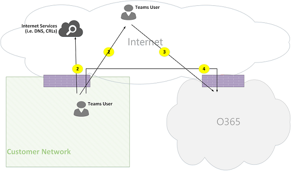
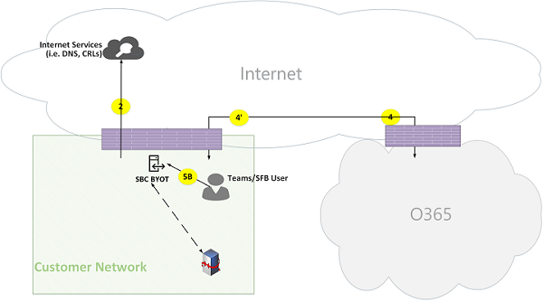

# Carrousel Microsoft TeamsMicrosoft Teams call flows

> [!Tip]
> Regardez la session suivante pour découvrir comment les équipes tirent parti de votre réseau et comment planifier une connectivité réseau optimale : [planification du réseau teams](https://aka.ms/teams-networking)Watch the following session to learn how Teams leverages your network and how to plan for optimal network connectivity: [Teams Network Planning](https://aka.ms/teams-networking)

## Vue d’ensembleOverview
Cet article décrit comment teams utilise les flux d’appels d’Office 365 dans différentes topologies.This article describes how Teams uses Office 365 call flows in various topologies. Par ailleurs, il décrit les flux d’équipes uniques qui sont utilisés pour la communication de médias P2P.In addition, it describes unique Teams flows that are used for peer-to-peer media communication. Ce document décrit ces flux, leur objet, leur origine et leurs arrêts sur le réseau.The document describes these flows, their purpose, and their origin and termination on the network. Dans le cadre de cet article, procédez comme suit :For purposes of this article, assume the following:

- Flow X est utilisé par le client Office 365 local pour communiquer avec le service 365 Office dans le Cloud.Flow X is used by the on-premises Office 365 client to communicate with the Office 365 service in the cloud. Il provient du réseau du client et il se termine par un point de terminaison dans Office 365.It originates from the customer network, and it terminates as an endpoint in Office 365.

- Le flux Y est utilisé par le client Office 365 local pour communiquer avec un service sur Internet sur lequel Office 365 a une dépendance.Flow Y is used by the on-premises Office 365 client to communicate with a service on the Internet that Office 365 has a dependency on. Ce service provient du réseau du client et il se termine par un point de terminaison sur Internet.It originates from the customer network, and it terminates as an endpoint on the Internet.

L’article contient les sections suivantes :The article contains the following sections:

- En **arrière-plan** : fournit des informations d’arrière-plan, telles que des réseaux que le flux d’Office 365 transmet, une interopérabilité, des recommandations en matière de connectivité du réseau du client aux points de terminaison du service 365 Office, l’interopérabilité avec les composants tiers et principes utilisés par les équipes pour sélectionner les flux multimédias.**Background** - Provides background information, such as networks that Office 365 flows may traverse, type of traffic, connectivity guidance from the customer network to Office 365 service endpoints, interoperability with third-party components, and principles that are used by Teams to select media flows.

- **Flux d’appels dans différentes topologies** : illustre l’utilisation des flux d’appels dans différentes topologies.**Call flows in various topologies** - Illustrates the use of call flows in various topologies. Pour chaque topologie, la section énumère tous les flux pris en charge et illustre l’utilisation de ces flux par le biais de plusieurs cas d’utilisation.For each topology, the section enumerates all supported flows and illustrates how these flows are used via several use cases. Pour chaque cas d’utilisation, elle décrit la séquence et la sélection de flux à l’aide d’un diagramme de flux.For each use case, it describes the sequence and selection of flows via a flow diagram. 

- **Teams avec l’optimisation d’itinéraire rapide** -décrit le mode d’utilisation de ces flux lorsque l’itinéraire rapide est déployé à des fins d’optimisation, illustré par une topologie simple.**Teams with Express Route optimization** - Describes how these flows are used when Express Route is deployed for optimization, illustrated via a simple topology.

## Arrière-planBackground
### Segments réseauNetwork segments
**Réseau du client**: il s’agit du segment réseau que vous contrôlez et gérez.**Customer network**: This is the network segment that you control and manage. Il s’agit de toutes les connexions aux clients au sein des bureaux du personnel, qu’il s’agisse d’un réseau filaire ou sans fil, entre les bâtiments d’Office, les centres de donnes locaux et vos connexions aux fournisseurs d’accès à Internet, à l’itinéraire rapide ou à tout autre homologation privée.This includes all customer connections within customer offices, whether wired or wireless, between office buildings, to on-premises datacenters, and your connections to Internet providers, Express Route, or any other private peering. 

En règle générale, un réseau de clients est doté de plusieurs périmètres réseau avec des pare-feu et/ou des serveurs proxy, qui appliquent les stratégies de sécurité de votre organisation, et qui autorisent uniquement le trafic réseau configuré et configuré.Typically, a customer network has several network perimeters with firewalls and/or proxy servers, which enforce your organization's security policies, and that only allow certain network traffic that you have set up and configured. Dans la mesure où vous gérez ce réseau, vous disposez d’un contrôle direct sur les performances du réseau, et il est vivement recommandé d’effectuer les évaluations réseau pour valider les performances des sites de votre réseau et de votre réseau au réseau 365 Office.Because you manage this network, you have direct control over the performance of the network, and it is highly recommended that you complete network assessments to validate performance both within sites in your network and from your network to the Office 365 network. 

**Internet**: il s’agit du segment réseau qui fait partie de votre réseau global qui sera utilisé par les utilisateurs qui se connectent à Office 365 depuis l’extérieur du réseau du client.**Internet**: This is the network segment that is part of your overall network that will be used by users who are connecting to Office 365 from outside of the customer network. Il est également utilisé par du trafic du réseau du client vers Office 365.It is also used by some traffic from the customer network to Office 365. 

**Visité/réseau privé invité**: il s’agit du segment réseau hors du réseau de votre client, mais pas du public Internet, que vos utilisateurs et/ou leurs invités peuvent consulter.**Visited/Guest private network**: This is the network segment outside your customer network, but not in the public Internet, that your users and/or their guests may visit. Par exemple, une connexion réseau privée privée ou un réseau privé d’entreprise, qui ne déploie pas de teams, où les utilisateurs et/ou leurs clients qui interagissent avec les services teams peuvent résider.For example, home private network or an Enterprise private network, that does not deploy Teams, where your users and/or their customers that interact with Teams services may reside.

>**Remarque**: la connectivité à Office 365 s’applique également à ces réseaux.**Note**: Connectivity to Office 365 is also applicable to these networks.

**Office 365**: il s’agit du segment réseau qui prend en charge les services Office 365.**Office 365**: This is the network segment that supports Office 365 services. Ce service est distribué partout dans le monde avec des bords proches du réseau du client, dans la plupart des pays.It is distributed worldwide with edges in proximity to the customer network in most locations. Les fonctions mentionnées dans ce document incluent le relais de transport, le serveur de conférence et le processeur multimédia.Functions mentioned in this document include Transport Relay, conferencing server, and Media Processor. 

**Itinéraire rapide (facultatif)**: il s’agit du segment réseau qui fait partie de votre réseau global et qui vous offrira une connexion privée et dédiée au réseau Office 365.**Express Route (optional)**: This is the network segment that is part of your overall network that will give you a dedicated, private connection to the Office 365 network.

### Types de traficTypes of traffic

**Éléments multimédias en temps réel**: données encapsulées au sein d’un protocole RTP (Real-Time Transport Protocol) prenant en charge les charges audio et vidéo et le partage d’écran.**Real-time media**: Data encapsulated within RTP (Real-time Transport Protocol) that supports audio, video and screen sharing workloads. En règle générale, le trafic multimédia est sensible à la latence, de telle sorte que vous souhaitez que ce trafic prenne le plus en chemin direct possible et qu’il utilise le protocole UDP et TCP en tant que protocole de couche de transport, qui est le meilleur transport pour le média en temps réel interactif du point de vue de la qualité .In general, media traffic is highly latency sensitive, so you would want this traffic to take the most direct path possible, and to use UDP versus TCP as the transport layer protocol, which is the best transport for interactive real time media from a quality perspective. (Remarque : en dernier recours, le média peut utiliser TCP/IP et être mis en tunnel dans le protocole HTTP, mais il n’est pas recommandé en raison d’implications de qualité incorrectes.) Le flux RTP est sécurisé via SRTP, dans lequel seule la charge utile est chiffrée.(Note: As a last resort, media can use TCP/IP and also be tunneled within the HTTP protocol, but it is not recommended due to bad quality implications.) RTP flow is secured via SRTP, in which only the payload is encrypted.

**Signalisation**: lien communication entre le client et le serveur ou d’autres clients qui sont utilisés pour contrôler les activités (par exemple, lorsqu’un appel est lancé) et livrer des messages instantanés.**Signaling**: The communication link between the client and server, or other clients that are used to control activities (for example, when a call is initiated), and deliver instant messages. La plupart du trafic de signalisation utilise les interfaces REST basées sur HTTPs, mais dans certains scénarios (par exemple, connexion entre Office 365 et contrôleur de bordure de session), elle utilise le protocole SIP.Most signaling traffic uses the HTTPS-based REST interfaces, though in some scenarios (for example, connection between Office 365 and a Session Border Controller) it uses SIP protocol. Il est important de comprendre que ce trafic est beaucoup plus sensible à la latence, mais qu’il peut entraîner des délais d’expiration de service ou des délais d’expiration de l’appel si la latence entre les points de terminaison est supérieure à plusieurs secondes.It's important to understand that this traffic is much less sensitive to latency but may cause service outages or call timeouts if latency between the endpoints exceeds several seconds. 

### Connectivité à Office 365Connectivity to Office 365

Teams nécessite une [connexion à Internet](https://support.office.com/article/connectivity-to-the-internet-64b420ef-0218-48f6-8a34-74bb27633b10).Teams requires [connectivity to the Internet](https://support.office.com/article/connectivity-to-the-internet-64b420ef-0218-48f6-8a34-74bb27633b10). Les URL et plages d’adresses IP du point de terminaison équipes sont répertoriées dans les [URL et plages d’adresses IP Office 365](https://docs.microsoft.com/office365/enterprise/urls-and-ip-address-ranges).Teams endpoint URLs and IP address ranges are listed in [Office 365 URLs and IP address ranges](https://docs.microsoft.com/office365/enterprise/urls-and-ip-address-ranges). (Remarque : ouvrir la connectivité aux ports TCP 80 et 443 et aux ports UDP 3478 à 3481 est requis.) Par ailleurs, teams est lié à Skype entreprise Online et doit également être connecté à Internet.(Note: Open connectivity to TCP ports 80 and 443, and to UDP ports 3478 through 3481 is required.) Furthermore, Teams has a dependency on Skype for Business Online, which must also be connected to the Internet.

La connectivité des flux multimédias teams est implémentée par le biais de procédures de norme IETF (Internet Connectivity Establishing).Teams media flows connectivity is implemented via standard IETF ICE (Interactive Connectivity Establishment) procedures.

### Restrictions d’interopérabilitéInteroperability restrictions
**Relais multimédias tiers**: une équipe flux multimédia (autrement dit, l’un des points de terminaison de média est Teams) peut uniquement traverser des équipes ou des relais multimédias natifs Skype entreprise.**Third party media relays**: A Teams media flow (that is, one of the media endpoints is Teams) may traverse only Teams or Skype for Business native media relays. L’interopérabilité avec un relais multimédia tiers n’est pas pris en charge.Interoperability with a third party media relay is not supported. (Remarque : un autre fournisseur de SBC sur la limite du réseau PSTN doit mettre fin au flux RTP/RTCP, sécurisé via SRTP et ne pas le transmettre au tronçon suivant.)(Note: A third party SBC on the boundary with PSTN must terminate RTP/RTCP stream, secured via SRTP, and not relay it to the next hop.)

**Serveurs proxy SIP tiers**: une boîte de dialogue d’équipes de signalisation SIP avec un SBC et/ou une passerelle tierce est susceptible de traverser des équipes ou des PROXYs SIP en natif Skype entreprise.**Third party SIP proxy servers**: A Teams signaling SIP dialog with a third party SBC and/or gateway may traverse Teams or Skype for Business native SIP proxies. L’interopérabilité avec un proxy SIP tiers n’est pas prise en charge.Interoperability with a third party SIP proxy is not supported.

**B2BUA tiers (c’est-à-dire, SBC)**: le flux multimédia d’équipes du RTC est arrêté par un SBC tiers.**Third party B2BUA (that is, SBC)**: A Teams media flow from/to the PSTN is terminated by a third party SBC. Toutefois, l’interopérabilité avec un SBC tiers au sein du réseau de Teams (c’est-à-dire une tierce partie de la fonction d’interconnexion de deux équipes/points de terminaison Skype entreprise) n’est pas prise en charge.However, interoperability with a third party SBC within the Teams network (that is, a third party SBC mediates two Teams/Skype for Business endpoints) is not supported.

### Technologies non recommandées par Microsoft teamsTechnologies that are not recommended with Microsoft Teams

**Réseau VPN**: elle n’est pas recommandée pour le trafic multimédia (c’est-à-dire le flux 2 ').**VPN network**: It is not recommended for media traffic (that is, flow 2'). Le client VPN doit utiliser une connexion VPN fractionnée et router le trafic multimédia comme tout utilisateur externe non VPN, https://blogs.technet.microsoft.com/nexthop/2011/11/14/enabling-lync-media-to-bypass-a-vpn-tunnel/comme indiqué dans la rubrique.The VPN client should use split VPN and route media traffic like any external non-VPN user, as specified in https://blogs.technet.microsoft.com/nexthop/2011/11/14/enabling-lync-media-to-bypass-a-vpn-tunnel/.

>**Remarque**: même si le titre est Lync, il s’applique également aux équipes.**Note**: Although the title is Lync, it is applicable to Teams as well.

**Formes de paquets**: tout type de paquets Snippers, d’inspection de paquets ou de périphériques de forme de paquets est déconseillé et risque de dégrader la qualité.**Packet shapers**: Any kind of packet snippers, packet inspection, or packet shaper devices are not recommended and may degrade quality significantly. 

### ExposésPrinciples
Il existe quatre principes généraux qui vous permettent de comprendre les flux d’appels pour Microsoft teams :There are four general principles that help you understand call flows for Microsoft Teams:
 
1.  Une conférence Microsoft teams est hébergée par Office 365 dans la même région où le premier participant rejoint.A Microsoft Teams conference is hosted by Office 365 in the same region where the first participant joined. (Remarque : s’il existe des exceptions à cette règle dans certaines topologies, celles-ci sont décrites dans ce document et illustrées par un flux d’appels approprié.)(Note: If there will be exceptions to this rule in some topologies, then they will be described in this document, and illustrated by an appropriate call flow.)

2.  Un point de terminaison de média teams dans Office 365 est utilisé en fonction du traitement multimédia requis et non en fonction du type d’appel.A Teams media endpoint in Office 365 is used based on media processing needs and not based on call type. Par exemple, un appel point à point est susceptible d’utiliser un point de terminaison multimédia dans le Cloud pour traiter du contenu multimédia pour la transcription et/ou l’enregistrement, tandis qu’une conférence avec deux participants n’utilise pas de point de terminaison multimédia dans le Cloud.) Toutefois, la plupart des conférences utilisent un point de terminaison de média à des fins de mixage et de routage, qui est alloué au lieu d’hébergement de la Conférence.(For example, a point-to-point call may use a media endpoint in the cloud to process media for transcription and/or recording, while a conference with two participants may not use any media endpoint in the cloud.) However, most conferences will use a media endpoint for mixing and routing purposes, allocated where the conference is hosted. Le trafic multimédia envoyé d’un client à un point de terminaison de média est acheminé directement ou utiliser un relais de transport dans Office 365 si cela est requis en raison de restrictions de pare-feu du réseau du client.The media traffic sent from a client to the media endpoint may be routed directly or use a Transport Relay in Office 365 if required due to customer network firewall restrictions. 

3.  Le trafic multimédia pour les appels d’égal à égal utilise l’itinéraire le plus direct disponible, en supposant que l’appel n’impose pas de point de terminaison multimédia dans le Cloud (voir #2 ci-dessus).Media traffic for peer-to-peer calls take the most direct route that is available, assuming that the call doesn't mandate a media endpoint in the cloud (see #2 above). L’itinéraire par défaut est diriger vers l’homologue distant (client), mais si ce routage n’est pas disponible, un ou plusieurs relais de transport relayeront le trafic.The preferred route is direct to the remote peer (client), but if that route isn't available, then one or more Transport Relays will relay traffic. Il est recommandé que le trafic multimédia ne soit pas transforme des serveurs tels que les formes de paquets, les serveurs VPN, etc., car cela aura un impact sur la qualité du média.It is recommended that media traffic shall not transverse servers such as packet shapers, VPN servers, and so on, since this will impact the media quality.

4.  Le trafic de signalisation passe toujours au serveur le plus proche de l’utilisateur.Signaling traffic always goes to the closest server to the user. 

Pour en savoir plus sur les informations sur le chemin multimédia choisi, voir https://www.youtube.com/watch?v=1tmHMIlAQdo.To learn more about the details on the media path that is chosen, see https://www.youtube.com/watch?v=1tmHMIlAQdo.

## Flux d’appels dans différentes topologiesCall flows in various topologies
### Topologie teamsTeams topology
Cette topologie est utilisée par les clients qui tirent parti des services d’équipe du Cloud sans déploiement local, tels que Skype entreprise Server ou le routage direct du système téléphonique.This topology is used by customers that leverage Teams services from the cloud without any on-premises deployment, such as Skype for Business Server or Phone System Direct Routing. Par ailleurs, l’interface à Office 365 est réalisée via Internet sans Azure Express route.In addition, the interface to Office 365 is done via the Internet without Azure Express Route. 

*Figure 1 : topologie teams**Figure 1 - Teams topology*

Notez que :Note that:

- Le sens des flèches sur le diagramme ci-dessus correspond au sens de début de la communication qui affecte la connectivité aux périmètres d’entreprise.The direction of the arrows on the diagram above reflect the initiation direction of the communication that affects connectivity at the enterprise perimeters. Dans le cas d’UDP pour le média, le (s) premier (s) fichier (s) peut s’afficher dans le sens inverse, mais ces paquets peuvent être bloqués jusqu’à ce que les paquets dans l’autre direction soient acheminés.In the case of UDP for media, the first packet(s) may flow in the reverse direction, but these packets may be blocked until packets in the other direction will flow.
- Les équipes sont déployées côte à côte avec Skype entreprise Online, de sorte que les clients apparaissent comme un « teams/marketing User ».Teams is deployed side by side with Skype for Business Online, hence clients are displayed as "Teams/SFB user".

Vous trouverez plus d’informations sur les topologies facultatives suivantes, plus loin dans cet article :You can find more information on the following optional topologies later in the article:

- Le déploiement local de Skype entreprise est décrit dans **topologie hybride teams**.Skype for Business on-premises deployment is described in **Teams  hybrid topology**.
- Le routage direct du système téléphonique (pour la connectivité PSTN) est décrit dans **teams avec une topologie de routage direct**.Phone System Direct Routing (for PSTN connectivity) is described in **Teams with Direct Routing topology**.
- L’itinéraire rapide est décrit dans **teams avec l’optimisation de l’itinéraire rapide**.Express Route is described in  **Teams with Express Route optimization**.

**Descriptions de flux**:**Flow descriptions**:
- **Flux 2** : représente un flux initié par un utilisateur sur le réseau du client sur Internet dans le cadre de l’utilisation des équipes de l’utilisateur.**Flow 2** – Represents a flow initiated by a user on the customer network to the Internet as a part of the user's Teams experience. Le DNS et le média d’égal à égal sont des exemples de ces flux.Examples of these flows are DNS and peer-to-peer media.
- **Flux 2 '** – représente un flux déclenché par un utilisateur d’équipes mobiles distantes, avec VPN pour le réseau du client.**Flow 2'** – Represents a flow initiated by a remote mobile Teams user, with VPN to the customer network. 
- **Flux 3** – représente un flux initié par un utilisateur d’équipes mobiles distant aux points de terminaison Office 365/Teams.**Flow 3** – Represents a flow initiated by a remote mobile Teams user to Office 365/Teams endpoints. 
- **Flux 4** – représente un flux initié par un utilisateur sur le réseau du client aux points de terminaison Office 365/Teams.**Flow 4** – Represents a flow initiated by a user on the customer network to Office 365/Teams endpoints.
- **Flux 5** : représente un flux multimédia d’égal à égal entre une équipe et un utilisateur de teams ou Skype entreprise au sein du réseau du client.**Flow 5** – Represents a peer-to-peer media flow between a Teams user and another Teams or Skype for Business user within the customer network.
- **Flux 6** : représente un flux multimédia P2P entre un utilisateur de l’équipe mobile distant et une autre équipe mobile distante ou un utilisateur Skype entreprise sur Internet.**Flow 6** – Represents a peer-to-peer media flow between a remote mobile Teams user and another remote mobile Teams or Skype for Business user over the Internet.

#### Cas d’utilisation : un-à-unUse case: One-to-one
Les appels un-à-un utilisent un modèle courant dans lequel l’appelant obtiendra un ensemble de candidatures composées d’adresses IP et de ports (par exemple, local, Relay et réflexive (adresse IP publique du client).One-to-one calls use a common model in which the caller will obtain a set of candidates consisting of IP addresses/ports--including local, relay, and reflexive (public IP address of client as seen by the relay) candidates. L’appelant envoie ces candidats à la partie appelée ; le tiers appelé obtient également un ensemble de candidats similaire et les envoie à l’appelant.The caller sends these candidates to the called party; the called party also obtains a similar set of candidates and sends them to the caller. STUNx, xxx xxx xxxx xxxx xxxx xxxx xxxx xxxx xxxx xxxx xxxx xxxx xxxx xxxx xxxx xxxx xxxx xxxx xxxx xxxx xxxx xxxx xxxx xxxx xxxx xxxx xxxx xxxx xxxx xxxx.STUN connectivity check messages are used to find which caller/called party media paths work, and the best working path is selected. Les éléments multimédias (c’est-à-dire les paquets RTP/RTCP sécurisés via SRTP) sont ensuite envoyés avec la paire de candidats sélectionnée.Media (that is, RTP/RTCP packets secured via SRTP) are then sent using the selected candidate pair. Le relais de transport est déployé dans le cadre d’Office 365.The Transport relay is deployed as part of Office 365.

Si l’adresse IP locale/le port candidats ou les candidats réflexives ont une connectivité, le chemin d’accès direct entre les clients (ou par le biais d’un NAT) est sélectionné pour le média.If the local IP address/port candidates or the reflexive candidates have connectivity, then the direct path between the clients (or via a NAT) will be selected for media. Si les clients sont sur le réseau du client, le chemin d’accès direct doit être sélectionné.If the clients are both on the customer network, then the direct path should be selected. Cela nécessite une connectivité UDP directe au sein du réseau du client.This requires direct UDP connectivity within the customer network. Si les clients sont les utilisateurs du Cloud Nomadic, puis, en fonction du NAT/pare-feu, le contenu multimédia pourra utiliser une connectivité directe.If the clients are both nomadic cloud users, then depending on the NAT/firewall, media may use direct connectivity.

Si un client est interne sur le réseau du client et si un client est externe (par exemple, un utilisateur du Cloud mobile), il est peu probable que la connectivité directe entre les candidats local ou réflexive fonctionne.If one client is internal on the customer network and one client is external (for example, a mobile cloud user), then it is unlikely that direct connectivity between the local or reflexive candidates is working. Dans ce cas, il est possible d’utiliser l’un des candidats de relais de transport à partir de l’un des clients (par exemple, le client interne a obtenu un candidat de relais à partir du relais de transport dans Office 365 ; le client externe doit être en mesure d’envoyer des paquets STUN/RTP/RTCP au Relais de transport).In this case, an option is to use one of the Transport Relay candidates from either client (for example, the internal client obtained a relay candidate from the Transport relay in Office 365; the external client needs to be able to send STUN/RTP/RTCP packets to the transport relay). Une autre option consiste à ce que le client interne envoie à la candidature de relais obtenu par le client Cloud mobile.Another option is the internal client sends to the relay candidate obtained by the mobile cloud client. Notez que, même si la connectivité UDP pour le média est fortement recommandée, TCP est pris en charge.Note that, although UDP connectivity for media is highly recommended, TCP is supported.

**Étapes de niveau supérieur**:**High-level steps**:
1. L’utilisateur de teams A résout le nom de domaine d’URL (DNS) via flow2Teams User A resolves URL domain name (DNS) via flow2
2. L’utilisateur de teams A alloue un port de relais multimédia sur Team Relay Relay via le flux 4Teams User A allocates a media Relay port on Teams Transport Relay via flow 4
3. L’utilisateur teams A envoie une invitation à une glace via le flux 4 à Office 365Teams User A sends "invite" with ICE candidates via flow 4 to Office 365
4. Office 365 envoie une notification à l’utilisateur de teams B via le flux 4Office 365 sends notification to Teams User B via flow 4
5. L’utilisateur de teams B alloue un port de relais multimédia sur le relais de transport teams via le flux 4Teams User B allocates a media Relay port on Teams Transport Relay via flow 4
6. L’utilisateur de teams B envoie « Answer » avec des candidats de glace par le biais du flux 4, qui est renvoyé à l’utilisateur de teams A via Flow 4Teams User B sends "answer" with ICE candidates via flow 4, which is forwarded back to Teams User A via Flow 4
7. Les utilisateurs teams A et équipe B appellent des tests de connectivité ICE et le meilleur chemin multimédia disponible est sélectionné (voir les diagrammes ci-dessous pour de nombreux cas d’utilisation)Teams User A and Teams User B invoke ICE connectivity tests and the best available media path is selected (see diagrams below for various use cases)
8. Les utilisateurs de teams envoient la télémétrie à Office 365 via Flow 4Teams Users send telemetry to Office 365 via flow 4

**Au sein du réseau du client :****Within customer network:**

*Figure 2 : au sein du réseau du client**Figure 2 - Within customer network*
 
À l’étape 7, le flux de média d’égal à égal (5) est sélectionné.In step 7, peer-to-peer media flow 5 is selected.
 
Le média est bidirectionnel.Media is bidirectional. Le sens du flux 5 indique qu’un côté initialise la communication du point de vue de la connectivité, conformément à tous les flux figurant dans ce document.The direction of flow 5 indicates that one side initiates the communication from a connectivity perspective, consistent with all the flows in this document. Dans le cas présent, il n’y a pas d’importance quant à la direction utilisée, car les deux points de terminaison sont au sein du réseau du client.In this case, it doesn't matter which direction is used because both endpoints are within the customer network.

**Connexion du réseau du client aux utilisateurs externes (médias relayés par teams Relay Relay) :****Customer network to external user (media relayed by Teams Transport Relay):**

*Figure 3 : réseau des clients pour les utilisateurs externes (média relayée par Team Relay Relay)**Figure 3 - Customer network to external user (media relayed by Teams Transport Relay)*
 
À l’étape 7, flux 4, du réseau du client vers Office 365 et flux 3, à partir de l’application mobile teams vers Office 365, sont sélectionnées.In step 7, flow 4, from customer network to Office 365, and flow 3, from remote mobile Teams user to Office 365, are selected. Ces flux sont relayés par teams transport Relay dans Office 365.These flows are relayed by Teams Transport Relay within Office 365.

Le média est bidirectionnel, la direction indiquant le côté qui initialise la communication du point de vue de la connectivité.Media is bidirectional, where direction indicates which side initiates the communication from a connectivity perspective. Dans ce cas, ces flux sont utilisés pour le signalement et le contenu multimédia, par le biais de protocoles de transport et d’adresses différents.In this case, these flows are used for signaling and media, via different transport protocols and addresses.

**Connexion du réseau du client aux utilisateurs externes (médias directs) :****Customer network to external user (direct media):**

*Figure 4 : réseau du client pour les utilisateurs externes (médias directs)**Figure 4 - Customer network to external user (direct media)*
 
À l’étape 7, flux 2, du réseau du client vers Internet (homologue du client), est sélectionné.In step 7, flow 2, from customer network to Internet (client's peer), is selected.
- Les éléments multimédias directs avec les utilisateurs mobiles distants (qui ne sont pas relayés via Office 365) sont facultatifs.Direct media with remote mobile user (that is, not relayed through Office 365) is optional. En d’autres termes, le client doit bloquer ce chemin pour appliquer un chemin multimédia par le biais du relais de transport dans Office 365.In other words, customer may block this path to enforce a media path through Transport Relay in Office 365.

- Le média est bidirectionnel.Media is bidirectional. Le sens du flux 2 vers l’utilisateur mobile distant indique qu’un côté initialise la communication du point de vue de la connectivité.The direction of flow 2 to remote mobile user indicates that one side initiates the communication from a connectivity perspective. 

**Utilisateur VPN pour un utilisateur interne (médias relayés par Team Relay Relay)****VPN user to internal user (media relayed by Teams Transport Relay)**

*Figure 5 : utilisateur VPN pour un utilisateur interne (média relayée par Team Relay Relay)**Figure 5 - VPN user to internal user (media relayed by Teams Transport Relay)*
 
Le signalement entre le VPN et le réseau du client est acheminé via le flux 2.Signaling between the VPN to the customer network is via flow 2'. La signalisation entre le réseau du client et le 365 Office est par le biais du flux 4.Signaling between the customer network and Office 365 is via flow 4. Toutefois, le contenu multimédia passe outre le VPN et est acheminé via les flux 3 et 4 via teams Relay dans Office 365.However, media bypasses the VPN and is routed via flows 3 and 4 through Teams media relay in Office 365.

**Utilisateur VPN pour un utilisateur interne (médias directs)****VPN user to internal user (direct media)**

*Figure 6-utilisateur VPN pour un utilisateur interne (médias directs)**Figure 6 - VPN user to internal user (direct media)*

Le signalement entre le VPN et le réseau du client est acheminé via le flux 2.Signaling between the VPN to the customer network is via flow 2'. La signalisation entre le réseau du client et le 365 Office est par le biais du flux 4.Signaling between the customer network and Office 365 is via flow 4. Toutefois, le contenu multimédia passe outre le VPN et est acheminé via le flux 2 du réseau du client vers Internet.However, media bypasses the VPN and is routed via flow 2 from the customer network to the Internet.

Le média est bidirectionnel.Media is bidirectional. Le sens du flux 2 vers l’utilisateur mobile distant indique qu’un côté initialise la communication du point de vue de la connectivité.The direction of flow 2 to the remote mobile user indicates that one side initiates the communication from a connectivity perspective.

**Utilisateur VPN pour un utilisateur externe (médias directs)****VPN user to external user (direct media)**

*Figure 7 : utilisateur VPN pour un utilisateur externe (médias directs)**Figure 7 - VPN user to external user (direct media)*

La signalisation entre l’utilisateur VPN sur le réseau du client consiste à flux 2 'et à passer par le flux 4 à Office 365.Signaling between the VPN user to the customer network is via flow 2' and via flow 4 to Office 365. Toutefois, le média passe par un réseau privé virtuel et est routé via le flux 6.However, media bypasses VPN and is routed via flow 6.

Le média est bidirectionnel.Media is bidirectional. Le sens du flux 6 vers l’utilisateur mobile distant indique qu’un côté initialise la communication du point de vue de la connectivité.The direction of flow 6 to the remote mobile user indicates that one side initiates the communication from a connectivity perspective.

#### Cas d’utilisation : teams RTC par le biais d’Office 365 TrunkUse Case: Teams to PSTN through Office 365 Trunk
Le système téléphonique d’Office 365 permet de passer et de recevoir des appels à partir du réseau téléphonique public commuté (RTC).Office 365 has a Phone System that allows placing and receiving calls from the Public Switched Telephone Network (PSTN). Si le Trunking RTC est connecté par le biais de l’offre téléphonique du système téléphonique, il n’existe aucune exigence de connectivité spéciale pour ce cas d’utilisation.If the PSTN trunk is connected via the Phone System Calling Plan, then there are no special connectivity requirements for this use case. (Si vous voulez connecter votre propre Trunk PSTN local à Office 365, vous pouvez utiliser le routage direct du système téléphonique.)(If you want to connect your own on-premises PSTN trunk to Office 365, you can use Phone System Direct Routing.)

*Figure 8 : équipe RTC via le Trunking d’Office 365**Figure 8 - Teams to PSTN through Office 365 Trunk*

#### Cas d’utilisation : réunion teamsUse Case: Teams Meeting

Le serveur de conférence audio/vidéo/de partage d’écran (VBSS) fait partie d’Office 365.The audio/video/screen sharing (VBSS) conferencing server is part of Office 365. Il possède une adresse IP publique qui doit être accessible à partir du réseau du client et être accessible à partir d’un client Cloud Nomadic.It has a public IP address that must be reachable from the customer network and must be reachable from a Nomadic Cloud client. Chaque client/point de terminaison doit être en mesure de se connecter au serveur de conférence.Each client/endpoint needs to be able to connect to the conferencing server.

Les clients internes obtiennent des candidats locaux, réflexurs et Relay de la même manière que pour les appels One-to-One.Internal clients will obtain local, reflexive, and relay candidates in the same manner as described for one-to-one calls. Les clients envoient ces candidats au serveur de conférence dans une invitation.The clients will send these candidates to the conferencing server in an invite. Le serveur de conférence n’utilise pas de relais car il dispose d’une adresse IP publique et publique, de sorte qu’il répond avec son candidat d’adresse IP local.The conferencing server does not use a relay since it has a publicly reachable IP address, so it responds with its local IP address candidate. Le client et le serveur de conférence vérifient la connectivité de la même manière que pour les appels One-to-One.The client and conferencing server will check connectivity in the same manner described for one-to-one calls. 

Notez que :Note that:

- Les clients Teams ne peuvent pas participer à des réunions Skype entreprise et les clients Skype entreprise ne peuvent pas participer à des réunions d’équipes.Teams clients cannot join Skype for Business meetings, and Skype for Business clients cannot join Teams meetings.

- Un utilisateur PSTN peut éventuellement « compose » ou « Dial », en fonction de l’organisateur de la réunion et/ou de la mise en service de la Conférence.A PSTN user optionally "Dials IN" or "Dialed OUT", depending on the meeting's organizer PSTN Calling and/or conferencing provisioning. 

- Un utilisateur invité ou un compte d’utilisateur peut rejoindre un réseau privé invité, lequel est protégé par le biais du panneau de gestion des messages et de tar avec des règles strictes.A guest user or a customer user may join from a guest private network, which is protected via FW/NAT with strict rules.

*Figure 9 : réunion teams**Figure 9 - Teams Meeting*

#### Cas d’utilisation : Fédération avec Skype entreprise sur siteUse Case: Federation with Skype for Business on premises

**Media relayés par teams transport Relay dans Office 365****Media relayed by Teams Transport Relay in Office 365**

*Figure 10 : contenu multimédia relayée par teams transport Relay dans Office 365**Figure 10 - Media relayed by Teams Transport Relay in Office 365*

Notez que :Note that:

- La Fédération est, par définition, une communication entre deux clients.Federation is, by definition, a communication between two tenants. Dans ce cas, le locataire A, qui utilise Teams, est fédérer avec le locataire B, qui utilise Skype entreprise sur site.In this case, tenant A, which uses Teams, federates with tenant B, which uses Skype for Business on premises. Si le client B utilise également Office 365, le client Skype entreprise aurait utilisé le flux 3 pour me connecter à Office 365.If tenant B is also using Office 365, then the Skype for Business client would have used flow 3 to connect with Office 365.

- Le signalement et le contenu multimédia du client fédéré Skype entreprise à Skype entreprise Server sur site n’est pas le cadre de ce document.Signaling and media from the federated Skype for Business client to on-premises Skype for Business Server is out of scope of this document. Toutefois, il est illustré ici pour plus de clarté.However, it is illustrated here for clarity.

- La signalisation entre teams et Skype entreprise est bridgeée par une passerelle dans Office 365.Signaling between Teams and Skype for Business is bridged by a gateway in Office 365.

- Dans le cas présent, les éléments multimédias sont relayés par teams transport Relay dans Office 365 vers le réseau du client et le client Skype entreprise distant via le flux 4.Media in this case is relayed by Teams Transport Relay in Office 365 to the customer network and remote Skype for Business client via flow 4.

**Média relayée par Skype entreprise Media Relay dans le client fédéré****Media relayed by Skype for Business Media Relay in federated tenant**

*Figure 11-média relayée par Skype entreprise Media Relay dans le client fédéré**Figure 11 - Media relayed by Skype for Business Media Relay in federated tenant*

Notez que :Note that:

- Le signalement et le contenu multimédia du client fédéré Skype entreprise à un serveur Skype entreprise local ne figurent pas dans ce document.Signaling and media from the federated Skype for Business client to an on-premises Skype for Business Server is out of scope of this document. Toutefois, il est illustré ici pour plus de clarté.However, it is illustrated here for clarity.

- La signalisation entre teams et Skype entreprise est bridgeée par une passerelle dans Office 365.Signaling between Teams and Skype for Business is bridged by a Gateway in Office 365.

- Dans le cas présent, les éléments multimédias sont relayés par Skype entreprise sur site sur le réseau du client via le flux 2.Media in this case is relayed by Skype for Business on-premises Media Relay to the customer network via flow 2. (Notez que le trafic de l’utilisateur teams vers le relais de média distant dans le réseau de clients fédérés sera bloqué initialement par le relais multimédia jusqu’à ce que le trafic de la direction inverse commence à circuler.(Note that traffic from Teams user to the remote Media Relay in the federated customer network will be initially blocked by the Media Relay until traffic in the reverse direction starts to flow. Toutefois, le flux bidirectionnel s’ouvre dans les deux sens.)However, the bidirectional flow will open connectivity in both directions.)

**Direct (pair à pair)****Direct (peer-to-peer)**

*Figure 12-directe (pair à pair)**Figure 12 - Direct (peer-to-peer)*

### Topologie hybride teamsTeams hybrid topology
Cette topologie inclut les équipes ayant un déploiement local de Skype entreprise.This topology includes Teams with a Skype for Business on-premises deployment.

*Figure 13 : topologie hybride teams**Figure 13 - Teams hybrid topology*
 
- Le sens des flèches sur le diagramme ci-dessus correspond au sens de début de la communication qui affecte la connectivité aux périmètres d’entreprise.The direction of the arrows on the diagram above reflect the initiation direction of the communication that affects connectivity at the enterprise perimeters. Dans le cas d’UDP pour le média, le (s) premier (s) fichier (s) peut s’afficher dans le sens inverse, mais ces paquets peuvent être bloqués jusqu’à ce que les paquets dans l’autre direction soient acheminés.In the case of UDP for media, the first packet(s) may flow in the reverse direction, but these packets may be blocked until packets in the other direction will flow.

- Les équipes sont déployées côte à côte avec Skype entreprise Online, de sorte que les clients apparaissent comme un « teams/marketing User ».Teams is deployed side by side with Skype for Business Online, hence clients are displayed as "Teams/SFB user".

Flux supplémentaires (en haut de la topologie Teams) :Additional flows (on top of Teams topology):
- **Flux 5A** : représente un flux multimédia P2P entre un utilisateur de teams au sein du réseau du client et un relais multimédia local Skype entreprise sur le réseau du client.**Flow 5A** – Represents a peer-to-peer media flow between a Teams user within the customer network and a Skype for Business on-premises media relay at the customer network edge.

#### Cas d’utilisation : équipes dans Skype entreprise One-en-OneUse Case: Teams to Skype for Business one-to-one
**Hybride au sein du réseau du client****Hybrid within the customer network**

*Figure 14-hybride au sein du réseau du client**Figure 14 - Hybrid within customer network*
 
La signalisation entre teams et Skype entreprise est bridgeée par une passerelle dans Office 365.Signaling between Teams and Skype for Business is bridged by a gateway in Office 365. Toutefois, le contenu multimédia est routé directement d’égal à égal au sein du réseau du client via le flux 5.However, media is routed directly peer-to-peer within the customer network via flow 5.

**Réseau client hybride avec des utilisateurs Skype entreprise externes : relayée par Office 365****Hybrid customer network with external Skype for Business user – relayed by Office 365**

*Figure 15-réseau de clients hybride avec des utilisateurs Skype entreprise externes relayés par Office 365**Figure 15 - Hybrid customer network with external Skype for Business user - relayed by Office 365*

Notez que :Note that:

- Le signalement et le contenu multimédia du client Skype entreprise à un serveur Skype entreprise local ne figurent pas dans le cadre de ce document.Signaling and media from the Skype for Business client to an on-premises Skype for Business Server is out of scope of this document. Toutefois, il est illustré ici pour plus de clarté.However, it is illustrated here for clarity.

- La signalisation entre teams et Skype entreprise est bridgeée par une passerelle dans Office 365.Signaling between Teams and Skype for Business is bridged by a gateway in Office 365.

- Le média est relayée via le relais de transport teams dans Office 365 vers le réseau du client via le flux 4.Media is relayed through Teams Transport Relay in Office 365 to the customer network through flow 4.

**Réseau client hybride avec des utilisateurs Skype entreprise externes : relayés par le bord local****Hybrid customer network with external Skype for Business user – relayed by on-premises Edge**

*Figure 16-réseau de clients hybride avec des utilisateurs Skype entreprise externes relayés par le biais d’un réseau local**Figure 16 - Hybrid customer network with external Skype for Business user - relayed by on-premises Edge*
 
Notez que :Note that:

- Le signalement et le contenu multimédia du client Skype entreprise à un serveur Skype entreprise local ne figurent pas dans le cadre de ce document.Signaling and media from Skype for Business client to an on-premises Skype for Business Server is out of scope of this document. Toutefois, il est illustré ici pour plus de clarté.However, it is illustrated here for clarity.

- La signalisation est bridgeée par une passerelle dans Office 365.Signaling is bridged by a gateway in Office 365.

- Le contenu multimédia est relayée par Skype entreprise Media Relay dans Skype entreprise local vers l’utilisateur teams au sein du réseau du client via le flux multimédia 5A.Media is relayed by Skype for Business Media Relay within Skype for Business on-premises Edge to Teams user within the customer network via media flow 5A.

### Équipe avec le système téléphonique-topologie de routage directeTeams with Phone System Direct Routing topology
Cette topologie inclut les équipes avec le routage direct du système téléphonique.This topology includes Teams with Phone System Direct Routing. 

Le routage direct vous permet d’utiliser un fournisseur de services RTC (réseau téléphonique commuté) tiers pris en charge par le jumelage d’un 365 appareil matériel de contrôleur de bordure de session (SBC) sur site, puis de connecter le Trunk de téléphonie à Cet appareil.Direct Routing enables you to use a third-party Public Switched Telephone Network (PSTN) service provider by pairing a supported on-premises customer-owned Session Border Controller (SBC) hardware device to Office 365, and then connecting the telephony trunk to that device. 

Pour prendre en charge ce scénario, le client doit déployer un SBC certifié pour le routage direct auprès de l’un des partenaires certifiés de Microsoft.To support this scenario, the customer must deploy a certified SBC for Direct Routing from one of Microsoft's certified partners. Le SBC doit être configuré conformément aux recommandations du fournisseur et être routable à partir d’Office 365 pour le trafic UDP direct.The SBC must be configured as recommended by the vendor, and be routable from Office 365 for direct UDP traffic. Le contenu multimédia risque d’être acheminé directement à partir d’équipes et/ou du client Skype entreprise vers l’SBC (contournement de la passerelle Teams) ou de traverser la passerelle Teams.The media may flow directly from Teams and/or the Skype for Business client to the SBC (bypassing the Teams gateway) or traverse through the Teams gateway. La connectivité avec le SBC, lorsque le Trunk est configuré pour ignorer la passerelle Teams, est basée sur la glace, où SBC prend en charge ICE-Lite, tandis que le point de terminaison teams/Skype entreprise prend en charge la gestion des contenus multimédias complets.The connectivity with the SBC, when the trunk is configured to bypass the Teams gateway, is based on ICE, where SBC supports ICE-Lite, while the Teams/Skype for Business media endpoint supports ICE Full. 

\* Figure 17-équipes avec topologie de routage directe du système téléphonique\*Figure 17 - Teams with Phone System Direct Routing topology

Notez que :Note that:

- Le sens des flèches sur le diagramme ci-dessus correspond au sens de début de la communication qui affecte la connectivité aux périmètres d’entreprise.The direction of the arrows on the diagram above reflect the initiation direction of the communication that affects connectivity at the enterprise perimeters. Dans le cas d’UDP pour le média, le (s) premier (s) fichier (s) peut s’afficher dans le sens inverse, mais ces paquets peuvent être bloqués jusqu’à ce que les paquets dans l’autre direction soient acheminés.In the case of UDP for media, the first packet(s) may flow in the reverse direction, but these packets may be blocked until packets in the other direction will flow.

- Les équipes sont déployées côte à côte avec Skype entreprise Online, de sorte que les clients apparaissent comme un « teams/marketing User ».Teams is deployed side by side with Skype for Business Online, hence clients are displayed as "Teams/SFB user".

Flux supplémentaires (en haut de la topologie teams Online) :Additional flows (on top of Teams online topology):
- **Flux 4 '** -représente un flux d’Office 365 vers le réseau du client, utilisé pour établir une connexion entre le serveur de média teams dans le Cloud et les SBC en local.**Flow 4'** - Represents a flow from Office 365 to the customer network, used to establish a connection between the Teams media server in the cloud with the SBC on premises.
- **Flux 5B** : représente un flux multimédia entre l’utilisateur teams au sein du réseau du client et l’SBC du routage direct en mode Bypass.**Flow 5B** – Represents a media flow between the Teams user within the customer network with the Direct Routing SBC in bypass mode.
- **Flux 5C** – représente un flux multimédia entre l’SBC du routage direct vers un autre SBC de routage direct dans un mode de contournement d’appel cheveux PSTN.**Flow 5C** – Represents a media flow between the Direct Routing SBC to another Direct Routing SBC in a PSTN hairpin call bypass mode.

**Utilisateur interne avec routage direct (média relayée par teams transport Relay dans Office 365)****Internal user with Direct Routing (media relayed by Teams Transport Relay in Office 365)**

*Figure 18-utilisateur interne avec routage direct (médias relayés par Team Relay dans Office 365)**Figure 18 - Internal user with Direct Routing (media relayed by Teams Transport Relay in Office 365)*

Notez que :Note that:
 
- L’SBC doit avoir une adresse IP publique qui est routable à partir d’Office 365.The SBC must have a public IP address that is routable from Office 365.

- Le signalement et le contenu multimédia de l’SBC à Office 365 et inversement utilisent le flux 4 et/ou le flux 4.Signaling and media from the SBC to Office 365 and vice versa use flow 4 and/or flow 4'.

- Le signalement et le contenu multimédia du client au sein du réseau du client vers Office 365 utilisent le flux 4.Signaling and media from the client within the customer network to Office 365 use flow 4.

**Utilisateur distant avec routage direct (le média est routé par le biais d’un serveur multimédia dans Office 365)****Remote user with Direct Routing (media is routed through a media server (MP) in Office 365)**

*Figure 19-utilisateur distant avec routage direct (le média est routé par le biais d’un serveur multimédia dans Office 365)**Figure 19 - Remote user with Direct Routing (media is routed through a media server (MP) in Office 365)*
 
Notez que :Note that:

- L’SBC doit avoir une adresse IP publique qui est routable à partir d’Office 365.The SBC must have a public IP address that is routable from Office 365.

- Le signalement et le contenu multimédia de l’SBC à Office 365 et inversement utilisent le flux 4 et/ou le flux 4.Signaling and media from the SBC to Office 365 and vice versa use flow 4 and/or flow 4'.

- Le signalement et le contenu multimédia du client sur Internet à Office 365 utilisent le flux 3.Signaling and media from the client on the Internet to Office 365 use flow 3.

**Routage direct de l’utilisateur interne (contournement du support multimédia)****Internal user Direct Routing (media bypass)**

*Figure 20-routage direct de l’utilisateur interne (contournement du support multimédia)**Figure 20 - Internal user Direct Routing (media bypass)*
 
Notez que :Note that:

- L’SBC doit avoir une adresse IP publique qui est routable à partir d’Office 365.The SBC must have a public IP address that is routable from Office 365.

- Le signalement de SBC à Office 365 et vice versa utilisent le flux 4 et/ou le flux 4.Signaling from SBC to Office 365 and vice versa use flow 4 and/or flow 4'.

- La signalisation du client au sein du réseau du client vers Office 365 utilise le flux 4.Signaling from client within the customer network to Office 365 use flow 4.

- Le média du client sur le réseau du client vers SBC au sein du réseau du client utilise le flux 5B.Media from client within the customer network to SBC within the customer network use flow 5B.

**Utilisateur distant avec routage direct (contournement de média relayée par Team Relay Relay dans Office 365)****Remote user with Direct Routing (media bypass relayed by Teams Transport Relay in Office 365)**

*Figure 21-utilisateur distant avec routage direct (contournement de média relayée par Team Relay Relay dans Office 365)**Figure 21 - Remote user with Direct Routing (media bypass relayed by Teams Transport Relay in Office 365)*

Notez que :Note that:

- L’SBC doit avoir une adresse IP publique qui est routable à partir d’Office 365 et Internet.The SBC must have a public IP address that is routable from Office 365 and Internet.

- Le signalement de l’SBC à Office 365 et inversement utilise le flux 4 et/ou le flux 4.Signaling from the SBC to Office 365 and vice versa uses flow 4 and/or flow 4'.

- Le signalement du client sur Internet à Office 365 utilise le flux 3.Signaling from the client on the Internet to Office 365 uses flow 3.

- Le contenu multimédia du client sur Internet à l’SBC au sein du réseau du client utilise les flux 3 et 4, relayés par teams transport Relay dans Office 365.Media from the client on the Internet to the SBC within the customer network uses flows 3 and 4, relayed by Teams Transport Relay in Office 365. 

**Routage direct de l’utilisateur distant (Bypass du support direct)****Remote user Direct Routing (media bypass direct)**

*Figure 22-routage direct de l’utilisateur distant (relais de média direct)**Figure 22 - Remote user Direct Routing (media bypass direct)*
 
Notez que :Note that:

- L’SBC doit avoir une adresse IP publique qui est routable depuis Office 365 et Internet.The SBC must have a public IP address that is routable from Office 365 and the Internet.

- Le signalement de l’SBC à Office 365 et inversement utilise le flux 4 et/ou le flux 4.Signaling from the SBC to Office 365 and vice versa uses flow 4 and/or flow 4'.

- Le signalement du client sur Internet à Office 365 utilise le flux 3.Signaling from the client on the Internet to Office 365 uses flow 3.

- Le contenu multimédia du client sur Internet à l’SBC au sein du réseau du client utilise le flux 2.Media from the client on the Internet to the SBC within the customer network uses flow 2.

**Routage direct (contournement du support multimédia) – appel cheveux RTC (en raison du transfert d’appel ou du transfert d’appel)****Direct Routing (media bypass) – PSTN hairpin call (due to call forward/transfer)**

*Figure 23-routage direct (contournement de média)-appel cheveux RTC (en raison d’un renvoi d’appel/transfert)**Figure 23 - Direct Routing (media bypass) - PSTN hairpin call (due to call forward/transfer)*
 
Notez que :Note that:

- L’SBC doit avoir une adresse IP publique qui est routable à partir d’Office 365.The SBC must have a public IP address that is routable from Office 365.

- Le signalement de l’SBC à Office 365 et inversement utilise le flux 4 et/ou le flux 4.Signaling from the SBC to Office 365 and vice versa uses flow 4 and/or flow 4'.

- Le client n’est pas dans la boucle de signalisation et de média une fois que l’appel est hairpinned de RTC à PSTN.The client is out of the signaling and media loop after the call is hairpinned from PSTN to PSTN.

- Les éléments multimédias de l’instance SBC A au sein du réseau du client à l’instance SBC B au sein du réseau du client (où, A et B peuvent être de la même instance) utilise le flux 5C.Media from SBC instance A within the customer network to SBC instance B within the customer network (where, A and B can be the same instance) uses flow 5C.

**Routage direct (média via Office 365) – appel RTC cheveux sur deux clients****Direct Routing (media through Office 365) – PSTN hairpin call across two tenants**

*Figure 24-routage direct (média via Office 365)-appel cheveux RTC sur deux clients**Figure 24 - Direct Routing (media through Office 365) – PSTN hairpin call across two tenants*
 
Notez que :Note that:

- L’SBC doit avoir une adresse IP publique qui est routable à partir d’Office 365.The SBC must have a public IP address that is routable from Office 365.

- Le signalement de l’SBC à Office 365 et inversement utilise le flux 4 et/ou le flux 4.Signaling from the SBC to Office 365 and vice versa uses flow 4 and/or flow 4'.

- Le client n’est pas dans la boucle de signalisation et de média une fois que l’appel est hairpinned de RTC à PSTN.The client is out of the signaling and media loop after the call is hairpinned from PSTN to PSTN.

- Les éléments multimédias de l’instance SBC A au sein de l’instance du réseau du client X à l’instance SBC B doivent être relayés via le serveur multimédia Office 365 et ne peuvent pas utiliser le mode de contournement.Media from SBC instance A within the customer network X to SBC instance B must be relayed through the Office 365 Media Server and can't use bypass mode.

## Équipes avec l’optimisation de l’itinéraire rapideTeams with Express Route optimization

*Figure 25 : équipe avec l’optimisation de l’itinéraire rapide**Figure 25 - Teams with Express Route optimization*
 
Dans le cas où l’itinéraire rapide est justifié et déployé, les flux d’équipes peuvent être redirigés du flux 4 au flux 1 et du flux 4 'vers le flux 1 '.In the case that Express Route is justified and deployed, then Teams flows could be re-routed from flow 4 to flow 1 and from flow 4' to flow 1'. Toutefois, l’application teams a une dépendance matérielle à l’aide d’autres flux d’Office 365 sur Internet via les flux 4 et 4. ces flux ne doivent donc pas être bloqués.However, Teams Application has a hard dependency on other Office 365 flows over the internet via flows 4 and 4'; hence these flows must not be blocked. 

Notez que le trafic Edge hybride Skype entreprise est routé vers Internet et ne peut pas être utilisé pour communiquer avec des utilisateurs externes et fédérer avec d’autres clients.Note that Skype for Business hybrid Edge traffic is routed to the Internet and not to Express Route to communicate with external users and federate with other tenants. 

Pour éviter les flux asymétriques, le rétablissement du routage doit être dans les deux directions.To prevent asymmetrical flows, re-routing must be in both directions. En d’autres termes, une adresse au sein du réseau du client est routable à partir d’Internet ou d’un itinéraire rapide, en fonction de l’optimisation, mais pas par les deux.In other words, an address within the customer network is routable either through Internet or Express Route, based on optimization, but not through both.

Par exemple :For example:

**Connexion du réseau du client aux utilisateurs externes (médias relayés par teams Relay Relay) :****Customer network to external user (media relayed by Teams Transport Relay):**

*Figure 26-réseau client pour les utilisateurs externes (média relayée par Team Relay Relay)**Figure 26 - Customer network to external user (media relayed by Teams Transport Relay)*
 
**Étapes de niveau supérieur :****High Level Steps:**
1. L’utilisateur de teams au sein du réseau du client résout le nom de domaine d’URL (DNS) via flow2Teams User within customer network resolves URL domain name (DNS) via flow2
2. L’utilisateur de teams au sein du réseau du client alloue un port de relais multimédia sur le relais de transport teams via le flux 1Teams User within customer network allocates a media Relay port on Teams Transport Relay via flow 1
3. L’utilisateur de teams au sein du réseau du client envoie une invitation à une glace via le flux 1 au bureau 365Teams User within customer network sends "invite" with ICE candidates via flow 1 to Office 365
4. OFFICE 365 envoie une notification à l’utilisateur d’équipes externes par le biais du flux 3OFFICE 365 sends notification to external Teams user via flow 3
5. L’utilisateur externe teams alloue un port de relais multimédia sur teams Relay Relay via le flux 3Teams external user allocates a media Relay port on Teams Transport Relay via flow 3
6. Les utilisateurs externes d’équipes envoient une réponse avec des candidats de glace via le flux 3, qui est renvoyé à l’utilisateur de teams par flux 1Teams external user sends "answer" with ICE candidates via flow 3, which is forwarded back to Teams user A via Flow 1
7. Les utilisateurs teams A et équipe B appellent des tests de connectivité ICE et sélectionne les flux 1 et 3 qui sont relayés par teams Relay Relay dans Office 365Teams User A and Teams User B invoke ICE connectivity tests and selects flows 1 and 3, which are relayed by Teams Transport Relay in Office 365
8. Les utilisateurs teams envoient la télémétrie à Office 365 via les flux 1 et 3Teams Users send telemetry to Office 365 via flows 1 and 3

>**Remarque**: le flux 4 doit être activé pour prendre en charge les dépendances de l’application teams sur d’autres micro-services mandatés par le flux 4.**Note**: Flow 4 must be enabled to support dependencies of Teams application on other micro-services that mandates flow 4.
