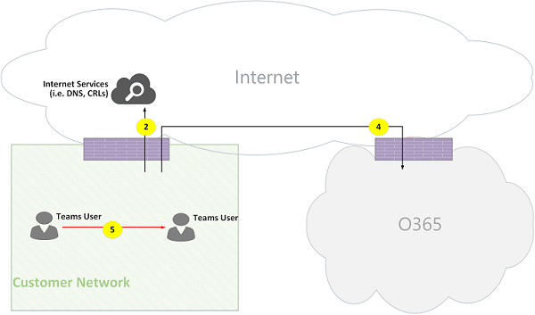

# Flux d’appel de Microsoft Teams en ligne

> [!Tip]
> Regarder la session suivante pour en savoir comment les équipes s’appuie sur votre réseau et comment mieux planifier la connectivité réseau optimale : [Planification des équipes réseau](https://aka.ms/teams-networking)

## Vue d’ensemble
Ce document décrit comment la charge de travail équipes utilise Office 365 flux dans diverses topologies. En outre, il spécifie uniques flux équipes qui sont utilisés pour les communications multimédias d’égal à égal. Le document énumère ces flux et décrit leurs rôles et leurs réseaux d’origine et d’arrêt. Par exemple, flux de X est utilisé par le client Office 365 sur site pour communiquer avec le service Office 365 dans le nuage, à l’origine à partir du réseau client et se termine par un point de terminaison dans le nuage Office 365, et flux Y est utilisé par le client Office 365 sur site pour communiquer avec un service sur Internet, Office 365 a un lien de dépendance, à l’origine à partir du réseau client et se termine par un point de terminaison sur Internet.

Le document a trois sections principales. La première fournit un plus d’informations, telles que les réseaux (qui peuvent traverser les flux d’Office 365), le type de trafic, conseils de connectivité réseau du client pour les points de terminaison de service Office 365, l’interopérabilité avec les composants de tiers et principaux qui sont utilisés par les équipes pour sélectionner les flux multimédias. La seconde illustre l’utilisation de ces flux dans diverses topologies. Pour chaque topologie, elle énumère tous les flux pris en charge et illustre l’utilisation de ces flux via plusieurs cas d’utilisation. Pour chaque cas d’utilisation, il décrit la séquence et la sélection de flux par le biais d’un diagramme de flux. Le troisième décrit comment ces flux est utilisés lors de l’itinéraire Express est déployée pour l’optimisation, illustrée par le biais d’une topologie simple.

## Arrière-plan
### Segments réseau
**Réseau client**: il s’agit du segment de réseau qui fait partie de votre réseau global que vous pouvez contrôler et gérer. Cela inclut toutes les connexions client au sein de bureaux client, si avec ou sans fil, entre bâtiments, aux centres de données locale et vos connexions à Internet fournisseurs itinéraire Express ou tout autre peering privé. 

En règle générale, un réseau client a plusieurs périmètres réseau avec pare-feu et/ou serveurs proxy, auquel appliquer les stratégies de sécurité d’une organisation et qui n’accepte que certain le trafic réseau que vous avez installé et configuré. Étant donné que le client gère ce réseau, le client a un contrôle direct sur les performances du réseau et il est fortement recommandé que le client complète réseau conclusion pour valider les performances dans les sites de votre réseau et à partir de votre réseau au réseau d’Office 365. Skype pour Business sur le déploiement local et PSTN Session Border Controller de se connecter à PSTN via votre réseau (par exemple, de routage Direct) sont facultatives.

**Internet**: il s’agit du segment de réseau qui fait partie de votre réseau global qui sera utilisé par les utilisateurs qui sont connectent au Cloud de 365 Office à partir d’en dehors du réseau client. Il est également utilisé par certains types de trafic entre le réseau du client vers Office 365 nuage. 

**Réseau privé visité/invité**: il s’agit du segment de réseau à l’extérieur de votre réseau du client, mais pas dans l’Internet public, qui leurs invités et/ou de vos utilisateurs peuvent visiter. Par exemple, réseau privé ou un réseau privé d’entreprise, qui ne déploie pas les équipes, où leurs clients qui interagissent avec les services d’équipes, et/ou de vos utilisateurs peuvent résider.

>**Remarque**: la connectivité à Office 365b est également applicable à ces réseaux.

**Office 365 Cloud**: il s’agit du segment de réseau qui prend en charge des services Office 365. Il est distribué dans le monde entier avec bords à proximité de réseau du client dans la plupart des emplacements. Fonctions mentionnées dans ce document incluent le relais de Transport, serveur de conférence et processeur média. 

**Itinéraire Express (facultatif)**: il s’agit du segment de réseau qui fait partie de votre réseau global qui offre une connexion privée dédiée au réseau Office 365.

### Types de trafic

**Médias en temps réel**: données encapsulées dans RTP (Real-Time Transport Protocol) et prend en charge les paramètres audio, vidéo et partage des charges de travail de l’écran. En règle générale, le trafic multimédia est hautement latence sensible, vous pouvez ce trafic à prendre le chemin le plus direct possible et à utiliser UDP et TCP comme protocole de couche de transport, qui est le meilleur transport multimédias interactifs en temps réel à partir du point de vue de la qualité. (Remarque : en dernier ressort, media utilisent le protocole TCP/IP et également être effectuée dans le protocole HTTP, mais il n’est pas recommandé en raison des implications en matière de mauvaise qualité.) Flux RTP est sécurisée par le biais du protocole SRTP, dans lequel seule la charge utile est chiffrée.

**Signalisation**: la liaison de communication entre le client et serveur ou d’autres clients qui sont utilisés pour contrôler les activités (par exemple, lorsqu’un appel est lancé) et remettre des messages instantanés. Trafic de signalisation plus utilise les interfaces REST basée sur HTTPS, cependant, dans certains scénarios (par exemple, la connexion entre Office 365 Cloud et un contrôleur de Session en périphérie) utilise le protocole SIP. Il est important de comprendre que ce trafic est beaucoup moins sensible à la latence, mais peut entraîner des pannes de service ou de délais d’attente des appels si la latence entre les points de terminaison dépasse quelques secondes. 

### Connectivité à Office 365

Les équipes service nécessite une [connectivité à Internet](https://support.office.com/article/connectivity-to-the-internet-64b420ef-0218-48f6-8a34-74bb27633b10). Points de terminaison équipes URL et IP de plages d’adresses sont répertoriés dans [Office 365 URL et plages d’adresses IP](https://docs.microsoft.com/office365/enterprise/urls-and-ip-address-ranges). (Remarque : il a besoin pour ouvrir la connectivité à des ports TCP 80 et 443 et 3478 3481 via des ports UDP.) En outre, service équipes a dépendance sur Skype pour le service en ligne d’entreprise, par conséquent, il est nécessaire pour se connecter également ce service à Internet.

Connectivité des équipes médias flux est implémentée par le biais des procédures standard IETF ICE (Interactive Connectivity Establishment).

### Restrictions d’interopérabilité
**Relais multimédia tiers**: flux de médias A équipes (autrement dit, un des points de terminaison multimédia est équipes) peut traverser les équipes ou Skype pour relais multimédia d’origine de Business. Interopérabilité avec relais multimédia tiers n’est pas pris en charge. (Remarque : une tierce partie SBC sur la limite de PSTN doit se terminer le flux RTP/RTCP, sécurisé via le protocole SRTP et pas les relais vers le tronçon suivant.)

**Serveurs de Proxy SIP tiers**: équipes A signalisation SIP de boîte de dialogue avec une tierce partie SBC et/ou de la passerelle peut parcourir les équipes ou Skype pour les proxys SIP natifs d’entreprise. Interopérabilité avec une tierce partie Proxy SIP n’est pas pris en charge.

**B2BUA tiers (autrement dit, SBC)**: flux de médias A équipes à partir de/à PSTN se termine par une tierce partie SBC. Toutefois, l’interopérabilité avec des tiers SBC au sein du réseau d’équipes (autrement dit, le tiers SBC gère la deux points de terminaison équipes/Skype pour Business) n’est pas pris en charge.

### Technologies fortement déconseillés avec Microsoft Teams

**Réseau VPN**: il est fortement déconseillé pour le trafic multimédia (autrement dit, le flux 2 »). Client de réseau privé virtuel doit utiliser fractionné VPN et le routage du trafic multimédia comme n’importe quel utilisateur externe non VPN, tel que spécifié danshttps://blogs.technet.microsoft.com/nexthop/2011/11/14/enabling-lync-media-to-bypass-a-vpn-tunnel/ 

>**Remarque**: bien que le titre Lync, il est également applicable aux équipes.

**Paquet agressives**: n’importe quel type de snippers de paquets, l’inspection des paquets ou périphériques de mise en forme de paquets sont vivement déconseillée et peut dégrader considérablement la qualité. 

### Principes
Il existe quatre principes généraux qui vous aident à comprennent les flux d’appels pour Microsoft Teams. 
1.  Une conférence Microsoft Teams est hébergée par le nuage Office 365 dans la même zone où le premier participant rejoint. (Remarque : si sera exceptions à cette règle dans des topologies, puis ils sont décrits dans ce document, illustré par un flux d’appels appropriée.)
2.  Un équipes multimédia du point de terminaison (MP) dans Office 365 dans le nuage est utilisé en fonction des besoins de traitement de support et non basés sur le type d’appel. (Par exemple, un appel point à point peut utiliser un point de terminaison multimédia dans le nuage pour processus multimédia pour transcription et/ou d’enregistrement, pendant une conférence avec deux participants ne pouvez pas utiliser un point de terminaison multimédia dans le nuage.) Toutefois, la plupart des conférences utilisera un Pack d’administration pour le mixage et de routage, allouée où se trouve la conférence. Le trafic multimédia envoyé à partir d’un client au panneau de gestion peuvent être acheminés directement ou utiliser un relais de Transport, dans Office 365 nuage, si nécessaire, en raison de restrictions de pare-feu réseau du client. 
3.  Pour le trafic multimédia pour les appels d’égal à égal prennent l’itinéraire plus direct qui n’est disponible, en supposant que l’appel n’impose un Pack d’administration dans le nuage (voir #2 ci-dessus). L’itinéraire par défaut est directe à l’homologue à distance (client), mais si cet itinéraire n’est pas disponible, un ou plusieurs relais Transport sera relayer le trafic. Il est recommandé que le trafic multimédia ne doit pas Portrait serveurs tels qu’agressives de paquets, les serveurs VPN, etc., car cela aura une incidence sur la qualité des médias.
4.  Toujours le trafic de signalisation atteint le serveur à l’utilisateur le plus proche. 

Pour en savoir plus sur les détails sur le chemin d’accès de média est choisi, voir https://www.youtube.com/watch?v=aD5mUg2ZzLQ.

## Flux d’appels dans diverses Topologies
### Les équipes de topologie (« pure ») en ligne
Cette topologie est utilisée par les clients qui exploitent les services des équipes du nuage sans déployer de n’importe quel serveur, telles que Skype pour les entreprises et SBC pour le routage Direct, en local. En outre, l’interface vers Office 365 s’effectue par le biais d’Internet sans itinéraire Azure Express. 

*Figure 1 : topologie (« pure ») en ligne équipes*

>**Notes**:
>- La direction des flèches dans le diagramme ci-dessus reflète la direction d’initiation de la communication qui affecte la connectivité au périmètre d’entreprise. Dans le cas de UDP pour le média, le premier paquet peut flux dans le sens inverse, mais ces paquets peuvent être bloquées jusqu'à ce que le flux des paquets dans le sens inverse.
>- Équipes Online est déployé en côte à côte Skype pour Business Online, par conséquent, les clients sont affichés sous forme de « Utilisateur équipes/SFB ».

- Skype facultatif pour les entreprises de déploiement local est décrit dans ce document dans la section **Topologie hybride en ligne d’équipes**
- Facultatif routage Direct PSTN est décrit dans ce document dans la section **Équipes en ligne avec la topologie de routage Direct**
- Facultatif Express itinéraire est décrit dans ce document dans la section **équipes avec optimisation d’itinéraire Express**

**Flux de Descriptions**:
- **Flux 2** – représente un flux initié par un utilisateur sur le réseau du client à Internet dans le cadre de son expérience des équipes. DNS et le support d’égal à égal sont des exemples de ces flux.
- **Flux 2'** – représente un flux initié par un utilisateur équipes mobile à distance au client réseau VPN. 
- **Flux de 3** – représente un flux initié par un utilisateur mobile équipes de points de terminaison Office 365/Teams. 
- **Flux 4** – représente un flux initié par un utilisateur sur le réseau du client pour les systèmes d’extrémité Office 365/Teams.
- **Flux de 5** – représente un flux multimédias d’égal à égal entre utilisateurs équipes et une autre équipes ou Skype pour les utilisateurs professionnels, au sein du réseau du client.
- **Flux de 6** – représente un support d’égal à égal entre un utilisateur équipes mobile à distance et une autre à distance des équipes mobiles ou Skype pour les utilisateurs professionnels, de flux sur Internet.

#### Cas d’utilisation : conversation
Appels univoque utilisent un modèle commun de que l’appelant obtiendra un ensemble de candidats constitué des adresses IP/port ; local, relais et réfléchis (adresse IP publique du client, comme indiqué par le relais). L’appelant envoie ces candidats à la partie appelée dans l’invitation, l’appelé également Obtient un ensemble de candidats similaire et les envoie à l’appelant. Vérification de la connectivité STUN messages sont utilisés pour rechercher l’appelant/appelé multimédia utiliser des chemins d’accès et le chemin d’accès de travail meilleures est sélectionné. Multimédia (autrement dit, des paquets RTP/RTCP sécurisés via le protocole SRTP) est envoyées à l’aide de la paire de candidat sélectionné. Le relais de Transport est déployé dans le cadre du nuage Office 365.

Si l’adresse IP locale adresse/port candidats ou les candidats réflexives disposent d’une connectivité, puis le chemin d’accès direct entre les clients (ou via un NAT) est sélectionné pour le média. Si les clients se trouvent sur le réseau du client, le chemin d’accès direct doit être sélectionné. Cela nécessite une connectivité UDP directe dans le réseau du client. Si les clients sont les deux utilisateurs nomades dans le nuage, puis selon le NAT/Pare-feu, media peut utiliser une connexion directe.

Si un client est interne sur le réseau du client et un client externe (par exemple, l’utilisateur mobile en nuage), puis il est peu probable que la connectivité directe entre les candidats locales ou réflexives fonctionne. Dans ce cas, une option consiste à utiliser une des candidats relais de Transport à partir d’un client (par exemple, le client interne obtenu un candidat relais à partir du relais de Transport dans Office 365 nuage, le client externe doit être en mesure d’envoyer des paquets STUN/RTP/RTCP pour le relais de transport). Une autre option est que le client interne envoie le candidat de relais obtenu par le client mobile dans le nuage. Notez que bien qu’est vivement recommandée de connectivité UDP pour le média, TCP est pris en charge.

**Étapes principales**:
1. L’utilisateur A résout URL nom de domaine (DNS) via Flux2 des équipes
2. Les équipes utilisateur A alloue un support port relais équipes Transport relais via le flux 4
3. Des équipes de l’utilisateur A envoie « inviter » avec les candidats ICE via flux 4 vers Office 365
4. OFFICE 365 envoie une notification à l’utilisateur d’équipes B par le biais du flux de 4
5. Les équipes utilisateur B alloue un support port relais équipes Transport relais via le flux 4
6. Équipes utilisateur B renvoie « réponse » avec les candidats ICE via flux 4, qui est renvoyé à l’utilisateur équipes A via le flux de 4
7. Équipes utilisateur A et équipes utilisateur B appeler des tests de connectivité ICE et le chemin d’accès de supports disponibles meilleures est sélectionnée (voir les diagrammes ci-dessous pour différents cas d’utilisation)
8. Les utilisateurs des équipes envoient télémétrie vers Office 365 par flux 4

**Au sein du réseau client :**

*Figure 2 : au sein du réseau de client*
 
À l’étape 7, les flux multimédias « d’égal à égal » 5 est sélectionnée 
>**Remarque**: multimédia est bidirectionnel. La direction du flux 5 indique qu’un côté établit la communication de la connectivité du point de vue, compatible avec tous les flux dans ce document. Dans ce cas, peu importe la direction dans laquelle est utilisée, car les deux points de terminaison sont dans le réseau du client.

**Réseau du client pour les utilisateurs externes (media relayés par les équipes Transport relais) :**

*La figure 3 - réseau du client pour les utilisateurs externes (media relayés par les équipes Transport relais)*
 
À l’étape 7, les flux de réseau du client vers Office 365, 4 et les flux de 3, les utilisateurs distants équipes mobile vers Office 365, sont sélectionnés. Ces flux est relayés par relais de Transport équipes au sein d’Office 365.

>**Remarque**: multimédia est bidirectionnel, où la direction indique côté qui initie la communication du point de vue de connectivité. Dans ce cas, ces flux est utilisés pour la signalisation et des médias, via différents protocoles de transport et d’adresses.

**Réseau du client pour les utilisateurs externes (media direct) :**

*Figure 4 : réseau du client pour les utilisateurs externes (media direct)*
 
À l’étape 7, les flux de réseau du client vers Internet (homologue du client), 2, est sélectionné.
>**Notes**: 
>- Diriger les médias avec des utilisateurs mobiles distants (autrement dit, pas envoyées via Office 365 nuage) est facultative. En d’autres termes, le client peut bloquer ce chemin d’accès et en procédant ainsi, appliquer un chemin d’accès multimédia par le biais de relais de Transport dans le nuage Office 365.
>- Multimédia est bidirectionnelle. La direction du flux 2 pour les utilisateurs mobiles distants indique qu’un côté établit la communication à partir d’un point de vue de connectivité. 

**Utilisateur VPN à un utilisateur interne (media relayés par les équipes Transport relais)**

*La figure 5 - utilisateur VPN à un utilisateur interne (media relayés par les équipes Transport relais)*
 
Signalisation VPN vers le réseau du client par le biais du flux de 2' et flux 4 vers Office 365. Toutefois, contournement de média « « VPN et acheminés via le flux 3 et 4 via le relais multimédia équipes dans le nuage Office 365.

**Utilisateur VPN à un utilisateur interne (media direct)**

*La figure 6 - utilisateur VPN à un utilisateur interne (media direct)*

Signalisation VPN au réseau client via le débit 2' au réseau de client et de débit 4 vers Office 365. Toutefois, contournement de média « « VPN et acheminés via le flux 2 à partir du réseau du client à internet.

>**Remarque**: multimédia est bidirectionnel. La direction du flux 2 pour les utilisateurs mobiles distants indique qu’un côté établit la communication à partir d’un point de vue de connectivité.

**Utilisateur VPN pour les utilisateurs externes (media direct)**

*La figure 7 - utilisateur VPN pour les utilisateurs externes (media direct)*

Signalisation VPN au réseau client via le débit 2' au réseau de client et de débit 4 vers Office 365. Toutefois, contournement de média « « VPN et acheminés via le flux de 6.

>**Remarque**: multimédia est bidirectionnel. La direction du flux 6 pour utilisateur mobile à distance indique qu’un côté établit la communication à partir d’un point de vue de connectivité.

#### Exemple d’utilisation : Équipes PSTN via Office 365 jonction
Nuage Office 365 a un système téléphonique qui permet de passer et recevoir des appels à partir du réseau téléphonique commuté. Si la liaison RTC est connecté via le nuage Office 365, il n’y a aucune configuration spéciale de connectivité pour ce cas d’utilisation. Dans le cas contraire, (routage Direct est déployé) puis consultez la section **à définir**.

*La figure 8 - équipes PSTN via Office 365 jonction*

#### Cas d’utilisation : Réunion des équipes

L’audio/vidéo/partage d’écran (VBSS) le serveur de conférence fait partie du nuage Office 365. Il possède une adresse IP publique qui doit être accessible à partir du réseau client et doit être accessible à partir d’un client dans le nuage nomades. Chaque client/point de terminaison doit être en mesure de se connecter au serveur de conférence.

Les clients internes obtiendra candidats relais local et réfléchis de la même manière décrite pour les appels un à un. Les clients enverra ces candidats pour le serveur de conférence dans une invitation. Le serveur de conférence n’utilise pas un relais car il dispose d’une adresse IP accessible publiquement, afin qu’il répond simplement son candidate d’adresse IP locale. Le serveur de conférence et le client vérifier la connectivité de la manière décrite pour les appels de conversation. 

>**Notes**:
>- Clients équipes ne peuvent pas participer à Skype pour les réunions d’entreprise et Skype pour les clients d’entreprise ne peuvent pas participer à des réunions d’équipes.
>- Éventuellement « Dials cm » ou « Composé OUT », l’utilisateur PSTN dépend de l’organisateur appel PSTN et/ou la mise en service de conférence de la réunion. 
>- Un utilisateur invité ou un client peut participer depuis un réseau privé invité, qui est protégé par le biais de PARE-FEU/NAT avec des règles strictes.

*Figure 9 : des équipes de réunion*

#### Exemple d’utilisation : Fédération avec Skype pour les entreprises en local

**Media relayés par les équipes Transport relais dans Office 365 nuage**

*La figure 10 - Media relayés par les équipes Transport relais dans Office 365 nuage*

>**Notes**: 
>- « Fédération » est, par définition, une communication entre deux clients. Dans ce cas, le client A, qui utilise des équipes en ligne, se fédère avec le client B, qui utilise Skype pour les entreprises dans les locaux. Si le client B utilise également Office 365, puis Skype pour Business client serait ont utilisé le flux 3 de se connecter à Office 365.
>- Signalisation et média à partir du client Skype pour Business fédéré à son Skype pour les entreprises sur le serveur local est hors de portée du présent document. Toutefois, il est illustré ici pour plus de clarté.

Signalisation entre équipes et Skype pour les entreprises est « pont » par une passerelle située en nuage Office 365.

Multimédia dans ce cas est relayé par relais de Transport d’équipes dans le nuage Office 365 Skype à distance et de réseau du client pour le client Business via le flux 4.

**Media relayés par Skype pour le relais multimédia Business dans client fédéré**

*La figure 11 - Media relayés par Skype pour le relais multimédia Business dans client fédéré*

>**Remarque**: signalisation et des médias à partir du client Skype pour Business fédéré à son Skype pour les entreprises sur le serveur local est hors de portée du présent document. Toutefois, il est illustré ici pour plus de clarté.

Signalisation entre équipes et Skype pour les entreprises est « pont » par une passerelle située en nuage Office 365.

Dans ce cas les multimédia est relayé par Skype pour les entreprises dans les locaux relais multimédia au réseau du client par le biais du flux de 2. (Notez que le trafic utilisateur équipes vers le relais multimédia à distance dans le réseau du client fédéré est initialement bloqué par le serveur relais multimédia jusqu’au flux de trafic dans le sens inverse. Toutefois, le flux bidirectionnel s’ouvrent connectivité dans les deux sens.)

**Direct (d’égal à égal)**

*Figure 12 : Direct (d’égal à égal)*

### Les équipes la topologie hybride en ligne
Cette topologie est similaire à défaut équipes en ligne (« pur »), mais « ajoute » Skype pour les entreprises dans les locaux.

*Figure 13 : équipes la topologie hybride en ligne*
 
>**Notes**:
>- La direction des flèches dans le diagramme ci-dessus reflète la direction d’initiation de la communication qui affecte la connectivité au périmètre d’entreprise. Dans le cas de UDP pour le média, le premier paquet peut flux dans le sens inverse, mais ces paquets peuvent être bloquées jusqu'à ce que le flux des paquets dans le sens inverse.
>- Équipes Online est déployé en côte à côte Skype pour Business Online, par conséquent, les clients sont affichés sous forme de « Utilisateur équipes/SFB ».

Flux supplémentaires (par-dessus équipes Online topologie « pure ») :
- **5 a flux** – représente un flux multimédias d’égal à égal entre utilisateurs équipes au sein du réseau de client avec un Skype pour les entreprises sur le relais multimédia local en périphérie du réseau du client.

#### Cas d’utilisation : Équipes Skype pour les entreprises un à un
**Hybride au sein du réseau de client**

*Figure 14 : hybride au sein du réseau de client*
 
Signalisation entre équipes et Skype pour les entreprises est « pont » par une passerelle située en nuage Office 365. Toutefois, multimédia est routé directement « d’égal à égal » au sein du réseau du client par le biais de flux de 5.

**Réseau de client hybride avec Skype externe pour les utilisateurs des entreprises – relayés par Office 365**

*La figure 15 - réseau du client hybride avec Skype externe pour l’utilisateur d’entreprise - relayés par Office 365*
 
>**Remarque**: la signalisation et média de Skype pour client Business à Skype pour les entreprises sur le serveur local est hors de portée du présent document. Toutefois, il est illustré ici pour plus de clarté.

Signalisation entre équipes et Skype pour les entreprises est « pont » par une passerelle située en nuage Office 365.

Multimédia est relayé par le biais de relais de Transport d’équipes dans Office 365 pour le réseau du client par le biais de flux 4.

**Réseau de client hybride avec Skype externe pour les utilisateurs des entreprises – relayés par sur edge local**

*La figure 16 - réseau du client hybride avec Skype externe pour l’utilisateur d’entreprise - relayés par sur edge local*
 
>**Remarque**: la signalisation et média de Skype pour client Business à Skype pour les entreprises sur le serveur local est hors de portée du présent document. Toutefois, il est illustré ici pour plus de clarté.

Signalisation est « pont » par une passerelle située en nuage Office 365.

Multimédia est relayé par Skype pour le relais multimédia Business dans Skype pour les entreprises dans les locaux Edge à l’utilisateur d’équipes au sein du réseau client via 5 a de flux multimédias.

### Équipes en ligne avec topologie « Routage Direct »
Cette topologie est similaire aux équipes en ligne (« pur »), mais « ajoute sur » routage Direct. 

Direct routage, anciennement appelé BYOT (mettre votre propre jonction), avec un fournisseur d’un Service téléphonique Public commuté tiers. Cette méthode est possible en jumelage un site pris en charge appartenant à un client Session Border Controller périphérique matériel vers Office 365 nuage et la connexion de la jonction de téléphonie à ce périphérique. 

Pour prendre en charge ce scénario, le client doit déployer SBC(s) certifié pour le routage Direct à partir d’un des partenaires certifiés Microsoft. Le contrôleur SBC doit être configuré correctement, comme indiqué par le fournisseur et être routable Office 365 nuage pour diriger le trafic UDP. Le support peut flow directement à partir des équipes/Skype pour client d’entreprise au SBC (contournement équipes passerelle (autrement dit, MP)) ou parcourir des équipes de passerelle. La connectivité avec le contrôleur SBC, lors de la jonction est configurée pour ignorer les équipes de passerelle, est basée sur ICE, où SBC prend en charge ICE Lite prend en charge les équipes/Skype pour le point de terminaison multimédia Business ICE complet. 

*Figure 17 : section équipes avec topologie « Routage Direct »*

>**Notes**:
>- La direction des flèches dans le diagramme ci-dessus reflète la direction d’initiation de la communication qui affecte la connectivité au périmètre d’entreprise. Dans le cas de UDP pour le média, le premier paquet peut flux dans le sens inverse, mais ces paquets peuvent être bloquées jusqu'à ce que le flux des paquets dans le sens inverse.
>- Équipes Online est déployé en côte à côte Skype pour Business Online, par conséquent, les clients sont affichés sous forme de « Utilisateur équipes/SFB ».

Flux supplémentaires (par-dessus équipes Online topologie « pure ») :
- **Flux de 4'** - représente un flux de réseau du client, de nuage Office 365 utilisé pour établir une connexion entre le serveur media équipes dans le nuage avec le contrôleur SBC localement.
- **5 b flux** – représente un flux multimédias entre utilisateurs équipes au sein du réseau de client avec SBC directe de routage en mode « contournement ».
- **Flux 5C** – représente un flux de médias entre Direct SBC routage vers un autre SBC routage Direct mode PSTN hairpin appel « contournement ».

**Utilisateur Direct routage interne (media relayés par les équipes Transport relais dans Office 365)**

*La figure 18 - utilisateur Direct routage interne (media relayés par les équipes Transport relais dans Office 365)*
 
>**Remarque**: SBC doit avoir une adresse IP publique est routable à partir d’Office 365.

Signalisation et média de SBC à Office 365 et vice versa utiliser flux 4 et/ou flux 4'.

Signalisation et média à partir du client au sein du réseau du client vers Office 365 nuage utilisent flux 4.

**Distant utilisateur routage Direct (media est routé via un serveur multimédia (MP) dans Office 365)**

*La figure 19 - distant utilisateur routage Direct (media est routé via un serveur multimédia (MP) dans Office 365)*
 
>**Remarque**: SBC doit avoir une adresse IP publique est routable à partir d’Office 365.

Signalisation et média de SBC à Office 365 et vice versa utiliser flux 4 et/ou flux 4'.

Signalisation et média à partir du client sur Internet dans Office 365 nuage utilisent flux 3.

**Utilisateur interne routage Direct (le contournement de média)**

*La figure 20 - utilisateur interne routage Direct (le contournement de média)*
 
>**Remarque**: SBC doit avoir une adresse IP publique est routable à partir d’Office 365.

Signalisation de SBC vers Office 365 et vice versa utiliser flux 4 et/ou flux 4'.

Signalisation de client au sein du réseau du client à Office 365 nuage utilisez flux 4.

Support client au sein du réseau client SBC au sein du réseau client utilisez 5 b de flux.

**Utilisateur distant routage Direct (le contournement de média relayé par les équipes Transport relais dans Office 365)**

*La figure 21 - utilisateur distant routage Direct (le contournement de média relayé par les équipes Transport relais dans Office 365)*
 
>**Remarque**: SBC doit avoir une adresse IP publique est routable, depuis Internet et d’Office 365.

Signalisation de SBC vers Office 365 et vice versa utiliser flux 4 et/ou flux 4'.

Signalisation à partir du client sur Internet à Office 365 nuage utilisez flux 3.

Support client sur Internet SBC au sein du réseau client utilisez flux 3 et 4, relayé par relais de Transport d’équipes dans le nuage Office 365. 

**Utilisateur distant routage Direct (direct du contournement de média)**

*La figure 22 - utilisateur distant routage Direct (direct du contournement de média)*
 
>**Remarque**: SBC doit avoir une adresse IP publique est routable, depuis Internet et d’Office 365.

Signalisation de SBC vers Office 365 et vice versa utiliser flux 4 et/ou flux 4'.

Signalisation à partir du client sur Internet à Office 365 nuage utilisez flux 3.

Support client sur Internet SBC au sein du réseau client utilisent flux 2.

**Routage (le contournement de média) – PSTN hairpin appel direct (en raison de transférer/transfert d’appel)**

*Appel de « hairpin » figure 23 - routage Direct (le contournement de média) - PSTN (en raison de transférer/transfert d’appel)*
 
>**Remarque**: SBC doit avoir une adresse IP publique est routable à partir d’Office 365.

Signalisation de SBC vers Office 365 et vice versa utiliser flux 4 et/ou flux 4'.

Client est en dehors de la signalisation et média boucle une fois l’appel « hairpin » depuis PSTN à PSTN.

Média d’instance SBC A au sein du réseau de client à l’instance SBC B au sein du réseau client (où, A et B peuvent être la même instance) utilisez flux 5 C.

**Routage (media via Office 365) – PSTN hairpin appel direct entre deux clients**

*Appel de « hairpin » figure 24 - routage Direct (media via Office 365) – PSTN dans deux clients*
 
>**Remarque**: SBC doit avoir une adresse IP publique est routable à partir d’Office 365.

Signalisation de SBC vers Office 365 et vice versa utiliser flux 4 et/ou flux 4'.

Client est en dehors de la signalisation et média boucle une fois l’appel « hairpin » depuis PSTN à PSTN.

Contournement de média à partir de l’instance SBC A au sein du réseau de client X à instance SBC B doit être transmis via le serveur Media O365 et ne pouvez pas utiliser le mode.

## Équipes avec optimisation d’itinéraire Express

*La figure 25 - équipes et optimisation d’itinéraire Express*
 
Dans le cas où l’itinéraire Express est justifiée et déployé, puis flux équipes pourraient être réacheminé à partir de flux 4 pour les flux de 1 et de flux de 4' enchaînement 1 ». Toutefois, équipes Application a dépendance dure sur les autres flux OFFICE 365 sur internet via un flux 4 et 4' ; Par conséquent, ces flux ne doit pas être bloquée. 

Notez que Skype pour le trafic Business hybride Edge est routé vers Internet et non pas au itinéraire Express pour communiquer avec des utilisateurs externes et « fédération » avec les autres clients. 

Pour empêcher le flux asymétriques, le réacheminement doit être dans les deux sens. En d’autres termes, une adresse au sein du réseau du client est routable via Internet ou itinéraire Express, basé sur l’optimisation, mais pas à la fois.

Par exemple :

**Réseau du client pour les utilisateurs externes (media relayés par les équipes Transport relais) :**

*La figure 26 - réseau du client pour les utilisateurs externes (media relayés par les équipes Transport relais)*
 
**Étapes principales :**
1. Utilisateur équipes au sein du réseau client résout le nom de domaine (DNS) URL via Flux2
2. Utilisateur d’équipes au sein du réseau client alloue un support port relais équipes Transport relais via le flux 1
3. Utilisateur d’équipes au sein du réseau client envoie « inviter » avec les candidats ICE via le flux de 1 à Office 365
4. OFFICE 365 envoie une notification pour utilisateurs équipes externes via le flux 3
5. Utilisateur externe équipes alloue un support port relais équipes Transport relais via le flux 3
6. Utilisateur externe équipes envoie « réponse » avec les candidats ICE via le flux 3, qui est renvoyé à l’utilisateur d’équipes A via le flux de 1
7. Équipes utilisateur A et équipes utilisateur B appeler les tests de connectivité ICE et sélectionne flux 1 et 3, qui sont transmis par les équipes Transport relais dans le nuage Office 365.
8. Les utilisateurs des équipes envoient télémétrie vers Office 365 via le flux de 1 et 3

>**Remarque**: flux 4 doit être activé pour prendre en charge les dépendances d’application équipes sur d’autres services-micro que mandats flux 4.
