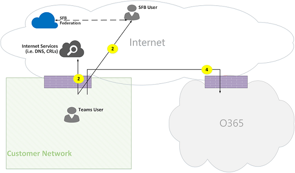

# Carrousel Microsoft Teams

> [!TIP]
> Regardez la session suivante pour découvrir comment les équipes tirent parti de votre réseau et comment planifier une connectivité réseau optimale : [planification du réseau teams](https://aka.ms/teams-networking)

## Vue d’ensemble

Cet article décrit comment teams utilise les flux d’appels d’Office 365 dans différentes topologies. Par ailleurs, il décrit les flux d’équipes uniques qui sont utilisés pour la communication de médias P2P. Ce document décrit ces flux, leur objet, leur origine et leurs arrêts sur le réseau. Dans le cadre de cet article, procédez comme suit :

- Flow X est utilisé par le client Office 365 local pour communiquer avec le service 365 Office dans le Cloud. Il provient du réseau du client et il se termine par un point de terminaison dans Office 365.

- Le flux Y est utilisé par le client Office 365 local pour communiquer avec un service sur Internet sur lequel Office 365 a une dépendance. Ce service provient du réseau du client et il se termine par un point de terminaison sur Internet.

L’article contient les sections suivantes :

- En **arrière-plan** : fournit des informations d’arrière-plan, telles que des réseaux que le flux d’Office 365 permet de traverser, d’entrer du trafic, des recommandations en matière de connectivité du réseau du client aux points de terminaison du service Office 365, l’interopérabilité avec les composants tiers et des principes qui sont utilisés par les équipes pour sélectionner les flux multimédias.

- **Flux d’appels dans différentes topologies** : illustre l’utilisation des flux d’appels dans différentes topologies. Pour chaque topologie, la section énumère tous les flux pris en charge et illustre l’utilisation de ces flux par le biais de plusieurs cas d’utilisation. Pour chaque cas d’utilisation, elle décrit la séquence et la sélection de flux à l’aide d’un diagramme de flux.

- **Teams avec l’optimisation d’itinéraire rapide** -décrit le mode d’utilisation de ces flux lorsque l’itinéraire rapide est déployé à des fins d’optimisation, illustré par une topologie simple.

## Arrière-plan

### Segments réseau

**Réseau du client**: il s’agit du segment réseau que vous contrôlez et gérez. Il s’agit de toutes les connexions aux clients au sein des bureaux du personnel, qu’il s’agisse d’un réseau filaire ou sans fil, entre les bâtiments d’Office, les centres de donnes locaux et vos connexions aux fournisseurs d’accès à Internet, à l’itinéraire rapide ou à tout autre homologation privée.

En règle générale, un réseau de clients est doté de plusieurs périmètres réseau avec des pare-feu et/ou des serveurs proxy, qui appliquent les stratégies de sécurité de votre organisation, et qui autorisent uniquement le trafic réseau configuré et configuré. Dans la mesure où vous gérez ce réseau, vous disposez d’un contrôle direct sur les performances du réseau, et il est vivement recommandé d’effectuer les évaluations réseau pour valider les performances des sites de votre réseau et de votre réseau au réseau 365 Office.

**Internet**: il s’agit du segment réseau qui fait partie de votre réseau global qui sera utilisé par les utilisateurs qui se connectent à Office 365 depuis l’extérieur du réseau du client. Il est également utilisé par du trafic du réseau du client vers Office 365.

**Visité/réseau privé invité**: il s’agit du segment réseau hors du réseau de votre client, mais pas du public Internet, que vos utilisateurs et/ou leurs invités peuvent consulter. Par exemple, une connexion réseau privée privée ou un réseau privé d’entreprise, qui ne déploie pas de teams, où les utilisateurs et/ou leurs clients qui interagissent avec les services teams peuvent résider.

> [!NOTE]
> La connectivité à Office 365 s’applique également à ces réseaux.

**Office 365**: il s’agit du segment réseau qui prend en charge les services Office 365. Ce service est distribué partout dans le monde avec des bords proches du réseau du client, dans la plupart des pays. Les fonctions mentionnées dans ce document incluent le relais de transport, le serveur de conférence et le processeur multimédia.

**Itinéraire rapide (facultatif)**: il s’agit du segment réseau qui fait partie de votre réseau global et qui vous offrira une connexion privée et dédiée au réseau Office 365.

### Types de trafic

**Éléments multimédias en temps réel**: données encapsulées au sein d’un protocole RTP (Real-Time Transport Protocol) prenant en charge les charges audio et vidéo et le partage d’écran. En règle générale, le trafic multimédia est sensible à la latence, de telle sorte que vous souhaitez que ce trafic prenne le plus en chemin direct possible et qu’il utilise le protocole UDP et TCP en tant que protocole de couche de transport, qui est le meilleur transport pour le média en temps réel interactif du point de vue de la qualité . (Remarque : en dernier recours, le média peut utiliser TCP/IP et être mis en tunnel dans le protocole HTTP, mais il n’est pas recommandé en raison d’implications de qualité incorrectes.) Le flux RTP est sécurisé via SRTP, dans lequel seule la charge utile est chiffrée.

**Signalisation**: lien communication entre le client et le serveur ou d’autres clients qui sont utilisés pour contrôler les activités (par exemple, lorsqu’un appel est lancé) et livrer des messages instantanés. La plupart du trafic de signalisation utilise les interfaces REST basées sur HTTPs, mais dans certains scénarios (par exemple, connexion entre Office 365 et contrôleur de bordure de session), elle utilise le protocole SIP. Il est important de comprendre que ce trafic est beaucoup plus sensible à la latence, mais qu’il peut entraîner des délais d’expiration de service ou des délais d’expiration de l’appel si la latence entre les points de terminaison est supérieure à plusieurs secondes.

### Connectivité à Office 365

Teams nécessite une [connexion à Internet](https://docs.microsoft.com/office365/enterprise/assessing-network-connectivity). Les URL et plages d’adresses IP du point de terminaison équipes sont répertoriées dans les [URL et plages d’adresses IP Office 365](https://docs.microsoft.com/office365/enterprise/urls-and-ip-address-ranges). (Remarque : ouvrir la connectivité aux ports TCP 80 et 443 et aux ports UDP 3478 à 3481 est requis.) Par ailleurs, teams est lié à Skype entreprise Online et doit également être connecté à Internet.

La connectivité des flux multimédias teams est implémentée par le biais de procédures de norme IETF (Internet Connectivity Establishing).

### Restrictions d’interopérabilité

**Relais multimédias tiers**: une équipe flux multimédia (autrement dit, l’un des points de terminaison de média est Teams) peut uniquement traverser des équipes ou des relais multimédias natifs Skype entreprise. L’interopérabilité avec un relais multimédia tiers n’est pas pris en charge. (Remarque : un autre fournisseur de SBC sur la limite du réseau PSTN doit mettre fin au flux RTP/RTCP, sécurisé via SRTP et ne pas le transmettre au tronçon suivant.)

**Serveurs proxy SIP tiers**: une boîte de dialogue d’équipes de signalisation SIP avec un SBC et/ou une passerelle tierce est susceptible de traverser des équipes ou des PROXYs SIP en natif Skype entreprise. L’interopérabilité avec un proxy SIP tiers n’est pas prise en charge.

**B2BUA tiers (c’est-à-dire, SBC)**: le flux multimédia d’équipes du RTC est arrêté par un SBC tiers. Toutefois, l’interopérabilité avec un SBC tiers au sein du réseau de Teams (c’est-à-dire une tierce partie de la fonction d’interconnexion de deux équipes/points de terminaison Skype entreprise) n’est pas prise en charge.

### Technologies non recommandées par Microsoft teams

**Réseau VPN**: elle n’est pas recommandée pour le trafic multimédia (c’est-à-dire le flux 2 '). Le client VPN doit utiliser une connexion VPN fractionnée et router le trafic multimédia comme n’importe quel utilisateur externe non VPN, comme indiqué dans [la rubrique activation de médias Lync pour ignorer un tunnel VPN](https://techcommunity.microsoft.com/t5/Skype-for-Business-Blog/Enabling-Lync-Media-to-Bypass-a-VPN-Tunnel/ba-p/620210).

> [!NOTE]
> Même si le titre est Lync, il s’applique également aux équipes.

**Formes de paquets**: tout type de paquets Snippers, d’inspection de paquets ou de périphériques de forme de paquets est déconseillé et risque de dégrader la qualité.

### Exposés

Il existe quatre principes généraux qui vous permettent de comprendre les flux d’appels pour Microsoft teams :

1. Une conférence Microsoft teams est hébergée par Office 365 dans la même région où le premier participant rejoint. (Remarque : s’il existe des exceptions à cette règle dans certaines topologies, celles-ci sont décrites dans ce document et illustrées par un flux d’appels approprié.)

1. Un point de terminaison de média teams dans Office 365 est utilisé en fonction du traitement multimédia requis et non en fonction du type d’appel. Par exemple, un appel point à point est susceptible d’utiliser un point de terminaison multimédia dans le Cloud pour traiter du contenu multimédia pour la transcription et/ou l’enregistrement, tandis qu’une conférence avec deux participants n’utilise pas de point de terminaison multimédia dans le Cloud.) Toutefois, la plupart des conférences utilisent un point de terminaison de média à des fins de mixage et de routage, qui est alloué au lieu d’hébergement de la Conférence. Le trafic multimédia envoyé d’un client à un point de terminaison de média est acheminé directement ou utiliser un relais de transport dans Office 365 si cela est requis en raison de restrictions de pare-feu du réseau du client.

1. Le trafic multimédia pour les appels d’égal à égal utilise l’itinéraire le plus direct disponible, en supposant que l’appel n’impose pas de point de terminaison multimédia dans le Cloud (voir #2 ci-dessus). L’itinéraire par défaut est diriger vers l’homologue distant (client), mais si ce routage n’est pas disponible, un ou plusieurs relais de transport relayeront le trafic. Il est recommandé que le trafic multimédia ne soit pas transforme des serveurs tels que les formes de paquets, les serveurs VPN, etc., car cela aura un impact sur la qualité du média.

1. Le trafic de signalisation passe toujours au serveur le plus proche de l’utilisateur.

Pour en savoir plus sur les détails sur le chemin multimédia choisi, voir [Présentation des flux multimédias dans Microsoft teams-BRK4016](https://www.youtube.com/watch?v=1tmHMIlAQdo).

## Flux d’appels dans différentes topologies

### Topologie teams

Cette topologie est utilisée par les clients qui tirent parti des services d’équipe du Cloud sans déploiement local, tels que Skype entreprise Server ou le routage direct du système téléphonique. Par ailleurs, l’interface à Office 365 est réalisée via Internet sans Azure Express route.

*Figure 1 : topologie teams*

Notez que :

- Le sens des flèches sur le diagramme ci-dessus correspond au sens de début de la communication qui affecte la connectivité aux périmètres d’entreprise. Dans le cas d’UDP pour le média, le (s) premier (s) fichier (s) peut s’afficher dans le sens inverse, mais ces paquets peuvent être bloqués jusqu’à ce que les paquets dans l’autre direction soient acheminés.
- Les équipes sont déployées côte à côte avec Skype entreprise Online, de sorte que les clients apparaissent comme un « teams/marketing User ».

Vous trouverez plus d’informations sur les topologies facultatives suivantes, plus loin dans cet article :

- Le déploiement local de Skype entreprise est décrit dans **topologie hybride teams**.
- Le routage direct du système téléphonique (pour la connectivité PSTN) est décrit dans **teams avec une topologie de routage direct**.
- L’itinéraire rapide est décrit dans **teams avec l’optimisation de l’itinéraire rapide**.

**Descriptions de flux**:

- **Flux 2** : représente un flux initié par un utilisateur sur le réseau du client sur Internet dans le cadre de l’utilisation des équipes de l’utilisateur. Le DNS et le média d’égal à égal sont des exemples de ces flux.
- **Flux 2 '** – représente un flux déclenché par un utilisateur d’équipes mobiles distantes, avec VPN pour le réseau du client.
- **Flux 3** – représente un flux initié par un utilisateur d’équipes mobiles distant aux points de terminaison Office 365/Teams.
- **Flux 4** – représente un flux initié par un utilisateur sur le réseau du client aux points de terminaison Office 365/Teams.
- **Flux 5** : représente un flux multimédia d’égal à égal entre une équipe et un utilisateur de teams ou Skype entreprise au sein du réseau du client.
- **Flux 6** : représente un flux multimédia P2P entre un utilisateur de l’équipe mobile distant et une autre équipe mobile distante ou un utilisateur Skype entreprise sur Internet.

#### Cas d’utilisation : un-à-un

Les appels un-à-un utilisent un modèle courant dans lequel l’appelant obtiendra un ensemble de candidatures composées d’adresses IP et de ports (par exemple, local, Relay et réflexive (adresse IP publique du client). L’appelant envoie ces candidats à la partie appelée ; le tiers appelé obtient également un ensemble de candidats similaire et les envoie à l’appelant. STUNx, xxx xxx xxxx xxxx xxxx xxxx xxxx xxxx xxxx xxxx xxxx xxxx xxxx xxxx xxxx xxxx xxxx xxxx xxxx xxxx xxxx xxxx xxxx xxxx xxxx xxxx xxxx xxxx xxxx xxxx. Les éléments multimédias (c’est-à-dire les paquets RTP/RTCP sécurisés via SRTP) sont ensuite envoyés avec la paire de candidats sélectionnée. Le relais de transport est déployé dans le cadre d’Office 365.

Si l’adresse IP locale/le port candidats ou les candidats réflexives ont une connectivité, le chemin d’accès direct entre les clients (ou par le biais d’un NAT) est sélectionné pour le média. Si les clients sont sur le réseau du client, le chemin d’accès direct doit être sélectionné. Cela nécessite une connectivité UDP directe au sein du réseau du client. Si les clients sont les utilisateurs du Cloud Nomadic, puis, en fonction du NAT/pare-feu, le contenu multimédia pourra utiliser une connectivité directe.

Si un client est interne sur le réseau du client et si un client est externe (par exemple, un utilisateur du Cloud mobile), il est peu probable que la connectivité directe entre les candidats local ou réflexive fonctionne. Dans ce cas, il est possible d’utiliser l’un des candidats de relais de transport à partir de l’un des clients (par exemple, le client interne a obtenu un candidat de relais à partir du relais de transport dans Office 365 ; le client externe doit être en mesure d’envoyer des paquets STUN/RTP/RTCP au relais de transport). Une autre option consiste à ce que le client interne envoie à la candidature de relais obtenu par le client Cloud mobile. Notez que, même si la connectivité UDP pour le média est fortement recommandée, TCP est pris en charge.

**Étapes de niveau supérieur**:

1. L’utilisateur de teams A résout le nom de domaine d’URL (DNS) via flow2
1. L’utilisateur de teams A alloue un port de relais multimédia sur Team Relay Relay via le flux 4
1. L’utilisateur teams A envoie une invitation à une glace via le flux 4 à Office 365
1. Office 365 envoie une notification à l’utilisateur de teams B via le flux 4
1. L’utilisateur de teams B alloue un port de relais multimédia sur le relais de transport teams via le flux 4
1. L’utilisateur de teams B envoie « Answer » avec des candidats de glace par le biais du flux 4, qui est renvoyé à l’utilisateur de teams A via Flow 4
1. Les utilisateurs teams A et équipe B appellent des tests de connectivité ICE et le meilleur chemin multimédia disponible est sélectionné (voir les diagrammes ci-dessous pour de nombreux cas d’utilisation)
1. Les utilisateurs de teams envoient la télémétrie à Office 365 via Flow 4

**Au sein du réseau du client :**

*Figure 2 : au sein du réseau du client*

À l’étape 7, le flux de média d’égal à égal (5) est sélectionné.

Le média est bidirectionnel. Le sens du flux 5 indique qu’un côté initialise la communication du point de vue de la connectivité, conformément à tous les flux figurant dans ce document. Dans le cas présent, il n’y a pas d’importance quant à la direction utilisée, car les deux points de terminaison sont au sein du réseau du client.

**Connexion du réseau du client aux utilisateurs externes (médias relayés par teams Relay Relay) :**

*Figure 3 : réseau des clients pour les utilisateurs externes (média relayée par Team Relay Relay)*

À l’étape 7, flux 4, du réseau du client vers Office 365 et flux 3, à partir de l’application mobile teams vers Office 365, sont sélectionnées. Ces flux sont relayés par teams transport Relay dans Office 365.

Le média est bidirectionnel, la direction indiquant le côté qui initialise la communication du point de vue de la connectivité. Dans ce cas, ces flux sont utilisés pour le signalement et le contenu multimédia, par le biais de protocoles de transport et d’adresses différents.

**Connexion du réseau du client aux utilisateurs externes (médias directs) :**

*Figure 4 : réseau du client pour les utilisateurs externes (médias directs)*

À l’étape 7, flux 2, du réseau du client vers Internet (homologue du client), est sélectionné.

- Les éléments multimédias directs avec les utilisateurs mobiles distants (qui ne sont pas relayés via Office 365) sont facultatifs. En d’autres termes, le client doit bloquer ce chemin pour appliquer un chemin multimédia par le biais du relais de transport dans Office 365.

- Le média est bidirectionnel. Le sens du flux 2 vers l’utilisateur mobile distant indique qu’un côté initialise la communication du point de vue de la connectivité.

**Utilisateur VPN pour un utilisateur interne (médias relayés par Team Relay Relay)**

*Figure 5 : utilisateur VPN pour un utilisateur interne (média relayée par Team Relay Relay)*

Le signalement entre le VPN et le réseau du client est acheminé via le flux 2. La signalisation entre le réseau du client et le 365 Office est par le biais du flux 4. Toutefois, le contenu multimédia passe outre le VPN et est acheminé via les flux 3 et 4 via teams Relay dans Office 365.

**Utilisateur VPN pour un utilisateur interne (médias directs)**

*Figure 6-utilisateur VPN pour un utilisateur interne (médias directs)*

Le signalement entre le VPN et le réseau du client est acheminé via le flux 2. La signalisation entre le réseau du client et le 365 Office est par le biais du flux 4. Toutefois, le contenu multimédia passe outre le VPN et est acheminé via le flux 2 du réseau du client vers Internet.

Le média est bidirectionnel. Le sens du flux 2 vers l’utilisateur mobile distant indique qu’un côté initialise la communication du point de vue de la connectivité.

**Utilisateur VPN pour un utilisateur externe (médias directs)**

*Figure 7 : utilisateur VPN pour un utilisateur externe (médias directs)*

La signalisation entre l’utilisateur VPN sur le réseau du client consiste à flux 2 'et à passer par le flux 4 à Office 365. Toutefois, le média passe par un réseau privé virtuel et est routé via le flux 6.

Le média est bidirectionnel. Le sens du flux 6 vers l’utilisateur mobile distant indique qu’un côté initialise la communication du point de vue de la connectivité.

#### Cas d’utilisation : teams RTC par le biais d’Office 365 Trunk

Le système téléphonique d’Office 365 permet de passer et de recevoir des appels à partir du réseau téléphonique public commuté (RTC). Si le Trunking RTC est connecté par le biais de l’offre téléphonique du système téléphonique, il n’existe aucune exigence de connectivité spéciale pour ce cas d’utilisation. (Si vous voulez connecter votre propre Trunk PSTN local à Office 365, vous pouvez utiliser le routage direct du système téléphonique.)

*Figure 8 : équipe RTC via le Trunking d’Office 365*

#### Cas d’utilisation : réunion teams

Le serveur de conférence audio/vidéo/de partage d’écran (VBSS) fait partie d’Office 365. Il possède une adresse IP publique qui doit être accessible à partir du réseau du client et être accessible à partir d’un client Cloud Nomadic. Chaque client/point de terminaison doit être en mesure de se connecter au serveur de conférence.

Les clients internes obtiennent des candidats locaux, réflexurs et Relay de la même manière que pour les appels One-to-One. Les clients envoient ces candidats au serveur de conférence dans une invitation. Le serveur de conférence n’utilise pas de relais car il dispose d’une adresse IP publique et publique, de sorte qu’il répond avec son candidat d’adresse IP local. Le client et le serveur de conférence vérifient la connectivité de la même manière que pour les appels One-to-One.

Notez que :

- Les clients Teams ne peuvent pas participer à des réunions Skype entreprise et les clients Skype entreprise ne peuvent pas participer à des réunions d’équipes.

- Un utilisateur PSTN peut éventuellement « compose » ou « Dial », en fonction de l’organisateur de la réunion et/ou de la mise en service de la Conférence.

- Un utilisateur invité ou un compte d’utilisateur peut rejoindre un réseau privé invité, lequel est protégé par le biais du panneau de gestion des messages et de tar avec des règles strictes.

*Figure 9 : réunion teams*

#### Cas d’utilisation : Fédération avec Skype entreprise sur site

**Media relayés par teams transport Relay dans Office 365**

*Figure 10 : contenu multimédia relayée par teams transport Relay dans Office 365*

Notez que :

- La Fédération est, par définition, une communication entre deux clients. Dans ce cas, le locataire A, qui utilise Teams, est fédérer avec le locataire B, qui utilise Skype entreprise sur site. Si le client B utilise également Office 365, le client Skype entreprise aurait utilisé le flux 3 pour me connecter à Office 365.

- Le signalement et le contenu multimédia du client fédéré Skype entreprise à Skype entreprise Server sur site n’est pas le cadre de ce document. Toutefois, il est illustré ici pour plus de clarté.

- La signalisation entre teams et Skype entreprise est bridgeée par une passerelle dans Office 365.

- Dans le cas présent, les éléments multimédias sont relayés par teams transport Relay dans Office 365 vers le réseau du client et le client Skype entreprise distant via le flux 4.

**Média relayée par Skype entreprise Media Relay dans le client fédéré**

*Figure 11-média relayée par Skype entreprise Media Relay dans le client fédéré*

Notez que :

- Le signalement et le contenu multimédia du client fédéré Skype entreprise à un serveur Skype entreprise local ne figurent pas dans ce document. Toutefois, il est illustré ici pour plus de clarté.

- La signalisation entre teams et Skype entreprise est bridgeée par une passerelle dans Office 365.

- Dans le cas présent, les éléments multimédias sont relayés par Skype entreprise sur site sur le réseau du client via le flux 2. (Notez que le trafic de l’utilisateur teams vers le relais de média distant dans le réseau de clients fédérés sera bloqué initialement par le relais multimédia jusqu’à ce que le trafic de la direction inverse commence à circuler. Toutefois, le flux bidirectionnel s’ouvre dans les deux sens.)

**Direct (pair à pair)**

*Figure 12-directe (pair à pair)*

### Topologie hybride teams

Cette topologie inclut les équipes ayant un déploiement local de Skype entreprise.

*Figure 13 : topologie hybride teams*

- Le sens des flèches sur le diagramme ci-dessus correspond au sens de début de la communication qui affecte la connectivité aux périmètres d’entreprise. Dans le cas d’UDP pour le média, le (s) premier (s) fichier (s) peut s’afficher dans le sens inverse, mais ces paquets peuvent être bloqués jusqu’à ce que les paquets dans l’autre direction soient acheminés.

- Les équipes sont déployées côte à côte avec Skype entreprise Online, de sorte que les clients apparaissent comme un « teams/marketing User ».

Flux supplémentaires (en haut de la topologie Teams) :

- **Flux 5A** : représente un flux multimédia P2P entre un utilisateur de teams au sein du réseau du client et un relais multimédia local Skype entreprise sur le réseau du client.

#### Cas d’utilisation : équipes dans Skype entreprise One-en-One

**Hybride au sein du réseau du client**

*Figure 14-hybride au sein du réseau du client*

La signalisation entre teams et Skype entreprise est bridgeée par une passerelle dans Office 365. Toutefois, le contenu multimédia est routé directement d’égal à égal au sein du réseau du client via le flux 5.

**Réseau client hybride avec des utilisateurs Skype entreprise externes : relayée par Office 365**

*Figure 15-réseau de clients hybride avec des utilisateurs Skype entreprise externes relayés par Office 365*

Notez que :

- Le signalement et le contenu multimédia du client Skype entreprise à un serveur Skype entreprise local ne figurent pas dans le cadre de ce document. Toutefois, il est illustré ici pour plus de clarté.

- La signalisation entre teams et Skype entreprise est bridgeée par une passerelle dans Office 365.

- Le média est relayée via le relais de transport teams dans Office 365 vers le réseau du client via le flux 4.

**Réseau client hybride avec des utilisateurs Skype entreprise externes : relayés par le bord local**

*Figure 16-réseau de clients hybride avec des utilisateurs Skype entreprise externes relayés par le biais d’un réseau local*

Notez que :

- Le signalement et le contenu multimédia du client Skype entreprise à un serveur Skype entreprise local ne figurent pas dans le cadre de ce document. Toutefois, il est illustré ici pour plus de clarté.

- La signalisation est bridgeée par une passerelle dans Office 365.

- Le contenu multimédia est relayée par Skype entreprise Media Relay dans Skype entreprise local vers l’utilisateur teams au sein du réseau du client via le flux multimédia 5A.

### Équipe avec le système téléphonique-topologie de routage directe

Cette topologie inclut les équipes avec le routage direct du système téléphonique.

Le routage direct vous permet d’utiliser un fournisseur de services RTC (réseau téléphonique commuté) tiers pris en charge par le jumelage d’un 365 appareil matériel de contrôleur de bordure de session (SBC) sur site, puis de connecter le Trunk de téléphonie à Cet appareil.

Pour prendre en charge ce scénario, le client doit déployer un SBC certifié pour le routage direct auprès de l’un des partenaires certifiés de Microsoft. Le SBC doit être configuré conformément aux recommandations du fournisseur et être routable à partir d’Office 365 pour le trafic UDP direct. Le contenu multimédia risque d’être acheminé directement à partir d’équipes et/ou du client Skype entreprise vers l’SBC (contournement de la passerelle Teams) ou de traverser la passerelle Teams. La connectivité avec le SBC, lorsque le Trunk est configuré pour ignorer la passerelle Teams, est basée sur la glace, où SBC prend en charge ICE-Lite, tandis que le point de terminaison teams/Skype entreprise prend en charge la gestion des contenus multimédias.

* Figure 17-équipes avec topologie de routage directe du système téléphonique

Notez que :

- Le sens des flèches sur le diagramme ci-dessus correspond au sens de début de la communication qui affecte la connectivité aux périmètres d’entreprise. Dans le cas d’UDP pour le média, le (s) premier (s) fichier (s) peut s’afficher dans le sens inverse, mais ces paquets peuvent être bloqués jusqu’à ce que les paquets dans l’autre direction soient acheminés.

- Les équipes sont déployées côte à côte avec Skype entreprise Online, de sorte que les clients apparaissent comme un « teams/marketing User ».

Flux supplémentaires (en haut de la topologie teams Online) :

- **Flux 4 '** -représente un flux d’Office 365 vers le réseau du client, utilisé pour établir une connexion entre le serveur de média teams dans le Cloud et les SBC en local.
- **Flux 5B** : représente un flux multimédia entre l’utilisateur teams au sein du réseau du client et l’SBC du routage direct en mode Bypass.
- **Flux 5C** – représente un flux multimédia entre l’SBC du routage direct vers un autre SBC de routage direct dans un mode de contournement d’appel cheveux PSTN.

**Utilisateur interne avec routage direct (média relayée par teams transport Relay dans Office 365)**

*Figure 18-utilisateur interne avec routage direct (médias relayés par Team Relay dans Office 365)*

Notez que :

- L’SBC doit avoir une adresse IP publique qui est routable à partir d’Office 365.

- Le signalement et le contenu multimédia de l’SBC à Office 365 et inversement utilisent le flux 4 et/ou le flux 4.

- Le signalement et le contenu multimédia du client au sein du réseau du client vers Office 365 utilisent le flux 4.

**Utilisateur distant avec routage direct (le média est routé par le biais d’un serveur multimédia dans Office 365)**

*Figure 19-utilisateur distant avec routage direct (le média est routé par le biais d’un serveur multimédia dans Office 365)*

Notez que :

- L’SBC doit avoir une adresse IP publique qui est routable à partir d’Office 365.

- Le signalement et le contenu multimédia de l’SBC à Office 365 et inversement utilisent le flux 4 et/ou le flux 4.

- Le signalement et le contenu multimédia du client sur Internet à Office 365 utilisent le flux 3.

**Routage direct de l’utilisateur interne (contournement du support multimédia)**

*Figure 20-routage direct de l’utilisateur interne (contournement du support multimédia)*

Notez que :

- L’SBC doit avoir une adresse IP publique qui est routable à partir d’Office 365.

- Le signalement de SBC à Office 365 et vice versa utilisent le flux 4 et/ou le flux 4.

- La signalisation du client au sein du réseau du client vers Office 365 utilise le flux 4.

- Le média du client sur le réseau du client vers SBC au sein du réseau du client utilise le flux 5B.

**Utilisateur distant avec routage direct (contournement de média relayée par Team Relay Relay dans Office 365)**

*Figure 21-utilisateur distant avec routage direct (contournement de média relayée par Team Relay Relay dans Office 365)*

Notez que :

- L’SBC doit avoir une adresse IP publique qui est routable à partir d’Office 365 et Internet.

- Le signalement de l’SBC à Office 365 et inversement utilise le flux 4 et/ou le flux 4.

- Le signalement du client sur Internet à Office 365 utilise le flux 3.

- Le contenu multimédia du client sur Internet à l’SBC au sein du réseau du client utilise les flux 3 et 4, relayés par teams transport Relay dans Office 365.

**Routage direct de l’utilisateur distant (Bypass du support direct)**

*Figure 22-routage direct de l’utilisateur distant (relais de média direct)*

Notez que :

- L’SBC doit avoir une adresse IP publique qui est routable depuis Office 365 et Internet.

- Le signalement de l’SBC à Office 365 et inversement utilise le flux 4 et/ou le flux 4.

- Le signalement du client sur Internet à Office 365 utilise le flux 3.

- Le contenu multimédia du client sur Internet à l’SBC au sein du réseau du client utilise le flux 2.

**Routage direct (contournement du support multimédia) – appel cheveux RTC (en raison du transfert d’appel ou du transfert d’appel)**

*Figure 23-routage direct (contournement de média)-appel cheveux RTC (en raison d’un renvoi d’appel/transfert)*

Notez que :

- L’SBC doit avoir une adresse IP publique qui est routable à partir d’Office 365.

- Le signalement de l’SBC à Office 365 et inversement utilise le flux 4 et/ou le flux 4.

- Le client n’est pas dans la boucle de signalisation et de média une fois que l’appel est hairpinned de RTC à PSTN.

- Les éléments multimédias de l’instance SBC A au sein du réseau du client à l’instance SBC B au sein du réseau du client (où, A et B peuvent être de la même instance) utilise le flux 5C.

**Routage direct (média via Office 365) – appel RTC cheveux sur deux clients**

*Figure 24-routage direct (média via Office 365)-appel cheveux RTC sur deux clients*

Notez que :

- L’SBC doit avoir une adresse IP publique qui est routable à partir d’Office 365.

- Le signalement de l’SBC à Office 365 et inversement utilise le flux 4 et/ou le flux 4.

- Le client n’est pas dans la boucle de signalisation et de média une fois que l’appel est hairpinned de RTC à PSTN.

- Les éléments multimédias de l’instance SBC A au sein de l’instance du réseau du client X à l’instance SBC B doivent être relayés via le serveur multimédia Office 365 et ne peuvent pas utiliser le mode de contournement.

## Équipes avec l’optimisation de l’itinéraire rapide

*Figure 25 : équipe avec l’optimisation de l’itinéraire rapide*

Dans le cas où l’itinéraire rapide est justifié et déployé, les flux d’équipes peuvent être redirigés du flux 4 au flux 1 et du flux 4 'vers le flux 1 '. Toutefois, l’application teams a une dépendance matérielle à l’aide d’autres flux d’Office 365 sur Internet par le biais des flux 4 et 4. ces flux ne doivent donc pas être bloqués.

Notez que le trafic Edge hybride Skype entreprise est routé vers Internet et ne peut pas être utilisé pour communiquer avec des utilisateurs externes et fédérer avec d’autres clients.

Pour éviter les flux asymétriques, le rétablissement du routage doit être dans les deux directions. En d’autres termes, une adresse au sein du réseau du client est routable à partir d’Internet ou d’un itinéraire rapide, en fonction de l’optimisation, mais pas par les deux.

Par exemple :

**Connexion du réseau du client aux utilisateurs externes (médias relayés par teams Relay Relay) :**

*Figure 26-réseau client pour les utilisateurs externes (média relayée par Team Relay Relay)*

**Étapes de niveau supérieur :**

1. L’utilisateur de teams au sein du réseau du client résout le nom de domaine d’URL (DNS) via flow2
1. L’utilisateur de teams au sein du réseau du client alloue un port de relais multimédia sur le relais de transport teams via le flux 1
1. L’utilisateur de teams au sein du réseau du client envoie une invitation à une glace via le flux 1 au bureau 365
1. Office 365 envoie une notification à l’utilisateur d’équipes externes par le biais du flux 3
1. L’utilisateur externe teams alloue un port de relais multimédia sur teams Relay Relay via le flux 3
1. Les utilisateurs externes d’équipes envoient une réponse avec des candidats de glace via le flux 3, qui est renvoyé à l’utilisateur de teams par flux 1
1. Les utilisateurs teams A et équipe B appellent des tests de connectivité ICE et sélectionne les flux 1 et 3 qui sont relayés par teams Relay Relay dans Office 365
1. Les utilisateurs teams envoient la télémétrie à Office 365 via les flux 1 et 3

> [!NOTE]
> Le flux 4 doit être activé pour prendre en charge les dépendances de l’application teams sur d’autres micro-services qui autorisent le flux 4.
