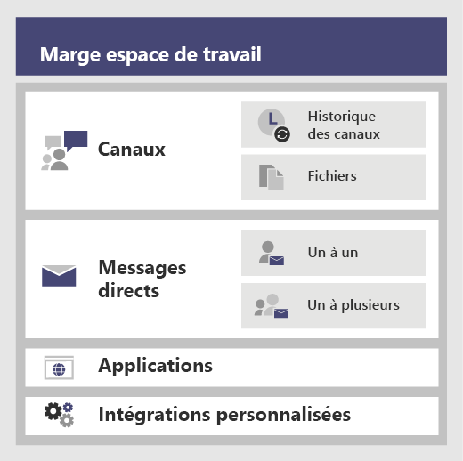
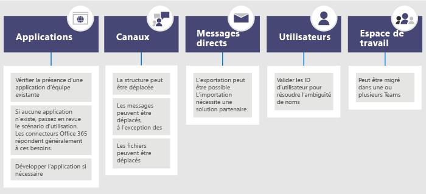

# <a name="migrate-from-slack-to-microsoft-teams"></a>Migrer de Slack vers Microsoft Teams

Cet article vous guide dans la transition vers Microsoft Teams à partir de Slack.

Lorsque vous planifiez la migration de votre organisation de Slack vers Teams, il est important de déterminer ce que vous devez conserver (le cas échéant). Nous allons commencer par décrire les types de données pouvant être migrés, puis vous guider dans la façon d’évaluer vos besoins, planifier la migration et effectuer ensuite la migration.

Le diagramme ci-dessous montre l’architecture de Slack à un haut niveau.



## <a name="plan-your-migration-from-slack"></a>Planifiez votre migration de Slack
### <a name="what-you-can-and-cant-migrate"></a>Ce qui peut et ne peut être migré
Votre plan de services Slack détermine ce que vous pouvez et ne pouvez pas migrer. Par exemple, certains plans de services de Slack vous permettent uniquement d’exporter des fichiers et historiques de canaux publics, d’autres nécessitent une demande DocuSign pour inclure les canaux privés et les messages directs. 

Pour déterminer le niveau de service de votre espace de travail de Slack, connectez-vous à Slack et notez le type de votre plan sur la page **À propos de cet espace de travail**.

Pour en savoir plus sur les options d’exportation de Slack, accédez au site Web Slack : https://get.slack.help/hc/articles/204897248-Guide-to-Slack-import-and-export-tools 

Le diagramme ci-dessous donne une vue d’ensemble du paysage de la migration de Slack que nous allons aborder dans cet article. 



Après avoir lu cette section, vous devriez être en mesure de comprendre les concepts suivants :
- Niveau de service de vos espaces de travail Slack
- Ce qui peut et ne peut être exporté
- Approches courantes d’exportation

### <a name="assess-your-slack-workspaces"></a>Évaluer vos espaces de travail Slack
Avant de planifier le plan de migration de votre organisation, vous devez rassembler des informations sur les espaces de travail Slack. La compréhension de l’utilisation de vos espaces de travail Slack vous permet de déterminer l’étendue de votre migration. Par exemple, combien d’espaces de travail sont migrés ? Sont-ils utilisés par un service spécifique, plusieurs ou utilisés par une organisation entière ?

Si vous’ êtes membre des espaces de travail Slack que vous souhaitez migrer, vous pouvez analyser l’utilisation vous-même en accédant à *\<your Slack workspace\>.slack.com/stats*. Passez en revue les onglets Canaux et Membres pour rechercher des modèles d’utilisation. Choisissez les espaces de travail que vous souhaitez migrer (et ceux que vous souhaitez ignorer). 

> [!NOTE]
> Si vous n’avez pas accès à la page statistiques, vous n’êtes pas un administrateur ou un propriétaire. 

### <a name="export-channels"></a>Exporter des canaux

Dans Slack, les utilisateurs rejoignent un canal qui fait partie d’un espace de travail Slack, tandis que les utilisateurs de Teams rejoignent une équipe qui est une collection de canaux. Nous vous recommandons d’utiliser l’analyse de Slack pour déterminer la quantité d’activité qui se produit dans chaque canal afin de vous aider à décider des canaux à déplacer. Vous utiliserez la liste résultante pour déterminer comment regrouper vos canaux de Slack en équipes dans Teams, ainsi que les membres de chaque équipe.

Si vous avez une offre de service de Slack payante (autre que Free), vous pouvez utiliser la fonction d’analyse de Slack (\<your Slack workspace\>. slack.com/admin/stats#channels) pour voir l’état d’un canal, sa date de dernière utilisation et le nombre de personnes qui en sont membres. Cela peut vous aider à décider si vous voulez migrer le canal. Par défaut, le contenu des canaux publics (messages et fichiers) peut être exporté. Selon votre offre de service de Slack et si vous avez demandé des canaux privés et des messages directs de Slack, vous pouvez les exporter.

Pour en savoir plus sur les options d’exportation de Slack, accédez au site Web Slack : https://get.slack.help/hc/articles/204897248-Guide-to-Slack-import-and-export-tools 

> [!IMPORTANT]
> Vérifier les exigences de confidentialité et de conformité de votre organisation concernant les données de canal. Votre organisation peut respecter les exigences de conformité relatives à la manipulation, au stockage et au traitement de ces données, ainsi qu’au cycle de vie du contenu identifiable par l’utilisateur final (EUII).

### <a name="export-direct-messages"></a>Exporter des messages directs
Les messages directs sont identiques aux conversations dans Teams, qui sont 1:1 ou 1-à-plusieurs conversations non-canal. La fonctionnalité d’exportation dépend de votre offre de service Slack et si vous avez demandé que les messages directs soient inclus dans votre exportation de Slack. Teams ne prend pas en charge l’importation de messages directs pour le moment. Consultez un partenaire Microsoft pour en savoir plus sur les solutions tierces que vous pouvez explorer afin d’intégrer du contenu direct dans Teams.

Pour l’exportation de messages directs, voir les outils, tels que Exporter, dans le Store App Store.

### <a name="apps-and-custom-integrations"></a>Applications et intégrations personnalisées

Les applications dans Slack sont comme des applications dans Teams. Une fois que vous disposez d’une liste d’applications et de leurs configurations dans l’espace de travail, vous pouvez effectuer une recherche dans l’App Store Teams pour voir si elles sont disponibles pour Teams *. 

Accédez à \<your Slack workspace\>. slack.com/apps/manage pour obtenir la liste des applications et les intégrations personnalisées. Cette page indique également le nombre de configurations où chaque application est en cours d’utilisation. L’intégration personnalisée peut varier en fonction de la « capacité de migration ». S’il s’agit d’un hook Web, vous pouvez généralement l’envoyer à un connecteur Microsoft 365 ou Office 365 pour déplacer le flux de travail dans Teams. Évaluez les robots et les autres applications au cas par cas pour planifier leur migration vers Teams.

\* Si votre administrateur a utilisé des applications restreintes, il est possible que vous ne puissiez pas voir la liste complète des applications disponibles.

### <a name="users"></a>Utilisateurs
Il se peut que les schémas d’identité que vous avez utilisés dans Slack ne s’intègrent pas directement à Microsoft 365 ou Office 365. Par exemple, il est possible que les adresses de messagerie de Slack ne correspondent pas aux comptes Microsoft 365 ou Office 365 professionnels ou scolaires. Vous devez créer un mappage ID utilisateur avant de commencer à planifier le déploiement de Teams.

Si vous utilisez une offre de service Slack payante, vous pouvez accéder à *\<your Slack workspace\>. slack.com/admin/stats#members* pour obtenir des informations sur les membres, telles que l’adresse de messagerie et le type de compte pour chaque utilisateur (par exemple, un invité à un ou plusieurs canaux).

Voici un script que vous pouvez utiliser pour comparer les adresses de courrier d’une exportation Slack par rapport à Azure AD afin de résoudre l’ambiguïté de noms. Il signale également si l’utilisateur est activé pour Teams. Si vous avez besoin d’aide sur PowerShell, consultez [Prise en main d’Azure PowerShell](/powershell/azure/get-started-azureps).

```azurepowershell
Connect-AzureAD
Function Get-TimeStamp {
    return "[{0:MM/dd/yy} {0:HH:mm:ss}]" -f (Get-Date)
}

class User {
    [ValidateNotNullOrEmpty()] $ID
    [ValidateNotNullOrEmpty()] $FullName
    [string] $Email
    [string] $UPN
    [ValidateNotNullOrEmpty()][bool] $ExistsAzureAD
    [ValidateNotNullOrEmpty()][bool] $TeamsEnabled
}

$output = New-Object -type System.Collections.ObjectModel.Collection["User"]

$users = Get-Content -Raw -Path .\slackHistory\users.json | ConvertFrom-Json

Write-Host -ForegroundColor Green "$(Get-Timestamp) User Count: " $users.Count

$i=1
Write-Host "$(Get-Timestamp) Attempting direct email match.. `n"
foreach ($slackUser in $users) {
    $user = New-Object User
    $user.id = $slackUser.id
    $user.FullName = $slackUser.name
    try {
        if ($null -ne $slackUser.profile.email) {
            $user.email = $slackUser.profile.email
            $emailSplit = $slackUser.profile.email.Split('@')
            $mailNickName = $emailSplit[0]
            $result = Get-AzureADUser -Filter "MailNickName eq '$($mailNickName)' or UserPrincipalName eq '$($slackUser.profile.email)' or proxyAddresses/any(c:c eq 'smtp:$($slackUser.profile.email)')"
            if ($null -ne $result) {
                $user.ExistsAzureAD = $true
                $user.UPN = $result.UserPrincipalName
                $assignedPlans = $result.assignedPlans
                foreach ($plan in $assignedPlans) {
                    if ($plan.ServicePlanId -eq "57ff2da0-773e-42df-b2af-ffb7a2317929") {
                        if ($plan.CapabilityStatus -eq "Enabled") {
                            $user.TeamsEnabled = $true
                        }
                        else {
                            $user.TeamsEnabled = $false
                        }
                    }
                }
                Write-Host -ForegroundColor Green "$(Get-Timestamp) Current User $($i) - AzureAD object found:" $result.MailNickName
                Write-Host -ForegroundColor Green "$(Get-Timestamp) Current User $($i) - Teams Enabled:" $user.TeamsEnabled
            }
            else {
                $user.ExistsAzureAD = $false
                Write-Host -ForegroundColor Yellow "$(Get-Timestamp) Current User $($i) - AzureAD object not found: " $slackUser.profile.email
            }
        }
        $i++
    }   
    catch
    {
        $user.ExistsAzureAD = $false
        Write-Host -ForegroundColor Yellow "$(Get-Timestamp) Current User $($i) - AzureAD object not found: $($i)" $user.profile.email
        $i++
    }
    $output.Add($user)
}

$output | Export-Csv -Path .\SlackToAzureADIdentityMapping.csv -NoTypeInformation
Write-Host "`n $(Get-Timestamp) Generated SlackToAzureADIdentityMapping.csv. Exiting..."
```

Après avoir lu cette section, vous devriez disposer de :
- Liste de canaux par espace de travail incluant les statistiques d’utilisation.
- Liste des applications Slack avec des configurations par canal.
- Déterminez le type d’historique de message Slack que vous voulez exporter (le cas échéant).
- Liste d’utilisateurs dont les comptes Slack sont mappés avec les comptes professionnels ou scolaires de Microsoft ainsi que la licence Teams qui leur est associée.

## <a name="plan-your-teams-deployment"></a>Planifier le déploiement de Teams
Vous avez exporté les éléments dont vous avez besoin de Slack (et laissés les éléments dont vous n’avez pas besoin). À présent, il est temps de planifier le déploiement de Teams et l’importation de vos données Slack. Il s’agit d’une excellente opportunité pour évaluer ce qui est bien adapté à l’équipe en fonction de l’utilisation et inclure les éléments de votre plan de déploiement Teams. À la fin de cette section, vous aurez un plan pour les utilisateurs, les canaux et les applications Teams. 

Le diagramme ci-dessous donne une vue d’ensemble des éléments que vous allez gérer dans le cadre de votre déploiement Teams.

:::image type="content" source="media/migrate-slack-to-teams-image3.png" alt-text="Plan général de planification du déploiement de Teams à partir de Slack.":::

### <a name="team-and-channel-structure"></a>Structure des équipes et des canaux

Un espace de travail Slack peut représenter une équipe individuelle, plusieurs équipes ou toute une organisation. Il est important de comprendre l’étendue des espaces de travail au fur et à mesure que vous déterminez la structure. La relation la plus proche avec une équipe de Teams dans Slack est l’espace de travail, qui contient un ensemble de canaux. Le diagramme ci-dessous montre trois mappages de Slack à Teams et des instructions pour la sélection du bon pour chaque espace de travail.


|Mise en correspondance Slack à Teams | Description |
|---------|---------|
|1 espace de travail Slack : arrow_right : 1 équipe   | Pour les espaces de travail Slack de plus petite taille nécessitant moins de 200 canaux<br>Inclure un tampon pour la croissance et la planification des canaux privés  |
|1 espace de travail Slack : arrow_right : plusieurs équipes     | Utilisez les données d’analyse de votre espace de travail Slack pour créer des regroupements de canaux logiques, qui deviendront la base de vos équipes        |
|2+ espaces de travail Slack : arrow_right : plusieurs équipes     | Utilisez les données d’analyse de votre espace de travail Slack pour créer des regroupements de canaux et d’équipes logiques, qui deviendront la base de vos équipes        |

Les solutions tierces comportent des statistiques d’utilisation pour vous aider à évaluer la façon dont le canal est actif et le nombre de publications qu’il contient. En règle générale, les canaux fréquemment utilisés peuvent être inclus dans la planification de votre équipe.

> [!TIP]
> Conservez uniquement les éléments requis dans votre approche pour déterminer les canaux à recréer dans Teams. Pour en savoir plus, voir [Vue d’ensemble des équipes et canaux](teams-channels-overview.md). 

#### <a name="team-planning"></a>Planification d’équipe
À l’aide de l’inventaire des canaux que vous avez compilé dans la section de Planification ci-dessus, travaillez avec vos propriétaires et administrateurs Slack pour déterminer les canaux qui deviendront les équipes et ceux qui doivent devenir des canaux au sein d’une équipe. Utiliser Excel ou Power BI pour vous aider dans cette analyse : les deux peuvent fournir des informations supplémentaires pour vous aider à piloter ces discussions sur les canaux à conserver.

> [!TIP]
> Teams a actuellement une limite de 200 canaux par équipe. Si votre liste de canaux approche de cette limite, vous devez déterminer un moyen de les diviser en deux équipes distinctes.

### <a name="channel-history"></a>Historique des canaux

Vous pouvez utiliser des solutions gratuites et des solutions payantes sur GitHub, en fonction des besoins de votre organisation pour conserver l’historique des canaux publics et privés. Aussi, cela peut être scripté dans Teams.

Une fois que vous avez configuré votre nouvelle structure d’équipe et de canal dans Teams, vous pouvez copier les fichiers exportés dans les bibliothèques de documents appropriées dans les canaux Teams.

Pour automatiser l’importation de votre contenu, plusieurs approches peuvent être considérées. Il existe des solutions gratuites sur GitHub ([ChannelSurf](https://github.com/tamhinsf/ChannelSurf) ou [Slack Export Viewer](https://github.com/hfaran/slack-export-viewer)) et des solutions de partenaires. Choisissez une solution en fonction des besoins de votre organisation. 

### <a name="channel-files"></a>Fichiers de canaux

La plupart des solutions exportent des fichiers. Toutefois, ils sont généralement fournis sous forme de liens dans l’historique des canaux qui nécessitent une clé API pour récupérer par programme.

Pour les fichiers stockés dans Slack, une fois que vous avez configuré vos équipes et canaux dans Teams, vous pouvez les copier par programme de Slack dans le canal cible de Teams.

Le script suivant extrait des fichiers de Slack. Il recherche l’exportation de Slack spécifiée sur votre ordinateur, crée un dossier dans chaque canal cible et télécharge tous les fichiers vers cet emplacement. Des solutions tierces peuvent extraire des données. Si vous avez besoin d’aide sur PowerShell, consultez [Prise en main d’Azure PowerShell](/powershell/azure/get-started-azureps).


```azurepowershell
$ExportPath = ".\slackHistory"
$ExportContents = Get-ChildItem -path $ExportPath -Recurse
Function Get-TimeStamp {
    return "[{0:MM/dd/yy} {0:HH:mm:ss}]" -f (Get-Date)
}

class File {
    [string] $Name
    [string] $Title
    [string] $Channel
    [string] $DownloadURL
    [string] $MimeType
    [double] $Size
    [string] $ParentPath
    [string] $Time
}

$channelList = Get-Content -Raw -Path .\slackHistory\channels.json | ConvertFrom-Json
$Files = New-Object -TypeName System.Collections.ObjectModel.Collection["File"]

Write-Host -ForegroundColor Green "$(Get-TimeStamp) Starting Step 1 (processing channel export for files) of 2. Total Channel Count: $($channelList.Count)"
#Iterate through each Channel listed in the Archive
foreach ($channel in $channelList) {
    #Iterate through Channel folders from the Export
    foreach ($folder in $ExportContents)
    {
        #If Channel Name matches..
        if ($channel.name -eq $folder){
            $channelJsons = Get-ChildItem -Path $folder.FullName -File
            Write-Host -ForegroundColor White "$(Get-TimeStamp) Info: Starting to process $($channelJsons.Count) days of content for #$($channel.name)."
            #Start processing the daily JSON for files
            foreach ($json in $channelJsons){
                $currentJson = Get-Content -Raw -Path $json.FullName | ConvertFrom-Json
                #Write-Host -ForegroundColor Yellow "$(Get-TimeStamp) Info: Processing $($json.Name) in #$($channel.name).."
                #Iterate through every action
                foreach ($entry in $currentJson){
                    #If the action contained file(s)..
                    if($null -ne $entry.files){
                        #Iterate through each file and add it to the List of Files to download
                        foreach ($item in $entry.Files) {
                        $file = New-Object -TypeName File
                            if ($null -ne $item.url_private_download){
                                $file.Name = $item.name
                                $file.Title = $item.Title
                                $file.Channel = $channel.name
                                $file.DownloadURL = $item.url_private_download
                                $file.MimeType = $item.mimetype
                                $file.Size = $item.size
                                $file.ParentPath = $folder.FullName
                                $file.Time = $item.created
                                $files.Add($file)
                            }
                        }
                    }
                }
            }
        }
    }
}
Write-Host -ForegroundColor Green "$(Get-TimeStamp) Step 1 of 2 complete. `n"

Write-Host -ForegroundColor Green "$(Get-TimeStamp) Starting step 2 (creating folders and downloading files) of 2."
#Determine which Files folders need to be created
$FoldersToMake = New-Object System.Collections.ObjectModel.Collection["string"]
foreach ($file in $files){
    if ($FoldersToMake -notcontains $file.Channel){
        $FoldersToMake.Add($file.Channel)
    }
}

#Create Folders
foreach ($folder in $FoldersToMake){
    #$fullFolderPath = $file.ParentPath + "\Files"
    $fullFolderPath = $ExportPath +"\$($folder)"
    $fullFilesPath = $ExportPath +"\$($folder)\Files"
    if (-not (Test-Path $fullFilesPath)){
        New-Item -Path $fullFolderPath  -Name "Files" -ItemType "directory"
    }
}

#Downloading Files
foreach ($file in $files)
{
    Write-Host -ForegroundColor Yellow "$(Get-TimeStamp) Downloading $($file.Name)."
    $fullFilePath = $file.ParentPath + "\Files\" + $file.Name
        if (-not (Test-Path $fullFilePath)){
            try{
                $request = (New-Object System.Net.WebClient).DownloadFile($file.DownloadURL, $fullFilePath)
            }
            catch [System.Net.WebException]{
                Write-Host -ForegroundColor Red "$(Get-TimeStamp) Error: Unable to download $($file.Name) to $($fullFilePath)"
            }   
        }
        else {
            try{
                $extensionPosition = $file.name.LastIndexOf('.')
                $splitFileName = $file.name.Substring(0,$extensionPosition)
                $splitFileExtention = $file.name.Substring($extensionPosition)
                $newFileName = $splitFileName + $file.Time + $splitFileExtention
                $fullFilePath = $file.ParentPath + "\Files\" + $newFileName
                $request = (New-Object System.Net.WebClient).DownloadFile($file.DownloadURL, $fullFilePath)
            }
            catch [System.Net.WebException]{
                Write-Host -ForegroundColor Red "$(Get-TimeStamp) Error: Unable to download $($file.Name) to $($fullFilePath)"
            }   
        }
}
Write-Host -ForegroundColor Green "$(Get-TimeStamp) Step 2 of 2 complete. `n"
Write-Host -ForegroundColor Green "$(Get-TimeStamp) Exiting.."
```


### <a name="apps-and-custom-integrations"></a>Applications et intégrations personnalisées
Consultez votre liste d’applications et d’intégrations personnalisées Slack (avec les configurations) et choisissez celles que vous voulez déplacer vers Teams. Consultez le Marketplace de Teams pour savoir si une application est disponible. Si ce n’est pas le cas, il peut exister d’autres solutions. 

Pour déterminer les applications à ajouter à Teams, il est important de comprendre la manière dont l’application est utilisée. En posant la question « quelle fonctionnalité est-ce que l’application fournit à ce canal ? », vous découvrirez le but de l’application. 

Dans de nombreux cas, les applications reçoivent principalement des données pilotées par les événements d’un service externe (par exemple, le système de surveillance) et envoient un message dans Slack. Vous pouvez obtenir le même résultat en utilisant un connecteur Microsoft 365 qui peut envoyer les messages au sein de Teams, sur la base d’événements.

Vous trouverez ci-dessous des exemples de solution Slack dans laquelle un connecteur Microsoft 365 était utilisé dans Teams pour l’intégration.
- Ansible
  - Les alertes peuvent être envoyées à Teams via [webhook Ansible](https://docs.ansible.com/ansible-tower/latest/html/userguide/notifications.html#webhook)
- New Relic
  - Consultez cette solution utilisateur pour [Envoi d’alertes New Relic à Teams](https://discuss.newrelic.com/t/new-relic-alerts-not-working-with-microsoft-teams/48609/3)
- Nagios 
  - Les alertes peuvent être intégrées aujourd’hui via Connecteurs.https://github.com/isaac-galvan/nagios-teams-notify
- ZenDesk
  - L’application existe dans le Store Teams
- Jenkins
  - Les alertes peuvent être envoyées à Teams à l’aide d'un[connecteur Office 365 Jenkins](https://plugins.jenkins.io/Office-365-Connector)


### <a name="user-readiness-and-adoption-plan"></a>Plan d’adoption et de préparation des utilisateurs
L’une des charnières de tout déploiement de logiciel réussi repose sur la façon dont les utilisateurs ont été préparés pour la modification. Les utilisateurs de votre organisation qui utilisent Slack comprendront facilement les concepts de Teams, mais une formation est néanmoins nécessaire pour simplifier la transition. Pour un ensemble complet de ressources d’adoption de Teams, accédez au [Teams adoption Hub](adopt-microsoft-teams-landing-page.md).

Par exemple, les deux produits disposent de canaux, mais ils sont utilisés différemment dans chaque produit. Par exemple, un canal dans Slack est souvent utilisé comme une conversation dans Teams pour les conversations transactionnelles à court terme. Les autres différences notables concernent les conversations à thème/sans thème et le réglage des paramètres de notification.

Consultez notre bibliothèque complète de [vidéos de formation pour les utilisateurs finaux Teams](https://support.office.com/article/microsoft-teams-video-training-4f108e54-240b-4351-8084-b1089f0d21d7). 

## <a name="move-to-teams"></a>Migrer vers Teams 
À présent que votre plan de transition est défini, vous pouvez commencer à créer vos équipes et canaux dans Teams. 

Une fois que vous avez créé vos équipes & canaux, commencez à copier les fichiers à partir de Slack dans Teams et à configurer vos applications. Si vous utilisez une solution pour conserver l’historique, celle-ci peut également être configurée. Ensuite, vous êtes prêt à commencer à attribuer des licences aux utilisateurs (s’ils ne sont pas déjà titulaires d’une licence) et à les ajouter aux équipes appropriées. Pour réduire la nécessité d’effectuer d’autres exportations et copies de fichiers, vous pouvez supprimer l’accès à Slack à une date convenue qui coïncide avec l’ajout de chaque utilisateur à l’équipe. Cela évite d’avoir à réexporter et importer les modifications différentielles sur les fichiers et sur l’historique.

Suivez les étapes décrites dans le diagramme ci-dessous pour déployer Teams au sein de votre organisation. Pour plus d’informations, voir [comment déployer Teams](./deploy-overview.md).


:::image type="content" source="media/migrate-slack-to-teams-image4.png" alt-text="Diagramme répertoriant les étapes de transition vers Teams à partir de Slack.":::