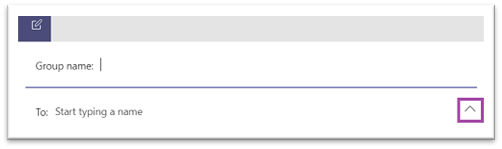
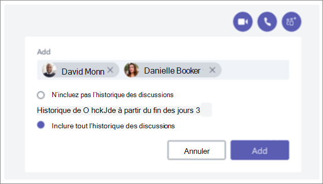
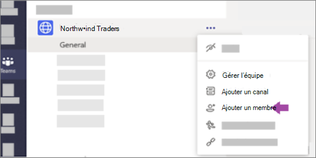
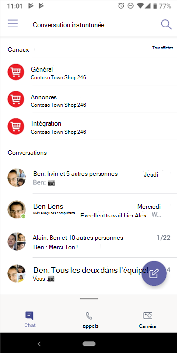
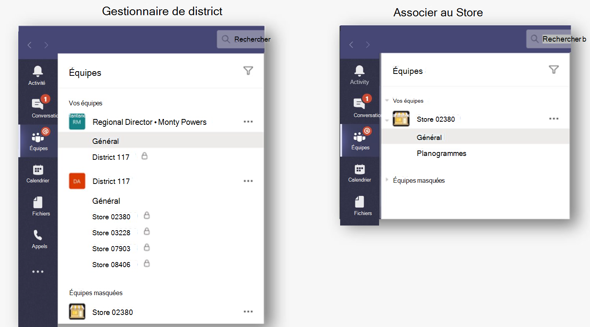
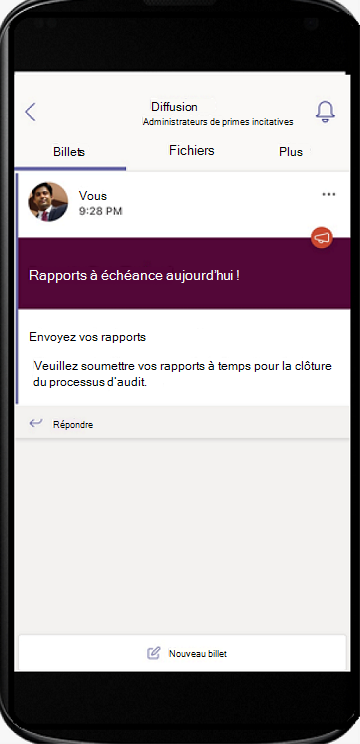
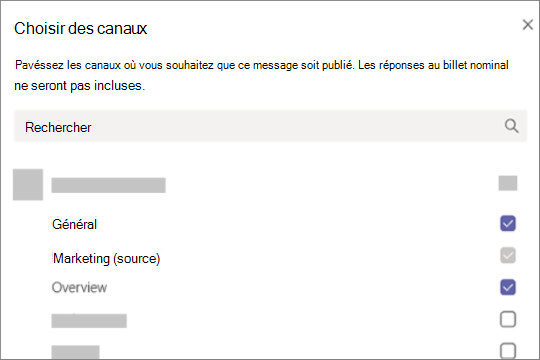
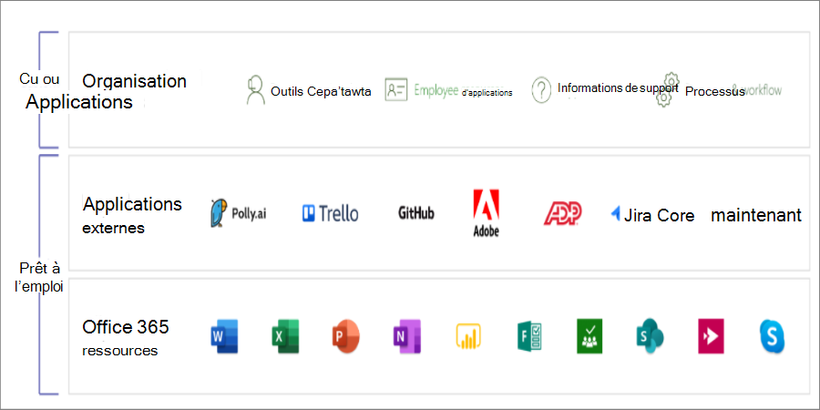
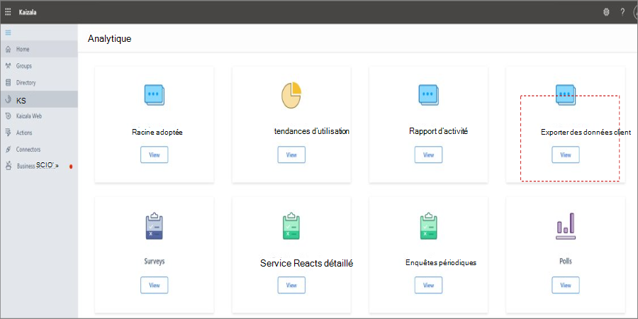
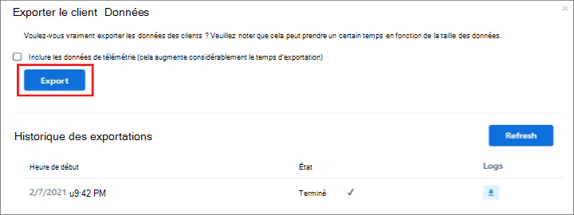

# Naviguer Microsoft Teams

Maintenant que vous avez une compréhension claire du chemin et des besoins uniques de votre organisation, il est temps de commencer votre parcours vers une collaboration puissante avec Microsoft Teams. Utilisez la section suivante pour découvrir comment parcourir les fonctionnalités de Kaizala complétées dans Teams.

| À partir de Kaizala | Pour Teams |
|---------|-----------------------|
| Prise en main : se connecter et configurer le profil| [Démarrer avec Teams](#getting-started) |
| Démarrage de nouvelles conversations, appels audio et vidéo 1:1 | [Conversations dans les appels Teams, audio et vidéo](#starting-new-chats-11-audio-and-video-calls) |
| Vos groupes Kaizala| [Déplacement de vos groupes Kaizala vers Teams](#moving-your-kaizala-groups-to-microsoft-teams) |
| Imiter l’expérience de messagerie d’application grand public| [Imiter l’expérience de messagerie d’application grand public](#mimic-the-consumer-app-messaging-experience) |
| Cartes d’action out of Box |  [Travail effectué dans Teams](#getting-work-done-in-teams) |
| Sondages, enquêtes, listes de vérification| [Exécution de sondages, d’enquêtes et de listes de contrôle dans Teams](#polls-surveys-and-checklists-in-teams) |
| Réunions - Carte d’action| [Nous allons rencontrer - Réunions dans Teams](#getting-work-done-in-teams) |
| Annonces - Carte d’action| [Annonces dans Teams](#announcements-in-teams) |
| Carte d’action des archivages de photos| [Archivages de photos dans Teams](#photo-check-ins)
| Questionnaire - Carte d’action| [Questionnaire dans Teams](#quiz-in-teams)
| Formation - Carte d’action| [Formation en Teams](#training-in-teams) |
| Vos cartes Actions personnalisées | [Solutions personnalisées dans Teams](#moving-kaizala-custom-solutions-to-microsoft-teams) |
| portail de gestion Kaizala| [Pour les professionnels de l’informatique](#it-professionals) |
| | [Pour les utilisateurs finaux](#end-user-guidance) |
| Kaizala dissolution du groupe| [Kaizala dissolution du groupe](#kaizala-group-dissolution) |
| Kaizala l’exportation des données client| [Exporter des données de locataire Kaizala](#export-kaizala-tenant-data)  |
| Collaboration avec des utilisateurs externes (fournisseurs/fournisseurs/partenaires)| [Ajouter ou inviter des personnes extérieures à votre organisation Teams à une conversation](#collaborating-with-external-usersvendorssupplierspartners) |

## Prise en main

La prise en main de votre migration de Kaizala à Teams est plus facile que jamais grâce à notre guide de prise en main. Pour en savoir plus sur le démarrage de votre parcours Microsoft Teams, consultez [Prise en main de Teams](https://support.microsoft.com/office/start-and-pin-chats-a864b052-5e4b-4ccf-b046-2e26f40e21b5?wt.mc_id=otc_microsoft_teams&ui=en-us&rs=en-us&ad=us).

## Démarrage de nouvelles conversations, appels audio et vidéo 1:1

Créez des conversations 1:1 ou de groupe pour collaborer avec un groupe plus petit ou pour parler en privé dans Teams. Vous pouvez épingler des conversations et enregistrer des messages pour un accès rapide. Pour commencer à discuter avec notre mise en forme de texte enrichi, emojis et gifs, consultez [Conversations dans Teams](https://support.microsoft.com/office/start-and-pin-chats-a864b052-5e4b-4ccf-b046-2e26f40e21b5?wt.mc_id=otc_microsoft_teams&ui=en-us&rs=en-us&ad=us).

Communiquez efficacement en démarrant les appels de groupe ou 1:1 avec toute personne de votre organisation. Avec Teams, vous avez la possibilité d’effectuer des appels audio et vidéo.  Pour commencer, consultez [Passer des appels](https://www.microsoft.com/videoplayer/embed/RE4rxv0?pid=ocpVideo0-innerdiv-oneplayer&postJsllMsg=true&maskLevel=20&market=en-us).

Vous pouvez passer de groupes Kaizala à Microsoft Teams via la création de Teams, de canaux et de conversations de groupe dans Teams.

Teams est une collection de personnes, de contenu et d’outils qui entourent différents projets et résultats au sein d’une organisation.

Teams est constitué de **canaux**, qui sont les conversations spécifiques à la rubrique que vous avez avec vos collègues. Chaque canal est dédié à une rubrique, un service ou un projet spécifique. Les canaux sont les plus précieux lorsqu’ils sont étendus avec des applications. Pour en savoir plus, consultez [le travail dans les canaux](https://support.microsoft.com/office/teams-and-channels-df38ae23-8f85-46d3-b071-cb11b9de5499?ui=en-us&rs=en-us&ad=us#ID0EAABAAA=Work_in_channels).

**Les conversations de groupe** vous permettent de rassembler rapidement vos collègues sur la messagerie instantanée.

### Conversations dans Teams Conversation ou Team Channel

|Conversations dans la conversation | Conversations dans les canaux d’équipe |
|---------|---------|
|Pour les conversations légères, où vous êtes directement destinataires de la messagerie.   | Pour les interactions où plusieurs rubriques sont abordées dans un espace ouvert.  |
|Les conversations privées ne sont visibles que par celles de la conversation     | Visible par tous les membres de l’équipe        |
|Une conversation continue et non lue     | Conversations structurées à plusieurs threads        |
|Jusqu’à 250 personnes     | Jusqu’à 25 000 personnes        |
|Choisissez si vous souhaitez partager l’historique des conversations avec de nouveaux participants à la conversation     | L’historique est partagé avec tous les nouveaux membres de l’équipe        |
|Les nouveaux destinataires de conversation doivent être ajoutés par les personnes déjà présentes dans la conversation     | Les utilisateurs peuvent rejoindre une équipe en la recherchant. Dans Teams privé, Teams administrateur approuve les nouveaux membres. Les membres du canal peuvent générer du code pour permettre aux nouveaux membres de rejoindre directement sans l’approbation de l’administrateur.        |
|Sur le partage d’écran sur place, ainsi que l’appel audio et vidéo. Planification facile des réunions Teams avec tous les participants à la conversation     | Sur place et appels audio et vidéo planifiés        |
|Une extensibilité avec des applications     | Extensibilité et personnalisation complètes avec les applications        |

Pour obtenir une vue d’ensemble des Teams, des canaux et des conversations de groupe, consultez [les équipes et les canaux dans Microsoft Teams](teams-channels-overview.md).

## Déplacement de vos groupes Kaizala vers Microsoft Teams

Dans Kaizala, les groupes sont une collection de personnes. Il existe trois types de structures de groupe dans Kaizala : les groupes plats, les groupes hiérarchiques et les groupes de diffusion. À mesure que vous passez à Microsoft Teams, vous pouvez utiliser Teams, canaux et conversations de groupe pour créer des structures de communication similaires pour votre organisation.

Utilisez les instructions ci-dessous pour obtenir des instructions sur le passage de groupes à Teams, canaux et conversations de groupe.

Il existe deux façons de déplacer vos groupes plats Kaizala vers Teams :

- Option 1 : Passer d’un groupe plat Kaizala à une conversation de groupe dans Teams

- Option 2 : Passer d’un groupe plat Kaizala à une équipe Teams

**Option 1 : Passer d’un groupe plat Kaizala à une conversation de groupe dans Teams**

Vous pouvez créer une conversation de groupe Teams pour tenir des réunions rapides et des conversations temporaires avec jusqu’à 250 participants. Les conversations de groupe permettent aux membres de votre organisation d’avoir un emplacement central pour une conversation ouverte où n’importe qui peut être ajouté à la conversation.

1. Démarrez et nommez une conversation de groupe.

    

    Toute personne ayant accès à la conversation de groupe peut [envoyer des messages](https://support.microsoft.com/office/send-and-read-messages-in-teams-b29e60ec-76af-4d97-8c3c-a4e36f2b64aa?ui=en-us&rs=en-us&ad=us).

2. Ajoutez des personnes à la conversation.

    
    
   Lors de l’ajout d’une personne à une conversation de groupe (pas une conversation un-à-un), vous pouvez inclure **l’historique des conversations** et la **durée de l’historique** que vous souhaitez partager avec eux.

3. Gérer la conversation de groupe.
  
    
    
   Pour voir qui est dans une conversation de groupe, pointez sur le nombre de participants dans l’en-tête de conversation pour afficher une liste des noms de tout le monde.

**Option 2 : Passer d’un groupe plat Kaizala à une équipe Teams**
   
Pour une communication de grand groupe ciblée, vous pouvez créer une équipe pour un groupe plat. Vous pouvez ajouter jusqu’à 25 000 membres pour communiquer de manière structurée avec des conversations thématiques. Ce type de communication permet aux rôles de modération et d’administration de s’assurer que les choses s’exécutent correctement.

1. Créer une équipe : pour être opérationnel dans Teams, vous devez créer une équipe, ajouter des personnes et ajouter des canaux. Pour en savoir plus, consultez [vos premières équipes](get-started-with-teams-create-your-first-teams-and-channels.md).
2. Consultez le guide pour les propriétaires d’équipe :

En tant que [propriétaire d’équipe](https://support.microsoft.com/office/go-to-guide-for-team-owners-92d238e6-0ae2-447e-af90-40b1052c4547?ui=en-us&rs=en-us&ad=us), vous pouvez ajouter de nouveaux membres et invités, modifier des membres en propriétaires, gérer les canaux et les paramètres, et archiver une équipe qui n’est plus utilisée.

3. Ajoutez des membres en bloc à une équipe :

    Si vous êtes propriétaire d’une équipe, accédez au nom de l’équipe dans la liste des équipes, puis sélectionnez le bouton **Plus d’options** > puis **Ajouter un membre**.

    

    Vous pouvez commencer à taper une liste de distribution, un groupe de sécurité ou Microsoft 365 groupe à ajouter à votre équipe. Pour en savoir plus, consultez [Ajouter des membres à une équipe dans Teams](https://support.microsoft.com/office/add-members-to-a-team-in-teams-aff2249d-b456-4bc3-81e7-52327b6b38e9?ui=en-us&rs=en-us&ad=us).

### Imiter l’expérience de messagerie d’application grand public

Si vous préférez une expérience simplifiée pour vos utilisateurs, vous pouvez choisir de configurer l’expérience Teams de votre organisation pour imiter les outils grand public que vos utilisateurs utilisent déjà.

Nous vous recommandons de commencer le parcours Teams pour vos utilisateurs Kaizala avec **Afficher les canaux favoris dans Chat** activés pour les communications simplifiées et shifts (facultatif).

Voici un exemple de l’interface de l’équipe avec **Shifts** :

Voici un exemple de l’interface team **sans Shifts** :

 

> [!NOTE]
> Vous pouvez supprimer l’accès au bouton Teams pour créer une interface simplifiée pour les travailleurs de première ligne avec uniquement les canaux mis en surbrillance affichant les conversations ci-dessus. Pour en savoir plus, consultez [Gérer les stratégies de messagerie dans Teams](messaging-policies-in-teams.md).

### Utiliser Teams et canaux pour créer une structure de groupe hiérarchique

Dans Kaizala, les groupes hiérarchiques permettent à votre organisation d’interagir dans différentes structures de groupe en fonction du type de communication entre les membres.  Dans Teams, vous pouvez créer des Teams et des canaux pour qu’ils correspondent à votre organigramme et configurer la communication basée sur la hiérarchie. Vous pouvez utiliser une structure hiérarchique dans Teams pour alerter les membres des actions nécessaires, des actualités importantes et des mises à jour.

Pour en savoir plus, consultez nos [meilleures pratiques d’organisation des équipes dans Microsoft Teams](best-practices-organizing.md).

### Utiliser Teams et canaux pour diffuser des actualités importantes

Dans un groupe de diffusion Kaizala, les administrateurs peuvent envoyer des messages et des actions à un groupe ciblé. De même, vous pouvez publier sur plusieurs canaux pour diffuser un message dans Teams. Pour attirer l’attention sur un message important, créez des publications Annonces.

La modération de canal vous permet de contrôler qui peut publier et répondre aux messages. Les chaînes peuvent être choisies parmi les équipes pour que le radiodiffuseur atteigne un public plus large. Vous pouvez limiter les interactions sur les annonces en autorisant uniquement certains administrateurs et modérateurs à répondre. Suivez ces étapes pour établir la modération de canal dans un canal Teams.

**Étape 1** : Configurer la modération du canal.

- Sélectionner un canal pour les diffusions

- Sélectionner **les paramètres de canal** pour configurer la modération

- Accédez à « Qui sont les modérateurs ? » pour sélectionner manuellement des modérateurs pour votre canal

**Étape 2** : Mettre en forme votre message.
Créez une annonce pour informer les membres de l’équipe des nouvelles ou actions importantes.

   

- Dans le canal, sélectionnez Format sous la zone où vous tapez votre message.

- En haut de la zone qui s’affiche, sélectionnez la flèche en regard de Nouvelle conversation > Annonce.

- Tapez un titre, modifiez sa couleur d’arrière-plan ou ajoutez une image d’arrière-plan pour la zone de titre.

- Tapez l’objet de votre annonce dans la zone Ajouter une sous-tête, puis le corps de votre message, puis sélectionnez Bouton Envoyer.

    

**Étape 3** : Sélectionner des canaux pour la diffusion de messages.

Vous pouvez effectuer des publications croisées sur plusieurs Teams et canaux lorsque vous disposez d’annonces et d’informations importantes qui doivent atteindre de grands groupes de personnes.

  

Pour plus d’informations, consultez [La publication croisée d’une conversation de canal dans Teams](https://support.microsoft.com/office/cross-post-a-channel-conversation-in-teams-9c1252a3-67ef-498e-a7c1-dd7147b3d295?ui=en-us&rs=en-us&ad=us).

## Travail effectué dans Teams

Lorsqu’il s’agit d’effectuer le travail, les outils appropriés peuvent permettre l’efficacité. Dans Kaizala, vous pouvez utiliser [des cartes d’action OOB (Out-of-box)](/kaizala/partnerdocs/kaizalaactioncards) pour faciliter et optimiser la gestion quotidienne du travail.
Microsoft Teams fournit plusieurs fonctionnalités et solutions pour les cartes d’action Out of Box dans Kaizala.

La plateforme Teams vous permet d’utiliser des outils d’organisation existants par le biais de l’intégration dans Microsoft Teams, ainsi que des applications Microsoft 365 prêtes à l’emploi et des applications tierces. Plus de 800 applications externes sont désormais disponibles dans Microsoft Teams.

### Sondages, enquêtes et listes de vérification dans Teams

[Les sondages](https://github.com/OfficeDev/microsoft-teams-apps-poll/wiki), [les enquêtes et les](https://github.com/OfficeDev/microsoft-teams-apps-survey) cartes d’action de [liste de vérification](https://github.com/OfficeDev/microsoft-teams-app-checklist) sont désormais disponibles en tant que modèles d’application d’extension de [message Teams](/microsoftteams/platform/messaging-extensions/what-are-messaging-extensions) prêts à l’installation sur GitHub.

**Le sondage** permet aux utilisateurs de créer et d’envoyer rapidement des sondages dans une conversation ou un canal pour connaître l’opinion de leur équipe. L’application de sondage est prise en charge sur toutes les plateformes : Teams clients de bureau, de navigateur, de iOS et de Android. Il est prêt pour le déploiement dans le cadre de votre abonnement Microsoft 365 existant

**L’enquête** permet aux utilisateurs de créer une enquête dans une conversation ou un canal pour poser une série de questions et obtenir des insights exploitables. Utilisez l’enquête pour : inscriptions, inscriptions, commentaires, témoignages, capture de prospects, rapports, plaintes et évaluations. L’application Survey est prise en charge sur toutes les plateformes : Teams clients de bureau, de navigateur, de iOS et de Android. Il est prêt pour le déploiement dans le cadre de votre abonnement Microsoft 365 existant.

**La liste** de vérification vous permet de collaborer avec votre équipe en créant une liste de contrôle partagée dans une conversation ou un canal. L’application checklist est prise en charge sur toutes les plateformes : Teams les clients de bureau, de navigateur, de iOS et de Android. Il est prêt pour le déploiement dans le cadre de votre abonnement Microsoft 365 existant.

Vous pouvez également envoyer instantanément des sondages rapides, des enquêtes et des listes de vérification à votre équipe avec des applications Microsoft 365 et tierces existantes.

[Microsoft Forms](https://techcommunity.microsoft.com/t5/microsoft-forms-blog/microsoft-forms-works-great-with-microsoft-teams/ba-p/109915) vous permet de collecter des informations et d’obtenir rapidement des décisions. Avec Forms intégré à Teams, vous pouvez facilement configurer un onglet Formulaires, créer des notifications pour votre formulaire et effectuer un sondage rapide. Pour savoir comment créer[, modifier et examiner des formulaires dans Microsoft Teams](https://support.microsoft.com/office/work-with-colleagues-to-create-edit-and-review-forms-in-microsoft-teams-333b97a3-41d9-48bc-a1cb-84a96bd44e14#:~:text=1%20In%20Teams%2C%20go%20to%20the%20channel%20you,name%20for%20your%20new%20form.%20More%20items...%20).

Des applications tierces telles que Polly et SurveyMonkey vous permettent d’effectuer d’autres sondages et enquêtes avec votre Teams.

- **Polly**  vous permet d’obtenir des insights de sondage en temps réel pour prendre de meilleures décisions commerciales et mesurer l’engagement de l’équipe dans les sondages via des vues de tableau de bord complètes.

- **SurveyMonkey** apporte des enquêtes là où vous faites déjà des affaires dans Microsoft Teams, ce qui facilite l’ajout d’enquêtes à votre flux de travail quotidien. Écrivez et envoyez un sondage rapide à une question de l’intérieur Microsoft Teams, puis observez les résultats de vos coéquipiers.

### Travaux dans Teams

Utilisez **[Planificateur Microsoft](https://support.microsoft.com/office/organize-your-team-s-tasks-in-microsoft-planner-c931a8a8-0cbb-4410-b66e-ae13233135fb?ui=en-us&rs=en-us&ad=us)** pour exécuter des travaux dans Teams. Vous pouvez collaborer sur un projet avec une équipe, consulter les rapports de progression et suivre les affectations individuelles.

Lorsque vous utilisez Microsoft Teams, vous pouvez organiser vos tâches en ajoutant un ou plusieurs onglets planificateur à un canal d’équipe. Vous pouvez ensuite travailler sur votre plan à partir de Teams ou dans le Planificateur pour le web, supprimer ou supprimer votre plan, et être averti dans Teams lorsqu’une tâche vous est affectée dans le Planificateur.

### Annonces dans Teams

Créez et envoyez des messages destinés à plusieurs équipes ou à un grand nombre d’employés via une conversation avec l’application [de communication d’entreprise](/microsoftteams/platform/samples/app-templates#company-communicator) . Son interface simple permet aux utilisateurs désignés de créer, d’afficher un aperçu, de collaborer et d’envoyer des messages de manière ciblée. Créez des fonctionnalités de communication ciblées personnalisées, telles que des données personnelles personnalisées, sur le nombre d’utilisateurs reconnus ou ayant interagi avec un message avec des insights directement liés aux décisions de gestion.

### Archivages de photos

Utilisez la Teams Smart Caméra pour capturer et partager une image annotée avec votre équipe. Partagez facilement votre emplacement avec précision pour informer votre équipe. Vous devez avoir plus d’informations pour communiquer la façon dont les fonctionnalités de Kaizala sont mappées à Teams. Certainement avoir autant d’informations à partir du jeu de diapositives que nous pouvons dans le document.

[Utilisez le](/microsoftteams/platform/samples/app-templates#staff-check-ins) modèle d’application d’archivage du personnel pour permettre au personnel de première ligne de fournir facilement des informations et des mises à jour d’état critiques dans le temps sur une base planifiée ou ad hoc directement à partir de Teams. L’application prend en charge l’emplacement en temps réel, les photos, les notes, les notifications de rappel et les flux de travail automatisés.

### Questionnaire dans Teams

Le questionnaire est une [extension de messagerie Teams](/microsoftteams/platform/messaging-extensions/what-are-messaging-extensions) personnalisée qui vous permet de créer un questionnaire dans une conversation ou un canal pour la vérification des connaissances et des résultats instantanés. Vous pouvez utiliser le questionnaire pour les examens en classe et hors connexion, la vérification des connaissances au sein de l’équipe et pour les questionnaires amusants au sein d’une équipe. L’application quiz est prise en charge sur plusieurs plateformes, telles que Teams bureau, navigateur, iOS et Android clients. Cette application est prête pour le déploiement dans le cadre de votre abonnement Microsoft 365 existant.

[Obtenez-le sur GitHub](https://github.com/OfficeDev/microsoft-teams-apps-quiz)

  

### Formation en Teams

Utilisez le modèle d’application [Checkins du personnel](/microsoftteams/platform/samples/app-templates#staff-check-ins) pour permettre au personnel de première ligne de fournir facilement des informations et des mises à jour d’état critiques dans le temps sur une base planifiée ou ad hoc directement à partir de Teams. L’application prend en charge l’emplacement en temps réel, les photos, les notes, les notifications de rappel et les flux de travail automatisés.

Utilisez Teams pour faciliter la formation de votre organisation. La formation est une application [d’extension de messagerie Teams](/microsoftteams/platform/what-are-messaging-extensions) personnalisée qui permet aux utilisateurs de publier une formation au sein d’une conversation ou d’un canal pour le partage et l’amélioration des connaissances hors connexion. L’application est prise en charge sur plusieurs clients de plateforme Teams, tels que bureau, navigateur, iOS et Android. Cette application est prête pour le déploiement dans le cadre de votre abonnement Microsoft 365.

[Obtenez-le sur GitHub](https://github.com/OfficeDev/microsoft-teams-apps-training)

Vous pouvez simplifier l’intégration en offrant l’accès aux informations contextuelles.  Rendez les guides des employés, la formation et plus facilement disponibles et à jour pour autonomiser votre organisation par le biais de compétences. Pour en savoir plus sur les scénarios de formation, consultez [Intégrer de nouveaux employés](https://support.microsoft.com/office/effectively-onboard-new-employees-691faccd-1d1a-4f47-99ac-b6c82973f5ee).

## Déplacement de solutions personnalisées Kaizala vers Microsoft Teams

Suivez cette approche en trois étapes pour que vos solutions Microsoft Teams :

1. Tenez compte de l’utilisation et de la fréquence de la solution.

    L’utilisation élevée et la fréquence des solutions méritent un meilleur argument pour le développement personnalisé.

2. Tenez compte de la complexité de la solution.

    Les solutions présentant une complexité plus élevée peuvent justifier un développement personnalisé plus solide.

3. Explorez les approches suivantes par fréquence d’utilisation et complexité.

    - Tirer parti des fonctionnalités de Microsoft Teams natives

    - Utiliser [l’intégration d’applications tierces et explorer l’App Store](deploy-apps-microsoft-teams-landing-page.md)

    - Découvrir [les modèles d’application](/microsoftteams/platform/samples/app-templates)

    - Créer des [applications personnalisées à l’aide de la plateforme Teams](/microsoftteams/platform/overview)

## Gestion dans Microsoft Teams

### Professionnels de l’informatique

Effectuez la transition administrative du portail de gestion Kaizala vers le centre de Microsoft Teams Administration. Le centre d’administration Teams est principalement destiné à l’utilisation des rôles d’administrateur uniquement.

Les administrateurs peuvent gérer l’ensemble de la charge de travail Teams, ou ils peuvent disposer d’autorisations déléguées pour résoudre les problèmes de qualité des appels ou gérer les besoins de téléphonie de votre organisation.

Pour naviguer dans le Centre d’administration, visitez [Microsoft Teams Administration Centre](https://admin.teams.microsoft.com/).

Vous pouvez surveiller la sécurité et la conformité de votre organisation dans Microsoft 365 avec le [portail de conformité Microsoft Purview](/microsoft-365/compliance/microsoft-365-compliance-center) et [Microsoft Security Center](/microsoft-365/security/defender/overview-security-center).

Protégez votre entreprise et autonomisez vos utilisateurs dans le [centre d’administration Azure Active Directory](https://aad.portal.azure.com/#@microsoft.onmicrosoft.com/dashboard/private/c7736064-7b28-4f3d-b366-2740a8d48020) où vous pouvez examiner les groupes, l’identité, les licences et l’accès entre Microsoft 365.

## Portail de gestion Kaizala au centre de Teams Administration

### Conseils de l’utilisateur final

Utilisez le tableau suivant pour parcourir les fonctionnalités correspondantes dans Microsoft Teams à partir du portail de gestion Kaizala.

| Portail de gestion Kaizala | application Microsoft Teams|
|---------|-----------------------|
| Créer des groupes (connectés à l’organisation) | **Créer des équipes** via l’application de bureau ou mobile |
| Ajout d’utilisateurs en bloc | Pour ajouter des utilisateurs en bloc à l’équipe, envisagez de créer une équipe via des groupes O365, des DLL O365 ou un groupe de sécurité |
| Répertoire | Recherchez n’importe qui dans votre organisation via la **barre de recherche** dans teams. Les résultats de la recherche retournent également des fichiers, des messages et des publications |
| Analytique (cartes d’action) | **Les sondages**, **les enquêtes** et **les listes de** vérification ont intégré des rapports avec des données téléchargeables. Les travaux peuvent également être attribués à l’aide de l’application Tasks dans Teams, disponible pour les utilisateurs. Pour d’autres scénarios, des applications tierces comme **Trello**, **Asana** peuvent également être explorées pour être utilisées dans Teams. |
| Extensions – Connecteurs | Utilisez l’option **Connecteurs** dans le menu (...) pour tout canal pour lequel le connecteur est requis. |
| [Rapport d’adoption de l’analytique (utilisation),](teams-analytics-and-reports/view-analytics.md) [rapport d’utilisation](teams-analytics-and-reports/teams-usage-report.md), [rapport d’activité](teams-analytics-and-reports/user-activity-report.md) | Les propriétaires d’équipe peuvent accéder aux rapports de leurs équipes en naviguant à partir du menu (...) pour **gérer** **teamanalytics** > . |

> [!NOTE]
> Teams les utilisateurs finaux peuvent utiliser Teams sur le bureau ou le mobile pour gérer leurs équipes et canaux individuels et n’ont pas besoin d’accéder au centre de Teams Administration.

## Kaizala dissolution du groupe

Lorsque vous passez à Teams canaux et conversations, vous pouvez envisager Kaizala dissolution de groupe pour vous assurer que votre organisation dispose d’un emplacement central pour la communication. La suppression d’un groupe Kaizala supprime le groupe de la liste Des conversations. Si vous êtes le seul administrateur du groupe, vous devez attribuer le rôle d’administrateur à au moins une personne du groupe avant de la supprimer.

### Pour déplacer un groupe Kaizala vers Teams

 1. Partager le teaser Teams avec Kaizala membres du groupe

 2. Configurer des sites Teams

 3. Ajouter des utilisateurs à Teams

 4. Annoncer le basculement vers tous les membres du groupe Kaizala

 5. Dans les paramètres, [basculez Kaizala groupe](#to-switch-to-kaizala-group-to-read-only) en **lecture seule**

 6. Partagez les raisons pour lesquelles Teams est une meilleure option avec Kaizala membres du groupe

 7. Partagez les instructions, par exemple, à partir du moment où Teams seront disponibles et de la façon d’utiliser Teams

 8. Lancer des concours d’engagement

 9. Participation à la direction du programme d’installation

 10. Rechercher des commentaires auprès des membres

 11. Suivre le calendrier de contenu

 12. [Supprimer Kaizala groupe](#to-delete-a-group)

### Pour basculer vers Kaizala groupe en **lecture seule**

1. Connectez-vous au portail de gestion Kaizala.

2. Sélectionnez l’onglet **Groupes** dans le volet de navigation gauche, puis sélectionnez le groupe que vous souhaitez définir en lecture **seule**.

    

3. Dans la liste déroulante, sélectionnez **Modifier les stratégies**.
  
    

4. Dans **stratégie de groupe** fenêtre, décochez les options suivantes :

     - Autoriser les nouveaux participants à consulter l’historique des conversations. Les messages envoyés à partir de maintenant seront visibles.

     - Autoriser les membres à envoyer des messages et des pièces jointes.

       

     > [!NOTE]
     > Les administrateurs peuvent toujours publier dans le groupe.

### Pour supprimer un groupe

1. Dans la liste Des conversations, appuyez longuement sur la conversation de groupe.

2. Appuyez sur Supprimer le groupe.

## Exporter des données de locataire Kaizala

En tant qu’administrateur de locataire/administrateur général Kaizala, vous pouvez exporter Kaizala données client à partir du portail de gestion Kaizala. Lorsque vous utilisez Teams, vous pouvez toujours garder le contrôle de vos données d’entreprise dans Kaizala. Pour plus d’informations, consultez [Exporter les données du locataire à partir du portail de gestion](/office365/kaizala/export-or-delete-your-data).

### Pour exporter des données

 1. Sélectionnez l’onglet **Analyse** dans le volet de navigation gauche, puis **exportez les données du locataire**.
  
    

 2. Sélectionnez **Exporter**.

    

 3. Utilisez le fichier Messages du locataire , avec des filtres sur le nom/l’horodatage du groupe pour accéder aux données de conversation au niveau du groupe.

    

## Suppression d’un groupe Kaizala

La suppression d’un groupe Kaizala supprime le groupe de la liste Des conversations. Si vous êtes le seul administrateur du groupe, vous devez attribuer le rôle d’administrateur à au moins une personne du groupe avant de la supprimer.

Pour supprimer un groupe :

- Dans la liste Des conversations, appuyez longuement sur la conversation de groupe.

- Appuyez sur Supprimer le groupe.

## Kaizala l’exportation des données client

Lorsque vous utilisez Teams, vous pouvez toujours garder le contrôle de vos données d’entreprise dans Kaizala. Pour plus d’informations, consultez [Exporter les données du locataire à partir du portail de gestion](/office365/kaizala/export-or-delete-your-data).

## Collaboration avec des utilisateurs externes (fournisseurs/fournisseurs/partenaires)

Microsoft Teams offre des solutions sécurisées pour collaborer avec des parties externes, et avec Microsoft Teams Connect nous rendons encore plus facile de travailler avec n’importe qui en dehors de votre organisation. Teams permet aux utilisateurs commerciaux de discuter avec des utilisateurs commerciaux externes, c’est-à-dire des utilisateurs commerciaux dans d’autres organisations. En s’appuyant sur ce privilège, nous vous permettent de discuter avec des membres de l’équipe en dehors de votre organisation, même s’ils utilisent un compte personnel Teams. Ces comptes sont fréquemment utilisés par SMB et, par conséquent, cette nouvelle fonctionnalité vous aide à renforcer la relation avec les partenaires externes.

Comme annoncé précédemment à [Ignite](https://techcommunity.microsoft.com/t5/microsoft-teams-blog/microsoft-ignite-fall-2021-innovations-coming-to-microsoft-teams/ba-p/2824127), vous pouvez inviter n’importe quel utilisateur Teams à discuter en entrant l’adresse e-mail complète ou le numéro de téléphone que vous souhaitez atteindre, et démarrer une conversation un-à-un ou de groupe avec toute personne disposant d’un compte personnel Microsoft, sans changement de locataire requis.

Discuter avec des utilisateurs externes sans avoir à changer de locataire vous permet d’obtenir les résultats dont vous avez besoin plus rapidement. Examinons de plus près son fonctionnement.

Selon les paramètres d’administration de votre organisation et de l’utilisateur de compte personnel Teams, vous pouvez démarrer des conversations avec des utilisateurs de compte personnel Teams externes, et les utilisateurs de compte personnel Teams externes peuvent démarrer des conversations avec Teams utilisateurs professionnels.

Teams utilisateurs gérés par une organisation peuvent inviter Teams utilisateurs de compte personnel avec lesquels ils souhaitent discuter en entrant leur adresse e-mail complète ou leur numéro de téléphone. Teams utilisateurs personnels peuvent entrer l’adresse e-mail de l’organisation exacte de l’utilisateur qu’ils souhaitent atteindre et tenter de démarrer une conversation.

Si les personnes avec lesquelles vous souhaitez discuter ne sont pas Teams utilisateurs, elles recevront un e-mail ou un SMS les invitant à participer à la conversation à l’aide d’un compte personnel. Lorsqu’ils s’inscrivent et se connectent à leur compte personnel Teams, ils peuvent participer à la conversation.

Une fois que les personnes que vous avez invitées ont accepté l’invitation, vous pouvez démarrer une nouvelle conversation un-à-un ou de groupe ou même les ajouter à une conversation de groupe externe existante. Ce fil de conversation apparaîtra aux côtés de vos autres conversations, sans aucun changement de locataire requis pour afficher la conversation.

Dans le cadre de votre conversation, vous pouvez vous exprimer en envoyant et en recevant des messages enrichis, des GIF et des médias.

Vous pouvez choisir de rester uniquement dans les conversations dans lesquelles vous voulez être. Vous pouvez bloquer les messages d’utilisateurs externes ou quitter une conversation de groupe.

Teams utilisateurs gérés par une organisation et Teams utilisateurs de compte personnel ont la possibilité de refuser une invitation externe. Vous pouvez envoyer un message à un utilisateur externe jusqu’à 10 fois avant d’accepter, mais s’il n’y a pas d’acceptation après 10 messages, vous ne pourrez pas envoyer des messages supplémentaires à cet utilisateur.

Consultez la [page de support](https://support.microsoft.com/en-us/office/add-or-invite-people-outside-your-teams-org-to-a-chat-6897ab47-9f60-4db6-8b95-18599714fe57) et lisez le [blog](https://techcommunity.microsoft.com/t5/microsoft-teams-blog/microsoft-teams-users-can-now-chat-with-any-teams-user-outside/ba-p/3070832) pour en savoir plus sur la façon dont Teams vous permet de collaborer en toute transparence avec des clients et partenaires externes dans le cadre de la sécurité de votre espace de travail Teams approuvé.

## Étapes suivantes

[Microsoft Teams pour les travailleurs de première ligne](/MicrosoftTeams/drive-adoption-optimize-kaizala)
