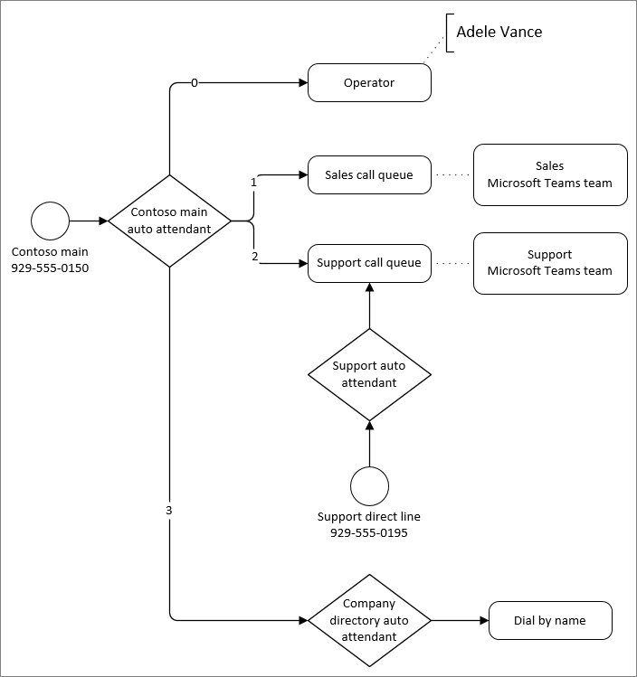

# Planifier votre flux de routage des appels

Dans le cadre du processus de planification, nous vous recommandons d’effectuer le routage des appels pour votre organisation dans un diagramme. Le diagramme permet de déterminer le routage le plus efficace pour les personnes qui appellent à votre organisation. Vous pouvez également utiliser le diagramme pour déterminer les standards automatiques et les files d’attente d’appels que vous devez créer, ainsi que les exigences associées, telles que les numéros de service, les licences et les comptes de ressources.

Examinons comment les standards automatiques et les files d’attente d’appels routent les appels.

Les standards automatiques routent tous les appels de l’une des manières suivantes :

- **Rediriger immédiatement** : les appels peuvent être redirigés vers l’une des destinations de routage des appels (répertoriées ci-dessous) immédiatement après avoir répondu ou après un message d’accueil initial.
- **Redirection basée sur les options de numérotation** : les appelants peuvent choisir entre les options affectées aux numéros sur leur clavier téléphonique, 0-9. Une destination de routage d’appel peut être affectée à chaque clé de numérotation.
- **Composer des personnes par nom ou par extension** : les appelants peuvent être dirigés vers le numéro d’extension de la personne qu’ils tentent d’atteindre dans le répertoire de votre organisation, ou en orthographiant le nom de la personne.
- **Déconnexion** : un standard automatique peut raccrocher l’appel.

> [!NOTE]
> Un standard automatique unique ne peut prendre en charge qu’une seule méthode « dial by ».  Pour permettre aux appelants de composer par nom et par numéro, vous devez créer un standard automatique qui a une option de numérotation par nom et l’autre pour composer par extension.  Chacune de ces options est acheminée vers des standards automatiques distincts configurés pour ces scénarios de « numérotation par ».

Lorsque les appels sont redirigés par un standard automatique ou une file d’attente d’appels, vous pouvez choisir parmi les destinations de routage des appels suivantes :

- **Personne de l’organisation** : une personne de votre organisation qui est en mesure de recevoir des appels vocaux. Il peut s’agir d’un utilisateur en ligne ou d’un utilisateur hébergé localement à l’aide de Skype Entreprise Server.
- **Application vocale** : un autre standard automatique ou une file d’attente d’appels. Choisissez le compte de ressource associé à la destination.
- **Numéro de téléphone externe** : n’importe quel numéro de téléphone. Consultez [les détails techniques du transfert externe](create-a-phone-system-auto-attendant.md?tabs=additional-resources).

- **Messagerie vocale** : boîte aux lettres vocale associée à un groupe Microsoft 365 que vous spécifiez. Vous pouvez choisir si vous voulez des transcriptions de messagerie vocale et le message « Veuillez laisser un message après le ton ». invite système.
- **Opérateur** (standard automatique uniquement) : opérateur défini pour le standard automatique. La définition d’un opérateur est facultative. Un opérateur peut être l’une des autres destinations de cette liste.

Les standards automatiques offrent des options de routage d’appels distinctes pour les appels reçus en dehors des heures de bureau et pendant les jours fériés.

Les files d’attente d’appels mettent l’appelant en attente jusqu’à ce qu’un agent affecté à la file d’attente soit disponible pour prendre son appel. Il existe deux situations où un appelant peut être dirigé hors de la file d’attente :

- **Dépassement** des appels : si le nombre d’appels dans la file d’attente dépasse la limite que vous avez définie, les nouveaux appelants sont redirigés hors de la file d’attente.
- **Délai d’expiration** des appels : si un appelant est dans la file d’attente depuis plus longtemps que le paramètre de délai d’expiration configuré, il est redirigé hors de la file d’attente.

Les appels redirigés hors d’une file d’attente peuvent être envoyés à l’une des destinations de routage des appels répertoriées ci-dessus, à l’exception d’un opérateur. (Les files d’attente d’appels n’ont pas d’opérateurs, mais vous pouvez rediriger les appelants vers la même destination qu’un opérateur que vous avez configuré pour un standard automatique.)

L’exemple ci-dessous montre un exemple de routage des appels à l’aide de standards automatiques et de files d’attente d’appels.

Dans l’exemple ci-dessus :

- La touche zéro (0) redirige les appelants vers un opérateur. L’opérateur de ce standard automatique a été configuré en tant que **personne de l’organisation**.
- La seule clé (1) redirige les appelants vers la file d’attente des appels commerciaux. Cette file d’attente d’appels est connectée à une équipe qui contient l’équipe commerciale affectée à la file d’attente.
- Les deux (2) touches redirigent les appelants vers la file d’attente des appels de support. Cette file d’attente d’appels est connectée à une équipe qui contient l’équipe de support affectée à l’équipe.
- La file d’attente d’appels de support a un numéro de téléphone direct via un standard automatique intermédiaire. Le fait de disposer d’un standard automatique pour répondre à la ligne de support permet de séparer les heures creuses et le routage des appels de congés.
- La touche trois (3) redirige les utilisateurs vers un autre standard automatique pour l’annuaire de l’entreprise. Le standard automatique de l’annuaire de l’entreprise permet aux appelants d’appeler des personnes de l’organisation en composant leur nom ou extension.

Nous vous recommandons de créer un ou plusieurs diagrammes similaires à celui ci-dessus pour mapper le routage de vos appels. Veillez à inclure les éléments suivants dans votre diagramme ou dans la documentation associée :

- Quels standards automatiques auront un accès direct via des numéros de téléphone ?
- Quelles sont les exigences de routage des heures creuses et des congés pour chaque standard automatique ?
- Appartenance à chaque file d’attente d’appels. (Vous pouvez ajouter des utilisateurs individuellement ou mapper la file d’attente à différents types de groupes. Le mappage d’une file d’attente à une équipe offre l’expérience la plus polyvalente.)

Voici quelques bonnes pratiques de routage des appels :

- Examinez votre système d’appel existant et analysez les types et la fréquence des appels entrants. Utilisez ces informations pour informer votre standard automatique et la structure de la file d’attente des appels.
- Placez les options les plus courantes le plus tôt possible dans le menu pour router les appels le plus rapidement possible.
- Évitez de connecter les numéros de service directement aux files d’attente d’appels, sauf si les files d’attente sont disponibles 24h/24 et 7 j/7. Les files d’attente d’appels n’autorisent pas la gestion distincte des appels pendant les heures creuses ou les jours fériés. Si vous souhaitez avoir une file d’attente avec un numéro direct, affectez le numéro à un standard automatique qui redirige automatiquement vers la file d’attente pendant les heures d’ouverture.
- Si vous recevez de nombreux appels demandant des informations de base sur votre entreprise, telles que les heures d’ouverture, l’emplacement ou l’adresse du site web, envisagez de créer un standard automatique pour répondre à ces questions avec des messages enregistrés.
- Conservez la liste des éléments de menu sur cinq ou moins. Les appelants peuvent avoir du mal à mémoriser plus de cinq options. Utilisez des standards automatiques imbriqués si d’autres options sont nécessaires pour acheminer correctement un appel.
- Décrivez d’abord le service, suivi de l’option d’appui (par exemple: For Sales press 1) plutôt que l’inverse (par exemple. Appuyez sur 1 pour Ventes).
- La terminologie utilisateur que vos appelants comprendront plutôt que ce que vous pouvez utiliser en interne.
- Évitez les mises à jour fréquentes pour le routage des appels. Si vous modifiez les options de menu d’un standard automatique à l’avenir, appelez-le dans les invites vocales pour les 30 premiers jours.
