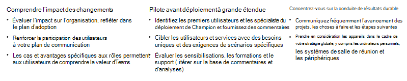

# Planification d’une transition réussie de Kaizala vers Microsoft Teams

Lorsque vous passez de Kaizala à Microsoft Teams, il est important de prendre le temps de [planifier](/microsoftteams/deploy-enterprise-setup?tabs=ChatTeamsChannels#plan-your-deployment) une transition réussie. Un plan de transition solide vous permet de structurer votre démarche et de vous assurer que toutes les parties prenantes travaillent à la réalisation d’un objectif commun. L’utilisation d’un framework éprouvé pour implémenter la modification peut vous aider à commencer votre transition dès aujourd’hui.

## Infrastructure de transition

Nous avons décrit notre approche recommandée pour une transition réussie ci-dessous et vous encourageons à suivre les phases dans l’ordre, car chaque étape du framework s’appuie sur l’étape précédente.

- Envisager le travail d’équipe pour votre organisation

- Identification des champions et des parties prenantes critiques

- Définition de l’étendue de votre projet

- Pilotage de Microsoft Teams

Avant de commencer, assurez-vous que :

- [Teams est installé](/microsoftteams/get-clients) et [des licences sont attribuées](/office365/servicedescriptions/teams-service-description) dans votre environnement. Au moins les licences minimales doivent être attribuées à votre équipe principale et aux premiers utilisateurs qui participeront à cette phase de projet initiale.

- Vous avez téléchargé les applications de bureau et mobiles.

### Envisager le travail d’équipe pour votre organisation

Un environnement technique sain, une adoption soutenue des utilisateurs et la réalisation des objectifs de votre entreprise commencent tous par une planification appropriée. Un plan solide vous offre un cadre pour votre projet de mise à niveau et garantit que toutes les parties prenantes travaillent vers les mêmes objectifs. Prenez le temps de répertorier les scénarios actuels dans lesquels Kaizala est utilisé. Ensuite, envisagez des scénarios d’utilisation au-delà de l’espace de travail moderne avec Microsoft Teams. Pour commencer à définir des scénarios d’utilisation, consultez [Définir des scénarios d’utilisation pour Microsoft Teams](/microsoftteams/teams-adoption-define-usage-scenarios).

### Identifier les champions et les parties prenantes critiques

Commencez par rassembler les parties prenantes appropriées et définissez votre plan de mise à niveau. Un plan approprié doit inclure votre étendue, vos objectifs et une chronologie claire pour la transition. Une fois le plan convenu en place, vérifiez que votre environnement technique et vos utilisateurs finaux sont prêts pour Teams. Identifier les personnes intéressées par les nouvelles technologies et aider les autres. Créez un [programme champion](/microsoftteams/teams-adoption-create-champions-program) pour stimuler l’excitation, la sensibilisation et l’adoption tout au long de votre transition. Nous avons créé un Guide du programme des champions pour lancer ce programme dans votre organisation, pour en savoir plus, consultez [Créer un programme champion](https://view.officeapps.live.com/op/view.aspx?src=https://fto365dev.blob.core.windows.net:443/media/Default/DocResources/Adoption/Build_Champions_Program_Guide.pptx).

### Définition de l’étendue de votre projet

Lorsque vous planifiez votre passage à Microsoft Teams, il est essentiel de définir à quoi ressemble la réussite de votre entreprise.  L’étendue du projet définit le focus de votre projet pour le moment et permet à votre équipe de projet de se concentrer sur ses tâches actuelles, ce qui vous permet de réaliser votre vision à long terme.

Pour en savoir plus sur notre stratégie recommandée pour définir les résultats et la réussite, consultez [Définir les résultats et la réussite de l’adoption de Microsoft Teams](/microsoftteams/teams-adoption-define-outcomes).

### Pilote Microsoft Teams

Une fois que vous avez défini l’étendue et la vision de votre projet, il est temps de piloter Microsoft Teams. Identifiez un groupe [d’utilisateurs précoces](/microsoftteams/teams-adoption-onboard-early-adopters) pour participer à une expérience initiale avec Teams. La conduite de votre projet pilote inclut la communication avec vos utilisateurs, la surveillance de votre réseau et de votre utilisation pour garantir que les performances de votre réseau et la qualité des appels restent saines, la collecte des commentaires des participants et l’examen des tickets de support technique pour les questions relatives à Teams.

## Préparer votre organisation

Après avoir suivi l’infrastructure recommandée pour planifier une transition réussie à partir de Kaizala, préparez votre organisation pour une transition réussie de Microsoft Teams.

### Préparez-vous

 1. Assurez-vous qu’il existe des licences Teams pour tout le monde. Voir [Offres Teams](https://www.microsoft.com/microsoft-teams/compare-microsoft-teams-options?activetab=pivot%3aprimaryr1) et [Description du service Microsoft Teams](/office365/servicedescriptions/teams-service-description).

 2. Utilisez les conseils [d’adoption de Microsoft Teams](https://adoption.microsoft.com/microsoft-teams/#get-started) pour déployer Teams au sein de votre organisation.

 3. Préparez les administrateurs, les champions et votre plus grande organisation à adopter la communication avec Teams par le biais de ressources de compétences et d’adoption.  

 4. Utilisez ces ressources de formation pour aider les utilisateurs de votre organisation à apprendre et à tirer le meilleur parti de Teams :

    - Pour connaître la préparation Administration informatique, consultez [Administration ressources de formation](/microsoftteams/itadmin-readiness).

    - Pour obtenir une formation dirigée par un instructeur, consultez la [formation dirigée par un instructeur pour Microsoft Teams](/microsoftteams/instructor-led-training-teams-landing-page).
  
    - Pour obtenir des vidéos de formation, consultez [la formation vidéo de Microsoft Teams](https://support.microsoft.com/office/microsoft-teams-video-training-4f108e54-240b-4351-8084-b1089f0d21d7?ui=en-us&rs=en-us&ad=us).

## Champion de l’adoption de Microsoft Teams

En [adoptant](/microsoftteams/teams-adoption-get-started) Microsoft Teams, vous pouvez offrir une excellente expérience utilisateur et une valeur commerciale accrue au sein de votre entreprise.

Tout au long de votre déploiement Teams, veillez à tirer parti de [ces](/microsoftteams/adopt-microsoft-teams-landing-page) ressources avec des conseils sur la conduite de l’adoption de Teams.

Renforcez vos connaissances sur Teams et améliorez l’utilisation de votre organisation par le biais d’une formation pour les administrateurs et les utilisateurs. Pour obtenir des ressources de formation, consultez [la formation Microsoft Teams](/microsoftteams/training-microsoft-teams-landing-page).

Si votre organisation est intéressée par une expérience personnalisable pour s’aligner sur vos plans d’utilisation et d’adoption, consultez ici pour en savoir plus sur la solution de formation à la demande des [parcours d’apprentissage Microsoft 365](https://adoption.microsoft.com/microsoft-365-learning-pathways/) .

Pour rester informé des nouveautés de Teams et de tous les autres produits et services Microsoft 365 ou Office 365 de votre organisation, veillez [à consulter le](https://admin.microsoft.com/AdminPortal/Home?ref=/MessageCenter) Centre de messages et la [feuille de route Teams](https://www.microsoft.com/microsoft-365/roadmap?rtc=2&filters=Microsoft%20Teams). Vous serez informé des fonctionnalités nouvelles et mises à jour, des modifications prévues et des problèmes.

## Ressources supplémentaires

Rassemblez tout le monde, mettez en place des conversations efficacement, connectez-vous aux employés et numérisez les tâches quotidiennes avec Microsoft Teams. Teams facilite la connexion et la coordination avec vos employés, membres, clients et distributeurs de première ligne.

Pour obtenir des ressources supplémentaires, nous avons compilé une [bibliothèque de documentation](/microsoftteams/) sur Microsoft Teams pour les administrateurs et les professionnels de l’informatique. Utilisez la documentation pour vous assurer que votre organisation est préparée tout au long de votre parcours de Kaizala à Microsoft Teams.

## Étapes suivantes

[Navigation dans Microsoft Teams à partir de Kaizala](/MicrosoftTeams/navigate-teams)
