# Stratégies et packages de stratégie Teams pour l’éducation

> [!NOTE]
> Pour plus d’informations sur les stratégies dans Microsoft Teams, voir [Attribuer des stratégies à vos utilisateurs dans Microsoft Teams](assign-policies.md).

Il est important de noter que cet article couvrira plusieurs méthodes d’attribution de stratégies à des utilisateurs dans Teams.

- Attribution manuelle à des utilisateurs individuels.
- Attribution à plusieurs utilisateurs en bloc à l’aide de PowerShell.
- Attribution de packages de stratégie à des utilisateurs individuels ou multiples.

Les avantages et les inconvénients de ces approches se réduisent aux besoins individuels de l’établissement.

## Administrateurs : prise en main de la gestion de stratégie Microsoft Teams

Microsoft Teams, à la base, est destiné à permettre aux utilisateurs d’effectuer des tâches telles que la participation à des réunions ou événements en direct, à des conversations, passer des appels et utiliser des applications. En outre, la définition des bonnes stratégies d’administration Microsoft Teams est une étape essentielle dans la création d’un environnement d’apprentissage sûr pour les étudiants au sein de Teams. En tant qu’administrateur, vous pouvez utiliser des stratégies pour contrôler les fonctionnalités Teams mises à la disposition des utilisateurs de votre établissement d’enseignement.

La liste des domaines de stratégie disponibles dans Microsoft Teams est la suivante :

- Réunions
- Événements en direct
- Appel
- Messagerie
- Équipes
- Autorisations d’application

:::image type="content" source="media/edu-admin-center-users.png" alt-text="Capture d’écran de l’utilisateur avec les stratégies appliquées.":::

Vous pouvez facilement gérer toutes les stratégies Teams à partir du [Centre d’administration Microsoft Teams](https://admin.teams.microsoft.com) en vous connectant avec des identifiants d’administrateur.

### Où trouver les stratégies Microsoft Teams

Une fois connecté au Centre d’administration Teams, vous pouvez accéder aux paramètres de stratégie de toutes les zones Teams que vous devez gérer en cliquant sur l’option de stratégie dans la section navigation à gauche du Centre d’administration Teams. Nous avons inclus une capture d’écran de l’emplacement des stratégies de messagerie.

:::image type="content" source="media/edu-messaging-policies.png" alt-text="Emplacement des stratégies de messagerie dans le centre d’administration Teams.":::

### Comment créer et mettre à jour une définition de stratégie

Avant d’affecter des stratégies à vos utilisateurs, vous devez d’abord ajouter et créer vos définitions de stratégie pour chaque domaine de fonctionnalité avec Teams.

> [!NOTE]
> Nous vous recommandons de définir des définitions de stratégie différentes pour vos étudiants et enseignants.

Par défaut, la définition de stratégie globale pour chaque domaine de fonctionnalité (par défaut à l’échelle de l’organisation) est affectée à chaque nouvel utilisateur (étudiant ou enseignant). Nous vous recommandons de procéder comme suit :

1. Créez une définition de stratégie personnalisée pour chaque domaine de fonctionnalité Teams pouvant ensuite être affecté à vos enseignants (sans cela, les modifications que vous apportez à la stratégie globale limitent les possibilités des enseignants jusqu’à ce qu’ils aient leur propre stratégie).
1. Affectez vos enseignants à cette nouvelle définition de stratégie.
1. Mettez à jour la définition de stratégie globale (par défaut à l’échelle de l’organisation), puis attribuez-la à vos étudiants.

Pour créer ou modifier des définitions de stratégie, accédez au domaine de fonctionnalité de la stratégie à utiliser (par exemple, stratégies de messagerie). Sélectionnez **Ajouter** si vous devez créer une nouvelle définition de stratégie personnalisée (ce qui est le cas pour la définition de stratégie personnalisée que vous créez pour les enseignants). Dans le cas contraire, pour modifier une définition de stratégie existante, sélectionnez **Modifier** (action à effectuer si vous choisissez de mettre à jour la stratégie globale pour les étudiants).

:::image type="content" source="media/edu-messaging-policies-add-closeup.png" alt-text="Gros plan de la section des stratégies de messagerie avec affichage du bouton Ajouter.":::

Que vous choisissiez d’ajouter ou de modifier une définition de stratégie, le programme vous renvoie à une vue contenant toutes les options de stratégie associées à ce domaine de stratégie. Utilisez cette liste pour sélectionner les valeurs à définir dans votre définition de stratégie.

> [!IMPORTANT]
> N’oubliez pas de sélectionner **Enregistrer** avant de quitter la page.

### Comment attribuer une définition de stratégie à un utilisateur

> [!NOTE]
> L’attribution d’une définition de stratégie peut mettre un certain temps à se propager à tous les utilisateurs et clients. Vous devrez sans doute effectuer cette opération lorsque les comptes d’utilisateur seront créés pour la première fois dans Azure/M365, et chaque fois qu’un nouvel étudiant rejoindra l’établissement d’enseignement.

Une fois votre définition de stratégie créée ou mise à jour, vous pouvez l’attribuer à un utilisateur en sélectionnant **Gérer les utilisateurs** dans la page de stratégie, en recherchant l’utilisateur souhaité, puis en appliquant la stratégie.

Vous pouvez également attribuer une stratégie à un utilisateur en accédant à Utilisateurs, en sélectionnant l’utilisateur pour lequel vous voulez mettre à jour les stratégies, en sélectionnant Stratégies, puis Modifier. À partir de là, vous pouvez sélectionner la définition de stratégie à attribuer à l’utilisateur pour chaque domaine de capacité.

> [!IMPORTANT]
> Si vous faites partie d’un grand établissement d’enseignement, l’utilisation du portail d’administration Microsoft Teams pour la définition de stratégies pour chaque utilisateur peut être difficile. Il est préférable d’attribuer des stratégies par lots via PowerShell. Nous avons quelques informations spécifiques à l’éducation sur la façon [d’attribuer des stratégies à d’importants ensembles d’utilisateurs de votre établissement d’enseignement](batch-policy-assignment-edu.md) si vous en avez besoin. Vous pouvez également consulter la section ci-dessous sur les packages de stratégie, qui constituent un autre excellent moyen de gérer les stratégies et paramètres pour les groupes importants d’utilisateurs.

### Packages de stratégie dans Microsoft Teams

Un package de stratégie dans Teams recueille les stratégies prédéfinies et paramètres de stratégie que vous avez étudiés ci-dessus et les attribue aux utilisateurs ayant des rôles similaires dans votre établissement. Les packages de stratégie simplifient, rationalisent et garantissent la cohérence lors de la gestion des stratégies. Normalement, vous devez attribuer un package de stratégie à chacun de vos utilisateurs et redéfinir les stratégies de chaque package selon vos besoins afin de répondre aux besoins de ce groupe d’utilisateurs. Lorsque vous mettez à jour les paramètres d’un package, tous les utilisateurs affectés à ce package sont modifiés lors d’une mise à jour en bloc.

Les établissements d’enseignement en général ont de nombreux utilisateurs ayant des besoins uniques, en fonction de l’âge et de la maturité des étudiants. Par exemple, vous souhaiterez sans doute accorder aux enseignants et au personnel l’accès complet à Microsoft Teams, mais limiter les fonctionnalités de Microsoft Teams pour permettre aux étudiants d’encourager l’environnement d’apprentissage en toute sécurité. Vous pouvez utiliser les packages de stratégie pour personnaliser les paramètres en fonction des besoins des différentes cohortes de la communauté de l’établissement d’enseignement.

> [!NOTE]
> Pour en savoir plus, vous pouvez consulter [Gérer les packages de stratégie dans Microsoft Teams](manage-policy-packages.md) et obtenir ainsi des instructions détaillées sur l’attribution d’un package à des utilisateurs individuels, l’attribution de packages en bloc à 5000 utilisateurs, ainsi que la gestion et la mise à jour des stratégies liées à chaque package.

À l’instar de la liste de stratégies susmentionnée dans cet article, les packages de stratégie prédéfinissent les stratégies suivantes pour ce qui suit :

- Réunions
- Événements en direct
- Appel
- Messagerie
- Équipes
- Autorisations d’application

Microsoft Teams inclut actuellement les packages de stratégie suivants :

|Nom du package répertorié dans le Centre d’administration Microsoft Teams |Idéal pour  |Description |
|:--- |:--- |:--- |
|**Education_Teacher**| Enseignants et personnel| Utilisez cet ensemble de stratégies et de paramètres de stratégie pour accorder aux enseignants et au personnel au sein de votre organisation l’accès complet aux conversations, aux appels et aux réunions via Microsoft Teams. |
|**Education_PrimaryStudent**| Élèves en âge de fréquenter l’école primaire  | Les élèves plus jeunes en âge de fréquenter l’école primaire de votre établissement auront sans doute besoin de limites supplémentaires au sein de Microsoft Teams. Utilisez cet ensemble de stratégies et de paramètres de stratégie pour limiter les fonctionnalités telles que la création et la gestion des réunions, la gestion des conversations et les appels privés. |
|**Education_SecondaryStudent**| Élèves en âge de fréquenter l’école secondaire | Les élèves en âge de fréquenter l’école secondaire de votre établissement auront sans doute besoin de limites supplémentaires au sein de Microsoft Teams. Utilisez cet ensemble de stratégies et de paramètres de stratégie pour limiter les fonctionnalités telles que la création et la gestion des réunions, la gestion des conversations et les appels privés. |
|**Education_HigherEducationStudent**| Étudiants de l’enseignement supérieur | Les étudiants de l’enseignement supérieur au sein de votre institution auront sans doute besoin de limites moins importantes que les plus jeunes, mais certaines limitations peuvent être recommandées. Vous pouvez utiliser cet ensemble de stratégies et de paramètres de stratégie pour accorder l’accès aux conversations, aux appels et aux réunions au sein de votre organisation, mais limiter l’utilisation de Microsoft Teams par vos étudiants avec des participants externes. |
|**Education_PrimaryTeacher_RemoteLearning**| Enseignants et personnel | Création d’un groupe de stratégies qui s’appliquent aux enseignants du primaire pour optimiser la sécurité et la collaboration des étudiants lors de l’utilisation de l’apprentissage à distance. |
|**Education_PrimaryStudent_RemoteLearning**| Élèves en âge de fréquenter l’école primaire| Création d’un groupe de stratégies qui s’appliquent aux étudiants du primaire pour optimiser la sécurité et la collaboration des étudiants lors de l’utilisation de l’apprentissage à distance.
|||

:::image type="content" source="media/edu-policy-packages-list.png" alt-text="Page Packages de stratégie contenant la liste des packages de stratégie à choisir.":::

Chaque stratégie individuelle reçoit le nom du package de stratégie afin de vous permettre d’identifier facilement les stratégies liées à un package de stratégie. Par exemple, lorsque vous affectez le package de stratégie Education_Teacher aux enseignants de votre établissement, une stratégie nommée Education_Teacher est créée pour chaque stratégie dans le package.

> [!NOTE]
> Si vous décidez que les enseignants et le personnel de support administratif ont besoin de stratégies différentes, vous pouvez réaffecter un package existant : identifiez un package que vous n’utilisez pas actuellement et modifiez les paramètres de sorte qu’ils soient appropriés pour ce groupe. Vous devrez sans doute retenir quel groupe possède tel ou tel package, mais c’est le seul obstacle à la réaffectation d’un package.

## Stratégies à attribuer pour la sécurité des étudiants

### Stratégies de réunion

#### Désactiver la fonction de création et de démarrage de réunions

Pour vous assurer que les étudiants ne peuvent pas planifier de réunion pour communiquer sans assistance, dans Stratégies de réunion, définissez sur **Désactivé** les fonctionnalités de création de réunion par le biais de ces paramètres généraux :

- **Autoriser la conférence maintenant dans les canaux** : Désactivé
- **Autoriser le complément Outlook** : Désactivé
- **Autoriser la planification des réunions pour les canaux** : Désactivé
- **Autoriser la planification des réunions privées** : Désactivé

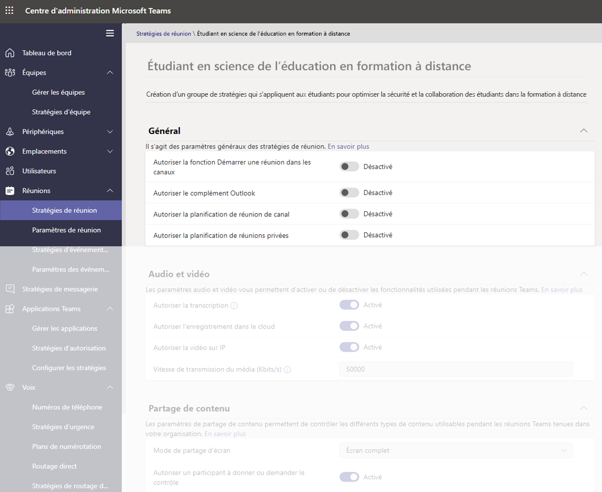

- Dans la même page, dans la section Participants et invités dans la réunion : **Autoriser la conférence maintenant dans les réunions privées** : Désactivé

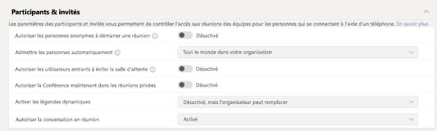

#### Contrôler si les étudiants peuvent ou non partager leurs vidéos pendant les appels et les réunions

Dans la section Stratégies de réunion, assurez-vous que les valeurs audio et visuelles que vous configurez pour vos étudiants correspondent aux instructions de votre établissement d’enseignement, ainsi qu’aux étudiants, enseignants parents et tuteurs (à l’exception de l’option **Autoriser l’enregistrement dans le cloud**, que nous recommandons de définir sur **Désactivé**).

Options disponibles ici :

- **Autoriser la transcription** : Désactivé/Activé
- **Autoriser l’enregistrement dans le cloud** : **Désactivé**
- **Autoriser la vidéo sur IP** : Désactivé/Activé

:::image type="content" source="media/edu-policy-list-b.png" alt-text="Page Étudiant en sciences de l’éducation en formation à distance avec les options vidéo affichées.":::

### Stratégies d’événements en direct

#### Désactiver la fonction de création et de démarrage d’événements en direct

Pour vous assurer que les étudiants ne peuvent pas planifier d’événements en temps réel pour communiquer sans assistance, désactivez la stratégie **Autoriser la planification** pour les étudiants en attribuant la valeur **Désactivé**.

:::image type="content" source="media/edu-allow-scheduling-off.png" alt-text="Page Étudiant en sciences de l’éducation en formation à distance avec l’option Autoriser la planification désactivée.":::

### Stratégies d’appel

#### Désactiver la possibilité de passer des appels privés

Pour vous assurer que les étudiants ne peuvent pas passer d’appels privés avec d’autres étudiants ou enseignants, désactivez la stratégie **Passer des appels privés** pour les étudiants en la définissant sur **Désactivé**.

:::image type="content" source="media/edu-private-calls-off.png" alt-text="Page Étudiant en sciences de l’éducation en formation à distance avec l’option Passer des appels privés désactivée.":::

### Stratégies de messagerie

#### Désactiver la possibilité de supprimer ou de modifier les messages envoyés

- Pour les étudiants : pour que les messages envoyés par les étudiants ne soient pas supprimés ou endommagés, les paramètres des étudiants doivent être **désactivés** :
  - **Supprimer des messages envoyés**
  - **Modifier des messages envoyés**
- Pour les enseignants : pour que les enseignants puissent modérer ou supprimer les messages inappropriés envoyés par les étudiants, les enseignants doivent avoir **activé** ces paramètres :
  - **Les propriétaires peuvent supprimer les messages envoyés** (ce paramètre permet aux enseignants de supprimer les messages inappropriés d’étudiants).
  - **Supprimer des messages envoyés**
  - **Modifier des messages envoyés**

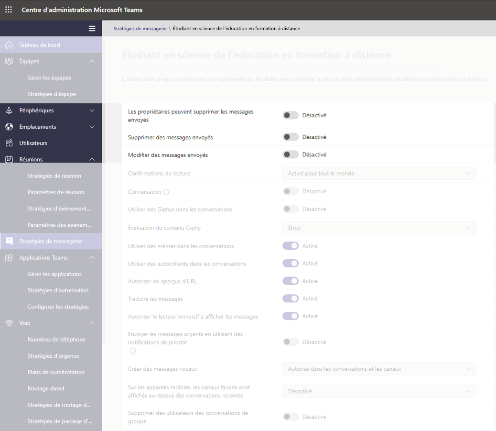

> [!NOTE]
> Pour plus d’informations à ce sujet, consultez la section sur la [désactivation des commentaires des étudiants dans une équipe de classe.](https://support.office.com/article/Mute-student-comments-in-a-class-team-a378de16-ffc0-420c-b08d-e17ec08e7c17).

#### Vérifier si les étudiants peuvent discuter en privé

Assurez-vous que la valeur **Conversation activée/désactivée** définie pour les étudiants s’adapte aux instructions de votre établissement d’enseignement, ainsi qu’aux désirs des étudiants et des enseignants. Ce contrôle permet d’activer ou de désactiver la possibilité pour un utilisateur de communiquer en privé au cours d’une conversation 1:1 ou d’une conversation de groupe dans Teams.

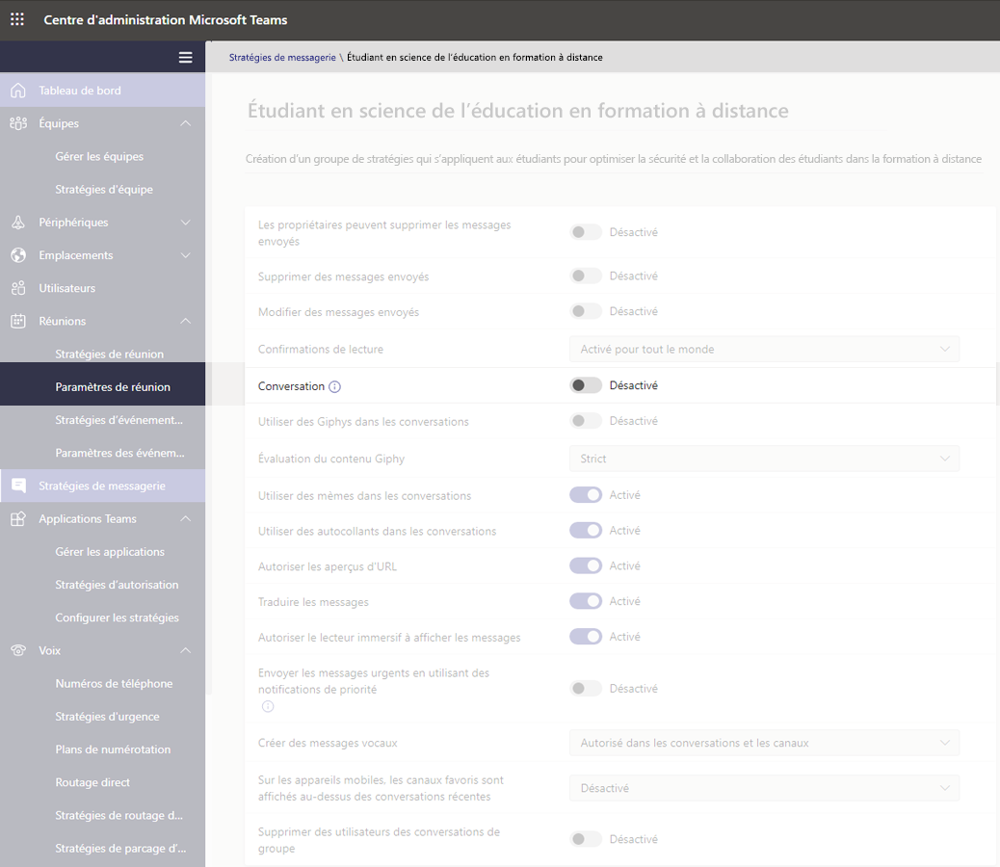

#### Contrôler si les étudiants peuvent personnaliser leurs messages

Assurez-vous que la valeur définie pour les étudiants s’adapte aux instructions de votre établissement d’enseignement, ainsi qu’aux désirs des étudiants, des enseignants, des parents et des tuteurs. Nous vous recommandons de définir **Giphy pour les étudiants** sur **Désactivé** et de laisser **Autocollants et mèmes** **activé**.

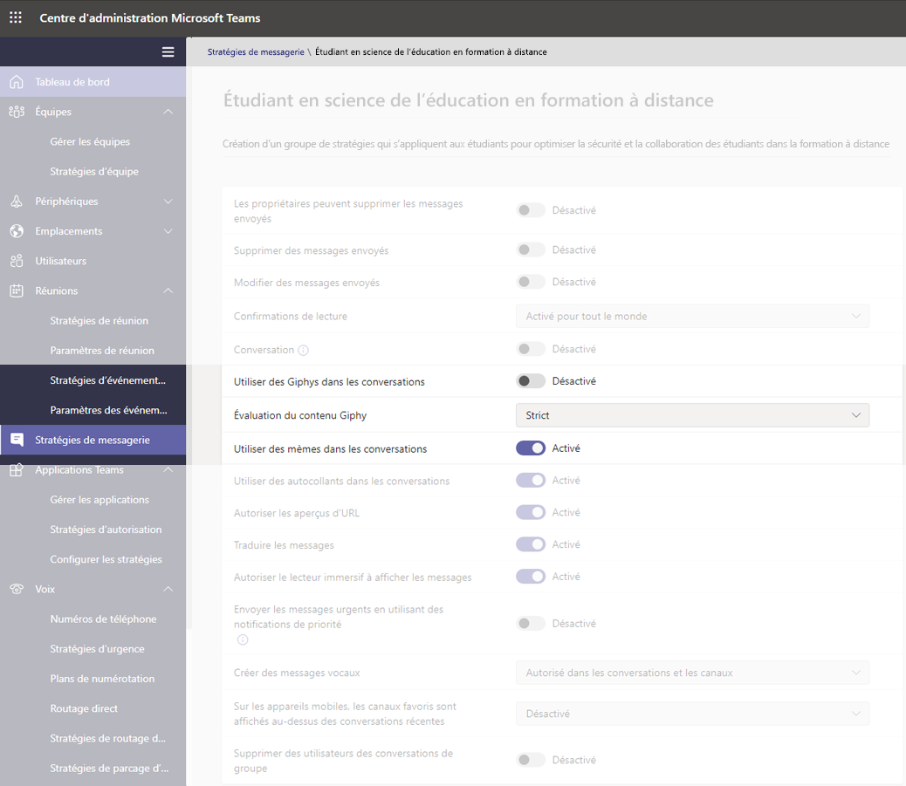

#### Contrôler si les étudiants peuvent envoyer des messages vocaux

Assurez-vous que la valeur définie pour **Créer des messages vocaux** pour les étudiants s’adapte aux instructions de votre établissement d’enseignement, ainsi qu’aux désirs des étudiants et des enseignants.

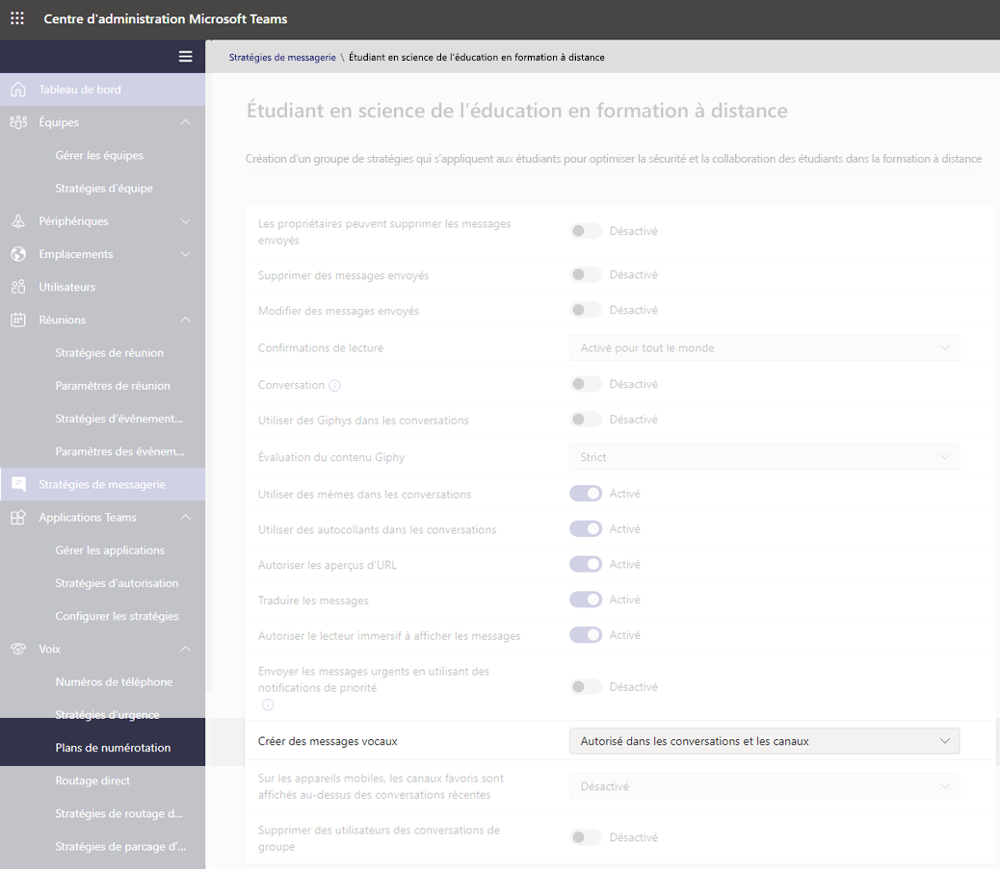

#### Désactiver la possibilité de supprimer des utilisateurs de la conversation pour les étudiants

Les étudiants ne doivent pas avoir la possibilité de supprimer d’autres utilisateurs des conversations dans lesquelles ils sont inclus. Le paramètre de **Supprimer des utilisateurs des conversations de groupe** doit être défini sur **Désactivé**.

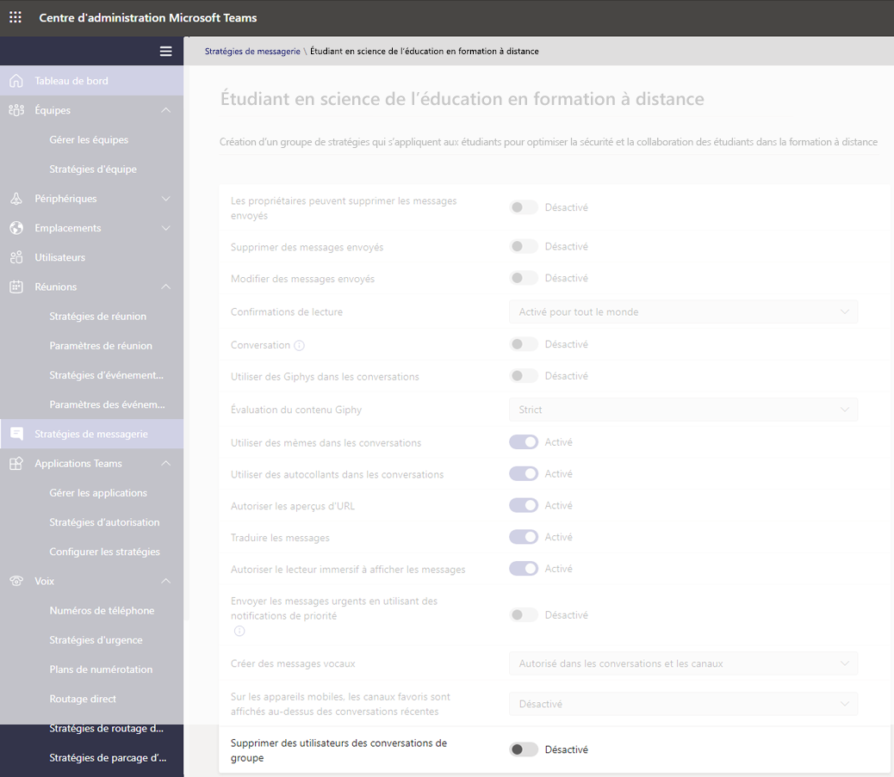

### Stratégies Teams

#### Désactiver la possibilité de détecter et de créer des canaux privés

Pour vous assurer que les étudiants ne peuvent pas créer de canal privé comme espace personnel pour communiquer sans supervision, définissez la stratégie **Créer des canaux privés** pour permettre aux étudiants sur **Désactiver**.

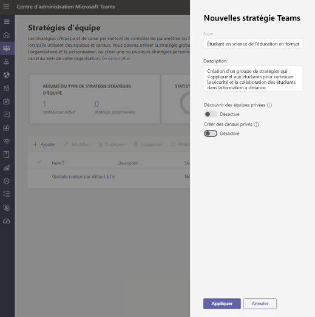

> [!IMPORTANT]
> Vous souhaiterez également veiller à ce que les étudiants ne puissent pas créer d’équipes dans Microsoft Teams. Il s’agit en fait d’un paramètre de groupes M365, et vous pouvez en savoir plus à ce sujet [ici](https://docs.microsoft.com/microsoft-365/admin/create-groups/manage-creation-of-groups).

### Stratégies d’autorisation d’application

#### Contrôler si les étudiants peuvent ajouter des applications au sein de Teams

Assurez-vous que les valeurs définies pour les étudiants correspondent aux instructions de votre établissement d’enseignement. Par exemple, si vous voulez que les étudiants soient exposés aux applications que vous approuvez, vous pouvez sélectionner les éléments suivants :

- **Applications Microsoft** : **Autoriser toutes les applications**
- **Pour les applications tierces** : **Autoriser des applications spécifiques et bloquer toutes les autres**
- **Pour les applications clientes** : **Autoriser des applications spécifiques et bloquer toutes les autres**

:::image type="content" source="media/edu-policies-apps.png" alt-text="Page Étudiant en sciences de l’éducation en formation à distance avec les options de stratégies d’application définies.":::

> [!NOTE]
> Il s’agit d’un exemple et, comme indiqué ci-dessus, vous devez définir ces stratégies conformément aux directives de votre établissement d’enseignement.

## Stratégies à attribuer pour la sécurité des enseignants

Il s’agit de paramètres de stratégie recommandés que les administrateurs doivent appliquer aux enseignants pour offrir une expérience de classe sécurisée à leurs étudiants.

> [!NOTE]
> Les recommandations de stratégie pour les étudiants contiennent plus d’informations que les sections des enseignants mentionnées ci-dessous. Bien que vous puissiez définir les paramètres de stratégie conformément aux stratégies et procédures de votre établissement d’enseignement, les recommandations fournies ici concernent particulièrement la sûreté et la sécurité des étudiants.

### Stratégies de réunion

Ces paramètres permettront aux enseignants de contrôler l’accès à leurs réunions.

- **Autoriser les personnes anonymes à démarrer une réunion** : **Désactivé**
- **Admettre automatiquement les personnes** : **Tous les membres de votre organisation**
- **Autoriser les utilisateurs de l'accès à distance à passer outre la salle d’attente** : **Désactivé**
- 1**DesignatedPresenterRoleMode**: **OrganizerOnlyUserOverride**

1 Ce paramètre ne figure pas dans le Centre d’administration Microsoft Teams, vous devez utiliser PowerShell pour définir le paramètre **DesignatedPresenterRoleMode** à l’aide de l’applet de commande [Set-CsTeamsMeetingPolicy](https://docs.microsoft.com/powershell/module/skype/set-csteamsmeetingpolicy) ou [New-CsTeamsMeetingPolicy](https://docs.microsoft.com/powershell/module/skype/new-csteamsmeetingpolicy). Définit la valeur par défaut du paramètre **Qui peut être présente ?** dans **Options de réunion** dans Teams sur **Uniquement moi**. Avec ce paramètre, seul l’organisateur de la réunion peut être présentateur et tous les autres participants à la réunion sont désignés comme participants. Pour en savoir plus, consultez [Paramètres de stratégie de réunion : mode de rôle de présentateur désigné](meeting-policies-in-teams.md#meeting-policy-settings---designated-presenter-role-mode).

> [!NOTE]
> Pour les membres du personnel qui ne sont pas des enseignants, vous pouvez définir le paramètre sur **EveryoneUserOverride** (qui correspond au paramètre **Tout le monde** dans Teams) ou **EveryoneInCompanyUserOverride** (qui correspond au paramètre **Membres de mon organisation** dans Teams).

### Stratégies de messagerie

L’option **Les propriétaires peut supprimer les messages envoyés**définie sur **Activé** permet aux enseignants de surveiller les sessions de conversation et de supprimer les messages inappropriés dans les réunions de canal.

> [!NOTE]
> Ainsi, les enseignants peuvent supprimer les messages inappropriés dans les conversations de cours lors de la création de la réunion dans le canal, ou supprimer des messages dans le canal proprement dit.

## Actions réalisables par les enseignants pour protéger les étudiants

Naturellement, alors que la définition de stratégies constitue un excellent moyen pour les administrateurs de protéger de façon proactive les étudiants dans un cadre Teams, ce sont les enseignants qui interagissent régulièrement avec les étudiants et qui ont également un rôle vital à jouer pour assurer la sécurité des étudiants. Les administrateurs peuvent envisager d’aborder les informations suivantes avec les enseignants avec lesquels ils travaillent.

### Définir des rôles lors des réunions à l’aide de vos options de réunion

Les options de réunion vous permettent de contrôler si les participants aux réunions rejoignent les vôtres en tant que participants ou présentateurs. Vous disposez des options suivantes :

- Accédez à votre **calendrier**, puis à la réunion à mettre à jour. Cliquez ou appuyez sur **Options de la réunion** près du lien de participation à la réunion pour ouvrir les **options de la réunion**.

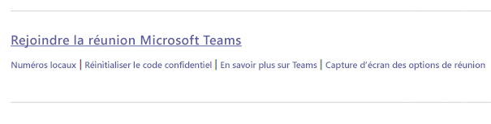

- Déterminez qui peut entrer directement dans la réunion avec l’option **Qui peut éviter la salle d’attente**. Définissez-la sur **Membres de mon organisation** pour empêcher les utilisateurs externes d’entrer, puis définissez **Toujours laisser les appelants contourner la salle d’attente** sur **Désactivé** pour que les participants attendent d’être admis à la réunion au lieu d’y accéder immédiatement. Vous pouvez également **annoncer lorsque les appelants rejoignent ou quittent la réunion**. Cette option doit être définie sur **Activé** pour que vous sachiez qui participe à la réunion.
- Contrôler qui rejoint la réunion en tant que présentateur ou participant. Vous pouvez sélectionner **Moi seul** pour désigner tous les autres participants en tant que simples participants. Il s’agit de la configuration la plus sûre pour les réunions tenues dans une salle de classe.
  - Si vous envisagez d’avoir plusieurs présentateurs dans votre réunion, sélectionnez **Personnes spécifiques** puis sélectionnez les autres participants qui doivent participer en tant que présentateurs. Sélectionnez **Tout le monde** si vous souhaitez que tous les participants rejoignent la réunion en tant que présentateurs.

:::image type="content" source="media/edu-meeting-options.png" alt-text="Liste déroulante Qui peut contourner la salle d’attente avec l’option Membres de mon organisation sélectionnée et liste déroulante Qui peut présenter avec l’option Moi seul sélectionnée.":::

### Rôles dans une réunion en ligne

Un rôle est attribué à chaque participant à une réunion en tant que présentateur ou simple participant. Le rôle d’un participant détermine ce qu’il peut faire pendant une réunion. Consultez le tableau ci-dessous.

|Fonctionnalités  |Organisateur/présentateur  |Simple participant  |
|---------|---------|---------|
|Parler et partager des vidéos     |     v     |     v     |
|Participer à une conversation de réunion     |     O     |     v     |
|Afficher en privé un fichier PowerPoint partagé par une autre personne     |     v     |     v     |
|Partager le contenu     |     v     |     N     |
|Désactiver le son des participants|     v     |     N     |
|Supprimer des participants      |     v     |     N     |
|Admettre des participants de la salle d’attente|     v     |     N     |
|Modifier les rôles d’autres participants     |     v     |     N     |
|Démarrer ou arrêter l’enregistrement     |     v     |     N     |

### Modifier des notes pendant une réunion

Un rôle est attribué à chaque participant à une réunion en tant que présentateur ou simple participant. Le rôle d’un participant détermine ce qu’il peut faire lors d’une réunion.

- Pour modifier le rôle d’un participant, cliquez ou appuyez sur **Afficher les participants** dans vos contrôles d’appel. Cliquez avec le bouton droit sur le participant dont le rôle doit être modifié, puis sélectionnez **Activer comme participant** ou **Activer comme présentateur**.

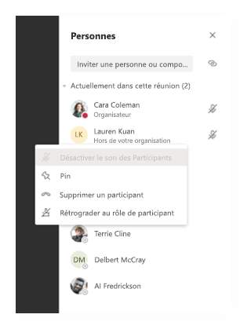

- Pour accéder rapidement aux options de votre réunion et modifier les paramètres de rôle de la réunion pour les participants actuels et les personnes qui rejoignent votre réunion à l’avenir, cliquez ou appuyez sur **Autres actions** dans vos contrôles d’appel, puis sur **Afficher les détails de la réunion**. Vous trouverez le lien vers vos **options de réunion** près du lien de participation à la réunion.

:::image type="content" source="media/edu-meeting-details.png" alt-text="Fenêtre Réunion avec le volet Détails de la réunion sur le côté droit.":::

### Désactiver les commentaires des étudiants

Après la réunion, vous pouvez empêcher des étudiants d’ajouter d’autres commentaires si vous avez programmé une réunion de canal.

#### Pour une réunion spécifique

Lorsque vous planifiez une réunion dans un canal, la réunion proprement dite est une publication de canal et les conversations de réunion sont des réplicas de cette publication. En tant que propriétaire de l’équipe, vous pouvez cliquer ou appuyer sur **Autres actions** pour ce billet. Cliquez sur **Modifier**.

:::image type="content" source="media/edu-meeting-edit.png" alt-text="Sélectionner Plus d’options dans une publication de canal et voir l’option de menu Modifier comme deuxième option du menu contextuel.":::

Dans le volet Modifier, vous disposez d’une option de liste déroulante. Vous pouvez alors sélectionner **Vous et les modérateurs peuvent répondre**.

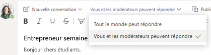

### Pour toutes les réunions et publications d’une équipe

Vous pouvez contrôler quand les étudiants peuvent publier des messages et y répondre dans l’équipe de classe et des conversations de réunion. Cliquez ou appuyez sur l’option **Autres actions** de l’équipe, cliquez sur **Gérer l’équipe**, accédez à **Membres**, puis sélectionnez des utilisateurs dont le micro doit être désactivé ou **Désactiver le micro de tous les étudiants**.

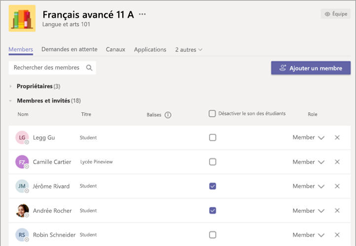

## Lectures supplémentaires

Consultez la section [Garantir la sécurité des étudiants lors de l’utilisation de réunions dans Teams pour une formation à distance](https://support.office.com/article/keeping-students-safe-while-using-meetings-in-teams-for-distance-learning-f00fa399-0473-4d31-ab72-644c137e11c8) pour plus d’informations sur la protection des étudiants.
