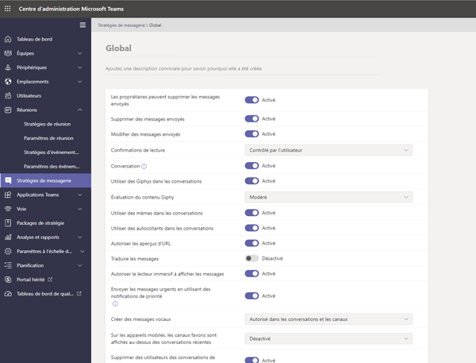
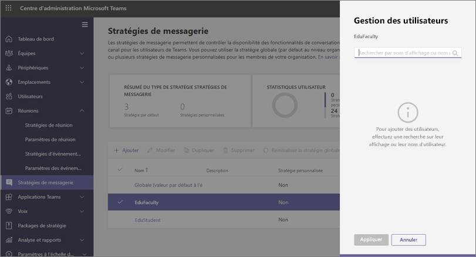
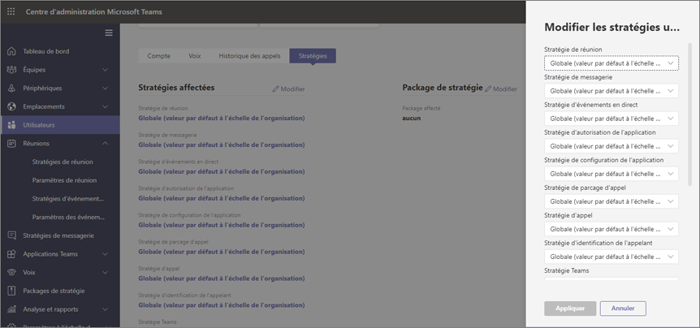

# Stratégies et packages de stratégies Teams pour l’éducation

[!INCLUDE [policy-wizard-edu](includes/policy-wizard-edu.md)]

> [!NOTE]
> Pour plus d’informations sur les stratégies dans Microsoft Teams, voir [Attribuer des stratégies à vos utilisateurs dans Microsoft Teams](assign-policies.md).

## Administrateurs : prise en main de la gestion de stratégie Microsoft Teams

Microsoft Teams permet aux utilisateurs de faire des choses comme participer à des réunions en ligne ou des événements en direct, une conversation, effectuer des appels et utiliser des applications. La définition des bonnes stratégies d’administration Microsoft Teams est une étape essentielle pour s’assurer  que Teams est un environnement d’apprentissage sûr pour les étudiants. En tant qu’administrateur, vous pouvez utiliser des stratégies pour contrôler les fonctionnalités Teams mises à la disposition des utilisateurs de votre établissement d’enseignement. Dans la plupart des cas, les stratégies doivent être adaptées aux étudiants et aux enseignants pour conserver la sécurité de l’environnement.  

Voici la liste des domaines de stratégie principaux disponibles dans Microsoft Teams. Pour en savoir plus sur les stratégies de chaque domaine et les fonctionnalités qu’elles contrôlent, utilisez les liens ci-dessous:

- [Réunions](meeting-policies-in-teams.md)
- [Événements en direct](teams-live-events/configure-teams-live-events.md)
- [Appel](teams-calling-policy.md) 
- [Messagerie](messaging-policies-in-teams.md)
- [Teams](teams-policies.md)
- [Autorisations d’application](teams-app-permission-policies.md)

:::image type="content" source="media/edu-admin-center-users.png" alt-text="Capture d’écran de l’utilisateur avec les stratégies appliquées.":::

Vous pouvez gérer toutes les stratégies Teams dans le[Centre d’administration Microsoft Teams](https://admin.teams.microsoft.com) en vous connectant avec des identifiants d’administrateur.

### Où trouver les stratégies Microsoft Teams

Une fois que vous êtes connecté au Centre d’administration Teams, vous pouvez accéder aux paramètres de stratégie pour n’importe quelle zone de Teams que vous devez gérer, en cliquant sur l’option de stratégie dans le volet de navigation gauche du Centre d’administration Teams. Nous avons inclus une capture d’écran de l’emplacement des stratégies de messagerie.

:::image type="content" source="media/edu-messaging-policies.png" alt-text="Emplacement des stratégies de messagerie dans le centre d’administration Teams.":::

### Comment créer et mettre à jour une définition de stratégie

Avant d’affecter des stratégies à vos utilisateurs, vous devez d’abord ajouter et créer vos définitions de stratégie pour chaque domaine de fonctionnalité avec Teams.

> [!NOTE]
> Nous vous recommandons de définir des définitions de stratégie différentes pour vos étudiants et enseignants.

Par défaut, la définition de stratégie globale pour chaque domaine de fonctionnalité (par défaut à l’échelle de l’organisation) est affectée à chaque nouvel utilisateur (étudiant ou enseignant). Nous vous recommandons d’utiliser l’environnement Global (à l’échelle de l’Organisation par défaut) pour votre ensemble de définitions de stratégie le plus strict. Dans la plupart des cas, cet ensemble de stratégies plus strict est plus approprié pour les étudiants. L’utilisation de la définition de stratégie Globale (à l’échelle de l’Organisation par défaut) de cette manière permet de s’assurer que les nouveaux utilisateurs ont les restrictions les plus strictes lorsqu’ils sont ajoutés à votre client. Pour adhérer à ce guide, nous vous recommandons de suivre ces étapes:

1. Créez une définition de stratégie personnalisée pour chaque domaine de fonctionnalités avec des valeurs de stratégie adaptées aux besoins de vos enseignants (sans cela, les enseignants auront le même accès restreint que vos étudiants comme défini dans la définition de stratégie globale (à l’échelle de l’Organisation par défaut)).

1. Affectez ces nouvelles définitions de stratégie personnalisée à vos enseignants.

1. Modifiez les définitions de stratégie globales (à l’échelle de l’Organisation par défaut) pour chaque domaine de fonctionnalités avec des valeurs appropriées pour vos étudiants.

1. Les définitions de stratégie globales (à l’échelle de l’Organisation par défaut) seront appliquées à vos étudiants tant que d’autres définitions de stratégie ne sont pas affectées.

Pour créer ou modifier des définitions de stratégie, accédez au domaine de fonctionnalité de la stratégie à utiliser (par exemple, stratégies de messagerie). Sélectionnez **Ajouter** pour créer une nouvelle définition de stratégie personnalisée. Pour modifier une définition de stratégie existante, sélectionnez **Modifier**.

:::image type="content" source="media/edu-messaging-policies-add-closeup.png" alt-text="Gros plan de la section des stratégies de messagerie avec affichage du bouton Ajouter.":::

Que vous choisissiez d’ajouter ou de modifier une définition de stratégie, le programme vous renvoie à une vue contenant toutes les options de stratégie associées à ce domaine de stratégie. Utilisez cette liste pour sélectionner les valeurs à définir dans votre définition de stratégie.

> [!IMPORTANT]
> N’oubliez pas de sélectionner **Enregistrer** avant de quitter la page.

### Affectation de définitions de stratégie 
Plusieurs méthodes s’offrent à vous pour attribuer des définitions de stratégie à vos utilisateurs. Chaque méthode présente ses propres avantages et inconvénients, qui varient en fonction des besoins uniques de votre établissement.  

Dans la plupart des cas, nous vous recommandons d’utiliser une affectation de stratégie de groupe pour affecter des stratégies à vos utilisateurs. Cette méthode permet une application de stratégie plus rapide et plus transparente.  Lorsqu’un utilisateur est ajouté à un groupe auquel une définition de stratégie est attribuée, le nouvel utilisateur hérite automatiquement des stratégies du groupe.  Cela permet une gestion plus facile de la stratégie lorsque de nombreux utilisateurs sont ajoutés et supprimés de l’environnement, par exemple au début et à la fin d’une durée de scolarité.  

Pour les grandes organisations, nous vous recommandons également une affectation de stratégie par lot, adaptée aux cas où vous devez affecter des stratégies à d’importants ensembles d’utilisateurs. Pour en savoir plus sur ces méthodes d’application, voir [Affecter des stratégies à d’importants ensembles d’utilisateurs de votre établissement scolaire](batch-group-policy-assignment-edu.md).

Si vous avez une institution plus petite ou si vous avez besoin de mettre à jour les paramètres de stratégie d’un étudiant ou d’un enseignant, suivez les instructions ci-dessous.  

> [!IMPORTANT]
> Les affectations de stratégie définies au niveau de l’utilisateur individuel remplacent les stratégies de groupe qui sont attribuées à l’utilisateur. Assurez-vous d’utiliser des affectations de stratégie individuelles uniquement lorsque vous souhaitez remplacer les paramètres de stratégie de groupe. 

#### Comment attribuer une définition de stratégie à un utilisateur

> [!NOTE]
> L’attribution d’une définition de stratégie peut mettre un certain temps à se propager à tous les utilisateurs et clients. Vous devrez sans doute effectuer cette opération lorsque les comptes d’utilisateur seront créés pour la première fois dans Azure/M365, et chaque fois qu’un nouvel étudiant rejoindra l’établissement d’enseignement.

Une fois votre définition de stratégie créée ou mise à jour, vous pouvez l’attribuer à un utilisateur en sélectionnant **Gérer les utilisateurs** sur la page de stratégie, en recherchant l’utilisateur souhaité, puis en appliquant la stratégie.

Vous pouvez également attribuer une stratégie à un utilisateur en accédant à **Utilisateurs**, en sélectionnant l’utilisateur pour lequel vous voulez mettre à jour les stratégies, en sélectionnant **Stratégies**, puis **Modifier**. À partir de là, vous pouvez sélectionner la définition de stratégie à attribuer à l’utilisateur pour chaque domaine de fonctionnalité.

### Packages de stratégie dans Microsoft Teams
> [!NOTE]
> Pour en savoir plus, vous pouvez consulter [Gérer les packages de stratégie dans Microsoft Teams](manage-policy-packages.md) et obtenir ainsi des instructions détaillées sur l’attribution d’un package à des utilisateurs individuels, l’attribution de packages en bloc à 5000 utilisateurs, ainsi que la gestion et la mise à jour des stratégies liées à chaque package.

Un package de stratégie dans Teams recueille les stratégies prédéfinies et paramètres de stratégie que vous avez étudiés ci-dessus et les attribue aux utilisateurs ayant des rôles similaires dans votre établissement. Les packages de stratégie simplifient, rationalisent et garantissent la cohérence lors de la gestion des stratégies. Normalement, vous devez attribuer un package de stratégie à chacun de vos utilisateurs et redéfinir les stratégies de chaque package selon vos besoins afin de répondre aux besoins de ce groupe d’utilisateurs. Lorsque vous mettez à jour les paramètres d’un package, tous les utilisateurs affectés à ce package sont modifiés lors d’une mise à jour en bloc.

Les établissements d’enseignement en général ont de nombreux utilisateurs ayant des besoins uniques, en fonction de l’âge et de la maturité des étudiants. Par exemple, vous souhaiterez sans doute accorder aux enseignants et au personnel l’accès complet à Microsoft Teams, mais limiter les fonctionnalités de Microsoft Teams pour permettre aux étudiants d’encourager l’environnement d’apprentissage en toute sécurité. Vous pouvez utiliser les packages de stratégie pour personnaliser les paramètres en fonction des besoins des différentes cohortes de la communauté de l’établissement d’enseignement.

> [!IMPORTANT] 
> Notre recommandation principale est d’utiliser la définition de stratégie Globale (à l’échelle de l’Organisation par défaut) pour les étudiants au lieu d’un package de stratégie. Ainsi, les nouveaux utilisateurs au sein de votre organisation disposent toujours de l’ensemble de stratégies le plus strict approprié aux étudiants. Si cette recommandation ne répond pas aux besoins de votre établissement, l’un des packages de stratégie étudiant ci-dessous peut être une bonne alternative. 

À l’instar de la liste de stratégies susmentionnée dans cet article, les packages de stratégie prédéfinissent les stratégies suivantes pour ce qui suit :

- Réunions
- Événements en direct
- Appel
- Messagerie
- Autorisations d’application

Microsoft Teams inclut actuellement les packages de stratégie suivants :

|Nom du package répertorié dans le Centre d’administration Microsoft Teams |Idéal pour  |Description |
|:--- |:--- |:--- |
|**Education_Teacher**| Enseignants et personnel| Utilisez cet ensemble de stratégies et de paramètres de stratégie pour accorder aux enseignants et au personnel au sein de votre organisation l’accès complet aux conversations, aux appels et aux réunions via Microsoft Teams. |
|**Education_PrimaryStudent**| Élèves en âge de fréquenter l’école primaire  | Les élèves plus jeunes en âge de fréquenter l’école primaire de votre établissement auront sans doute besoin de limites supplémentaires au sein de Microsoft Teams. Utilisez cet ensemble de stratégies et de paramètres de stratégie pour limiter les fonctionnalités telles que la création et la gestion des réunions, la gestion des conversations et les appels privés. |
|**Education_SecondaryStudent**| Élèves en âge de fréquenter l’école secondaire | Les élèves en âge de fréquenter l’école secondaire de votre établissement auront sans doute besoin de limites supplémentaires au sein de Microsoft Teams. Utilisez cet ensemble de stratégies et de paramètres de stratégie pour limiter les fonctionnalités telles que la création et la gestion des réunions, la gestion des conversations et les appels privés. |
|**Education_HigherEducationStudent**| Étudiants de l’enseignement supérieur | Les étudiants de l’enseignement supérieur au sein de votre institution auront sans doute besoin de limites moins importantes que les plus jeunes, mais certaines limitations peuvent être recommandées. Vous pouvez utiliser cet ensemble de stratégies et de paramètres de stratégie pour accorder l’accès aux conversations, aux appels et aux réunions au sein de votre organisation, mais limiter l’utilisation de Microsoft Teams par vos étudiants avec des participants externes. |
|**Education_PrimaryTeacher_RemoteLearning**| Enseignants et personnel | Création d’un groupe de stratégies qui s’appliquent aux enseignants du primaire pour optimiser la sécurité et la collaboration des étudiants lors de l’utilisation de l’apprentissage à distance. |
|**Education_PrimaryStudent_RemoteLearning**| Élèves en âge de fréquenter l’école primaire| Création d’un groupe de stratégies qui s’appliquent aux étudiants du primaire pour optimiser la sécurité et la collaboration des étudiants lors de l’utilisation de l’apprentissage à distance.
|||

:::image type="content" source="media/edu-policy-packages-list.png" alt-text="Page Packages de stratégie contenant la liste des packages de stratégie à choisir.":::

Chaque stratégie individuelle reçoit le nom du package de stratégie afin de vous permettre d’identifier les stratégies liées à un package de stratégie. Par exemple, lorsque vous affectez le package de stratégie Education_Teacher aux enseignants de votre établissement, une stratégie nommée Education_Teacher est créée pour chaque stratégie dans le package.

> [!NOTE]
> Si vous décidez que les enseignants et le personnel de support administratif ont besoin de stratégies différentes, vous pouvez réaffecter un package existant : identifiez un package que vous n’utilisez pas actuellement et modifiez les paramètres de sorte qu’ils soient appropriés pour ce groupe. Vous devrez sans doute retenir quel groupe possède tel ou tel package, mais c’est le seul obstacle à la réaffectation d’un package.

## Gérer vos packages de stratégie

### Afficher

Afficher les paramètres de chaque stratégie dans un package de stratégie avant d’attribuer un package. Dans le volet de navigation gauche du Centre d’administration Microsoft Teams, sélectionnez **Packages de stratégie**, sélectionnez le nom du package, puis sélectionnez le nom de la stratégie.

Déterminez si les valeurs prédéfinies conviennent à votre organisation ou si vous devez les personnaliser pour les rendre plus restrictives ou plus strictes en fonction des besoins de votre organisation.

### Personnaliser

Personnalisez les paramètres des stratégies dans le package de stratégie, le cas échéant, pour répondre aux besoins de votre organisation. Les modifications que vous apportez aux paramètres de stratégie sont automatiquement appliquées aux utilisateurs auxquels le package est attribué. Pour modifier les paramètres d’une stratégie dans un package de stratégie, dans le Centre d’administration Microsoft Teams, sélectionnez le package de stratégie, sélectionnez le nom de la stratégie que vous voulez modifier, puis sélectionnez **Modifier**.

Gardez à l’esprit que vous pouvez également modifier les paramètres des stratégies dans un package une fois que vous avez affecté le package de stratégie. Pour plus d’informations, consultez [Personnaliser des stratégies dans un package de stratégie](manage-policy-packages.md#customize-policies-in-a-policy-package). 

### Attribuer

Affecter un package de stratégie à des utilisateurs. Si une stratégie est attribuée à un utilisateur et que vous affectez une autre stratégie plus tard, l’affectation la plus récente prend la priorité.

> [!NOTE]
> Chaque utilisateur aura besoin du module complémentaire Communications avancées pour recevoir une attribution de package de stratégie personnalisée. Pour plus d’informations, consultez [Module complémentaire Communications avancées pour Microsoft Teams](/microsoftteams/teams-add-on-licensing/advanced-communications).

#### Attribuer un package de stratégie à un ou plusieurs utilisateurs

Pour attribuer un package de stratégie à un ou plusieurs utilisateurs, dans le volet de navigation gauche du Centre d’administration Microsoft Teams, accédez à **Packages de stratégie**, puis sélectionnez **Gérer les utilisateurs**.  

Pour plus d’informations, consultez la section [Attribuer un package de stratégie](manage-policy-packages.md#assign-a-policy-package).

Si une stratégie est attribuée à un utilisateur et que vous affectez une autre stratégie plus tard, l’affectation la plus récente prend la priorité.

#### Attribuer le package stratégie à un groupe

**Cette fonctionnalité est en mode privé (préversion)**

Attribution de package de stratégie aux groupes vous permet d’attribuer plusieurs stratégies à un groupe d’utilisateurs, tel qu’un groupe de sécurité ou une liste de distribution. L’affectations de stratégie est propagée aux membres du groupe en fonction de règles de priorité. Lorsque les membres sont ajoutés à un groupe ou supprimés de ceux-ci, leurs affectations de stratégie héritées sont mises à jour en conséquence. Cette méthode est recommandée pour les groupes disposant jusqu’à 50 000 utilisateurs, mais aussi pour les groupes de plus grande taille.

Pour plus d’informations, consultez la section [Attribuer un package de stratégie à un groupe](assign-policies.md#assign-a-policy-package-to-a-group).

#### Attribuer un package de stratégie à un grand ensemble (lot) d’utilisateurs

Utilisez l’attribution de package de stratégie de traitement par lots pour attribuer un package de stratégie à d’importants ensembles d’utilisateurs à la fois. L’applet de commande [New-CsBatchPolicyPackageAssignmentOperation](/powershell/module/teams/new-csbatchpolicypackageassignmentoperation) vous permet de soumettre un lot d’utilisateurs et le package de stratégie que vous voulez attribuer. Les attributions sont traitées comme une opération d’arrière-plan et un ID d’opération est généré pour chaque lot.

Un lot peut contenir jusqu’à 5 000 utilisateurs. Vous pouvez spécifier des utilisateurs à l’aide de leur ID d’objet, de leur nom d’utilisateur, de leur adresse SIP ou de leur adresse de courrier. Pour plus d’informations, consultez la section [Attribuer un package de stratégie à un lot d’utilisateurs](assign-policies.md#assign-a-policy-package-to-a-batch-of-users).

## Stratégies à attribuer pour la sécurité des étudiants

Pour plus d’informations sur les étapes à suivre pour protéger les étudiants de votre environnement, passez en revue attentivement [Protéger les étudiants lorsqu’ils utilisent Teams pour l’apprentissage à distance](https://support.office.com/article/keeping-students-safe-while-using-meetings-in-teams-for-distance-learning-f00fa399-0473-4d31-ab72-644c137e11c8).
