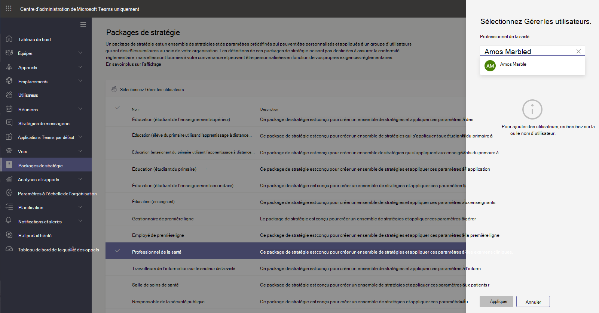

# Teams packages de stratégies pour le gouvernement

> [!NOTE]
> Les packages de stratégie ne sont actuellement pas disponibles Microsoft 365 dans les déploiements Cloud de la communauté du secteur public Administration publique en haut ou à DoD.

## Présentation

Un [package de stratégie](manage-policy-packages.md) dans Microsoft Teams est un ensemble de stratégies et de paramètres de stratégie prédéfinis que vous pouvez affecter aux utilisateurs ayant des rôles similaires dans votre organisation. Les packages de stratégie simplifient, rationalisent et garantissent la cohérence lors de la gestion des stratégies. Vous pouvez personnaliser les paramètres des stratégies dans le package en fonction des besoins de vos utilisateurs. Lorsque vous modifiez les paramètres des stratégies dans un package de stratégie, tous les utilisateurs qui sont affectés à ce package obtiennent les paramètres mis à jour. Vous pouvez gérer les packages de stratégie à l’aide du Centre d’administration Microsoft Teams ou de PowerShell.

Les packages de stratégie pré-définissent les stratégies suivantes, selon le package :

- Messagerie
- Réunions
- Appel
- Configuration de l’application
- Événements en direct

Teams inclut actuellement les packages de stratégie suivants pour le gouvernement.

|Nom du package dans le Centre d’administration Microsoft Teams|Idéal pour|Description |
|---------|---------|---------|
|Responsable de la sécurité publique  |Responsables de la sécurité publique dans votre organisation publique  |Crée un ensemble de stratégies et de paramètres de stratégie qui s’appliquent aux responsables de la sécurité publique de votre organisation. |
|Gestionnaire en ligne  |Responsables en ligne au niveau de votre organisation gouvernementale |Crée un ensemble de stratégies et applique ces paramètres aux responsables en ligne de votre organisation.|
|Employé en ligne  |Employés en ligne de votre organisation gouvernementale |Crée un ensemble de stratégies et applique ces paramètres aux employés en ligne de votre organisation.|

Chaque stratégie individuelle reçoit le nom du package de stratégie afin de vous permettre d’identifier facilement les stratégies liées à un package de stratégie. Par exemple, lorsque vous affectez le package de stratégie du responsable de la sécurité publique à des utilisateurs de votre organisation, une stratégie nommée PublicSafety_Officer est créée pour chaque stratégie du package.

## Gérer vos packages de stratégie

### Afficher

Afficher les paramètres de chaque stratégie dans un package de stratégie avant d’attribuer un package. Dans le volet de navigation gauche du Centre d’administration Microsoft Teams, sélectionnez **Packages de stratégie**, sélectionnez le nom du package, puis sélectionnez le nom de la stratégie.

Déterminez si les valeurs prédéfinies conviennent à votre organisation ou si vous devez les personnaliser pour les rendre plus restrictives ou plus strictes en fonction des besoins de votre organisation.

### Personnaliser

Personnalisez les paramètres des stratégies dans le package de stratégie, le cas échéant, pour répondre aux besoins de votre organisation. Les modifications que vous apportez aux paramètres de stratégie sont automatiquement appliquées aux utilisateurs auxquels le package est attribué. Pour modifier les paramètres d’une stratégie dans un package de stratégie, dans le Centre d’administration Microsoft Teams, sélectionnez le package de stratégie, sélectionnez le nom de la stratégie que vous voulez modifier, puis sélectionnez **Modifier**.

Gardez à l’esprit que vous pouvez également modifier les paramètres des stratégies dans un package une fois que vous avez affecté le package de stratégie. Pour plus d’informations, consultez [Personnaliser des stratégies dans un package de stratégie](manage-policy-packages.md#customize-policies-in-a-policy-package). 

### Attribuer

Affecter un package de stratégie à des utilisateurs. Si une stratégie est attribuée à un utilisateur et que vous affectez une autre stratégie plus tard, l’affectation la plus récente prend la priorité.

> [!NOTE]
> Chaque utilisateur aura besoin du module complémentaire Communications avancées pour recevoir une attribution de package de stratégie personnalisée. Pour plus d’informations, consultez [Module complémentaire Communications avancées pour Microsoft Teams](/microsoftteams/teams-add-on-licensing/advanced-communications).

#### Attribuer un package de stratégie à un ou plusieurs utilisateurs

Pour attribuer un package de stratégie à un ou plusieurs utilisateurs, dans le volet de navigation gauche du Centre d’administration Microsoft Teams, accédez à **Packages de stratégie**, puis sélectionnez **Gérer les utilisateurs**.  

Pour plus d’informations, consultez la section [Attribuer un package de stratégie](manage-policy-packages.md#assign-a-policy-package).

Si une stratégie est attribuée à un utilisateur et que vous affectez une autre stratégie plus tard, l’affectation la plus récente prend la priorité.

#### Attribuer le package stratégie à un groupe

**Cette fonctionnalité est en mode privé (préversion)**

Attribution de package de stratégie aux groupes vous permet d’attribuer plusieurs stratégies à un groupe d’utilisateurs, tel qu’un groupe de sécurité ou une liste de distribution. L’affectations de stratégie est propagée aux membres du groupe en fonction de règles de priorité. Lorsque les membres sont ajoutés à un groupe ou supprimés de ceux-ci, leurs affectations de stratégie héritées sont mises à jour en conséquence. Cette méthode est recommandée pour les groupes disposant jusqu’à 50 000 utilisateurs, mais aussi pour les groupes de plus grande taille.

Pour plus d’informations, consultez la section [Attribuer un package de stratégie à un groupe](assign-policies.md#assign-a-policy-package-to-a-group).

#### Attribuer un package de stratégie à un grand ensemble (lot) d’utilisateurs

Utilisez l’attribution de package de stratégie de traitement par lots pour attribuer un package de stratégie à d’importants ensembles d’utilisateurs à la fois. L’applet de commande [New-CsBatchPolicyPackageAssignmentOperation](/powershell/module/teams/new-csbatchpolicypackageassignmentoperation) vous permet de soumettre un lot d’utilisateurs et le package de stratégie que vous voulez attribuer. Les attributions sont traitées comme une opération d’arrière-plan et un ID d’opération est généré pour chaque lot.

Un lot peut contenir jusqu’à 5 000 utilisateurs. Vous pouvez spécifier des utilisateurs à l’aide de leur ID d’objet, de leur nom d’utilisateur, de leur adresse SIP ou de leur adresse de courrier. Pour plus d’informations, consultez la section [Attribuer un package de stratégie à un lot d’utilisateurs](assign-policies.md#assign-a-policy-package-to-a-batch-of-users).

## Rubriques connexes

[Gérer les packages de stratégie dans Teams](manage-policy-packages.md)

[Attribuer des packages de stratégies à des utilisateurs et groupes](assign-policy-packages.md)
