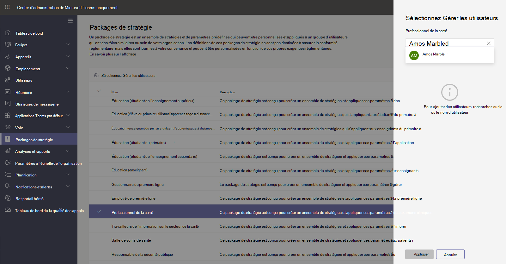

# Packages de stratégie d’équipe pour la santé

## Vue d’ensemble

Un [package de stratégie](manage-policy-packages.md) dans Microsoft teams est un ensemble de stratégies et de paramètres de stratégie prédéfinis que vous pouvez affecter aux utilisateurs ayant des rôles similaires au sein de votre organisation. Les packages de stratégie simplifient, rationalisent et garantissent la cohérence lors de la gestion des stratégies. Vous pouvez personnaliser les paramètres des stratégies du package selon les besoins de vos utilisateurs. Lorsque vous modifiez les paramètres des stratégies dans un package de stratégie, tous les utilisateurs assignés à ce package obtiennent les paramètres mis à jour. Vous pouvez gérer des packages de stratégie à l’aide du centre d’administration Microsoft teams ou de PowerShell.

Les packages de stratégie prédéfinis pour les éléments suivants, en fonction du package :

- Réunions
- Événements en direct
- Appel
- Messagerie
- Équipes
- Configuration de l’application

Teams inclut actuellement les packages de politique de santé suivants.

|Nom du package dans le centre d’administration Microsoft teams|Idéal pour|Description |
|---------|---------|---------|
|Travailleurs cliniques médicaux  |Travailleurs cliniques de votre organisation de santé  |Crée un ensemble de stratégies et de paramètres de stratégie qui permettent aux travailleurs cliniques tels que les infirmières, les infirmières, les médecins et les travailleurs sociaux d’avoir un accès complet aux discussions, aux appels, à la gestion des équipes et aux réunions. |
|Travailleurs de l’information sur la santé  |Travailleurs de l’information au sein de votre organisation de santé |Crée un ensemble de stratégies et de paramètres de stratégie qui permettent aux travailleurs de l’information, tels que le personnel informatique, le personnel informatique, le personnel financier et les responsables de la mise en conformité, un accès complet aux discussions, aux appels et aux réunions.|
|Salle de santé du patient  |Appareils de salle de patient|Crée un ensemble de stratégies et de paramètres de stratégie qui s’appliquent aux salles de soins de votre organisation.|

Chaque stratégie individuelle dispose du nom du package de stratégie, ce qui vous permet d’identifier facilement les stratégies liées à un package de stratégie. Par exemple, lorsque vous attribuez le package de stratégie de travailleur clinique de santé aux médecins au sein de votre organisation, une stratégie nommée Healthcare_ClinicalWorker est créée pour chaque stratégie dans le package.

## Gérer vos packages de stratégie

### Afficher

Affichez les paramètres de chaque stratégie d’un package de stratégie avant d’assigner un package. Dans le volet de navigation de gauche du centre d’administration de Microsoft Teams, sélectionnez **packages de stratégie**, sélectionnez le nom du package, puis sélectionnez le nom de la stratégie.

Déterminez si les valeurs prédéfinies conviennent à votre organisation, ou si vous avez besoin de les personnaliser en fonction de vos besoins en matière de votre organisation.

### Personnaliser

Personnalisez les paramètres des stratégies dans le package de stratégie, si nécessaire, pour répondre aux besoins de votre organisation. Les modifications que vous apportez aux paramètres de stratégie s’appliquent automatiquement aux utilisateurs qui ont reçu le package. Pour modifier les paramètres d’une stratégie dans un package de stratégie, dans le centre d’administration de Microsoft Teams, sélectionnez le package de stratégie, sélectionnez le nom de la stratégie que vous voulez modifier, puis sélectionnez **modifier**.

Gardez à l’esprit que vous pouvez également modifier les paramètres des stratégies d’un package après avoir affecté le package de stratégie. Pour en savoir plus, voir [personnaliser des stratégies dans un package de stratégie](manage-policy-packages.md#customize-policies-in-a-policy-package). 

### Assignation

Attribuez le package de stratégie aux utilisateurs. Pour attribuer un package de stratégie à un ou plusieurs utilisateurs, cliquez sur **gérer les utilisateurs**. Vous pouvez également utiliser PowerShell pour assigner un package de stratégie aux grands groupes d’utilisateurs. Pour connaître la procédure d’affectation d’un package de stratégie, voir [affecter un package de stratégie](manage-policy-packages.md#assign-a-policy-package).

Si une stratégie est affectée à un utilisateur et que vous affectez une autre stratégie, l’affectation la plus récente est prioritaire.

## Voir aussi

[Gérer les packages de stratégie dans Teams](manage-policy-packages.md)

[Attribuer des stratégies à vos utilisateurs dans teams](assign-policies.md)
