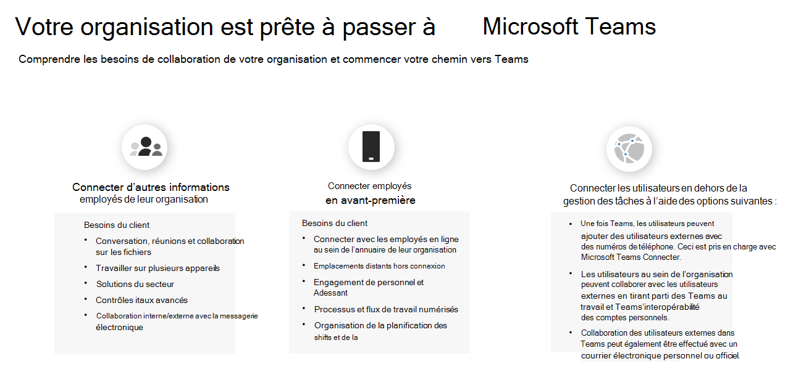

# Graphique de votre Kaizala à Teams parcours

Vous avez décidé de passer de Kaizala à Microsoft Teams.

Avant de commencer, il est important de répondre à ces deux questions :

- Quels groupes d’utilisateurs seront déplacés vers Teams ?  

- Quel est votre chemin d’accès à Teams ?

## Identifier les groupes d’utilisateurs

*Quels groupes existent dans votre organisation ? Qui utiliserez Teams et comment ? Quels sont les besoins de ces groupes pour un travail d’équipe efficace ?* Pour commencer votre parcours vers Teams, identifiez d’abord **les groupes d’utilisateurs pour votre transition.**  Les groupes d’utilisateurs sont un ensemble d’employés au sein de votre personnel qui effectuent des travaux dans des domaines similaires de l’entreprise. 

Nous avons identifié trois groupes d’utilisateurs courants pour vous aider à identifier les besoins de collaboration. Chaque groupe d’utilisateurs a ses propres besoins uniques en termes de communication. 

 1. **Les travailleurs de l’information** sont des employés qui créent, utilisent, transforment, consomment ou gèrent des informations au cours de leur travail.

 2. **Les travailleurs de première ligne** sont principalement des travailleurs sans bureau dont la fonction principale est de travailler directement avec les clients ou le grand public en fournissant des services, un support et la vente de produits, ou sont directement impliqués dans la fabrication de produits/services.

 3. **Les utilisateurs externes** sont des personnes extérieures à votre organisation, telles que vos fournisseurs, fournisseurs, partenaires commerciaux, clients ou clients.

Les utilisateurs qui communiquent avec d’autres travailleurs de l’information dans leur main-d’œuvre ont besoin des éléments nécessaires :

- Conversation, réunion, collaboration de fichiers

- Travailler sur plusieurs appareils

- Solutions de l’industrie

- Contrôles informatiques avancés
  
- Collaboration interne et externe avec l’e-mail

Les utilisateurs qui se connectent à la main-d’œuvre de première ligne ont besoin des éléments nécessaires :

- Connexion avec les employés de première ligne dans l’annuaire de leur organisation

- Emplacements distants hors connexion

- Engagement et sensibilisation de la main-d’œuvre

- Processus et flux de travail numérisés

- Décale la planification et la gestion des tâches

Les utilisateurs qui se connectent avec des utilisateurs externes (fournisseurs/fournisseurs) peuvent utiliser :

- [Microsoft Teams utilisateurs peuvent discuter avec n’importe quel Teams utilisateurs qui sont en dehors de leur organisation](https://techcommunity.microsoft.com/t5/microsoft-teams-blog/microsoft-teams-users-can-now-chat-with-any-teams-user-outside/ba-p/3070832)

- [Ajouter ou inviter des personnes extérieures à votre organisation Teams à une conversation](https://support.microsoft.com/en-us/office/add-or-invite-people-outside-your-teams-org-to-a-chat-6897ab47-9f60-4db6-8b95-18599714fe57)

## Déterminer votre chemin d’accès

Après avoir vérifié les besoins de collaboration de vos groupes d’utilisateurs, vous serez en mesure de déterminer à quoi ressemblera votre chemin d’accès entre Kaizala et Teams. Chaque organisation est unique, et aucun parcours de main-d’œuvre ne sera exactement le même. Les organisations qui n’utilisent pas actuellement Teams devront prendre des décisions stratégiques supplémentaires pour assurer une transition réussie. La détermination de votre chemin d’accès vous aidera à identifier toutes les actions importantes qui doivent être effectuées pour une transition réussie.

Nous avons décrit ce que peut être le chemin d’accès en fonction de l’utilisation de votre organisation aujourd’hui :  

Pour les organisations **qui n’utilisent pas Teams** :

 1. Envisager le travail d’équipe pour votre organisation

 2. Teams pilote
  
 3. Déployer Teams
  
 4. Utiliser Kaizala et Teams
  
 5. Gérer les modifications

 6. Planifier l’adoption de Teams

 7. Déplacer votre organisation vers Teams

Pour les organisations **qui utilisent déjà Teams** :

 1. Planifier votre transition

 2. Gérer les modifications

## Étapes suivantes

[Planifier une transition réussie vers Microsoft Teams](/MicrosoftTeams/plan-your-move-kaizala)
