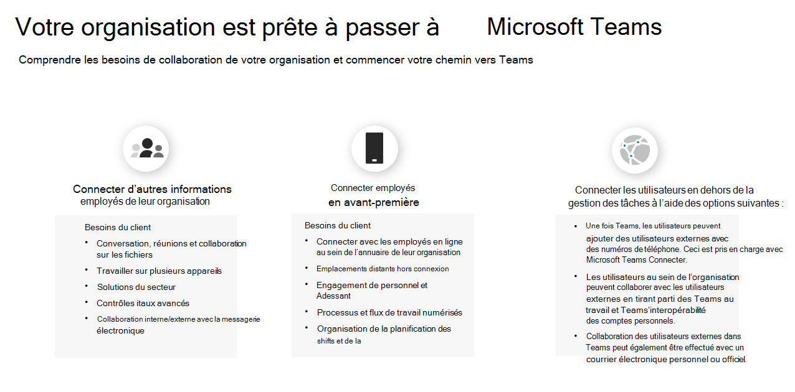

# Tracez votre voyage Kaizala vers Teams

Vous avez décidé que votre organisation est prête à passer de Kaizala à Microsoft Teams. Avant de commencer, il est important de comprendre les besoins de collaboration de votre organisation avant la transition. À quoi ressemble une communication réussie pour votre organisation ? Quelles préparations votre organisation devra-t-elle effectuer pour le déplacement ? Pour répondre à ces questions, vous devez tenir compte des groupes d'utilisateurs de votre organisation et de leurs besoins de collaboration uniques. Les besoins uniques de votre personnel déterminent le chemin que vous suivrez dans Teams.

## Identifier les groupes d'utilisateurs

*Quels groupes existent dans votre organisation ? Qui utilisera Teams et comment ? Quels besoins ces groupes nécessitent-ils pour un travail d'équipe efficace ?* Pour commencer votre parcours vers Teams, **identifiez d'abord les groupes d'utilisateurs pour votre transition.**  Les groupes d'utilisateurs sont un ensemble d'employés au sein de votre personnel qui travaillent dans des secteurs similaires de l'entreprise. 

Nous avons identifié trois groupes d'utilisateurs courants pour vous aider à identifier les besoins en collaboration. Chaque groupe d'utilisateurs a ses propres besoins en matière de communication. 

 1. **Les travailleurs de l'information** sont des employés qui créent, utilisent, transforment, utilisent ou gèrent des informations dans le cadre de leur travail.

 2. Les **employés** en contact direct avec la clientèle sont les employés dont la fonction principale est de travailler directement avec les clients ou le grand public fournissant des services, du support et des produits vendus, ou des employés directement impliqués dans la fabrication et la distribution de produits ou de services.
 
 3. **Les utilisateurs** externes sont des personnes extérieures à votre organisation, telles que vos fournisseurs, fournisseurs, partenaires commerciaux, clients ou clients. 
 
Les utilisateurs qui se connectent à d'autres travailleurs de l'information au cours de leur personnel ont besoin des :

 - Conversation, réunion, collaboration sur les fichiers
 
 - Travailler sur plusieurs appareils
 
 - Solutions du secteur
 
 - Contrôles itaux avancés
  
 - Collaboration interne et externe avec la messagerie électronique

Les utilisateurs qui se connectent avec le personnel en avant-première ont besoin des services :

 - Connexion avec les employés en contact direct au sein de l’annuaire de leur organisation
 
 - Emplacements distants hors connexion
 
 - Engagement et niveau de personnel
 
 - Processus et flux de travail numérisés
 
 - Planification des shifts et gestion des tâches

Les utilisateurs qui se connectent avec des utilisateurs externes (fournisseurs/fournisseurs) peuvent utiliser :
 - Collaboration avec l’accès invité
 
 - Fédération 

## Déterminer votre chemin d’accès

Après avoir vérifié les besoins de collaboration de vos groupes d’utilisateurs, vous pourrez déterminer le chemin d’accès de Kaizala à Teams. Chaque organisation est unique, et aucun parcours de personnel ne sera exactement le même. Les organisations qui n’utilisent pas actuellement Teams devront prendre des décisions stratégiques supplémentaires pour assurer un parcours de transition réussi. Le fait de déterminer le chemin à suivre vous permettra d’identifier les actions importantes à mettre en place pour réussir la transition.

Nous avons indiqué le chemin d’accès à suivre en fonction de l’utilisation actuelle de votre organisation :  

Pour les organisations **n'utilisant pas Teams**:

 1. Faire un travail d'équipe pour votre organisation
 
 2. Équipes pilotes
  
 3. Déployer Teams
  
 4. Utiliser Kaizala et Teams
  
 5. Gérer les changements
 
 6. Planifier votre adoption de Teams
 
 7. Déplacer votre organisation vers Teams

Pour les organisations **qui utilisent déjà Teams**:

 1. Planifier votre transition
 
 2. Gérer les changements
 

 
