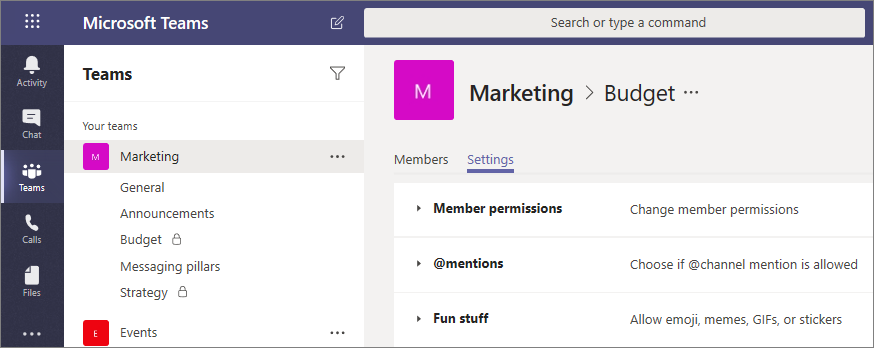

# Canaux privés dans Microsoft Teams

Les canaux privés dans Microsoft Teams créent des espaces ciblés pour la collaboration au sein de vos équipes. Seuls les utilisateurs de l’équipe qui sont propriétaires ou membres du canal privé peuvent accéder au canal. Tous les utilisateurs, notamment les invités, peuvent être ajoutés en tant que membre d’un canal privé, dès lors qu’ils sont déjà membres de l’équipe.

Vous souhaiterez peut-être utiliser un canal privé si vous voulez limiter la collaboration à ceux qui en ont besoin ou si vous souhaitez faciliter la communication entre un groupe de personnes affectées à un projet spécifique, sans avoir à créer une équipe supplémentaire à gérer.

Par exemple, un canal privé est utile dans les cas suivants :

- Certains membres d’une équipe souhaite utiliser un espace ciblé pour collaborer sans avoir à créer une équipe distincte.
- Un sous-groupe de personnes dans une équipe souhaite disposer d'un canal privé pour discuter d'informations sensibles, telles que les budgets, les ressources, le positionnement stratégique, etc.

Une icône de verrouillage indique un canal privé. Seuls les membres des canaux privés peuvent voir et participer aux canaux privés auxquels ils sont ajoutés.

Lors de la création d’un canal privé, celui-ci est lié à l’équipe parente et ne peut pas être déplacé vers une autre équipe. De plus, les canaux privés ne peuvent pas être convertis en canaux standard et vice-versa.

## Création d’un canal privé

Par défaut, tout membre ou propriétaire d’une équipe peut créer un canal privé. Les invités ne peuvent pas les créer. La possibilité de créer des canaux privés peut être gérée au niveau de l’équipe et au niveau de l’organisation. Utilisez des [stratégies](teams-policies.md) pour contrôler les utilisateurs de votre organisation autorisés à créer des canaux privés. Une fois les stratégies définies, les propriétaires d’équipe peuvent désactiver ou activer la possibilité pour les membres de créer des canaux privés dans l’onglet **Paramètres** d’une équipe.

La personne qui crée un canal privé est le propriétaire de ce canal et elle est la seule a pouvoir directement y ajouter ou en supprimer des utilisateurs. Un propriétaire de canal privé peut ajouter un membre d’équipe à un canal privé qu’il a créé, même des invités. Les membres d’un canal privé disposent d’un espace de conversation sécurisé, et lorsque de nouveaux membres sont ajoutés, ils peuvent voir toutes les conversations (y compris les anciennes) de ce canal privé.

Les propriétaires d’équipe peuvent voir le nom de tous les canaux privés dans leur équipe et peuvent également supprimer n’importe quel canal privé au sein de l’équipe. (Un canal privé supprimé peut être restauré dans un délai de 30 jours après sa suppression). Les propriétaires d’équipe ne peuvent pas voir les fichiers ou la liste des conversations et des membres d’un canal privé, sauf s’ils sont membres de ce canal privé.

Les membres de l’équipe ne peuvent voir que les canaux privés auxquels ils ont été ajoutés.

## Ajouter et supprimer des propriétaires et des membres

Un propriétaire de canal privé ne peut pas être supprimé via le client Teams s’il est le dernier propriétaire d’un ou plusieurs canaux privés.

Si un propriétaire de canal privé quitte votre organisation ou s’il est supprimé du groupe Microsoft 365 associé à l’équipe, un membre du canal privé est automatiquement promu en tant que propriétaire du canal privé.

Si un membre d’une équipe quitte ou est supprimé d’une équipe, cet utilisateur quitte ou est supprimé également de tous les canaux privés au sein de l’équipe. Si l'utilisateur est réintégré dans l'équipe, il doit être réintégré dans les canaux privés de l'équipe.

## Paramètres du propriétaire du canal

Chaque canal privé possède ses propres paramètres, notamment la possibilité d’ajouter et de supprimer des membres, d’ajouter des onglets et de @mentionner l’ensemble du canal. Ces paramètres sont indépendants de ceux de l’équipe parente. Lors de la création d’un canal privé, celui-ci hérite des paramètres de l’équipe parente. Ensuite, ses paramètres peuvent être modifiés indépendamment de ceux de l’équipe parente.

Le propriétaire du canal privé peut cliquer sur **Gérer les canaux**, puis utiliser les **Membres** et l’onglet **Paramètres** pour ajouter ou supprimer des membres et modifier les paramètres.

## Propriétaire de canal privé et actions des membres

Le tableau suivant décrit les actions que les propriétaires, les membres et les invités peuvent effectuer dans les canaux privés.

|Action  |Propriétaire d’une équipe|Membre de l’équipe|Invité de l’équipe|Propriétaire du canal privé|Membre du canal privé|Invité du canal privé|
|---------|---------|---------|---------|---------|---------|---------|
|Créer un canal privé|Contrôlée par l’administrateur|Contrôlée par l’administrateur et le propriétaire de l’équipe|Non|N/A|N/A|S/O|
|Supprimer un canal privé|Oui|Non|Non|Oui|Non|Non|
|Quitter un canal privé|S/O|N/A|S/O|Oui, à moins qu’il ne soit le dernier propriétaire|Oui|Oui|
|Modifier un canal privé|Non|N/A|N/A|Oui|Non|Non|
|Restaurer un canal privé supprimé|Oui|Non|Non|Oui|Non|Non|
|Ajouter des membres|Non|N/A|N/A|Oui|Non|Non|
|Modifier les paramètres|Non|N/A|N/A|Oui|Non|Non|
|Gérer les onglets et les applications|Non|N/A|S/O|Oui, les applications doivent être installées pour l’équipe|Contrôlé par le propriétaire du canal|Non|

## Gérer le cycle de vie des canaux privés

Vous pouvez consultez l’article [Gérer le cycle de vie des canaux privés dans Teams](private-channels-life-cycle-management.md) pour obtenir plus d’informations sur la gestion du cycle de vie des canaux privés au sein de votre organisation. Et notamment, comment contrôler si les utilisateurs de votre organisation peuvent créer des canaux privés, comment créer un canal privé au nom d'un propriétaire d'équipe, comment obtenir une liste de tous les messages de canaux privés à des fins d'archivage et d'audit ainsi que d'autres tâches de gestion.  

## Canal privé des sites SharePoint

Chaque canal privé possède ses propres sites SharePoint. Le site séparé vise à garantir que l’accès aux fichiers de canaux privés est limité aux seuls membres du canal privé. Ces sites sont créées avec une bibliothèque de documents par défaut, et peuvent être facilement améliorés et transformés en site complet via l’[interface de gestion de site](https://support.office.com/article/A2F2A5C2-093D-4897-8B7F-37F86D83DF04). Chaque site est créé dans la même zone géographique que le site de l’équipe parente. Ces sites légers ont un ID de modèle personnalisé, « TEAMCHANNEL#0 », pour simplifier la gestion via PowerShell et l’API Graph. 

> [!NOTE]
> Seuls les utilisateurs ayant des autorisations de propriétaire ou de membre Microsoft Teams ont accès au contenu du site de canal privé.
> Les sites SharePoint de canal privé créés après le 28 juin 2021 auront l’ID de modèle personnalisé TEAMCHANNEL#1.

Un site de canaux privés synchronise la classification des données et hérite des autorisations d’accès invité du site de l’équipe parente. L’adhésion au propriétaire du site et aux groupes de membres, est synchronisée avec l’adhésion au canal privé au sein de Teams. Les autorisations de site pour un site de canal privé ne peuvent pas être gérées indépendamment via SharePoint. 

Teams gère le cycle de vie du site SharePoint du canal privé. Si le site est supprimé en dehors de Teams, un travail d’arrière-plan restaure le site dans les quatre heures tant que le canal privé est toujours actif. Si le site est supprimé définitivement, un nouveau site est fourni pour le canal privé.

Si une équipe ou un canal privé contenant un canal privé est restauré, les sites sont également restaurés. Si un site de canal privé est restauré et dépasse le délai de suppression réversible de 30 jours, le site fonctionne alors comme un site autonome.

> [!NOTE]
> Lorsque vous créez une équipe ou un canal privé dans Microsoft Teams, un site d’équipe dans SharePoint est automatiquement créé. Pour modifier la description ou la classification du site d’équipe, accédez aux [paramètres du canal correspondant dans Microsoft Teams](https://support.microsoft.com/office/change-a-team-s-data-security-classification-in-teams-bf39798f-90d2-44fb-a750-55fa05a56f1d).
>
> En savoir plus sur la gestion [sites d’équipes connectées Microsoft Teams](/SharePoint/teams-connected-sites).

## Enregistrements de conformité des messages de canal privé

Les enregistrements pour les messages envoyés dans un canal privé sont distribués dans la boîte aux lettres de tous les membres du canal privé, plutôt que dans une boîte aux lettres de groupe. Les titres des enregistrements sont mis en forme de façon à indiquer le canal privé à partir duquel ils ont été envoyés.

Si vous souhaitez en savoir plus sur l'exécution d'une recherche eDiscovery pour les messages de canaux privés, consultez l’article [eDiscovery des canaux privés](ediscovery-investigation.md#ediscovery-of-private-channels).

## Éléments à prendre en compte concernant l’accès aux fichiers dans les canaux privés

Lorsqu'un nouveau bloc-notes OneNote est créé dans un canal privé, des utilisateurs supplémentaires peuvent toujours avoir accès au bloc-notes car le comportement est le même que le partage de l'accès à tout autre élément d'un site SharePoint de canal privé avec un utilisateur.

Si un utilisateur se voit accorder l'accès à un bloc-notes dans un canal privé via SharePoint, la suppression de l'utilisateur de l'équipe ou du canal privé ne supprimera pas l'accès de l'utilisateur au bloc-notes.

Si un bloc-notes existant est ajouté en tant qu’onglet à un canal privé, l’accès au canal privé n’est pas modifié et le bloc-notes conserve ses autorisations existantes.

## Limitations des canaux privés

Actuellement, les canaux privés prennent en charge les connecteurs et les onglets (à l’exception de Stream, Planner et Forms). Nous travaillons à la prise en charge complète des applications pour les canaux privés, y compris les extensions et les robots.

Chaque équipe peut avoir un maximum de 30 canaux privés et chaque canal privé peut avoir au maximum 250 membres. La limite des 30 canaux privés vient s’ajouter à la limite des 200 canaux standard par équipe. 

Lorsque vous créez une équipe à partir d’une équipe existante, les canaux privés de l’équipe existante ne seront pas copiés.

Pour l’instant, les notifications des canaux privés ne sont pas incluses dans les messages électroniques d’activité manqués.

Les réunions de canal ne peuvent pas être programmées.

## Sujets associés

[Présentation des équipes et des canaux dans Teams](teams-channels-overview.md)

[Présentation de Teams PowerShell](teams-powershell-overview.md)

[Utiliser l’API Microsoft Graph pour travailler avec Teams](/graph/api/resources/teams-api-overview)
