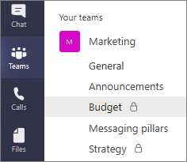

# Canaux privés dans Microsoft teamsPrivate channels in Microsoft Teams

Dans Microsoft Teams, les canaux privés créent des espaces dédiés à la collaboration au sein de vos équipes.Private channels in Microsoft Teams create focused spaces for collaboration within your teams. Seuls les utilisateurs de l’équipe qui sont propriétaires ou membres du canal privé peuvent accéder au canal.Only the users on the team who are owners or members of the private channel can access the channel. Tout le monde, y compris les invités, peut être ajouté en tant que membre d’un canal privé tant qu’il est déjà membre de l’équipe.Anyone, including guests, can be added as a member of a private channel as long as they are already members of the team.

Vous souhaiterez peut-être utiliser un canal privé si vous souhaitez limiter la collaboration aux personnes qui ont besoin de savoir si vous voulez faciliter la communication entre un groupe de personnes affectées à un projet spécifique, sans avoir à créer une équipe supplémentaire à gérer.You might want to use a private channel if you want to limit collaboration to those who have a need to know or if you want to facilitate communication between a group of people assigned to a specific project, without having to create an additional team to manage.

Par exemple, un canal privé est utile dans les cas suivants :For example, a private channel is useful in these scenarios:

- Un groupe de personnes d’une équipe souhaite disposer d’un espace ciblé pour collaborer sans avoir à créer une équipe séparée.A group of people in a team want a focused space to collaborate without having to create a separate team.
- Un sous-ensemble de personnes d’une équipe a besoin d’un canal privé pour discuter des informations sensibles, telles que les budgets, la réapprovisionnement, le positionnement stratégique, etc.A subset of people in a team want a private channel to discuss sensitive information, such as budgets, resourcing, strategic positioning, and so on.

Une icône de verrou indique un canal privé.A lock icon indicates a private channel. Seuls les membres de canaux privés peuvent afficher les canaux privés qu’ils ont ajoutés et y participer.Only members of private channels can see and participate in private channels that they are added to.

## Ce que vous devez savoir sur les canaux privésWhat you need to know about private channels

Pour l’instant, les canaux privés prennent en charge les connecteurs et les onglets (à l’exception du flux, du planificateur et des formulaires).Currently, private channels support connectors and tabs (except Stream, Planner, and Forms). Nous travaillons à la prise en charge des applications complètes pour les canaux privés, y compris les extensions de messagerie et les robots.We're working on full apps support for private channels, including messaging extensions and bots.

Chaque équipe peut avoir au maximum 30 canaux privés et chaque canal privé peut avoir au maximum 250 membres.Each team can have a maximum of 30 private channels and each private channel can have a maximum of 250 members. La limite de 30 canaux privés est en plus de la 200 canal de canal privé par équipe.The 30 private channel limit is in addition to the 200 standard channel limit per team.

> [!NOTE]
> Dans la plupart des cas, nous ajoutons des capacités aux canaux privés, vous pouvez consulter les informations les plus récentes relatives aux applications, aux réunions de canal et à la mise à l’échelle des canaux privés pour les équipes de grande envergure.We're continually adding capabilities to private channels so check back for the most up-to-date information regarding apps, channel meetings, and scaling private channels for large teams.

## Quand créer un canal privéWhen to create a private channel

Pour déterminer si un canal privé est approprié, prenez en considération les questions suivantes sur les personnes qui doivent collaborer et la collaboration.To determine whether a private channel is appropriate, consider the following questions about who needs to work together and what the collaboration is about.

|Existe-t-il déjà une équipe ayant ces personnes en tant que membres d’équipe ?Is there already a team that has these people as team members?  |Est-ce que cette tâche doit rester privée d’autres personnes ?Does this work need to be kept private from others?  |Existe-t-il plusieurs rubriques distinctes à aborder ?Are there multiple distinct topics to discuss?  |RecommandationRecommendation  |
|---------|---------|---------|---------|
|Oui Yes      |Oui Yes         |Oui Yes         |Créez un canal privé dans l’équipe existante ou envisagez de créer des canaux privés dédiés pour chaque sujet.Create a private channel in the existing team or consider creating dedicated private channels for each topic.         |
|Oui Yes     |OuiYes         |NonNo         |Créer un canal privé dans l’équipe existante.Create a private channel in the existing team.         |
|OuiYes     |NonNo         |NonNo         |Créer un canal dans l’équipe existante.Create a channel in the existing team.         |
|NonNo     |NonNo         |NonNo         |Envisagez de créer une équipe.Consider creating a new team.         |
|NonNo     |NonNo         |OuiYes         |Envisagez de créer une équipe puis, en fonction de la confidentialité de chaque sujet, envisagez de créer des canaux standard ou privés distincts pour chaque sujet.Consider creating a new team and then, depending on the confidentiality of each topic, consider creating separate standard or private channels for each topic.         |
|NonNo     |OuiYes         |NonNo         |Créer une nouvelle équipe ou créer un canal privé dans une équipe existante.Create a new team or create a new private channel in an existing team.         |

Lorsqu’un canal privé est créé, il est lié à l’équipe parente et ne peut pas être déplacé vers une autre équipe.When a private channel is created, it's linked to the parent team and can't be moved to a different team. Par ailleurs, les canaux privés ne peuvent pas être convertis en canaux standard, et inversement.Additionally, private channels can't be converted to standard channels and vice versa.

## Création et appartenance de canal privéPrivate channel creation and membership

### Qui peut créer des canaux privés ?Who can create private channels?

Par défaut, tous les propriétaires d’équipe ou membre d’équipe peuvent créer un canal privé.By default, any team owner or team member can create a private channel. Les invités ne peuvent pas les créer.Guests can't create them. La possibilité de créer des canaux privés peut être gérée au niveau de l’équipe et au niveau de l’Organisation :The ability to create private channels can be managed at the team level and at the organization level:

- Dans l’onglet **paramètres** d’une équipe, les propriétaires d’équipe peuvent désactiver ou activer la possibilité pour les membres de créer des canaux privés.On the **Settings** tab for a team, team owners can turn off or turn on the ability for members to create private channels.
- En tant qu’administrateur, vous pouvez utiliser des [stratégies](teams-policies.md) pour contrôler les utilisateurs de votre organisation qui sont autorisés à créer des canaux privés.As an admin, you can use [policies](teams-policies.md) to control which users in your organization are allowed to create private channels.

La personne qui crée un canal privé est le propriétaire du canal privé et seul le propriétaire du canal privé peut directement ajouter ou supprimer des personnes.The person who creates a private channel is the private channel owner and only the private channel owner can directly add or remove people from it. Un propriétaire de canal privé peut ajouter n’importe quel membre d’équipe à un canal privé qu’il a créé, y compris aux invités.A private channel owner can add any team member to a private channel they created, including guests. Les membres d’un canal privé disposent d’un espace de conversation sécurisé et lors de l’ajout de nouveaux membres, ils peuvent voir toutes les conversations (même les anciennes conversations) dans ce canal privé.Members of a private channel have a secure conversation space, and when new members are added, they can see all conversations (even old conversations) in that private channel.

### Que se passe-t-il lorsqu’un membre d’équipe quitte une équipe ou est supprimé de celle-ci ?What happens when a team member leaves or is removed from a team?

Si un membre d’équipe quitte une équipe ou est supprimé de celle-ci, il sera également supprimé de tous les canaux privés de l’équipe.If a team member leaves or is removed from a team, that user will also leave or be removed from all private channels in the team. Si l’utilisateur est rajouté à l’équipe, il doit être rajouté aux canaux privés de l’équipe.If the user is added back to the team, they must be added back to the private channels in the team.

### Que se passe-t-il si un propriétaire de canal privé est supprimé d’un canal privé ?What happens when a private channel owner is removed from a private channel?

Le propriétaire d’un canal privé ne peut pas être supprimé via le client teams s’il s’agit du dernier propriétaire d’un ou de plusieurs canaux privés.A private channel owner can't be removed through the Teams client if they are the last owner of one or more private channels.

Si un propriétaire de canal privé quitte votre organisation ou s’il est supprimé du groupe Office 365 associé à l’équipe, un membre du canal privé est promu automatiquement en tant que propriétaire de canal privé.If a private channel owner leaves your organization or if they are removed from the Office 365 group associated with the team, a member of the private channel is automatically promoted to be the private channel owner.

### Que peuvent voir les propriétaires d’équipe et les membres d’une équipe dans un canal privé ?What can team owners and team members see in a private channel?

Les propriétaires d’équipe peuvent afficher les noms de tous les canaux privés dans leur équipe et peuvent également supprimer un canal privé de l’équipe.Team owners can see the names of all private channels in their team and can also delete any private channel in the team. (Un canal privé supprimé peut être restauré dans les 30 jours suivant sa suppression).(A deleted private channel can be restored within 30 days after it's deleted). Les propriétaires d’équipe ne peuvent pas voir les fichiers dans un canal privé ou les conversations et la liste de membres d’un canal privé, sauf s’ils sont membres de ce canal privé.Team owners can't see the files in a private channel or the conversations and member list of a private channel unless they are members of that private channel.

Le tableau suivant indique qui peut voir ce qui se trouve dans un canal privé.The following table shows who can see what in a private channel.

|OptionItem  |Le propriétaire de l’équipe peut voirTeam owner can see |Les membres d’une équipe peuvent voirTeam members can see |
|---------|---------|---------|
|Nom et descriptionName and description    |Tous les canaux privés de l’équipeAll private channels in the team         |Uniquement les canaux privés auxquels ils sont ajoutésOnly the private channels that they are added to         |
|Conversations et ongletsConversations and tabs     |Uniquement lorsqu’elle est ajoutée au canal privéOnly when added to the private channel         |Uniquement lorsqu’elle est ajoutée au canal privéOnly when added to the private channel         |
|Fichiers et contenuFiles and content    |Uniquement lorsqu’elle est ajoutée au canal privéOnly when added to the private channel        |Uniquement lorsqu’elle est ajoutée au canal privéOnly when added to the private channel         |
|Propriétaire du canal privéPrivate channel owner    |Tous les canaux privés de l’équipeAll private channels in the team        |Uniquement lorsqu’elle est ajoutée au canal privéOnly when added to the private channel         |
|Date de la dernière activitéLast activity time stamp  |Tous les canaux privés de l’équipeAll private channels in the team       |Uniquement lorsqu’elle est ajoutée au canal privéOnly when added to the private channel         |

## Gérer les canaux privésManage private channels

Le tableau ci-après décrit les actions que les propriétaires, membres et invités peuvent faire dans les canaux privés.The following table outlines what actions owners, members, and guests can do in private channels.

|ActionAction  |Propriétaire de l’équipeTeam owner|Membre de l’équipeTeam member|Invité d’équipeTeam guest|Propriétaire du canal privéPrivate channel owner|Membre du canal privéPrivate channel member|Invité du canal privéPrivate channel guest|
|---------|---------|---------|---------|---------|---------|---------|
|Créer un canal privéCreate private channel|Oui 1Yes1|Oui, 1, 2Yes1,2|NonNo|N/AN/A|N/DN/A|N/DN/A|
|Supprimer un canal privéDelete private channel|OuiYes|NonNo|NonNo|OuiYes|NonNo|NonNo|
|Quitter un canal privéLeave private channel|N/DN/A|N/DN/A|N/DN/A|Oui3Yes3|Oui Yes|Oui Yes|
|Modifier un canal privéEdit private channel|NonNo|N/AN/A|N/DN/A|OuiYes|NonNo|NonNo|
|Restaurer un canal privé suppriméRestore deleted private channel|OuiYes|NonNo|NonNo|OuiYes|NonNo|NonNo|
|Ajouter des membresAdd members|NonNo|N/AN/A|N/DN/A|OuiYes|NonNo|NonNo|
|Modifier les paramètresEdit settings|NonNo|N/AN/A|N/DN/A|OuiYes|NonNo|NonNo|
|Gérer les onglets et les applicationsManage tabs and apps|NonNo|N/AN/A|N/AN/A|Yes4Yes4|Oui5Yes5|NonNo|

1 en supposant que vous, l’administrateur, configuré, autorise l’utilisateur à créer des canaux privés.1 Assuming the policy that you, the admin, configured allows the user to create private channels. 
2 chaque équipe dispose d’un paramètre que les propriétaires d’équipe peuvent activer ou désactiver pour autoriser les membres de l’équipe à créer des canaux privés.2 Each team has a setting that team owners can turn on or off to allow team members to create private channels. Les propriétaires d’équipe peuvent toujours créer des canaux privés.Team owners can always create private channels. 
3 en supposant que le propriétaire du canal privé n’est pas le dernier propriétaire du canal.3 Assuming the private channel owner isn't the last owner of the channel.  
4 nécessite que l’équipe dispose d’une application installée pour pouvoir l’utiliser sur un canal privé.4 Requires the team to have an app installed for a private channel to use it. 
5 les propriétaires de canal privé peuvent configurer cet affichage.5 Private channel owners can configure this.

### Gérer l’appartenance aux canaux privés et les paramètresManage private channel membership and settings

Chaque canal privé possède ses propres paramètres, y compris la possibilité d’ajouter et de supprimer des membres, d’ajouter des onglets et de @mentioning pour l’ensemble du canal.Each private channel has its own settings, including the ability to add and remove members, add tabs, and @mentioning for the entire channel. Ces paramètres sont indépendants des paramètres d’équipe parents.These settings are independent of the parent team settings. Lorsqu’un canal privé est créé, il hérite des paramètres de l’équipe parent, après quoi ses paramètres peuvent être modifiés indépendamment des paramètres de l’équipe parent.When a private channel is created, it inherits settings from the parent team, after which its settings can be changed independently of the parent team settings.

Le propriétaire du canal privé peut cliquer sur **gérer le canal**, puis utiliser les onglets **membres** et **paramètres** pour ajouter ou supprimer des membres et modifier les paramètres.The private channel owner can click **Manage channel**, and then use the **Members** and **Settings** tabs to add or remove members and edit settings.  

## Gérer le cycle de vie des canaux privésManage the life cycle of private channels

Pour obtenir des instructions sur la gestion du cycle de vie des canaux privés au sein de votre organisation, voir [gérer le cycle de vie des canaux privés dans teams](private-channels-life-cycle-management.md) .See [Manage the life cycle of private channels in Teams](private-channels-life-cycle-management.md) for guidance on how to manage the life cycle of private channels in your organization. Cela comprend comment contrôler si les utilisateurs de votre organisation peuvent créer des canaux privés, créer un canal privé pour le compte d’un propriétaire d’équipe, et obtenir la liste de tous les messages de canal privé à des fins d’archivage et d’audit, ainsi que d’autres tâches de gestion.This includes how to control whether users in your organization can create private channels, how to create a private channel on behalf of a team owner, how to get a list of all private channel messages for archiving and auditing purposes, and other management tasks.  

## Sites SharePoint de canal privéPrivate channel SharePoint sites

Chaque canal privé dispose de sa propre collection de sites SharePoint optimisée pour le partage de fichiers et la mise en service rapide.Each private channel has its own SharePoint site collection optimized for file sharing and fast provisioning. La collection de sites séparée est de garantir que l’accès aux fichiers de canal privé est limité uniquement aux membres du canal privé par rapport au site d’équipe où les propriétaires d’équipe ont accès à toutes les ressources au sein de la collection de sites.The separate site collection is to ensure access to private channel files is restricted to only members of the private channel compared to the team site where team owners have access to all the assets within the site collection. Ces collections de sites sont créées à l’aide d’une bibliothèque de documents par défaut, et peuvent être facilement améliorées dans une collection de sites complète via l' [interface de gestion de site](https://support.office.com/article/Enable-or-disable-site-collection-features-A2F2A5C2-093D-4897-8B7F-37F86D83DF04).These site collections are created with a document library by default, and can be easily enhanced to a full-featured site collection through the [site management interface](https://support.office.com/article/Enable-or-disable-site-collection-features-A2F2A5C2-093D-4897-8B7F-37F86D83DF04). Chaque collection de sites est créée dans la même zone géographique que la collection de sites de l’équipe parente.Each site collection is created in the same geographic region as the site collection of the parent team. Ces sites légers possèdent un ID de modèle personnalisé, « TEAMCHANNEL # 0 », pour faciliter la gestion via PowerShell et l’API Graph.These lightweight sites have a custom template ID, "TEAMCHANNEL#0", for easier management through PowerShell and Graph API.  Le mode de création n’est pas visible dans le centre d’administration SharePoint.By design, they aren't visible in the SharePoint admin center.

Pour prendre en charge un plus grand nombre de collections de sites par client, la limite est passée de 500 000 à 2 millions.To accommodate a greater number of site collections per tenant, the limit has increased from 500,000 to 2,000,000. Une collection de sites de canal privé synchronise la classification des données et hérite des autorisations d’accès invité de la collection de sites de l’équipe parente.A private channel site collection syncs data classification and inherits guest access permissions from the site collection of the parent team.  L’appartenance au propriétaire de la collection de sites et aux groupes de membres reste synchronisée avec l’appartenance du canal privé au sein d’Teams.Membership to the site collection owner and member groups are kept in sync with the membership of the private channel within Teams. Toute modification apportée à l’appartenance des groupes de propriétaires ou de membres dans SharePoint Online sera automatiquement enregistrée en tant qu’appartenance au canal privé dans les quatre heures.Any changes to the membership of Owner or Member groups in SharePoint Online will be reverted to private channel membership within four hours automatically. Dans les scénarios où certains utilisateurs ont besoin d’accéder à des documents sans avoir besoin d’accéder à des messages de canal privé, ajoutez-les au groupe visiteurs sur le site ou à un nouveau groupe qui est différent des propriétaires et des membres.In scenarios where certain users need to access documents without needing to access private channel messages, add them to the Visitors group on the site or to a new group that's separate from Owners and Members.

Teams gère le cycle de vie de la collection de sites SharePoint du canal privé.Teams manages the life cycle of the private channel SharePoint site collection. Si la collection de sites est supprimée en dehors de teams, un travail en arrière-plan restaure le site dans un délai de quatre heures tant que le canal privé est toujours actif.If the site collection is deleted outside of Teams, a background job restores the site within four hours as long as the private channel is still active. Si le site est supprimé et supprimé définitivement, une nouvelle collection de sites est mise en service pour le canal privé.If the site is deleted and hard-deleted, a new site collection is provisioned for the private channel.

Si un canal privé ou une équipe contenant un canal privé est restauré, les collections de sites y sont restaurées.If a private channel or a team containing a private channel is restored, the site collections are restored with it. Si une collection de sites de canal privé est restaurée et qu’elle se trouve au-delà de la fenêtre de suppression du canal privé de 30 jours, la collection de sites opère en tant que collection de sites autonome.If a private channel site collection is restored and it's beyond the 30-day soft delete window for the private channel, the site collection operates as a standalone site collection.

## Enregistrements de conformité des messages de canal privéPrivate channel message compliance records

Les enregistrements de messages envoyés dans un canal privé sont remis à la boîte aux lettres de tous les membres du canal privé plutôt qu’à une boîte aux lettres de groupe.Records for messages sent in a private channel are delivered to the mailbox of all private channel members, rather than to a group mailbox. Les titres des enregistrements sont mis en forme pour indiquer le canal privé depuis lequel ils ont été envoyés.The titles of the records are formatted to indicate which private channel they were sent from.

Pour plus d’informations sur l’exécution d’une recherche eDiscovery sur des messages de canal privé, voir [découverte électronique des canaux privés](ediscovery-investigation.md#ediscovery-of-private-channels).For more information about performing an eDiscovery search for private channel messages, see [eDiscovery of private channels](ediscovery-investigation.md#ediscovery-of-private-channels).

## Considérations relatives à l’accès dans les canaux privésConsiderations around access in private channels

Lors de la création d’un bloc-notes OneNote dans un canal privé, les utilisateurs supplémentaires peuvent toujours accéder au bloc-notes, car le comportement est identique à celui de partage d’accès à tout autre élément d’un site SharePoint de canal privé avec un utilisateur.When a new OneNote notebook is created in a private channel, additional users can still get access to the notebook because the behavior is the same as sharing access to any other item in a private channel SharePoint site with a user.

Si un utilisateur dispose d’un accès à un bloc-notes dans un canal privé par le biais de SharePoint, la suppression de l’utilisateur de l’équipe ou du canal privé ne supprime pas l’accès de l’utilisateur au bloc-notes.If a user is granted access to a notebook in a private channel through SharePoint, removing the user from the team or private channel won't remove the user's access to the notebook.

Si un bloc-notes existant est ajouté en tant qu’onglet à un canal privé, l’accès au canal privé n’est pas modifié.If an existing notebook is added as a tab to a private channel, access to the private channel isn't changed. Ce qui signifie que :This means the following:

- Par défaut, tout le monde n’a pas accès au bloc-notes.Not everyone in the private channel will have access to the notebook by default. En effet, ils ne peuvent pas avoir accès à l’emplacement de l’hébergement du bloc-notes, par exemple le site SharePoint d’un autre équipe.This is because they may not have access to where the notebook is hosted, such as another team's SharePoint site.
- Les utilisateurs qui ne sont pas membres du canal privé peuvent afficher le bloc-notes.Users who are not members of the private channel can view the notebook.  

## Voir aussiRelated topics

- [Présentation des équipes et des canaux dans Microsoft TeamsOverview of teams and channels in Teams](teams-channels-overview.md)
- [Aperçu de Teams PowerShellTeams PowerShell overview](teams-powershell-overview.md)
- [Utiliser l’API Microsoft Graph pour travailler avec des équipesUse the Microsoft Graph API to work with Teams](https://docs.microsoft.com/graph/api/resources/teams-api-overview?view=graph-rest-1.0)
