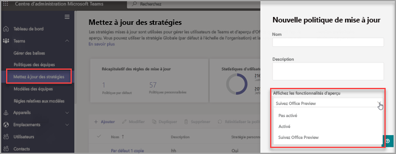

# <a name="microsoft-teams-public-preview"></a>Préversion publique de Microsoft Teams

> [!NOTE] 
> Les fonctionnalités incluses dans l’aperçu peuvent ne pas être complètes et subir des modifications avant d’être disponibles dans la version publique. Nous les proposons uniquement à des fins d’évaluation et d’exploration. Les fonctionnalités d’aperçu ne sont pas prises en charge dans Office 365 Government Community Cloud (GCC).

La préversion publique de Microsoft Teams vous permet d’accéder en avant-première aux fonctionnalités non publiées de Teams. Les préversions vous permettent d’explorer, puis de tester les fonctionnalités à venir. Nous vous invitons également à nous faire part de vos commentaires sur les fonctionnalités des préversions publiques. La préversion publique est activée pour chaque utilisateur de Teams. Vous n’avez donc pas besoin de vous soucier de l’ensemble de votre organisation.

Pour obtenir la liste de ce qui est disponible dans la préversion publique de Teams, visitez [Notes techniques de la préversion publique de Microsoft Teams](https://techcommunity.microsoft.com/t5/microsoft-teams-public-preview/bd-p/MicrosoftTeamsPublicPreview), [Notes de publication pour les fonctionnalités Microsoft Teams administrateur](/OfficeUpdates/teams-admin) et [Nouveautés dans Teams](https://support.microsoft.com/office/what-s-new-in-microsoft-teams-d7092a6d-c896-424c-b362-a472d5f105de).

## <a name="set-the-update-policy"></a>Définir la stratégie de mise à jour

Nous avons activé la préversion publique par utilisateur, et une stratégie d’administration permet de contrôler l’option d’activation de cette préversion. Les stratégies de mise à jour permettent de gérer les utilisateurs des préversions de Teams et d’Office qui auront accès aux fonctionnalités d’avant-publication ou de préversion dans l’application Teams. Vous pouvez utiliser et personnaliser la stratégie globale (par défaut à l’échelle de l’organisation), ou créer une ou plusieurs stratégies personnalisées pour vos utilisateurs.

1. Se connecter au [Centre d’administration de Microsoft Teams](https://admin.teams.microsoft.com/).

2. Sélectionnez **Teams** >  **Stratégies de mise à jour de Teams**.

1. Sélectionnez **Ajouter** pour créer une stratégie ou sélectionnez une stratégie existante pour ouvrir **Stratégie de mise à jour**.

2. Nommez la stratégie de mise à jour, ajoutez une description, puis sélectionnez le paramètre pour **Afficher les fonctionnalités en préversion**.

   -   **Suivez l'aperçu d'Office** (par défaut)
       - Cette nouvelle option par défaut activera automatiquement les fonctionnalités de l'aperçu public de Teams pour tout utilisateur inscrit à Office Current Channel ( aperçu ). 
       - Aucune autre action n’est requise de la part de l’utilisateur final.
   -   **Activé**
       - Cette option active l'aperçu public de Teams, que l'utilisateur soit inscrit ou non à Office Current Channel ( Aperçu ). 
       - L’utilisateur final peut également choisir de participer à la préversion publique de Teams dans leur application Teams.

   > [!NOTE]  
   > Pour les utilisateurs existants dans la préversion publique de Teams qui ne sont PAS dans le **Canal actuel (préversion)**, les administrateurs informatiques doivent passer de l’option par défaut **Suivre la préversion d’Office** à **Activé**.
 
   - **Non activé** 
     - Les fonctionnalités de l'aperçu public de Teams ne seront pas disponibles pour les utilisateurs finaux.

      

Vous pouvez également définir la stratégie à l’aide du cmdlet `Set-CsTeamsUpdateManagementPolicy` PowerShell avec le paramètre `-AllowPublicPreview`.

## <a name="enable-public-preview"></a>Activer la préversion publique

Pour activer la préversion publique sur un client de bureau ou web, vous devez terminer les tâches suivantes :

1. Sélectionnez les trois points à gauche de votre profil pour afficher le menu Teams.
2. Sélectionnez **À propos** > **Préversion publique**.
3. Sélectionnez **Basculer vers la préversion publique**.

> [!NOTE]  
> Cette option est uniquement disponible lorsque l’option **Afficher les fonctionnalités de préversion** est définie sur **Activé**.

### <a name="public-preview-for-microsoft-teams-rooms-on-windows"></a>Préversion publique pour Salles Microsoft Teams sur Windows

La préversion publique est désactivée par défaut. Lorsque la préversion publique est activée, les utilisateurs finaux ont accès aux fonctionnalités qui sont en préversion publique sur Salles Teams activée. Pour activer la préversion publique, ajoutez ```<EnablePublicPreview>True</EnablePublicPreview>``` à votre fichier de configuration XML.

Nous vous recommandons d’inscrire 5 à 10 appareils en préversion publique. 

Toutes les fonctionnalités de la préversion publique sont annoncées à [Microsoft Teams Préversion publique – Communauté Microsoft Tech](https://techcommunity.microsoft.com/t5/microsoft-teams-public-preview/bd-p/MicrosoftTeamsPublicPreview)

## <a name="teams-now-follows-office-preview-users"></a>Teams suit désormais les utilisateurs de la préversion d’Office

La nouvelle stratégie globale par défaut consistant à **suivre l'aperçu** d'Office permettra aux utilisateurs d'être automatiquement dans le canal Public Aperçu de Teams s'ils sont dans le canal actuel (aperçu) pour le client Office 365 sur Windows et Mac.

Microsoft Office continue de recevoir les mises à jour du Canal actuel (préversion) et le client Teams reçoit les mises à jour via le canal Préversion publique. Cette stratégie ne bascule PAS les canaux d’Office basés sur les canaux Teams. 

**Comment conserver vos utilisateurs existants de la préversion Teams qui n’utilisent PAS le Canal actuel (préversion) d’Office ?**

Pour les utilisateurs existants que vous avez autorisés à s’inscrire ou se désinscrire de la Préversion publique de Teams et si vous souhaitez maintenir ce paramètre dans sa forme actuelle, vous devez basculer de la valeur par défaut **Suivre la préversion d’Office** sur **Activé** (référez-vous à [Définir la stratégie de mise à jour](#set-the-update-policy))

**Comment de désinscrire de ce paramètre ?**

Vous pouvez désactiver le paramètre à partir du Centre d'administration Teams de **Suivre la préversion d’Office** sur **Non activé** (référez-vous à [Définir la stratégie de mise à jour](#set-the-update-policy))

## <a name="related-topics"></a>Voir aussi

[Préversion publique pour les développeurs](/microsoftteams/platform/resources/dev-preview/developer-preview-intro)
