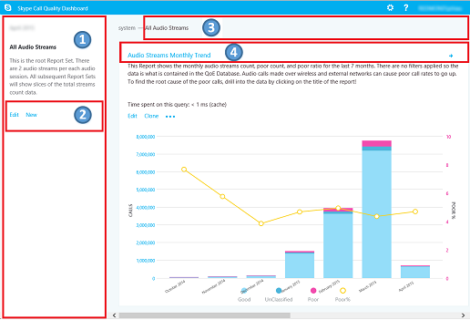

# Qualité de Guide de révision d’expérienceQuality of Experience Review Guide

Ce guide est la phase de lecteur de valeur pour Teams de Microsoft et Skype pour l’activité en ligne.This guide is about the Drive Value phase for Microsoft Teams and Skype for Business Online. Vous pouvez [télécharger une version de Word](https://github.com/MicrosoftDocs/OfficeDocs-SkypeForBusiness/blob/live/Teams/downloads/quality-of-experience-review-guide.docx?raw=true) de ce guide.You can [download a Word version](https://github.com/MicrosoftDocs/OfficeDocs-SkypeForBusiness/blob/live/Teams/downloads/quality-of-experience-review-guide.docx?raw=true) of this guide.

## IntroductionIntroduction

Pour que le plus grand impact sur l’amélioration de l’expérience utilisateur, les organisations doivent mettre les domaines clés qui sont affichés dans la figure suivante.To have the greatest impact on improving the user experience, organizations need to operationalize the key areas that are shown in the following figure.
Des zones supplémentaires incluent identifiant les tâches opérationnelles, la fixation d’objectifs pour les mesures de qualité, déterminer les mesures à utiliser pour évaluer le succès de l’organisation et restrictive des zones d’enquête en fonction des besoins.Additional areas include identifying operational tasks, establishing targets for quality metrics, ascertaining the metrics to use to gauge organizational success, and narrowing areas of investigation as needed.

_Figure 1 : clé opérationnelle vous trouverez tout au long de ce document__Figure 1 - Key operational areas covered throughout this document_

En évaluant en permanence et en corriger les zones décrites dans ce document, vous pouvez réduire leur potentiel d’impact négatif sur la qualité de l’expérience de vos utilisateurs.By continually assessing and remediating the areas described in this document, you can reduce their potential to negatively affect the quality of your users’ experience. La plupart des problèmes d’expérience utilisateur rencontré dans un déploiement peuvent être regroupées dans les catégories suivantes :Most user-experience problems encountered in a deployment can be grouped into the following categories:

-   Configuration de pare-feu ou proxy incomplèteIncomplete firewall or proxy configuration

-   Une mauvaise couverture de Wi-FiPoor Wi-Fi coverage

-   Bande passante insuffisanteInsufficient bandwidth

-   VPNVPN

-   Versions client incompatibles ou obsolètesInconsistent or outdated client versions

-   Périphériques audio non optimisées ou intégrésUnoptimized or built-in audio devices

-   Sous-réseaux problématiques ou des périphériques réseauProblematic subnets or network devices

Grâce à une planification et conception avant de déployer des équipes ou Skype pour professionnels en ligne, vous pouvez réduire le volume de travail qui est requis pour mettre à jour les expériences de haute qualité.Through proper planning and design before deploying Teams or Skype for Business Online, you can reduce the amount of effort that will be required to maintain high-quality experiences.

Ce guide se concentre sur l’utilisation en ligne du tableau de bord de qualité appeler (CQD) comme outil principal pour signaler et examinez chaque zone, avec un accent particulier sur audio afin d’optimiser l’adoption et à l’impact.This guide focuses on using the Call Quality Dashboard (CQD) Online as the primary tool to report and investigate each area, with a special emphasis on audio to maximize adoption and impact. Toute amélioration apportée au réseau afin d’améliorer l’expérience audio auront également directement des améliorations dans le partage de vidéo et de bureau.Any improvements made to the network to improve the audio experience will also directly translate to improvements in video and desktop sharing.

Pour accélérer l’évaluation, les deux modèles CQD curated sont fournies : une pour la gestion de tous les réseaux et l’autre est filtré pour (internes) les réseaux gérés uniquement.To accelerate your assessment, two curated CQD templates are provided: one for managing all networks and the other is filtered for managed (internal) networks only. Bien que les modèles de rapport de tous les réseaux sont configurés pour afficher des informations de réseau et de la construction, il peut toujours être utilisé pendant que vous travaillez à la collecte et de chargement des informations de construction.Although the All Networks template reports are configured to display building and network information, it can still be used while you work toward collecting and uploading building information. Téléchargement d’informations dans le CQD permet le service afin d’améliorer le rapport en ajoutant des informations de construction, de réseau et d’emplacement personnalisées lors de la différenciation interne de sous réseaux externes.Uploading building information into CQD enables the service to enhance reporting by adding custom building, network, and location information while differentiating internal from external subnets. Pour plus d’informations, consultez [mappage de construction](#building-mapping) plus loin dans ce document.For more information, see [Building mapping](#building-mapping) later in this document.

### En quoi consiste le CQD ?What is the CQD?

Vous utilisez le tableau de bord de qualité appeler (CQD) pour obtenir un aperçu de la qualité des appels effectués à l’aide des équipes et Skype pour les services.You use the Call Quality Dashboard (CQD) to gain insight into the quality of calls made by using Teams and Skype for Business services. CQD est conçu pour aider les Skype pour les administrateurs d’entreprise et les équipes et les ingénieurs réseau optimisent le réseau.CQD is designed to help Skype for Business and Teams admins and network engineers optimize the network. CQD examine agrègent les informations pour toute une organisation où les modèles globaux peuvent devenir apparents, autorisant le personnel à évaluer informé de la qualité des appels.CQD looks at aggregate information for an entire organization where overall patterns can become apparent, allowing staff to make informed assessments of call quality. CQD fournit des rapports de mesures d’appel qui vous donnent un aperçu de la qualité globale de l’appel, appel fiabilité et l’expérience de l’utilisateur.CQD provides reports of call metrics that give you insight into overall call quality, call reliability, and user experience.

> [!NOTE]
> CQD ne contient pas les informations d’identification personnelle (PII).CQD doesn’t contain any personally identifiable information (PII). Informations personnelles sont des informations qui peuvent être utilisées seul ou avec d’autres informations pour identifier, contacter ou localiser une seule personne, ou pour identifier un individu dans le contexte.PII is information that can be used on its own or with other information to identify, contact, or locate a single person, or to identify an individual in context. 

### Public viséIntended audience

Ce document est destiné à être utilisé par les parties prenantes des partenaires et des clients avec les rôles de Collaboration/architecte en chef, Consultant, spécialiste de gestion/Adoption de modification, entraîner de Business Desk ou l’aide de la prise en charge, câble réseau, responsable du bureau et l’administration informatique.This document is intended to be used by partner and customer stakeholders with roles such as Collaboration Lead/Architect, Consultant, Change Management/Adoption Specialist, Support/Help Desk Lead, Network Lead, Desktop Lead, and IT Admin.

Ce document est également destiné à être utilisé par les champion(s) de qualité désignés.This document is also intended to be used by the designated quality champion(s).
Pour plus d’informations, voir [le rôle de spécialiste de la qualité](https://docs.microsoft.com/MicrosoftTeams/4-envision-plan-my-service-management#the-quality-champion-role).For more information, see [the Quality Champion role](https://docs.microsoft.com/MicrosoftTeams/4-envision-plan-my-service-management#the-quality-champion-role).

## Conditions requisesPrerequisites

Avant d’utiliser ce guide, assurez-vous que vous avez le bon locataire [rôles](https://support.office.com/article/About-Office-365-admin-roles-da585eea-f576-4f55-a1e0-87090b6aaa9d) afin que vous puissiez accéder à CQD.Before using this guide, make sure you have the proper tenant [roles](https://support.office.com/article/About-Office-365-admin-roles-da585eea-f576-4f55-a1e0-87090b6aaa9d) assigned so that you can access CQD.

-   **Rôle d’administrateur Global de office 365 :** Accède à toutes les fonctionnalités d’administration de la suite Office 365 de services dans votre plan, y compris Skype pour les entreprises.**Office 365 Global Administrator role:** Accesses all administrative features in the Office 365 suite of services in your plan, including Skype for Business.

-   **Skype pour le rôle d’administrateur :** Configure les Skype pour entreprise de votre organisation et est en mesure d’afficher tous les [rapports d’activité](https://support.office.com/article/activity-reports-0d6dfb17-8582-4172-a9a9-aed798150263) dans le centre d’administration Office 365.**Skype for Business Administrator role:** Configures Skype for Business for your organization and is able to view all the [activity reports](https://support.office.com/article/activity-reports-0d6dfb17-8582-4172-a9a9-aed798150263) in the Office 365 admin center. Ce rôle est nécessaire même si vous déployez uniquement les équipes.This role is required even if you deploy only Teams.

Vous pouvez également assigner le rôle suivant à un compte d’utilisateur Office 365 pour permettre l’accès aux fonctions de génération d’états uniquement.Alternatively, you can assign the following role to an Office 365 user account to allow access to reporting features only.

-   **Signale le lecteur :** Pouvez permet d’afficher tous les [rapports d’activité](https://support.office.com/article/activity-reports-0d6dfb17-8582-4172-a9a9-aed798150263) dans le centre d’administration Office 365, tous les rapports à partir du [pack de contenu Office 365 Adoption](https://support.office.com/article/Office-365-Adoption-content-pack-77ff780d-ab19-4553-adea-09cb65ad0f1f)et les rapports CQD.**Reports Reader:** Can view all the [activity reports](https://support.office.com/article/activity-reports-0d6dfb17-8582-4172-a9a9-aed798150263) in the Office 365 admin center, any reports from the [Office 365 Adoption content pack](https://support.office.com/article/Office-365-Adoption-content-pack-77ff780d-ab19-4553-adea-09cb65ad0f1f), and CQD reports.

Comprendre les concepts clés de CQD aide à optimise l’impact que vous pouvez apporter pour améliorer l’expérience de vos utilisateurs, équipes ou Skype pour entreprise en ligne.Understanding the key concepts of CQD helps maximize the impact you can make in improving your users’ experience with Teams or Skype for Business Online.
Vous trouverez des ressources supplémentaires dans l' [annexe](#other-resources).Additional resources can be found in the [Appendix](#other-resources).

## Quelle est la qualité ?What is quality?

Lorsque vous abordez la qualité dans Skype pour les entreprises et les équipes, il est important de définir le terme pour parvenir à une compréhension commune.When discussing quality in Teams and Skype for Business, it’s important to define the term to achieve a common understanding. Qualité, telles que définies ici, est une combinaison de service métriques et l’expérience utilisateur.Quality, as defined here, is a combination of service metrics and user experience.

_Figure 2 : quelle est la qualité ?__Figure 2 - What is quality?_

### Définir les mesures de la cibleDefine your target metrics

Cette section décrit les métriques de service principaux que nous utilisons pour évaluer comment services expérience de santé.This section discusses the core service metrics that we use to assess how services experience health. En évaluant en permanence et en efforts pour conserver ces mesures ci-dessous cible de la commande, vous allez à garantir la que qualité de l’appel de façon cohérente et fiable de rencontrer vos utilisateurs.By continually assessing and driving efforts to keep these metrics below target, you’ll help ensure your users experience consistent, reliable call quality. Pour vous aider à démarrer, les objectifs suivants sont fournis.To get you started, the following targets are provided.
Examinons brièvement la différence entre un réseau managée et non managées :Let’s briefly cover the difference between a managed and unmanaged network:

-   Un réseau *géré* pouvant être influencé et contrôlé par l’organisation.A *managed* network can be influenced and controlled by the organization.
    Cela inclut le réseau local interne, le réseau étendu à distance et VPN.This includes the internal LAN, the remote WAN, and VPN.

-   Un réseau *non géré* ne peut pas être influencé ou contrôlé par l’organisation.An *unmanaged* network can’t be influenced or controlled by the organization. Un exemple d’un réseau non géré est un réseau d’hôtel ou un aéroport.An example of an unmanaged network is a hotel or airport network.

_Tableau 1 : mesures de base cible fonctionnement évaluation__Table 1 - Core target health assessment metrics_

|               | Qualité pour les réseaux gérésQuality for managed networks | Fiabilité des réseaux gérésReliability for managed networks |                      |
|---------------|------------------------------|----------------------------------|----------------------|
| Nom de mesureMetric name   | Audio faible appeler % de rapportAudio Poor Call Ratio %      | Appelez le programme d’installation % d’erreursCall Setup Failures %            | Appelez le dépôt % d’erreursCall Drop Failures % |
| Cible de l’échantillonSample target | \<3 %\<3%                         | \<1 %\<1%                             | \<4 %\<4%                 |

Il est important de discuter et de définir des cibles de votre organisation pour répondre aux objectifs de votre entreprise.It’s important to discuss and define your organization’s targets to meet your business objectives. Dans l’idéal, vous devez identifier ces cibles avant le déploiement.Ideally, you should identify these targets prior to deployment.

#### % PCR audioAudio PCR % 

Audio médiocre appeler Ratio (PCR) représente le pourcentage global de l’organisation des appels qui ont une mauvaise qualité du son.Audio Poor Call Ratio (PCR) represents the organization’s overall percentage of calls that have poor audio quality. Cette mesure vise à mettre en surbrillance les zones où votre organisation permet de vous concentrer les efforts pour que de grand impact pour réduire cette valeur et l’amélioration de l’expérience utilisateur, c’est pourquoi les réseaux gérés sont le principal objectif lors de la recherche à la PCR.This metric is meant to highlight areas where your organization can concentrate effort to have the strongest impact toward reducing this value and improving the user experience, which is why managed networks are the primary focus when looking at PCR. Les utilisateurs externes sont trop importantes, mais les enquêtes diffère sur une base d’utilisateur et d’organisation.External users are important too, but investigations differs on an organizational and user basis.
Envisagez de fournir des méthodes conseillées pour les utilisateurs externes et examiner des appels externes indépendamment de l’organisation globale.Consider providing best practices for external users, and look at external calls independently from the overall organization.

#### Appelez le programme d’installation % d’erreursCall Setup Failures % 

Il s’agit d’une session de média n’a pas pu être établie.This represents any media session that couldn’t be established. Compte tenu de la gravité de l’impact sur l’expérience utilisateur mesurée ici, l’objectif est de réduire cette valeur comme proche de zéro que possible.Given the severity of the impact on the user experience measured here, the goal is to reduce this value to as close to zero as possible. Une valeur élevée pour cette mesure est plus courante dans les déploiements de nouvelles règles de pare-feu incomplète à un déploiement évolué, mais il est toujours important de surveiller régulièrement.A high value for this metric is more common in new deployments with incomplete firewall rules than a mature deployment, but it’s still important to watch on a regular basis. Comme votre rigueur opérationnelle arrivera à échéance, vous pouvez développer cette mesure pour inclure des charges de travail vidéo et partage de bureau.As your operational rigor matures, you can expand this metric to include video and desktop-sharing workloads.

#### Appelez le dépôt % d’erreursCall Drop Failures % 

Cela s’applique à une charge de travail audio où la session s’est arrêtée de façon inattendue.This applies to an audio workload where the session terminated unexpectedly. Comme votre rigueur opérationnelle arrivera à échéance, vous pouvez développer cette mesure pour inclure des charges de travail vidéo et partage de bureau.As your operational rigor matures, you can expand this metric to include video and desktop-sharing workloads.

### Métriques de serviceService metrics

Cibles de métriques de service se composent des mesures spécifiques basées sur le client.Service metric targets consist of specific client-based metrics.

#### PCRPCR

Pour déterminer si un appel est classifié comme une mauvaise est en utilisant le rapport de mauvaise appel (PCR).The basis for determining whether a call is classified as poor is by using the poor call ratio (PCR). PCR est composé des cinq mesures de réseau décrits dans le tableau suivant.PCR is made up of the five network metrics described in the following table. Pour un appel à être classées comme médiocres, qu’une mesure doit dépasse le seuil défini.For a call to be classified as poor, only one metric needs to exceed the defined threshold. Pour plus d’informations sur le processus de classification des appels, consultez [ce billet de blog](https://blogs.technet.microsoft.com/jenstr/2013/09/20/what-is-the-basis-for-classifying-a-call-as-poor-in-lync-2013-qoe/).For more information about the call classification process, see [this blog post](https://blogs.technet.microsoft.com/jenstr/2013/09/20/what-is-the-basis-for-classifying-a-call-as-poor-in-lync-2013-qoe/).

_Tableau 2 : métriques de Service appel médiocre__Table 2 - Poor Call Service Metrics_

| MesureMetric                                           | DescriptionDescription                                                                                                                                                                                                                                                                                                                                                                  | Expérience utilisateurUser experience                                                                                                                                                          |
|--------------------------------------------------|------------------------------------------------------------------------------------------------------------------------------------------------------------------------------------------------------------------------------------------------------------------------------------------------------------------------------------------------------------------------------|--------------------------------------------------------------------------------------------------------------------------------------------------------------------------|
| Variation de la \>30 msJitter \>30 ms                                   | Il s’agit de la variation moyenne de retard entre les paquets successifs.This is the average change in delay between successive packets. Skype pour les entreprises et les équipes peuvent s’adapter à certains niveaux de gigue grâce à la mise en mémoire tampon.Teams and Skype for Business can adapt to some levels of jitter through buffering. Il est uniquement lorsque la variation dépasse la mise en mémoire tampon qu’un participant constate les effets d’une gigue.It’s only when the jitter exceeds the buffering that a participant notices the effects of jitter.                                                                                                                         | Les paquets qui arrivent à des vitesses différentes provoquent la voix d’un haut-parleur à son robotique.The packets arriving at different speeds cause a speaker’s voice to sound robotic.                                                                                       |
| Taux de perte de paquets \>0,1 ou 10 %Packet loss rate \>10% or 0.1                    | Cela est souvent définie comme un pourcentage de paquets sont perdus.This is often defined as a percentage of packets that are lost. Perte de paquets affecte directement la qualité audio, de taille réduite et personne paquets perdus qui ont presque pas d’impact à des pertes de transmission en rafale DOS à DOS qu’audio cause à découper complètement.Packet loss directly affects audio quality—from small, individual lost packets that have almost no impact to back-to-back burst losses that cause audio to cut out completely.                                                                                                                               | Les paquets sont perdus et d’arriver pas à leur destination faire apparaître des intervalles dans les médias, qui en résulte dans les mots et les syllabes manquées et instable, vidéo et partage.The packets being dropped and not arriving at their intended destination cause gaps in the media, resulting in missed syllables and words, and choppy video and sharing. |
| Temps d’aller-retour de \>500 msRound-trip time \>500 ms                         | C’est le temps que nécessaire pour obtenir un paquet IP du point A au point B et au point A. Ce délai de propagation réseau est lié à la distance physique entre les deux points et de la vitesse de la lumière et inclut des frais supplémentaires prises par les divers périphériques dans le chemin d’accès réseau.This is the time it takes to get an IP packet from point A to point B and back to point A. This network propagation delay is tied to the physical distance between the two points and the speed of light and includes additional overhead taken by the various devices in the network path.                                                                                  | Les paquets prend trop de temps à l’arrivée à destination de provoquer un effet de talkie-walkie.The packets taking too long to arrive at their destination cause a walkie-talkie effect.                                                                                 |
| Moyenne de dégradation NMOS \> 1.0NMOS degradation average \> 1.0                  | Un ou plusieurs de ces mesures réseau individuellement n’ont pas été médiocre, ensemble dû le réseau [Note d’Opinion moyenne](https://technet.microsoft.com/library/bb894481(v=office.12).aspx) (NMOS) pour déplacer plusieurs points.One or more of these network metrics, although individually weren’t poor, together caused the Network [Mean Opinion Score](https://technet.microsoft.com/library/bb894481(v=office.12).aspx) (NMOS) to drop by more than one point. Cela ne signifie pas nécessairement la connexion réseau est mauvaise, mais suffisamment problèmes s’est produite lors de l’appel que la qualité a été réduite.This doesn’t necessarily mean the network connection is poor, but enough issues occurred during the call that quality was reduced. | Il s’agit d’une combinaison de gigue, perte de paquets, et, à un degré moindre, augmente le temps d’aller-retour.This is a combination of jitter, packet loss, and—to a lesser degree—increased round-trip time. L’utilisateur peut être confronté à une combinaison de ces symptômes.The user might be experiencing a combination of these symptoms.          |
| Taux moyen d’échantillons masqués \> 7 % ou 0,07Average ratio of concealed samples \> 7% or 0.07 | Un ou plusieurs de ces mesures réseau individuellement n’ont pas été médiocre, dû au client d’autoréparation du support.One or more of these network metrics, although individually weren’t poor, caused the client to self-heal the media. Un échantillon audio masqué est une technique utilisée pour lisser la transition brutale devrait généralement être provoqué par paquets perdus.A concealed audio sample is a technique used to smooth out the abrupt transition that would usually be caused by dropped network packets.                                                                                                                | Des valeurs élevées indiquent que des niveaux significatifs de masquage de perte ont été appliquées et entraîné audio déformée ou perdue.High values indicate that significant levels of loss concealment were applied, and resulted in distorted or lost audio.                                                  |

#### Préparation du client et du périphériqueClient and device readiness

Vous avez besoin d’une stratégie solide de client et du périphérique pour vous assurer que les utilisateurs disposent d’une expérience utilisateur positive et cohérente.You need a solid client and device strategy to ensure that your users have a consistent and positive user experience. Chaque stratégie de préparation de lecteur quelques principes clés.A few key principles drive each readiness strategy.

##### Préparation du clientClient readiness

Une stratégie de disponibilité du client fort garantit que les utilisateurs exécutent la version la plus récente du client tout en profitant du meilleur parti.A strong client readiness strategy ensures that your users are running the most recent version of the client while enjoying the best experience possible.
Microsoft correctifs régulièrement le Skype pour client d’entreprise ; veiller à ce que vous maintenir à jour dans votre environnement est essentiel pour votre réussite globale.Microsoft routinely patches the Skype for Business client; ensuring that you keep it up to date in your environment is vital to your overall success.

Nous vous recommandons de pas laisser vos versions client prendre du retard de plus de six mois.We recommend that you not let your client versions fall behind by more than six months. Si vous utilisez Office-Démarrer en un clic, vous êtes déjà en cours mis à jour par le service.If you’re using Office Click-to-Run, you’re already being kept up to date by the service. Utilisez inclus [Rapport Client](#determine-client-versions), comme décrit plus loin dans ce guide, pour vous aider dans ce processus.Use the included [Client Report](#determine-client-versions), as described later in this guide, to assist you with this process. Vous pouvez également exploiter les exemples de rapports taux mes appels pour renforcer votre stratégie de disponibilité du client.You can also leverage the Rate My Call sample reports to further enhance your client readiness strategy.

> [!IMPORTANT]
> Actuellement, les clients d’équipes sont distribués et mis à jour automatiquement via le réseau de livraison de contenu Azure et est maintenu à jour par le service.Currently, Teams clients are distributed and updated automatically through the Azure Content Delivery Network and will be kept up to date by the service. Préparation du client et des activités d’enquêtes ne sont pas applicables aux équipes.Client readiness and investigative activities aren’t applicable to Teams.

##### Préparation du périphériqueDevice readiness

Sans une stratégie unique peut affecter l’expérience utilisateur plus de votre stratégie de disponibilité du périphérique.No one single strategy can affect the user experience more than your device readiness strategy. La plupart des entreprises sont heureux de supprimer les périphériques inutiles des utilisateurs (par exemple, les téléphones de bureau ou les autres périphériques audio dédiées), et c’est souvent une justification core pour basculer vers les équipes ou Skype pour les entreprises.Most organizations are happy to remove unnecessary devices from users (for example, desk phones or other dedicated audio devices), and this is often a core business justification for switching to Teams or Skype for Business. Toutefois, ces mêmes entreprises parfois hésitent à fournir des périphériques de remplacement, même si ces périphériques sont moins coûteux.However, those same organizations sometimes hesitate to provide replacement devices, even if those devices are less expensive. Moderne portables et PC, bien équipés de microphone et haut-parleur, intégrés ne sont pas optimisé pour la voix de l’échelle de l’entreprise sur IP (VoIP).Modern-day laptops and PCs, though equipped with built-in microphone and speaker, aren’t optimized for business-class voice over IP (VoIP). Cela crée souvent une mauvaise expérience pour tous les participants, en particulier si le haut-parleur est dans un environnement bruyant.This often creates a poor experience for all participants, especially if the speaker is in a noisy environment. Programme de certification de périphériques de Microsoft garantit que, lorsqu’un utilisateur participe à un appel téléphonique à l’aide de n’importe quel périphérique certifié pour les équipes ou Skype pour les entreprises, il produit une expérience qui est supérieure à un périphérique non certifié.Microsoft’s device certification program ensures that when a user participates in a phone call by using any device certified for Teams or Skype for Business, it produces an experience that’s superior to a non-certified device.

Nous vous recommandons toujours que Skype pour les utilisateurs professionnels et les équipes utilisent un casque certifié ou l’intervenant lorsque le participant à un appel vocal à l’aide d’un client de bureau.We always recommend that Teams and Skype for Business users use a certified headset or speaker when participating in a voice call by using a desktop client.
Pour plus d’informations sur les périphériques certifiés de Microsoft, consultez cet [article sur les téléphones et périphériques qualifiés](https://technet.microsoft.com/office/dn788944.aspx).For more information about Microsoft certified devices, review this [article about phones and qualified devices](https://technet.microsoft.com/office/dn788944.aspx). Utilisez le [Rapport de périphérique](#devices-investigations), plus loin dans ce guide, pour obtenir de l’aide à la gestion de vos périphériques.Use the [Device Report](#devices-investigations), later in this guide, for assistance with managing your devices. Vous pouvez également utiliser les exemples de rapports taux mes appels pour renforcer votre stratégie de disponibilité du périphérique.You can also use the Rate My Call sample reports to further enhance your device readiness strategy.

### Expérience utilisateurUser experience

Analyse de l’expérience utilisateur est plus un art qu’une science, car les métriques rassemblées ici ne signifie toujours qu’il existe un problème avec le réseau ou d’un service, mais au lieu de cela, ils indiquent que l’utilisateur perçoit un problème.Analyzing the user experience is more art than science, because the metrics gathered here don’t always mean that there’s a problem with the network or service but rather, they indicate that the user perceives a problem. Microsoft propose un mécanisme d’enquête intégrée, connu en tant que taux de mon appel (RMC) : pour évaluer l’expérience utilisateur globale.Microsoft offers a built-in survey mechanism—known as Rate My Call (RMC)—to help gauge overall user experience. RMC va vous aider à répondre aux questions suivantes à partir du point de vue des utilisateurs :RMC will help you answer the following questions from your users’ perspective:

-   Savoir comment utiliser la solution ?Do I know how to use the solution?

-   Est une solution conviviale et intuitive, et il prend en charge mes besoins de communication quotidienne ?Is the solution easy to use and intuitive, and does it support my day-to-day communication needs?

-   La solution aide-t-il me faire mon travail ?Does the solution help me get my job done?

-   Quel est mon perception globale de la solution ?What’s my overall perception of the solution?

-   Puis-je utiliser la solution à n’importe quel point dans le temps, que je suis ?Can I use the solution at any point in time, regardless of where I am?

-   Puis-je configurer et maintenir un appel ?Can I set up and maintain a call?

#### RMC.RMC

RMC est intégrée à des équipes et Skype pour les entreprises et est automatiquement configuré pour être affichée après une dans tous les appels de 10 ou 10 pour cent de tous les appels.RMC is built into Teams and Skype for Business and is automatically configured to be displayed after one in every 10 calls, or 10 percent of all calls. Cette brève enquête demande à l’utilisateur d’évaluer l’appel et de fournir un contexte peu pour pourquoi la qualité des appels ont pu être médiocre.This brief survey asks the user to rate the call and provide a little context for why the call quality might have been poor. Une évaluation d’une ou deux est jugée insuffisante, trois à quatre est bonne et cinq est excellente.A one or two rating is considered poor, three to four is good, and five is excellent. Bien qu’il soit quelque peu d’un indicateur en retard, il s’agit d’une mesure utile pour les problèmes découvrant les métriques de service peuvent être manquantes.Although it’s somewhat of a lagging indicator, this is a useful metric for uncovering issues that service metrics can miss.

> [!NOTE]
> Jusqu'à ce que les utilisateurs sont invités à répondre à des enquêtes RMC en donnant une bonne rétroaction, en plus des réponses incorrectes, généralement revenir très lourdement négatif.Until users are instructed to respond to RMC surveys by giving good feedback in addition to bad, responses typically come back as overwhelmingly negative. La plupart des utilisateurs ne répondre que lors de l’appel de qualité est mauvaise.Most users only respond when call quality is poor. De ce fait, vos rapports RMC peuvent inclinés vers le mauvais côté, même si les métriques de service sont bonnes.Because of this, your RMC reports might be skewed to the poor side even while service metrics are good. 

Vous pouvez utiliser CQD pour générer des rapports sur les réponses de l’utilisateur RMC et des exemples de rapports sont inclus dans le modèle CQD.You can use CQD to report on RMC user responses, and sample reports are included in the CQD template. Toutefois, ils ne sont pas décrites en détail dans ce guide.However, they aren’t discussed in detail in this guide. Pour plus d’informations sur le centre RMC à Skype pour entreprise en ligne et le Guide de sensibilisation des utilisateurs à donner les réponses RMC utiles, consultez ce [blog valider](https://blogs.technet.microsoft.com/jenstr/2015/05/05/rate-my-call-in-skype-for-business-2015/).For more information about RMC in Skype for Business Online and guidance for educating users to give useful RMC responses, see this [blog post](https://blogs.technet.microsoft.com/jenstr/2015/05/05/rate-my-call-in-skype-for-business-2015/).

### Catégories de qualitéCategories of quality

La réussite d’un déploiement fiable et de qualité à mettre en application dépend de votre rigueur opérationnelle du bâtiment.The success of operationalizing a high-quality and reliable deployment depends on your building operational rigor. En particulier, une attention particulière aux trois catégories illustrées dans la figure suivante ; Il s’agit de l’objectif de ce guide :Specifically, pay special attention to the three categories illustrated in the following figure; these are the focus of this guide:

-   **Réseau :** Qualité audio consacré à la métrique PCR, de l’utilisation TCP, de sous-réseaux filaires et sans fil et l’identification de l’utilisation de serveurs proxy HTTP et VPN.**Network:** Audio quality focused on the PCR metric, TCP usage, wired and wireless subnets, and identifying the use of HTTP proxies and VPN.

-   **Points de terminaison :** Périphériques audio et la version du client (Skype pour entreprise uniquement).**Endpoints:** Audio devices and client version (Skype for Business only).

-   **Gestion des services :** Cette catégorie comprend deux sections :**Service Management:** This category comprises two sections:

    -   Tout d’abord incombe de Microsoft pour gérer et maintenir les Skype et les équipes des services professionnels en ligne.First is Microsoft’s responsibility to manage and maintain the Teams and Skype for Business Online services.

    -   Deuxième sont les tâches que votre organisation doit gérer pour garantir un accès fiable au service, telles que la mise à jour des informations de génération et de la maintenance des pare-feux de nouvelles adresses Office 365 IP comme l’infrastructure est ajouté au service.Second are tasks your organization must manage to ensure reliable access to the service, such as updating building information and maintaining firewalls for new Office 365 IP addresses as infrastructure is added to the service.

_Figure 3 : les catégories critiques pour les équipes et Skype pour le déploiement d’entreprise en ligne__Figure 3 - Critical categories for Teams and Skype for Business Online deployment_

Le graphique ci-dessous présente les tâches que vous devez exécuter pour chaque catégorie.The graphic below outlines the tasks you must execute for each category. Nous vous conseillons d’exécuter ces tâches une fois par semaine, au minimum.We recommend that you run these tasks once a week, at a minimum.

La première fois que vous effectuez ces tâches prendra plus d’efforts que les itérations suivantes, car la plupart de ces catégories nécessitent que vous validiez vos configurations de déploiement.The first time you perform these tasks will take more effort than subsequent iterations, because many of these categories require that you validate your deployment configurations. Une fois que vous avez atteint l’état souhaité par les objectifs que vous avez définies, exécution de ces tâches vous aide à maintenir cet état.After you’ve achieved the state you want by meeting the targets you’ve defined, performing these tasks will help you maintain that state.

#### Tâches de gestion de serviceService management tasks

Dans un monde du nuage d’abord, vous devez effectuer certaines tâches de gestion de service pour mettre à jour les expériences utilisateur de qualité.In a cloud-first world, you must perform certain service management tasks to maintain high-quality user experiences. Ces tâches comprise, garantissant une bande passante suffisante pour atteindre le service sans saturer les liens internet, validation de qualité de service (QoS) est en place dans tous les domaines du réseau géré, et, enfin, d’excellentes [Office 365 IP plages sur pare-feu](https://support.office.com/article/Office-365-URLs-and-IP-address-ranges-8548a211-3fe7-47cb-abb1-355ea5aa88a2).These tasks range from ensuring there is sufficient bandwidth to reach the service without saturating internet links, validating that quality of service (QoS) is in place on all managed network areas, and—lastly—staying on top of [Office 365 IP ranges on firewalls](https://support.office.com/article/Office-365-URLs-and-IP-address-ranges-8548a211-3fe7-47cb-abb1-355ea5aa88a2).

#### Gestion du réseauNetwork tasks

Il existe deux catégories de tâches réseau : fiabilité et qualité.There are two categories of network tasks: reliability and quality. La fiabilité se concentre sur la mesure de la capacité de l’utilisateur pour effectuer des appels avec succès et rester connecté.Reliability focuses on measuring the user’s ability to make calls successfully and stay connected. Qualité se concentre sur la télémétrie agrégée envoyé aux équipes et Skype pour entreprise en ligne par le client de l’utilisateur pendant et après la fin de l’appel.Quality focuses on the aggregated telemetry sent to Teams and Skype for Business Online by the user’s client during and after the call has ended.

Étant donné l’impact critique de fiabilité sur l’expérience de l’utilisateur, commencer à évaluer et étudier ces mesures avant de plonger dans la qualité.Given the critical impact that reliability has on the user experience, begin assessing and investigating those metrics before diving into quality.

#### Tâches de points de terminaisonEndpoints tasks

La tâche principale de cette catégorie valide les versions client exécutent Skype pour les entreprises sur les builds de bureau à partir des six derniers mois afin de garantir des utilisateurs obtiennent l’avantage des optimisations apportées à la Skype pour client ordinateur de bureau d’entreprise en continu.The main task in this category is validating which client versions are running Skype for Business on desktop builds from the last six months to ensure users are getting the benefit of the continual optimizations made to the Skype for Business desktop client. En outre, cela simplifie les tâches de gestion client globale et offre une expérience utilisateur cohérente.Additionally, this simplifies overall client management tasks and provides a consistent user experience.

L’autre zone important est contrôle les périphériques qui sont les plus fréquentes dans votre déploiement et mise en œuvre des périphériques certifiés de fournir la meilleure expérience utilisateur.The other important area is monitoring which devices are prevalent in your deployment and driving the use of certified devices to provide the best user experience.

> [!IMPORTANT]
> Actuellement, les clients d’équipes sont distribués et mis à jour automatiquement via le réseau de livraison de contenu Azure et est maintenu à jour par le service.Currently, Teams clients are distributed and updated automatically through the Azure Content Delivery Network and will be kept up to date by the service. Préparation du client et des activités d’enquêtes ne sont pas applicables aux équipes.Client readiness and investigative activities aren’t applicable to Teams.

## Utilisation des rapportsUsing the reports

Cette section décrit les notions de base de l’utilisation de CQD.This section describes the fundamentals of working with CQD. Est fournie pour les rubriques suivantes :Guidance is given for the following topics:

-   Recherche de votre ID clientFinding your tenant ID

-   Création de rapports sur les équipes et Skype pour entrepriseReporting on Teams versus Skype for Business

-   Première et deuxième catégoriesFirst versus second classifications

-   Dimensions, les mesures et les filtresDimensions, measures, and filters

-   Flux de données par rapport à des appelsStreams versus calls

-   Appelle une bonne et une mauvaise non classifiéGood, poor, and unclassified calls

-   Mise en route CQDGetting started with CQD

-   Modification de rapports de CQDEditing reports in CQD

-   Filtrage des rapports de CQDFiltering reports in CQD

Pour les ressources et formations plus approfondies, reportez-vous à l' [annexe](#other-resources).For more in-depth training and resources, see the [Appendix](#other-resources).

### ID de clientsTenant ID

Certains rapports CQD nécessitent que vous incluez un filtre pour votre code de client.Some CQD reports require that you include a filter for your tenant ID. En raison de la façon dont CQD regroupe des données, fédéré télémétrie participant est inclus.Due to the way CQD aggregates data, federated participant telemetry is included.
Bien que ceci peut s’avérer utile lors de l’analyse des métriques d’appel médiocre, client et dispositif de rapports nécessitent le filtrage de données à un client spécifique à exclure fédéré de télémétrie participant.Although this can prove valuable when analyzing poor call metrics, client and device reports require the filtering of data to a specific tenant to exclude federated participant telemetry. Si vous ne connaissez pas votre ID client, vous pouvez utiliser une des méthodes suivantes pour le trouver.If you don’t know your tenant ID, you can use one of the following methods to find it.

Autorisations requisesPermission requirements

-   Rôle Administrateur généralGlobal Administrator Role

-   Skype pour le rôle d’administrateurSkype for Business Administrator Role

#### Azure Portal de publicitéAzure AD Portal

1.  Connectez-vous au portail Microsoft Azure :<https://portal.azure.com>Sign in to the Microsoft Azure portal: <https://portal.azure.com>

2.  Sélectionnez **Azure Active Directory**.Select **Azure Active Directory**.

3.  **Gérer**, cliquez sur **Propriétés**.Under **Manage**, select **Properties**. L’ID de client est affiché dans la zone **ID de répertoire** .The tenant ID is shown in the **Directory ID** box.

#### PowerShell AzureAzure PowerShell

1.  [Installez le module de gestion des services Microsoft Azure PowerShell](https://docs.microsoft.com/powershell/azure/servicemanagement/install-azure-ps?view=azuresmps-4.0.0).[Install the Microsoft Azure PowerShell Service Management module](https://docs.microsoft.com/powershell/azure/servicemanagement/install-azure-ps?view=azuresmps-4.0.0).

2.  Ouvrez une fenêtre de commande PowerShell d’Azure et exécutez le script suivant, entrez vos informations d’identification de Office 365 lorsque vous y êtes invité :Open an Azure PowerShell command window and run the following script, entering your Office 365 credentials when prompted:  
    **Connexion-AzureRmAccount****Login-AzureRmAccount**

3.  L’ID de client est répertorié dans la sortie.The tenant ID is listed in the output.

#### Skype pour le centre d’administration en ligne de BusinessSkype for Business Online Admin Center

1.  Atteindre<https://portal.office.com>Go to <https://portal.office.com>

2.  Connectez-vous avec un compte d’administrateur d’organisation cliente.Sign in with your tenant administrator organizational account.

3.  Sélectionnez **Skype pour entreprise** dans le **Centre d’administration**.Select **Skype for Business** under **Admin Centers**.

4.  L’ID de client est répertorié en tant **qu’ID de l’organisation** sur la page d’accueil.The tenant ID is listed as **Organization ID** on the Welcome page.

#### Skype pour Business Online à l’aide de PowerShellSkype for Business Online using PowerShell

1.  [Se connecter sur Skype pour les entreprises en ligne via PowerShell](https://technet.microsoft.com/library/dn362839(v=ocs.15).aspx).[Connect to Skype for Business Online via PowerShell](https://technet.microsoft.com/library/dn362839(v=ocs.15).aspx).

2.  Exécutez la commande suivante :Run the following command:  
    **(Get-cstenant) .tenantid****(Get-cstenant).tenantid**

3.  L’ID de client est affiché en tant que GUID.The tenant ID is displayed as a GUID.

### Équipes et Skype pour entrepriseTeams vs. Skype for Business

CQD pouvez signaler sur les équipes et Skype pour télémétrie d’entreprise.CQD can report on both Teams and Skype for Business telemetry. Toutefois, il peut être amené à développer un rapport à examiner la télémétrie d’équipes distinct de Skype pour les entreprises.However, there might be times when you want to develop a report to look at Teams telemetry separate from Skype for Business.

#### Rapports de synthèseSummary reports

Pour modifier la page de rapports de synthèse pour consulter uniquement les équipes ou Skype pour entreprise, sélectionnez le menu déroulant de **Filtre de produit** à partir du haut de l’écran, puis sélectionnez le produit que vous souhaitez.To modify the summary reports page to look at only Teams or Skype for Business, select the **Product Filter** drop-down menu from the top of the screen, and then select the product you want.

_Figure 4 : sélectionnez un filtre de produit__Figure 4 - Select a Product Filter_

#### Rapports détaillés.Detailed reports

Pour filtrer un rapport détaillé, ajouter le filtre **Les équipes est** à l’état et affectez-lui la valeur True ou False.To filter a detailed report, add the filter **Is Teams** to the report and set it to True or False. Pour plus d’informations, consultez [modification des rapports](#editing-reports) plus loin dans cette section.For more information, see [Editing reports](#editing-reports) later in this section.

_Figure 5 : ajout d’un filtre de le Teams de Microsoft dans un rapport__Figure 5 - Adding a Microsoft Teams filter to a report_

### Dimensions, les mesures et les filtresDimensions, measures, and filters

Une requête CQD bien formée contienne les trois paramètres suivants :A well-formed CQD query contains all three of the following parameters:

-   **Dimension :** Comment faire sur les données de tableau croisé dynamique.**Dimension:** How I want to pivot on the data.

-   **Mesure :** Ce que je veux créer un rapport.**Measure:** What I want to report on.

-   **Filtre :** Comment souhaitez réduire la requête renvoie le jeu de données.**Filter:** How do I want to reduce the data set the query returns.

Une autre façon de considérer ceci est une dimension est la fonction de regroupement et une mesure est dans les données que je suis intéressé par un filtre, c’est comment limiter les résultats à ceux qui sont pertinentes à ma requête.Another way to look at this is a dimension is the grouping function, a measure is the data I’m interested in, and a filter is how I want to narrow down the results to those that are relevant to my query.

Est un exemple d’une requête bien formé « afficher les flux faibles [unité] par sous-réseau [Dimension] pour la génération 6 [filtre]. »An example of a well-formed query is "Show me Poor Streams [Measure] by Subnet [Dimension] for Building 6 [Filter]."

Pour plus d’informations, voir [Dimensions et les mesures disponibles dans CQD](https://aka.ms/cqd-dm).For more information, see [Dimensions and measures available in CQD](https://aka.ms/cqd-dm).

Pour les dimensions, mesures et des filtres pour les rapports utilisés dans les modèles CQD, reportez-vous à l' [annexe](#CQD-training).For dimensions, measures, and filters for the reports used in the CQD templates, see the [Appendix](#CQD-training).

### Première et deuxièmeFirst vs. second 

La plupart des dimensions et mesures dans CQD sont classées comme première ou deuxième.Many of the dimensions and measures in CQD are classified as first or second.
CQD n’utilise pas les champs appelant/appelé, celles-ci ont été renommés _premier_ et _deuxième_ car il existe des étapes intermédiaires entre l’appelant et l’appelé.CQD doesn’t use caller/callee fields—these have been renamed _first_ and _second_ because there are intervening steps between the caller and callee. La logique suivante détermine quel point de terminaison du flux ou de l'appel est étiqueté comme premier :The following logic determines which endpoint involved in the stream or call is labeled as first:

-   Tout d’abord sera toujours un point de terminaison de serveur (serveur de conférence, serveur de médiation, etc.) si un serveur est impliqué dans le flux de données ou l’appel.First will always be a server endpoint (Conference Server, Mediation Server, and so on) if a server is involved in the stream or call.

-   Deuxième sera toujours un point de terminaison client sauf si le flux est entre deux points de terminaison de serveur.Second will always be a client endpoint unless the stream is between two server endpoints.

-   Si les deux extrémités sont du même type, le choix d’est la première est basée sur le classement interne de la catégorie de l’agent utilisateur.If both endpoints are the same type, the choice of which is first is based on internal ordering of the user agent category. Cela garantit la cohérence de l'organisation.This ensures the ordering is consistent.

Pour plus d’informations sur la détermination de la première ou la deuxième point de terminaison lorsqu’ils sont identiques, voir [Dimensions et les mesures disponibles dans CQD](https://aka.ms/cqd-dm).For more information about determining the first or second endpoint when they’re both the same, see [Dimensions and measures available in CQD](https://aka.ms/cqd-dm).

### Flux de données et l’appelStream vs. call

Vous devez comprendre la différence entre un appel et un flux de données correctement choisir les dimensions ou les mesures que vous consulterez dans CQD.You need to understand the difference between a call and a stream to properly choose which dimensions or measures you’ll be looking at in CQD.

**Flux :** Il existe un flux de données entre deux points de terminaison.**Stream:** A stream exists between only two endpoints. Un seul flux de données pour chaque direction, et deux flux sont requis pour la communication.There is only one stream for each direction, and two streams are required for communication. Les flux sont utiles pour analyser les bâtiments ou les réseaux.Streams are useful for analyzing buildings or networks. Dans certains cas, les appels et les flux sont utilisés dans le nom (par exemple, le flux de configuration d’appel ou le flux d’ignorés appel).In some cases, both call and stream are used in the name (for example, Call Setup Stream or Call Dropped Stream).
Ils sont toujours classés comme des flux de données unique.These are still classified as single streams.

**Appeler :** Un appel est un regroupement de tous les flux de tous les participants.**Call:** A call is a grouping of all streams from all participants. Un appel se compose de : au minimum, deux flux.A call consists of—at minimum—two streams. Un seul appel aura deux participants avec un minimum d’un flux de données.A single call will have two participants each with a minimum of one stream. Les appels sont utiles pour analyser les tendances dans le temps.Calls are useful for analyzing trends over time.

Pour obtenir des conseils supplémentaires sur si la dimension ou la mesure se rapporte à un appel ou un flux de données, voir les [Dimensions et les mesures disponibles dans CQD](https://aka.ms/cqd-dm)For additional guidance on whether the dimension or measure is referring to a call or a stream, see [Dimensions and measures available in CQD](https://aka.ms/cqd-dm)

### Appelle une bonne et une mauvaise non classifiéGood, poor, and unclassified calls

Un appel est classé soit bonne, mauvaise ou non classés.A call is categorized either as good, poor, or unclassified. Prenons un instant pour parler de chacun d’eux de façon plus détaillée.Let’s take a moment to talk about each one in more detail.

**Bonne ou mauvaise :** Un appel de bonne ou de mauvaise se compose d’un appel qui contient un jeu complet de métriques de service, pour lequel un rapport QoE complet a été généré.**Good or poor:** A good or poor call consists of a call that contains a complete set of service metrics, for which a full QoE report was generated.
Pour déterminer si un appel est bonne ou mauvaise est décrite [plus haut dans ce guide](#pcr).Determining whether a call is good or poor is described [earlier in this guide](#pcr).

**Non classés :** Un appel non classé ne contient pas un jeu complet de métriques de service.**Unclassified:** An unclassified call doesn’t contain a full set of service metrics. Il s’agit souvent des appels courts, généralement moins de 60 secondes, où moyennes n’a pas pu être calculées, et un rapport QoE n’a pas été généré.These are often short calls—usually less than 60 seconds—where averages couldn’t be computed and a QoE report wasn’t generated.

### Accès CQDAccess CQD Online

Vous pouvez accéder à CQD de deux manières.You can access CQD one of two ways.

-   Accédez à <https://cqd.lync.com>.Go to <https://cqd.lync.com>.

-   Accédez à **Skype pour le centre d’administration Business** \> **Outils**, puis sélectionnez le lien vers CQD, comme illustré ci-dessous.Go to **Skype for Business admin center** \> **tools**, and select the link to CQD, as shown below.

_La figure 6 – accès CQD via le Skype pour Business admin center__Figure 6 – Accessing CQD through the Skype for Business admin center_

### Prise en mainGetting started

Lorsque vous accédez d’abord à CQD, vous verrez la page de rapports de synthèse.When you first browse to CQD, you’ll see the Summary Reports page. La plupart des rapports décrits dans ce guide est des rapports personnalisés détaillés.Most of the reports described in this guide are custom detailed reports. Pour commencer à utiliser les rapports détaillés, sélectionnez **Les rapports de synthèse** en haut de la page, puis sélectionnez **Rapports détaillés**.To get started using the detailed reports, select **Summary Reports** at the top of the page, and then choose **Detailed Reports**.

_Figure 7 : accéder à des rapports détaillés.__Figure 7 - Navigating to Detailed Reports_

La page Rapports détaillés dans CQD ressemble à la figure ci-dessous.The Detailed Reports page in CQD looks like the figure shown below.

_Figure 8 : page de rapports détaillés.__Figure 8 - Detailed Reports page_

1.  Le volet Résumé affiche le contexte pour l’ensemble du rapport qui s’affiche à droite.The summary pane shows context for the report set that appears to the right.

2.  Vous pouvez sélectionner **Modifier** dans le volet de résumé pour définir les propriétés au niveau du rapport (y compris la hauteur de l’axe des y).You can select **Edit** in the summary pane to set report–level properties (including y-axis height).

3.  Le plan du site permet aux utilisateurs d’identifier leur emplacement actuel dans la hiérarchie de l’ensemble du rapport.The breadcrumb helps users identify their current location in the report set hierarchy.

4.  Les rapports ayant des rapports de l’enfant sont affichées avec un lien bleu.Reports that have child reports are shown with a blue link. En cliquant sur le lien, vous pouvez accéder le rapports enfant.By selecting the link, you can drill down to the child reports.

Pointez sur les graphiques à barres et des courbes de tendance pour afficher les valeurs détaillées.Point to the bar charts and trend lines to display detailed values. L’état qui a le focus affiche le menu action : **Modifier**, **Clone**, **Supprimer**, **Télécharger**et **Arborescence d’exporter un rapport**.The report that has focus will show the action menu: **Edit**, **Clone**, **Delete**, **Download**, and **Export Report Tree**.

### Modification de rapportsEditing reports

Lorsque vous sélectionnez l’option **Modifier** dans le menu action d’un rapport, vous allez ouvrir l’éditeur de requête.When you select **Edit** on the action menu of a report, you’ll open Query Editor. Chaque rapport est sauvegardée par une requête.Each report is backed by a query. Il s’agit de la visualisation des données renvoyées par la requête.A report is a visualization of the data returned by its query. L’éditeur de requête est une interface utilisateur pour la modification de ces requêtes en plus les options d’affichage de l’état, comme illustré dans la figure suivante.The Query Editor is a UI for editing these queries in addition to the display options for the report, as illustrated in the following figure.

_Figure 9 : éditeur de rapport__Figure 9 - Report Editor_

1.  Vous choisissez des filtres, des mesures et des dimensions dans le volet de gauche.You choose dimensions, measures, and filters from the left pane. Pointe vers une valeur existante affiche un bouton Fermer (**X**), que vous pouvez choisir de supprimer la valeur.Pointing to an existing value displays a close button (**X**) you can select to remove the value.

    1.  En sélectionnant la dimension ou la mesure, vous pouvez modifier le titre en modifiant le champ **titre** .By selecting the dimension or measure, you can change the title by editing the **Title** field. Vous pouvez également modifier l’ordre en sélectionnant le bleu vers le haut ou vers le bas des flèches dans le volet supérieur.You can also change the order by selecting the blue Up or Down arrows in the top pane.

    2.  Sélection (**+**) en regard d’un titre de la boîte de dialogue pour ajouter une nouvelle dimension, une mesure ou un filtre.Selecting (**+**) next to a heading opens the dialog box for adding a new dimension, measure, or filter.

    3.  Entrez les premières lettres de la dimension, une mesure ou un filtre dans le **de trouver un** champ pour filtrer la liste de recherche plus facile.Enter the first few letters of the dimension, measure, or filter in the **Find a** field to filter the list for easier searching.

2.  Le volet supérieur affiche les options de personnalisation de graphique.The top pane shows options for chart customization.

3.  L’éditeur de requête affiche un aperçu du rapport.The Query Editor shows a preview of the report.

4.  Utilisez la zone **Modifier** en bas de l’écran pour créer ou modifier une description détaillée du rapport.Use the **Edit** box at the bottom of the screen to create or edit a detailed description of the report.

### Filtrage de rapportsFiltering reports

Les modèles fournis inclut plusieurs requêtes prédéfinies et les filtres de rapport.The templates provided includes several built-in queries and report filters. Les sections suivantes décrivent les filtres courants utilisés dans les modèles.The following sections describe the most common filters used throughout the templates.

#### Filtre de le CQDCQD filter

Vous pouvez utiliser le filtre de le CQD, ou le filtrage d’URL, filtrer temporairement de chaque requête de rapport.You can use the CQD filter, or URL filter, to temporarily filter every report query. Le filtre CQD plus courantes que vous allez utiliser est pour filtrer les rapports pour exclure fédéré de télémétrie participant.The most common CQD filter you’ll use is to filter reports to exclude federated participant telemetry. Il est recommandé que vous associez un signet à ce filtre afin qu’il devienne l’affichage par défaut.We recommend that you bookmark this filter so it becomes the default view. Exclusion de données fédérées dans des rapports de la CQD est utile lorsque vous êtes couronnée de bâtiments gérés ou des réseaux où des données fédérées susceptibles d’influencer votre rapport.Excluding federated data from CQD reports is useful when you’re remediating managed buildings or networks where federated data might influence your report.

Pour implémenter un filtre de le CQD, dans la barre d’adresse du navigateur, ajoutez le code suivant à la fin de l’URL :To implement a CQD filter, in the browser address bar, append the following to the end of the URL:

/Filter/ [AllStreams]. [Id de clients deuxième] \|[Votre client ID ici]/filter/[AllStreams].[Second Tenant Id]\|[YOUR TENANT ID HERE]

**Exemple :****Example:**  
https://cqd.lync.com/cqd/\#/ 02-1234567/2018/filtre / [AllStreams]. [Id de clients deuxième] \|[TENANTID] & clients = TENANTIDhttps://cqd.lync.com/cqd/\#/1234567/2018-02/filter/[AllStreams].[Second Tenant Id]\|[TENANTID]&tenant=TENANTID

> [!NOTE]
> L’exemple d’URL ci-dessus est pour une représentation visuelle uniquement.The URL example above is for visual representation only. Veuillez utiliser le lien CQD par défaut de <https://cqd.lync.com>.Please use the default CQD link of <https://cqd.lync.com>.

#### Filtres de requêteQuery filters

Les filtres de requête sont implémentées à l’aide de l’éditeur de rapport.Query filters are implemented by using the Report Editor. Ces filtres permettent de réduire le nombre d’enregistrements retourné par CQD, ce qui réduit la taille globale de l’état.These filters are used to reduce the number of records returned by CQD, thus minimizing the report’s overall size. Ceci est particulièrement utile pour le filtrage des réseaux non managés.This is especially useful for filtering out unmanaged networks.
Les filtres ci-dessous utilisent les expressions régulières (RegEx).The filters below use regular expressions (RegEx).

_Tableau 3 : les filtres de requête__Table 3 - Query filters_

| FiltreFilter               | DescriptionDescription          | Exemple de filtre de requête CQDCQD query filter example                                  |
|----------------------|---------------------------------------------------------------------------------------------------------------------------------------------------------------------------------------------------------------------------------------------------------------------------------------------------------------------------|-----------------------------------------------------------|
| Valeurs non renseignéesBlank values         | Certains filtres n’ont pas la possibilité de filtrer les valeurs vides.Some filters don’t have the option to filter for blank values. Pour filtrer des valeurs vides manuellement, utilisez l’expression vide et la valeur du filtre est égal à ou différent de, selon vos besoins.To filter blank values manually, use the blank expression and set the filter to Equals or Not Equals, depending on your needs.                                                                                                                             | Nom de la deuxième génération \< \> \^ \\s\*\$Second Building Name \<\> \^\\s\*\$                       |
| Sous-réseaux domestiques les plus courantsPopular home subnets | Sans fichier de construction valide pour séparer géré à partir de réseaux non managés, réseaux domestiques seront incluses dans les rapports.Without a valid building file to separate managed from unmanaged networks, home networks will get included in the reports. Ces sous-réseaux domestique est en dehors de la portée de son contrôle et peut être exclus rapidement un rapport.These home subnets are outside the scope of IT’s control and can be quickly excluded from a report. Les sous-réseaux domestiques les plus courants, tels que définis dans ce guide, sont 10.0.0.0, 192.168.1.0 et 192.168.0.0.Popular home subnets, as defined in this guide, are 10.0.0.0, 192.168.1.0 and 192.168.0.0. | Deuxième sous-réseau \< \> 10.0.0.0 \| 192.168.0.0 \| 192.168.1.0Second Subnet \<\> 10.0.0.0 \| 192.168.0.0 \| 192.168.1.0 |
| Intérieur et l’extérieurInside vs. outside   | Utilisé pour filtrer un rapport (à l’intérieur) managé ou non managé (en dehors).Used to filter a report for managed (inside) or unmanaged (outside). Le modèle CQD managé est déjà préconfiguré avec ces filtres.The managed CQD template is already preconfigured with these filters.                                                                                                                                                                                | Ensuite, à l’intérieur de Corp = à l’intérieurSecond Inside Corp = Inside                               |

#### Filtres de rapportReport filters

Les filtres de rapport sont implémentées par l’ajout d’un filtre dans le rapport rendu soit dans l’éditeur de rapport ou directement dans le rapport.Report filters are implemented by adding a filter to the rendered report either in the Report Editor or directly to the report. Les filtres de rapports suivants sont utilisés dans le modèle.The following reports filters are used throughout the template.

_Tableau 4 : filtre du rapport__Table 4 - Report Filter_

| FiltreFilter     | DescriptionDescription                            | Exemple de filtre de rapport CQDCQD report filter example         |
|------------|----------------------------------------|-----------------------------------|
| MonthMonth      | Démarrer avec l’année en premier, puis les mois.Start with the year first, then month. | 2017-102017-10                           |
| AlphabétiqueAlphabetic | Filtres pour les caractères alphabétiques.Filters for any alphabetic characters. | [a-z][a-z]                             |
| NumériqueNumeric    | Filtres pour n’importe quel caractère numérique.Filters for any numeric characters.    | [0-9][0-9]                             |
| PourcentagePercentage | Filtres pour un pourcentage.Filters for a percentage.              | ([3-9]\\.) \|([3-9])\|([1-9][0-9])([3-9]\\.)\|([3-9])\|([1-9][0-9]) |

## Importer les modèles CQDImport the CQD templates

Ce guide inclut [deux modèles CQD curated](https://github.com/MicrosoftDocs/OfficeDocs-SkypeForBusiness/blob/live/Teams/downloads/quality-of-experience-review-lite-templates-v-1-2.zip?raw=true).This guide includes [two curated CQD templates](https://github.com/MicrosoftDocs/OfficeDocs-SkypeForBusiness/blob/live/Teams/downloads/quality-of-experience-review-lite-templates-v-1-2.zip?raw=true). Ces modèles d’accélèrent l’utilisation de CQD et vous permettent de valoriser rapidement les capacités de CQD pour un impact sur vos utilisateurs équipes ou Skype pour une expérience.These templates accelerate your usage of CQD and provide you an opportunity to quickly leverage CQD’s capabilities to make an impact on your users’ Teams or Skype for Business experience. Le modèle de tous les réseaux, mais optimisé pour fonctionner avec un bâtiment fichier de données peut être utilisé pendant que vous travaillez à la collecte et de chargement des informations de construction dans CQD, comme décrit dans la section suivante.The All Networks template, though optimized to work with a building data file, can be used while you work toward collecting and uploading building information into CQD, as described in the next section.

**Pour importer les modèles (. CQDX) en CQD en ligne****To import the templates (.CQDX) into CQD Online**

1.  Accédez à <https://cqd.lync.com>.Go to <https://cqd.lync.com>.

2.  S’authentifier à l’aide de vos informations d’identification d’administration de Office 365.Authenticate by using your Office 365 Administrative credentials.

> [!NOTE]
> Vous devez avoir Office 365 administrateur Global, Skype pour administrateur de l’entreprise ou rôle de lecteur du rapport pour accéder à CQD.You must have the Office 365 Global Administrator, Skype for Business Administrator, or Report Readers role to access CQD. 

3.  Sélectionnez le menu **Rapports Résumé** en haut de la page et choisissez **Des rapports détaillés**.Select the **Summary Reports** menu at the top of the page, and then choose **Detailed Reports**.

4.  Dans le volet Sommaire, sélectionnez **Importer**.On the summary pane, select **Import**. Aller à la CQDX enregistrée d’emplacement, sélectionnez le modèle CQDX et puis sélectionnez **Ouvrir**.Go to the CQDX saved location, select the CQDX template, and then select **Open**.

5.  Une fois que le modèle est téléchargé, une fenêtre contextuelle affiche le message « Importation du rapport a réussi ».After the template is uploaded, a pop-up window will display the message “Report import was successful.” Sélectionnez **OK.**Select **OK.**

6.  Répétez les étapes 4 et 5 pour le deuxième modèle CQD.Repeat steps 4 and 5 for the second CQD template.

> [!NOTE]
> Importer les modèles CQD par l’utilisateur.The CQD templates are imported per user. Si d’autres utilisateurs doivent utiliser le rapport, ils doivent se connecter et importez-les dans leur instance CQD.If additional users need to use the report, they must sign in and import the templates into their CQD instance. 

## Mappage de constructionBuilding mapping

En une équipe ou Skype pour le déploiement d’entreprise en ligne, tous les clients externes.In a Teams or Skype for Business Online deployment, all clients are external.
Qui a les conséquences que par défaut, tous les clients sont signalés comme à l’extérieur dans CQD en ligne, indépendamment de si le client a été connecté sur un réseau d’entreprise interne.That has the implication that by default, all clients are reported as outside in CQD Online, regardless of whether the client was connected on an internal corporate network.

Lorsque vous travaillez avec la qualité des appels, vous devez connaître l’emplacement d’un client, et si elle a été connecté à un réseau, vous pouvez gérer ou un réseau ne sont pas disponibles, l’hypothèse étant que vous pouvez améliorer les réseaux seulement vous pouvez gérer.When you work with call quality, you need to know the location of a client and whether it was connected to a network you can manage or a network you can’t manage—the assumption being that you can only improve networks you can manage.
En téléchargeant le réseau et les informations de construction pour CQD en ligne, vous permettez de CQD déterminer si un client a été connecté à un réseau interne d’entreprise/géré ou à un réseau externe/managé.By uploading network and building information to CQD Online, you enable CQD to determine whether a client was connected to an internal corporate/managed network or to an external/unmanaged network.

### Structure de fichier de données de constructionBuilding data file structure

Le format du fichier de données que vous chargez doit répondre aux exigences suivantes pour transmettre le contrôle de validation avant de le télécharger.The format of the data file you upload must meet the following requirements to pass the validation check before uploading.

-   Le fichier doit être un fichier TSV, ce qui signifie que pour chaque ligne, chaque colonne est séparée par une tabulation, ou un fichier CSV dans lequel chaque colonne est séparée par une virgule.The file must be either a TSV file, which means that for each row, each column is separated by a Tab character, or a CSV file in which each column is separated by a comma.

-   Le fichier ne peut pas être supérieur à 50 Mo.The file can’t be larger than 50 MB.

-   Le contenu des données du fichier *ne doit pas inclure les en-têtes de tableau*.The content of the data file *must not include table headers*. En d’autres termes, la première ligne du fichier de données doit être des données réelles, pas les en-têtes de colonne comme « Réseau ».In other words, the first line of the data file must be real data, not column headings such as “Network.”

-   Pour chaque colonne, le type de données ne peut y Bool, nombre ou chaîne.For each column, the data type can only be String, Number, or Bool. Si le type de données est un nombre, la valeur doit être une valeur numérique ; s’il s’agit de Bool, la valeur doit être 0 ou 1.If the data type is Number, the value must be a numeric value; if it’s Bool, the value must be either 0 or 1.

-   Pour chaque colonne, si le type de données est la chaîne, les données ne peuvent être vides (mais toujours, doivent être séparées par un délimiteur approprié, qui est un caractère de tabulation ou une virgule).For each column, if the data type is String, the data can be empty (but still must be separated by an appropriate delimiter, that is a Tab character or comma). Cela affecte uniquement ce champ une valeur de chaîne vide.This just assigns that field an empty string value.

-   Il doit y avoir 14 colonnes de chaque ligne.There must be 14 columns for each row. Chaque colonne doit avoir le type de données décrit dans le tableau suivant, et que les colonnes doivent être dans l’ordre indiqué dans le tableau.Each column must have the data type described in the following table, and the columns must be in the order listed in the table.

_Tableau 5 : création de la structure de fichier__Table 5 - Building file structure_

| Nom de la colonneColumn name        | Type de donnéesData type | ExempleExample                   | ConseilsGuidance    |
|--------------------|-----------|---------------------------|-------------|
| RéseauNetwork            | ChaîneString    | 192.168.1.0192.168.1.0               | ObligatoireRequired    |
| Nom_réseauNetworkName        | ChaîneString    | États-Unis/Seattle/SEATTLE-SEA-1USA/Seattle/SEATTLE-SEA-1 | Obligatoire\*Required\*  |
| NetworkRangeNetworkRange       | NuméroNumber    | 2626                        | ObligatoireRequired    |
| BuildingNameBuildingName       | ChaîneString    | SEATTLE-SEA-1SEATTLE-SEA-1             | Obligatoire\*Required\*  |
| OwnershipTypeOwnershipType      | ChaîneString    | ContosoContoso                   | FacultatifOptional    |
| BuildingTypeBuildingType       | ChaîneString    | Arrêt de l’informatiqueIT Termination            | FacultatifOptional    |
| BuildingOfficeTypeBuildingOfficeType | ChaîneString    | IngénierieEngineering               | FacultatifOptional    |
| VilleCity               | ChaîneString    | SeattleSeattle                   | RecommandationRecommended |
| Code postalZipCode            | ChaîneString    | 9800198001                     | RecommandationRecommended |
| PaysCountry            | ChaîneString    | NOUSUS                        | RecommandationRecommended |
| ÉtatState              | ChaîneString    | WAWA                        | RecommandationRecommended |
| RégionRegion             | ChaîneString    | MSUMSUS                      | RecommandationRecommended |
| InsideCorpInsideCorp         | BoolBool      | 11                         | ObligatoireRequired    |
| ExpressRouteExpressRoute       | BoolBool      | 00                         | ObligatoireRequired    |

\*Bien que non obligatoire par CQD, les modèles sont configurés pour afficher le bâtiment et le réseau nom.\*While not required by CQD, the templates are configured to display Building and Network name.

#### Création de super-réseauxSupernetting

Vous pouvez utiliser la gestion de super-réseaux, couramment appelée inter-Domain Routing (CIDR), à la place de la définition de chaque sous-réseau.You can use supernetting, commonly called Classless Inter-Domain Routing (CIDR,) in place of defining each subnet. Un *supernet* est une combinaison de plusieurs sous-réseaux qui partagent un préfixe de routage unique.A *supernet* is a combination of several subnets that share a single routing prefix. Au lieu d’ajouter une entrée pour chaque sous-réseau, vous pouvez utiliser l’adresse de super-réseaux/CIDR.Instead of adding an entry for each subnet, you can use the supernetted/CIDR address. Création de super-réseaux est pris en charge, mais nous ne vous recommandons d’utiliser.Supernetting is supported, but we don’t recommend using it.

Par exemple, construction de marketing de Contoso est constituée par les sous-réseaux ci-dessous :For example, Contoso’s marketing building is made up of the subnets below:

-   10.1.0.0/24 – premier étage10.1.0.0/24 – first floor

-   10.1.1.0/24 – deuxième étage10.1.1.0/24 – second floor

-   10.1.2.0/24 – troisième étage10.1.2.0/24 – third floor

-   10.1.3.0/24 – quatrième de sol10.1.3.0/24 – fourth floor

Au lieu d’ajouter une entrée pour chaque sous-réseau, vous pouvez utiliser l’adresse de super-réseaux/CIDR, dans cet exemple, 10.1.0.0/22.Instead of adding an entry for each subnet, you can use the supernetted/CIDR address—in this example, 10.1.0.0/22.

-   Réseau = 10.1.0.0Network = 10.1.0.0

-   Plage réseau = 22Network Range = 22

Voici quelques éléments à prendre en compte avant d’implémenter des super-réseaux :Here are a few things to consider before you implement supernetting:

-   Création de super-réseaux prend moins de temps en amont, mais cela compromet la réduction de la richesse de vos données.Supernetting takes less time up front, but it comes at the cost of reducing the richness of your data. Supposons qu’il existe un problème de qualité impliquant sous-réseau 200.1.2.0.Let’s say there’s a quality problem involving subnet 200.1.2.0. Si vous implémenté super-réseaux, vous ne saurez où se trouve le sous-réseau dans le bâtiment ou quel type de réseau est (par exemple, il s’agit d’un laboratoire).If you implemented supernetting, you won’t know where in the building the subnet is located or what type of network it is (for example, a lab). Si vous avez défini tous les sous-réseaux pour un bâtiment et télécharger des informations d’emplacement de plancher, vous ne pourrez pas voir cette distinction.If you’d defined all the subnets for a building and uploaded floor location information, you’d be able to see that distinction.

-   Il est important de s’assurer que l’adresse de super-réseaux/CIDR est correct et qu’il n’est pas l’interception de sous-réseaux indésirables.It’s important to ensure that the supernetted/CIDR address is correct and isn’t catching unwanted subnets.

-   Création de super-réseaux peut être utilisée dans un mappage de construction avec un masque de bits 8 à 28 bits.Supernetting can be used in a building mapping with 8-bit to 28-bit mask.

-   Il est fréquent de trouver 192.168.0.0 dans les données.It’s quite common to find 192.168.0.0 in data. Pour de nombreuses organisations, cela indique que l’utilisateur est à la maison.For many organizations, this indicates that the user is at home. Pour d’autres, c’est le schéma d’adresse IP pour une succursale.For others, this is the IP address scheme for a satellite office. Si votre organisation possède des bureaux qui utilisent cette configuration, ne l’inclure dans votre fichier de génération comme il est difficile de faire la distinction entre des réseaux domestiques et internes à l’aide de sous-réseaux communs.If your organization does have offices that use this configuration, don’t include it in your building file as it’s difficult to distinguish between home and internal networks by using common subnets.

> [!IMPORTANT]
> La plage réseau peut être utilisée pour représenter un supernet.The network range can be used to represent a supernet. Création de toutes les nouvelles données des téléchargements de fichiers ne fonctionnera pas de chevauchement de plages.All new building data file uploads will be checked for any overlapping ranges. Si vous avez déjà chargé un fichier de construction, téléchargez le fichier en cours et le charger à nouveau pour identifier les chevauchements et résoudre le problème.If you have previously uploaded a building file, you should download the current file and upload it again to identify any overlaps and fix the issue. Tout chevauchement dans les fichiers précédemment téléchargés peut entraîner les mappages incorrects de sous-réseaux et bâtiments dans les rapports.Any overlap in previously uploaded files might result in the wrong mappings of subnets to buildings in the reports. 

#### VPNVPN

La qualité d’expérience (QoE) les données clients envoient vers Office 365, qui est où sont issues des données CQD — inclut un indicateur VPN.The quality of experience (QoE) data that clients send to Office 365—which is where CQD data is sourced from—includes a VPN flag. Toutefois, cet indicateur s’appuie sur fournisseurs VPN signaler à Windows que l’adaptateur de réseau VPN enregistré est une carte d’accès à distance.However, this flag relies on VPN vendors’ reporting to Windows that the VPN network adapter registered is a Remote Access adapter. Pas de tous les fournisseurs VPN enregistrement correctement les cartes d’accès à distance.Not all VPN vendors properly register Remote Access adapters. De ce fait, vous est peut-être pas en mesure d’utiliser les filtres de requête VPN intégrés.Because of this, you might not be able to use the built-in VPN query filters. Il existe deux approches pour les sous-réseaux VPN dans le bâtiment fichier d’informations.There are two approaches to accommodating VPN subnets in the building information file.

-   Définir un **Nom de réseau** en utilisant le texte « VPN » dans ce champ pour les sous-réseaux VPN.Define a **Network Name** by using the text “VPN” in this field for VPN subnets.

_Figure 10 - VPN à l’aide du nom de réseau__Figure 10 - VPN using network name_

-   Définissez un **Nom** à l’aide du texte « VPN » dans ce champ pour les sous-réseaux VPN.Define a **Building Name** by using the text “VPN” in this field for VPN subnets.

_Figure 11 : VPN à l’aide du nom de construction__Figure 11 - VPN using building name_

> [!IMPORTANT]
> Certaines implémentations VPN ne signalent pas correctement les informations de sous-réseau.Certain VPN implementations don’t accurately report subnet information. Si cela se produit dans votre rapport, qu'il est recommandé que lorsque vous ajoutez un sous-réseau VPN à la création du fichier, au lieu d’une entrée pour le sous-réseau, vous pouvez ajouter des entrées distinctes pour chaque adresse dans le sous-réseau VPN comme un réseau distinct de 32 bits.If this occurs in your reporting, we recommend that when you add a VPN subnet to the building file, instead of one entry for the subnet, add separate entries for each address in the VPN subnet as a separate 32-bit network. Chaque ligne peut comporter les mêmes métadonnées de construction.Each row can have the same building metadata. Par exemple, au lieu d’une seule ligne de 172.16.18.0/24 vous avez 253 lignes, avec une ligne pour chaque adresse de 172.16.18.1/32 à 172.16.18.254/32, inclus.For example, instead of one row for 172.16.18.0/24, you have 253 rows, with one row for each address from 172.16.18.1/32 through 172.16.18.254/32, inclusive.

> [!NOTE]
> Connexions VPN ont été identifiées mal identifier la connexion réseau comme filaire lors de la connexion internet sous-jacent est sans fil.VPN connections have been known to misidentify the network connection as wired when the underlying internet connection is wireless. Lorsque vous examinez la qualité sur les connexions VPN, vous ne pouvez pas supposer que le type de connexion a été correctement identifié.When looking at quality over VPN connections, you can’t assume that the connection type has been accurately identified.

### Chargement des informations de générationUploading building information

Le tableau de bord des rapports de synthèse de CQD inclut une page **De téléchargement de données client** , accédée en sélectionnant la balise de lien **De téléchargement de données client** dans le coin supérieur droit (recherchez l’icône engrenage).The CQD Summary Reports dashboard includes a **Tenant Data Upload** page, accessed by selecting the **Tenant Data Upload** link tag on the upper-right corner (look for the gear icon). Cette page est utilisée pour les administrateurs de télécharger leurs propres informations, par exemple le mappage d’adresse IP et les informations géographiques, mappage de chaque point d’accès sans fil et son adresse MAC et ainsi de suite.This page is used for admins to upload their own information, such as mapping of IP address and geographical information, mapping each wireless access point and its MAC address, and so on.

1.  Accédez à CQD en ligne en accédant à <https://cqd.lync.com>.Go to CQD Online by browsing to <https://cqd.lync.com>.

2.  Sélectionnez l’icône ENGRENAGE dans le coin supérieur droit et choisissez **Clients du téléchargement des données** à partir de la page de **Rapports de synthèse** .Select the gear icon in the upper-right corner, and choose **Tenant Data Upload** from the **Summary Reports** page.

_Figure 12 : menu de téléchargement des données clients__Figure 12 - Tenant Data Upload menu_

1.  Ou bien, s’il s’agit de votre première visite CQD, vous devez télécharger les données de construction.Alternatively, if this is your first time visiting CQD, you’ll be asked to upload building data. Vous pouvez sélectionner **Télécharger maintenant** pour accéder rapidement à la page **De téléchargement de données client** .You can select **Upload Now** to quickly navigate to the **Tenant Data Upload** page.

_Figure 13 : création de bannière de téléchargement de données__Figure 13 - Building data upload banner_

1.  Sur la page **De téléchargement de données client** , sélectionnez **Parcourir** pour choisir un fichier de données.On the **Tenant Data Upload** page, select **Browse** to choose a data file.

2.  Après avoir sélectionné un fichier de données, spécifiez la **date de début** et, le cas échéant, spécifiez une date de fin.After selecting a data file, specify **Start date** and, optionally, specify an end date.

3.  Après avoir sélectionné la **date de début**, sélectionnez **Télécharger** pour télécharger le fichier pour le CQD.After selecting **Start date**, select **Upload** to upload the file to the CQD.   Avant que le fichier est téléchargé, il est validé.Before the file is uploaded, it’s validated. Si la validation échoue, un message d’erreur s’affiche demandant de corriger le fichier.If validation fails, an error message is displayed requesting that you correct the file. La figure suivante illustre une erreur ne se produise lorsque le nombre de colonnes dans le fichier de données est incorrect.The following figure shows an error occurring when the number of columns in the data file is incorrect.

_Figure 14 : erreur de chargement de données de création__Figure 14 - Building data upload error_

4.  Si aucune erreur ne se produit lors de la validation, le téléchargement du fichier réussit.If no errors occur during validation, the file upload will succeed. Vous pouvez voir le fichier de données téléchargées dans la table **Mes téléchargements** , qui affiche la liste complète de tous les fichiers téléchargés pour les clients en cours au bas de cette page.You can then see the uploaded data file in the **My uploads** table, which shows the full list of all uploaded files for the current tenant at the bottom of that page.

> [!NOTE]
> Il peut prendre jusqu'à quatre heures pour terminer le traitement de la création du fichier.It can take up to four hours to finish processing the building file.    Si vous avez déjà téléchargée de création du fichier et pour ajouter les sous-réseaux qui peuvent ont été omis ou exclus, modifier le fichier d’origine en ajoutant les nouveaux sous-réseaux, supprimez le fichier actuel et téléchargez à nouveau le fichier qui vient d’être modifié.If you’ve already uploaded a building file and need to add subnets that might have been missed or excluded, modify the original file by adding the new subnets, remove the current file, and re-upload the newly edited file. Il peut y avoir qu’un seul bâtiment actif CQD de fichier de données.There can be only one active building data file in CQD. 

### Sous-réseaux manquantsMissing subnets

Après le téléchargement des informations de génération pour les réseaux gérés, chaque réseau géré doit avoir une association de construction.After uploading building information for managed networks, every managed network should have a building association. Toutefois, ce n’est pas toujours le cas ; en général, plusieurs sous-réseaux sont ignorés.However, this isn’t always the case; typically, a few subnets are missed. Cette section explique comment valider ces réseaux manquant.This section covers how to validate those missing networks.

Accédez à la page **Rapports détaillés** dans CQD en ligne et accédez à l' **État de sous-réseau manquant** inclus dans les modèles CQD.Browse to the **Detailed Reports** page in CQD Online and navigate to the **Missing Subnet Report** included in the CQD templates. Cela présente tous les sous-réseaux avec les flux de 10 ou plus audio qui ne sont pas définis dans le bâtiment du fichier de données.This presents all the subnets with 10 or more audio streams that are not defined in the building data file. Assurez-vous qu’il n’y a aucun réseau géré dans cette liste.Ensure that there are no managed networks in this list. Si des sous-réseaux sont manquants, mettre à jour le bâtiment d’origine du fichier de données et recharger ce dernier à CQD.If subnets are missing, update the original building data file and re-upload it to CQD.

> [!IMPORTANT]
> Vous devez ajouter votre ID de client comme un filtre de requête pour le **Second ID de clients** à ce rapport à filtrer le rapport pour afficher uniquement les données de clients de votre organisation.You’ll need to add your tenant ID as a query filter for **Second Tenant ID** to this report to filter the report to view only your organization’s tenant data. Dans le cas contraire, le rapport affichera des sous-réseaux fédérés.Otherwise, the report will show federated subnets.

> [!NOTE] 
> Veillez à régler le filtre de rapport année du mois pour le mois en cours.Be sure to adjust the Month Year report filter to the current month. Sélectionnez **Modifier**et régler le filtre de rapport **Mois année** pour enregistrer le nouveau mois par défaut.Select **Edit**, and adjust the **Month Year** report filter to save the new default month.                                                  |

_Figure 15 : manquante état de construction__Figure 15 - Missing Building Report_

## Enquêtes de fiabilitéReliability investigations

La première étape de l’amélioration de la qualité est d’évaluer l’état de fiabilité audio au sein de l’organisation.The first step to improving quality is to assess the state of audio reliability across the organization. Dans la mesure où la fiabilité audio est essentielle pour une expérience utilisateur positive, nous allons commencer avec les deux composants qui mesurent la fiabilité :Because audio reliability is vital to a positive user experience, we start with the two components that measure reliability:

1.  **Appeler les échecs d’installation :** Session n’a pas pu être établie.**Call Setup Failures:** Session couldn’t be established.

2.  **Appels infructueux de dépôt :** Session a été établie et est interrompue de manière inattendue**Call Drop Failures:** Session was established and unexpectedly terminated

Dans cette section, nous présenterons des méthodes pour étudier les deux zones.Throughout this section, we’ll cover methods to investigate both areas.

> [!NOTE]
> Pas de tous les rapports inclus dans les modèles sont abordés dans ce guide.Not all reports included in the templates are covered in this guide. Reportez-vous à la description du rapport individuel pour plus d’informations.Please refer to the individual report description for more information.

### Appelez le programme d’installationCall setup

La priorité des erreurs appel appropriées dans ce domaine tout d’abord, parce que ces défaillances ont un impact négatif sur l’expérience de l’utilisateur.Prioritize remediating call setup failures in this area first, because these failures have a significant negative impact on the user experience.

Commencer votre investigation en évaluant le pourcentage d’échecs d’installation appel globale de l’organisation et classer les zones d’enquête basée sur le pourcentage le plus élevé par bâtiment ou par réseau.Begin your investigation by assessing the percentage of overall call setup failures for the organization, and then prioritize areas of investigation based on the highest percentage by building or network.

#### Appeler les échecs d’installation généralesCall setup failures overall

Ce rapport de graphique affiche le montant total d’appel réussi, définir et appeler les échecs d’installation dans le temps.This chart report displays the total amount of successful call set up and call setup failures over time. Pointez sur l’une des colonnes pour afficher les valeurs individuelles, comme illustré dans la figure ci-dessous.Point to any one of the columns to display its individual values, as shown in the figure below.

_Échecs d’installation de la figure 16 - fiabilité Audio - appel de flux__Figure 16 - Audio Reliability - Call Stream Setup Failures_

##### AnalyseAnalysis

Ce rapport affiche l’utilisation de paramètres d’appel audio et les pannes de votre organisation dans le temps.This report displays your organization’s audio call setup usage and failures over time. À l’aide de ce rapport, vous pouvez répondre aux questions suivantes et déterminer votre cours d’action suivant :By using this report, you can answer the following questions and determine your next course of action:

1.  Quel est le pourcentage d’échec d’installation appel total pour le mois en cours ?What is the total call setup failure percentage for the current month?

2.  Est le pourcentage d’échec total appel d’installation au-dessous ou au-dessus de la mesure de la cible défini ?Is the total call setup failure percentage below or above the defined target metric?

3.  La tendance à l’échec n’est pire ou la meilleure que le mois précédent ?Is the failure trend worse or better than the previous month?

4.  La tendance à l’échec augmente, steady, ou diminue ?Is the failure trend increasing, steady, or decreasing?

Les informations présentées dans ce rapport indique le récit de la fréquence à laquelle vos paramétrages d’appel globale ne sont pas au sein de votre organisation.The information presented in this report will tell the story of how often your overall call setups are failing across your organization.

Indépendamment des réponses précédentes, prendre le temps d’étudier plus en utilisant les sous-rapports inclus pour rechercher n’importe quel des bâtiments ou des réseaux nécessitant des mesures correctives.Irrespective of the previous answers, take the time to investigate further by using the included sub-reports to look for any individual buildings or networks that might need remediation. Bien que le taux d’échec global sous la métrique de la cible, souvent le taux d’échec pour une ou plusieurs des bâtiments ou des réseaux se situent au-dessus de la mesure et ont besoin de mise à jour.Although the overall failure rate might be below the target metric, often the failure rates for one or more buildings or networks are above the metric and need remediation.

#### Appeler les échecs d’installation en créant et en sous-réseauCall setup failures by building and subnet 

Ce rapport de tableau est utilisé pour détecter et isoler les bâtiments ou les réseaux auxquels il faut remédier.This table report is used to discover and isolate any buildings or networks that need remediation.

> [!NOTE]
> Veillez à régler le filtre de rapport année du mois pour le mois en cours.Be sure to adjust the Month Year report filter to the current month. Sélectionnez **Modifier**et régler le filtre de rapport **Mois année** pour enregistrer le nouveau mois par défaut.Select **Edit**, and adjust the **Month Year** report filter to save the new default month.

_Figure 17 - échecs d’installation Audio en créant ou sous-réseau__Figure 17 - Audio Setup Failures by Building or Subnet_

##### Mise à jourRemediation 

Concentrer vos efforts de correction sur les bâtiments ou les sous-réseaux dont le plus grand volume d’échecs tout d’abord, parce que cela optimiser l’impact sur l’expérience utilisateur et aider à réduire rapidement les échecs d’installation d’organisation d’appel.Focus your remediation efforts on buildings or subnets that have the largest volume of failures first, because this will maximize impact to the user experience and help to quickly reduce the organizational call setup failures.
Le tableau suivant répertorie les deux raisons pour les échecs d’installation d’appel tel qu’indiqué par CQD.The following table lists the two reasons for call setup failures as reported by CQD.

_Le tableau 6 – raisons pour les échecs d’installation des appels__Table 6 – Reasons for Call Setup Failures_

| Appelez la raison des échecs d’installationCall Setup Failures reason                       | Causes courantesTypical cause                                                                                                                                                                                                                                                                                   |
|--------------------------------------------------|-------------------------------------------------------------------------------------------------------------------------------------------------------------------------------------------------------------------------------------------------------------------------------------------------|
| Manquant FW la règle d’Exemption de l’Inspection approfondie des paquetsMissing FW Deep Packet Inspection Exemption Rule | Indique que le long du tracé, les équipements de réseau a empêché le chemin multimédia établie en raison des règles d’inspection approfondie des paquets.Indicates that network equipment along the path prevented the media path from being established due to deep packet inspection rules. Cela est probablement dû à des règles de pare-feu n’est pas configurés correctement.This is likely due to firewall rules not being correctly configured. Dans ce cas la négociation TCP a réussi, mais la négociation SSL n’a pas.In this case the TCP handshake succeeded but the SSL handshake did not.               |
| Règle d’Exception FW IP bloc de manquantMissing FW IP Block Exception Rule               | Indique que le long du tracé, les équipements de réseau a empêché le chemin multimédia établie au réseau Office 365.Indicates that network equipment along the path prevented the media path from being established to the Office 365 network. Peut-être en raison de règles de proxy ou de pare-feu n’est pas correctement configurés pour autoriser l’accès à des adresses IP et les ports utilisés pour les équipes et Skype pour le trafic de l’entreprise.This might be due to proxy or firewall rules not being correctly configured to allow access to IP addresses and ports used for Teams and Skype for Business traffic. |

Maintenant lorsque vous commencez votre mise à jour, vous pouvez concentrer vos efforts sur un immeuble particulier ou d’un sous-réseau.Now as you begin your remediation, you can focus your efforts on a particular building or subnet. Comme indiqué dans le tableau précédent, ces problèmes sont dues à des configurations de pare-feu ou de proxy.As the preceding table shows, these issues are due to firewall or proxy configurations. Vérifiez les options dans le tableau suivant pour les actions de mise à jour.Review the options in the following table for remediation actions.

_Tableau 7 : les étapes suivantes pour l’appel d’installation Échec de la conversion__Table 7 - Next Steps for Call Setup Failure Remediation_

| Mise à jourRemediation           | ConseilsGuidance     |
|-----------------------|--------------------------------------------------------------------------------------------------------------------------------------------------------------------------------------------------------------------------------------------------------------------------------------------------------------------------------------------------------------------------------------------------------------------------------------------------------------------------------------------------|
| Configurer l’ou les pare-feuConfigure firewall(s) | En collaboration avec votre équipe réseau et vérifiez votre configuration ou les pare-feu par rapport à [la liste d’adresses Office 365 IP](https://aka.ms/o365ips).Work with your network team and verify your firewall(s) configuration against [the Office 365 IP address list](https://aka.ms/o365ips). Vérifiez que les ports et les [sous-réseaux de support](https://support.office.com/article/Office-365-URLs-and-IP-address-ranges-8548a211-3fe7-47cb-abb1-355ea5aa88a2#bkmk_teams) sont inclus dans les règles de pare-feu.Verify that the [media subnets](https://support.office.com/article/Office-365-URLs-and-IP-address-ranges-8548a211-3fe7-47cb-abb1-355ea5aa88a2#bkmk_teams) and ports are included in the firewall rules. Vérifiez que les ports TCP et UDP sont ouverts dans le pare-feu.Verify that the necessary TCP and UDP ports are opened in the firewall. Support préfère UDP TCP.Media prefers UDP over TCP. TCP est considéré comme un protocole de retour arrière.TCP is considered a failback protocol. <ul><li>**TCP :** le port 443**TCP:** port 443</li><li>**UDP :** ports 3478 – 3481**UDP:** ports 3478–3481</li><ul> |
| VérifierVerify                | Tirer parti de l' [Outil d’évaluation réseau Microsoft](https://www.microsoft.com/download/details.aspx?id=53885) pour vérifier la connectivité à partir du bâtiment concerné ou d’un sous-réseau à l’aide de la fonction de vérification de connectivité.Leverage the [Microsoft Network Assessment Tool](https://www.microsoft.com/download/details.aspx?id=53885) to verify connectivity from the affected building or subnet by using the connectivity check function.    |

### Liste d’appelsCall drop

À la différence des échecs d’installation des appels, est aucun code motif pour indiquer pourquoi appel abandonné les échecs s’est produite, qui le rend difficile à isoler une cause spécifique.Unlike call setup failures, there is no reason code to indicate why call dropped failures occurred, which makes it difficult to isolate a specific root cause. Pour mieux trier les appels abandonnés, utilisez une approche déduite.To better triage dropped calls, use an inferred approach. Par corriger toutes les zones d’intérêt pour l’audio, correction des clients et l’utilisation de périphériques certifiés de conduite pour les équipes et Skype pour les entreprises, vous attendez des échecs d’appel abandonné à refuser.By remediating any areas of interest for audio, patching clients, and driving usage of certified devices for Teams and Skype for Business, you’d expect call dropped failures to decline.

#### Appeler des échecs de dépôt globaleCall drop failures overall

Ce rapport graphique affiche le montant total de flux de données audio, des flux de données audio total déposé, et flux total déposé le pourcentage.This chart report displays the total amount of audio streams, total audio streams dropped, and total stream dropped percentage. Pointez sur l’une des colonnes pour afficher ses valeurs, comme illustré dans la figure suivante.Point to any one of the columns to display its values, as shown in the following figure.

_Pourcentage d’échec figure 18 - appel Total supprimée__Figure 18 - Total call dropped failure percentage_

##### AnalyseAnalysis

Ce rapport graphique affiche l’utilisation et les pannes de votre organisation dans le temps relatifs à appeler les gouttes.This chart report displays your organization’s usage and failures over time related to call drops. À l’aide de ce rapport, vous pouvez répondre aux questions suivantes :By using this report, you can answer the following questions:

1.  Quel est l’appel de total en cours de suppression pourcentage ?What is the current total call dropped percentage?

2.  Est le pourcentage de dépôt total sous la métrique cible définie ?Is the total drop percentage below the defined target metric?

3.  La tendance à l’échec n’est pire ou la meilleure que le mois précédent ?Is the failure trend worse or better than the previous month?

4.  La tendance à l’échec augmente, steady, ou diminue ?Is the failure trend increasing, steady, or decreasing?

Les informations présentées dans ce rapport peuvent indiquer l’histoire de la fréquence à laquelle vos gouttes d’appel globale sont produisent au sein de votre organisation.The information presented in this report can tell the story of how often your overall call drops are occurring across your organization.

Indépendamment des réponses aux questions ci-dessus, prenez le temps d’étudier en utilisant les sous-rapports pour rechercher les bâtiments ou les réseaux nécessitant des mesures correctives.Irrespective of the answers to the questions above, take the time to investigate using the sub-reports to look for any buildings or networks that might need remediation. Bien que le taux global de la liste ci-dessous la métrique cible, souvent le taux pour une ou plusieurs des bâtiments ou des réseaux est au-dessus de la mesure et doit être mise à jour.Although the overall drop rate might be below the target metric, often the drop rate for one or more buildings or networks is above the metric and needs remediation.

#### Appeler des échecs de dépôt par bâtiment ou par sous-réseauCall drop failures by building or subnet

Échecs dans ce rapport de tableau indiquent que l’appel a été abandonné de manière inattendue et a abouti à une expérience négative de l’utilisateur.Failures in this table report indicate that the call was dropped unexpectedly and resulted in a negative user experience. Il y a deux rapports de tableau inclus dans le modèle, d’étude de conférence et l’autre pour les deux tiers.There are two table reports included in the template, one for investigating conferencing and the other for two-party.

> [!NOTE]
> Veillez à régler le filtre de l’année du mois pour le mois en cours.Be sure to adjust the Month Year filter to the current month. Sélectionnez **Modifier**, puis modifiez les **Mois année** pour enregistrer le nouveau mois par défaut.Select **Edit**, and adjust **Month Year** to save the new default month.

_Figure 19 – appel de Audio supprimée les échecs par bâtiment ou par sous-réseau__Figure 19 – Audio call dropped failures by building or subnet_

##### Mise à jourRemediation

À l’aide de l’état précédent de la table, vous pouvez désormais isoler les « hot spots » dans le réseau géré où se produisent les gouttes d’appel au-dessus de la mesure de la cible défini.Using the preceding table report, you can now isolate “hot spots” in the managed network where call drops occur above the defined target metric. Concentrer vos efforts de correction sur les bâtiments ou les réseaux ayant le nombre le plus élevé de flux total tout d’abord, pour avoir un impact considérable.Focus your remediation efforts on buildings or networks that have the highest total stream count first, to make the biggest impact.

Causes courantes de gouttes d’appel :Common causes of call drops:

-   Sortie de réseau ou à internet dans-mis en serviceUnder-provisioned network or internet egress

-   Aucune fonction QoS est configurée sur les réseaux de contraintesNo QoS configured on constrained networks

-   Versions antérieures du clientOlder client versions

-   Comportement de l’utilisateurUser behavior

Une fois que vous découvrez des zones réactives, vous pouvez exploiter [Analytique d’appeler](https://techcommunity.microsoft.com/t5/Skype-for-Business-Blog/Introducing-Call-Analytics/ba-p/57309) pour un examen plus approfondi utilisateurs dans cette construction de problèmes spécifiques.After you discover hot spots, you can leverage [Call Analytics](https://techcommunity.microsoft.com/t5/Skype-for-Business-Blog/Introducing-Call-Analytics/ba-p/57309) to further review users in that building for specific issues. Analytique d’appel contient les données d’identification personnelle et peut être utile pour isoler davantage les raisons potentielles pour les gouttes d’appel.Call Analytics contains PII data and can be useful for further isolating potential reasons for the call drops.

Quel que soit l’étape suivante, il est conseillé d’avertir le support technique qu’un problème a été découvert avec les bâtiments spécifiques ou de sous-réseaux.Regardless of your next step, it’s a good practice to notify the helpdesk that an issue has been discovered with specific buildings or subnets. De cette façon, ils peuvent rapidement répondre aux appels entrants et trier les utilisateurs plus efficacement.This way, they can quickly respond to incoming calls and triage users more efficiently. Les utilisateurs avec indicateur peuvent ensuite être renvoyées à l’équipe technique pour examen ultérieur.Flagged users can then be reported back to the engineering team for further investigation.

Le tableau suivant répertorie des méthodes communes pour gérer et résoudre les gouttes d’appel.The following table lists some common methods to manage and remediate call drops.

_Tableau 9 : les étapes suivantes pour l’appel drop mise à jour__Table 9 - Next steps for call drop remediation_

| Mise à jourRemediation                              | ConseilsGuidance     |
|------------------------------------------|------------------------------------------------------------------------------------------------------------------------------------------------------------------------------------------------------------------------------------------------------------------------------------------------------------------------------------------------------------------------------------------------------------------------------------------------------------------------------------------------------------------------------------------------------------------------------------------------------------|
| Réseau/internetNetwork/internet                         | Maintenant que vous savez quel immeuble est affecté, travailler avec votre équipe de réseau pour surveiller la bande passante au niveau création pour déterminer s’il existe des problèmes liés à l’utilisation abusive.Now that you know which building is affected, work with your network team to monitor bandwidth at that building to determine whether there are issues with overutilization. Si le problème est découvert doit être associée à la congestion du réseau, pensez à plus de bande passante à la création.If the issue is discovered to be related to network congestion, consider increasing bandwidth to that building.   **Qualité de service :** Si l’augmentation de la bande passante est impossible ou coût prohibitif, envisagez l’implémentation de QoS.**QoS:** If increasing bandwidth is impossible or cost-prohibitive, consider implementing QoS. Cela garantira que paquets multimédia sur le réseau géré sont classés par priorité au-dessus de trafic non-multimédia.This will guarantee media packets on the managed network are prioritized above non-media traffic. Ou bien, s’il n’existe aucun élément de preuve claire que la bande passante est la cause du problème, tenez compte de ces solutions :Alternatively, if there is no clear evidence that bandwidth is the culprit, consider these solutions: <ul><li>[Conseils de qualité de service aux équipes de MicrosoftMicrosoft Teams QoS Guidance](https://docs.microsoft.com/MicrosoftTeams/qos-in-teams)</li><li>[Skype pour obtenir des conseils professionnels QoSSkype for Business QoS Guidance](https://myadvisor.fasttrack.microsoft.com/CloudVoice/Downloads?SelectedIDs=5_1_0_8)</li></ul> **Effectuer une évaluation de la disponibilité du réseau :** Une évaluation réseau fournit des détails sur l’utilisation de la bande passante attendu, comment faire face à la bande passante et du réseau change, mise en réseau de pratiques recommandées pour les équipes et Skype pour les entreprises.**Perform a network readiness assessment:** A network assessment provides details about expected bandwidth usage, how to cope with bandwidth and network changes, and recommended networking practices for Teams and Skype for Business. À l’aide de la table précédente comme source de, vous disposez d’une liste des bâtiments ou des sous-réseaux qui constituent d’excellents candidats pour une évaluation.Using the preceding table as your source, you have a list of buildings or subnets that are excellent candidates for an assessment.  <ul><li>[Évaluation de la préparation du réseau les équipes MicrosoftMicrosoft Teams Network Readiness Assessment](https://docs.microsoft.com/MicrosoftTeams/3-envision-evaluate-my-environment#test-the-network)</li><li>[Skype pour évaluation de disponibilité du réseau de l’entrepriseSkype for Business Network Readiness Assessment](https://myadvisor.fasttrack.microsoft.com/CloudVoice/Offers/?pageState=NetworkReadiness)</li></ul> **Outil d’évaluation réseau Microsoft :** Utilisez cet outil pour un simple test des performances du réseau pour déterminer comment le réseau effectue une équipes ou Skype pour appel Business Online.**Microsoft Network Assessment Tool:** Use this tool for a simple test of network performance to determine how well the network would perform for a Teams or Skype for Business Online call. L’outil vous aide à évaluer les performances d’un sous-réseau et valider la disponibilité du réseau par rapport à des [exigences](https://aka.ms/performancerequirements)de performances Microsoft.The tool helps you assess the performance of a subnet and validate the readiness of the network against Microsoft performance [requirements](https://aka.ms/performancerequirements).<ul><li>[Téléchargez l’outil d’évaluation réseauDownload the Network Assessment Tool](https://www.microsoft.com/download/details.aspx?id=53885)</li></ul>         |
| Clients (Skype pour les entreprises en ligne uniquement)Clients (Skype for Business Online Only) | Certains clients plus anciens ont connu, documenté des problèmes avec la fiabilité des supports.Some older clients have known, documented issues with media reliability. Examiner les rapports Analytique d’appeler à partir de plusieurs utilisateurs affectés ou créer un rapport de tableau de Version de Client personnalisé dans CQD filtré pour bâtiments spécifiques ou de sous-réseaux avec mesure de % Total appeler supprimé une défaillance.Review the Call Analytics reports from multiple affected users or create a custom Client Version table report in CQD filtered to specific buildings or subnets with Total Call Dropped Failure % measure. Ces informations vous aideront à comprendre si une relation existe entre gouttes d’appel dans cette construction spécifique et une version spécifique du client.This information will help you understand whether a relationship exists between call drops in that specific building and a specific version of the client.                                                                                                                                                              |
| PériphériquesDevices                                  | La plupart des défaillances du périphérique sont dus à l’utilisation de périphériques qui ne sont pas certifiés pour les équipes ou Skype pour les entreprises.The majority of device failures are due to using devices that aren’t certified for Teams or Skype for Business. Échecs prennent généralement la forme de haut-parleurs intégrés ou de micros qui sont utilisés ou de combinaisons du écouteur/mic qui sont branchés dans la prise jack audio de 3,5 mm sur un périphérique.Failures usually take the form of the integrated speakers or mics that are being used, or earbud/mic combinations that are plugged into the 3.5 mm audio jack on a device. Recommandation la plus courante de Microsoft est que tous les utilisateurs qui rencontrent appellent gouttes — ou médiocre appelle en général — et sont à l’aide de dispositifs intégrés ou les pilotes doit être mis en service d’un [certified casque ou haut-parleur](https://partnersolutions.skypeforbusiness.com/solutionscatalog/personal-peripherals-pcs).Microsoft’s current recommendation is that any users who are experiencing call drops—or poor calls in general—and are using integrated devices or drivers should be provisioned a [certified headset or speakerphone](https://partnersolutions.skypeforbusiness.com/solutionscatalog/personal-peripherals-pcs). |
| Comportement de l’utilisateurUser Behavior                            | Si vous déterminez que le réseau, périphériques ni les clients sont le problème, envisagez d’engager [Mes Advisor](https://aka.ms/myadvisor) pour des instructions sur le développement d’une stratégie d’adoption utilisateur pour apprendre aux utilisateurs comment mieux la jointure et quitter les réunions.If you determine that neither network, devices, or clients are the issue, consider engaging [My Advisor](https://aka.ms/myadvisor) for guidance in developing a user adoption strategy to educate users how to best join and exit meetings. Une équipes les plus intelligentes et Skype utilisateur produira une meilleure expérience utilisateur pour tous les participants à la réunion.A smarter Teams and Skype user will produce a better user experience for all participants in the meeting. Un utilisateur qui met leur ordinateur portable en veille (en refermant le couvercle) sans quitter la réunion est considéré comme une cible d’appel inattendu.A user who puts their laptop to sleep (by closing the lid) without exiting the meeting will be classified as an unexpected call drop.     |

## Enquêtes de qualitéQuality investigations

L’étape suivante pour évaluer l’état de qualité audio lors du déploiement consiste à étudier Audio médiocre appeler Ratio (PCR), TCP et l’utilisation du proxy.The next step to assess the state of audio quality across the deployment is to investigate Audio Poor Call Ratio (PCR), TCP, and proxy usage. Il est important de se rappeler que les données CQD ne vous fournissent pas une cause principale spécifique, mais fournit à la place des problématiques susceptibles de commencer une conversation de collaboration avec les équipes appropriés pour les activités de mise à jour.It’s important to remember that CQD data doesn’t provide you a specific root cause, but instead provides you with likely problem areas to begin a collaborative conversation with the appropriate teams for remediation activities.

> [!NOTE]
> Pas de tous les rapports inclus dans les modèles sont abordés dans ce guide.Not all reports included in the templates are covered in this guide. Reportez-vous à la description du rapport individuel pour plus d’informations.Please refer to the individual report description for more information. 

### Examiner la qualité des appelsInvestigate call quality

Le pourcentage global de la PCR est principalement utilisé pour indiquer si l’organisation est objectifs définis audio métrique.The overall PCR percentage is primarily used to indicate whether the organization is meeting defined audio metric targets. Il est important de noter que même si le pourcentage global de cible, certains sous-réseaux ou des bâtiments ne peuvent pas atteindre les objectifs définis et donc une analyse plus poussée.It’s important to note that even if the overall percentage is within target, some subnets or buildings might not meet the defined targets and therefore need further investigation. Par exemple, si le pourcentage PCR audio d’organisation est de 3 pour cent en décembre, qui répond à la cible de l’échantillon, les bâtiments spécifiques peut-être toujours des mauvaises expériences, en fonction de la distribution de ce % 3.For example, if the organizational audio PCR percentage is 3 percent in December, which meets the sample target, specific buildings might still be having poor experiences, depending on the distribution of that 3 percent.

#### Ensemble d’organisation appel faible pourcentageOverall organizational poor call percentage

Pour évaluer le pourcentage global des appels médiocres de l’organisation utilisent le rapport de graphique de qualité globale.To assess the overall percentage of poor calls for the organization use the Quality Overall chart report.

_Figure 20 – qualité Audio - général__Figure 20 – Audio Quality - Overall_

##### EnquêteInvestigation

Ce graphique affiche l’utilisation et la PCR de votre organisation au fil du temps.This chart report displays your organization’s usage and PCR over time. À l’aide de ce rapport, vous pouvez répondre aux questions suivantes :By using this report, you can answer the following questions:

1.  Quelle est la PCR totale pour le mois en cours ?What is the total PCR for the current month?

2.  Voici la PCR la métrique cible définie ?Is the PCR below the defined target metric?

3.  La tendance à l’échec n’est pire ou la meilleure que le mois précédent ?Is the failure trend worse or better than the previous month?

4.  La tendance à l’échec augmente, steady, ou diminue ?Is the failure trend increasing, steady, or decreasing?

Indépendamment des réponses aux questions ci-dessus, prenez le temps d’étudier en utilisant les sous-rapports à rechercher pour les bâtiments ou les réseaux qui peuvent nécessitent une étude approfondie.Irrespective of the answers to the questions above, take the time to investigate by using the sub-reports to look for any buildings or networks that might need further investigation. Bien que la PCR globale sous la métrique de la cible, souvent la PCR pour un ou plusieurs des bâtiments ou des réseaux est supérieure à la mesure et a davantage besoin d’enquête.Although the overall PCR might be below the target metric, often the PCR for one or more buildings or networks is above the metric and needs further investigation.

#### Audio qualité globaleAudio quality overall

Il existe deux arborescences de rapport inclus dans les modèles de qualité audio, pour étudier les conférences et l’autre pour les appels de deux tiers.There are two report trees included in the templates for audio quality, one for investigating conferencing and the other for two-party calls. Aux fins de la réparation de la qualité, le processus d’investigation étant les mêmes, nous allons nous concentrer ici sur la conférence.For the purposes of quality remediation, the investigative process is the same, so we’ll focus here on conferencing. Amélioration de la qualité de conférence affectera également positivement qualité de l’appel de deux tiers.Improvements in conference quality will also positively affect two-party call quality. Les rapports sont également inclus pour afficher une qualité audio de la conférence et deux tiers en filaire et le Wi-Fi.Reports are also included to view audio quality for conferencing and two-party by wired and Wi-Fi.

> [!NOTE]
> Examen des deux tiers des appels médiocres est similaire à l’analyse des téléconférences.Investigating two-party poor calls is similar to investigating conference calls. La tâche est d’identifier les bâtiments ou les sous-réseaux ayant la qualité la plus faible pour vérifier si il existe un modèle d’appels médiocres avec un autre bâtiment ou sous-réseau.The task is to identify buildings or subnets that have the lowest quality to validate whether there’s a pattern of poor calls with another building or subnet. 

_Figure 21 – qualité Audio - conférence__Figure 21 – Audio Quality - Conferencing_

##### EnquêteInvestigation

Ce rapport de graphique affiche la conférence ou de l’utilisation de deux tiers et PCR de votre organisation dans le temps.This chart report displays your organization’s conferencing or two-party usage and PCR over time. À l’aide de ce rapport, vous pouvez répondre aux questions suivantes :By using this report, you can answer the following questions:

1.  Quelle est la PCR totale pour le mois en cours ?What is the total PCR for the current month?

2.  Voici la PCR la métrique cible définie ?Is the PCR below the defined target metric?

3.  PCR n’est pire ou la meilleure que le mois précédent ?Is PCR worse or better than the previous month?

4.  La tendance de la PCR augmente, steady, ou diminue ?Is the PCR trend increasing, steady, or decreasing?

Indépendamment des réponses aux questions ci-dessus, prenez le temps d’étudier en utilisant les sous-rapports à rechercher pour les bâtiments ou les réseaux peuvent être examinés.Irrespective of the answers to the questions above, take the time to investigate by using the sub-reports to look for any buildings or networks that might need investigation. Bien que la PCR globale sous la métrique de la cible, souvent la PCR pour un ou plusieurs des bâtiments ou des réseaux est au-dessus de la mesure et doit être mise à jour.Although the overall PCR might be below the target metric, often the PCR for one or more buildings or networks is above the metric and needs remediation.

#### Flux de données audio médiocre en créant et en sous-réseauPoor audio stream by building and subnet

Ce rapport de tableau vous donne des informations supplémentaires sur ce qui a contribué à appels sont classées comme médiocres et vous aide à isoler les zones réactives du réseau géré.This table report gives you additional insight into what contributed to the calls’ being classified as poor and helps to isolate hot spots in the managed network.

Fait la distinction entre les détails de connexion filaire et le Wi-Fi et inclut la gigue, perte de paquets et les mesures de temps d’aller-retour (RTT).The connection detail distinguishes between wired and Wi-Fi and includes jitter, packet loss, and round-trip time (RTT) measurements. Un rapport similaire existe dans les rapports de deux tiers et est utilisé pour isoler des deux tiers des appels sur votre réseau géré.A similar report also exists under the two-party reports, and is used to isolate two-party calls on your managed network.

> [!NOTE]
> Veillez à régler le filtre de l’année du mois pour le mois en cours.Be sure to adjust the Month Year filter to the current month. Sélectionnez **Modifier**, puis modifiez les **Mois année** pour enregistrer le nouveau mois par défaut.Select **Edit**, and adjust **Month Year** to save the new default month. 

> [!TIP]
> Des réseaux domestiques sont difficiles à triage en raison de leur utilisation généralisée.Common home networks are difficult to triage due to their widespread use. Un rapport distinct qui utilise l’adresse IP du pare-feu a été ajouté au modèle de tous les réseaux pour vous aider à la correction des bureaux qui utilisent des réseaux.A separate report that uses the firewall IP has been added to the All Networks template to assist with remediating offices that use common networks.

_La figure 22 - résumé des flux de données Audio médiocre en créant - et le sous-réseau conférence__Figure 22 - Poor Audio Stream Summary by Building and Subnet - Conferencing_

##### Mise à jourRemediation

Concentrer vos efforts de correction des bâtiments ou rencontrer rapidement des réseaux qui ont le plus grand volume de flux audio, car cette opération de maximiser l’impact et de contribuer à l’amélioration de l’utilisateur.Focus your remediation efforts on buildings or networks that have the largest volume of audio streams, because this will maximize impact and help to improve the user experience quickly. Utilisez la gigue, perte de paquets et les mesures de temps RTT pour comprendre ce qui contribue à la qualité des appels médiocre.Use the jitter, packet loss, and RTT measurements to understand what’s contributing to the poor call quality. Il est possible d’avoir plusieurs problèmes :It’s possible for there to be more than one problem:

-   **Variation :** Paquets de supports arrivent à des vitesses différentes, ce qui entraîne un haut-parleur à son robotique.**Jitter:** Media packets are arriving at different speeds, which causes a speaker to sound robotic.

-   **Perte de paquets :** Paquets de supports sont en cours de suppression, qui crée l’effet de manquer des mots ou des syllabes.**Packet loss:** Media packets are being dropped, which creates the effect of missing words or syllables.

-   **RTT :** Paquets de supports sont prend beaucoup de temps pour atteindre leur destination, ce qui crée un effet de talkie-walkie.**RTT:** Media packets are taking a long time to get to their destination, which creates a walkie-talkie effect.

Bien qu’aucune source unique de vérité des comptes pour ce qui peut provoquer un appel médiocre, plusieurs méthodes courantes peuvent vous aider à traiter les anomalies du réseau.Although no single source of truth accounts for what can cause a poor call, several common methods can help you deal with network anomalies.

Pour aider votre enquête sur les problèmes de qualité, vous pouvez exploiter [Analytique d’appeler](https://techcommunity.microsoft.com/t5/Skype-for-Business-Blog/Introducing-Call-Analytics/ba-p/57309).To assist your investigation into quality issues, you can leverage [Call Analytics](https://techcommunity.microsoft.com/t5/Skype-for-Business-Blog/Introducing-Call-Analytics/ba-p/57309).
Avec appel Analytique, vous pouvez consulter une conférence spécifique ou de l’état d’appel détaillées des utilisateurs.With Call Analytics, you can look at a specific conference or users’ detailed call report. Ce rapport contient les données d’identification personnelle et est utile lorsque vous tentez de discerner la raison des échecs.This report will contain PII data and is useful when attempting to discern a reason for failures. Une fois que vous savez quelle génération qui est affecté, suivi des utilisateurs dans cette construction doit être simple.Once you know which building that is affected, tracking down users in that building should be straightforward.

N’oubliez pas d’informer le service d’assistance que ces réseaux est confrontés à des problèmes de qualité, afin de trier rapidement et répondre aux appels entrants.Don’t forget to let the helpdesk know that these networks are experiencing quality issues, so they can quickly triage and respond to incoming calls.

_Le tableau 9 - communs contributeurs à haute PCR__Table 9 - Common contributors to high PCR_

| Mise à jourRemediation                              | ConseilsGuidance       |
|------------------------------------------|-----------------------------------------------------------------------------------------------------------------------------------------------------------------------------------------------------------------------------------------------------------------------------------------------------------------------------------------------------------------------------------------------------------------------------------------------------------------------------------------------------------------------------------------------------------------------------------------------------------------------------------------------------------------------------------------------------------------------------------------------------------------------------------------------------------------------------------------------------------------------------------------------------------------------------------------------------------------------------------------------------------------------------------------------------------------------------------------------------------------------------------------------------------------------------------------------------------------------------------------------------------------------------------------------------------------------------------------------------------------------------------------------------------------------------------------------------------------------------------------------------------------------------------------------------------------------------------------------------------------------------------------------------------------------------------------------------------------------------------------------------------------------------------------------------------------------------------------------------------------------------------------------------------------------------------------|
| RéseauxNetworks                                 | Un réseau surexploité peut manifester ou configuré sous peut provoquer des problèmes de qualité du média.An overused or under-provisioned network can cause issues with media quality. Travail avec l’équipe réseau afin de déterminer si les connexions réseau de l’utilisateur à la sortie d’internet pointent a bande passante suffisante pour prendre en charge les supports.Work with the network team to determine whether the network connections from the user to the internet egress point has enough bandwidth to support media. **Effectuer une évaluation de la disponibilité du réseau :** Une évaluation réseau fournit des détails sur l’utilisation de la bande passante attendu, comment faire face à la bande passante et du réseau change, mise en réseau de pratiques recommandées pour les équipes et Skype pour les entreprises.**Perform a network readiness assessment:** A network assessment provides details about expected bandwidth usage, how to cope with bandwidth and network changes, and recommended networking practices for Teams and Skype for Business. À l’aide de la table précédente comme source de, vous disposez d’une liste des bâtiments ou des sous-réseaux qui constituent d’excellents candidats pour une évaluation.Using the preceding table as your source, you have a list of buildings or subnets that are excellent candidates for an assessment. <ul><li>[Évaluation de la préparation du réseau les équipes MicrosoftMicrosoft Teams Network Readiness Assessment](https://docs.microsoft.com/MicrosoftTeams/3-envision-evaluate-my-environment#test-the-network)</li><li>[Skype pour évaluation de disponibilité du réseau de l’entrepriseSkype for Business Network Readiness Assessment](https://myadvisor.fasttrack.microsoft.com/CloudVoice/Offers/?pageState=NetworkReadiness)</li></ul> **Outil d’évaluation réseau Microsoft :** Utilisez cet outil pour un simple test des performances du réseau pour déterminer comment le réseau effectue une équipes ou Skype pour appel Business Online.**Microsoft Network Assessment Tool:** Use this tool for a simple test of network performance to determine how well the network would perform for a Teams or Skype for Business Online call. Cet outil vous permet d’évaluer la performance d’un sous-réseau et valider la disponibilité du réseau contre les performances de Microsoft [exigences](https://aka.ms/performancerequirements).This tool helps you assess the performance of a subnet and validate the readiness of the network against the Microsoft performance [requirements](https://aka.ms/performancerequirements). <ul><li>[Téléchargez l’outil d’évaluation réseauDownload the Network Assessment Tool](https://www.microsoft.com/download/details.aspx?id=53885) </li></ul>        |
| Qualité de Service (QoS)Quality of Service (QoS)                 | QoS est une méthode éprouvée pour aider à hiérarchiser les paquets sur un réseau pour vous assurer qu’elles arrivent à leur destination intacte et dans les temps.QoS is a proven method to help prioritize packets on a network to ensure they arrive at their destination intact and on time. Envisagez l’implémentation de QoS de votre organisation afin d’optimiser la qualité de l’expérience de l’utilisateur où la bande passante est limitée ou contrainte.Consider implementing QoS across your organization to maximize the quality of the user experience where bandwidth is limited or constrained. QoS vous aideront à résoudre les problèmes généralement associés à des niveaux élevés de perte de paquets, et, à un degré moindre, temps de gigue et aller-retour.QoS will help solve issues typically associated with high levels of packet loss, and—to a lesser degree—jitter and round-trip times.  <ul><li>[Conseils de qualité de service aux équipes de MicrosoftMicrosoft Teams QoS Guidance](https://docs.microsoft.com/MicrosoftTeams/qos-in-teams)</li><li>[Skype pour obtenir des conseils professionnels QoSSkype for Business QoS Guidance](https://myadvisor.fasttrack.microsoft.com/CloudVoice/Downloads?SelectedIDs=5_1_0_8)</li></ul>    |
| Wi-FiWi-Fi                                    | Wi-Fi peut avoir un impact significatif sur la qualité des appels.Wi-Fi can have a significant impact on call quality. Conception de Wi-Fi ne prendre généralement en considération la configuration réseau requise pour les services VoIP et constituent souvent une source de mauvaise qualité.Wi-Fi design doesn’t typically take into consideration the network requirements for VoIP services and are often a source of poor quality. **Qualité de service :** Les réseaux sans fil modernes doivent prendre en charge de nombreux périphériques.**QoS:** Modern wireless networks must support many devices. Ces périphériques sont en concurrence pour la bande passante et peuvent entraîner des problèmes de qualité pour les services VoIP où la vitesse et la latence sont essentielles.These devices compete for bandwidth and can lead to quality issues for VoIP services where speed and latency are vital. Consultez votre fournisseur sans fil pour les caractéristiques de l’objet et implémentez la QoS sur votre réseau sans fil pour définir la priorité pour les professionnels et les équipes de support Skype.Consult your wireless vendor for specifics, and consider implementing QoS on your wireless network to prioritize Skype for Business and Teams media. **Densité de point d’accès :** Points d’accès (AP) peuvent être trop éloignés ou pas dans un emplacement idéal.**AP density:** Access points (APs) might be too far apart or not in an ideal location. Pour réduire l’interférence potentielle, placez des points d’accès supplémentaires dans les salles de conférence et dans les emplacements qui ne sont pas obstruées par parois ou d’autres objets.To minimize potential interference, place extra APs in conference rooms and in locations that aren’t obstructed by walls or other objects. **2,4 GHz et 5 GHz :** 5 GHz fournit moins interférence d’arrière-plan et des vitesses plus élevées et doivent être prioritaires lors du déploiement VoIP via le Wi-Fi.**2.4 GHz vs. 5 GHz:** 5 GHz provides less background interference and higher speeds, and should be prioritized when deploying VoIP over Wi-Fi. Toutefois, 5 GHz n’est pas aussi forte que 2,4 GHz et ne traversent les murs aussi facilement.However, 5 GHz isn’t as strong as 2.4 GHz and doesn’t penetrate walls as easily. Examinez votre plan de bâtiment pour déterminer quelle fréquence vous pouvez vous fier pour la meilleure connexion.Review your building layout to determine which frequency you can rely on for the best connection. **Force du signal :** Traditionnellement, exprimée en dBm (rapport de puissance en décibels), ce compteur mesure l’intensité du signal sans fil.**Signal strength:** Traditionally measured in dBm (power ratio in decibels), this measures the strength of the wireless signal. Après avoir connecté un périphérique à un point d’accès, il ne souhaite pas laisser accéder facilement.After a device is connected to an AP, it doesn’t want to let go easily. Lorsque le périphérique s’éloigne du point d’accès, l’intensité du signal tombe à un point qui induit une connexion de qualité médiocre, même si le point d’accès d’un autre, plus proche n’est disponible.As the device moves away from the AP, the signal strength falls off to a point that induces a poor connection even though another, closer AP is available. Si possible, contactez votre fournisseur de point d’accès pour vous assurer que les points d’accès sont configurés pour supprimer un périphérique lorsque l’intensité du signal tombe au-dessous d’un niveau acceptable.If possible, work with your AP vendor to ensure that the APs are configured to drop a device when signal strength falls below an acceptable level. Cela garantit que le périphérique ne se bloque pas un point d’accès faibles.This will ensure that the device doesn’t hang on to a weak AP. C’est une bonne solution lorsque vous ne pouvez pas facilement ajouter plus de points d’accès.This is a good solution when you can’t easily add more APs. **Pilote sans fil :** Lorsque tout le reste échoue, assurez-vous que les pilotes sans fil sont à jour.**Wireless driver:** When all else fails, ensure that wireless drivers are up to date. Cela permet d’atténuer une expérience utilisateur médiocre lié à un pilote obsolète.This will help mitigate any poor user experience related to an outdated driver. |
| Dispositif de réseauNetwork device                           | Les grandes entreprises peut-être des centaines de périphériques répartis sur le réseau.Larger organizations might have hundreds of devices spread out across the network. Travail avec votre équipe réseau afin de garantir les périphériques réseau de l’utilisateur à internet sont gérées et à jour.Work with your network team to ensure the network devices from the user to the internet are maintained and up to date.     |
| VPNVPN                                      | Il a été très bien documenté que les appareils VPN ne sont pas traditionnellement conçus pour gérer des charges de travail multimédia en temps réel.It has been well-documented that VPN appliances aren’t traditionally designed to handle real-time media workloads. Certaines configurations VPN interdisent l’utilisation d’UDP (qui est le protocole par défaut pour l’audio) et s’appuient sur TCP uniquement.Some VPN configurations prohibit the use of UDP (which is the preferred protocol for audio) and rely on TCP only. Envisagez d’implémenter une [solution de fractionnement-tunnel VPN](https://myadvisor.fasttrack.microsoft.com/CloudVoice/Downloads?SelectedIDs=5_1_0_9) afin de réduire les VPN en tant que source de mauvaise qualité.Consider implementing a [VPN split-tunnel solution](https://myadvisor.fasttrack.microsoft.com/CloudVoice/Downloads?SelectedIDs=5_1_0_9) to help reduce VPN as a source of poor quality.        |
| Clients (Skype pour les entreprises en ligne uniquement)Clients (Skype for Business Online Only) | Les anciens clients sont connus pour provoquer des problèmes avec le support.Older clients have been known to cause issues with media. S’assurer que les clients sont patchés dans les six mois à compter de la publication.Ensure that clients are being patched within six months of release. Exploiter [MyAdvisor](https://aka.ms/myadvisor) pour obtenir des conseils sur le développement d’une stratégie de disponibilité du client et déployer [Clic](https://technet.microsoft.com/library/jj219427.aspx).Leverage [MyAdvisor](https://aka.ms/myadvisor) for guidance on developing a client readiness strategy and deploy [Click-to-Run](https://technet.microsoft.com/library/jj219427.aspx).      |
| PériphériquesDevices                                  | L’utilisation de [optimisé de périphériques](https://partnersolutions.skypeforbusiness.com/solutionscatalog) peut aider à améliorer de manière significative l’expérience utilisateur.The use of [optimized devices](https://partnersolutions.skypeforbusiness.com/solutionscatalog) can help to significantly improve the user experience. Avec toutes les choses étant égales, les périphériques optimisés sont conçus pour optimiser l’expérience utilisateur avec des équipes et Skype pour les entreprises et produire une qualité supérieure.With all things being equal, optimized devices are designed to maximize the user experience with Teams and Skype for Business and produce superior quality. Utiliser [MyAdvisor](https://aka.ms/myadvisor) pour obtenir des conseils sur le développement d’une stratégie de disponibilité du périphérique.Leverage [MyAdvisor](https://aka.ms/myadvisor) for guidance on developing a device readiness strategy.   |

### Vérifier les sessions TCP audioInvestigate TCP audio sessions

TCP est considéré comme un transport de retour arrière et pas le transport principal que vous souhaitez pour le multimédia en temps réel.TCP is considered a failback transport and not the primary transport you want for real-time media. Il s’agit d’un transport de restauration automatique fait en raison de la nature dynamique du protocole TCP.The reason it’s a failback transport is due to the stateful nature of TCP. Par exemple, si un appel est effectué sur un réseau latent et paquets media sont retardées, puis les paquets à partir d’il y a quelques secondes, qui ne sont plus utiles, sont en concurrence pour la bande passante atteindre le destinataire, ce qui peut aggraver une mauvaise situation.For example, if a call is made on a latent network and media packets are delayed, then packets from a few seconds ago—which are no longer useful—compete for bandwidth to get to the receiver, which can make a bad situation worse. Cela rend le cheval de guérisseur audio et étirement audio, ce qui entraîne des bruits audibles souvent sous la forme d’une gigue.This makes the audio healer stitch and stretch audio, resulting in audible artifacts often in the form of jitter.

Les rapports de cette section ne faire une distinction entre les appels de bonnes et de mauvaises.The reports in this section don’t make a distinction between good and poor calls. Étant donné qu’UDP est préféré, le rapports recherchez l’utilisation de TCP pour l’audio.Given that UDP is preferred, the reports look for the use of TCP for audio. Cela est dû principalement par des règles de pare-feu incomplète.This is primarily caused by incomplete firewall rules. Pour plus d’informations sur les règles de pare-feu pour les équipes et Skype pour professionnels en ligne, consultez [Office 365 URL et les plages d’adresses IP](https://aka.ms/o365ips).For more information about firewall rules for Teams and Skype for Business Online, see [Office 365 URLs and IP address ranges](https://aka.ms/o365ips).

> [!IMPORTANT]
> Ayant un valide [Création fichier](#building-mapping) téléchargé est recommandé pour être en mesure de distinguer rapidement à l’intérieur de flux de données audio externe lorsque vous examinez l’utilisation TCP.Having a valid [building file](#building-mapping) uploaded is recommended to be able to quickly distinguish inside from outside audio streams when looking at TCP usage. 

#### Flux de données audio avec l’utilisation TCP globaleAudio streams with TCP usage overall

Ce rapport indique l’utilisation globale de TCP pour les données audio sur les sept derniers mois, comme illustré ci-dessous.This report indicates the overall TCP usage for audio over the last seven months, as shown below.

Tous les autres rapports de cette section seront concentre sur cerner les bâtiments spécifiques et les sous-réseaux où TCP est la plus couramment utilisée.All further reports in this section will focus on narrowing down specific buildings and subnets where TCP is most commonly used. Sous-rapports plus décomposer l’utilisation TCP par les conférences et les appels de deux tiers.Further sub-reports break down TCP usage by both conferencing and two-party calls.

_Figure 23 – les flux Audio avec l’utilisation TCP__Figure 23 – Audio Streams with TCP Usage_

##### EnquêteInvestigation

Ce graphique affiche l’utilisation TCP globale de votre organisation.This chart report displays your organization’s overall TCP usage. À l’aide de ce rapport, vous pouvez répondre aux questions suivantes :By using this report, you can answer the following questions:

1.  Quel est le volume total des appels TCP pour le mois en cours ?What is the total volume of TCP calls for the current month?

2.  Est-ce moins bonne ou meilleure que le mois précédent ?Is it worse or better than the previous month?

3.  L’évolution de l’utilisation TCP augmente, steady, ou diminue ?Is the TCP usage trend increasing, steady, or decreasing?

Si vous remarquez l’augmentation de l’évolution de l’utilisation TCP ou au-dessus de l’utilisation normale du mensuelle, prenez le temps d’étudier en utilisant les sous-rapports pour rechercher les bâtiments ou les réseaux nécessitant des mesures correctives.If you notice that the TCP usage trend is increasing, or above normal monthly usage, take the time to investigate by using the sub-reports to look for any buildings or networks that might need remediation. Dans l’idéal, vous souhaitez que des sessions audio basés sur TCP aussi peu que possible sur le réseau géré.Ideally, you want as few TCP-based audio sessions as possible on the managed network.

#### TCP et UDPTCP vs. UDP

Ce rapport de tableau identifie le volume du protocole TCP et UDP rapport d’utilisation sur le dernier mois pour les conférences audio, vidéo et vidéo écran partage (VBSS).This table report identifies the volume of TCP versus UDP usage reporting on the latest month for conferences for audio, video, and video-based screen sharing (VBSS).

_Figure 24 – TCP et UDP - conférence__Figure 24 – TCP vs. UDP - Conferencing_

##### AnalyseAnalysis

Même si vous souhaitez une utilisation TCP pour être aussi faible que possible, vous verrez peut-être un peu de l’utilisation TCP dans un déploiement correct dans le cas contraire.Although you want TCP usage to be as low as possible, you might see a bit of TCP usage in an otherwise healthy deployment. Pour comparer l’utilisation TCP UDP, divisez le flux de données audio TCP par flux de données audio UDP pour déterminer un pourcentage.To compare UDP to TCP usage, divide TCP audio streams by UDP audio streams to determine a percentage. Une valeur supérieure à 1 % doit être approfondie.A value over 1 percent needs to be further investigated.

Dans l’exemple ci-dessus, nous prenons des flux de données TCP 1,806 divisé par 10,481 flux UDP d’arriver à une valeur de 17,2 %.In the example above, we take 1,806 TCP streams divided by 10,481 UDP streams to arrive at a value of 17.2 percent. Cette valeur est nettement supérieur à 1 % et nous indique que nous devons continuer nos recherches afin de déterminer où se produit l’utilisation TCP.This value is well above 1 percent and tells us that we need to continue our investigation to determine where the TCP usage is occurring.

Également inclus dans le rapport est pourcentage faible d’Audio.Also included in the report is Audio Poor Percentage. Cela vous donne une vue de la comparaison de la qualité des appels entre UDP et TCP pour aider à visualiser comment TCP affecte la qualité de l’appel overcall.This gives you a view into the comparison of call quality between UDP and TCP to help visualize how TCP is affecting overcall call quality.

Maintenant que vous avez déterminé qu’il y a une utilisation élevée de l’audio de type TCP dans votre organisation, que faire ensuite ?So now that you’ve determined that there is a high usage of TCP-based audio in your organization, what do you do next? Consultez les rapports de **flux de données TCP en créant et en sous-réseau** pour décomposer l’utilisation TCP par construction et des sous-réseaux.Go to the **TCP Streams by Building and Subnet** reports to break down the TCP usage by building and subnets.

#### Flux de données TCP en créant et en sous-réseauTCP streams by building and subnet

Dans les modèles CQD fournis, atteindre le flux de données TCP par sous-réseau et création de rapports de tableau à l’aide soit géré, soit tous les modèles de réseaux.In the provided CQD templates, go to the TCP Streams by Building and Subnet table reports by using either the managed or All Networks template. Il existe trois états inclus dans le modèle, une pour étudier la conférence, avec et sans les informations de relais Microsoft et l’autre pour rechercher les appels de deux tiers.There are three reports included in the template, one for investigating conferencing, with and without Microsoft relay information, and one for investigating two-party calls. Aux fins de l’analyse de l’utilisation TCP, le processus est le même, donc nous allons nous concentrer sur la conférence seulement la discussion ici.For the purpose of investigating TCP usage, the process is the same, so we’ll focus the discussion here on conferencing only.

> [!IMPORTANT]
> Ayant un valide [Création fichier](#building-mapping) téléchargé est recommandé pour être en mesure de distinguer rapidement à l’intérieur de flux de données audio externe lorsque vous examinez l’utilisation TCP.Having a valid [building file](#building-mapping) uploaded is recommended to be able to quickly distinguish inside from outside audio streams when looking at TCP usage. 

> [!NOTE]
> Veillez à régler le filtre de l’année du mois pour le mois en cours.Be sure to adjust the Month Year filter to the current month. Sélectionnez **Modifier**, puis modifiez les **Mois année** pour enregistrer le nouveau mois par défaut.Select **Edit**, and adjust **Month Year** to save the new default month.                                  |

_Figure 25 – flux TCP en créant - et le sous-réseau conférence__Figure 25 – TCP Streams by Building and Subnet - Conferencing_

##### Mise à jourRemediation

Ce rapport identifie les bâtiments spécifiques et les sous-réseaux sont contribuant au volume de l’utilisation TCP.This report identifies specific buildings and subnets that are contributing to the volume of TCP usage. Un rapport supplémentaire est également inclus pour identifier l’adresse IP relais de Microsoft qui a été utilisé dans l’appel pour aider à isoler les règles de pare-feu manquant.An additional report is also included to identify the Microsoft relay IP that was used in the call to help isolate missing firewall rules. Concentrer vos efforts de correction de ces bâtiments qui ont le plus grand volume de flux audio afin d’optimiser l’impact.Focus your remediation efforts on those buildings that have the highest volume of audio streams to maximize impact.

La cause la plus courante de l’utilisation TCP n’a pas de règles d’exception de pare-feu ou proxy.The most common cause of TCP usage is missing exception rules in firewalls or proxies. Nous parle de proxy dans la section suivante, donc pour le moment concentrer vos efforts sur les pare-feu.We’ll be talking about proxies in the next section, so for now focus your efforts on the firewalls. À l’aide de la construction ou le sous-réseau fourni, vous pouvez déterminer celui qui doit être mis à jour.By using the building or subnet provided, you can determine which firewall needs to be updated.

_Tableau 10 - conversion \* conseils pour les flux de données TCP en créant et en sous-réseau__Table 10 - Remediation\* guidance for TCP streams by building and subnet_

| Mise à jourRemediation        | ConseilsGuidance     |
|--------------------|--------------------------------------------------------------------------------------------------------------------------------------------------------------------------------------------------------------------------------------------------------------------------------------------------------------------------------------------------------------------------------------------------------------------------------------------------------------------------------------------------------------------------------------------------------------------------------------------------------------------------------------------------------------------------------------------------------------------------------------------------------------------------------------------------------------|
| Configurer le pare-feuConfigure firewall | Vérifiez les [adresses et ports IP de 365 Office](https://aka.ms/o365ips) sont exclus de votre pare-feu.Verify [Office 365 IP ports and addresses](https://aka.ms/o365ips) are excluded from your firewall. Bien qu’il existe de nombreuses adresses IP et les ports qui doivent être ouverts pour les problèmes de TCP relatifs aux médias, concentrer vos efforts d’initiales sur les points suivants : Vérifiez les suivants [des sous-réseaux de media](https://support.office.com/article/Office-365-URLs-and-IP-address-ranges-8548a211-3fe7-47cb-abb1-355ea5aa88a2#bkmk_teams) dans vos règles de pare-feu.Though there are many IP addresses and ports that need to be opened, for media-related TCP issues, focus your initial efforts on the following: Verify the following [media subnets](https://support.office.com/article/Office-365-URLs-and-IP-address-ranges-8548a211-3fe7-47cb-abb1-355ea5aa88a2#bkmk_teams) are in your firewall rules. Reportez-vous à la ligne 4 dans le tableau pour plus d’informations de sous-réseau de média spécifique.Refer to Row 4 in the table shown for specific media subnet information. [Les ports UDP 3478 – 3481](https://techcommunity.microsoft.com/t5/Skype-for-Business-Blog/Updated-IP-ranges-and-ports-for-Skype-for-Business-Online/ba-p/47470): ces ports sont les ports du support de votre choix et doivent être ouvert, dans le cas contraire, le client est restauré sur le port TCP 443.[UDP ports 3478–3481](https://techcommunity.microsoft.com/t5/Skype-for-Business-Blog/Updated-IP-ranges-and-ports-for-Skype-for-Business-Online/ba-p/47470): These ports are the preferred media ports and must be opened, otherwise the client will fail back to TCP port 443. |
| VérifierVerify             | Utilisez l' [Outil d’évaluation réseau Microsoft](https://www.microsoft.com/download/details.aspx?id=53885) pour rechercher des problèmes de connectivité à Office 365 adressesIP et de ports spécifiques à partir du bâtiment concerné ou d’un sous-réseau.Use the [Microsoft Network Assessment Tool](https://www.microsoft.com/download/details.aspx?id=53885) to check for connectivity issues to specific Office 365 IP addresses and ports from the affected building or subnet.    |

### Étudier l’utilisation de proxy HTTPInvestigate HTTP proxy usage

Serveurs proxy HTTP ne sont pas le chemin d’accès par défaut pour l’établissement des sessions média, d’une multitude de raisons.HTTP proxies aren’t the preferred path for establishing media sessions, for a multitude of reasons. La plupart contiennent des fonctionnalités d’inspection approfondie des paquets qui peuvent empêcher les connexions au service en cours d’exécution et introduire des interruptions de service.Many contain deep packet inspection features that can prevent connections to the service from being completed and introduce disruptions. En outre, les proxy peut-être forcer TCP et ne pas autoriser UDP, ce qui est recommandé pour une qualité audio optimale.Additionally, proxies might force TCP as opposed to allowing UDP, which is recommended for optimal audio quality.

Il est toujours de recommandation de Microsoft pour configurer le client pour se connecter directement à des équipes Skype pour les services.It is always Microsoft’s recommendation to configure the client to directly connect to Teams and Skype for Business services. Ceci est particulièrement important pour le trafic multimédia.This is especially important for media-based traffic.

> [!IMPORTANT]
> Ayant un valide [Création fichier](#building-mapping) téléchargé rend correctement distingue facilement à l’intérieur du flux de données audio externe lors de l’analyse de l’utilisation du proxy.Having a valid [building file](#building-mapping) uploaded makes it easy to properly distinguish inside from outside audio streams when analyzing proxy usage. 

#### Flux de données audio avec l’utilisation du proxy HTTP globaleAudio streams with HTTP proxy usage overall

Ce rapport présente l’utilisation de proxy dans le temps sur une échelle mensuelle.This report outlines the proxy usage over time on a monthly scale. L’état de flux de données HTTP proxy dans cette section du modèle est très similaire le rapports TCP.The HTTP proxy stream report in this section of the template is much like the TCP reports. Il ne regarde si les appels sont faibles ou bon, mais si l’appel est connecté via HTTP.It doesn’t look at whether calls are poor or good, but whether the call is connected over HTTP.

_La figure 26 – les flux Audio avec l’utilisation du serveur Proxy HTTP__Figure 26 – Audio Streams with HTTP Proxy Usage_

##### AnalyseAnalysis

Si vous voyez un volume élevé de l’utilisation HTTP, contactez votre équipe de mise en réseau pour vous assurer que les exclusions appropriées sont en place afin que les clients sont directement de routage pour les équipes ou Skype pour les sous-réseaux media Business Online.If you see a high volume of HTTP usage, consult your networking team to ensure the proper exclusions are in place so that clients are directly routing to Teams or Skype for Business Online media subnets. Dans l’idéal, il doit être sans l’utilisation HTTP affichée ici.Ideally, there should be no HTTP usage displayed here.

Si vous avez un seul proxy d’internet dans votre organisation, vérifiez le bon [Office 365 URL et les exclusions de plage d’adresses IP](https://aka.ms/o365ips).If you have only one internet proxy in your organization, verify the proper [Office 365 URLs and IP address range exclusions](https://aka.ms/o365ips). Si plus d’un proxy internet est configuré dans votre organisation, utilisez le protocole HTTP des rapports pour isoler le bâtiment ou sous-réseau est affecté.If more than one internet proxy is configured in your organization, leverage the HTTP sub-report to isolate which building or subnet is affected.

Pour les organisations qui ne peuvent pas contourner le serveur proxy, vérifiez que le Skype pour client d’entreprise est configurée pour vous connecter correctement lorsqu’il se trouve derrière un serveur proxy comme décrit dans l’article [Skype pour entreprise doit utiliser le serveur proxy pour vous connecter au lieu d’essayer de direct connexion](https://support.microsoft.com/help/3207112/skype-for-business-should-use-proxy-server-to-sign-in-instead-of-tryin).For organizations that can’t bypass the proxy, ensure that the Skype for Business client is configured to sign in properly when it’s located behind a proxy as outlined in the article [Skype for Business should use proxy server to sign in instead of trying direct connection](https://support.microsoft.com/help/3207112/skype-for-business-should-use-proxy-server-to-sign-in-instead-of-tryin).

#### Flux de données HTTP proxy en créant et en sous-réseauHTTP proxy streams by building and subnet

Ce rapport identifie les bâtiments spécifiques et les sous-réseaux contribuant à l’utilisation HTTP.This report identifies specific buildings and subnets that are contributing to HTTP usage.

> [!IMPORTANT]
> Ayant un valide [Création fichier](#building-mapping) téléchargé rend correctement distingue facilement à l’intérieur du flux de données audio externe lors de l’analyse de l’utilisation du proxy.Having a valid [building file](#building-mapping) uploaded makes it easy to properly distinguish inside from outside audio streams when analyzing proxy usage.

> [!NOTE]
> Veillez à régler le filtre de l’année du mois pour le mois en cours.Be sure to adjust the Month Year filter to the current month. Sélectionnez **Modifier**, puis modifiez les **Mois année** pour enregistrer le nouveau mois par défaut.Select **Edit**, and adjust **Month Year** to save the new default month.                        |

_Figure 27 – utilisation du Proxy HTTP en créant et sous-réseau__Figure 27 – HTTP Proxy Usage by Building and Subnet_

##### Mise à jourRemediation

Concentrer vos efforts de correction sur les bâtiments ou les sous-réseaux qui disposent de l’utilisation du proxy HTTP.Focus your remediation efforts on any buildings or subnets that have HTTP proxy usage. La cause la plus courante de l’utilisation HTTP n’a pas de règles d’exception de proxy.The most common cause of HTTP usage is missing exception rules in proxies. À l’aide de la construction ou le sous-réseau fourni, vous pouvez déterminer quel proxy doit être mis à jour.By using the building or subnet provided, you can determine which proxy needs to be updated.

Vérifiez que le requis [Office 365 complets](https://aka.ms/o365ips) sont exclus de votre serveur proxy.Verify that the required [Office 365 FQDNs](https://aka.ms/o365ips) are excluded from your proxy.

## Enquêtes de point de terminaisonEndpoint investigations

Cette section se concentre sur les tâches de création de rapports sur Skype pour les versions de client d’entreprise spécifiques et l’utilisation de périphériques certifiés.This section is focused on the tasks for reporting on Skype for Business–specific client versions and the use of certified devices.

> [!NOTE]
> Pas de tous les rapports inclus dans les modèles sont abordés dans ce guide.Not all reports included in the templates are covered in this guide. Reportez-vous à la description du rapport individuel pour plus d’informations.Please refer to the individual report description for more information. 

### Déterminer les versions de clientDetermine client versions

Le rapport dans cet espace se concentre sur l’identification de Skype pour les versions de client d’entreprise en cours d’utilisation et leur volume relatif dans l’environnement.The report in this space focuses on identifying Skype for Business client versions in use and their relative volume in the environment.

> [!IMPORTANT]
> Actuellement, les clients d’équipes sont distribués et mis à jour automatiquement par le biais de l’Azure réseau CDN (Content Delivery) et est maintenu à jour par le service.Currently, Teams clients are distributed and updated automatically through the Azure Content Delivery Network (CDN) and will be kept up to date by the service. Préparation du client et des activités d’enquêtes ne sont pas applicables aux équipes.Client readiness and investigative activities aren’t applicable to Teams.

Vous trouverez les numéros de version de Skype pour entreprise 2015 et 2016 via les liens ci-dessous :Version numbers for Skype for Business 2015 and 2016 can be found via the links below:

-   [Versions de canal de mise à jour client Office 365Office 365 client update channel releases](https://technet.microsoft.com/office/mt465751?f=255&MSPPError=-2147217396)

-   [Numéros de version et de build Office 365 pour cliquer pour exécuterOffice 365 version and build numbers for Click to run](https://support.office.com/article/Version-and-build-numbers-of-update-channel-releases-ae942449-1fca-4484-898b-a933ea23def7)

-   [Skype pour les mises à jour et des téléchargements d’entrepriseSkype for Business downloads and updates](https://technet.microsoft.com/office/dn788954.aspx)

> [!NOTE] 
> Veillez à régler le filtre de l’année du mois pour le mois en cours.Be sure to adjust the Month Year filter to the current month. Sélectionnez **Modifier**, puis modifiez les **Mois année** pour enregistrer le nouveau mois par défaut.Select **Edit**, and adjust **Month Year** to save the new default month.  

> [!IMPORTANT]
> Rapports client vous obligent à exclure les données participants fédérées.Client reports require you to exclude federated participant data. Pour exclure les données participants fédérées, vous devez ajouter un filtre de requête pour **Second ID de clients** de votre organisation [d’ID de client](#tenant-id).To exclude federated participant data, you must add a query filter for **Second Tenant ID** set to your organization’s [tenant ID](#tenant-id). |

_Figure 28 - rapport de version de Client__Figure 28 - Client version report_

#### Mise à jourRemediation

Une partie essentielle de la conduite des expériences utilisateur de qualité est de s’assurer que les clients managés sont exécutent des versions actualisées de Skype pour les entreprises.A critical part of driving high-quality user experiences is ensuring that managed clients are running up-to-date versions of Skype for Business. Cela offre plusieurs avantages, parmi lesquels :This provides several benefits, among them:

-   Il est plus facile de gérer plusieurs versions par rapport aux versions antérieures.It’s easier to manage a few versions versus many versions.

-   Il fournit un niveau de cohérence de l’expérience.It provides a level of consistency of experience.

-   Il facilite résoudre les problèmes liés à la qualité des appels et de la facilité d’utilisation.It makes it easier to troubleshoot problems with call quality and usability.

-   Microsoft met continuellement optimisations et améliorations générales sur le produit.Microsoft continually makes general improvements and optimizations across the product. S’assurer que les utilisateurs reçoivent ces mises à jour réduit les risques de confronté à un problème qui a déjà été résolu.Ensuring that users receive these updates reduces their risk of running into a problem that has already been solved.

Limitation de votre déploiement de versions de client qui sont âgés de moins de six mois pour améliorer l’expérience utilisateur globale et améliorer la gérabilité comparée à un grand nombre de versions différentes du client dans le même environnement.Limiting your deployment to client versions that are less than six months old will improve the overall user experience and improve manageability compared to having large numbers of different versions of the client in the same environment.

Si vous utilisez uniquement Office-Démarrer en un clic, vous serez automatiquement dans la fenêtre de six mois.If you’re using only Office Click-to-Run, you’ll automatically be within the six-month window. Aucune action supplémentaire n’est requise.No further action is required.

If, comme la plupart des entreprises, vous avez un mélange de packages-clic et le programme d’installation (MSI), vous pouvez utiliser le rapport pour vérifier que les clients MSI sont mis à jour régulièrement.If, like most organizations, you have a mix of Click-to-Run and installer packages (MSI), you can use the report to verify that the MSI clients are being updated regularly. Concentrer vos efforts sur ces clients où le volume est supérieur à la moyenne.Focus your efforts on those clients where the volume is above average. Si vous remarquez de retard de clients, travailler avec l’équipe chargée de la gestion des mises à jour Office et vous assurer qu’ils vous l’approbation et le déploiement de correctifs client régulièrement.If you notice clients are falling behind, work with the team responsible for managing Office updates and ensure that they’re approving and deploying client patches regularly.

### Enquêtes de périphériquesDevices investigations

Pour utiliser de l’état de périphérique suivant, il est recommandé de comprendre le concept de l’avis de moyenne score (MOS).To make use of the following device report, it’s best to understand the concept of the mean opinion score (MOS). MOS a la mesure de gold standard pour évaluer la qualité audio.MOS is the gold-standard measurement to gauge the perceived audio quality. Elle est représentée sous la forme d’une note de nombre entier de 0 à 5.It’s represented as an integer rating from 0 to 5.

La base de toutes les mesures de la qualité de la voix est la manière dont une personne perçoit la qualité de la reconnaissance vocale.The basis of all measures of voice quality is how a person perceives the quality of speech. Car il est affecté par la perception humaine, il est par nature subjectif.Because it’s affected by human perception, it’s inherently subjective. Il existe plusieurs méthodologies de test subjective.There are several different methodologies for subjective testing.
La plupart des mesures de la qualité vocale sont basées sur une échelle d’évaluation (blocage) de catégorisation absolue.Most voice quality measures are based on an absolute categorization rating (ACR) scale.

Dans un test de subjective de blocage, un nombre statistiquement significatif de personnes évaluer leur qualité d’expérience sur une échelle de 1 (mauvais) à 5 (excellent).In an ACR subjective test, a statistically significant number of people rate their quality of experience on a scale of 1 (bad) to 5 (excellent). La moyenne des scores est le MOS.The average of the scores is the MOS. Le MOS qui en résulte dépend de la plage d’expériences qui ont été exposés pour le groupe et le type de l’expérience d’évaluation.The resulting MOS depends on the range of experiences that were exposed to the group and to the type of experience being rated.

Parce qu’il est difficile d’effectuer des tests subjectives de la qualité de la voix pour un système de communication direct, équipes et Skype pour entreprise génèrent des valeurs de MOS à l’aide d’algorithmes avancés d’objectivement prédire les résultats d’un test subjectif.Because it’s impractical to conduct subjective tests of voice quality for a live communication system, Teams and Skype for Business generate MOS values by using advanced algorithms to objectively predict the results of a subjective test.

Le jeu disponible de MOS et les attributs mesurables associés fournissent une vue de la qualité de l’expérience remis aux utilisateurs.The available set of MOS and associated metrics provide a view into the quality of the experience being delivered to the users.

En fournissant aux utilisateurs des périphériques certifiés pour les équipes et Skype pour les entreprises, vous réduisez le risque de rencontrer des expériences négatives en raison du périphérique lui-même (ce qui est plus probable, par exemple, avec les microphones et haut-parleurs intégrés).By supplying users with devices certified for Teams and Skype for Business, you reduce the likelihood of encountering negative experiences due to the device itself (which is more likely, for example, with built-in laptop speakers and microphones). Pour plus d’informations, consultez [les téléphones et périphériques pour Skype pour les entreprises](https://technet.microsoft.com/office/dn947482).For more information, see [Phones and devices for Skype for Business](https://technet.microsoft.com/office/dn947482).

#### Utilisation des périphériques de capture (microphones) en volume d’organisationOrganizational usage of capture devices (microphones) by volume

Ce rapport est utilisé pour évaluer l’utilisation du microphone par volume et score de MOS et peut être trouvé dans les modèles d’accompagnement sous Clients et périphériques*.*This report is used to assess microphone usage by volume and MOS score, and can be found in the accompanying templates under Clients & Devices*.*

> [!IMPORTANT]
> Rapports sur les périphériques vous obligent à exclure les données participants fédérées.Device reports require you to exclude federated participant data. Pour exclure les données participants fédérées, vous devez ajouter un filtre de requête pour **Second ID de clients** de votre organisation [d’ID de client](#tenant-id).To exclude federated participant data, you must add a query filter for **Second Tenant ID** set to your organization’s [tenant ID](#tenant-id). 

> [!NOTE] 
> Veillez à régler le filtre de l’année du mois pour le mois en cours.Be sure to adjust the Month Year filter to the current month. Sélectionnez **Modifier**, puis modifiez les **Mois année** pour enregistrer le nouveau mois par défaut.Select **Edit**, and adjust **Month Year** to save the new default month.   Vous remarquerez que lorsque l’affichage rapport de ce que vous voyez le même périphérique signalé plusieurs fois.You might notice when viewing this report that you see the same device reported multiple times. Il s’agit à la manière dont le périphérique est signalé signalée au CQD.This is due to the way the device is reported being reported to CQD. Différences dans le matériel et les paramètres régionaux du système d’exploitation rapport différemment les données de périphérique.Differences in hardware and OS locale report device data differently.

_La figure 29 - – rapport de périphérique (Microphone)__Figure 29 - – Device (Microphone) Report_

##### Mise à jourRemediation

La première tâche consiste à déterminer la cible MOS que vous souhaitez atteindre.The first task is to determine the MOS target you would like to attain. MOS scores compris entre 1 et 5, avec 5 étant la meilleure note.MOS scores range from 1 to 5, with 5 being the best. Choisissez une cible raisonnable, en fonction de votre environnement et les résultats de la requête.Choose a reasonable target based on your environment and query results. Dans l’exemple suivant, la cible est un score MOS de 3.6 ou supérieur pour tous les périphériques qui ont plus de 100 flux.In the following example, the target is an MOS score of 3.6 or better for all devices that have over 100 streams. Vous obtiendrez ainsi la qualité de votre périphérique cible lorsque :You’ll achieve your device quality target when:

-   Résultats de la requête de dispositif MOS de retour \> 3.6 pour NumStreams \> 100The device query results return MOS \> 3.6 for NumStreams \> 100

En règle générale, vous devez remplacer les périphériques médiocres avec les périphériques certifiés.Typically, you’ll need to replace poorly performing devices with certified devices. Certaines considérations lors de l’examen de l’état du périphérique sont les suivantes :Some considerations when reviewing the device report include:

-   Sont les périphériques certifiés ou connus pour être utile dans votre environnement ?Are the devices certified or known to be good in your environment? Si un périphérique certifié ou bien est retourné dans la requête avec un score de MOS inférieur que votre ligne de base, il est peut-être inconnu des facteurs supplémentaires (par exemple, un réseau est mauvaise ou un pc sous-alimenté) servant au score faible.If a certified or good device is returned in the query with a lower MOS score than your baseline, there may be unknown additional factors (such as a poor network or underpowered pc) that is contributing to the low score.
    Des recherches supplémentaires seront nécessaires.Additional investigation will be required.

-   Vous pouvez identifier les utilisateurs d’un périphérique à [Appeler l’Analytique](#call-analytics-training).You can identify users of a device through [Call Analytics](#call-analytics-training). Vérifiez pour vous assurer qu’ils ont les derniers pilotes de périphérique et que leur équipement n’est pas connecté à un concentrateur USB.Check to make sure they have the latest device drivers and that their device isn’t connected through a USB hub.

-   Vérifiez s’il existe une corrélation entre les périphériques défectueux et les marque d’un système particulier et le modèle.Check to see whether there’s a correlation between bad devices and a particular system’s make and model. Dans ce cas, le périphérique peut être incompatible ou ont besoin de mises à niveau du pilote.If so, the device might be incompatible or need driver upgrades.

La deuxième tâche consiste à déterminer l’utilisation de périphériques non certifiés.The second task is to determine the overall usage of non-certified devices. Nous recommandons d’utiliser un périphérique certifié au moins 80 % de tous les flux audio.We recommend that at least 80 percent of all audio streams use a certified device.
Cela est mieux réalisée par l’exportation de l’état des périphériques vers Excel et manuellement du calcul de l’utilisation de périphériques certifiés ou approuvés.This is best accomplished by exporting the Devices report to Excel and manually calculating the usage of certified or approved devices. Les organisations conservent généralement une liste de tous les périphériques approuvés, filtrage et tri des données doivent être simples.Organizations typically keep a list of all approved devices, so filtering and sorting the data should be straightforward.

## Guide de mise en réseau l’appendice A. LyncAppendix A. Lync Networking Guide

Pour plus d’informations sur les équipes et Skype pour des concepts de réseau d’entreprise et les raisons qui justifient leur importance pour la qualité, le [Guide de mise en réseau de Lync Server 2013](https://blogs.technet.microsoft.com/nexthop/2013/06/03/lync-server-2013-networking-guide-network-planning-monitoring-and-troubleshooting-with-microsoft-lync-server/) est toujours applicable.For more background on the Teams and Skype for Business networking concepts and rationale behind their importance to quality, the [Lync Server 2013 Networking Guide](https://blogs.technet.microsoft.com/nexthop/2013/06/03/lync-server-2013-networking-guide-network-planning-monitoring-and-troubleshooting-with-microsoft-lync-server/) is still applicable.

## Exigences de performance de l’appendice B. réseauAppendix B. Network performance requirements

La qualité du support en temps réel (audio, vidéo et partage d’application) sur IP est considérablement affectée par la qualité de la connectivité réseau de bout en bout.The quality of real-time media (audio, video, and application sharing) over IP is greatly affected by the quality of end-to-end network connectivity. Pour des équipes ou des Skype pour Business Support de qualité optimale, votre réseau doit respecter les métriques de performances réseau suivant.For optimal Teams or Skype for Business media quality, your network must meet the following network performance metrics.

_Tableau 11 - exigences de performances réseau__Table 11 - Network performance requirements_

| MesureMetric                           | Client vers Microsoft EdgeClient to Microsoft Edge           | Périphérie client vers Microsoft EdgeCustomer Edge to Microsoft Edge    |
|----------------------------------|------------------------------------|------------------------------------|
| Latence (unidirectionnel)Latency (one way)                | \<50 ms\<50 ms                            | \<30 ms\<30 ms                            |
| Latence (RTT ou temps d’aller-retour)Latency (RTT or Round-trip Time) | \<100 ms\<100 ms                           | \<60 ms\<60 ms                            |
| Perte de paquets en mode rafaleBurst packet loss                | \<10 % au cours de n’importe quel intervalle de 200-ms\<10% during any 200-ms interval   | \<1 % au cours de n’importe quel intervalle de 200-ms\<1% during any 200-ms interval    |
| Perte de paquetsPacket loss                      | \<1 % au cours de l’intervalle de 15-s\<1% during any 15-sec interval    | \<0,1 % au cours de l’intervalle de 15-s\<0.1% during any 15-sec interval  |
| Paquet arrivée entre GIGUEPacket inter-arrival Jitter      | \<30 ms pendant un intervalle de 15-s\<30 ms during any 15-sec interval | \<15 ms pendant un intervalle de 15-s\<15 ms during any 15-sec interval |
| Réorganisation des paquetsPacket reorder                   | \<paquets à la sortie de commande 0,05 %\<0.05% out-of-order packets       | \<paquets de 0,01 % à la sortie de commande\< 0.01% out-of-order packets      |

Pour plus d’informations, voir l’article suivant sur des [média qualité et les performances réseau](https://aka.ms/performancerequirements) pour les équipes et Skype pour l’activité en ligne.For more information, see the following article about [media quality and network performance](https://aka.ms/performancerequirements) for Teams and Skype for Business Online.

## Annexe C. Autres ressourcesAppendix C. Other resources

### Fichier de données de constructionBuilding data file

-   [Mise sous tension et l’utilisation de CQD dans Skype pour professionnels en ligneTurning on and using CQD in Skype for Business Online](https://support.office.com/article/Turning-on-and-using-Call-Quality-Dashboard-in-Skype-for-Business-Online-553fa13c-92d2-4d5c-a3d5-41a073cb047c)

### Formation de CQDCQD training

-   <https://aka.ms/sof-cqd>

-   Guide de [mise en route de la CQD](https://www.skypeoperationsframework.com/Academy?SOFTrainings=Configuring%20Call%20Quality%20Dashboard%20to%20monitor%20your%20Skype%20for%20Business%20Online%20Environment) et l’atelier.[Getting started with CQD](https://www.skypeoperationsframework.com/Academy?SOFTrainings=Configuring%20Call%20Quality%20Dashboard%20to%20monitor%20your%20Skype%20for%20Business%20Online%20Environment) guide and workshop.

-   [Les mesures et les Dimensions du CQD guide en ligneCQD Dimensions and Measures online guide](https://support.office.com/article/Dimensions-and-measures-available-in-Call-Quality-Dashboard-in-Skype-for-Business-Online-e97aeeee-9e43-416f-b433-9cdd63d8874b)

### Formation d’Analytique d’appelCall Analytics training

-   [Présentation Analytique de l’appelIntroducing Call Analytics](https://techcommunity.microsoft.com/t5/Skype-for-Business-Blog/Introducing-Call-Analytics/ba-p/57309)

-   [Configurer l'analyse des appels Skype EntrepriseSet up Skype for Business Call Analytics](https://support.office.com/article/Set-up-Skype-for-Business-Call-Analytics-FBF7247A-84AE-46CC-9204-2C45B1C734CD)

-   [En quoi l'analyse des appels et le tableau de bord de qualité des appels sont-ils différents ?What's the difference between Call Analytics and Call Quality Dashboard?](https://support.office.com/article/What-s-the-difference-between-Call-Analytics-and-Call-Quality-Dashboard-4CD5FE35-8463-4996-A252-086CD3CA2D9A)

-   [Utiliser l'analyse des appels pour résoudre les problèmes liés à la qualité médiocre des appels Skype EntrepriseUse Call Analytics to troubleshoot poor Skype for Business call quality](https://support.office.com/article/Use-Call-Analytics-to-troubleshoot-poor-Skype-for-Business-call-quality-66945036-ae87-4c08-a0bb-984e50d6b009)

### Appelez le support AnalytiqueCall Analytics support

-   Communauté : [Skype pour le programme d’évaluation entreprise](https://techcommunity.microsoft.com/t5/Skype-for-Business-Preview/bd-p/SkypeforBusinessPreviewProgram)Community: [Skype for Business Preview Program](https://techcommunity.microsoft.com/t5/Skype-for-Business-Preview/bd-p/SkypeforBusinessPreviewProgram)

-   Pour obtenir de l’assistance, connectez-vous à notre portail d’aperçu [www.skypepreview.com](http://www.skypepreview.com), sélectionnez **l’état d’un problème**et utiliser l’option **Créer un nouveau bogue** pour signaler un problème.To get support, sign in to our preview portal [www.skypepreview.com](http://www.skypepreview.com), select **Report an issue**, and use the **Create New Bug** option to report an issue. Veuillez noter que les ingénieurs du support technique sont disponibles pour prendre en charge à partir du lundi au vendredi, de 06 h 00 à 9 h HNE.Please note that support engineers are available to provide support from Monday through Friday, between the hours of 6 AM to 9 PM EST. Demandes en dehors de ces heures de triage seront le jour suivant.Requests outside of those hours will be triaged the following day.

### PériphériquesDevices

-   [Skype pour Business Solutions catalogue périphériques personnels et les PCSkype for Business Solutions Catalog Personal Peripherals & PCs](http://partnersolutions.skypeforbusiness.com/solutionscatalog/personal-peripherals-pcs)

### Création de rapports de clientsTenant reporting

-   [Pack de contenu Adoption Office 365Office 365 Adoption Content Pack](https://blogs.office.com/2017/05/22/announcing-the-public-preview-of-the-office-365-adoption-content-pack-in-powerbi/)

-   [Création de rapports Skype Entreprise OnlineSkype for Business Online reporting](https://support.office.com/article/Skype-for-Business-Online-reporting-4935cddf-fafa-442d-91a3-246af01f8373)

-   [Teams de création de rapports de MicrosoftMicrosoft Teams reporting](https://techcommunity.microsoft.com/t5/Microsoft-Teams-Blog/New-usage-reports-for-Microsoft-Teams/ba-p/132614)
